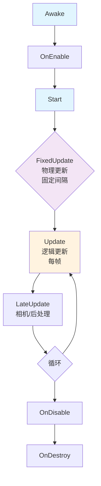

# 基于组件的架构

> 所属计划: 游戏架构设计
> 预计耗时: 75min
> 前置知识: [[09-object-ownership-models|第9章 游戏对象归属模型]]

---

## 1. 概念讲解

### 为什么需要这个？

在传统面向对象设计中，游戏对象通常通过继承来表达"是一个"的关系：`Player` 继承 `Character`，`Character` 继承 `Actor`，`Actor` 继承 `GameObject`。这种**深继承层次**很快变成噩梦——当你需要"会飞的敌人"时，是继承 `FlyingEnemy` 还是 `Enemy`？当飞行行为和敌人行为来自不同分支时，多重继承或接口组合让代码支离破碎。

更深层的问题是**变化轴的交织**。一个对象的行为维度很多：移动方式（走、飞、瞬移）、战斗能力（近战、远程、治疗）、交互方式（可拾取、可破坏、可对话）。用继承表达这些维度的笛卡尔积，会产生类爆炸。

组件模式（Component Pattern）彻底翻转这个思路：**实体是轻量容器，行为由附加的组件动态组合**。一个"会飞的弓箭手"不再是 `FlyingArcher` 类，而是一个 `Entity` 挂载了 `Movement`（飞行变体）、`Combat`（远程变体）、`Health` 组件。这引出了游戏架构的核心原则之一：**组合优于继承**。

### 核心思想

组件架构有五个核心要点，源自 Robert Nystrom 的经典总结并经过引擎实践演化：

**1. 实体即容器，组件即能力**

实体（Entity）本身几乎无逻辑，仅作为组件的挂载点和标识符。组件（Component）封装单一领域的行为与数据。这与 [[04-solid-grasp-pragmatic|第4章 SOLID 原则]] 中的单一职责原则（SRP）直接呼应——每个组件只负责一个变化原因。

**2. 组件通过定义良好的接口通信**

组件之间不直接依赖具体类型，而是通过事件、接口或消息总线交互。这避免了"组件知道另一个组件存在"的紧耦合。Nystrom 强调：组件是自治的，但非孤立的——它们需要协调机制。

**3. 运行时动态组合**

组件可在运行时添加、移除、替换。这意味着：
- 游戏对象的能力可以动态变化（如拾取装备获得新组件）
- 编辑器中可视化配置对象行为
- 团队按领域分工，互不阻塞

**4. 生命周期驱动执行**

组件有明确的生命周期钩子，引擎按确定顺序调用。Unity 的 `MonoBehaviour` 生命周期是典型代表：



| 阶段 | 调用时机 | 典型用途 |
| --- | --- | --- |
| `Awake` | 对象加载时，无论是否启用 | 初始化自身引用、缓存 |
| `OnEnable` | 组件被启用时 | 注册事件、进入对象池复用 |
| `Start` | 第一次 `Update` 前 | 依赖其他组件已就绪的初始化 |
| `FixedUpdate` | 固定时间间隔（默认 0.02s） | 物理相关更新 |
| `Update` | 每帧（可变间隔） | 游戏逻辑、输入响应 |
| `LateUpdate` | 所有 `Update` 后 | 相机跟随、UI 同步 |
| `OnDisable` | 组件被禁用时 | 注销事件、清理 |
| `OnDestroy` | 对象销毁时 | 最终资源释放 |

**5. 从组件到数据局部性**

当组件数量、同屏实体数量、性能要求上升时，组件架构天然演化到 **ECS（Entity-Component-System）**。关键洞察是：把组件拆为**纯数据**（Component = struct of data），把逻辑抽离为**系统**（System = logic over homogeneous data）。这实现了 [[28-data-oriented-design|面向数据设计]] 的核心优化——数据局部性（Data Locality），让 CPU 缓存行高效利用。我们将在 [[11-ecs-deep-dive|第11章]] 深入 ECS。

---

## 2. 代码示例

以下是一个纯 C# 控制台实现的 `Entity-Component` 框架，演示核心机制：组件容器、类型安全查询、生命周期更新、事件通信。

```csharp
using System;
using System.Collections.Generic;
using System.Linq;

// ==================== 核心框架 ====================

/// <summary>
/// 组件接口：所有组件必须实现，定义与实体的双向关联和生命周期
/// </summary>
public interface IComponent
{
    Entity Owner { get; set; }
    void OnEnable();   // 组件被添加到实体时
    void Update(float dt);
    void OnDisable();  // 组件被移除或实体销毁时
}

/// <summary>
/// 实体：轻量容器，管理组件的添加、查询、更新
/// </summary>
public class Entity
{
    private readonly List<IComponent> components = new();
    private bool isDestroyed = false;

    public string Name { get; set; } = "Entity";

    /// <summary>
    /// 类型安全地添加组件，自动设置 Owner 并触发 OnEnable
    /// </summary>
    public T AddComponent<T>() where T : class, IComponent, new()
    {
        var component = new T();
        component.Owner = this;
        components.Add(component);
        component.OnEnable();
        return component;
    }

    /// <summary>
    /// 类型安全地获取组件，使用 LINQ 按类型筛选
    /// 注意：生产环境应使用字典优化，避免 O(n) 扫描
    /// </summary>
    public T GetComponent<T>() where T : class, IComponent
    {
        return components.OfType<T>().FirstOrDefault();
    }

    /// <summary>
    /// 获取所有组件的副本（避免遍历时修改集合）
    /// </summary>
    public IReadOnlyList<IComponent> GetComponents() => components.AsReadOnly();

    public void Update(float dt)
    {
        if (isDestroyed) return;
        // 遍历副本，允许组件在 Update 中移除自身
        foreach (var c in components.ToList())
        {
            c.Update(dt);
        }
    }

    /// <summary>
    /// 销毁实体：按逆序触发 OnDisable，清理组件
    /// </summary>
    public void Destroy()
    {
        if (isDestroyed) return;
        isDestroyed = true;
        
        // 逆序禁用，类似栈的析构顺序
        for (int i = components.Count - 1; i >= 0; i--)
        {
            components[i].OnDisable();
        }
        components.Clear();
        
        Console.WriteLine($"[{Name}] Destroyed");
    }

    public bool IsDestroyed => isDestroyed;
}

// ==================== 具体组件 ====================

/// <summary>
/// 生命值组件：封装 HP 数据变化，通过事件通知订阅者
/// </summary>
public class Health : IComponent
{
    public Entity Owner { get; set; }
    
    public int Max { get; private set; } = 100;
    public int Current { get; private set; } = 100;
    
    // 事件驱动：生命值变化时通知，无需知道订阅者是谁
    public event Action<int, int> OnChanged; // (newValue, maxValue)
    public event Action OnDepleted;           // 生命值归零

    public void SetMax(int max)
    {
        Max = max;
        Current = max;
    }

    public void TakeDamage(int amount)
    {
        if (amount <= 0) return;
        Current = Math.Max(0, Current - amount);
        OnChanged?.Invoke(Current, Max);
        
        if (Current <= 0)
        {
            OnDepleted?.Invoke();
        }
    }

    public void Heal(int amount)
    {
        if (amount <= 0) return;
        Current = Math.Min(Max, Current + amount);
        OnChanged?.Invoke(Current, Max);
    }

    public void OnEnable() { }
    public void Update(float dt) { }
    public void OnDisable() 
    { 
        // 清理事件订阅，避免内存泄漏
        OnChanged = null;
        OnDepleted = null;
    }
}

/// <summary>
/// 血条 UI 组件：订阅 Health 事件，展示事件通信模式
/// </summary>
public class HealthBar : IComponent
{
    public Entity Owner { get; set; }
    private Health health;

    public void Bind(Health target)
    {
        // 先解绑旧引用
        Unbind();
        
        health = target;
        if (health != null)
        {
            health.OnChanged += OnHealthChanged;
            Console.WriteLine($"[HealthBar] Bound to {health.Owner?.Name}");
        }
    }

    public void Unbind()
    {
        if (health != null)
        {
            health.OnChanged -= OnHealthChanged;
            health = null;
        }
    }

    private void OnHealthChanged(int current, int max)
    {
        float percent = max > 0 ? (float)current / max : 0f;
        string bar = RenderBar(percent);
        Console.WriteLine($"[HealthBar] {health.Owner?.Name}: {bar} {current}/{max} ({percent:P0})");
    }

    private string RenderBar(float percent)
    {
        int filled = (int)(percent * 10);
        int empty = 10 - filled;
        return $"[{"#".Repeat(filled)}{"-".Repeat(empty)}]";
    }

    public void OnEnable() { }
    public void Update(float dt) { }
    public void OnDisable() => Unbind();
}

// 字符串扩展辅助
public static class StringExtensions
{
    public static string Repeat(this char c, int count) => new string(c, Math.Max(0, count));
}

/// <summary>
/// 伤害输出组件：演示组件间通过事件而非直接调用的松耦合
/// </summary>
public class DamageDealer : IComponent
{
    public Entity Owner { get; set; }
    public int BaseDamage { get; set; } = 10;

    public void Attack(Entity target)
    {
        var targetHealth = target.GetComponent<Health>();
        if (targetHealth != null)
        {
            Console.WriteLine($"[DamageDealer] {Owner?.Name} attacks {target.Name} for {BaseDamage} damage");
            targetHealth.TakeDamage(BaseDamage);
        }
        else
        {
            Console.WriteLine($"[DamageDealer] {target.Name} has no Health component!");
        }
    }

    public void OnEnable() { }
    public void Update(float dt) { }
    public void OnDisable() { }
}

// ==================== 程序入口 ====================

class Program
{
    static void Main()
    {
        Console.WriteLine("=== Entity-Component Framework Demo ===\n");

        // 创建玩家实体
        var player = new Entity { Name = "Player" };
        var playerHealth = player.AddComponent<Health>();
        playerHealth.SetMax(100);
        
        var playerBar = player.AddComponent<HealthBar>();
        playerBar.Bind(playerHealth);  // 显式绑定，组件间建立关系

        // 创建敌人实体
        var enemy = new Entity { Name = "Goblin" };
        var enemyHealth = enemy.AddComponent<Health>();
        enemyHealth.SetMax(50);
        
        var enemyBar = enemy.AddComponent<HealthBar>();
        enemyBar.Bind(enemyHealth);

        var enemyAttack = enemy.AddComponent<DamageDealer>();
        enemyAttack.BaseDamage = 15;

        Console.WriteLine("\n--- Initial State ---");
        player.Update(0f);
        enemy.Update(0f);

        Console.WriteLine("\n--- Combat: Goblin attacks Player ---");
        enemyAttack.Attack(player);
        
        Console.WriteLine("\n--- Player heals 10 ---");
        playerHealth.Heal(10);

        Console.WriteLine("\n--- Direct damage to Goblin (30) ---");
        enemyHealth.TakeDamage(30);

        Console.WriteLine("\n--- Frame Update (components process) ---");
        player.Update(0.016f);  // 约60fps
        enemy.Update(0.016f);

        Console.WriteLine("\n--- Destroy enemy ---");
        enemy.Destroy();
        
        // 验证：敌人销毁后，玩家事件是否仍正常工作
        Console.WriteLine("\n--- Player takes damage after enemy destroyed ---");
        playerHealth.TakeDamage(25);

        Console.WriteLine("\n=== Demo Complete ===");
    }
}
```

**运行方式:**

```bash
# 创建新项目
dotnet new console -n ComponentDemo
cd ComponentDemo

# 将上述代码覆盖 Program.cs，然后运行
dotnet run
```

**预期输出:**

```text
=== Entity-Component Framework Demo ===

[HealthBar] Bound to Player
[HealthBar] Bound to Goblin

--- Initial State ---

--- Combat: Goblin attacks Player ---
[DamageDealer] Goblin attacks Player for 15 damage
[HealthBar] Player: [########--] 85/100 (85%)

--- Player heals 10 ---
[HealthBar] Player: [#########-] 95/100 (95%)

--- Direct damage to Goblin (30) ---
[HealthBar] Goblin: [####------] 20/50 (40%)

--- Frame Update (components process) ---

--- Destroy enemy ---
[Goblin] Destroyed

--- Player takes damage after enemy destroyed ---
[HealthBar] Player: [########--] 70/100 (70%)

=== Demo Complete ===
```

---

## 3. 练习

### 练习 1: 基础

给 `Health` 增加 `Max` 字段（已完成于示例中），并创建一个 `DeathComponent`。要求：
- `DeathComponent` 订阅 `Health.OnChanged` 或 `Health.OnDepleted`
- 当 `Health.Current <= 0` 时，触发销毁事件或调用 `Owner.Destroy()`
- 确保 `DeathComponent` 在 `OnDisable` 时正确清理事件订阅

### 练习 2: 进阶

用**事件总线（Event Bus）**替代直接组件引用。要求：
- 定义 `DamageEvent` 结构体，包含 `TargetEntity` 和 `Amount`
- 实现泛型 `EventBus<T>`，支持 `Subscribe`、`Unsubscribe`、`Publish`
- 修改 `Health`：在 `OnEnable` 注册 `EventBus<DamageEvent>` 的订阅，在 `OnDisable` 取消注册
- 修改 `DamageDealer`：不再直接调用 `targetHealth.TakeDamage`，而是发布 `DamageEvent`
- 外部代码发送 `DamageEvent` 即可造成伤害，无需知道 `Health` 组件存在

### 练习 3: 挑战（可选）

分析 MonoBehaviour 项目中"God MonoBehaviour"的成因，并给出重构方向。结合你见过的或能想象的实际场景，说明：
- 什么迹象表明一个 MonoBehaviour 正在变成"God Component"
- 按什么原则拆分
- 拆分后组件间如何通信，避免重新变成" spaghetti code"

---

## 3.5 参考答案

> [!tip]- 练习 1 参考答案
> `DeathComponent` 的核心是在生命周期中管理事件订阅，避免内存泄漏和空引用。
>
> ```csharp
> public class DeathComponent : IComponent
> {
>     public Entity Owner { get; set; }
>     private Health health;
>     public event Action<Entity> OnDied;  // 外部可订阅的死亡事件
>
>     public void OnEnable()
>     {
>         // 延迟绑定：等待其他组件就绪
>         // 实际项目中可用 RequireComponent 模式或初始化阶段
>     }
>
>     public void Bind(Health target)
>     {
>         Unbind();
>         health = target;
>         if (health != null)
>         {
>             health.OnDepleted += HandleDepleted;
>             health.OnChanged += HandleChanged;  // 双重保险
>         }
>     }
>
>     private void HandleChanged(int current, int max)
>     {
>         if (current <= 0) HandleDepleted();
>     }
>
>     private void HandleDepleted()
>     {
>         Console.WriteLine($"[DeathComponent] {Owner?.Name} has died!");
>         OnDied?.Invoke(Owner);
>         Owner?.Destroy();
>     }
>
>     public void Unbind()
>     {
>         if (health != null)
>         {
>             health.OnDepleted -= HandleDepleted;
>             health.OnChanged -= HandleChanged;
>             health = null;
>         }
>     }
>
>     public void Update(float dt) { }
>     public void OnDisable() => Unbind();
> }
> ```
>
> 使用方式：
> ```csharp
> var death = player.AddComponent<DeathComponent>();
> death.Bind(playerHealth);
> death.OnDied += e => Console.WriteLine($"Game over: {e.Name} died");
> ```

> [!tip]- 练习 2 参考答案
> 事件总线实现泛型单例模式，解耦事件发布者与订阅者：
>
> ```csharp
> // 泛型事件总线：每个事件类型有独立的订阅列表
> public static class EventBus<T> where T : struct
> {
>     private static readonly List<Action<T>> subscribers = new();
>     private static readonly List<Action<T>> pendingAdds = new();
>     private static readonly List<Action<T>> pendingRemoves = new();
>     private static bool isPublishing = false;
>
>     public static void Subscribe(Action<T> handler)
>     {
>         if (isPublishing)
>             pendingAdds.Add(handler);
>         else
>             subscribers.Add(handler);
>     }
>
>     public static void Unsubscribe(Action<T> handler)
>     {
>         if (isPublishing)
>             pendingRemoves.Add(handler);
>         else
>             subscribers.Remove(handler);
>     }
>
>     public static void Publish(T evt)
>     {
>         isPublishing = true;
>         try
>         {
>             foreach (var sub in subscribers.ToList())  // 快照避免修改异常
>             {
>                 try { sub(evt); }
>                 catch (Exception ex) { Console.WriteLine($"Event handler error: {ex.Message}"); }
>             }
>         }
>         finally
>         {
>             isPublishing = false;
>             // 处理发布期间的变化
>             foreach (var add in pendingAdds) subscribers.Add(add);
>             foreach (var rem in pendingRemoves) subscribers.Remove(rem);
>             pendingAdds.Clear();
>             pendingRemoves.Clear();
>         }
>     }
>
>     public static void Clear()
>     {
>         subscribers.Clear();
>         pendingAdds.Clear();
>         pendingRemoves.Clear();
>     }
> }
>
> public struct DamageEvent
> {
>     public Entity Target;
>     public int Amount;
>     public Entity Source;  // 可选：伤害来源，用于战斗日志、仇恨系统
> }
> ```
>
> 修改后的 `Health`：
> ```csharp
> public class Health : IComponent
> {
>     public Entity Owner { get; set; }
>     public int Max { get; private set; } = 100;
>     public int Current { get; private set; } = 100;
>     public event Action<int, int> OnChanged;
>     public event Action OnDepleted;
>
>     public void OnEnable()
>     {
>         EventBus<DamageEvent>.Subscribe(OnDamageEvent);
>     }
>
>     public void OnDisable()
>     {
>         EventBus<DamageEvent>.Unsubscribe(OnDamageEvent);
>     }
>
>     private void OnDamageEvent(DamageEvent evt)
>     {
>         if (evt.Target != this.Owner) return;  // 只处理针对自己的伤害
>         TakeDamage(evt.Amount);
>     }
>
>     public void TakeDamage(int amount)
>     {
>         if (amount <= 0) return;
>         Current = Math.Max(0, Current - amount);
>         OnChanged?.Invoke(Current, Max);
>         if (Current <= 0) OnDepleted?.Invoke();
>     }
>
>     // ... Heal, SetMax 等保持不变
>     public void Update(float dt) { }
> }
> ```
>
> 修改后的 `DamageDealer`：
> ```csharp
> public class DamageDealer : IComponent
> {
>     public Entity Owner { get; set; }
>     public int BaseDamage { get; set; } = 10;
>
>     public void Attack(Entity target)
>     {
>         Console.WriteLine($"[DamageDealer] {Owner?.Name} attacks {target.Name}");
>         EventBus<DamageEvent>.Publish(new DamageEvent 
>         { 
>             Target = target, 
>             Amount = BaseDamage,
>             Source = this.Owner 
>         });
>     }
>
>     public void OnEnable() { }
>     public void Update(float dt) { }
>     public void OnDisable() { }
> }
> ```
>
> 关键优势：现在**任何系统**都能造成伤害——陷阱、环境伤害、持续伤害（DoT）——无需引用 `Health` 组件。这是 [[14-event-driven-architecture|第14章 事件驱动架构]] 的基础模式。

> [!tip]- 练习 3 参考答案
> **"God MonoBehaviour" 的成因分析**
>
> **典型症状：**
> - 一个脚本超过 500 行，包含 `Update` 中处理移动、输入、动画、战斗、UI 更新
> - 大量 `public` 字段暴露到 Inspector，形成"配置面板"
> - 大量 `[SerializeField] private` 拖拽引用，重构时场景引用断裂
> - 类名模糊：`PlayerController`、`GameManager`、`EnemyAI`（什么都做）
>
> **根本成因：**
> 1. **便利陷阱**：Unity 的 Inspector 让"加一个字段"比"拆一个新组件"更快
> 2. **执行顺序依赖**：担心组件初始化顺序，干脆写在一起
> 3. **性能焦虑**：误以为 `GetComponent` 开销大，缓存所有引用
> 4. **原型膨胀**：快速原型代码未经重构直接生产化
>
> **重构方向（按单一职责拆分）：**
>
> | 原 God Component | 拆分后组件 | 职责 |
> | --- | --- | --- |
> | `PlayerController` (800行) | `PlayerMovement` | 输入→移动向量，应用速度 |
> | | `PlayerCombat` | 攻击判定、冷却、连击状态机 |
> | | `PlayerHealth` | HP、受伤、死亡（委托给 `Health`） |
> | | `PlayerAnimation` | 动画参数同步 |
> | | `PlayerInventory` | 物品管理、装备切换 |
> | | `PlayerAudio` | 音效触发 |
>
> **通信机制选择：**
> - **同实体组件**：通过 `GetComponent` 在 `Start` 中缓存（一次性的，非每帧）
> - **跨实体交互**：事件总线（如 `DamageEvent`、`ItemPickedUpEvent`）
> - **需要协调多个组件**：引入中介者（Mediator）如 `PlayerFacade`，但保持其薄层
>
> **迁移到 ECS 的时机：**
> 当拆分后的组件仍然面临：
> - 同屏实体数 > 10,000 需要批量更新
> - 需要多线程并行处理（如 `Parallel.For`）
> - 缓存未命中成为性能瓶颈
>
> 此时应将组件数据抽离为 `struct`，逻辑变为 `System`，即迁移到 [[11-ecs-deep-dive|ECS 架构]]。

> [!note] 答案使用方式
> 如果你的实现通过了测试或达到了题目要求，就是正确的。参考答案展示的是一种可行路径，不是唯一标准。特别注意：事件总线的线程安全、异常隔离、发布时订阅变化等细节，在实际项目中需根据并发场景调整。练习 3 的分析题鼓励结合具体项目经验，上述框架供对照。
>
> ---

## 4. 扩展阅读

- [Robert Nystrom — Component Pattern](https://gameprogrammingpatterns.com/component.html) — 组件模式的经典论述，含与其他模式的对比
- [Unity Manual — Execution Order](https://docs.unity3d.com/6000.5/Documentation/Manual/execution-order.html) — 官方生命周期文档，含自定义脚本执行顺序
- [Unity Discussions — Understanding True Component Based Design](https://discussions.unity.com/t/understanding-true-component-based-design/524864) — 社区对 Unity 实践中组件化设计的深度讨论
- [Mike Acton — Data-Oriented Design and C++](https://www.youtube.com/watch?v=rX0ItVEVjHc) — CppCon 2014 演讲，理解组件架构为何演化到 ECS（视频，但文字摘要丰富）

---

## 常见陷阱

- **在 `Update` 中频繁 `GetComponent<T>`**：每次调用都触发类型查找（Unity 内部为 C++ 层遍历），在热路径上造成显著开销。**正确做法**：在 `Awake` 或 `Start` 中缓存组件引用一次，或改用 ECS 的按类型连续存储。

- **Inspector 拖拽引用形成隐式紧耦合**：场景中的拖拽引用在重构类名、移动文件夹、版本控制合并时极易断裂，且无法静态检查。**正确做法**：关键依赖通过代码 `GetComponent` 或 `FindObjectOfType`（初始化时一次性）获取；跨系统依赖用事件总线或 Service Locator（见 [[15-service-locator-singletons|第15章]]）。

- **组件膨胀为"God Component"**：把行为和数据都塞进一个组件，既违反单一职责，也阻塞了数据局部性优化。**正确做法**：按变化原因拆分（移动、战斗、库存各一组件）；数据与行为分离，为 ECS 迁移预留空间；定期用代码度量工具（如圈复杂度、类长度）监控。

- **忽视生命周期事件的清理**：`OnEnable`/`OnDisable` 中注册/注销事件不对称，导致已销毁对象的事件处理器仍被调用，产生空引用或逻辑错误。**正确做法**：所有 `+=` 必须有对应的 `-=`，且 `-=` 放在 `OnDisable` 而非 `OnDestroy`（对象池复用场景）。