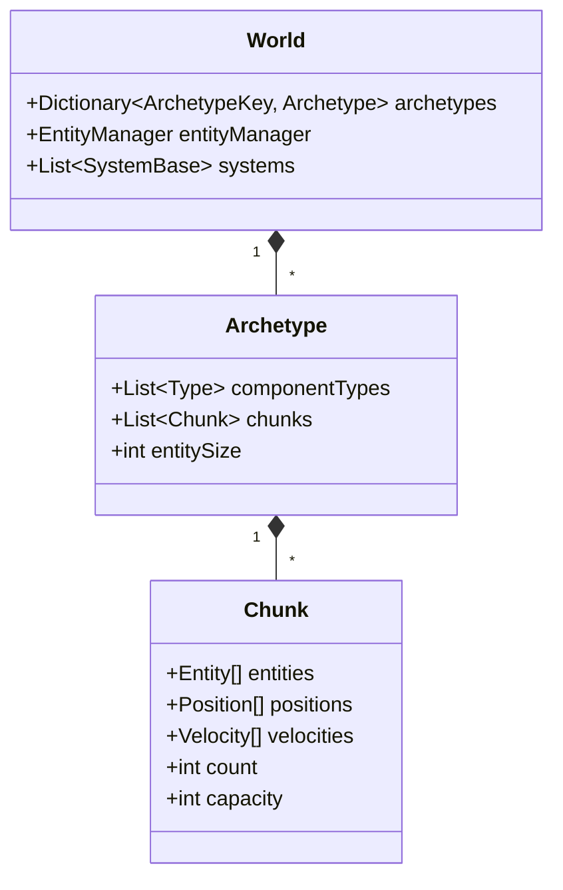

> 所属计划: 游戏架构设计
> 预计耗时: 90min
> 前置知识: [[10-component-based|第10章 基于组件的架构]]

---

## 1. 概念讲解

### 为什么需要这个？

在 [[10-component-based]] 中，我们探讨了基于组件的架构（Component-Based Architecture）：实体是一个对象，内部持有组件引用，逻辑分散在各个组件的 `Update()` 方法中。这种模型解决了继承僵化的问题，但随着项目规模扩大，它会遇到三个结构性瓶颈：

1. **缓存不友好**：组件以对象引用分散在堆上，遍历所有 `Position` 组件时，CPU 需要跳转到随机内存地址，cache miss 率高
2. **逻辑耦合**：组件既含数据又含行为，"一个实体如何移动"的知识散落在多个组件类中
3. **组合爆炸**：用继承或接口表达"有 A 无 B"的查询需求，导致类型层次膨胀

ECS（Entity-Component-System）是对这些问题的根本回应。它不是"另一种组件模式"，而是**数据与逻辑的彻底分离**——这一思想直接继承自 [[28-data-oriented-design|面向数据设计（DoD）]] 的核心主张：优先优化数据布局，让代码跟随数据流动。

### 核心思想

ECS 三要素的精确定义（引自 Sander Mertens 的 ECS FAQ）：

| 要素 | 定义 | 关键约束 |
|:---|:---|:---|
| **Entity** | 全局唯一标识符（通常是一个整数 ID） | 无状态、无行为、无类型信息 |
| **Component** | 纯数据类型（struct），附加到 Entity | 禁止包含方法；禁止持有引用/指针 |
| **System** | 按组件类型集合匹配的逻辑处理器 | 无状态；只读取/修改匹配到的组件数据 |

与传统 Component-Based 的本质区别：

```
Component-Based:  Entity对象 → 持有 Component 引用 → Component 含 Update()
ECS:              Entity ID  → 被 Archetype 索引 → System 批量处理同类型数据
```

**Archetype（原型）**：一种唯一的组件类型组合。例如 `(Position, Velocity)` 是一个 Archetype，`(Position, Velocity, Health)` 是另一个。所有相同 Archetype 的 Entity 被存储到同一个或多个 **Chunk** 中。

**Chunk 存储与 SoA**：每个 Chunk 是固定大小的内存块（如 16KB），内部采用 **Structure of Arrays（SoA）** 布局：



Chunk 内的 SoA 布局意味着：遍历所有 `Position` 时，访问的是连续内存 `positions[0], positions[1], positions[2]...`，而非通过对象引用跳转。这使得：

- **缓存命中率高**：一次缓存行加载（64 bytes）可包含多个 `Position` 数据
- **SIMD 友好**：编译器可自动向量化连续数组操作
- **分支预测友好**：System 处理同质数据，条件分支模式稳定

**Query / System 调度**：System 声明查询条件，如"我关心拥有 `Position` 和 `Velocity`，但不拥有 `Static` 的实体"。框架返回所有匹配的 Archetype/Chunk，System 按顺序批量遍历。这种**声明式查询**避免了显式过滤实体的开销。

**动态结构变化的代价**：当对 Entity 执行 `AddComponent<T>()` 或 `RemoveComponent<T>()` 时，其 Archetype 改变，必须从原 Chunk 迁移数据到新 Chunk。频繁的结构性修改导致：

- 数据搬迁（memcpy 开销）
- Chunk 碎片化（部分填充的 Chunk 浪费内存）
- 缓存失效（迁移后的数据不再连续）

**业界案例：Overwatch 的 ECS 实践**

Tim Ford 在 GDC 2017 分享中揭示，Overwatch 将 ECS 作为 gameplay 核心架构的关键原因：

1. **英雄多样性**：Component 组合替代继承，新英雄 = 新组件组合，无需修改现有代码
2. **网络同步**：ECS 的紧凑数据布局使状态快照序列化高效；System 按固定步长更新，天然支持客户端预测与服务器回滚
3. **回放系统**：保存 Component 状态数组即可完整重建游戏帧，无需序列化复杂对象图

Unity DOTS（Data-Oriented Tech Stack）同样采用 Archetype+Chunk 模型，其 `EntityManager` 和 `SystemBase` 设计直接对应本章概念。

---

## 2. 代码示例

以下实现一个**教学级极简 Archetype ECS**，展示核心机制：World 管理 Archetype，Archetype 内聚合同类型实体，System 通过 Query 批量处理。注意：此为演示实现，缺少 Chunk 分页、内存池、多线程调度等生产特性，**不能替代 DOTS 或 Flecs**。

```csharp
using System;
using System.Collections.Generic;
using System.Linq;

// ========== 纯数据组件（值类型，无行为） ==========
public record struct Position(float X, float Y);
public record struct Velocity(float VX, float VY);
public record struct Lifetime(float Remaining);

// ========== Archetype：同一组件组合的实体集合 ==========
public class Archetype
{
    // 该 Archetype 包含的组件类型（用于查询匹配）
    public List<Type> Types { get; } = new();
    
    // SoA 存储：每个组件类型一个连续数组
    public List<Position> Positions { get; } = new();
    public List<Velocity> Velocities { get; } = new();
    public List<Lifetime> Lifetimes { get; } = new();
    
    // 实体 ID 数组，与组件数组索引一一对应
    public List<int> Entities { get; } = new();
    
    // 辅助：检查是否包含某类型
    public bool Has<T>() => Types.Contains(typeof(T));
    public bool Has(Type t) => Types.Contains(t);
}

// ========== World：管理所有 Archetype 和实体生命周期 ==========
public class World
{
    private readonly List<Archetype> archetypes = new();
    private int nextEntity = 1;

    // 创建实体，根据组件存在性分配到对应 Archetype
    public int CreateEntity(bool hasPos, bool hasVel, bool hasLife = false)
    {
        var arch = GetOrCreateArchetype(hasPos, hasVel, hasLife);
        int e = nextEntity++;
        arch.Entities.Add(e);
        
        // 索引对齐：所有数组同步添加默认值
        if (hasPos) arch.Positions.Add(new Position());
        else arch.Positions.Add(default); // 占位保持索引
        
        if (hasVel) arch.Velocities.Add(new Velocity());
        else arch.Velocities.Add(default);
        
        if (hasLife) arch.Lifetimes.Add(new Lifetime(5.0f));
        else arch.Lifetimes.Add(default);
        
        return e;
    }

    // 获取或创建匹配指定组件组合的 Archetype
    private Archetype GetOrCreateArchetype(bool hasPos, bool hasVel, bool hasLife)
    {
        var arch = archetypes.Find(a =>
            a.Has<Position>() == hasPos &&
            a.Has<Velocity>() == hasVel &&
            a.Has<Lifetime>() == hasLife);
            
        if (arch == null)
        {
            arch = new Archetype();
            if (hasPos) arch.Types.Add(typeof(Position));
            if (hasVel) arch.Types.Add(typeof(Velocity));
            if (hasLife) arch.Types.Add(typeof(Lifetime));
            archetypes.Add(arch);
        }
        return arch;
    }

    // 查询：返回同时包含 T1 和 T2 的所有 Archetype
    public IEnumerable<Archetype> Query<T1, T2>()
    {
        return archetypes.Where(a => a.Has<T1>() && a.Has<T2>());
    }
    
    // 扩展查询：支持 With/Without 语义（用于练习2）
    public IEnumerable<Archetype> QueryWith<T1>(Type without = null)
    {
        return archetypes.Where(a => 
            a.Has<T1>() && 
            (without == null || !a.Has(without)));
    }
    
    // 调试用：获取所有 Archetype
    public IReadOnlyList<Archetype> GetArchetypes() => archetypes;
}

// ========== System 基类：无状态，只处理数据 ==========
public abstract class SystemBase
{
    public abstract void Update(World w, float dt);
}

// ========== 具体系统：批量更新 Position + Velocity ==========
public class MovementSystem : SystemBase
{
    public override void Update(World w, float dt)
    {
        foreach (var arch in w.Query<Position, Velocity>())
        {
            var pos = arch.Positions;
            var vel = arch.Velocities;
            
            // 关键：连续内存访问，编译器可自动向量化
            for (int i = 0; i < pos.Count; i++)
            {
                pos[i] = new Position(
                    pos[i].X + vel[i].VX * dt,
                    pos[i].Y + vel[i].VY * dt);
            }
        }
    }
}

// ========== 入口：演示运行 ==========
class Program
{
    static void Main()
    {
        var world = new World();
        var movement = new MovementSystem();
        
        // 创建 3 个实体：2 个可移动，1 个静态
        int e1 = world.CreateEntity(hasPos: true, hasVel: true);  // 会移动
        int e2 = world.CreateEntity(hasPos: true, hasVel: true);  // 会移动
        int e3 = world.CreateEntity(hasPos: true, hasVel: false); // 静态
        
        // 手动设置速度（实际应由初始化系统或数据文件驱动）
        foreach (var arch in world.Query<Position, Velocity>())
        {
            arch.Velocities[0] = new Velocity(1.0f, 0.5f);
            arch.Velocities[1] = new Velocity(-0.5f, 1.0f);
        }
        
        Console.WriteLine("=== 初始状态 ===");
        PrintState(world);
        
        // 模拟 2 帧，每帧 dt = 1.0
        for (int frame = 1; frame <= 2; frame++)
        {
            movement.Update(world, 1.0f);
            Console.WriteLine($"\n=== 第 {frame} 帧 ===");
            PrintState(world);
        }
    }
    
    static void PrintState(World w)
    {
        foreach (var arch in w.GetArchetypes())
        {
            Console.WriteLine($"Archetype: [{string.Join(", ", arch.Types.Select(t => t.Name))}]");
            for (int i = 0; i < arch.Entities.Count; i++)
            {
                var pos = arch.Positions[i];
                var vel = arch.Velocities[i];
                Console.WriteLine($"  Entity {arch.Entities[i]}: Pos=({pos.X:F2},{pos.Y:F2}) Vel=({vel.VX:F2},{vel.VY:F2})");
            }
        }
    }
}
```

**运行方式:**

```bash
# .NET 6+ 控制台项目
dotnet new console -n EcsDemo
# 将上述代码复制到 Program.cs
dotnet run
```

**预期输出:**

```text
=== 初始状态 ===
Archetype: [Position, Velocity]
  Entity 1: Pos=(0.00,0.00) Vel=(1.00,0.50)
  Entity 2: Pos=(0.00,0.00) Vel=(-0.50,1.00)
Archetype: [Position]
  Entity 3: Pos=(0.00,0.00) Vel=(0.00,0.00)

=== 第 1 帧 ===
Archetype: [Position, Velocity]
  Entity 1: Pos=(1.00,0.50) Vel=(1.00,0.50)
  Entity 2: Pos=(-0.50,1.00) Vel=(-0.50,1.00)
Archetype: [Position]
  Entity 3: Pos=(0.00,0.00) Vel=(0.00,0.00)

=== 第 2 帧 ===
Archetype: [Position, Velocity]
  Entity 1: Pos=(2.00,1.00) Vel=(1.00,0.50)
  Entity 2: Pos=(-1.00,2.00) Vel=(-0.50,1.00)
Archetype: [Position]
  Entity 3: Pos=(0.00,0.00) Vel=(0.00,0.00)
```

关键结构说明：

| 类型 | 职责 |
|:---|:---|
| `Archetype` | 管理同组件组合的实体集合，内部 SoA 存储 |
| `World` | 工厂：创建实体时分配到正确 Archetype；提供查询接口 |
| `SystemBase` | 抽象更新逻辑，强制无状态设计 |
| `MovementSystem` | 声明式查询 `Position` + `Velocity`，批量 SIMD-friendly 更新 |

---

## 3. 练习

### 练习 1: 基础

在 `World` 中实现批量创建 1024 个带 `Position`+`Velocity` 的实体，并验证它们落在同一个 Archetype 的 Chunk 列表里。编写测试代码断言：
- 世界中只有一个同时包含 `Position` 和 `Velocity` 的 Archetype
- 该 Archetype 的 `Entities.Count == 1024`

### 练习 2: 进阶

实现一个查询"有 `Position` 但没有 `Velocity`"的系统 `LifetimeSystem`。给这些实体附加 `Lifetime` 组件（或创建时即带），系统每帧递减 `Lifetime`，耗尽后将实体从 Chunk 中移除（简化版：直接移除，不处理 Chunk 紧缩）。

要求：
- 扩展 `World` 的查询能力，支持 `Without<T>` 语义
- `LifetimeSystem` 正确处理 SoA 数组的同步删除（Entity ID、Position、Lifetime 数组索引一致）

### 练习 3: 挑战（可选）

结合 [[27-networking-netcode|网络与网络代码]] 的背景，分析为什么 Overwatch 选择 ECS 作为 gameplay 架构的核心？特别从**网络同步**角度阐述：ECS 的数据布局如何支撑状态快照、客户端预测与服务器回滚？

---

## 3.5 参考答案

> [!tip]- 练习 1 参考答案
> 
> 核心思路：利用 `CreateEntity` 的批量调用，验证 Archetype 的唯一性和实体数量。
> 
> ```csharp
> using System;
> using System.Linq;
> using System.Diagnostics;
> 
> class TestBulkCreate
> {
>     static void Main()
>     {
>         var world = new World();
>         
>         // 批量创建 1024 个带 Position+Velocity 的实体
>         for (int i = 0; i < 1024; i++)
>             world.CreateEntity(hasPos: true, hasVel: true);
>         
>         // 验证：只有一个匹配 Archetype
>         var matchingArchetypes = world.GetArchetypes()
>             .Where(a => a.Has<Position>() && a.Has<Velocity>())
>             .ToList();
>         
>         Debug.Assert(matchingArchetypes.Count == 1, 
>             "应只有一个 (Position, Velocity) Archetype");
>         
>         var arch = matchingArchetypes[0];
>         Debug.Assert(arch.Entities.Count == 1024,
>             $"实体数量应为 1024，实际为 {arch.Entities.Count}");
>         
>         // 额外验证：无其他组件的实体不存在
>         var posOnlyArchetypes = world.GetArchetypes()
>             .Where(a => a.Has<Position>() && !a.Has<Velocity>())
>             .ToList();
>         Debug.Assert(posOnlyArchetypes.Count == 0,
>             "不应存在仅含 Position 的 Archetype");
>         
>         Console.WriteLine("所有断言通过！");
>     }
> }
> ```
> 
> 关键要点：
> - `CreateEntity(true, true)` 始终命中同一 Archetype，因为组件组合签名相同
> - 教学实现中未做 Chunk 分页，所有 1024 实体在同一个 `Archetype` 的列表中；生产环境（如 Unity DOTS）会在 Chunk 满时（如 16KB）分配新 Chunk
> - 断言失败意味着 `GetOrCreateArchetype` 的匹配逻辑有误，或存在多个相同签名的 Archetype（bug）

> [!tip]- 练习 2 参考答案
> 
> 核心思路：扩展查询支持 `Without<T>`，实现索引一致的 SoA 删除。
> 
> ```csharp
> // ========== 扩展 World 的查询能力 ==========
> public class World
> {
>     // ... 原有代码保持不变 ...
>     
>     // 新增：支持 With<T> / Without<T> 链式查询
>     public IEnumerable<Archetype> QueryWith<T>(Type without = null)
>     {
>         return archetypes.Where(a => 
>             a.Has<T>() && 
>             (without == null || !a.Has(without)));
>     }
> }
> 
> // ========== LifetimeSystem 实现 ==========
> public class LifetimeSystem : SystemBase
> {
>     public override void Update(World w, float dt)
>     {
>         // 查询：有 Position，但没有 Velocity
>         foreach (var arch in w.QueryWith<Position>(without: typeof(Velocity)))
>         {
>             var entities = arch.Entities;
>             var positions = arch.Positions;
>             var lifetimes = arch.Lifetimes;
>             
>             // 必须从后向前遍历，因为删除操作会改变后续索引
>             for (int i = entities.Count - 1; i >= 0; i--)
>             {
>                 var life = lifetimes[i];
>                 float newRemaining = life.Remaining - dt;
>                 
>                 if (newRemaining <= 0)
>                 {
>                     // 同步删除所有数组的 i 索引元素
>                     // 教学简化：List.RemoveAt 是 O(n)，生产环境用 swap-back 或 tombstone
>                     entities.RemoveAt(i);
>                     positions.RemoveAt(i);
>                     lifetimes.RemoveAt(i);
>                     Console.WriteLine($"Entity 已销毁（Lifetime 耗尽）");
>                 }
>                 else
>                 {
>                     lifetimes[i] = new Lifetime(newRemaining);
>                 }
>             }
>         }
>     }
> }
> 
> // ========== 测试入口 ==========
> class LifetimeTest
> {
>     static void Main()
>     {
>         var world = new World();
>         
>         // 创建 3 个静态实体（有 Position，无 Velocity），带 Lifetime
>         for (int i = 0; i < 3; i++)
>             world.CreateEntity(hasPos: true, hasVel: false, hasLife: true);
>         
>         var lifeSystem = new LifetimeSystem();
>         
>         Console.WriteLine("=== 初始 ===");
>         PrintStaticEntities(world);
>         
>         // 模拟 3 帧，dt=2.0，Lifetime 初始值为 5.0
>         // 第 3 帧时全部耗尽
>         for (int frame = 1; frame <= 3; frame++)
>         {
>             lifeSystem.Update(world, 2.0f);
>             Console.WriteLine($"\n=== 第 {frame} 帧 (dt=2.0) ===");
>             PrintStaticEntities(world);
>         }
>     }
>     
>     static void PrintStaticEntities(World w)
>     {
>         foreach (var arch in w.QueryWith<Position>(typeof(Velocity)))
>         {
>             Console.WriteLine($"静态实体数: {arch.Entities.Count}");
>             for (int i = 0; i < arch.Entities.Count; i++)
>             {
>                 Console.WriteLine($"  Entity {arch.Entities[i]}: " +
>                     $"Life={arch.Lifetimes[i].Remaining:F2}");
>             }
>         }
>     }
> }
> ```
> 
> 关键要点：
> - **从后向前遍历**：`RemoveAt(i)` 会改变后续元素索引，正向遍历会跳过元素或越界
> - **同步删除**：Entity ID、Position、Lifetime 三个数组必须同时删除同一索引，保持 SoA 的一致性
> - **swap-back 优化**：生产环境（如 Flecs）通常将末尾元素 swap 到删除位置，避免 O(n) 移动；但会破坏遍历顺序，需权衡
> - **Tombstone 方案**：另一种优化是标记删除（`entities[i] = -1`），批量清理时重建数组，减少频繁搬迁

> [!tip]- 练习 3 参考答案
> 
> Overwatch 选择 ECS 作为 gameplay 架构的核心，从网络同步角度可分析为三个层面：
> 
> **1. 状态快照的紧凑序列化**
> 
> ECS 的 SoA 布局使游戏状态是"扁平的结构化数组"，而非复杂的对象引用图。服务器每帧只需序列化：
> - 哪些 Archetype 存在
> - 每个 Chunk 中组件数组的原始字节
> 
> 对比 Component-Based 的对象图序列化：需要遍历引用、处理循环依赖、类型信息开销大。ECS 的状态快照是**内存对齐的连续字节**，可直接 `memcpy` 到网络缓冲区，带宽效率极高。
> 
> **2. 固定步长更新与确定性回放**
> 
> Overwatch 的 System 按固定 16ms（60Hz）步长更新，输入作为外部事件注入。这种设计带来：
> - **客户端预测**：本地提前模拟输入，收到服务器权威状态时比对，差异用快照插值修正
> - **服务器回滚**：检测到命中判定时，服务器回滚到历史帧（rewind），重新执行 System 更新，确认命中有效性
> - **确定性**：纯函数式 System（无全局随机、无静态状态）保证相同输入产生相同输出，回滚可精确复现
> 
> ECS 的 System 无状态特性使回滚只需恢复 Component 数据，无需保存/恢复对象的行为上下文。
> 
> **3. 英雄能力的数据驱动组合**
> 
> 每个英雄 = 特定组件组合 + 对应 System 的查询匹配。网络同步层面：
> - 新英雄的组件类型集是已知的，序列化格式无需协议修改
> - 技能效果通过添加/移除 Component 实现（如 `Stunned` 组件），状态变化天然是结构化的
> - 回滚时，Add/Remove Component 的操作也可逆：记录操作日志，反向执行即可撤销
> 
> 这与 [[17-command-ability-system|Command 与技能系统]] 中"命令模式记录操作历史"的思想形成呼应，但 ECS 将命令效果直接映射到 Component 状态变更，使网络同步与本地逻辑统一。

> [!note] 答案使用方式
> 如果你的实现通过了测试或达到了题目要求，就是正确的。参考答案展示的是**一种可行路径**，而非唯一标准。特别是练习 2 的删除策略，swap-back、tombstone、标记延迟清理都是合理选择，需根据具体性能需求权衡。练习 3 的分析角度也可从 CPU 缓存、多线程并行化（[[29-multithreading-job-system|Job 系统]]）或 Mod 扩展性（[[18-scripting-mod-architecture|脚本与 Mod 架构]]）展开，网络同步只是最贴合 Overwatch 案例的切入点。
>
> ---

## 4. 扩展阅读

- [Sander Mertens — ECS FAQ](https://github.com/SanderMertens/ecs-faq) — ECS 定义的权威参考，涵盖 Entity、Component、System 的精确区分，以及 SoA、Archetype、Chunk 等实现术语
- [Unity Manual — Archetypes concepts](https://docs.unity3d.com/Packages/com.unity.entities@1.0/manual/concepts-archetypes.html) — Unity DOTS 官方文档，解释 Archetype 如何决定 Chunk 分配、内存布局与查询匹配
- [Overwatch Gameplay Architecture and Netcode (GDC 2017)](https://www.youtube.com/watch?v=W3aieHjyNvw) — Tim Ford 的原始演讲，详述 ECS 如何支撑英雄系统、网络同步与回滚机制
- [Sander Mertens — Archetypes and Vectorization](https://medium.com/@ajmmertens/building-an-ecs-2-archetypes-and-vectorization-fe21690805f9) — 从零构建 ECS 的系列文章，深入 Chunk 设计、SoA 布局与自动向量化优化

---

## 常见陷阱

- **把逻辑写进 Component，退化为 Component-Based 而非 ECS**。正确做法：Component 必须是纯数据（`record struct` 或 `struct`），所有行为在 System 中实现。若发现 `Position.Update()` 或 `Health.TakeDamage()`，即已违反 ECS 核心约束。

- **忽视结构变化的代价：频繁 `AddComponent`/`RemoveComponent` 导致大量 Chunk 间数据搬迁**。正确做法：批量初始化实体时确定完整组件组合；运行时变化用"标记组件"（如 `IsDirty` flag）替代结构修改，或采用延迟批处理（帧末统一迁移）。

- **Archetype 爆炸：组件组合过多导致 Chunk 碎片化，内存和查询效率下降**。正确做法：控制组件类型数量，用"可选组件"替代布尔标记组合；对 rarely-used 数据采用共享组件（Shared Component）或存储在并行数组中，避免每个微小差异都生成新 Archetype。Unity DOTS 的 `ISharedComponentData` 和 Flecs 的 `tag` 机制都是应对此问题的工程方案。