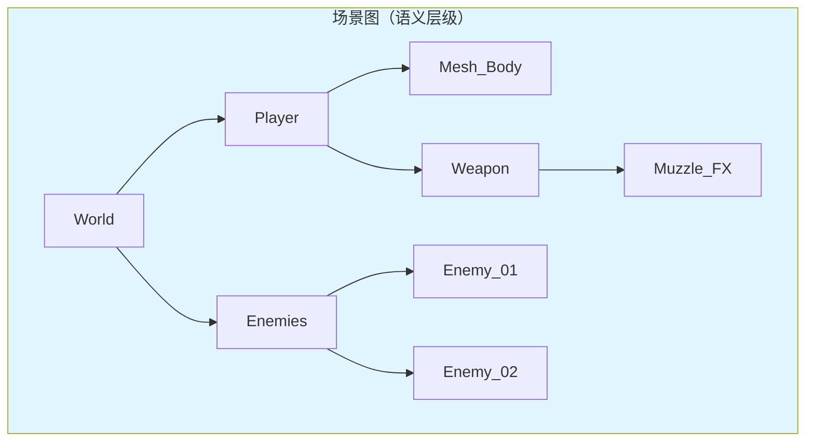
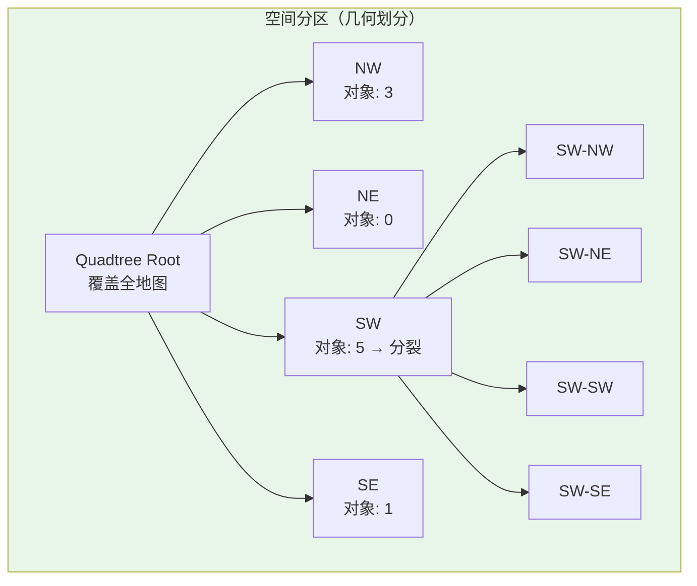
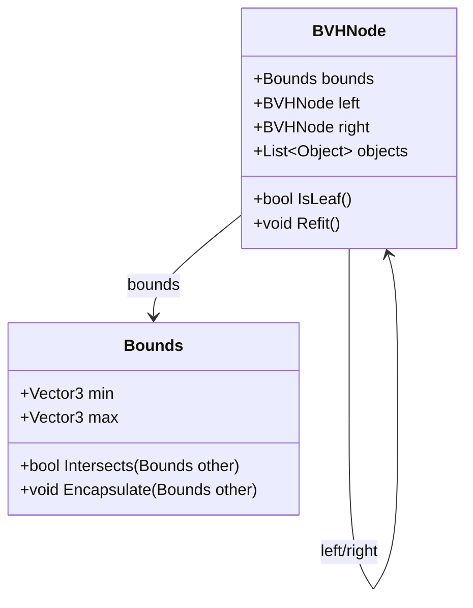
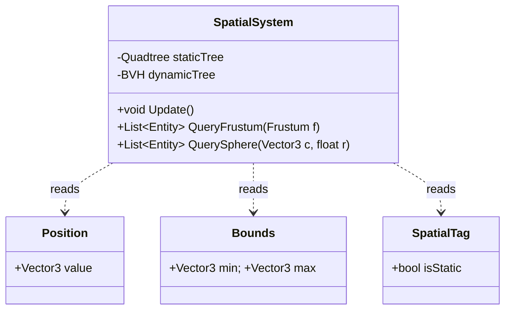

# 场景图与空间分区

> 所属计划: 游戏架构设计
> 预计耗时: 80min
> 前置知识: [[08-game-engine-architecture|第8章 游戏引擎架构总览]], [[11-ecs-deep-dive|第11章 ECS 深入]]

---

## 1. 概念讲解

### 为什么需要这个？

打开任何一个现代游戏引擎——Unity、Unreal、Godot——你都会看到"Hierarchy"面板：对象嵌套在对象之下，形成一棵树。这就是**场景图（Scene Graph）**的直观呈现。它解决了一个核心问题：**如何组织成千上万个游戏对象，使它们的关系、变换和渲染逻辑可控？**

但场景图本身并不擅长回答空间问题。比如：
- 相机视锥内有哪些物体需要渲染？
- 玩家周围 10 米内有哪些敌人？
- 这条激光射线最先命中什么？

如果遍历整棵树做线性检测，复杂度是 `O(n)`。当 `n` 达到十万级别时，每帧都这样做会让 CPU 崩溃。**空间分区（Spatial Partitioning）** 正是为了解决这类查询而生。它与场景图是**互补关系**，而非替代关系——理解这一点是架构设计的关键分水岭。

### 核心思想

#### 场景图：层级语义，非空间索引

场景图的核心职责是**表达关系**，而非**加速查询**。典型用途包括：

| 用途 | 说明 |
| --- | --- |
| 层级变换 | 子对象继承父对象的 `Position`/`Rotation`/`Scale`，形成级联矩阵 |
| 动画绑定 | 骨骼节点作为骨架，蒙皮网格挂接在骨骼下 |
| LOD 组 | 同一对象的多个 LOD 级别作为兄弟节点，按距离切换 |
| 逻辑分组 | 将 UI、特效、音频等按功能模块组织 |



**关键认知**：场景图节点的"父子"关系是**设计时语义**（设计师决定的逻辑归属），而非**运行时空间邻近性**。一个挂在"室内"节点下的椅子，和另一个挂在"家具"节点下的桌子，可能在世界空间中相邻，却在场景图中相隔甚远。因此，**不要把场景图当作剔除结构**——遍历它来做视锥剔除，会浪费大量时间在不可见分支的层级变换计算上。

#### 空间分区：划分空间，加速查询

空间分区把连续世界离散化为层次结构，使"某区域内有什么"的查询从 `O(n)` 降到 `O(log n)` 甚至 `O(1)`。常见结构对比如下：

| 结构 | 维度 | 划分方式 | 适用场景 | 动态对象代价 |
| --- | --- | --- | --- | --- |
| **Uniform Grid** | 2D/3D | 固定大小单元格 | 密集均匀分布（如粒子系统） | 低：直接计算哈希 |
| **Quadtree** | 2D | 递归四分，自适应 | 稀疏不均匀分布（如大地图） | 中：可能触发分裂/合并 |
| **Octree** | 3D | 递归八分，自适应 | 3D 空间同上 | 中：同上 |
| **BVH** | 2D/3D | 按对象包围盒聚合 | 动态对象、光线追踪 | 高：需要 refit 或重建 |



#### Quadtree/Octree：递归空间细分

四叉树（2D）/八叉树（3D）的核心机制：

1. **节点容量阈值**（`CAPACITY`）：每个节点最多容纳的对象数
2. **分裂（Subdivide）**：当插入导致对象数超过阈值，将空间划分为 4/8 个子区域，原有对象重新分配到子节点
3. **合并（Merge）**：删除后若子节点总对象数低于阈值，回收子节点，对象回归父节点

分裂深度受**最小单元尺寸**限制，防止无限递归。对象按**中心点**决定归属，若对象跨边界，需特殊处理（见"常见陷阱"）。

#### BVH：对象驱动的层次包围盒

BVH（Bounding Volume Hierarchy）与 Quadtree 的根本区别在于：**BVH 的划分边界由对象包围盒决定，而非预设空间网格**。

- **构建方式**：自底向上（逐对合并最小包围盒）或自顶向下（按空间划分策略递归分割）
- **优势**：对任意分布的对象更紧凑，无空节点；适合动态对象的 broad-phase 碰撞检测
- **代价**：对象移动后需要"refit"（自底向上更新包围盒）或局部重建



#### 与渲染集成：Frustum Culling → Occlusion Culling

```
视锥剔除（Frustum Culling）          遮挡剔除（Occlusion Culling）
    ↓ 空间结构查询                      ↓ 硬件查询 / 软件光栅化
可能可见集合（PVS候选）              确定可见集合
    ↓                                  ↓
提交渲染器 ←───────────────────────── 最终可见对象
```

现代 GPU 的绘制调用仍昂贵，**剔除是性能的生命线**。典型管线：
1. 遍历空间结构，快速排除视锥外对象
2. 对剩余对象做遮挡查询（如 UE 的 Software Occlusion Culling、硬件 `GL_ARB_occlusion_query`）
3. 只向渲染器提交最终可见对象

#### 与 ECS 集成：Component 存储，System 维护

在 [[11-ecs-deep-dive|ECS 架构]] 中，空间结构作为**外部加速器**存在：



- `Position` + `Bounds` 作为 Component，由 System 批量读取
- 静态对象：预烘焙到 Quadtree/Octree，脏标记增量更新
- 动态对象：每帧 refit BVH，或按速度阈值决定是否重建

#### 动态对象处理：混合策略

| 策略 | 实现 | 适用 |
| --- | --- | --- |
| 全静态 | 预计算，不更新 | 地形、建筑 |
| 脏标记更新 | 标记移动对象，局部更新 | 少量移动的平台、门 |
| 每帧 refit | 自底向上更新包围盒 | 大量动态对象（BVH） |
| 定期重建 | 每 N 帧或对象移动阈值触发 | 极度动态场景 |
| 混合结构 | 静态树 + 动态树，查询时合并 | 开放世界标准方案 |

---

## 2. 代码示例

实现一个完整的 2D Quadtree，支持 AABB 插入、范围查询、删除与合并。使用自定义 `Rect` 与 `Vector2` 避免外部依赖，纯 .NET 控制台可运行。

```csharp
using System;
using System.Collections.Generic;
using System.Numerics;

// ============================================
// 几何原语：2D 轴对齐包围盒
// ============================================
public struct Rect
{
    public Vector2 Center;
    public Vector2 Size;  // 全尺寸，非半尺寸
    
    public Rect(Vector2 center, Vector2 size)
    {
        Center = center;
        Size = size;
    }
    
    // 包含点（含边界）
    public bool Contains(Vector2 p)
    {
        float halfW = Size.X / 2f;
        float halfH = Size.Y / 2f;
        return Math.Abs(p.X - Center.X) <= halfW &&
               Math.Abs(p.Y - Center.Y) <= halfH;
    }
    
    // 与另一个 AABB 相交（含边界接触）
    public bool Intersects(Rect other)
    {
        float totalHalfW = (Size.X + other.Size.X) / 2f;
        float totalHalfH = (Size.Y + other.Size.Y) / 2f;
        return Math.Abs(Center.X - other.Center.X) <= totalHalfW &&
               Math.Abs(Center.Y - other.Center.Y) <= totalHalfH;
    }
    
    public override string ToString() => 
        $"[C:({Center.X:F2},{Center.Y:F2}) S:({Size.X:F2},{Size.Y:F2})]";
}

// ============================================
// 四叉树节点
// ============================================
public class Quadtree
{
    private const int CAPACITY = 4;           // 分裂阈值
    private const int MERGE_THRESHOLD = 2;    // 合并阈值（< CAPACITY/2）
    private const int MAX_DEPTH = 10;         // 防止无限递归
    
    private Rect boundary;
    private int depth;
    private List<(Vector2 pos, string id)> items = new();
    private Quadtree[] children;
    private int totalCount;  // 包含子树的总对象数，用于合并判断
    
    public Quadtree(Rect boundary, int depth = 0)
    {
        this.boundary = boundary;
        this.depth = depth;
    }
    
    public int Count => totalCount;
    
    // 插入对象：返回是否成功
    public bool Insert(Vector2 pos, string id)
    {
        if (!boundary.Contains(pos)) return false;
        
        // 叶子节点且未达容量：直接存储
        if (items.Count < CAPACITY && children == null)
        {
            items.Add((pos, id));
            totalCount++;
            return true;
        }
        
        // 需要分裂（或已经是内部节点）
        if (children == null && depth < MAX_DEPTH)
            Subdivide();
        
        // 插入到子节点（或尝试，失败则存当前节点——处理边界情况）
        if (children != null)
        {
            foreach (var child in children)
                if (child.Insert(pos, id))
                {
                    totalCount++;
                    return true;
                }
        }
        
        // 边界情况：点在边界上，所有子节点 Contains 失败
        // 提升到当前节点（本实现简化处理，实际应扩展边界或允许跨节点存储）
        items.Add((pos, id));
        totalCount++;
        return true;
    }
    
    // 分裂：将当前对象分发到 4 个子象限
    private void Subdivide()
    {
        Vector2 halfSize = boundary.Size / 2f;
        Vector2 quarter = boundary.Size / 4f;
        
        // 子节点尺寸为父节点的一半
        children = new Quadtree[4];
        // NW: 左上
        children[0] = new Quadtree(
            new Rect(boundary.Center + new Vector2(-quarter.X, quarter.Y), halfSize), 
            depth + 1);
        // NE: 右上
        children[1] = new Quadtree(
            new Rect(boundary.Center + new Vector2(quarter.X, quarter.Y), halfSize), 
            depth + 1);
        // SW: 左下
        children[2] = new Quadtree(
            new Rect(boundary.Center + new Vector2(-quarter.X, -quarter.Y), halfSize), 
            depth + 1);
        // SE: 右下
        children[3] = new Quadtree(
            new Rect(boundary.Center + new Vector2(quarter.X, -quarter.Y), halfSize), 
            depth + 1);
        
        // 重新分发已有对象
        foreach (var item in items)
        {
            foreach (var child in children)
            {
                if (child.Insert(item.pos, item.id)) break;
            }
        }
        items.Clear();
    }
    
    // 范围查询：返回范围内所有对象 ID
    public List<string> QueryRange(Rect range)
    {
        var found = new List<string>();
        if (!boundary.Intersects(range)) return found;
        
        // 检查当前节点存储的对象（内部节点通常为空，但边界情况可能保留）
        foreach (var item in items)
            if (range.Contains(item.pos)) found.Add(item.id);
        
        // 递归查询子节点
        if (children != null)
        {
            foreach (var child in children)
                found.AddRange(child.QueryRange(range));
        }
        
        return found;
    }
    
    // 删除指定 ID 的对象：返回是否找到
    public bool Remove(string id)
    {
        // 先在当前节点查找
        for (int i = 0; i < items.Count; i++)
        {
            if (items[i].id == id)
            {
                items.RemoveAt(i);
                totalCount--;
                return true;
            }
        }
        
        // 递归在子节点查找
        if (children != null)
        {
            foreach (var child in children)
            {
                if (child.Remove(id))
                {
                    totalCount--;
                    // 检查是否需要合并
                    TryMerge();
                    return true;
                }
            }
        }
        
        return false;
    }
    
    // 尝试合并：若子树总对象数低于阈值，回收子节点
    private void TryMerge()
    {
        if (children == null) return;
        if (totalCount > MERGE_THRESHOLD) return;
        
        // 收集所有子节点的对象
        var allItems = new List<(Vector2 pos, string id)>();
        CollectAll(allItems);
        
        // 清空子节点
        children = null;
        
        // 对象回归当前节点
        items = allItems;
        // totalCount 已在 Remove 中递减，现在恢复为 items.Count
        totalCount = items.Count;
    }
    
    private void CollectAll(List<(Vector2, string)> result)
    {
        result.AddRange(items);
        if (children == null) return;
        foreach (var child in children)
            child.CollectAll(result);
    }
    
    // 调试用：打印树结构
    public void Print(string indent = "")
    {
        Console.WriteLine($"{indent}{boundary} count={totalCount} items={items.Count}");
        if (children != null)
        {
            string[] names = { "NW", "NE", "SW", "SE" };
            for (int i = 0; i < 4; i++)
            {
                Console.WriteLine($"{indent}  [{names[i]}]:");
                children[i].Print(indent + "    ");
            }
        }
    }
}

// ============================================
// 测试程序
// ============================================
class Program
{
    static void Main(string[] args)
    {
        Console.WriteLine("=== Quadtree Demo ===\n");
        
        // 创建覆盖 100x100 世界的四叉树
        var world = new Rect(new Vector2(50, 50), new Vector2(100, 100));
        var tree = new Quadtree(world);
        
        // 插入 8 个对象，触发分裂
        var objects = new[]
        {
            (new Vector2(25, 75), "Tree_A"),
            (new Vector2(30, 80), "Tree_B"),
            (new Vector2(28, 72), "Tree_C"),
            (new Vector2(26, 78), "Tree_D"),  // 第4个，NW 象限即将分裂
            (new Vector2(75, 75), "House_A"),
            (new Vector2(80, 20), "Rock_A"),
            (new Vector2(20, 30), "Rock_B"),
            (new Vector2(60, 60), "Player"),
        };
        
        foreach (var (pos, id) in objects)
        {
            bool ok = tree.Insert(pos, id);
            Console.WriteLine($"Insert {id} at ({pos.X},{pos.Y}): {ok}");
        }
        
        Console.WriteLine("\n--- Tree Structure ---");
        tree.Print();
        
        // 范围查询：中心 (30, 75), 大小 20x20 的区域
        var queryRange = new Rect(new Vector2(30, 75), new Vector2(20, 20));
        Console.WriteLine($"\n--- Query Range {queryRange} ---");
        var found = tree.QueryRange(queryRange);
        Console.WriteLine($"Found: {string.Join(", ", found)}");
        
        // 删除测试
        Console.WriteLine("\n--- Remove Tree_B ---");
        tree.Remove("Tree_B");
        Console.WriteLine($"Total count after remove: {tree.Count}");
        tree.Print();
        
        // 再次查询
        Console.WriteLine($"\n--- Query after remove ---");
        found = tree.QueryRange(queryRange);
        Console.WriteLine($"Found: {string.Join(", ", found)}");
        
        // 删除多个，触发合并
        Console.WriteLine("\n--- Remove to trigger merge ---");
        tree.Remove("Tree_A");
        tree.Remove("Tree_C");
        tree.Remove("Tree_D");
        Console.WriteLine($"Total count: {tree.Count}");
        tree.Print();
    }
}
```

**运行方式:**

```bash
# 需要 .NET 6+ SDK
dotnet new console -n QuadtreeDemo
# 将上述代码复制到 Program.cs
dotnet run
```

**预期输出:**

```text
=== Quadtree Demo ===

Insert Tree_A at (25,75): True
Insert Tree_B at (30,80): True
Insert Tree_C at (28,72): True
Insert Tree_D at (26,78): True
Insert House_A at (75,75): True
Insert Rock_A at (80,20): True
Insert Rock_B at (20,30): True
Insert Player at (60,60): True

--- Tree Structure ---
[C:(50.00,50.00) S:(100.00,100.00)] count=8 items=0
  [NW]:
    [C:(25.00,75.00) S:(50.00,50.00)] count=4 items=0
      [NW]:
        [C:(12.50,87.50) S:(25.00,25.00)] count=1 items=1
      [NE]:
        [C:(37.50,87.50) S:(25.00,25.00)] count=1 items=1
      [SW]:
        [C:(12.50,62.50) S:(25.00,25.00)] count=1 items=1
      [SE]:
        [C:(37.50,62.50) S:(25.00,25.00)] count=1 items=1
  [NE]:
    [C:(75.00,75.00) S:(50.00,50.00)] count=1 items=1
  [SW]:
    [C:(25.00,25.00) S:(50.00,50.00)] count=2 items=2
  [SE]:
    [C:(75.00,25.00) S:(50.00,50.00)] count=1 items=1

--- Query Range [C:(30.00,75.00) S:(20.00,20.00)] ---
Found: Tree_A, Tree_B, Tree_C, Tree_D

--- Remove Tree_B ---
Total count after remove: 7
...

--- Query after remove ---
Found: Tree_A, Tree_C, Tree_D

--- Remove to trigger merge ---
Total count: 4
[C:(50.00,50.00) S:(100.00,100.00)] count=4 items=0
  [NW]:
    [C:(25.00,75.00) S:(50.00,50.00)] count=1 items=1
...
```

---

## 3. 练习

### 练习 1: 基础

为上面的四叉树加入 `Remove(string id)` 方法，并保证删除后若节点及其子树的总对象数低于 `MERGE_THRESHOLD`（设为 `CAPACITY/2 = 2`），则合并子节点，将对象收回父节点并清空 `children` 数组。

要求：
- 每个节点维护 `totalCount`（包含子树的对象总数）
- 删除时沿路径递减 `totalCount`
- 合并后对象回归父节点的 `items` 列表

### 练习 2: 进阶

将四叉树接入 ECS 架构。假设已有 `Position`（`Vector2`）和 `Bounds`（`Rect`）两个 Component，以及 `Entity` ID 类型。

编写 `SpatialSystem`：
1. 每帧开始时，遍历所有带 `Position` + `Bounds` + `SpatialTag` 的实体，插入到 Quadtree
2. 提供 `List<Entity> QueryFrustum(Rect frustum)` 接口，返回视锥 AABB 内所有实体
3. 提供 `void MarkDirty(Entity e)` 接口，标记移动实体，下一帧优先更新其位置

说明：不需要完整 ECS 框架，用字典模拟 Component 存储即可。

### 练习 3: 挑战（可选）

比较 **Uniform Grid**、**Quadtree**、**BVH** 在以下两种场景中的优劣，并说明实际引擎通常如何混合使用：

- **密集城市街区**：建筑密集，对象大小差异大（摩天楼 vs 路灯），视线遮挡严重
- **开阔大世界**：地形起伏，植被稀疏分布，视野极远，对象多为中小尺寸

---

## 3.5 参考答案

> [!tip]- 练习 1 参考答案
> 核心在于维护 `totalCount` 的准确性，并在删除后自底向上检查合并条件。
>
> ```csharp
> public bool Remove(string id)
> {
>     // 当前节点直接查找
>     for (int i = 0; i < items.Count; i++)
>     {
>         if (items[i].id == id)
>         {
>             items.RemoveAt(i);
>             totalCount--;
>             return true;  // 叶子节点直接返回，无需合并检查
>         }
>     }
>
>     // 子节点递归查找
>     if (children != null)
>     {
>         for (int i = 0; i < 4; i++)
>         {
>             if (children[i].Remove(id))
>             {
>                 totalCount--;
>                 // 关键：递归返回后检查合并
>                 TryMerge();
>                 return true;
>             }
>         }
>     }
>
>     return false;
> }
>
> private void TryMerge()
> {
>     // 非内部节点，或对象数仍高于阈值，不合并
>     if (children == null || totalCount > MERGE_THRESHOLD) 
>         return;
>
>     // 收集所有子树对象
>     var allItems = new List<(Vector2 pos, string id)>();
>     CollectAllChildren(allItems);
>
>     // 销毁子节点结构
>     children = null;
>
>     // 对象回归当前节点
>     items = allItems;
>     // 修正 totalCount（Remove 中已经递减，现在恢复为实际 items 数）
>     totalCount = items.Count;
> }
>
> private void CollectAllChildren(List<(Vector2, string)> result)
> {
>     // 注意：内部节点的 items 通常为空，但边界情况可能有残留
>     result.AddRange(items);
>     if (children == null) return;
>
>     foreach (var child in children)
>     {
>         child.CollectAllChildren(result);
>         // 可选：帮助 GC，但生产环境建议用对象池避免频繁分配
>     }
> }
> ```
>
> **关键点**：
> - `totalCount` 的递减发生在**递归返回路径上**，确保每个祖先节点都感知到子树变化
> - `TryMerge` 只在**删除成功后**调用，插入时不需要
> - 合并阈值设为 `CAPACITY/2` 是经验值，可根据实际负载调整；过高导致空间利用率低，过低导致频繁分裂合并

> [!tip]- 练习 2 参考答案
> ```csharp
> using System;
> using System.Collections.Generic;
> using System.Numerics;
> using System.Linq;
>
> // ============================================
> // ECS 模拟原语
> // ============================================
> public struct Entity { public int Id; }
>
> public class EcsWorld
> {
>     private Dictionary<int, Vector2> positions = new();
>     private Dictionary<int, Rect> bounds = new();
>     private Dictionary<int, bool> spatialTags = new();
>     private HashSet<int> dirtySet = new();  // 标记需要更新的实体
>     private int nextId = 1;
>
>     public Entity CreateEntity(Vector2 pos, Rect bound)
>     {
>         var e = new Entity { Id = nextId++ };
>         positions[e.Id] = pos;
>         bounds[e.Id] = bound;
>         spatialTags[e.Id] = true;  // 默认带 SpatialTag
>         dirtySet.Add(e.Id);         // 新实体标记为脏
>         return e;
>     }
>
>     public void SetPosition(Entity e, Vector2 pos)
>     {
>         positions[e.Id] = pos;
>         dirtySet.Add(e.Id);  // 移动即标记脏
>     }
>
>     public Vector2 GetPosition(Entity e) => positions[e.Id];
>     public Rect GetBounds(Entity e) => bounds[e.Id];
>     public bool HasSpatialTag(Entity e) => spatialTags.ContainsKey(e.Id);
>     public HashSet<int> DirtySet => dirtySet;
>
>     public IEnumerable<Entity> QuerySpatial()
>     {
>         foreach (var id in spatialTags.Keys)
>             yield return new Entity { Id = id };
>     }
>
>     public void ClearDirty() => dirtySet.Clear();
> }
>
> // ============================================
> // 空间系统：维护 Quadtree，提供查询
> // ============================================
> public class SpatialSystem
> {
>     private EcsWorld world;
>     private Quadtree tree;
>     private Dictionary<string, Entity> idToEntity = new();
>     private int frameCounter = 0;
>
>     // 世界边界
>     private static readonly Rect WorldBounds = 
>         new Rect(new Vector2(500, 500), new Vector2(1000, 1000));
>
>     public SpatialSystem(EcsWorld world)
>     {
>         this.world = world;
>         this.tree = new Quadtree(WorldBounds);
>     }
>
>     // 每帧调用：重建或增量更新
>     public void Update(bool fullRebuild = false)
>     {
>         frameCounter++;
>
>         if (fullRebuild || frameCounter % 60 == 0)  // 每60帧全量重建防漂移
>         {
>             RebuildFull();
>         }
>         else
>         {
>             IncrementalUpdate();
>         }
>     }
>
>     // 全量重建：遍历所有实体
>     private void RebuildFull()
>     {
>         tree = new Quadtree(WorldBounds);
>         idToEntity.Clear();
>
>         foreach (var e in world.QuerySpatial())
>         {
>             var pos = world.GetPosition(e);
>             var bound = world.GetBounds(e);
>             // 使用中心点插入，ID 包含实体信息
>             string treeId = $"E{e.Id}";
>             tree.Insert(pos, treeId);
>             idToEntity[treeId] = e;
>         }
>
>         world.ClearDirty();
>         Console.WriteLine($"[SpatialSystem] Full rebuild, entities: {idToEntity.Count}");
>     }
>
>     // 增量更新：只处理脏实体
>     private void IncrementalUpdate()
>     {
>         var dirty = world.DirtySet.ToList();  // 快照避免遍历时修改
>         if (dirty.Count == 0) return;
>
>         foreach (var id in dirty)
>         {
>             string treeId = $"E{id}";
>             // 简化实现：删除旧位置，插入新位置
>             // 生产环境应维护 entity->node 映射避免全局搜索
>             tree.Remove(treeId);
>
>             var e = new Entity { Id = id };
>             if (!world.HasSpatialTag(e)) continue;  // 可能已被移除
>
>             var pos = world.GetPosition(e);
>             tree.Insert(pos, treeId);
>             idToEntity[treeId] = e;
>         }
>
>         world.ClearDirty();
>         Console.WriteLine($"[SpatialSystem] Incremental update: {dirty.Count} entities");
>     }
>
>     // 视锥剔除查询：返回可见实体
>     public List<Entity> QueryFrustum(Rect frustum)
>     {
>         var foundIds = tree.QueryRange(frustum);
>         var result = new List<Entity>();
>
>         foreach (var id in foundIds)
>         {
>             if (idToEntity.TryGetValue(id, out var e))
>                 result.Add(e);
>         }
>
>         // 精确筛选：AABB 相交测试（Quadtree 返回的是中心点在范围内，需扩展）
>         // 实际应存储完整 Bounds 在节点中，此处简化
>         return result;
>     }
>
>     // 球形查询：邻近搜索
>     public List<Entity> QuerySphere(Vector2 center, float radius)
>     {
>         var aabb = new Rect(center, new Vector2(radius * 2, radius * 2));
>         return QueryFrustum(aabb);  // 简化：先 AABB 粗筛，再精确距离测试
>     }
>
>     // 手动标记脏（供外部系统调用）
>     public void MarkDirty(Entity e)
>     {
>         // 实际通过 world.SetPosition 已自动标记
>         // 此方法供仅修改 Bounds 等非位置属性时使用
>     }
> }
>
> // ============================================
> // 测试
> // ============================================
> class Program
> {
>     static void Main()
>     {
>         var world = new EcsWorld();
>         var spatial = new SpatialSystem(world);
>
>         // 创建场景实体
>         var player = world.CreateEntity(new Vector2(100, 100), new Rect(Vector2.Zero, new Vector2(2, 2)));
>         var enemy1 = world.CreateEntity(new Vector2(150, 150), new Rect(Vector2.Zero, new Vector2(2, 2)));
>         var enemy2 = world.CreateEntity(new Vector2(800, 800), new Rect(Vector2.Zero, new Vector2(2, 2)));
>         var tree = world.CreateEntity(new Vector2(120, 120), new Rect(Vector2.Zero, new Vector2(4, 4)));
>
>         // 初始重建
>         spatial.Update(fullRebuild: true);
>
>         // 模拟相机视锥查询
>         var cameraFrustum = new Rect(new Vector2(125, 125), new Vector2(100, 100));
>         var visible = spatial.QueryFrustum(cameraFrustum);
>         Console.WriteLine($"Visible in frustum: {string.Join(", ", visible.Select(e => e.Id))}");
>
>         // 玩家移动
>         world.SetPosition(player, new Vector2(130, 130));
>
>         // 增量更新
>         spatial.Update();
>
>         // 再次查询
>         visible = spatial.QueryFrustum(cameraFrustum);
>         Console.WriteLine($"After move, visible: {string.Join(", ", visible.Select(e => e.Id))}");
>
>         // 多帧模拟
>         for (int i = 0; i < 62; i++)
>         {
>             world.SetPosition(enemy1, new Vector2(150 + i, 150));  // 持续移动
>             spatial.Update();
>         }
>     }
> }
> ```
>
> **架构要点**：
> - `SpatialSystem` 作为 ECS 的 **外部加速器**，不直接存储 Component，而是读取并构建辅助结构
> - **全量重建 vs 增量更新** 的权衡：脏实体少时增量高效，但长期运行会累积误差，定期全量重建保证一致性
> - 生产环境应扩展：存储完整 `Bounds` 而非仅中心点；维护 `Entity -> QuadtreeNode` 指针避免删除时全局搜索；多线程并行构建

> [!tip]- 练习 3 参考答案
> | 维度 | 密集城市街区 | 开阔大世界 |
> | --- | --- | --- |
> | **对象分布** | 高度聚集，大小差异极大（建筑 100m vs 路灯 2m） | 稀疏不均匀，植被/岩石小集群分布 |
> | **视线特性** | 遮挡严重，视线距离短（街道峡谷效应） | 视野极远，地平线可见，遮挡少 |
> | **Uniform Grid** | ❌ 极差：要么单元格过大（小对象查询效率低），要么过小（摩天楼跨数百格，内存爆炸） | ⚠️ 中等：若对象均匀可用，但开阔区域大量空单元浪费 |
> | **Quadtree** | ⚠️ 中等：自适应聚集，但大小差异导致深层分裂（小对象沉底，大对象反复提升） | ✅ 良好：自适应稀疏度，空区域压缩为高层节点 |
> | **BVH** | ✅ 优秀：按包围盒聚合，大小对象自然分层；遮挡查询配合 Software Occlusion 高效 | ✅ 优秀：动态对象（载具、动物）的 broad-phase 首选；远景 LOD 可用松散 BVH |
> | **实际混合方案** | **静态城市块 → 预烘焙 BVH/Portal 系统**；**动态车辆/行人 → 增量 BVH**；**近景交互 → Uniform Grid 加速射线查询** | **地形 → Quadtree LOD（GeoMipMapping）**；**植被 → 实例化 + 基于距离的 Uniform Grid 批量剔除**；**动态对象 → BVH refit**；**远景 →  impostor + 预计算 PVS** |
>
> **引擎实例**：
> - **Unreal Engine**：`UWorld` 的 `Scene` 使用 `FScene` 管理，`FPrimitiveSceneProxy` 注册到多种加速结构；静态网格用 `FHLODCluster`（层次化 LOD 聚类，本质 BVH），动态用 `FPrimitiveBounds` 维护的松散 BVH
> - **Unity DOTS**：`HybridRenderer` 的 `Entities.Graphics` 使用 `Chunk` 级别的 `AABB` 做粗剔除，配合 `Brg`（Batch Render Group）的 GPU-driven 剔除；地形用 `Quadtree` 的 `Terrain` 系统
> - **自定义引擎**（如 Frostbite）：**多层剔除管线** —— 1) BVH broad-phase → 2) 网格化 PVS（Potentially Visible Set）→ 3) 硬件遮挡查询 → 4) GPU-driven mesh shading

> [!note] 答案使用方式
> 如果你的实现通过了测试或达到了题目要求，就是正确的。参考答案展示了典型思路和关键代码结构，但具体 API 命名、优化策略可以因设计目标而异。练习 2 的 ECS 集成尤其如此——不同 ECS 框架（Entitas、LeoECS、Unity DOTS）的 Component 访问模式不同，核心原则是**空间结构作为只读视图（Read-only View）存在，不拥有 Component 数据**。
>
> ---

## 4. 扩展阅读

- [Ulf Assarsson — Spatial Data Structures and Speed-Up Techniques (Chalmers)](https://www.cse.chalmers.se/edu/course/TDA362/spatial.pdf)：系统讲解网格、四叉树/八叉树、BVH、BSP 的理论基础与复杂度分析，含光线追踪加速的专题
- [Jason Gregory — Game Engine Architecture, Rendering/Culling 章节](https://www.gameenginebook.com/toc.html)：第 10 章 "The Rendering Engine" 详细讨论视锥剔除、遮挡剔除、LOD 的引擎集成架构
- [Christer Ericson — Real-Time Collision Detection (book)](https://realtimecollisiondetection.net/)：第 7 章 "Spatial Partitioning" 是 BVH、Octree、Grid 的经典参考，含大量伪代码与优化技巧
- [Intel — Software Occlusion Culling](https://www.intel.com/content/www/us/en/developer/articles/software/software-occlusion-culling.html)：CPU 端遮挡剔除的实用实现，展示如何用简化光栅化替代硬件查询
- [NVIDIA — Advanced Scenegraph Rendering Pipeline](https://developer.nvidia.com/gameworks-vulkan-and-opengl-samples)：Vulkan/OpenGL 场景图与多线程渲染的 NVIDIA 官方示例

---

## 常见陷阱

- **把场景图同时当空间索引**：深层 Transform 层级会让剔除遍历变得昂贵且语义混乱。场景图的父子关系是设计时逻辑，空间索引是运行时几何优化。正确做法：维护独立的空间结构，场景图仅负责层级变换和动画绑定，剔除前将世界空间 `Bounds` 提交给空间分区系统。

- **对静态对象每帧全量重建空间树**：静态地形、建筑的位置从不变化，却每帧重新插入四叉树，造成 `O(n log n)` 的无谓开销。正确做法：静态部分使用脏标记（dirty flag）或事件驱动更新，预烘焙到流式加载的区块文件中；仅动态对象参与每帧更新，或采用"静态树 + 动态树"的混合查询。

- **忽略对象跨越多个分区单元的问题**：大对象（如横跨多个象限的桥梁、长列车）的中心点只落在一个子节点，但几何体延伸到了相邻单元。正确做法：方案 A) 将对象插入到所有相交的叶子节点（查询时去重）；方案 B) 对象尺寸超过节点一定比例时，提升到父节点存储；方案 C) 使用松散四叉树（Loose Quadtree），扩大节点边界容忍跨界，牺牲少许空间查询精度换取简单性。