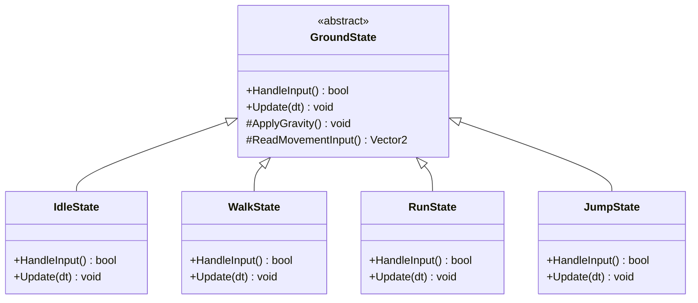

# 游戏状态管理

> 所属计划: 游戏架构设计
> 预计耗时: 60min
> 前置知识: [[10-component-based|10]]

---

## 1. 概念讲解

游戏状态管理是控制游戏"在哪里"以及"能做什么"的核心机制。从主菜单到战斗、从探索到暂停，玩家体验的每一个离散阶段都需要明确的边界和转移规则。本章将系统讲解有限状态机（FSM）、下推自动机（状态栈）和分层有限状态机（HFSM）三种核心模式，并揭示它们与 [[04-solid-grasp-pragmatic|SOLID 原则]]、[[10-component-based|组件架构]]的深层联系。

### 为什么需要这个？

想象一个没有状态管理的游戏：你用一堆布尔变量 `isPaused`、`isInCombat`、`isMenuOpen`、`isDead` 来控制流程。很快你会发现：

- **布尔爆炸**：`if (isPaused && !isInCombat && isMenuOpen)` 这样的条件呈指数增长
- **非法组合**：`isDead && isInCombat` 这种无意义状态无法被编译器阻止
- **行为分散**：暂停时的输入处理代码散落在十个文件中

一个真实的噩梦案例：某 RPG 项目在后期维护时，发现 `isLoading` 和 `isTransitioning` 的交互导致了 17 个不同的 Bug，因为开发者从未完整枚举过所有布尔组合。

状态机通过**显式枚举合法状态、定义转移规则**，将隐式流程变为显式结构。这不仅是代码整洁问题，更是**可验证性**问题——你可以画出状态图，检查每个状态是否都有出口，每个转移是否都有触发条件。

### 核心思想

#### FSM 四要素：从数学到代码

有限状态机的数学定义包含四个要素：
1. **状态集合** `Q`：所有合法状态的有限集合
2. **输入/事件** `Σ`：触发状态转移的信号
3. **转移函数** `δ: Q × Σ → Q`：当前状态 + 事件 → 下一状态
4. **初始状态** `q₀ ∈ Q`：启动时的状态

最朴素的 C# 实现是 `enum + switch`：

```csharp
enum GameState { MainMenu, Exploring, Combat, Paused, GameOver }

GameState current = GameState.MainMenu;

void Update(float dt) {
    switch (current) {
        case GameState.MainMenu:
            if (Input.PressedStart) current = GameState.Exploring;
            break;
        case GameState.Exploring:
            if (Input.EncounterEnemy) current = GameState.Combat;
            if (Input.PressedPause) current = GameState.Paused;
            break;
        // ... 更多 case
    }
}
```

这已经消除了非法组合，但 `switch` 会膨胀到难以维护。更深层的问题是：**行为与状态分离**。`Update` 中的代码不属于任何状态，它只是一个"上帝调度器"。

#### 状态即对象：Nystrom State 模式

Robert Nystrom 在《Game Programming Patterns》中提出的 State 模式，将每个状态封装为独立类，包含生命周期钩子：

```csharp
public interface IState {
    void Enter();    // 进入时：初始化资源、播放动画
    void Update(float dt);  // 每帧：核心逻辑
    void Exit();     // 退出时：清理、保存进度
}
```

这本质上是**将 FSM 的 OO 实现**——每个状态是一个对象，状态机只是容器。关键洞察来自 [[04-solid-grasp-pragmatic|单一职责原则]]：状态的行为应该局部化到状态自身，而非分散在巨型 `switch` 中。

状态类可以持有对外部服务的引用，但**禁止直接访问 Singleton**：

```csharp
// 错误：隐式耦合
public class CombatState : IState {
    public void Enter() {
        AudioManager.Instance.PlayMusic("battle");  // 灾难！
    }
}

// 正确：显式依赖注入
public class CombatState : IState {
    private readonly IAudioService _audio;
    public CombatState(IAudioService audio) => _audio = audio;
    public void Enter() => _audio.PlayMusic("battle");
}
```

这与 [[03-coupling-cohesion-di|依赖注入]] 章节的理念一致：状态机作为组件时，其依赖应通过构造函数或 Initialize 方法传入。

#### 转移表与委托：数据驱动的演进

当转移规则复杂时，用 `Dictionary` 替代 `switch`：

```csharp
// 方式一：显式转移表
Dictionary<(GameState, GameEvent), GameState> _transitions;

// 方式二：委托表（更灵活，可执行副作用）
Dictionary<GameEvent, Func<IState>> _eventHandlers;
```

转移表的优势是**可序列化**：可以从 JSON/Excel 加载，让设计师调整流程而无需改代码。但要注意：过度数据驱动会牺牲类型安全，C# 的强类型优势在此需要权衡。

#### 下推自动机：状态栈解决"暂停困境"

核心问题：从 `Combat` 进入 `Pause`，恢复后应该回到 `Combat`——但普通 FSM 的 `ChangeState` 是**替换**，丢失了历史。

下推自动机（Pushdown Automaton）用 `Stack<IState>` 解决：

```
初始: [MainMenu]
探索: 弹出 MainMenu, 压入 Exploring → [Exploring]
战斗: ChangeState(Combat) → [Combat]  (替换，同层转移)
暂停: 压入 Pause → [Combat, Pause]  (Pause 在顶，Combat 冻结)
恢复: 弹出 Pause → [Combat]  (自动恢复)
```

关键 API 区分：
- `ChangeState(IState)`：**替换**当前状态（同层转移，如 Combat → GameOver）
- `PushState(IState)`：**压栈**，当前状态暂停（如 Combat → Pause）
- `PopState()`：**弹栈**，恢复下层状态

Pause 状态的典型实现：更新 UI 和输入，但**不更新下层状态的逻辑**（时间冻结），可能继续渲染下层（半透明背景）。

#### HFSM：父状态提供默认行为

分层有限状态机（Hierarchical FSM）解决另一问题：状态爆炸。假设角色有 `Idle/Walk/Run/Jump/Fall/Attack/Hurt`，它们共享"地面重力"、"输入响应"等逻辑。

HFSM 引入**父状态**概念：



核心机制：**事件沿父链传递**。子状态处理输入时，若返回 `false`（未处理），则调用 `Parent.HandleInput`。`Update` 同理，子类可显式调用 `base.Update(dt)` 复用重力逻辑。

这实现了 [[04-solid-grasp-pragmatic|DRY 原则]]：公共行为在父状态实现一次，子状态只关注差异。未处理事件的上传机制类似 [[14-event-driven-architecture|事件冒泡]]。

#### 并发状态机：多层的正交组合

更复杂的场景需要**正交分解**：移动层（Locomotion）与战斗层（Combat）独立演化：

| 层 | 状态 | 职责 |
|:---|:---|:---|
| Locomotion | Idle/Walk/Run/Jump | 速度、朝向、动画 |
| Combat | Ready/Attacking/Blocking/Cooldown | 攻击判定、伤害计算 |

两层同时运行，但可能冲突：Combat 的 `Attacking` 可能禁止 `Jump`。解决方案不是把状态乘起来（`JumpAttacking` 等 12 种组合），而是**输出意图（Intent）由解析器合并**：

```csharp
// 每层输出意图，不直接修改最终属性
struct MovementIntent { Vector2 desiredVelocity; bool canJump; }
struct CombatIntent { bool isAttacking; bool wantsToBlock; }

// 解析器按优先级合并
class IntentResolver {
    public void Resolve(MovementIntent move, CombatIntent combat, out PlayerAction action) {
        action.canJump = move.canJump && !combat.isAttacking;  // 攻击时禁止跳跃
        action.velocity = combat.isAttacking ? Vector2.zero : move.desiredVelocity;
    }
}
```

这与 [[11-ecs-deep-dive|ECS 的 System 设计]] 异曲同工：各系统独立计算，由协调器整合结果。

#### 与组件架构集成

在 [[10-component-based|基于组件的架构]] 中，状态机通常作为 `StateMachineComponent` 挂载到 Entity：

```csharp
class Entity {
    private Dictionary<Type, IComponent> _components;
    public T GetComponent<T>() where T : class, IComponent => ...;
}

class StateMachineComponent : IComponent, IStateMachine {
    private IState _current;
    public void Update(float dt) => _current?.Update(dt);
    // 状态内部通过 Entity 访问其他组件
}
```

状态内部只操作 `Entity` 或**服务接口**，避免 `ServiceLocator` 的隐式全局依赖。这与 [[15-service-locator-singletons|Service Locator 替代方案]] 的论述一致。

#### Nystrom State 模式的边界

State 模式是 FSM 的**面向对象实现**，适合：
- 角色/AI 行为（离散、可命名）
- 菜单流程（MainMenu → Settings → KeyBinding）
- 技能阶段（WindUp → Active → Recovery）

不适合：
- 大规模数据驱动行为（考虑行为树或 [[26-ai-architecture|效用 AI]]）
- 连续数值控制（用物理/动画系统）
- 需要历史记忆的长程策略（考虑 [[26-ai-architecture|GOAP]]）

状态机与行为树的关系：状态机是**扁平的、显式转移**的；行为树是**层次化的、隐式执行**的。前者控制"在哪里"，后者控制"做什么"。现代游戏常混合使用：高层用状态机（Menu/Combat/Explore），战斗内用行为树（AI 决策）。

---

## 2. 代码示例

以下是一个完整的 .NET 6+ 控制台程序，演示四种状态机变体：基础状态机、下推自动机、HFSM 父状态复用，以及并发状态机的意图解析。

```csharp
using System;
using System.Collections.Generic;

// ==================== 核心接口 ====================

public interface IState {
    void Enter();
    void Update(float dt);
    void Exit();
    string Name { get; }
}

// 支持输入处理的状态（可选扩展）
public interface IInputHandler {
    bool HandleInput(ConsoleKey key);
}

// 支持层级结构的 HFSM 状态
public interface IHierarchicalState : IState, IInputHandler {
    IHierarchicalState Parent { get; set; }
}

// ==================== 基础状态机 ====================

public class StateMachine {
    public IState Current { get; private set; }
    public string Name => "Basic";

    public virtual void ChangeState(IState next) {
        Console.WriteLine($"[{Name}] {Current?.Name} -> {next.Name}");
        Current?.Exit();
        Current = next;
        Current.Enter();
    }

    public virtual void Update(float dt) => Current?.Update(dt);
}

// ==================== 下推自动机（状态栈） ====================

public class PushdownStateMachine : StateMachine {
    private Stack<IState> _stack = new();
    public override string Name => "Pushdown";

    public void PushState(IState state) {
        Console.WriteLine($"[{Name}] PUSH {state.Name} (stack depth: {_stack.Count + 1})");
        // 当前状态暂停但不退出，压入新状态
        _stack.Push(state);
        base.ChangeState(state);
    }

    public void PopState() {
        if (_stack.Count <= 1) {
            Console.WriteLine($"[{Name}] Cannot pop: stack would be empty");
            return;
        }
        
        Console.WriteLine($"[{Name}] POP {Current.Name}");
        Current?.Exit();
        _stack.Pop();
        
        // 恢复下层状态
        var resumed = _stack.Peek();
        Console.WriteLine($"[{Name}] RESUME {resumed.Name}");
        base.ChangeState(resumed);
    }

    // 获取栈深度（调试用）
    public int StackDepth => _stack.Count;
}

// ==================== HFSM 基类 ====================

public abstract class HierarchicalState : IHierarchicalState {
    public IHierarchicalState Parent { get; set; }
    public abstract string Name { get; }
    
    public virtual void Enter() => Console.WriteLine($"  [Enter {Name}]");
    public virtual void Update(float dt) {
        // 默认：调用父状态更新（复用公共行为）
        Parent?.Update(dt);
    }
    public virtual void Exit() => Console.WriteLine($"  [Exit {Name}]");

    // 输入处理：子类先尝试，失败则沿父链上传
    public virtual bool HandleInput(ConsoleKey key) {
        if (Parent != null) {
            Console.WriteLine($"  [{Name}] unhandled key '{key}', delegating to parent {Parent.Name}");
            return Parent.HandleInput(key);
        }
        Console.WriteLine($"  [{Name}] key '{key}' completely unhandled");
        return false;
    }
}

// ==================== 具体状态：游戏流程 ====================

public class MainMenuState : IState {
    public string Name => "MainMenu";
    public void Enter() => Console.WriteLine("  [MainMenu] Showing title screen");
    public void Update(float dt) => Console.WriteLine("  [MainMenu] Waiting for input...");
    public void Exit() => Console.WriteLine("  [MainMenu] Fading out");
}

public class CombatState : IState, IInputHandler {
    private readonly IStateMachine _machine;
    private float _combatTimer = 0f;
    
    public string Name => "Combat";
    public CombatState(IStateMachine machine) => _machine = machine;

    public void Enter() => Console.WriteLine("  [Combat] Battle started! HP: 100");
    public void Update(float dt) {
        _combatTimer += dt;
        Console.WriteLine($"  [Combat] Fighting... ({_combatTimer:F1}s)");
    }
    public void Exit() => Console.WriteLine("  [Combat] Battle ended, saving progress");

    public bool HandleInput(ConsoleKey key) {
        if (key == ConsoleKey.Escape) {
            Console.WriteLine("  [Combat] ESC pressed, requesting pause");
            // 注意：实际应由外部调用 PushState，这里演示意图
            return true;
        }
        if (key == ConsoleKey.Spacebar) {
            Console.WriteLine("  [Combat] ATTACK!");
            return true;
        }
        return false;
    }
}

public class PauseState : IState {
    private readonly PushdownStateMachine _machine;
    public string Name => "Pause";
    
    public PauseState(PushdownStateMachine machine) => _machine = machine;

    public void Enter() => Console.WriteLine("  [Pause] Game frozen, menu open");
    public void Update(float dt) {
        // 暂停状态：不更新游戏逻辑，只更新UI
        Console.WriteLine("  [Pause] Rendering pause menu (no game update)");
    }
    public void Exit() => Console.WriteLine("  [Pause] Resuming game");

    public void Resume() => _machine.PopState();
}

// ==================== HFSM 具体状态：角色移动 ====================

public class GroundState : HierarchicalState {
    public override string Name => "Ground";
    private float _gravity = 9.8f;
    private float _verticalVelocity = 0f;

    public override void Update(float dt) {
        // 所有地面子状态共享的重力逻辑
        _verticalVelocity -= _gravity * dt;
        Console.WriteLine($"    [Ground] Gravity: vY={_verticalVelocity:F2} (shared)");
        // 注意：实际应调用 base.Update(dt) 让父链继续，但 Ground 是顶层
    }

    public override bool HandleInput(ConsoleKey key) {
        if (key == ConsoleKey.Spacebar) {
            Console.WriteLine($"    [Ground] JUMP initiated!");
            return true;
        }
        return base.HandleInput(key);
    }
}

public class WalkState : HierarchicalState {
    public override string Name => "Walk";
    private float _speed = 2.0f;

    public override void Enter() {
        base.Enter();
        Console.WriteLine($"    [Walk] Speed set to {_speed}");
    }

    public override void Update(float dt) {
        // 显式复用父状态的重力
        Parent?.Update(dt);
        Console.WriteLine($"    [Walk] Moving at {_speed} m/s");
    }

    public override bool HandleInput(ConsoleKey key) {
        if (key == ConsoleKey.LeftArrow || key == ConsoleKey.RightArrow) {
            Console.WriteLine($"    [Walk] Direction change");
            return true;
        }
        // 未处理：上传给父状态（Ground 处理跳跃等）
        return base.HandleInput(key);
    }
}

public class RunState : HierarchicalState {
    public override string Name => "Run";
    private float _speed = 5.0f;

    public override void Enter() {
        base.Enter();
        Console.WriteLine($"    [Run] Speed set to {_speed}");
    }

    public override void Update(float dt) {
        Parent?.Update(dt);
        Console.WriteLine($"    [Run] Sprinting at {_speed} m/s");
    }

    public override bool HandleInput(ConsoleKey key) {
        if (key == ConsoleKey.LeftShift) {
            Console.WriteLine($"    [Run] Toggled sprint");
            return true;
        }
        return base.HandleInput(key);
    }
}

public class IdleState : HierarchicalState {
    public override string Name => "Idle";

    public override void Update(float dt) {
        Parent?.Update(dt);
        Console.WriteLine($"    [Idle] Standing still");
    }
}

// ==================== 并发状态机：意图解析 ====================

public struct MoveIntent {
    public float DesiredSpeed;
    public bool WantsToJump;
}

public struct CombatIntent {
    public bool IsAttacking;
    public bool WantsToBlock;
}

public class IntentResolver {
    public void Resolve(MoveIntent move, CombatIntent combat, out float finalSpeed, out bool canJump) {
        // 攻击时禁止移动
        finalSpeed = combat.IsAttacking ? 0f : move.DesiredSpeed;
        // 攻击时禁止跳跃
        canJump = move.WantsToJump && !combat.IsAttacking;
        
        Console.WriteLine($"  [Resolver] move={move.DesiredSpeed}, attack={combat.IsAttacking} => speed={finalSpeed}, canJump={canJump}");
    }
}

// ==================== 状态机接口（用于依赖注入） ====================

public interface IStateMachine {
    void ChangeState(IState next);
    void Update(float dt);
}

// ==================== 演示程序 ====================

class Program {
    static void Main(string[] args) {
        Console.WriteLine("=".PadRight(50, '='));
        Console.WriteLine("DEMO 1: Basic State Machine");
        Console.WriteLine("=".PadRight(50, '='));
        
        var basic = new StateMachine();
        basic.ChangeState(new MainMenuState());
        basic.Update(0.016f);
        basic.ChangeState(new CombatState(basic));
        basic.Update(0.016f);
        basic.Update(0.016f);
        
        Console.WriteLine("\n" + "=".PadRight(50, '='));
        Console.WriteLine("DEMO 2: Pushdown Automaton (Pause/Resume)");
        Console.WriteLine("=".PadRight(50, '='));
        
        var pushdown = new PushdownStateMachine();
        var combat = new CombatState(pushdown);
        var pause = new PauseState(pushdown);
        
        // 进入战斗
        pushdown.PushState(combat);
        pushdown.Update(0.016f);
        
        // 暂停（压栈）
        Console.WriteLine("\n--- Player presses ESC ---");
        pushdown.PushState(pause);
        pushdown.Update(0.016f);
        
        // 恢复（弹栈）
        Console.WriteLine("\n--- Player selects Resume ---");
        pause.Resume();
        pushdown.Update(0.016f);
        
        Console.WriteLine("\n" + "=".PadRight(50, '='));
        Console.WriteLine("DEMO 3: HFSM (Ground -> Walk/Run)");
        Console.WriteLine("=".PadRight(50, '='));
        
        var ground = new GroundState();
        var walk = new WalkState { Parent = ground };
        var run = new RunState { Parent = ground };
        var idle = new IdleState { Parent = ground };
        
        // 模拟状态切换
        Console.WriteLine("\n--- Enter Walk ---");
        walk.Enter();
        walk.Update(0.016f);
        walk.HandleInput(ConsoleKey.Spacebar);  // 应被 Ground 处理为跳跃
        
        Console.WriteLine("\n--- Enter Run ---");
        run.Enter();
        run.Update(0.016f);
        run.HandleInput(ConsoleKey.LeftArrow);   // Run 不处理，上传给 Ground
        
        Console.WriteLine("\n--- Enter Idle ---");
        idle.Enter();
        idle.Update(0.016f);
        
        Console.WriteLine("\n" + "=".PadRight(50, '='));
        Console.WriteLine("DEMO 4: Concurrent State Machine (Intent)");
        Console.WriteLine("=".PadRight(50, '='));
        
        var resolver = new IntentResolver();
        
        // 场景1：正常移动
        var move1 = new MoveIntent { DesiredSpeed = 3f, WantsToJump = true };
        var combat1 = new CombatIntent { IsAttacking = false, WantsToBlock = false };
        resolver.Resolve(move1, combat1, out var speed1, out var canJump1);
        
        // 场景2：攻击中尝试移动
        var move2 = new MoveIntent { DesiredSpeed = 3f, WantsToJump = true };
        var combat2 = new CombatIntent { IsAttacking = true, WantsToBlock = false };
        resolver.Resolve(move2, combat2, out var speed2, out var canJump2);
        
        Console.WriteLine("\n" + "=".PadRight(50, '='));
        Console.WriteLine("All demos completed!");
        Console.WriteLine("=".PadRight(50, '='));
    }
}
```

**运行方式:**

```bash
# 保存为 Program.cs，然后执行：
dotnet new console -n StateMachineDemo
cd StateMachineDemo
# 将上述代码替换 Program.cs 内容
dotnet run
```

**预期输出:**

```text
==================================================
DEMO 1: Basic State Machine
==================================================
[Basic]  -> MainMenu
  [Enter MainMenu]
  [MainMenu] Showing title screen
  [MainMenu] Waiting for input...
[Basic] MainMenu -> Combat
  [MainMenu] Fading out
  [Enter Combat]
  [Combat] Battle started! HP: 100
  [Combat] Fighting... (0.0s)
  [Combat] Fighting... (0.0s)

==================================================
DEMO 2: Pushdown Automaton (Pause/Resume)
==================================================
[Pushdown] PUSH Combat (stack depth: 1)
[Pushdown]  -> Combat
  [Enter Combat]
  [Combat] Battle started! HP: 100
  [Combat] Fighting... (0.0s)

--- Player presses ESC ---
[Pushdown] PUSH Pause (stack depth: 2)
[Pushdown] Combat -> Pause
  [Enter Pause]
  [Pause] Game frozen, menu open
  [Pause] Rendering pause menu (no game update)

--- Player selects Resume ---
[Pushdown] POP Pause
[Pushdown] RESUME Combat
[Pushdown] Pause -> Combat
  [Combat] Battle ended, saving progress
  [Enter Combat]
  [Combat] Battle started! HP: 100
  [Combat] Fighting... (0.0s)

==================================================
DEMO 3: HFSM (Ground -> Walk/Run)
==================================================

--- Enter Walk ---
  [Enter Walk]
    [Walk] Speed set to 2
    [Ground] Gravity: vY=-0.16 (shared)
    [Walk] Moving at 2 m/s
    [Walk] unhandled key 'Spacebar', delegating to parent Ground
    [Ground] JUMP initiated!

--- Enter Run ---
  [Enter Run]
    [Run] Speed set to 5
    [Ground] Gravity: vY=-0.16 (shared)
    [Run] Sprinting at 5 m/s
    [Run] unhandled key 'LeftArrow', delegating to parent Ground
  [Ground] key 'LeftArrow' completely unhandled

--- Enter Idle ---
  [Enter Idle]
    [Ground] Gravity: vY=-0.16 (shared)
    [Idle] Standing still

==================================================
DEMO 4: Concurrent State Machine (Intent)
==================================================
  [Resolver] move=3, attack=False => speed=3, canJump=True
  [Resolver] move=3, attack=True => speed=0, canJump=False

==================================================
All demos completed!
==================================================
```

> **Unity 适配提示**：将 `Update(float dt)` 改为继承 `MonoBehaviour` 的 `Update()`，使用 `Time.deltaTime` 即可。状态机可作为 `MonoBehaviour` 组件挂载到游戏对象。

---

## 3. 练习

### 练习 1: 基础

为 `CombatState` 增加 Esc 键处理：按下 Esc 压入 `PauseState`，Resume 时弹出 Pause 并恢复 Combat。

要求：
- `CombatState` 需要持有 `IStateMachine` 引用（或更具体的 `PushdownStateMachine`）
- 在 `CombatState` 的输入处理中检测 Esc 并调用 `PushState`
- `PauseState` 提供 `Resume()` 方法调用 `PopState()`
- `PauseState.Update` 不更新下层逻辑，但继续渲染（控制台中打印渲染信息即可）

### 练习 2: 进阶

实现 HFSM 的 `GroundState` 父状态，让 `WalkState`/`RunState`/`IdleState` 继承并复用重力更新；当子状态未处理输入时由父状态处理。

要求：
- `GroundState` 实现 `ApplyGravity(float dt)` 方法
- 子状态在 `Update` 中显式调用 `base.Update(dt)` 或 `Parent.Update(dt)`
- 输入处理采用"子类先尝试，返回 `false` 则调用 `Parent.HandleInput`"的模式
- 演示：Walk 状态下按 Spacebar（跳跃）被 Ground 处理，按方向键被 Walk 处理

### 练习 3: 挑战（可选）

实现并发状态机（`LocomotionLayer` + `CombatLayer`）并解决两层同时尝试修改同一属性的冲突。

要求：
- `LocomotionLayer` 输出 `MoveIntent`（期望速度、是否跳跃）
- `CombatLayer` 输出 `CombatIntent`（是否攻击、是否格挡）
- 创建 `IntentResolver` 按优先级合并意图（如攻击时速度归零）
- 演示冲突场景：两层同时要求修改玩家速度，Resolver 正确仲裁

---

## 3.5 参考答案

> [!tip]- 练习 1 参考答案
> 以下是完整的 `CombatState` 和 `PauseState` 实现，演示 Esc 暂停流程：
>
> ```csharp
> public interface IPushdownMachine : IStateMachine {
>     void PushState(IState state);
>     void PopState();
> }
>
> public class CombatState : IState, IInputHandler {
>     private readonly IPushdownMachine _machine;
>     private float _timer = 0f;
>     public string Name => "Combat";
>
>     public CombatState(IPushdownMachine machine) => _machine = machine;
>
>     public void Enter() => Console.WriteLine("  [Combat] Entered battle");
>     public void Update(float dt) {
>         _timer += dt;
>         Console.WriteLine($"  [Combat] Fighting... {_timer:F1}s");
>     }
>     public void Exit() => Console.WriteLine("  [Combat] Exiting battle");
>
>     public bool HandleInput(ConsoleKey key) {
>         if (key == ConsoleKey.Escape) {
>             Console.WriteLine("  [Combat] ESC -> requesting pause");
>             // 创建 Pause 并压栈；Pause 持有同一 machine 用于 Resume
>             _machine.PushState(new PauseState(_machine));
>             return true;
>         }
>         if (key == ConsoleKey.Spacebar) {
>             Console.WriteLine("  [Combat] ATTACK!");
>             return true;
>         }
>         return false;
>     }
> }
>
> public class PauseState : IState {
>     private readonly IPushdownMachine _machine;
>     public string Name => "Pause";
>
>     public PauseState(IPushdownMachine machine) => _machine = machine;
>
>     public void Enter() => Console.WriteLine("  [Pause] Menu opened, time frozen");
>
>     public void Update(float dt) {
>         // 关键：不调用下层 Update，但继续"渲染"
>         Console.WriteLine("  [Pause] Rendering pause UI (game logic frozen)");
>     }
>
>     public void Exit() => Console.WriteLine("  [Pause] Closing menu");
>
>     public void Resume() {
>         Console.WriteLine("  [Pause] Resume clicked");
>         _machine.PopState();  // 弹出自身，恢复下层 Combat
>     }
> }
> ```
>
> 关键设计点：
> - `CombatState` 通过构造函数注入 `IPushdownMachine`，而非直接依赖具体类
> - `PauseState` 也持有同一接口，使 `Resume()` 可以调用 `PopState()`
> - `PauseState.Update` 明确区分"不更新游戏逻辑"与"继续渲染"的职责

> [!tip]- 练习 2 参考答案
> HFSM 的完整实现，演示父状态复用与事件上传：
>
> ```csharp
> public abstract class HierarchicalStateBase : IHierarchicalState {
>     public IHierarchicalState Parent { get; set; }
>     public abstract string Name { get; }
>
>     public virtual void Enter() { }
>     public virtual void Update(float dt) {
>         // 默认行为：调用父状态更新，实现公共逻辑复用
>         Parent?.Update(dt);
>     }
>     public virtual void Exit() { }
>
>     // 返回 true = 已处理，false = 未处理（沿父链上传）
>     public virtual bool HandleInput(ConsoleKey key) {
>         if (Parent != null) {
>             Console.WriteLine($"  [{Name}] delegating '{key}' to parent {Parent.Name}");
>             return Parent.HandleInput(key);
>         }
>         return false;
>     }
> }
>
> public class GroundState : HierarchicalStateBase {
>     public override string Name => "Ground";
>     private float _gravity = 9.8f;
>     protected float _verticalVelocity = 0f;  // protected 供子类读取
>
>     public override void Update(float dt) {
>         // 地面状态的重力逻辑：所有子状态共享
>         _verticalVelocity -= _gravity * dt;
>         if (_verticalVelocity < -20f) _verticalVelocity = -20f; // 终端速度
>         Console.WriteLine($"    [Ground] gravity applied: vY={_verticalVelocity:F2}");
>
>         // 注意：不调用 base.Update，避免无限递归（Parent 可能也是 Ground）
>     }
>
>     public override bool HandleInput(ConsoleKey key) {
>         if (key == ConsoleKey.Spacebar) {
>             Console.WriteLine($"    [Ground] JUMP! vY set to 10");
>             _verticalVelocity = 10f;
>             return true;
>         }
>         // Ground 也不处理？继续上传（但 Ground 是顶层，最终返回 false）
>         return base.HandleInput(key);
>     }
> }
>
> public class WalkState : HierarchicalStateBase {
>     public override string Name => "Walk";
>     private float _speed = 2.0f;
>
>     public override void Enter() {
>         Console.WriteLine($"    [Walk] Entered, speed={_speed}");
>     }
>
>     public override void Update(float dt) {
>         // 显式复用父状态的重力
>         Parent?.Update(dt);
>         // Walk 特有逻辑
>         Console.WriteLine($"    [Walk] moving at {_speed} m/s");
>     }
>
>     public override bool HandleInput(ConsoleKey key) {
>         if (key == ConsoleKey.LeftArrow || key == ConsoleKey.RightArrow) {
>             Console.WriteLine($"    [Walk] handling direction: {key}");
>             return true;
>         }
>         // 未处理：上传给父状态
>         return base.HandleInput(key);
>     }
> }
>
> public class RunState : HierarchicalStateBase {
>     public override string Name => "Run";
>     private float _speed = 5.0f;
>
>     public override void Update(float dt) {
>         Parent?.Update(dt);
>         Console.WriteLine($"    [Run] sprinting at {_speed} m/s");
>     }
>
>     public override bool HandleInput(ConsoleKey key) {
>         if (key == ConsoleKey.LeftShift) {
>             Console.WriteLine($"    [Run] toggle sprint");
>             return true;
>         }
>         return base.HandleInput(key);
>     }
> }
>
> public class IdleState : HierarchicalStateBase {
>     public override string Name => "Idle";
>
>     public override void Update(float dt) {
>         Parent?.Update(dt);
>         Console.WriteLine($"    [Idle] standing still");
>     }
> }
>
> // 使用演示
> public class HfsmDemo {
>     public void Run() {
>         var ground = new GroundState();
>         var walk = new WalkState { Parent = ground };
>
>         Console.WriteLine("=== Walk + Spacebar (jump) ===");
>         walk.Enter();
>         walk.Update(0.016f);
>         walk.HandleInput(ConsoleKey.Spacebar);  // Walk 不处理 -> Ground 处理跳跃
>
>         Console.WriteLine("\n=== Walk + LeftArrow ===");
>         walk.HandleInput(ConsoleKey.LeftArrow);  // Walk 直接处理
>     }
> }
> ```
>
> 关键设计点：
> - `HierarchicalStateBase` 提供默认的"上传"机制，子类可选择重写
> - `Parent?.Update(dt)` 实现显式复用，避免隐式魔法
> - 重力状态 `_verticalVelocity` 用 `protected` 让子状态可读但不可随意写

> [!tip]- 练习 3 参考答案
> 并发状态机的完整实现，演示意图模式与冲突解决：
>
> ```csharp
> // ========== 各层输出的意图结构 ==========
>
> public readonly struct LocomotionIntent {
>     public readonly Vector2 DesiredVelocity;
>     public readonly bool WantsToJump;
>     public readonly bool WantsToCrouch;
>
>     public LocomotionIntent(Vector2 velocity, bool jump, bool crouch) {
>         DesiredVelocity = velocity;
>         WantsToJump = jump;
>         WantsToCrouch = crouch;
>     }
> }
>
> public readonly struct CombatIntent {
>     public readonly bool IsAttacking;
>     public readonly bool WantsToBlock;
>     public readonly bool IsInHitstun;
>
>     public CombatIntent(bool attack, bool block, bool hitstun) {
>         IsAttacking = attack;
>         WantsToBlock = block;
>         IsInHitstun = hitstun;
>     }
> }
>
> // 简化的 Vector2
> public struct Vector2 {
>     public float X, Y;
>     public Vector2(float x, float y) { X = x; Y = y; }
>     public static Vector2 Zero => new(0, 0);
>     public override string ToString() => $"({X:F2}, {Y:F2})";
> }
>
> // ========== 两层状态机 ==========
>
> public interface ILayer {
>     void Update(float dt);
> }
>
> public class LocomotionLayer : ILayer {
>     private IState _current;
>     public LocomotionIntent CurrentIntent { get; private set; }
>
>     public void ChangeState(IState state) { /* ... */ }
>
>     public void Update(float dt) {
>         // 根据当前状态计算意图
>         _current?.Update(dt);
>         CurrentIntent = CalculateIntent();  // 由具体状态设置内部字段
>     }
>
>     private LocomotionIntent CalculateIntent() {
>         // 实际应由当前状态提供，这里简化
>         return new LocomotionIntent(new Vector2(1, 0), false, false);
>     }
> }
>
> public class CombatLayer : ILayer {
>     private IState _current;
>     public CombatIntent CurrentIntent { get; private set; }
>
>     public void Update(float dt) {
>         _current?.Update(dt);
>         CurrentIntent = CalculateIntent();
>     }
>
>     private CombatIntent CalculateIntent() {
>         return new CombatIntent(true, false, false);  // 模拟攻击中
>     }
> }
>
> // ========== 意图解析器：冲突解决的核心 ==========
>
> public class PlayerIntentResolver {
>     public struct ResolvedPlayerAction {
>         public Vector2 FinalVelocity;
>         public bool CanJump;
>         public bool IsAttacking;
>         public bool IsBlocking;
>     }
>
>     public ResolvedPlayerAction Resolve(
>         LocomotionIntent move, 
>         CombatIntent combat,
>         PlayerContext context)  // 上下文用于复杂规则
>     {
>         var result = new ResolvedPlayerAction();
>
>         // 规则1：受击硬直覆盖一切
>         if (combat.IsInHitstun) {
>             result.FinalVelocity = Vector2.Zero;
>             result.CanJump = false;
>             result.IsAttacking = false;
>             result.IsBlocking = false;
>             Console.WriteLine("  [Resolver] HITSTUN: all actions disabled");
>             return result;
>         }
>
>         // 规则2：格挡时只能慢速移动
>         if (combat.WantsToBlock) {
>             var blockMove = move.DesiredVelocity;
>             float maxBlockSpeed = 1.0f;
>             if (blockMove.X > maxBlockSpeed) blockMove.X = maxBlockSpeed;
>             if (blockMove.X < -maxBlockSpeed) blockMove.X = -maxBlockSpeed;
>
>             result.FinalVelocity = blockMove;
>             result.CanJump = false;  // 格挡时不能跳
>             result.IsBlocking = true;
>             Console.WriteLine("  [Resolver] BLOCKING: speed limited");
>             return result;
>         }
>
>         // 规则3：攻击时禁止跳跃，速度可能降低（根据攻击类型）
>         if (combat.IsAttacking) {
>             result.FinalVelocity = move.DesiredVelocity * 0.3f;  // 攻击中减速
>             result.CanJump = false;  // 核心冲突解决：攻击禁止跳跃
>             result.IsAttacking = true;
>             Console.WriteLine("  [Resolver] ATTACKING: no jump, reduced speed");
>             return result;
>         }
>
>         // 默认：正常移动
>         result.FinalVelocity = move.DesiredVelocity;
>         result.CanJump = move.WantsToJump;
>         result.IsAttacking = false;
>         result.IsBlocking = false;
>         return result;
>     }
> }
>
> // 玩家上下文（用于复杂规则查询）
> public class PlayerContext {
>     public float CurrentHealth { get; set; }
>     public bool IsOnGround { get; set; }
> }
>
> // ========== 使用演示 ==========
>
> public class ConcurrentDemo {
>     public void Run() {
>         var locomotion = new LocomotionLayer();
>         var combat = new CombatLayer();
>         var resolver = new PlayerIntentResolver();
>         var context = new PlayerContext { CurrentHealth = 100, IsOnGround = true };
>
>         Console.WriteLine("=== Scene 1: Normal movement ===");
>         // 模拟更新两层
>         locomotion.Update(0.016f);
>         combat.Update(0.016f);
>         // 手动设置：正常移动，非攻击
>         var move1 = new LocomotionIntent(new Vector2(3, 0), true, false);
>         var combat1 = new CombatIntent(false, false, false);
>         var r1 = resolver.Resolve(move1, combat1, context);
>         Console.WriteLine($"  Result: velocity={r1.FinalVelocity}, canJump={r1.CanJump}");
>
>         Console.WriteLine("\n=== Scene 2: Attacking + trying to move & jump ===");
>         var move2 = new LocomotionIntent(new Vector2(3, 0), true, false);
>         var combat2 = new CombatIntent(true, false, false);
>         var r2 = resolver.Resolve(move2, combat2, context);
>         Console.WriteLine($"  Result: velocity={r2.FinalVelocity}, canJump={r2.CanJump}");
>
>         Console.WriteLine("\n=== Scene 3: Blocking + trying to sprint ===");
>         var move3 = new LocomotionIntent(new Vector2(5, 0), false, false);
>         var combat3 = new CombatIntent(false, true, false);
>         var r3 = resolver.Resolve(move3, combat3, context);
>         Console.WriteLine($"  Result: velocity={r3.FinalVelocity}, canJump={r3.CanJump}");
>
>         Console.WriteLine("\n=== Scene 4: Hitstun (any input ignored) ===");
>         var move4 = new LocomotionIntent(new Vector2(5, 0), true, true);
>         var combat4 = new CombatIntent(false, false, true);
>         var r4 = resolver.Resolve(move4, combat4, context);
>         Console.WriteLine($"  Result: velocity={r4.FinalVelocity}, canJump={r4.CanJump}");
>     }
> }
> ```
>
> 关键设计点：
> - **意图模式**：各层不直接修改玩家属性，只输出"我想要什么"
> - **优先级规则**：硬直 > 格挡 > 攻击 > 正常，避免随机冲突
> - **上下文参数**：`PlayerContext` 使规则可查询额外状态（如是否在地面上）
> - **可扩展性**：新增层（如 `BuffLayer`）只需新增意图类型和解析规则

> [!note] 答案使用方式
> 如果你的实现通过了测试或达到了题目要求，就是正确的。参考答案提供的是**一种可行路径**，而非唯一标准。特别地：
> - 练习1 中 `CombatState` 持有 `IStateMachine` 还是 `PushdownStateMachine` 均可，关键是**依赖可替换**
> - 练习2 中事件上传机制可以用返回值、异常、或回调实现，返回值模式最清晰
> - 练习3 的冲突解决策略（优先级/加权/仲裁）应根据具体游戏设计调整
>
> ---

## 4. 扩展阅读

- [Nystrom — State · Game Programming Patterns](https://gameprogrammingpatterns.com/state.html) — Robert Nystrom 的经典 State 模式讲解，包含 State 与 Strategy 模式的对比，以及状态机、并发状态机、下推自动机的渐进演化
- [Godot HFSM & Pushdown Automaton Demo README](https://github.com/godotengine/godot-demo-projects/blob/master/2d/finite_state_machine/README.md) — Godot 官方演示项目，包含 HFSM 的节点式实现和状态栈的 UI 流程演示，适合理解可视化状态编辑
- [Productive Rage — C# State Machines](https://www.productiverage.com/c-sharp-state-machines) — 针对 C# 开发者的状态机实现指南，包含 `enum` 基础版到泛型状态机的演进，以及编译时类型安全的状态转移设计

---

## 常见陷阱

- **在状态内直接调用 Singleton 导致隐式耦合**：`AudioManager.Instance.Play()` 让状态无法单元测试，且隐藏了真实依赖。正确做法：通过构造函数或 `Initialize(IServiceProvider)` 注入所需服务，状态机组装时统一配置依赖。

- **滥用状态机处理连续数值/物理**：用 FSM 控制 "速度从 0 加速到 5" 是灾难——每 0.1 速度差一个状态？正确做法：FSM 管理离散行为阶段（`Idle/Moving`），连续数值变化交给物理/动画系统插值；状态输出目标值，系统负责平滑过渡。

- **状态栈泄漏导致内存与逻辑错误**：`PushState` 后未对应 `PopState`（如异常中断、重复暂停），栈无限增长或状态对象未释放。正确做法：为栈设置最大深度断言；在 `PopState` 中执行完整清理；关键状态转移使用 `using` 模式或 `IDisposable` 确保资源释放；考虑实现 `ReplaceTopState` 避免不必要的栈操作。