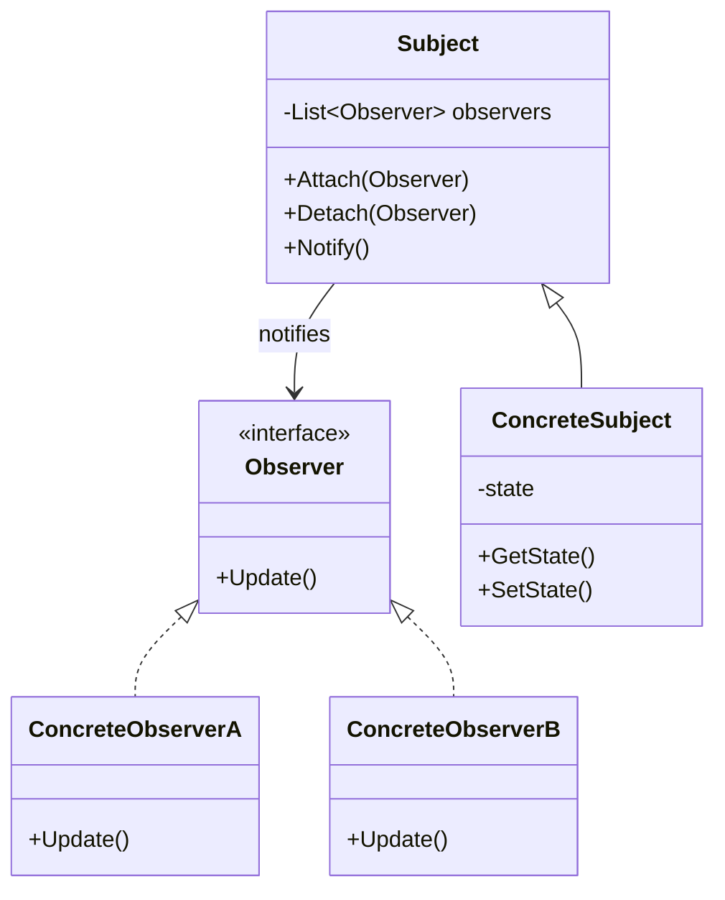
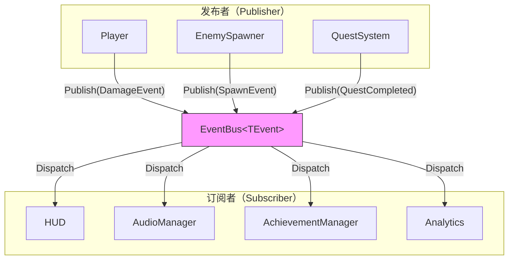
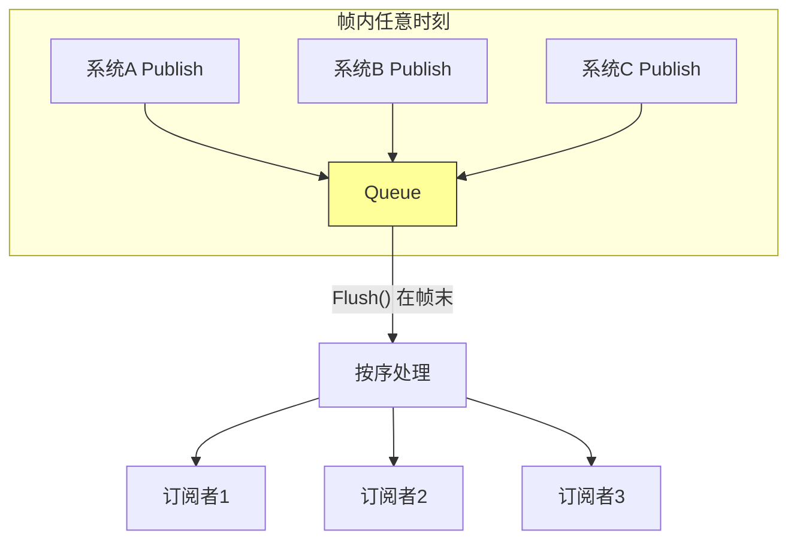
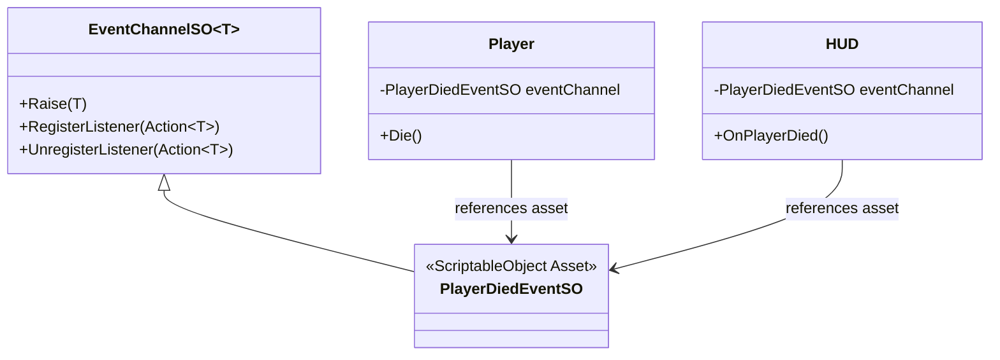

> 所属计划: 游戏架构设计
> 预计耗时: 60min
> 前置知识: [[11-ecs-deep-dive|11]]

---

## 1. 概念讲解

### 为什么需要这个？

游戏系统天然充满交互：玩家受伤触发 HUD 闪烁、敌人死亡掉落战利品、任务完成解锁成就。最直接的实现是**直接引用**——`Player` 类里持有 `HUD` 和 `AudioManager` 的引用，死亡时逐个调用：

```csharp
// 紧耦合的噩梦
class Player {
    private HUD hud;
    private AudioManager audio;
    private AchievementManager achievements;
    private AnalyticsTracker analytics;
    // ... 更多引用
    
    void Die() {
        hud.ShowGameOver();
        audio.PlaySFX("death");
        achievements.Unlock("first_blood");
        analytics.Log("player_died", level, cause);
        // 每加一个系统就要改 Player
    }
}
```

这种**拉取式（Pull）**架构的问题在 [[03-coupling-cohesion-di|第3章]] 已深入讨论：修改扩散、测试困难、复用不可能。当系统数量从 4 个增长到 40 个时，`Player` 类变成不可维护的上帝对象。

事件驱动架构的核心诉求是**让事实的发生与对事实的响应解耦**。玩家只需宣告"我死了"，谁关心、如何响应，由关心者自行决定。

### 核心思想

#### 观察者模式（Observer Pattern）

观察者模式是最基础的事件机制。Subject 维护 Observer 列表，状态变化时遍历通知：



C# 的 `event`/`delegate` 是语言级观察者实现：

```csharp
// 内置支持，但耦合到具体类
public class Player {
    public event Action OnDied;
    void Die() => OnDied?.Invoke();
}
```

局限在于：Subject 必须显式定义事件，订阅者需直接引用 Subject 实例。这解决了"一对多"通知，但未解决"多对多"的跨系统通信。

#### 事件总线 / 中介者（Event Bus / Mediator）

事件总线将观察者模式升级为**匿名发布-订阅**：发布者与订阅者通过**事件类型**而非**对象引用**关联。



关键特征：
- **类型安全**：`EventBus<DamageEvent>` 与 `EventBus<HealEvent>` 完全隔离
- **零引用依赖**：`Player` 不知道 `HUD` 存在，`HUD` 不知道 `Player` 存在
- **生命周期解耦**：订阅者可在运行时动态加入/退出

#### 发布-订阅 vs 直接引用：权衡与代价

| 维度 | 直接引用 | 发布-订阅 |
|:---|:---|:---|
| 耦合度 | 编译期强依赖 | 运行时弱依赖 |
| 可追踪性 | 调用链清晰（IDE 跳转） | 隐式依赖，需事件浏览器 |
| 时序控制 | 同步、确定 | 可能异步、顺序不确定 |
| 调试难度 | 堆栈完整 | 断点难设、源头难寻 |
| 性能 | 直接虚调用 | 委托列表遍历 + 可能装箱 |

**隐式依赖**是最大陷阱。代码中看不到 `HUD` 依赖 `Player`，但运行时 `Player` 死亡必须 `HUD` 存在才能显示游戏结束。这需要架构约定（如启动顺序保证）或依赖注入框架补偿。

#### 事件 vs 拉取：推送（Push）与拉取（Pull）的边界

| 场景 | 推荐方式 | 原因 |
|:---|:---|:---|
| "玩家生命值变为 0" | **事件推送** | 离散事实，多方可能关心 |
| "查询玩家当前生命值" | **服务拉取** | 需要即时、确定的结果 |
| "每帧更新血条位置" | **服务拉取 / ECS 查询** | 高频、数据驱动，避免事件风暴 |
| "成就解锁" | **事件推送** | 低频、跨系统、无返回值 |

**事件应陈述已发生的事实（fact）**，而非发出指令（command）或请求数据（query）。混淆三者会导致架构腐化。

#### Nystrom 事件队列：解耦时序

Robert Nystrom 在 *Game Programming Patterns* 中提出的 Event Queue 是事件总线的关键进化：用**队列缓冲**解耦**发送时机**与**处理时机**。



核心价值：
- **避免递归**：A 处理事件时触发 B，B 又触发 A 的循环被阻断
- **批处理优化**：合并重复事件（如 10 个 `DamageEvent` 可合并显示总伤害）
- **时序可控**：确保所有状态更新完成后再做响应（如物理计算后渲染）

**所有权与生命周期陷阱**：队列中的事件可能引用已销毁对象。值类型 `struct` 事件或显式 `ID` 引用是常见对策。

#### Unity ScriptableObject Event Channel

Unity 生态中，Ryan Hipple 推广的 ScriptableObject 事件通道用**数据资产**替代代码引用：



优势：
- **Inspector 可视化连线**：策划可调整事件响应
- **零 Singleton**：无需全局 `EventBus.Instance`
- **场景间共享**：SO 资产跨场景持久

代价是 Unity 特有的序列化开销与运行时类型检查。

#### 顺序陷阱与性能

**顺序陷阱**：
1. **同一帧内触发顺序**：`DamageEvent` 先于 `HealEvent` 还是后？可能决定角色生死
2. **递归触发**：A 的回调中 `Publish(BEvent)`，B 的回调又 `Publish(AEvent)`...
3. **订阅者自注销**：遍历委托列表时 `Unsubscribe` 导致枚举异常

**性能要点**：
- 避免每帧广播（如 `UpdateEvent` 滥用），改用 [[28-data-oriented-design|DoD]] 的批量处理
- `struct` 事件 + 泛型总线避免 `object` 装箱
- 字符串事件名（如 `"player_died"`）导致字典查找与拼写错误，优先 `typeof(T)`

---

## 2. 代码示例

以下实现一个 .NET 6+ 控制台可运行的泛型事件总线，包含**即时模式**与**队列缓冲模式**，演示如何避免递归陷阱。

```csharp
using System;
using System.Collections.Generic;
using System.Linq;

// ============================================
// 核心接口：定义事件总线契约
// ============================================
public interface IEventBus<T> {
    void Subscribe(Action<T> handler);
    void Unsubscribe(Action<T> handler);
    void Publish(T evt);
    void Flush(); // 队列模式时使用
}

// ============================================
// 值类型事件：避免堆分配与引用生命周期问题
// ============================================
public readonly struct DamageEvent {
    public readonly int TargetId;
    public readonly int Amount;
    public readonly int AttackerId;
    
    public DamageEvent(int targetId, int amount, int attackerId = 0) {
        TargetId = targetId;
        Amount = amount;
        AttackerId = attackerId;
    }
    
    public override string ToString() => 
        $"DamageEvent[Target={TargetId}, Amount={Amount}, Attacker={AttackerId}]";
}

public readonly struct HealEvent {
    public readonly int TargetId;
    public readonly int Amount;
    
    public HealEvent(int targetId, int amount) {
        TargetId = targetId;
        Amount = amount;
    }
    
    public override string ToString() => 
        $"HealEvent[Target={TargetId}, Amount={Amount}]";
}

// ============================================
// 即时事件总线：直接同步派发
// ============================================
public class ImmediateEventBus<T> : IEventBus<T> {
    // 用 HashSet 保证 O(1) 去重，但遍历需 ToArray 快照防修改
    private readonly HashSet<Action<T>> _handlers = new();
    
    public void Subscribe(Action<T> handler) => _handlers.Add(handler);
    public void Unsubscribe(Action<T> handler) => _handlers.Remove(handler);
    
    public void Publish(T evt) {
        // 快照遍历：防止回调中 Unsubscribe 导致枚举异常
        foreach (var handler in _handlers.ToArray()) {
            try {
                handler(evt);
            }
            catch (Exception ex) {
                Console.WriteLine($"[ERROR] Event handler failed: {ex.Message}");
                // 生产环境考虑：是否移除失败处理器？这里保留以演示
            }
        }
    }
    
    public void Flush() { /* 即时模式无队列，无需 Flush */ }
}

// ============================================
// 队列事件总线：Nystrom Event Queue 实现
// 解耦发送时机与处理时机，避免递归
// ============================================
public class QueuedEventBus<T> : IEventBus<T> {
    private readonly HashSet<Action<T>> _handlers = new();
    private readonly List<T> _queue = new();
    private readonly List<T> _swapBuffer = new();
    private readonly object _lock = new();
    private bool _isFlushing = false; // 防止 Flush 中递归 Flush
    
    public void Subscribe(Action<T> handler) => _handlers.Add(handler);
    public void Unsubscribe(Action<T> handler) => _handlers.Remove(handler);
    
    // Publish 仅入队，不立即处理
    public void Publish(T evt) {
        lock (_lock) {
            _queue.Add(evt);
        }
    }
    
    // 帧末或指定时机统一处理
    public void Flush() {
        if (_isFlushing) {
            Console.WriteLine("[WARN] Recursive Flush detected, skipping");
            return;
        }
        
        // 双缓冲：最小化锁持有时间
        lock (_lock) {
            (_swapBuffer, _queue) = (_queue, _swapBuffer);
            // _queue 现在是空列表，可继续接收新事件
        }
        
        _isFlushing = true;
        try {
            foreach (var evt in _swapBuffer) {
                // 同样快照遍历
                foreach (var handler in _handlers.ToArray()) {
                    try {
                        handler(evt);
                    }
                    catch (Exception ex) {
                        Console.WriteLine($"[ERROR] Event handler failed: {ex.Message}");
                    }
                }
            }
        }
        finally {
            _swapBuffer.Clear(); // 复用容量
            _isFlushing = false;
        }
    }
}

// ============================================
// 演示系统：生命值管理
// ============================================
public class HealthSystem {
    private readonly IEventBus<DamageEvent> _damageBus;
    private readonly IEventBus<HealEvent> _healBus;
    private readonly Dictionary<int, int> _healths = new();
    
    public HealthSystem(
        IEventBus<DamageEvent> damageBus,
        IEventBus<HealEvent> healBus) 
    {
        _damageBus = damageBus;
        _healBus = healBus;
        
        // 订阅治疗事件——注意：即时模式下这里可能触发递归！
        _healBus.Subscribe(OnHeal);
    }
    
    public void SetHealth(int entityId, int health) => _healths[entityId] = health;
    
    public void ApplyDamage(int targetId, int amount, int attackerId = 0) {
        _damageBus.Publish(new DamageEvent(targetId, amount, attackerId));
    }
    
    // 关键：治疗可能由伤害触发（如吸血效果），演示递归场景
    private void OnHeal(HealEvent evt) {
        if (!_healths.ContainsKey(evt.TargetId)) return;
        
        var oldHealth = _healths[evt.TargetId];
        _healths[evt.TargetId] = Math.Min(100, oldHealth + evt.Amount);
        
        Console.WriteLine($"[HealthSystem] Entity {evt.TargetId}: {oldHealth} -> {_healths[evt.TargetId]} (healed +{evt.Amount})");
    }
    
    public int GetHealth(int entityId) => _healths.GetValueOrDefault(entityId, 0);
}

// ============================================
// 演示系统：吸血效果（危险：可能造成递归）
// ============================================
public class LifeStealSystem {
    private readonly IEventBus<DamageEvent> _damageBus;
    private readonly IEventBus<HealEvent> _healBus;
    private readonly float _ratio;
    
    public LifeStealSystem(
        IEventBus<DamageEvent> damageBus,
        IEventBus<HealEvent> healBus,
        float ratio = 0.3f) 
    {
        _damageBus = damageBus;
        _healBus = healBus;
        _ratio = ratio;
        
        // 订阅伤害事件，触发治疗
        _damageBus.Subscribe(OnDamage);
    }
    
    private void OnDamage(DamageEvent evt) {
        var stealAmount = (int)(evt.Amount * _ratio);
        if (stealAmount > 0 && evt.AttackerId != 0) {
            Console.WriteLine($"[LifeSteal] Attacker {evt.AttackerId} steals {stealAmount} HP from {evt.TargetId}");
            // 危险：即时模式下，这里 Publish HealEvent 可能触发 HealthSystem.OnHeal，
            // 若 OnHeal 又 Publish DamageEvent... 形成递归链！
            _healBus.Publish(new HealEvent(evt.AttackerId, stealAmount));
        }
    }
}

// ============================================
// 演示系统：HUD 显示
// ============================================
public class HUDSystem {
    public HUDSystem(IEventBus<DamageEvent> damageBus) {
        damageBus.Subscribe(evt => {
            Console.WriteLine($"[HUD] Show damage popup: -{evt.Amount} on entity {evt.TargetId}");
        });
    }
}

// ============================================
// 主程序：对比即时模式与队列模式
// ============================================
class Program {
    static void Main(string[] args) {
        Console.WriteLine("========== 即时事件总线（危险：递归） ==========");
        DemoImmediateBus();
        
        Console.WriteLine("\n========== 队列事件总线（安全：解耦时序） ==========");
        DemoQueuedBus();
    }
    
    static void DemoImmediateBus() {
        // 即时模式：Publish 立即处理，可能递归
        var damageBus = new ImmediateEventBus<DamageEvent>();
        var healBus = new ImmediateEventBus<HealEvent>();
        
        var health = new HealthSystem(damageBus, healBus);
        health.SetHealth(1, 100); // Player
        health.SetHealth(2, 100); // Enemy
        
        var lifeSteal = new LifeStealSystem(damageBus, healBus, 0.5f);
        var hud = new HUDSystem(damageBus);
        
        // 玩家攻击敌人，触发吸血
        // 调用链：ApplyDamage -> Publish Damage -> LifeSteal.OnDamage -> Publish Heal -> HealthSystem.OnHeal
        // 全部在 ApplyDamage 的调用栈内完成！
        health.ApplyDamage(targetId: 2, amount: 20, attackerId: 1);
        
        Console.WriteLine($"Final health: Player={health.GetHealth(1)}, Enemy={health.GetHealth(2)}");
    }
    
    static void DemoQueuedBus() {
        // 队列模式：Publish 入队，Flush 统一处理
        var damageBus = new QueuedEventBus<DamageEvent>();
        var healBus = new QueuedEventBus<HealEvent>();
        
        var health = new HealthSystem(damageBus, healBus);
        health.SetHealth(1, 100);
        health.SetHealth(2, 100);
        
        var lifeSteal = new LifeStealSystem(damageBus, healBus, 0.5f);
        var hud = new HUDSystem(damageBus);
        
        // 第一阶段：产生事件，全部入队
        Console.WriteLine("--- Phase 1: Publish events ---");
        health.ApplyDamage(targetId: 2, amount: 20, attackerId: 1);
        // 此时事件在队列中，尚未处理！
        Console.WriteLine($"Mid-publish health: Player={health.GetHealth(1)}, Enemy={health.GetHealth(2)} (unchanged!)");
        
        // 第二阶段：帧末 Flush，统一处理
        Console.WriteLine("--- Phase 2: Flush damage queue ---");
        damageBus.Flush();
        Console.WriteLine($"After damage flush: Player={health.GetHealth(1)}, Enemy={health.GetHealth(2)}");
        
        Console.WriteLine("--- Phase 3: Flush heal queue ---");
        healBus.Flush();
        Console.WriteLine($"After heal flush: Player={health.GetHealth(1)}, Enemy={health.GetHealth(2)}");
        
        // 注意：若希望伤害和治疗同帧处理，可用统一总线或优先级队列
    }
}
```

**运行方式:**

```bash
# 需要 .NET 6 SDK 或更高版本
dotnet new console -n EventBusDemo
# 将上述代码写入 Program.cs
dotnet run
```

**预期输出:**

```text
========== 即时事件总线（危险：递归） ==========
[LifeSteal] Attacker 1 steals 10 HP from 2
[HealthSystem] Entity 1: 100 -> 100 (healed +10)  [注：已达上限]
[HUD] Show damage popup: -20 on entity 2
Final health: Player=100, Enemy=80

========== 队列事件总线（安全：解耦时序） ==========
--- Phase 1: Publish events ---
Mid-publish health: Player=100, Enemy=100 (unchanged!)
--- Phase 2: Flush damage queue ---
[LifeSteal] Attacker 1 steals 10 HP from 2
[HUD] Show damage popup: -20 on entity 2
After damage flush: Player=100, Enemy=100
--- Phase 3: Flush heal queue ---
[HealthSystem] Entity 1: 100 -> 100 (healed +10)
After heal flush: Player=100, Enemy=100
```

**关键观察**：队列模式下，"伤害造成"与"生命偷取治疗"被显式分阶段，策划可调整 `Flush` 顺序决定吸血在伤害结算前还是后生效——这是即时模式无法做到的**显式时序控制**。

**Unity ScriptableObject Event Channel 伪代码**（供参考，非可运行）：

```csharp
// Unity 专用：SO 事件通道，Inspector 可视化
[CreateAssetMenu(menuName = "Events/Damage Event")]
public class DamageEventChannel : ScriptableObject {
    public event Action<DamageEvent> OnEventRaised;
    
    public void Raise(DamageEvent evt) => OnEventRaised?.Invoke(evt);
}

// 发布者：拖拽引用 SO 资产
public class Player : MonoBehaviour {
    [SerializeField] private DamageEventChannel damageChannel;
    
    void TakeDamage(int amount) {
        damageChannel.Raise(new DamageEvent(gameObject.GetInstanceID(), amount));
    }
}

// 订阅者：同样拖拽引用同一资产
public class DamageVFX : MonoBehaviour {
    [SerializeField] private DamageEventChannel damageChannel;
    
    void OnEnable() => damageChannel.OnEventRaised += PlayVFX;
    void OnDisable() => damageChannel.OnEventRaised -= PlayVFX;
    
    void PlayVFX(DamageEvent evt) { /* ... */ }
}
```

---

## 3. 练习

### 练习 1: 基础

实现 `PlayerDiedEvent` 事件，让 `HUD` 与 `AudioManager` 订阅，确保玩家死亡时两者都收到通知。要求：
- 使用 `EventBus<PlayerDiedEvent>` 泛型总线
- `HUD` 显示"GAME OVER"文本
- `AudioManager` 播放死亡音效（打印即可）
- 提供测试代码验证两者都被调用

### 练习 2: 进阶

在 `EventBus<T>` 中加入**帧末处理队列**：`Publish` 立即入队，`Flush` 在 Update 末尾统一调用。额外要求：
- 支持 `Flush` 过程中新 `Publish` 的事件**不丢失**（不立即处理，留到下次 Flush）
- 用双缓冲（double buffering）最小化锁竞争
- 演示递归场景：A 处理中 Publish B，B 的订阅者不再触发 A 的递归

### 练习 3: 挑战（可选）

实现带**过滤条件**的局部事件总线 `FilteredEventBus<T>`，只把事件分发给匹配条件的订阅者。以 `TeamDamageEvent` 为例：
- 事件含 `TeamId` 字段
- 订阅时可注册 `Predicate<T>` 或按 `TeamId` 分桶
- 演示：红队成员只收到红队伤害事件，蓝队成员只收到蓝队伤害事件

---

## 3.5 参考答案

> [!tip]- 练习 1 参考答案
> 
> ```csharp
> using System;
> 
> // 事件定义
> public readonly struct PlayerDiedEvent {
>     public readonly int PlayerId;
>     public readonly string Cause;
>     
>     public PlayerDiedEvent(int playerId, string cause) {
>         PlayerId = playerId;
>         Cause = cause;
>     }
> }
> 
> // 复用之前的 ImmediateEventBus<T> 或以下简化版
> public class EventBus<T> {
>     private readonly System.Collections.Generic.HashSet<Action<T>> _handlers = new();
>     
>     public void Subscribe(Action<T> handler) => _handlers.Add(handler);
>     public void Unsubscribe(Action<T> handler) => _handlers.Remove(handler);
>     
>     public void Publish(T evt) {
>         foreach (var handler in _handlers.ToArray()) {
>             handler(evt);
>         }
>     }
> }
> 
> public class HUD {
>     public HUD(EventBus<PlayerDiedEvent> bus) {
>         bus.Subscribe(OnPlayerDied);
>     }
>     
>     void OnPlayerDied(PlayerDiedEvent evt) {
>         Console.WriteLine($"[HUD] GAME OVER! Player {evt.PlayerId} died from: {evt.Cause}");
>     }
> }
> 
> public class AudioManager {
>     public AudioManager(EventBus<PlayerDiedEvent> bus) {
>         bus.Subscribe(OnPlayerDied);
>     }
>     
>     void OnPlayerDied(PlayerDiedEvent evt) {
>         Console.WriteLine($"[Audio] Play SFX: 'death_scream' for player {evt.PlayerId}");
>     }
> }
> 
> // 测试
> class Test {
>     static void Main() {
>         var bus = new EventBus<PlayerDiedEvent>();
>         var hud = new HUD(bus);
>         var audio = new AudioManager(bus);
>         
>         // 模拟玩家死亡
>         bus.Publish(new PlayerDiedEvent(1, "fall_damage"));
>         
>         // 验证：应看到 HUD 和 Audio 都输出
>     }
> }
> ```
> 
> 关键：两个订阅者独立注册同一总线，互不知晓对方存在。`Publish` 时两者都被调用，顺序取决于订阅先后（HashSet 遍历无序，如需确定顺序用 `List`）。

> [!tip]- 练习 2 参考答案
> 
> ```csharp
> using System;
> using System.Collections.Generic;
> 
> public class QueuedEventBus<T> : IEventBus<T> {
>     private readonly HashSet<Action<T>> _handlers = new();
>     // 三重缓冲：当前写入、待处理、处理中（防止 Flush 时新 Publish 丢失）
>     private readonly List<T> _pending = new();      // 等待下次 Flush
>     private readonly List<T> _processing = new();  // 当前正在 Flush
>     private readonly List<T> _swap = new();         // 交换用
>     private readonly object _lock = new();
>     private bool _isFlushing = false;
>     
>     public void Subscribe(Action<T> handler) => _handlers.Add(handler);
>     public void Unsubscribe(Action<T> handler) => _handlers.Remove(handler);
>     
>     public void Publish(T evt) {
>         lock (_lock) {
>             // 无论是否在 Flush，都写入 _pending
>             // 若正在 Flush，新事件自然留到下次
>             _pending.Add(evt);
>         }
>     }
>     
>     public void Flush() {
>         if (_isFlushing) {
>             Console.WriteLine("[WARN] Recursive Flush blocked");
>             return;
>         }
>         
>         // 交换：_pending -> _processing，新 Publish 进入新的 _pending
>         lock (_lock) {
>             (_pending, _processing) = (_processing, _pending);
>             // 现在 _pending 是空列表（原 _processing），_processing 是待处理事件
>         }
>         
>         _isFlushing = true;
>         try {
>             foreach (var evt in _processing) {
>                 var snapshot = new List<Action<T>>(_handlers); // 快照防修改
>                 foreach (var handler in snapshot) {
>                     handler(evt);
>                 }
>             }
>         }
>         finally {
>             _processing.Clear(); // 复用容量，避免 GC
>             _isFlushing = false;
>         }
>     }
> }
> 
> // 递归测试：A 处理时 Publish B，B 不应触发 A
> public class RecursiveTest {
>     static bool _aProcessed = false;
>     static bool _bProcessed = false;
>     
>     public static void Main() {
>         var busA = new QueuedEventBus<string>();
>         var busB = new QueuedEventBus<string>();
>         
>         busA.Subscribe(msg => {
>             Console.WriteLine($"[A] Processing: {msg}");
>             _aProcessed = true;
>             // A 处理时触发 B
>             busB.Publish("from_A");
>             // 注意：B 此时未处理，不会递归回 A
>         });
>         
>         busB.Subscribe(msg => {
>             Console.WriteLine($"[B] Processing: {msg}");
>             _bProcessed = true;
>             // 若这里 Flush busA，会被 _isFlushing 阻断
>             busA.Flush(); // 被阻断，不会递归
>         });
>         
>         busA.Publish("initial");
>         Console.WriteLine("--- Before any Flush ---");
>         Console.WriteLine($"A processed: {_aProcessed}, B processed: {_bProcessed}");
>         
>         busA.Flush();
>         Console.WriteLine("--- After Flush A ---");
>         Console.WriteLine($"A processed: {_aProcessed}, B processed: {_bProcessed}");
>         
>         busB.Flush();
>         Console.WriteLine("--- After Flush B ---");
>         Console.WriteLine($"A processed: {_aProcessed}, B processed: {_bProcessed}");
>     }
> }
> ```
> 
> 关键机制：双缓冲确保 `Flush` 时新 `Publish` 进入下一轮；`_isFlushing` 标志阻断递归 `Flush` 调用。

> [!tip]- 练习 3 参考答案
> 
> ```csharp
> using System;
> using System.Collections.Generic;
> 
> // 含过滤条件的事件接口
> public interface ITeamEvent {
>     int TeamId { get; }
> }
> 
> public readonly struct TeamDamageEvent : ITeamEvent {
>     public int TeamId { get; }
>     public readonly int TargetId;
>     public readonly int Amount;
>     
>     public TeamDamageEvent(int teamId, int targetId, int amount) {
>         TeamId = teamId;
>         TargetId = targetId;
>         Amount = amount;
>     }
> }
> 
> // 过滤型事件总线：按条件分发
> public class FilteredEventBus<T> where T : ITeamEvent {
>     // 方案 A：每个订阅者带 Predicate（灵活，但遍历所有订阅者）
>     private readonly Dictionary<Action<T>, Predicate<T>> _conditionalHandlers = new();
>     
>     // 方案 B：按 TeamId 分桶（高效，但仅支持等值过滤）
>     private readonly Dictionary<int, HashSet<Action<T>>> _teamBuckets = new();
>     
>     // 支持两种订阅方式
>     public void Subscribe(Action<T> handler, Predicate<T> filter) {
>         _conditionalHandlers[handler] = filter;
>     }
>     
>     public void SubscribeForTeam(int teamId, Action<T> handler) {
>         if (!_teamBuckets.ContainsKey(teamId))
>             _teamBuckets[teamId] = new HashSet<Action<T>>();
>         _teamBuckets[teamId].Add(handler);
>     }
>     
>     public void Unsubscribe(Action<T> handler) {
>         _conditionalHandlers.Remove(handler);
>         foreach (var bucket in _teamBuckets.Values)
>             bucket.Remove(handler);
>     }
>     
>     public void Publish(T evt) {
>         // 方案 A 分发
>         foreach (var kvp in new List<KeyValuePair<Action<T>, Predicate<T>>>(_conditionalHandlers)) {
>             if (kvp.Value(evt)) {
>                 try { kvp.Key(evt); } catch { /* 生产环境处理 */ }
>             }
>         }
>         
>         // 方案 B 分发（更高效，优先使用）
>         if (_teamBuckets.TryGetValue(evt.TeamId, out var bucket)) {
>             foreach (var handler in bucket.ToArray()) {
>                 try { handler(evt); } catch { }
>             }
>         }
>     }
> }
> 
> // 测试
> public class FilteredTest {
>     public static void Main() {
>         var bus = new FilteredEventBus<TeamDamageEvent>();
>         
>         // 红队订阅者
>         bus.SubscribeForTeam(1, evt => 
>             Console.WriteLine($"[Red Team] Player {evt.TargetId} took {evt.Amount} damage"));
>         
>         // 蓝队订阅者（也订阅红队事件做观察，用 Predicate）
>         bus.Subscribe(
>             evt => Console.WriteLine($"[Blue Spy] Observed Red: {evt}"),
>             evt => evt.TeamId == 1); // 仅观察红队
>         
>         // 发布红队事件
>         Console.WriteLine("=== Red Team Event ===");
>         bus.Publish(new TeamDamageEvent(1, 100, 25));
>         
>         // 发布蓝队事件（红队不应收到）
>         Console.WriteLine("\n=== Blue Team Event ===");
>         bus.Publish(new TeamDamageEvent(2, 200, 30));
>     }
> }
> ```
> 
> 关键设计：分桶（Bucket）策略将 O(N) 过滤降为 O(1) 查找，适合离散条件如 `TeamId`；`Predicate` 策略保留灵活性，用于复杂条件组合。实际项目中常两者结合：先分桶快速过滤，再用 Predicate 细筛。

> [!note] 答案使用方式
> 如果你的实现通过了测试或达到了题目要求，就是正确的。参考答案展示的是经过验证的通行做法，但非唯一正解。重点验证：
> - 练习1：`HUD` 和 `AudioManager` 是否独立订阅、同时响应
> - 练习2：`Flush` 过程中新 `Publish` 是否不丢失、不递归
> - 练习3：过滤条件是否真正减少无关分发，而非遍历后丢弃
>
> ---

## 4. 扩展阅读

- [Nystrom — Observer · Game Programming Patterns](https://gameprogrammingpatterns.com/observer.html)
- [Nystrom — Event Queue · Game Programming Patterns](https://gameprogrammingpatterns.com/event-queue.html)
- [Unity Learn — Observer Pattern](https://learn.unity.com/course/design-patterns-unity-6/tutorial/create-modular-and-maintainable-code-with-the-observer-pattern)
- [GitHub — Unity SO Event System](https://github.com/MorfiusMatie/Unity-SO-Event-System)

---

## 常见陷阱

- **在事件回调中修改订阅者集合导致枚举异常**：`foreach` 遍历 `handlers` 时，回调里 `Unsubscribe` 会触发 `InvalidOperationException`。正确做法：用 `ToArray()`/`ToList()` 快照遍历，或用延迟移除队列（标记脏后统一清理）。

- **用字符串事件 ID 导致拼写错误和反射开销**：`EventBus.Instance.Publish("player_died")` 看似灵活，实则运行时才能发现 `"player_dide"` 拼写错误，且字典查找、字符串哈希均有开销。正确做法：优先泛型 `EventBus<TEvent>` 或枚举，编译期类型检查。

- **把"请求数据"误用为事件**：事件应通知已发生事实（`PlayerDied`），不应被当作查询接口（`GetPlayerHealth` 事件等待响应）。后者需要同步返回值，事件异步模型无法保证。正确做法：查询需求用接口/服务拉取（`IHealthService.GetHealth(playerId)`），或 [[15-service-locator-singletons|Service Locator]]，或依赖注入。