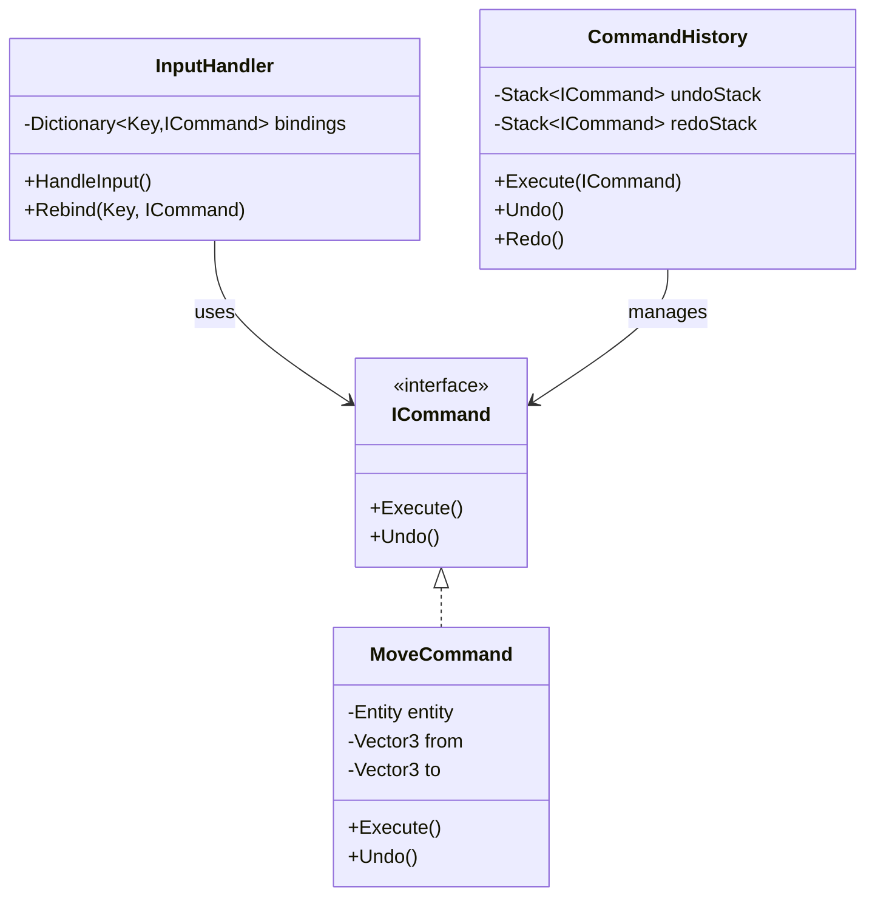
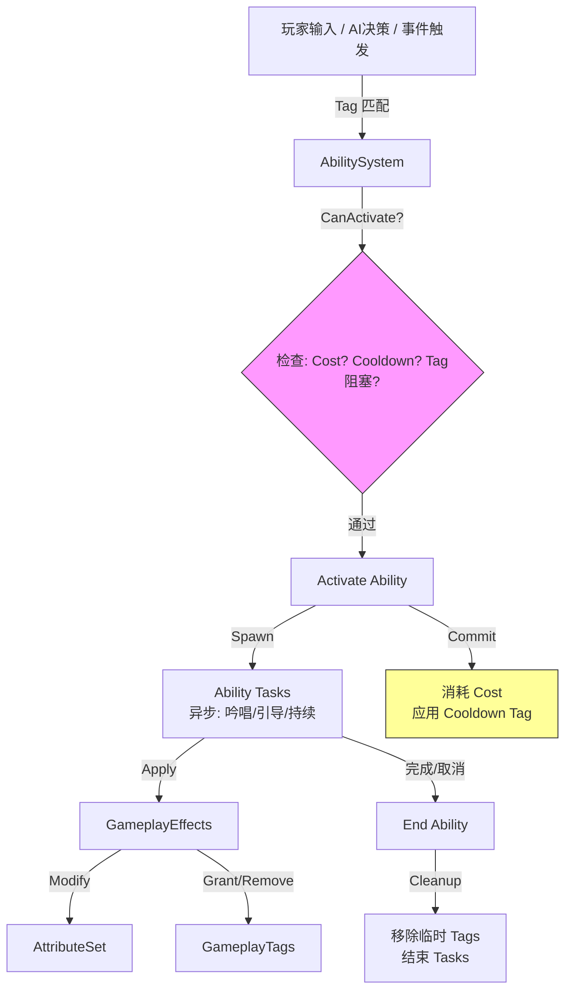

# Command 与技能系统

> 所属计划: 游戏架构设计
> 预计耗时: 75min
> 前置知识: [[13-game-state-management|13 游戏状态管理]]、[[14-event-driven-architecture|14 事件驱动游戏架构]]

---

## 1. 概念讲解

### 为什么需要这个？

游戏开发中，玩家按下 "W" 键让角色前进——这个看似简单的操作，背后隐藏着复杂的架构决策。如果直接在输入回调里写 `player.Position += Vector3.forward`，你会立刻遇到一系列问题：

- **输入硬编码**：想把 "W" 改成方向键？需要改源码重新编译。
- **无法撤销**：玩家误操作后，没有统一机制回退。
- **回放 impossible**：想做战斗回放或网络同步，发现输入和逻辑缠成一团。
- **技能系统爆炸**：每个技能写一堆 `if-else`，冷却、消耗、效果散落各处。

Command 模式与 Ability System 正是解决这些问题的核心架构。Command 将"请求"封装为对象，解耦**谁触发**与**谁执行**；Ability System 则将技能抽象为数据驱动的管线，统一处理激活条件、效果应用、资源消耗与标签约束。

> 类比：Command 像餐厅的点菜单——服务员（InputHandler）记录客人的需求（Command），厨房（Receiver）按单执行，菜单可以撤销（退菜）、批量（套餐）、存档（外卖订单）。Ability System 像医院的处方系统——诊断（Tag）决定能否开药，药品（Effect）有剂量（Modifier）和禁忌（Cost/Cooldown 约束）。

### 核心思想

#### 1. Command 模式：请求即对象

GoF 定义：将请求封装为对象，从而可用不同的请求、队列或日志来参数化其他对象，同时支持可撤销操作。



关键洞察：**Command 是具体化的输入**。Nystrom 在《Game Programming Patterns》中强调，这与"回调函数"的本质区别在于：Command 是**一等对象**，可被存储、传递、组合、序列化。

#### 2. 输入绑定：运行时映射

`InputHandler` 维护 `Dictionary<KeyCode, ICommand>`，按键触发时查找并执行对应 Command。运行时重绑定只需替换字典中的值，无需修改调用代码。

#### 3. 撤销重做：状态快照策略

`CommandHistory` 维护两个栈：
- `undoStack`：已执行命令，Undo 时弹出并调用 `command.Undo()`
- `redoStack`：被撤销命令，Redo 时弹出并重新 `Execute`

> ⚠️ 核心决策：Undo 的实现方式
> - **逆操作**：`MoveRight` 的 Undo 是 `MoveLeft`——仅对简单操作安全
> - **状态快照**：保存执行前的完整状态——通用但内存开销大
> - **增量记录**：保存 `from → to` 的差值——Command 模式推荐

#### 4. 回放与命令流

将 Command 序列加上时间戳序列化为 `CommandStream`，重放时按时间戳调度执行。这是**确定性回放**（Deterministic Replay）的基础，也是网络同步中"输入预测+回滚"的底层机制。

#### 5. Ability System 架构：数据驱动的技能管线

Unreal 的 Gameplay Ability System (GAS) 提供了行业标杆设计，核心抽象：

| 概念 | 职责 | 类比 |
|------|------|------|
| `Ability` | 技能定义：何时能激活、激活时做什么 | 处方 |
| `GameplayEffect` | 运行时属性变化：加血、减蓝、持续伤害 | 药品 |
| `GameplayTag` | 分类/状态标记：燃烧、眩晕、冷却中 | 诊断标签 |
| `Modifier` | 数值修改方式：加、乘、覆盖 | 剂量 |
| `AttributeSet` | 角色属性容器：HP、MP、Attack | 病历 |



#### 6. 事件与 Command 的边界

| 场景 | 推荐方案 | 原因 |
|------|---------|------|
| 玩家输入 → 角色移动 | Command | 需要撤销、重绑定、回放 |
| 技能命中 → 造成伤害 | Event / Effect | 触发式、无撤销需求 |
| 网络同步玩家操作 | Command 序列 | 确定性回放、带宽优化 |
| 持续 Buff/Debuff | Effect + Tag | 时间驱动、需堆叠管理 |
| 技能连招判定 | Tag + Ability 任务 | 状态机复杂、需异步等待 |

> Command 适合**离散、可撤销、需记录**的操作；Ability System 适合**持续、标签化、需网络同步**的游戏玩法。

---

## 2. 代码示例

以下 .NET 8 控制台程序完整演示：Command 模式（输入绑定、撤销重做、宏命令）+ 简化 Ability System（火球技能：Mana 消耗、冷却 Tag、Damage Effect）。

```csharp
using System;
using System.Collections.Generic;
using System.Linq;

// ============================================
// 部分一：Command 模式基础设施
// ============================================

public interface ICommand
{
    void Execute();
    void Undo();
    string Name { get; }
}

// 移动命令：保存 from/to 状态快照，支持撤销
public class MoveCommand : ICommand
{
    private readonly Entity _entity;
    private readonly Vector3 _from;
    private readonly Vector3 _to;
    
    public string Name => $"Move({_entity.Name}, {_to})";
    
    public MoveCommand(Entity entity, Vector3 to)
    {
        _entity = entity;
        _to = to;
        _from = entity.Position; // 快照：执行前状态
    }
    
    public void Execute() => _entity.Position = _to;
    public void Undo() => _entity.Position = _from;
}

// 跳跃命令：垂直位移，同样保存快照
public class JumpCommand : ICommand
{
    private readonly Entity _entity;
    private readonly Vector3 _from;
    private readonly float _jumpHeight;
    
    public string Name => $"Jump({_entity.Name}, h={_jumpHeight})";
    
    public JumpCommand(Entity entity, float jumpHeight = 10f)
    {
        _entity = entity;
        _jumpHeight = jumpHeight;
        _from = entity.Position;
    }
    
    public void Execute() => _entity.Position = new Vector3(
        _entity.Position.X, 
        _entity.Position.Y + _jumpHeight, 
        _entity.Position.Z);
    
    public void Undo() => _entity.Position = _from;
}

// 宏命令：组合多个命令，用于连招
public class MacroCommand : ICommand
{
    private readonly List<ICommand> _commands;
    private readonly string _name;
    
    public string Name => $"Macro[{_name}]";
    
    public MacroCommand(string name, IEnumerable<ICommand> commands)
    {
        _name = name;
        _commands = commands.ToList();
    }
    
    public void Execute()
    {
        foreach (var cmd in _commands)
        {
            Console.WriteLine($"  > {cmd.Name}");
            cmd.Execute();
        }
    }
    
    public void Undo()
    {
        // 逆序撤销：LIFO 保证状态正确回退
        for (int i = _commands.Count - 1; i >= 0; i--)
        {
            Console.WriteLine($"  < {_commands[i].Name}");
            _commands[i].Undo();
        }
    }
}

// 命令历史：撤销/重做管理器
public class CommandHistory
{
    private readonly Stack<ICommand> _undoStack = new();
    private readonly Stack<ICommand> _redoStack = new();
    
    public void Execute(ICommand command)
    {
        command.Execute();
        _undoStack.Push(command);
        _redoStack.Clear(); // 新命令使 redo 历史失效
        Console.WriteLine($"[History] Executed: {command.Name}");
    }
    
    public bool CanUndo => _undoStack.Count > 0;
    public bool CanRedo => _redoStack.Count > 0;
    
    public void Undo()
    {
        if (!CanUndo) { Console.WriteLine("[History] Nothing to undo"); return; }
        
        var cmd = _undoStack.Pop();
        cmd.Undo();
        _redoStack.Push(cmd);
        Console.WriteLine($"[History] Undo: {cmd.Name}");
    }
    
    public void Redo()
    {
        if (!CanRedo) { Console.WriteLine("[History] Nothing to redo"); return; }
        
        var cmd = _redoStack.Pop();
        cmd.Execute();
        _undoStack.Push(cmd);
        Console.WriteLine($"[History] Redo: {cmd.Name}");
    }
}

// 命令记录器：支持回放
public class CommandRecorder
{
    private readonly List<(ICommand Command, float Timestamp)> _records = new();
    private float _startTime;
    
    public void Start() => _startTime = DateTime.Now.Millisecond;
    
    public void Record(ICommand command)
    {
        float t = (DateTime.Now.Millisecond - _startTime) / 1000f;
        _records.Add((command, t));
        Console.WriteLine($"[Recorder] @{t:F2}s: {command.Name}");
    }
    
    public void Replay()
    {
        Console.WriteLine("\n=== REPLAY START ===");
        float lastT = 0;
        foreach (var (cmd, t) in _records)
        {
            // 模拟时间间隔（实际应用用真实计时器）
            int delayMs = (int)((t - lastT) * 1000);
            if (delayMs > 0) System.Threading.Thread.Sleep(Math.Min(delayMs, 500));
            Console.WriteLine($"[Replay] @{t:F2}s: {cmd.Name}");
            cmd.Execute();
            lastT = t;
        }
        Console.WriteLine("=== REPLAY END ===\n");
    }
}

// ============================================
// 部分二：简化 Ability System
// ============================================

// 游戏标签：用于分类、状态标记、约束检查
public class GameplayTag
{
    public string Name { get; }
    public GameplayTag(string name) => Name = name;
    
    public static readonly GameplayTag Cooldown_Fireball = new("Cooldown.Fireball");
    public static readonly GameplayTag State_Stunned = new("State.Stunned");
    public static readonly GameplayTag Effect_Burning = new("Effect.Burning");
}

public class GameplayTagContainer
{
    private readonly HashSet<GameplayTag> _tags = new();
    
    public bool HasTag(GameplayTag tag) => _tags.Contains(tag);
    public void AddTag(GameplayTag tag) { _tags.Add(tag); Console.WriteLine($"  [Tag] +{tag.Name}"); }
    public void RemoveTag(GameplayTag tag) { _tags.Remove(tag); Console.WriteLine($"  [Tag] -{tag.Name}"); }
}

// 属性与属性集
public class Attribute
{
    public string Name { get; }
    public float BaseValue { get; set; }
    public float CurrentValue { get; set; }
    
    public Attribute(string name, float baseValue)
    {
        Name = name;
        BaseValue = CurrentValue = baseValue;
    }
    
    public override string ToString() => $"{Name}: {CurrentValue:F1}/{BaseValue:F1}";
}

public class AttributeSet
{
    public Attribute Health { get; } = new("Health", 100);
    public Attribute Mana { get; } = new("Mana", 100);
    public Attribute AttackPower { get; } = new("AttackPower", 20);
    
    public void PrintStatus()
    {
        Console.WriteLine($"  [Attr] {Health}, {Mana}, {AttackPower}");
    }
}

// 游戏效果：运行时修改属性
public class GameplayEffect
{
    public string Name { get; }
    public Dictionary<string, float> AttributeModifiers { get; } = new();
    public GameplayTag[] GrantedTags { get; set; } = Array.Empty<GameplayTag>();
    public float Duration { get; set; } = 0; // 0 = 瞬时
    
    public GameplayEffect(string name) => Name = name;
    
    public void Apply(AbilityOwner owner)
    {
        Console.WriteLine($"  [Effect] Apply '{Name}' (duration={Duration}s)");
        foreach (var (attrName, mod) in AttributeModifiers)
        {
            var attr = owner.Attributes.GetType().GetProperty(attrName)?.GetValue(owner.Attributes) as Attribute;
            if (attr != null)
            {
                attr.CurrentValue += mod;
                Console.WriteLine($"    -> {attrName}: {mod:F1} (now {attr.CurrentValue:F1})");
            }
        }
        foreach (var tag in GrantedTags) owner.Tags.AddTag(tag);
    }
    
    public bool CanApply(AbilityOwner owner) => true; // 可扩展：检查免疫标签等
}

// 技能定义
public class Ability
{
    public string Name { get; }
    public GameplayTag CooldownTag { get; set; }
    public GameplayEffect CostEffect { get; set; }
    public GameplayEffect[] Effects { get; set; } = Array.Empty<GameplayEffect>();
    
    // 激活条件：标签约束 + 资源检查
    public virtual bool CanActivate(AbilityOwner owner)
    {
        if (CooldownTag != null && owner.Tags.HasTag(CooldownTag))
        {
            Console.WriteLine($"  [Ability] BLOCKED: {CooldownTag.Name} active");
            return false;
        }
        if (CostEffect != null && !CostEffect.CanApply(owner))
        {
            Console.WriteLine($"  [Ability] BLOCKED: Cost cannot apply");
            return false;
        }
        // 额外：检查 Cost 的 Mana 消耗是否足够
        if (CostEffect?.AttributeModifiers.TryGetValue("Mana", out var manaCost) == true)
        {
            if (owner.Attributes.Mana.CurrentValue < -manaCost) // cost is negative
            {
                Console.WriteLine($"  [Ability] BLOCKED: Mana insufficient ({owner.Attributes.Mana.CurrentValue:F1} < {-manaCost:F1})");
                return false;
            }
        }
        return true;
    }
    
    public virtual void Activate(AbilityOwner owner)
    {
        Console.WriteLine($"[Ability] Activate '{Name}'");
        
        // 1. 应用消耗（如 Mana）
        CostEffect?.Apply(owner);
        
        // 2. 应用主要效果（如伤害）
        foreach (var fx in Effects) fx.Apply(owner);
        
        // 3. 进入冷却（添加 Tag）
        if (CooldownTag != null) owner.Tags.AddTag(CooldownTag);
    }
    
    public virtual void EndAbility(AbilityOwner owner)
    {
        Console.WriteLine($"[Ability] End '{Name}'");
        // 冷却结束时可移除 Tag（实际由 Duration 管理或定时器）
    }
}

// 技能持有者
public class AbilityOwner
{
    public string Name { get; }
    public AttributeSet Attributes { get; } = new();
    public GameplayTagContainer Tags { get; } = new();
    public List<Ability> Abilities { get; } = new();
    
    public AbilityOwner(string name) => Name = name;
    
    public void ApplyEffect(GameplayEffect effect) => effect.Apply(this);
    
    public bool TryActivateAbility(Ability ability)
    {
        Console.WriteLine($"\n[Owner] {Name} tries to activate '{ability.Name}'");
        Attributes.PrintStatus();
        
        if (!ability.CanActivate(this)) return false;
        ability.Activate(this);
        Attributes.PrintStatus();
        return true;
    }
}

// ============================================
// 部分三：辅助类型与测试
// ============================================

public record Vector3(float X, float Y, float Z)
{
    public override string ToString() => $"({X:F1}, {Y:F1}, {Z:F1})";
}

public class Entity
{
    public string Name { get; }
    public Vector3 Position { get; set; }
    
    public Entity(string name, Vector3 pos) { Name = name; Position = pos; }
    
    public override string ToString() => $"{Name}@{Position}";
}

// 输入处理器：按键 -> Command 映射
public class InputHandler
{
    private readonly Dictionary<ConsoleKey, ICommand> _bindings = new();
    private readonly CommandHistory _history;
    private readonly CommandRecorder _recorder;
    
    public InputHandler(CommandHistory history, CommandRecorder recorder)
    {
        _history = history;
        _recorder = recorder;
    }
    
    public void Bind(ConsoleKey key, ICommand command) => _bindings[key] = command;
    
    public void HandleInput(ConsoleKey key)
    {
        if (!_bindings.TryGetValue(key, out var cmd))
        {
            Console.WriteLine($"[Input] Unbound key: {key}");
            return;
        }
        
        Console.WriteLine($"[Input] {key} -> {cmd.Name}");
        _history.Execute(cmd);
        _recorder.Record(cmd);
    }
    
    public void Rebind(ConsoleKey oldKey, ConsoleKey newKey)
    {
        if (_bindings.Remove(oldKey, out var cmd))
        {
            _bindings[newKey] = cmd;
            Console.WriteLine($"[Input] Rebound {oldKey} -> {newKey} for {cmd.Name}");
        }
    }
}

class Program
{
    static void Main()
    {
        Console.WriteLine("=== Command & Ability System Demo ===\n");
        
        // ---- 演示 1: Command 模式 ----
        var player = new Entity("Hero", new Vector3(0, 0, 0));
        var history = new CommandHistory();
        var recorder = new CommandRecorder();
        var input = new InputHandler(history, recorder);
        
        // 绑定输入
        input.Bind(ConsoleKey.W, new MoveCommand(player, new Vector3(0, 0, 1)));
        input.Bind(ConsoleKey.S, new MoveCommand(player, new Vector3(0, 0, -1)));
        input.Bind(ConsoleKey.Spacebar, new JumpCommand(player, 5f));
        
        // 创建连招宏：轻击-轻击-重击
        var combo = new MacroCommand("Light-Light-Heavy", new ICommand[]
        {
            new MoveCommand(player, new Vector3(1, 0, 0)),  // 轻击位移
            new MoveCommand(player, new Vector3(2, 0, 0)),  // 轻击位移
            new MoveCommand(player, new Vector3(5, 0, 0)),  // 重击大位移
        });
        input.Bind(ConsoleKey.C, combo);
        
        recorder.Start();
        
        Console.WriteLine("--- 模拟输入序列 W, Space, W, C ---");
        input.HandleInput(ConsoleKey.W);
        input.HandleInput(ConsoleKey.Spacebar);
        input.HandleInput(ConsoleKey.W);
        input.HandleInput(ConsoleKey.C);
        
        Console.WriteLine($"\n最终位置: {player}");
        
        // 撤销演示
        Console.WriteLine("\n--- 撤销 3 次 ---");
        history.Undo(); // 撤销宏
        history.Undo(); // 撤销 W
        history.Undo(); // 撤销 Space
        Console.WriteLine($"撤销后位置: {player}");
        
        // 重做演示
        Console.WriteLine("\n--- 重做 1 次 ---");
        history.Redo();
        Console.WriteLine($"重做后位置: {player}");
        
        // 回放演示
        recorder.Replay();
        
        // 运行时重绑定
        Console.WriteLine("\n--- 重绑定: S -> X ---");
        input.Rebind(ConsoleKey.S, ConsoleKey.X);
        
        // ---- 演示 2: Ability System ----
        Console.WriteLine("\n\n=== Ability System Demo ===\n");
        
        var mage = new AbilityOwner("Mage");
        
        // 构建火球技能
        var fireballCost = new GameplayEffect("FireballCost")
        {
            AttributeModifiers = { ["Mana"] = -30f } // 消耗 30 Mana
        };
        
        var fireballDamage = new GameplayEffect("FireballDamage")
        {
            AttributeModifiers = { ["Health"] = -25f }, // 对目标造成伤害（这里简化为自伤演示）
            GrantedTags = new[] { GameplayTag.Effect_Burning },
            Duration = 3f
        };
        
        var fireball = new Ability("Fireball")
        {
            CooldownTag = GameplayTag.Cooldown_Fireball,
            CostEffect = fireballCost,
            Effects = new[] { fireballDamage }
        };
        
        // 尝试激活：成功
        mage.TryActivateAbility(fireball);
        
        // 尝试再次激活：失败（冷却中）
        mage.TryActivateAbility(fireball);
        
        // 模拟冷却结束（实际由计时器管理）
        Console.WriteLine("\n--- 模拟冷却结束 ---");
        mage.Tags.RemoveTag(GameplayTag.Cooldown_Fireball);
        
        // 耗尽 Mana 后尝试
        Console.WriteLine("\n--- 耗尽 Mana ---");
        mage.Attributes.Mana.CurrentValue = 10;
        mage.TryActivateAbility(fireball);
        
        Console.WriteLine("\n=== Demo Complete ===");
    }
}
```

**运行方式:**

```bash
# 需要 .NET 8 SDK
dotnet new console -n CommandAbilityDemo
cd CommandAbilityDemo
# 将上述代码覆盖 Program.cs
dotnet run
```

**预期输出:**

```text
=== Command & Ability System Demo ===

--- 模拟输入序列 W, Space, W, C ---
[Input] W -> Move(Hero, (0.0, 0.0, 1.0))
[History] Executed: Move(Hero, (0.0, 0.0, 1.0))
[Recorder] @0.00s: Move(Hero, (0.0, 0.0, 1.0))
[Input] Spacebar -> Jump(Hero, h=5)
[History] Executed: Jump(Hero, h=5)
[Recorder] @0.00s: Jump(Hero, h=5)
[Input] W -> Move(Hero, (0.0, 0.0, 1.0))
[History] Executed: Move(Hero, (0.0, 0.0, 1.0))
[Recorder] @0.00s: Move(Hero, (0.0, 0.0, 1.0))
[Input] C -> Macro[Light-Light-Heavy]
[History] Executed: Macro[Light-Light-Heavy]
[Recorder] @0.00s: Macro[Light-Light-Heavy]
  > Move(Hero, (1.0, 0.0, 0.0))
  > Move(Hero, (2.0, 0.0, 0.0))
  > Move(Hero, (5.0, 0.0, 0.0))

最终位置: Hero@(5.0, 5.0, 2.0)

--- 撤销 3 次 ---
[History] Undo: Macro[Light-Light-Heavy]
  < Move(Hero, (5.0, 0.0, 0.0))
  < Move(Hero, (2.0, 0.0, 0.0))
  < Move(Hero, (1.0, 0.0, 0.0))
[History] Undo: Move(Hero, (0.0, 0.0, 1.0))
[History] Undo: Jump(Hero, h=5)
撤销后位置: Hero@(0.0, 0.0, 1.0)

--- 重做 1 次 ---
[History] Redo: Jump(Hero, h=5)
重做后位置: Hero@(0.0, 5.0, 1.0)

=== REPLAY START ===
[Replay] @0.00s: Move(Hero, (0.0, 0.0, 1.0))
[Replay] @0.00s: Jump(Hero, h=5)
[Replay] @0.00s: Move(Hero, (0.0, 0.0, 1.0))
[Replay] @0.00s: Macro[Light-Light-Heavy]
  > Move(Hero, (1.0, 0.0, 0.0))
  > Move(Hero, (2.0, 0.0, 0.0))
  > Move(Hero, (5.0, 0.0, 0.0))
=== REPLAY END ===

--- 重绑定: S -> X ---


=== Ability System Demo ===

[Owner] Mage tries to activate 'Fireball'
  [Attr] Health: 100.0/100.0, Mana: 100.0/100.0, AttackPower: 20.0/20.0
[Ability] Activate 'Fireball'
  [Effect] Apply 'FireballCost' (duration=0s)
    -> Mana: -30.0 (now 70.0)
  [Effect] Apply 'FireballDamage' (duration=3s)
    -> Health: -25.0 (now 75.0)
  [Tag] +Effect.Burning
  [Tag] +Cooldown.Fireball
  [Attr] Health: 75.0/100.0, Mana: 70.0/100.0, AttackPower: 20.0/20.0

[Owner] Mage tries to activate 'Fireball'
  [Attr] Health: 75.0/100.0, Mana: 70.0/100.0, AttackPower: 20.0/20.0
  [Ability] BLOCKED: Cooldown.Fireball active

--- 模拟冷却结束 ---
  [Tag] -Cooldown.Fireball

--- 耗尽 Mana ---
  [Attr] Health: 75.0/100.0, Mana: 10.0/100.0, AttackPower: 20.0/20.0
  [Ability] BLOCKED: Mana insufficient (10.0 < 30.0)

=== Demo Complete ===
```

> **Unity 迁移提示**：Command 可替换为 `UnityEngine.InputSystem` 的 `InputAction` 回调，将 `ICommand` 实例绑定到 `performed` 事件；Ability System 可将 `Ability` 数据配置为 `ScriptableObject`，`AttributeSet` 挂载为 `MonoBehaviour`，`GameplayEffect` 用 `ScriptableObject` 定义并通过 `ScriptableObject.CreateInstance` 实例化。

---

## 3. 练习

### 练习 1: 基础

实现 `JumpCommand` 绑定到空格键，并支持撤销（把角色移回原位置）。要求：
- `JumpCommand` 记录执行前的 `Y` 坐标
- `Undo()` 恢复至该 `Y` 坐标（而非简单减去跳跃高度，防止多次撤销累积误差）
- 在 `InputHandler` 中绑定 `ConsoleKey.Spacebar`

### 练习 2: 进阶

实现命令宏 `MacroCommand`（连续 `Execute`/`Undo`）用于连招"轻击-轻击-重击"。要求：
- `MacroCommand` 持有 `List<ICommand>`
- `Execute` 按序执行子命令
- `Undo` **逆序**撤销子命令（为什么必须逆序？）
- 创建具体连招：两次 `MoveCommand`（位移 1, 2）+ 一次 `MoveCommand`（位移 5）

### 练习 3: 挑战（可选）

为 AbilitySystem 添加完整的 Cost Effect（消耗 Mana）和 Cooldown Effect（Tag 冷却中阻止再次激活），并处理标签冲突。要求：
- `Activate` 前检查 `owner.Attributes.Mana.CurrentValue >= cost` 且 `!owner.Tags.HasTag(CooldownTag)`
- `Activate` 时"提交"（Commit）：应用 Cost、添加 Cooldown Tag
- `EndAbility` 时移除 Cooldown Tag（模拟冷却结束）
- 添加阻塞标签机制：如果持有 `State.Stunned`，任何 Ability 都无法激活

---

## 3.5 参考答案

> [!tip]- 练习 1 参考答案
> 
> ```csharp
> public class JumpCommand : ICommand
> {
>     private readonly Entity _entity;
>     private readonly float _fromY;  // 快照：执行前的 Y 坐标
>     private readonly float _jumpHeight;
>     
>     public string Name => $"Jump({_entity.Name}, h={_jumpHeight})";
>     
>     public JumpCommand(Entity entity, float jumpHeight = 10f)
>     {
>         _entity = entity;
>         _jumpHeight = jumpHeight;
>         _fromY = entity.Position.Y;  // 关键：保存绝对状态，而非相对增量
>     }
>     
>     public void Execute()
>     {
>         var pos = _entity.Position;
>         _entity.Position = pos with { Y = pos.Y + _jumpHeight };
>     }
>     
>     public void Undo()
>     {
>         var pos = _entity.Position;
>         _entity.Position = pos with { Y = _fromY };  // 恢复绝对位置
>     }
> }
> ```
> 
> **关键设计**：使用 `_fromY` 快照而非 `_jumpHeight` 逆运算。假设角色在跳跃过程中被其他 Effect 抬升（如平台上升），`Y - _jumpHeight` 会落到错误位置；快照保证撤销的幂等正确性。
> 
> 绑定代码：
> ```csharp
> input.Bind(ConsoleKey.Spacebar, new JumpCommand(player, 5f));
> ```

> [!tip]- 练习 2 参考答案
> 
> ```csharp
> public class MacroCommand : ICommand
> {
>     private readonly List<ICommand> _commands;
>     private readonly string _name;
>     
>     public string Name => $"Macro[{_name}]";
>     
>     public MacroCommand(string name, IEnumerable<ICommand> commands)
>     {
>         _name = name;
>         _commands = commands.ToList();
>     }
>     
>     public void Execute()
>     {
>         foreach (var cmd in _commands)
>         {
>             cmd.Execute();  // 正序：轻击1 → 轻击2 → 重击
>         }
>     }
>     
>     public void Undo()
>     {
>         // 必须逆序！
>         // 原因：状态依赖。假设轻击1将角色移到(1,0,0)，轻击2基于该位置移到(3,0,0)。
>         // 若正序撤销：先撤销轻击1（回0,0,0），再撤销轻击2（基于错误位置回-2,0,0）。
>         // 逆序保证每次撤销时，当前状态正是该命令执行后的状态。
>         for (int i = _commands.Count - 1; i >= 0; i--)
>         {
>             _commands[i].Undo();
>         }
>     }
> }
> 
> // 连招构建
> var combo = new MacroCommand("Light-Light-Heavy", new ICommand[]
> {
>     new MoveCommand(player, new Vector3(1, 0, 0)),
>     new MoveCommand(player, new Vector3(3, 0, 0)),  // 注意：基于当前位置+2
>     new MoveCommand(player, new Vector3(8, 0, 0)),  // 重击：基于当前位置+5
> });
> ```
> 
> **逆序撤销的数学本质**：命令序列构成状态转换链 `S₀ → S₁ → S₂ → S₃`。`Undo` 需要 `S₃ → S₂ → S₁ → S₀`。若正序撤销 `cmd₁`，则试图应用 `S₁ → S₀` 的逆变换到 `S₃`，结果不可预期。

> [!tip]- 练习 3 参考答案
> 
> ```csharp
> public class Ability
> {
>     public string Name { get; }
>     public GameplayTag CooldownTag { get; set; }
>     public GameplayEffect CostEffect { get; set; }
>     public GameplayEffect[] Effects { get; set; } = Array.Empty<GameplayEffect>();
>     
>     // 阻塞标签：持有任一此类标签则无法激活
>     public GameplayTag[] BlockTags { get; set; } = new[] { GameplayTag.State_Stunned };
>     
>     public Ability(string name) => Name = name;
>     
>     public virtual bool CanActivate(AbilityOwner owner)
>     {
>         // 检查阻塞标签
>         foreach (var block in BlockTags)
>         {
>             if (owner.Tags.HasTag(block))
>             {
>                 Console.WriteLine($"  [Ability] BLOCKED: {block.Name} present");
>                 return false;
>             }
>         }
>         
>         // 检查冷却
>         if (CooldownTag != null && owner.Tags.HasTag(CooldownTag))
>         {
>             Console.WriteLine($"  [Ability] BLOCKED: {CooldownTag.Name} active");
>             return false;
>         }
>         
>         // 检查资源消耗
>         if (CostEffect != null)
>         {
>             if (!CostEffect.CanApply(owner)) return false;
>             
>             // 预计算 Mana 是否足够
>             if (CostEffect.AttributeModifiers.TryGetValue("Mana", out var manaCost))
>             {
>                 var required = -manaCost; // cost 存储为负值
>                 if (owner.Attributes.Mana.CurrentValue < required)
>                 {
>                     Console.WriteLine($"  [Ability] BLOCKED: Mana {owner.Attributes.Mana.CurrentValue:F1} < {required:F1}");
>                     return false;
>                 }
>             }
>         }
>         
>         return true;
>     }
>     
>     public virtual void Activate(AbilityOwner owner)
>     {
>         Console.WriteLine($"[Ability] Activate '{Name}'");
>         
>         // Commit: 应用消耗
>         if (CostEffect != null)
>         {
>             CostEffect.Apply(owner);
>             Console.WriteLine($"  [Commit] Cost applied");
>         }
>         
>         // 应用效果
>         foreach (var fx in Effects) fx.Apply(owner);
>         
>         // 进入冷却
>         if (CooldownTag != null)
>         {
>             owner.Tags.AddTag(CooldownTag);
>             Console.WriteLine($"  [Commit] Cooldown started: {CooldownTag.Name}");
>         }
>     }
>     
>     public virtual void EndAbility(AbilityOwner owner)
>     {
>         Console.WriteLine($"[Ability] End '{Name}'");
>         
>         // 冷却结束，移除 Tag
>         if (CooldownTag != null)
>         {
>             owner.Tags.RemoveTag(CooldownTag);
>             Console.WriteLine($"  [Cooldown] Cleared: {CooldownTag.Name}");
>         }
>         
>         // 清理临时授予的标签（如引导中的免疫）
>         // 实际由 Effect 的 Duration 自动管理，此处简化
>     }
> }
> 
> // 使用演示：Stunned 状态阻止所有技能
> var stunnedOwner = new AbilityOwner("StunnedMage");
> stunnedOwner.Tags.AddTag(GameplayTag.State_Stunned);
> stunnedOwner.TryActivateAbility(fireball); // 输出：BLOCKED: State.Stunned present
> ```
> 
> **标签冲突处理策略**：
> - **阻塞标签（Block Tags）**：全局阻止，如 Stunned、Dead
> - **需求标签（Required Tags）**：必须持有才能激活，如特定 Buff 下的强化技能
> - **取消标签（Cancel Tags）**：激活时移除其他标签，如净化技能
> - **免疫标签（Immunity Tags）**：阻止特定 Effect 应用，如 FireImmune 无视 Burning

> [!note] 答案使用方式
> 如果你的实现通过了以下验证，就是正确的：
> - 练习1：`JumpCommand` 执行后 `Undo` 回到精确原位置，连续 Execute/Undo/Redo 不漂移。
> - 练习2：`MacroCommand` 的 `Undo` 后，实体位置回到宏执行前；正序 `Undo` 会导致位置错误（可自行对比验证）。
> - 练习3：Cooldown 期间重复激活被拒绝；Stunned 时所有技能被拒绝；`EndAbility` 后 Cooldown Tag 清除可再次激活。
> 
> 参考答案提供的是**一种正确实现**，并非唯一解。你的代码若满足行为契约，即使结构不同也是正确的。
>
> ---

## 4. 扩展阅读

- [Nystrom — Command · Game Programming Patterns](https://gameprogrammingpatterns.com/command.html) — 游戏语境下 Command 模式的经典阐述，包含"具体化输入"与"回放"的深入讨论
- [Nystrom — Type Object · Game Programming Patterns](https://gameprogrammingpatterns.com/type-object.html) — 与 Ability System 数据驱动设计密切相关的模式，理解如何将类型信息外化为数据
- [Unreal Docs — Gameplay Ability System](https://dev.epicgames.com/documentation/unreal-engine/gameplay-ability-system-for-unreal-engine) — 官方文档，涵盖 Ability、Effect、Tag、AttributeSet 的完整 API 与网络同步机制
- [Epic — Your First 60 Minutes with GAS](https://dev.epicgames.com/community/learning/tutorials/8Xn9/unreal-engine-epic-for-indies-your-first-60-minutes-with-gameplay-ability-system) — 面向初学者的 GAS 快速上手教程，含项目设置与第一个技能实现

---

## 常见陷阱

- **把 Undo 直接设为逆操作而未保存前置状态，导致非幂等操作无法撤销**。正确做法：Command 构造函数中快照执行前的完整状态（如 `MoveCommand` 记录 `from` 位置），`Undo()` 恢复该快照而非数学逆运算。对于复合状态，考虑使用 Memento 模式或增量快照。

- **Command 持有 GameObject 引用导致反序列化回放失败**。正确做法：Command 只存储**实体 ID** 和**纯数据快照**，反序列化时通过 ID 从 EntityManager 重新获取对象；或采用 ECS 架构，Command 只包含 `Entity` 句柄与组件数据变更。

- **AbilitySystem 中 Effect 堆叠与覆盖规则未定义，导致数值混乱**。正确做法：为每个 `GameplayEffect` 定义明确的**堆叠策略**——`Add`（数值累加）、`Override`（后者覆盖）、`Multiply`（乘法叠加）、`Strongest`（取最大绝对值）。在 `Attribute` 上维护 `ActiveEffects` 列表，每次变更时按优先级重新计算 `CurrentValue` 而非直接修改。