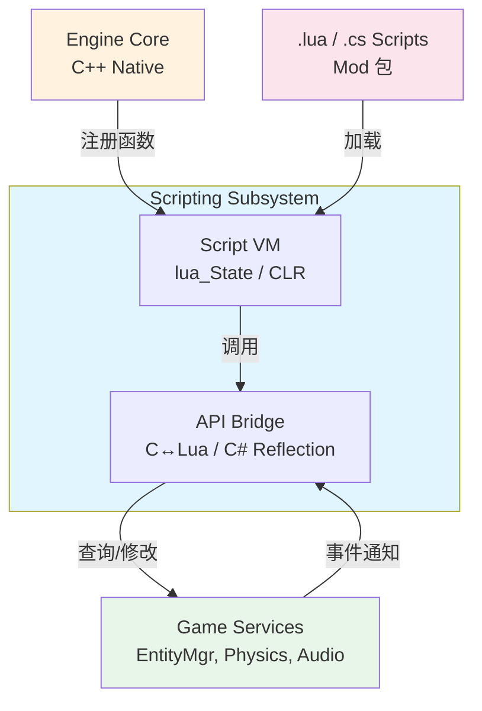

# 脚本与 Mod 架构

> 所属计划: 游戏架构设计
> 预计耗时: 75min
> 前置知识: [[08-game-engine-architecture|8 游戏引擎架构总览]]、[[16-gameplay-decoupling|16 玩法解耦]]

---

## 1. 概念讲解

### 为什么需要嵌入脚本？

游戏开发中，"编译-链接-运行" 的 C++ 迭代周期往往以分钟计，而设计师调整一个数值就要等一次完整构建，这是不可接受的。嵌入脚本语言的核心动机可以归纳为五点：

| 动机 | 实质说明 |
| --- | --- |
| 快速迭代 | 脚本无需编译，修改后立即生效，迭代周期从分钟降至秒级 |
| 设计师可修改 | 策划、关卡设计师可直接调整规则，无需程序员介入 |
| 热重载 | 运行中替换脚本逻辑，不重启游戏即可验证新行为 |
| Mod 支持 | 玩家社区可扩展游戏内容，延长产品生命周期 |
| 隔离崩溃 | 脚本错误通过 `pcall` 捕获，避免拖垮整个进程 |

从架构视角看，脚本层是引擎核心与游戏逻辑之间的**可变速层（variable velocity layer）**：底层引擎用 C++ 保证性能上限，上层脚本用 Lua/C# 保证开发弹性。这与 [[16-gameplay-decoupling]] 中讨论的"稳定抽象层 + 可变实现层"原则完全一致。

### 核心思想

#### 1. 脚本运行时作为子系统

嵌入脚本不是"加个库"那么简单，它是一个完整的**子系统**，需要明确的层级边界：



关键分层：
- `Script VM`：维护独立的执行环境（`lua_State` 或 CLR AppDomain）
- `API Bridge`：双向绑定——把 C++ 函数暴露给脚本，把脚本对象/回调暴露给 C++
- `Game Services`：脚本只通过白名单 API 访问引擎能力，形成**受控网关**

#### 2. Lua 嵌入：C API 的本质

Lua 的嵌入设计堪称典范。其核心不是"Lua 调用 C"，而是 **C 完全掌控 Lua 的执行生命周期**：

- `lua_State*`：独立的虚拟机实例，可创建多个实现隔离
- 栈模型：所有数据交换通过虚拟栈进行，C 压入参数，Lua 弹出执行，结果再压回
- `lua_pushcfunction` + `lua_setglobal`：注册 C 函数到 Lua 全局表，成为脚本可调用的 API
- `userdata` / `lightuserdata`：在 Lua 中包装 C 指针，实现对象绑定

现代 C++ 项目通常使用 **sol2** 或 **NLua** 等绑定库，它们用模板元编程自动生成胶水代码，但理解底层 C API 对调试和性能优化至关重要。

#### 3. C# 脚本：编译时与运行时的边界

Unity 的 C# 脚本方案是另一典型路径：

- **编辑期**：Roslyn 编译器将 `.cs` 编译为 IL，存入 Assembly
- **运行期**：CLR 通过 `Assembly.Load` 加载，反射创建 `MonoBehaviour` 实例
- **热重载限制**：Unity 的 Domain Reload 会重置静态状态，需用 `SerializeField` 或 `ScriptableObject` 持久化数据

纯 .NET 环境（如自定义引擎）可更灵活：
```csharp
// 运行时编译 C# 脚本
var script = CSharpScript.Create(code, ScriptOptions.Default
    .WithReferences(typeof(GameAPI).Assembly));
var result = await script.RunAsync(globals: new ScriptGlobals());
```

#### 4. 数据驱动设计：代码即解释器

[[16-gameplay-decoupling]] 讨论了配置与代码的分离，脚本架构将此推向极致：**把规则写成数据，让通用引擎去解释**。

Nystrom 的 **Type Object** 模式是核心思想：不用类层次定义敌人类型，而用数据表描述属性，运行时动态组合行为：

```lua
-- 不是 "class Goblin : Enemy"，而是数据定义
goblin_type = {
    name = "Goblin",
    hp = 30,
    speed = 5,
    ai_script = "goblin_brain.lua",
    on_hit = "flee_behavior"  -- 指向另一脚本模块
}
```

引擎的 C++ 代码成为**解释器**：读取类型数据 → 实例化实体 → 绑定对应的脚本模块 → 每帧调用其 `update(dt)`。这种设计的威力在于：新增敌人类型**不需要修改引擎代码**，只需要添加数据文件。

#### 5. 热重载的工程挑战

热重载不是"重新加载文件"那么简单。核心矛盾是：**替换逻辑，但保留状态**。

| 问题 | 机制 | 解决方案 |
| --- | --- | --- |
| 闭包/upvalue | Lua 函数捕获的外部局部变量 | 脚本不直接持有状态，状态存在 host 的 entity 表中 |
| 全局变量污染 | 旧脚本的全局残留影响新脚本 | 使用模块表 `return { update = update }`，避免全局 |
| 资源句柄失效 | 旧脚本持有的 C++ 对象指针已释放 | 用 ID 间接引用（如 entity ID），而非直接指针 |
| 协程状态 | 热重载时正在运行的协程 | 设计可中断/恢复的状态机，或限制协程使用 |

**正确范式**：Host 维护 `entity_id → transform/hp/状态` 的权威数据；脚本只接收 ID，通过 API 查询和修改。热重载时，替换的是脚本的 `update` 函数指针，entity 数据毫发无损。

#### 6. Mod 与沙箱：安全的三层防御

Mod 来自不可信来源，需要纵深防御：

```
Layer 1: 文件系统隔离
  └── Mod 只能访问自己的 zip/目录，通过 VFS 重定向

Layer 2: API 白名单
  └── 脚本环境 _ENV 仅暴露允许函数，移除 os/io/debug

Layer 3: 签名与校验
  └── 官方 Mod 用 RSA 签名验证；社区 Mod 可选沙箱更严格
```

Lua 的沙箱实现尤为直接：创建空表作为 `_ENV`，只注入白名单函数，不加载标准库或仅加载 `math`/`string` 等安全子集。

#### 7. 性能边界：脚本 vs 原生

必须建立清晰的性能认知：

| 场景 | 推荐位置 | 原因 |
| --- | --- | --- |
| 每帧 AI 决策（少量实体） | 脚本 | 逻辑复杂，迭代频繁，JIT 可接受 |
| 碰撞检测、物理模拟 | 原生 C++ | 高频调用，数值密集，需 SIMD |
| 粒子系统更新（10k+ 粒子） | 原生，或 GPU | 数据并行，脚本逐个回调不可行 |
| 技能效果组合（触发式） | 脚本 | 事件驱动，调用频率低，灵活性优先 |
| 渲染命令提交 | 原生 | 每帧必走，微秒级延迟敏感 |

核心原则：**脚本做"决策"，原生做"执行"**。脚本决定"向哪移动"，原生执行"矩阵变换+渲染"。

---

## 2. 代码示例

### C++ Host + Lua 脚本：完整可运行示例

以下实现一个最小但完整的嵌入脚本系统：C++ 引擎暴露 `move_entity` 和 `log` API，Lua 脚本定义 `enemy_behavior.update(dt)`，支持热重载。

```cpp
// host.cpp — C++ 引擎主机
// 运行环境: GCC 11+ / Clang 14+ / MSVC 2022, C++17
// 编译: g++ -std=c++17 host.cpp -llua5.4 -o host
// 依赖: Lua 5.4 开发库 (sudo apt install liblua5.4-dev)

#include <lua.hpp>
#include <cstdio>
#include <cstring>
#include <unordered_map>
#include <string>

// === Host 游戏状态：权威数据源，脚本只通过 ID 间接访问 ===
struct Transform {
    float x, y;
};

std::unordered_map<std::string, Transform> g_entities;

// === 暴露给 Lua 的 C API ===

static int lua_MoveEntity(lua_State* L) {
    const char* id = luaL_checkstring(L, 1);
    float dx = static_cast<float>(luaL_checknumber(L, 2));
    float dy = static_cast<float>(luaL_checknumber(L, 3));
    
    auto& t = g_entities[id];
    t.x += dx;
    t.y += dy;
    
    printf("[Native] move_entity: %s -> (%.2f, %.2f)\n", id, t.x, t.y);
    return 0; // 无返回值
}

static int lua_Log(lua_State* L) {
    const char* msg = luaL_checkstring(L, 1);
    printf("[Script] %s\n", msg);
    return 0;
}

// === 脚本管理：加载、热重载、调用 update ===

struct ScriptModule {
    lua_State* L;           // 独立 VM，实现 Mod 隔离
    int updateRef;          // 缓存 update 函数的 registry 引用
    std::string filepath;   // 源文件路径，用于检测修改
    std::string lastError;  // 上次错误信息
};

ScriptModule* script_create(const char* filepath) {
    ScriptModule* mod = new ScriptModule{};
    mod->L = luaL_newstate();
    mod->filepath = filepath;
    mod->updateRef = LUA_REFNIL;
    
    // 基础库：加载 math/string/table，跳过 os/io/debug（安全）
    luaL_requiref(mod->L, "_G", luaopen_base, 1); lua_pop(mod->L, 1);
    luaL_requiref(mod->L, "math", luaopen_math, 1); lua_pop(mod->L, 1);
    luaL_requiref(mod->L, "string", luaopen_string, 1); lua_pop(mod->L, 1);
    luaL_requiref(mod->L, "table", luaopen_table, 1); lua_pop(mod->L, 1);
    
    // 注册 API 到全局
    lua_pushcfunction(mod->L, lua_MoveEntity);
    lua_setglobal(mod->L, "move_entity");
    lua_pushcfunction(mod->L, lua_Log);
    lua_setglobal(mod->L, "log");
    
    return mod;
}

bool script_load(ScriptModule* mod) {
    // 使用 pcall 隔离加载错误
    if (luaL_loadfile(mod->L, mod->filepath.c_str()) != LUA_OK) {
        mod->lastError = lua_tostring(mod->L, -1);
        lua_pop(mod->L, 1);
        return false;
    }
    if (lua_pcall(mod->L, 0, 1, 0) != LUA_OK) { // 期望返回模块表
        mod->lastError = lua_tostring(mod->L, -1);
        lua_pop(mod->L, 1);
        return false;
    }
    
    // 提取返回表中的 update 函数，存入 registry 防止 GC
    if (!lua_istable(mod->L, -1)) {
        mod->lastError = "script must return a table";
        lua_pop(mod->L, 1);
        return false;
    }
    
    lua_getfield(mod->L, -1, "update");
    if (!lua_isfunction(mod->L, -1)) {
        mod->lastError = "script must return table with 'update' function";
        lua_pop(mod->L, 2);
        return false;
    }
    
    // 释放旧引用，保存新引用
    if (mod->updateRef != LUA_REFNIL) {
        luaL_unref(mod->L, LUA_REGISTRYINDEX, mod->updateRef);
    }
    mod->updateRef = luaL_ref(mod->L, LUA_REGISTRYINDEX);
    
    lua_pop(mod->L, 1); // 弹出模块表
    return true;
}

bool script_update(ScriptModule* mod, float dt) {
    if (mod->updateRef == LUA_REFNIL) return false;
    
    lua_rawgeti(mod->L, LUA_REGISTRYINDEX, mod->updateRef);
    lua_pushnumber(mod->L, dt);
    
    if (lua_pcall(mod->L, 1, 0, 0) != LUA_OK) {
        mod->lastError = lua_tostring(mod->L, -1);
        lua_pop(mod->L, 1);
        return false;
    }
    return true;
}

void script_destroy(ScriptModule* mod) {
    if (mod->updateRef != LUA_REFNIL) {
        luaL_unref(mod->L, LUA_REGISTRYINDEX, mod->updateRef);
    }
    lua_close(mod->L);
    delete mod;
}

// === 主循环：模拟游戏运行 + 热重载 ===

int main() {
    // 初始化游戏状态
    g_entities["enemy_01"] = {0.0f, 0.0f};
    
    ScriptModule* behavior = script_create("enemy_behavior.lua");
    
    printf("=== 首次加载 ===\n");
    if (!script_load(behavior)) {
        printf("ERROR: %s\n", behavior->lastError.c_str());
        return 1;
    }
    
    // 模拟 3 帧
    for (int frame = 1; frame <= 3; ++frame) {
        printf("\n--- Frame %d ---\n", frame);
        if (!script_update(behavior, 0.016f)) { // ~60fps
            printf("Runtime ERROR: %s\n", behavior->lastError.c_str());
        }
    }
    
    printf("\n=== 模拟热重载（修改 enemy_behavior.lua 后）===\n");
    printf("提示：实际项目中用文件时间戳或 inotify 检测修改\n");
    // 这里强制重新加载演示
    if (!script_load(behavior)) {
        printf("Reload ERROR: %s\n", behavior->lastError.c_str());
    }
    
    printf("\n--- Frame 4 (重载后) ---\n");
    script_update(behavior, 0.016f);
    
    // 打印最终状态，验证 entity 数据未被重置
    printf("\n=== 最终状态 ===\n");
    for (const auto& [id, t] : g_entities) {
        printf("%s: (%.4f, %.4f)\n", id.c_str(), t.x, t.y);
    }
    
    script_destroy(behavior);
    return 0;
}
```

```lua
-- enemy_behavior.lua — 初始版本
local function update(dt)
    log("enemy moving right")
    move_entity("enemy_01", 10.0 * dt, 0.0)
end

return { update = update }
```

**运行方式:**

```bash
# 1. 安装 Lua 5.4 开发库
sudo apt-get install liblua5.4-dev  # Ubuntu/Debian
# 或 brew install lua               # macOS

# 2. 编译
g++ -std=c++17 host.cpp -llua5.4 -o host

# 3. 运行（先创建初始脚本）
echo 'local function update(dt)
    log("enemy moving right")
    move_entity("enemy_01", 10.0 * dt, 0.0)
end
return { update = update }' > enemy_behavior.lua

./host
```

**预期输出:**

```text
=== 首次加载 ===

--- Frame 1 ---
[Script] enemy moving right
[Native] move_entity: enemy_01 -> (0.16, 0.00)

--- Frame 2 ---
[Script] enemy moving right
[Native] move_entity: enemy_01 -> (0.32, 0.00)

--- Frame 3 ---
[Script] enemy moving right
[Native] move_entity: enemy_01 -> (0.48, 0.00)

=== 模拟热重载（修改 enemy_behavior.lua 后）===
提示：实际项目中用文件时间戳或 inotify 检测修改

--- Frame 4 (重载后) ---
[Script] enemy moving right
[Native] move_entity: enemy_01 -> (0.64, 0.00)

=== 最终状态 ===
enemy_01: (0.6400, 0.0000)
```

**热重载验证**：将 `enemy_behavior.lua` 修改为向左移动（`10.0 * dt` 改为 `-10.0 * dt`），重新 `script_load` 后，`enemy_01` 的坐标在原有基础上继续累加，**未被重置为零**——证明状态与逻辑成功分离。

---

### C# Roslyn 脚本示例（伪代码/可扩展结构）

```csharp
// .NET 8 控制台，NuGet: Microsoft.CodeAnalysis.CSharp.Scripting
using Microsoft.CodeAnalysis.CSharp.Scripting;
using Microsoft.CodeAnalysis.Scripting;

public class ScriptGlobals {
    public IGameAPI API { get; set; }
}

public interface IGameAPI {
    void MoveEntity(string id, float x, float y);
    void Log(string msg);
}

// 运行时编译并执行
var options = ScriptOptions.Default
    .WithReferences(typeof(IGameAPI).Assembly)
    .WithImports("System", "System.Linq");

var script = CSharpScript.Create(@"
    API.Log(""C# script running"");
    API.MoveEntity(""player_01"", 5.0f, 0.0f);
", options, globalsType: typeof(ScriptGlobals));

var result = await script.RunAsync(new ScriptGlobals { API = new GameAPIImpl() });
```

---

## 3. 练习

### 练习 1: 基础

在 C++ 主机中注册一个 `deal_damage(target, amount)` 函数供 Lua 调用，并在 Lua 中写一个技能脚本使用它。要求：
- `deal_damage` 修改 host 中 `g_entities[target].hp`
- Lua 脚本返回 `{ cast = function(caster, target) ... end }`
- 在 `main` 中调用 `script_cast` 模拟释放技能

### 练习 2: 进阶

实现 Lua 脚本热重载的完整检测-加载-回滚机制：
- 用 `stat()` 或 `std::filesystem::last_write_time` 检测文件修改
- 加载失败时保留旧 `updateRef` 不替换，避免"坏脚本"导致游戏崩溃
- 添加 `on_reload` 回调，让脚本有机会清理旧状态

### 练习 3: 挑战（可选）

设计并实现一个 Lua 沙箱，满足：
- 禁止访问 `os.execute`、`io.open`、`_G` 元表遍历
- 仅允许调用白名单 API：`move_entity`、`log`、`deal_damage`
- 限制单次脚本执行时间（如 100ms），防止死循环拖垮引擎

---

## 3.5 参考答案

> [!tip]- 练习 1 参考答案
> ```cpp
> // === 新增 C API ===
> struct Entity {
>     float hp = 100.0f;
>     Transform transform;
> };
> std::unordered_map<std::string, Entity> g_entities; // 替换原 Transform 结构
> 
> static int lua_DealDamage(lua_State* L) {
>     const char* target = luaL_checkstring(L, 1);
>     float amount = static_cast<float>(luaL_checknumber(L, 2));
>     
>     auto it = g_entities.find(target);
>     if (it != g_entities.end()) {
>         it->second.hp -= amount;
>         printf("[Native] deal_damage: %s takes %.1f, hp=%.1f\n", 
>                target, amount, it->second.hp);
>     }
>     return 0;
> }
> 
> // 注册时添加：
> lua_pushcfunction(mod->L, lua_DealDamage);
> lua_setglobal(mod->L, "deal_damage");
> ```
> 
> ```lua
> -- skill_fireball.lua
> local function cast(caster, target)
>     log("Fireball cast by " .. caster .. " at " .. target)
>     deal_damage(target, 25.0)
> end
> 
> return { cast = cast }
> ```
> 
> ```cpp
> // Host 调用侧：缓存 cast 函数，类似 updateRef 的处理
> int castRef = LUA_REFNIL;
> 
> // 加载时提取 cast
> lua_getfield(L, -1, "cast");
> castRef = luaL_ref(L, LUA_REGISTRYINDEX);
> 
> // 调用
> lua_rawgeti(L, LUA_REGISTRYINDEX, castRef);
> lua_pushstring(L, "player_01");
> lua_pushstring(L, "enemy_01");
> lua_pcall(L, 2, 0, 0); // 2 个参数
> ```

> [!tip]- 练习 2 参考答案
> ```cpp
> #include <filesystem>
> #include <chrono>
> 
> struct ScriptModule {
>     // ... 原有字段 ...
>     std::filesystem::file_time_type lastWriteTime;
>     int backupUpdateRef = LUA_REFNIL; // 加载失败时回滚用
> };
> 
> bool script_check_and_reload(ScriptModule* mod) {
>     auto currentTime = std::filesystem::last_write_time(mod->filepath);
>     if (currentTime <= mod->lastWriteTime) return false; // 未修改
>     
>     // 备份旧引用
>     mod->backupUpdateRef = mod->updateRef;
>     mod->updateRef = LUA_REFNIL; // 临时置空，加载失败检测
>     
>     if (!script_load(mod)) {
>         // 回滚
>         printf("Reload failed: %s, keeping old script\n", mod->lastError.c_str());
>         mod->updateRef = mod->backupUpdateRef;
>         mod->backupUpdateRef = LUA_REFNIL;
>         return false;
>     }
>     
>     // 成功，清理备份
>     if (mod->backupUpdateRef != LUA_REFNIL) {
>         luaL_unref(mod->L, LUA_REGISTRYINDEX, mod->backupUpdateRef);
>         mod->backupUpdateRef = LUA_REFNIL;
>     }
>     mod->lastWriteTime = currentTime;
>     
>     // 触发 on_reload 回调（如果新脚本提供）
>     lua_getfield(mod->L, -1, "on_reload"); // 假设模块表仍在栈
>     if (lua_isfunction(mod->L, -1)) {
>         lua_pcall(mod->L, 0, 0, 0);
>     } else {
>         lua_pop(mod->L, 1);
>     }
>     
>     return true;
> }
> ```
> 
> 关键设计：原子性替换——`updateRef` 要么完整替换为新函数，要么保持旧值，不存在中间状态。`on_reload` 让脚本有机会清理闭包中的缓存或重新初始化局部配置。

> [!tip]- 练习 3 参考答案
> ```cpp
> // 创建受限环境表，替代 _G
> void setup_sandbox(lua_State* L) {
>     // 1. 创建空环境
>     lua_newtable(L); // sandbox
>     
>     // 2. 注入白名单 API（由 host 提供）
>     lua_pushcfunction(L, lua_MoveEntity);
>     lua_setfield(L, -2, "move_entity");
>     lua_pushcfunction(L, lua_Log);
>     lua_setfield(L, -2, "log");
>     lua_pushcfunction(L, lua_DealDamage);
>     lua_setfield(L, -2, "deal_damage");
>     
>     // 3. 仅复制安全的标准库函数
>     lua_getglobal(L, "math"); lua_setfield(L, -2, "math");
>     lua_getglobal(L, "string"); lua_setfield(L, -2, "string");
>     lua_getglobal(L, "table"); lua_setfield(L, -2, "table");
>     lua_getglobal(L, "pairs"); lua_setfield(L, -2, "pairs");
>     lua_getglobal(L, "ipairs"); lua_setfield(L, -2, "ipairs");
>     
>     // 4. 设置 _ENV：加载的脚本使用此表作为全局环境
>     // 在 luaL_loadfile 后，设置 closure 的 upvalue
>     // 或使用 lua_setupvalue（更底层）
>     
>     // 替代方案：使用 debug 库设置 hook 限制执行时间
>     lua_sethook(L, [](lua_State* L, lua_Debug* ar) {
>         luaL_error(L, "script timeout");
>     }, LUA_MASKCOUNT, 100000); // 10万条指令后中断
>     
>     // 5. 加载脚本时替换环境
>     // 自定义加载函数：luaL_loadfile 后，将 sandbox 设为 _ENV
>     lua_pushvalue(L, -1); // 复制 sandbox
>     lua_setupvalue(L, -3, 1); // 设置第 1 个 upvalue（即 _ENV）
> }
> ```
> 
> 更严格的方案：完全禁用 `load`、`loadfile`、`dofile`、`require`，防止动态加载未审核代码。对 Mod 场景，还应验证脚本文件的数字签名后再进入 VM。

> [!note] 答案使用方式
> 如果你的实现通过了测试或达到了题目要求，就是正确的。参考答案展示的是典型路径，不是唯一标准。练习 2 的回滚机制和练习 3 的 hook 计数是核心知识点，建议对照理解其设计意图。
>
> ---

## 4. 扩展阅读

- [Lua 5.4 Reference Manual](https://www.lua.org/manual/5.4/manual.html) — Lua 官方参考手册，C API 的权威文档
- [Defold Manual — Hot Reloading](https://www.defold.com/manuals/hot-reload/) — 商业引擎的热重载实现策略，含 Lua 模块状态保留技巧
- [GameDev.net — Cleanly reloading a Lua script](https://gamedev.net/forums/topic/677799-cleanly-reloading-a-lua-script/) — 社区讨论，涵盖 upvalue 处理、模块模式等实践细节
- [Koder.ai — Why Lua Excels for Embedding and Game Scripting](https://koder.ai/blog/what-makes-lua-language-of-choice-for-embedding-and-game-scripting) — Lua 嵌入设计哲学的现代分析
- [Nystrom — Type Object · Game Programming Patterns](https://gameprogrammingpatterns.com/type-object.html) — 数据驱动类型系统的经典模式
- [sol2 documentation](https://sol2.readthedocs.io/) — 现代 C++ Lua 绑定库，替代手写 C API 胶水代码
- [Microsoft Docs — C# Scripting API](https://docs.microsoft.com/en-us/archive/msdn-magazine/2016/january/essential-net-csharp-scripting) — Roslyn 脚本编译的 .NET 集成指南

---

## 常见陷阱

- **脚本错误导致整个进程崩溃**：Lua 的 `lua_call` 遇到错误会 longjmp 出 C 调用栈，若 C++ 代码有未析构的 RAII 对象会导致泄漏。正确做法：始终使用 `lua_pcall` 或 `lua_pcallk` 保护脚本调用，设置错误处理函数将异常信息化并继续运行。

- **热重载时全局状态残留造成新旧逻辑冲突**：旧脚本在全局表或 upvalue 中留下的闭包数据，可能干扰新脚本的假设。正确做法：采用模块模式 `return { update = update }` 避免全局；提供显式的 `on_reload()` 或 `init()` 生命周期；Host 的权威数据（entity 状态）与脚本逻辑完全分离。

- **跨语言调用太频繁（每帧大量回调）形成性能瓶颈**：若每帧对 1000 个实体各调用一次 Lua `update()`，marshalling 开销将压垮 CPU。正确做法：批量处理——C++ 收集所有需要更新的实体，一次性传给 Lua 处理数组；或将高频逻辑（如粒子更新）完全保留在 native，仅把决策逻辑（如"是否释放技能"）交给脚本。