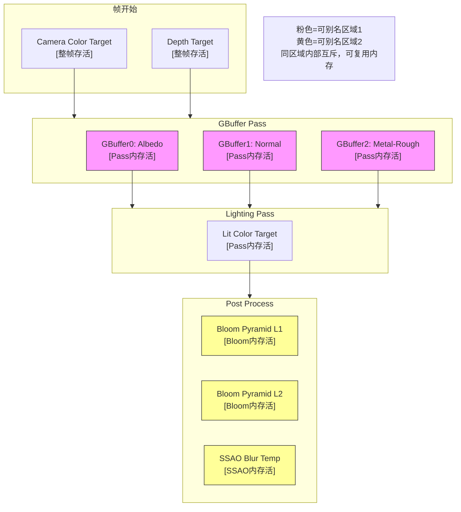
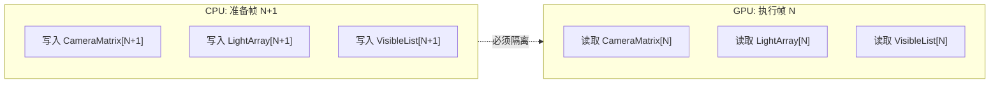

# 渲染管线架构

> 所属计划: 游戏架构设计
> 预计耗时: 90min
> 前置知识: [[08-game-engine-architecture|第8章 游戏引擎架构总览]]、[[12-scene-graph-spatial|第12章 场景图与空间分区]]

---

## 1. 概念讲解

### 为什么需要这个？

游戏画面从一帧到下一帧的演变，背后是一场精心编排的"数据交响乐"。CPU 要决定画什么、GPU 要决定怎么画、显存要决定放哪里——三者节奏稍有错位，就会掉帧、撕裂、闪屏，甚至直接崩溃。

在 [[08-game-engine-architecture]] 中，我们了解了游戏引擎的分层结构。渲染系统作为引擎最庞大的子系统之一，其内部架构决定了团队能否快速迭代画面效果、能否在多平台保持性能一致、能否让 TA（技术美术）和程序员高效协作。没有清晰的管线架构，团队会陷入"改一处 Shader 崩全局"的泥潭。

现代 3A 游戏和引擎（Unity URP/HDRP、Unreal Engine 5、Godot 4、自研引擎）普遍采用**分层抽象 + 声明式调度**的架构：底层屏蔽图形 API 差异，中层用 DAG 描述帧结构，上层用可组合 Pass 插件化扩展。这种架构让同一套代码能跑在 PC、主机、移动端，也让"加一个后处理效果"变成插入一个节点而非重写管线。

### 核心思想

#### 分层抽象：从硬件到业务

渲染管线的分层抽象可以用下图理解：

```mermaid
flowchart TD
    subgraph 业务层["业务层: 具体画面效果"]
        P1["Bloom Pass"]
        P2["Shadow Pass"]
        P3["GBuffer Pass"]
        P4["Lighting Pass"]
    end

    subgraph SRP层["SRP层: 可编程管线框架"]
        RC["`ScriptableRenderContext` / RenderGraph API"]
        RF["Renderer Feature 插件"]
        IP["InjectPoint 注入点"]
    end

    subgraph 调度层["调度层: Render Graph / Frame Graph"]
        DAG["DAG 节点=Pass, 边=资源依赖"]
        BA["自动推导 Barrier/Transition"]
        AL["Transient Resource Aliasing"]
    end

    subgraph 硬件抽象层["硬件抽象层: RHI"]
        RHI["Render Hardware Interface"]
        D3D12["D3D12"]
        VK["Vulkan"]
        MT["Metal"]
    end

    P1 & P2 & P3 & P4 --> RC
    RC --> DAG
    DAG --> RHI
    RHI --> D3D12 & VK & MT
```

| 层级 | 职责 | 代表 API/概念 |
|------|------|-------------|
| 图形 API | 直接操作 GPU 硬件队列、内存、同步 | D3D12 Command Queue, Vulkan `vkCmd*` |
| RHI | 跨平台抽象，统一资源/命令/同步语义 | `IRHICommandList`, `FRHITexture` |
| Render Graph | 声明整帧结构，自动推导执行顺序与资源生命周期 | `RenderGraph`, `FrameGraph` |
| SRP | 暴露注入点，让项目/插件扩展管线 | `ScriptableRenderContext`, `RendererFeature` |
| 具体 Pass | 实现业务效果：阴影、光照、后处理 | `ShadowPass`, `BloomPass` |

**关键洞察**：下层为上层提供"无知性"（下层不知道上层在做什么），上层为下层提供"声明性"（上层只声明意图，不指挥执行）。Render Graph 是这一架构的核心枢纽——它让程序员从"手动管理 `ResourceBarrier` 和 `vkImageMemoryBarrier`"的泥潭中解放出来。

#### Render Graph：把一帧建模为 DAG

Render Graph 的核心创新来自 Frostbite 引擎的 Frame Graph（2017 年 GDC 公布），后被 Unity、Unreal、Godot 等广泛借鉴。

**DAG 节点 = Render Pass**，每个 Pass 声明：
- 读哪些资源（输入 attachment/texture/buffer）
- 写哪些资源（输出 attachment/texture/buffer）
- 执行函数（`Execute` / `Record`）

**DAG 边 = 资源依赖**，自动推导：
- 如果 Pass B 读取 Pass A 的输出，则 A 必须在 B 之前执行
- 如果两个 Pass 无依赖，可并行录制命令（多线程渲染的关键）

**自动推导 Barrier/Transition**：图形 API 要求程序员在资源状态变更时插入屏障（如 D3D12 的 `D3D12_RESOURCE_BARRIER`，Vulkan 的 `PipelineStage` + `AccessFlag`）。Render Graph 根据 DAG 边的读写关系，自动计算最优屏障插入点。

**Transient Resource Aliasing（内存别名）**：这是 Render Graph 在显存受限主机（如 PS5/Xbox Series S）上的杀手锏。通过生命周期分析（liveness analysis），把生命周期不重叠的临时纹理绑定到同一块 GPU 内存。例如：
- TAA 历史帧纹理（整帧存活）
- Bloom 的降采样中间纹理（仅 Bloom Pass 内存活）
- SSAO 的模糊中间纹理（仅 SSAO Pass 内存活）

后两者无时间重叠，可安全别名到同一物理内存。



#### Render Pass 五要素

每个 Pass 在架构上必须明确五要素，否则无法被 Render Graph 正确调度：

| 要素 | 说明 | 示例 |
|------|------|------|
| 1. 输入/输出 attachment | 读写的纹理/缓冲，含格式、尺寸、MSAA 设置 | `color: RGBA8, depth: D32F` |
| 2. 渲染状态 | PSO（Pipeline State Object）、RT 格式、Viewport/Scissor | `RasterState`, `BlendState` |
| 3. 剔除与可见性数据 | 该 Pass 要画哪些物体（已由 CPU 端剔除筛选） | `VisibleList: MeshRenderer[]` |
| 4. 绘制命令列表 | 具体 Draw call / Dispatch call | `cmd.DrawMesh()`, `cmd.DispatchCompute()` |
| 5. 执行函数 | 录制命令的回调（非立即执行，延迟到 Graph 调度后） | `Execute(ScriptableRenderContext)` |

**关键区分**：要素 3（剔除结果）来自 CPU 端，在 Render Graph 构建前已完成；要素 4-5 是 GPU 命令录制，可能被延迟到工作线程执行。

#### 前向 vs 延迟 vs 前向+：架构选择即权衡

| 管线 | 核心流程 | 光源数敏感？ | 透明物体 | MSAA | 带宽/内存 |
|------|---------|-----------|---------|------|----------|
| **Forward** | 每个几何体 × 每个影响它的光源，直接计算光照 | 敏感（O(n×m)） | 天然支持 | 天然支持 | 低 |
| **Deferred** | 先写 G-Buffer → 全屏光照计算 | 不敏感（O(m)） | 需额外 Forward 通道 | 需复杂解析 | 高（G-Buffer 带宽） |
| **Forward+ / Tiled Forward** | 分 tile 预计算光源列表 → 每个像素只查列表 | 不敏感（O(n×avg_tile_lights)） | 支持 | 支持 | 中等 |

**架构决策点**：
- 移动端/VR：带宽是瓶颈，倾向 Forward 或 Forward+，避免 G-Buffer
- 3A 主机/PC：多光源场景（开放世界夜晚、室内大量人造光源），Deferred 或 Forward+ 更优
- 透明物体多的游戏（粒子特效、玻璃建筑）：Deferred 的透明通道复杂度高，需评估

Forward+ 的 Tile 预计算是近年主流选择（Unity URP 的 `Clustered/Tile` 渲染、Unreal 的默认前向也支持 tiled deferred lighting 混合），它用 Compute Shader 做光源- tile 相交测试，生成每个 tile 的光源索引列表。

#### 帧数据双缓冲：CPU 与 GPU 的"时间差"协调

渲染有一核心矛盾：**CPU 在准备第 N+1 帧的数据时，GPU 可能还在执行第 N 帧的命令**。若共享同一块缓冲，CPU 改写会破坏 GPU 读取。



**双缓冲（Double Buffering）**：
- 常量缓冲（`ConstantBuffer` / `UniformBuffer`）：准备两份，`FrameIndex % 2` 切换
- 光源数组、物体变换矩阵：同样双份
- 命令缓冲（`CommandBuffer`）：每帧新建或从池复用，录制后提交

**三缓冲（Triple Buffering）**：当 GPU 帧时间波动大时，CPU 不必等待 GPU 完成即可开始第 N+2 帧，减少 CPU 空闲。代价是延迟增加 1 帧。

**多线程录制**：双缓冲使多个工作线程可同时录制不同 Pass 的命令（每个线程写独立的 `CommandBuffer`），最终合并提交。这是 Render Graph 能并行化的基础。

#### 剔除与排序的架构位置

**CPU 端剔除（Render Graph 构建前）**：
- 视锥剔除（Frustum Culling）：物体 AABB vs 相机视锥
- 遮挡剔除（Occlusion Culling）：硬件遮挡查询 / 软件 Z-Buffer / HZB（Hierarchical Z-Buffer）
- 层级剔除：LOD 距离、Layer mask、相机剔除掩码

**Draw Call 排序（Pass 内部）**：
- 按材质/Shader 排序：减少 PSO 切换（现代 GPU 最昂贵的状态变更）
- 按深度排序：不透明从前到后（early-z 优化），透明从后到前（正确混合）

**架构原则**：剔除是"要不要画"的决策，发生在管线顶层；排序是"怎么画更高效"的决策，发生在 Pass 内部。两者不可颠倒——先剔除减少数据量，再排序优化绘制顺序。

#### SRP 风格：可组合管线

Unity 的 Scriptable Render Pipeline（SRP）定义了现代可编程管线的架构范式：

| 组件 | 职责 |
|------|------|
| `RenderPipelineAsset` | 创建并配置管线实例，可被项目设置引用 |
| `RenderPipeline` | 每帧 `Render()` 的入口，协调全局流程 |
| `ScriptableRenderContext` | 向底层提交命令的抽象接口 |
| `ScriptableRenderPass` | 原子渲染单元，可配置输入/输出、录制命令 |
| `RendererFeature` | 插件机制，在预定义注入点（InjectPoint）扩展 Pass |

**注入点设计**（以 URP 为例）：
- `BeforeRendering`, `BeforeRenderingShadows`, `AfterRenderingShadows`, `BeforeRenderingOpaques`, `AfterRenderingOpaques`, `BeforeRenderingTransparents`, `AfterRenderingTransparents`, `BeforeRenderingPostProcessing`, `AfterRendering`

Renderer Feature 通过订阅注入点，实现"不改核心管线，加效果"——如自定义后处理、 outlines、decals 等。

---

## 2. 代码示例

以下实现一个极简 Unity SRP 风格管线，演示核心架构组件的协作方式。

**运行环境**: Unity 2022.3 LTS 或 Unity 6，需：
1. Package Manager 安装 `com.unity.render-pipelines.core`
2. 创建 `CustomRenderPipelineAsset` 实例，赋给 `Edit > Project Settings > Graphics > Scriptable Render Pipeline Settings`

```csharp
using UnityEngine;
using UnityEngine.Rendering;

// ============================================================
// 1. RenderPipelineAsset: 管线的"工厂"和配置入口
// ============================================================
[CreateAssetMenu(menuName = "Rendering/Custom Render Pipeline")]
public class CustomRenderPipelineAsset : RenderPipelineAsset
{
    // 可序列化的管线配置参数
    public Color clearColor = Color.black;
    public Material blitMaterial; // 用于 Blit 的材质，需关联 SimpleBlit.shader

    protected override RenderPipeline CreatePipeline()
    {
        return new CustomRenderPipeline(clearColor, blitMaterial);
    }
}

// ============================================================
// 2. RenderPipeline: 每帧渲染的核心调度器
// ============================================================
public class CustomRenderPipeline : RenderPipeline
{
    private Color m_ClearColor;
    private Material m_BlitMaterial;
    private BlitColorPass m_BlitPass;

    public CustomRenderPipeline(Color clearColor, Material blitMaterial)
    {
        m_ClearColor = clearColor;
        m_BlitMaterial = blitMaterial;
        m_BlitPass = new BlitColorPass();
    }

    protected override void Render(ScriptableRenderContext context, Camera[] cameras)
    {
        // 按相机优先级排序（主相机、UI相机、场景视图等）
        foreach (Camera camera in cameras)
        {
            RenderCamera(context, camera);
        }
    }

    private void RenderCamera(ScriptableRenderContext context, Camera camera)
    {
        // ---------- 2.1 设置相机相关全局状态 ----------
        context.SetupCameraProperties(camera);

        // ---------- 2.2 获取相机目标（backbuffer 或 RenderTexture）----------
        var cmd = CommandBufferPool.Get("CustomRenderPipeline");

        // 清屏
        cmd.ClearRenderTarget(true, true, m_ClearColor);
        context.ExecuteCommandBuffer(cmd);
        cmd.Clear();

        // ---------- 2.3 配置并执行 BlitColorPass ----------
        // 这里演示：把场景渲染到临时 RT，再用材质 Blit 回相机目标
        // 实际项目中，此处应先画不透明物体、再画透明物体等
        m_BlitPass.Setup(camera, m_BlitMaterial);
        m_BlitPass.Execute(context, cmd);

        // ---------- 2.4 提交所有命令 ----------
        context.Submit();

        // 回收命令缓冲
        CommandBufferPool.Release(cmd);
    }
}

// ============================================================
// 3. ScriptableRenderPass: 原子渲染单元
// ============================================================
public class BlitColorPass
{
    private Camera m_Camera;
    private Material m_BlitMaterial;
    private RenderTargetIdentifier m_TempRT;

    public void Setup(Camera camera, Material blitMaterial)
    {
        m_Camera = camera;
        m_BlitMaterial = blitMaterial;
    }

    public void Execute(ScriptableRenderContext context, CommandBuffer cmd)
    {
        // 创建临时 RT，与相机目标同尺寸
        int tempRTId = Shader.PropertyToID("_TempBlitRT");
        RenderTextureDescriptor desc = new RenderTextureDescriptor(
            m_Camera.pixelWidth,
            m_Camera.pixelHeight,
            RenderTextureFormat.ARGB32,
            0 // 无深度缓冲
        );
        desc.msaaSamples = 1;

        // 分配临时 RT（Transient Resource，帧末自动释放）
        cmd.GetTemporaryRT(tempRTId, desc);

        // 绑定当前相机目标（backbuffer 或 RT）
        RenderTargetIdentifier cameraTarget = new RenderTargetIdentifier(
            BuiltinRenderTextureType.CameraTarget
        );

        // ---------- Pass 核心：Blit 操作 ----------
        // 步骤1: 从相机目标 Blit 到临时 RT（模拟"读取场景颜色"）
        // 实际管线中，这里会是 DrawMesh/DrawRenderer 的结果
        cmd.Blit(cameraTarget, tempRTId, m_BlitMaterial);

        // 步骤2: 从临时 RT Blit 回相机目标（模拟后处理/调色）
        // 注意：第二个 Blit 用默认材质（null）或再次用效果材质
        cmd.Blit(tempRTId, cameraTarget);

        // 释放临时 RT（显式标记，实际由 CommandBuffer 生命周期管理）
        cmd.ReleaseTemporaryRT(tempRTId);

        // 执行录制的命令
        context.ExecuteCommandBuffer(cmd);
        cmd.Clear();
    }
}
```

**配套 Shader** (`SimpleBlit.shader`，放在 Assets/Shaders 目录)：

```hlsl
Shader "Custom/SimpleBlit"
{
    Properties
    {
        _MainTex ("Texture", 2D) = "white" {}
        _TintColor ("Tint Color", Color) = (1,1,1,1)
    }
    SubShader
    {
        Tags { "RenderType"="Opaque" }
        LOD 100

        Pass
        {
            CGPROGRAM
            #pragma vertex vert
            #pragma fragment frag

            #include "UnityCG.cginc"

            struct appdata
            {
                float4 vertex : POSITION;
                float2 uv : TEXCOORD0;
            };

            struct v2f
            {
                float2 uv : TEXCOORD0;
                float4 vertex : SV_POSITION;
            };

            sampler2D _MainTex;
            float4 _TintColor;

            v2f vert (appdata v)
            {
                v2f o;
                o.vertex = UnityObjectToClipPos(v.vertex);
                o.uv = v.uv;
                return o;
            }

            fixed4 frag (v2f i) : SV_Target
            {
                fixed4 col = tex2D(_MainTex, i.uv);
                return col * _TintColor;
            }
            ENDCG
        }
    }
}
```

**运行方式:**

```bash
# 1. Unity 中创建 C# 脚本文件，粘贴上述代码
# 2. Assets 目录右键 -> Create -> Rendering -> Custom Render Pipeline
# 3. 创建 Material，Shader 选 Custom/SimpleBlit，可调整 _TintColor
# 4. 将 Material 赋给 CustomRenderPipelineAsset 的 Blit Material 字段
# 5. Edit -> Project Settings -> Graphics -> Scriptable Render Pipeline Settings
#    指定创建的 CustomRenderPipelineAsset
# 6. 进入 Play Mode 或 Scene View 即可看到带色调的 Blit 效果
```

**预期输出:**

```text
[Console 无错误输出]
[Scene View / Game View] 画面呈现经 _TintColor 调色后的效果
[Frame Debugger] 可见两个 Blit 事件：CameraTarget -> _TempBlitRT -> CameraTarget
```

---

## 3. 练习

### 练习 1: 基础

在示例 `BlitColorPass` 基础上，新增第二个 Pass 把 `RenderTexture` 再 Blit 回主相机目标。要求：
- 创建两个临时 RT，形成 `CameraTarget → TempRT1 → TempRT2 → CameraTarget` 的链
- 第一个 Blit 用 `m_BlitMaterial`（调色），第二个 Blit 用另一个 `m_GrayscaleMaterial`（去色）
- 正确处理 `ConfigureTarget` 与 `ConfigureClear`（URP 风格）或等效的资源生命周期管理

### 练习 2: 进阶

用伪代码为一个**延迟渲染器**列出 3 个核心 Pass 及其 Render Graph 资源依赖。要求：
- 明确每个 Pass 的输入、输出、执行内容
- 用 DAG 边的形式表达资源依赖（如 `PassA.RT_X → PassB.RT_X`）
- 说明哪个 Pass 需要深度测试，哪个需要混合（Blend）

### 练习 3: 挑战（可选）

解释为何 Render Graph 能在显存受限主机上降低内存占用，并指出一个 **aliasing 失效场景**。要求：
- 从生命周期分析（liveness analysis）角度解释 aliasing 原理
- 失效场景需具体描述：什么读取模式、什么调度顺序会导致错误
- 提出检测或规避该失效的方法

---

## 3.5 参考答案

> [!tip]- 练习 1 参考答案
> 
> 核心思路：串联两个 Blit 操作，管理两个临时 RT 的生命周期。
> 
> ```csharp
> public class TwoPassBlit
> {
>     private Material m_TintMaterial;      // 练习提供的调色材质
>     private Material m_GrayscaleMaterial; // 新增：去色材质
> 
>     public void Execute(ScriptableRenderContext context, Camera camera, CommandBuffer cmd)
>     {
>         // 定义两个临时 RT 的 ID
>         int tempRT1 = Shader.PropertyToID("_TempRT1");
>         int tempRT2 = Shader.PropertyToID("_TempRT2");
>         
>         RenderTextureDescriptor desc = new RenderTextureDescriptor(
>             camera.pixelWidth, camera.pixelHeight, 
>             RenderTextureFormat.ARGB32, 0
>         );
> 
>         // 分配两个同规格的临时 RT
>         // 注意：在真实 Render Graph 中，这两个会被标记为 transient
>         // 若生命周期不重叠，可自动别名到同一物理内存
>         cmd.GetTemporaryRT(tempRT1, desc);
>         cmd.GetTemporaryRT(tempRT2, desc);
> 
>         RenderTargetIdentifier cameraTarget = new RenderTargetIdentifier(
>             BuiltinRenderTextureType.CameraTarget
>         );
> 
>         // Pass 1: CameraTarget -> TempRT1 (调色)
>         cmd.Blit(cameraTarget, tempRT1, m_TintMaterial);
> 
>         // Pass 2: TempRT1 -> TempRT2 (去色)
>         // 关键：第二个 Blit 的 source 是第一个的输出
>         cmd.Blit(tempRT1, tempRT2, m_GrayscaleMaterial);
> 
>         // Pass 3: TempRT2 -> CameraTarget (回写)
>         // 最终输出不需要额外材质，直接拷贝
>         cmd.Blit(tempRT2, cameraTarget);
> 
>         // 释放顺序：与分配逆序无关，但建议清晰配对
>         cmd.ReleaseTemporaryRT(tempRT1);
>         cmd.ReleaseTemporaryRT(tempRT2);
> 
>         context.ExecuteCommandBuffer(cmd);
>         cmd.Clear();
>     }
> }
> ```
> 
> **关键注意点**：
> - `GetTemporaryRT` / `ReleaseTemporaryRT` 必须配对，否则显存泄漏
> - 在 URP 的 `ScriptableRenderPass` 中，应使用 `ConfigureTarget` 和 `ConfigureClear` 在 `OnCameraSetup` 中声明，而非直接操作 `CommandBuffer`
> - 若迁移到 URP 的 `RenderGraph` API，临时 RT 改为 `CreateTexture(...)` 并标记 `Transient`，由 Graph 自动回收

> [!tip]- 练习 2 参考答案
> 
> 延迟渲染核心三 Pass 的 Render Graph 伪代码：
> 
> ```csharp
> // ========================================
> // Pass 1: GBuffer Pass
> // ========================================
> RenderGraphPass GBufferPass = new RenderGraphPass("GBuffer");
> {
>     // 输出：GBuffer 附件 + 深度
>     outputs: {
>         GBuffer0: TextureDesc(RGBA8, "Albedo + Emissive"),     // 新建
>         GBuffer1: TextureDesc(RGBA16F, "Normal + Roughness"),   // 新建
>         GBuffer2: TextureDesc(RGBA8, "Metallic + AO + Flags"), // 新建
>         Depth:    TextureDesc(D32F, "Scene Depth")              // 新建，或导入外部
>     }
>     
>     // 执行：遍历可见不透明物体，写入 MRT
>     Execute: (cmd, resources) => {
>         cmd.SetRenderTarget(
>             [resources.GBuffer0, resources.GBuffer1, resources.GBuffer2],
>             resources.Depth
>         );
>         cmd.ClearRenderTarget(true, true, Color.black);
>         
>         foreach (var renderer in visibleOpaqueRenderers) {
>             cmd.DrawRenderer(renderer, gbufferMaterial);
>         }
>     }
> }
> 
> // ========================================
> // Pass 2: Deferred Lighting Pass
> // ========================================
> RenderGraphPass LightingPass = new RenderGraphPass("DeferredLighting");
> {
>     // 输入：读取 GBuffer 所有附件
>     inputs: {
>         GBuffer0: GBufferPass.GBuffer0,  // 依赖边: GBufferPass -> LightingPass
>         GBuffer1: GBufferPass.GBuffer1,
>         GBuffer2: GBufferPass.GBuffer2,
>         Depth:    GBufferPass.Depth
>     }
>     
>     // 输出：光照累加结果
>     outputs: {
>         LitColor: TextureDesc(RGBA16F, "Lit Color"),  // 新建
>         // 深度不写入，但需读深度做光照裁剪
>     }
>     
>     // 执行：全屏四边形或 Compute Shader，逐 tile/pixel 计算光照
>     Execute: (cmd, resources) => {
>         cmd.SetRenderTarget(resources.LitColor);
>         
>         // 绑定 GBuffer 和深度为只读纹理
>         cmd.SetGlobalTexture("_GBuffer0", resources.GBuffer0);
>         cmd.SetGlobalTexture("_GBuffer1", resources.GBuffer1);
>         cmd.SetGlobalTexture("_GBuffer2", resources.GBuffer2);
>         cmd.SetGlobalTexture("_DepthTexture", resources.Depth);
>         
>         // 光源数据来自 CPU 双缓冲的常量缓冲
>         cmd.SetGlobalBuffer("_LightList", frameData.lightBuffer);
>         
>         cmd.DrawProcedural(..., deferredLightingMaterial);
>     }
> }
> 
> // ========================================
> // Pass 3: Composite / Post Pass
> // ========================================
> RenderGraphPass CompositePass = new RenderGraphPass("Composite");
> {
>     // 输入：光照结果
>     inputs: {
>         LitColor: LightingPass.LitColor,  // 依赖边: LightingPass -> CompositePass
>         // 可选：读取 Depth 做深度 fog
>         Depth: GBufferPass.Depth
>     }
>     
>     // 输出：最终 backbuffer
>     outputs: {
>         FinalColor: BackBufferImport()  // 导入外部 backbuffer，非新建
>     }
>     
>     // 执行：后处理链（tonemapping, FXAA, etc.）
>     Execute: (cmd, resources) => {
>         cmd.Blit(resources.LitColor, resources.FinalColor, postProcessMaterial);
>     }
> }
> ```
> 
> **DAG 依赖边总结**：
> | 边 | 含义 |
> |---|------|
> | `GBufferPass.Depth → LightingPass.Depth` | 光照需要深度做裁剪 |
> | `GBufferPass.GBuffer{0,1,2} → LightingPass.GBuffer{0,1,2}` | 光照读取材质属性 |
> | `LightingPass.LitColor → CompositePass.LitColor` | 后处理读取光照结果 |
> 
> **状态需求**：
> - GBuffer Pass：需要深度测试（`ZTest LEqual`, `ZWrite On`），无混合（不透明）
> - Lighting Pass：无深度测试（全屏四边形），无混合或 `One One` 累加（多光源）
> - Composite Pass：无深度测试，无混合或根据后处理效果设置

> [!tip]- 练习 3 参考答案
> 
> **Render Graph 降低内存占用的原理**：
> 
> Render Graph 在编译阶段对整帧的 transient resource（临时纹理/缓冲）进行**生命周期分析（liveness analysis）**：
> 
> 1. **定义生命周期**：每个资源的"生" = 首次写入的 Pass，"死" = 最后一次读取的 Pass 之后
> 2. **构建冲突图**：若两个资源的生命周期有重叠（同时存活），则不能别名
> 3. **图着色/区间分配**：对无冲突的资源，分配同一物理 GPU 内存地址
> 
> 示例：假设某帧有：
> - `Bloom_L1`: 存活于 [BloomDownsample0, BloomDownsample1]
> - `Bloom_L2`: 存活于 [BloomDownsample1, BloomUpsample0]
> - `SSAO_Blur`: 存活于 [SSAOCompute, SSAOApply]
> 
> 若 `Bloom_L2` 和 `SSAO_Blur` 的生命周期无重叠（SSAO 在 Bloom 之前完成），则可别名到同一物理内存。
> 
> 在显存受限主机（如 Xbox Series S 的 10GB 共享内存），这种别名可将临时纹理内存占用降低 30-50%。
> 
> **Aliasing 失效场景：异步延迟读取**
> 
> 场景描述：
> - Pass A 写入 `ShadowMap`，标记为 transient
> - Pass B 计划在下一帧读取 `ShadowMap` 做软阴影（跨帧复用，或 async compute 延迟处理）
> - Render Graph 按单帧分析，认为 `ShadowMap` 在本帧末已死亡
> - 分配新资源 `Bloom_L1` 别名到 `ShadowMap` 的物理地址
> - Pass B 的异步读取在 Pass A 之后、但 `Bloom_L1` 写入之前到达 → 读取到被覆盖的数据 → 画面错误（阴影闪烁或消失）
> 
> **根因**：生命周期分析假设"死亡后不再读取"，但异步/跨帧/延迟读取打破了这一假设。
> 
> **检测与规避方法**：
> | 方法 | 实现 |
> |------|------|
> | 标记非 transient | 对可能跨帧复用的资源，显式标记 `persistent` 或 `external`，不参与别名 |
> | 异步 fence 追踪 | 在 Graph 中插入 fence，确保别名分配前 GPU 完成所有读取 |
> | 保守分析 | 对 async compute queue 的读取，延长资源生命周期到 fence 信号点 |
> | 运行时验证 | 开发模式启用 GPU 内存可视化，检测 alias 冲突（如 UE 的 `r.RDG.Debug`） |

> [!note] 答案使用方式
> 如果你的实现通过了测试或达到了题目要求，就是正确的。参考答案展示的是一种可行路径，而非唯一标准。练习 1 的 C# 代码需在 Unity 中实际运行验证；练习 2 的伪代码需能被 Render Graph 系统正确解析为 DAG；练习 3 的分析需能解释具体游戏中的内存优化案例。
>
> ---

## 4. 扩展阅读

- Unity Render Graph introduction (URP): https://docs.unity3d.com/6000.4/Documentation/Manual/urp/render-graph-introduction.html
- Frame Graph: Theory: https://stoleckipawel.dev/posts/frame-graph-theory/
- Unreal Engine Render Dependency Graph: https://dev.epicgames.com/documentation/unreal-engine/render-dependency-graph-in-unreal-engine
- Forward vs Deferred vs Forward+ Rendering: https://www.3dgep.com/forward-plus/

---

## 常见陷阱

- **在 Render Pass 之间不加区分地使用全局 `RenderTexture`，导致管线不可组合且难以并行录制**。正确做法：每个 Pass 通过 `RenderGraph` 或 `ScriptableRenderContext` 显式声明输入/输出，临时资源走 `GetTemporaryRT` / `CreateTexture` 的 transient 路径，确保生命周期可控、别名优化可生效。

- **把剔除结果缓存到上一帧，却没有处理动态物体或相机突然移动带来的可见性突变**。正确做法：剔除数据纳入帧数据双缓冲体系，每帧重新计算可见性列表；对动态物体（如角色、载具）使用独立的剔除刷新策略，或保守扩大包围盒做预剔除。

- **在移动平台滥用延迟渲染，忽视带宽与 G-Buffer 内存开销**。正确做法：移动端优先评估 Forward+（Tiled Forward），其 tile-based 光源列表减少带宽；若必须用 Deferred，压缩 G-Buffer 格式（如 RGBA8 而非 RGBA16F），降低分辨率，或采用半分辨率光照计算。