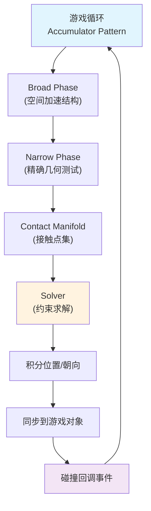

# 物理与碰撞系统

> 所属计划: 游戏架构设计
> 预计耗时: 90min
> 前置知识: [[07-game-loop|第7章 游戏循环]]、[[08-game-engine-architecture|第8章 游戏引擎架构总览]]

---

## 1. 概念讲解

### 为什么需要这个？

游戏世界需要"真实感"——角色落地不反弹穿地、车辆碰撞后翻飞、堆叠的箱子静止后不再抖动。这些都不是魔法，而是物理引擎的精密计算。但物理模拟极易出错：变步长导致能量无限积累、高速子弹穿透薄墙、碰撞回调里删除物体引发崩溃。理解物理引擎的架构管线，是避免这些灾难的前提。

物理系统与 [[07-game-loop|游戏循环]] 紧密耦合：它既需要固定频率的确定性更新，又要向渲染线程提供平滑的视觉结果。同时，它与 [[10-component-based|组件系统]]、[[12-scene-graph-spatial|空间分区]]、[[14-event-driven-architecture|事件系统]] 深度交互，是引擎中最复杂的子系统之一。

### 核心思想

现代物理引擎采用**三段式管线**（Three-Stage Pipeline），将 O(n²) 的暴力碰撞检测优化到可接受的复杂度，同时保证数值稳定性：



**阶段一：Broad Phase（粗略筛选）**

物理世界可能有数千个物体，两两测试不可接受。Broad Phase 用空间加速结构快速排除不可能碰撞的对。主流方案：

| 结构 | 特点 | 适用场景 |
| --- | --- | --- |
| 动态 AABB 树 | 平衡树，支持插入/删除/更新 O(log n) | 大量动态物体（Box2D, PhysX） |
| 扫掠排序（Sort-and-Sweep） | 按轴排序，相邻检测 | 物体分布较均匀，2D 游戏 |
| 均匀网格/哈希 | O(1) 查询，内存连续 | 物体尺寸相近，GPU 加速 |

**阶段二：Narrow Phase（精确测试）**

对 Broad Phase 输出的候选对，执行精确的几何相交测试。输出 `Contact Manifold`（接触流形）：包含接触点、穿透深度（penetration depth）、法线方向（normal）。常见测试：AABB-AABB、OBB-OBB、Sphere-Sphere、GJK/EPA 凸体通用算法。

**阶段三：Solver（约束求解）**

碰撞不仅是"检测到"，还要"解决"——让穿透的物体分离、让反弹的物体获得正确速度。Solver 迭代求解约束系统：

- **接触约束**：法向冲量防止穿透，切向冲量模拟摩擦
- **关节约束**：距离、旋转、齿轮等
- **Sequential Impulse（SI）**：每次迭代对一个约束施加冲量，重复至收敛

核心公式：法向冲量大小 `j = -(1 + e)(v_rel · n) / (1/mA + 1/mB)`，其中 `e` 为恢复系数，`v_rel` 为相对速度，`n` 为法线。

**固定步长积分与 Accumulator Pattern**

物理是微分方程的数值积分，变步长 = 变精度 = 非确定性。游戏循环必须解耦渲染帧率与物理频率：

```
accumulator += deltaTime
while (accumulator >= fixedDt) {
    world.Step(fixedDt)  // 物理前进固定步
    accumulator -= fixedDt
}
render(interpolationAlpha = accumulator / fixedDt)  // 插值平滑显示
```

这是 [[07-game-loop|第7章]] 核心模式的物理特化版。`fixedDt` 通常为 1/60s 或 1/50s。

**刚体状态机**

| 类型 | 受力影响 | 碰撞响应 | 典型用途 |
| --- | --- | --- | --- |
| `Dynamic` | 是 | 完全模拟 | 箱子、角色（物理驱动） |
| `Kinematic` | 否（速度直接设置） | 推动 dynamic | 移动平台、动画驱动角色 |
| `Static` | 否 | 无（质量无限） | 地面、墙壁 |

Kinematic 与 Dynamic 的碰撞：kinematic 像"不可阻挡的推土机"，dynamic 会被推开但 kinematic 不受影响。

**碰撞回调架构**

回调必须在 Solver 结束后触发，提供完整的状态一致性。典型生命周期：

```
OnCollisionEnter → OnCollisionStay（每步）→ OnCollisionExit
OnTriggerEnter/Stay/Exit（触发器，无物理响应）
```

**致命禁忌**：回调内直接修改 `transform.position` 或 `Destroy` 刚体，会破坏 Solver 的内部状态。正确做法是将请求加入延迟队列，下一物理步处理。

**连续碰撞检测（CCD）**

离散检测的假设：物体每步移动距离 < 碰撞体厚度。当子弹 120m/s、步长 1/60s，单步移动 2m，可能穿透 5cm 墙而不被检测。

CCD 方案对比：

| 方案 | 原理 | 代价 | 适用 |
| --- | --- | --- | --- |
| Swept Shape / Raycast | 从旧位置向新位置扫掠，求 TOI | 中等 | 高速 projectile |
| Speculative Contacts | 基于预测速度扩展 AABB，提前生成接触 | 较低，可能误报 | 一般高速物体 |
| Bullet/Swept Sphere | 简化为射线或球体扫掠 | 低 | 球形 projectile |

**休眠（Sleeping）与激活**

静止物体持续积分浪费 CPU。当线速度/角速度低于阈值一段时间，标记为 `Sleeping`。AABB 树中仍可查询，但跳过积分与碰撞响应。新碰撞或外力施加时必须**显式激活**——常见 bug：堆叠箱子轻微抖动，因下层未正确激活。

---

## 2. 代码示例

以下实现一个 **C# 控制台最小物理框架**，展示 accumulator、固定步长、扫掠排序 Broad Phase、AABB Narrow Phase、冲量 Solver。无外部依赖，.NET 6+ 可直接运行。

```csharp
// MinimalPhysics.cs
// 运行环境: .NET 6+ Console
// 编译: dotnet new console && 替换 Program.cs 后 dotnet run

using System;
using System.Collections.Generic;
using System.Linq;

// ==================== 数学基础 ====================
public readonly struct Vec2
{
    public readonly float X, Y;
    public Vec2(float x, float y) { X = x; Y = y; }
    public static Vec2 Zero => new(0, 0);
    public static Vec2 operator +(Vec2 a, Vec2 b) => new(a.X + b.X, a.Y + b.Y);
    public static Vec2 operator -(Vec2 a, Vec2 b) => new(a.X - b.X, a.Y - b.Y);
    public static Vec2 operator *(Vec2 v, float s) => new(v.X * s, v.Y * s);
    public static float Dot(Vec2 a, Vec2 b) => a.X * b.X + a.Y * b.Y;
    public float Length => MathF.Sqrt(X * X + Y * Y);
    public Vec2 Normalized
    {
        get
        {
            float len = Length;
            return len > 0 ? new Vec2(X / len, Y / len) : Zero;
        }
    }
    public Vec2 Perpendicular => new(-Y, X); // 逆时针90度
    public override string ToString() => $"({X:F3}, {Y:F3})";
}

// ==================== 刚体 ====================
public enum BodyType { Dynamic, Kinematic, Static }

public class RigidBody
{
    public int Id; // 调试用
    public BodyType Type = BodyType.Dynamic;
    public Vec2 Position;      // 中心位置
    public Vec2 Velocity;      // 线速度
    public float Angle;        // 朝向（弧度，本示例简化，忽略旋转）
    public float AngularVelocity;
    public float Mass = 1f;
    public float InvMass => Type == BodyType.Dynamic ? 1f / Mass : 0f;
    public float Restitution = 0.5f; // 弹性系数 0-1
    public float Friction = 0.3f;    // 摩擦系数
    
    // AABB 半尺寸（本示例用 AABB 碰撞体）
    public Vec2 HalfSize; // 从中心到边的距离
    
    // 计算世界空间 AABB
    public (Vec2 min, Vec2 max) GetAABB()
    {
        return (
            new Vec2(Position.X - HalfSize.X, Position.Y - HalfSize.Y),
            new Vec2(Position.X + HalfSize.X, Position.Y + HalfSize.Y)
        );
    }
    
    public bool IsSleeping = false;
    public float SleepTimer = 0f;
    private const float SleepThreshold = 0.05f;
    private const float SleepTimeRequired = 0.5f;
    
    // 尝试进入休眠（每步调用）
    public void TrySleep(float dt)
    {
        if (Type != BodyType.Dynamic) return;
        float speed = Velocity.Length;
        if (speed < SleepThreshold)
        {
            SleepTimer += dt;
            if (SleepTimer >= SleepTimeRequired)
                IsSleeping = true;
        }
        else
        {
            SleepTimer = 0f;
            IsSleeping = false;
        }
    }
    
    public void WakeUp() => IsSleeping = false;
}

// ==================== 接触点 ====================
public class Contact
{
    public RigidBody BodyA;
    public RigidBody BodyB;
    public Vec2 Normal;      // 从 A 指向 B 的分离方向
    public float Penetration; // 穿透深度（>0 表示重叠）
    public Vec2 Point;       // 接触点（简化：取中心连线中点）
}

// ==================== Broad Phase: Sort-and-Sweep ====================
public class BroadPhase
{
    // 返回候选碰撞对（可能误报，由 Narrow Phase 精确过滤）
    public List<(RigidBody, RigidBody)> GeneratePairs(List<RigidBody> bodies)
    {
        var pairs = new List<(RigidBody, RigidBody)>();
        
        // 只筛选非休眠或可能唤醒的 dynamic 物体 + kinematic/static
        var active = bodies.Where(b => !b.IsSleeping || b.Type != BodyType.Dynamic).ToList();
        
        // 按 AABB min.x 排序
        var sorted = active.Select(b => (b, b.GetAABB().min.X))
                           .OrderBy(t => t.Item2)
                           .Select(t => t.b)
                           .ToList();
        
        // 扫掠：只检查 x 投影重叠的相邻物体
        for (int i = 0; i < sorted.Count; i++)
        {
            var a = sorted[i];
            var aMaxX = a.GetAABB().max.X;
            
            for (int j = i + 1; j < sorted.Count; j++)
            {
                var b = sorted[j];
                var bMinX = b.GetAABB().min.X;
                
                // x 轴已分离，后续更大，直接跳出
                if (bMinX > aMaxX) break;
                
                // 完整 AABB 测试（y 轴）
                var aAABB = a.GetAABB();
                var bAABB = b.GetAABB();
                if (aAABB.max.Y < bAABB.min.Y || aAABB.min.Y > bAABB.max.Y)
                    continue;
                
                // 避免重复对，强制 Id 顺序
                if (a.Id < b.Id)
                    pairs.Add((a, b));
                else
                    pairs.Add((b, a));
            }
        }
        
        return pairs;
    }
}

// ==================== Narrow Phase: AABB 精确检测 ====================
public class NarrowPhase
{
    public List<Contact> Detect(List<(RigidBody, RigidBody)> pairs)
    {
        var contacts = new List<Contact>();
        
        foreach (var (a, b) in pairs)
        {
            // 跳过静态-静态（无响应意义）
            if (a.Type == BodyType.Static && b.Type == BodyType.Static)
                continue;
            
            var aAABB = a.GetAABB();
            var bAABB = b.GetAABB();
            
            // 计算重叠
            float overlapX = MathF.Min(aAABB.max.X - bAABB.min.X, bAABB.max.X - aAABB.min.X);
            float overlapY = MathF.Min(aAABB.max.Y - bAABB.min.Y, bAABB.max.Y - aAABB.min.Y);
            
            if (overlapX <= 0 || overlapY <= 0)
                continue; // 无碰撞
            
            // 选择最小穿透轴作为法线
            Vec2 normal;
            float penetration;
            if (overlapX < overlapY)
            {
                penetration = overlapX;
                // 确定法线方向：从 A 指向 B
                float dx = (bAABB.min.X + bAABB.max.X) / 2 - (aAABB.min.X + aAABB.max.X) / 2;
                normal = new Vec2(dx > 0 ? 1 : -1, 0);
            }
            else
            {
                penetration = overlapY;
                float dy = (bAABB.min.Y + bAABB.max.Y) / 2 - (aAABB.min.Y + aAABB.max.Y) / 2;
                normal = new Vec2(0, dy > 0 ? 1 : -1);
            }
            
            // 确保法线从 A 指向 B
            Vec2 centerA = new((aAABB.min.X + aAABB.max.X) / 2, (aAABB.min.Y + aAABB.max.Y) / 2);
            Vec2 centerB = new((bAABB.min.X + bAABB.max.X) / 2, (bAABB.min.Y + bAABB.max.Y) / 2);
            Vec2 d = centerB - centerA;
            if (Vec2.Dot(d, normal) < 0)
                normal = new Vec2(-normal.X, -normal.Y);
            
            contacts.Add(new Contact
            {
                BodyA = a,
                BodyB = b,
                Normal = normal,
                Penetration = penetration,
                Point = new Vec2(
                    (centerA.X + centerB.X) / 2,
                    (centerA.Y + centerB.Y) / 2
                )
            });
        }
        
        return contacts;
    }
}

// ==================== Solver: Sequential Impulse ====================
public class Solver
{
    public void Solve(List<Contact> contacts, float dt)
    {
        // 位置修正：直接消除穿透（非物理但稳定，防止累积）
        const float percent = 0.8f; // 修正比例
        const float slop = 0.01f;   // 允许的小穿透
        
        foreach (var c in contacts)
        {
            if (c.Penetration < slop) continue;
            
            float totalInvMass = c.BodyA.InvMass + c.BodyB.InvMass;
            if (totalInvMass == 0) continue; // 两者都静态
            
            Vec2 correction = c.Normal * ((c.Penetration - slop) / totalInvMass * percent);
            c.BodyA.Position = c.BodyA.Position - correction * c.BodyA.InvMass;
            c.BodyB.Position = c.BodyB.Position + correction * c.BodyB.InvMass;
        }
        
        // 速度冲量求解（迭代多次提高稳定性）
        const int iterations = 3;
        for (int iter = 0; iter < iterations; iter++)
        {
            foreach (var c in contacts)
            {
                var a = c.BodyA;
                var b = c.BodyB;
                
                Vec2 relVel = b.Velocity - a.Velocity;
                float velAlongNormal = Vec2.Dot(relVel, c.Normal);
                
                // 分离速度 > 0 已在分离，无需冲量
                if (velAlongNormal > 0) continue;
                
                // 法向冲量大小
                float e = MathF.Min(a.Restitution, b.Restitution);
                float j = -(1 + e) * velAlongNormal;
                j /= (a.InvMass + b.InvMass);
                
                // 应用法向冲量
                Vec2 impulse = c.Normal * j;
                if (a.Type == BodyType.Dynamic)
                    a.Velocity = a.Velocity - impulse * a.InvMass;
                if (b.Type == BodyType.Dynamic)
                    b.Velocity = b.Velocity + impulse * b.InvMass;
                
                // 简单摩擦：切线方向阻尼（完整摩擦见练习2）
                relVel = b.Velocity - a.Velocity;
                Vec2 tangent = relVel - c.Normal * Vec2.Dot(relVel, c.Normal);
                if (tangent.Length > 0.0001f)
                {
                    tangent = tangent.Normalized;
                    float jt = -Vec2.Dot(relVel, tangent);
                    jt /= (a.InvMass + b.InvMass);
                    
                    // Coulomb 近似：简单 clamp
                    float maxFriction = j * MathF.Max(a.Friction, b.Friction);
                    jt = MathF.Clamp(jt, -maxFriction, maxFriction);
                    
                    Vec2 frictionImpulse = tangent * jt;
                    if (a.Type == BodyType.Dynamic)
                        a.Velocity = a.Velocity - frictionImpulse * a.InvMass;
                    if (b.Type == BodyType.Dynamic)
                        b.Velocity = b.Velocity + frictionImpulse * b.InvMass;
                }
            }
        }
    }
}

// ==================== 物理世界 ====================
public class PhysicsWorld
{
    public List<RigidBody> Bodies = new();
    public List<Contact> Contacts = new();
    
    private BroadPhase _broad = new();
    private NarrowPhase _narrow = new();
    private Solver _solver = new();
    
    // 延迟操作队列（回调安全）
    private List<Action> _pendingOps = new();
    
    public void AddBody(RigidBody body) => Bodies.Add(body);
    
    public void Step(float dt)
    {
        // 1. 积分速度（受力简化：仅重力）
        const float gravity = -9.8f;
        foreach (var b in Bodies)
        {
            if (b.Type != BodyType.Dynamic || b.IsSleeping) continue;
            
            // F = ma => a = F/m; 简化：直接加速度
            b.Velocity = new Vec2(b.Velocity.X, b.Velocity.Y + gravity * dt);
            
            // 阻尼（空气阻力）
            b.Velocity = b.Velocity * 0.99f;
        }
        
        // 2. Broad Phase
        var pairs = _broad.GeneratePairs(Bodies);
        
        // 3. Narrow Phase
        Contacts = _narrow.Detect(pairs);
        
        // 4. 唤醒检测：碰撞中的休眠物体应激活
        foreach (var c in Contacts)
        {
            if (c.BodyA.Type == BodyType.Dynamic && c.BodyA.IsSleeping) c.BodyA.WakeUp();
            if (c.BodyB.Type == BodyType.Dynamic && c.BodyB.IsSleeping) c.BodyB.WakeUp();
        }
        
        // 5. Solver
        _solver.Solve(Contacts, dt);
        
        // 6. 积分位置
        foreach (var b in Bodies)
        {
            if (b.Type != BodyType.Dynamic || b.IsSleeping) continue;
            b.Position = b.Position + b.Velocity * dt;
            b.TrySleep(dt);
        }
        
        // 7. 执行延迟操作（回调安全）
        foreach (var op in _pendingOps) op();
        _pendingOps.Clear();
    }
    
    // 安全的"回调"：延迟到下一帧
    public void ScheduleOperation(Action op) => _pendingOps.Add(op);
    
    // 简单插值：返回 alpha [0,1] 时的显示位置
    public Vec2 GetInterpolatedPosition(RigidBody b, float alpha) => b.Position;
    // 本示例无速度缓冲，实际应存 previousPosition
}

// ==================== 游戏循环（Accumulator Pattern）====================
public class GameLoop
{
    private PhysicsWorld _world;
    private float _accumulator = 0f;
    private const float FixedDt = 1f / 60f; // 60Hz 物理
    
    public GameLoop(PhysicsWorld world) => _world = world;
    
    // 模拟一帧渲染更新（可变 deltaTime）
    public void Update(float deltaTime)
    {
        _accumulator += deltaTime;
        
        // 固定步长推进物理
        while (_accumulator >= FixedDt)
        {
            _world.Step(FixedDt);
            _accumulator -= FixedDt;
        }
        
        // 插值系数：用于平滑渲染
        float alpha = _accumulator / FixedDt;
        Render(alpha);
    }
    
    private void Render(float alpha)
    {
        Console.WriteLine($"--- Frame (alpha={alpha:F3}) ---");
        foreach (var b in _world.Bodies)
        {
            Vec2 displayPos = _world.GetInterpolatedPosition(b, alpha);
            Console.WriteLine($"  Body[{b.Id}]: pos={displayPos}, vel={b.Velocity}, sleep={b.IsSleeping}");
        }
    }
}

// ==================== 测试场景 ====================
class Program
{
    static void Main()
    {
        var world = new PhysicsWorld();
        
        // 地面：静态
        var ground = new RigidBody
        {
            Id = 0,
            Type = BodyType.Static,
            Position = new Vec2(0, -5),
            HalfSize = new Vec2(10, 0.5f)
        };
        world.AddBody(ground);
        
        // 箱子1：动态，高处落下
        var box1 = new RigidBody
        {
            Id = 1,
            Type = BodyType.Dynamic,
            Position = new Vec2(-2, 5),
            HalfSize = new Vec2(1, 1),
            Restitution = 0.3f
        };
        world.AddBody(box1);
        
        // 箱子2：动态，稍高落下，会碰撞箱子1
        var box2 = new RigidBody
        {
            Id = 2,
            Type = BodyType.Dynamic,
            Position = new Vec2(0.5f, 8),
            HalfSize = new Vec2(0.8f, 0.8f),
            Restitution = 0.5f
        };
        world.AddBody(box2);
        
        // 运动学平台
        var platform = new RigidBody
        {
            Id = 3,
            Type = BodyType.Kinematic,
            Position = new Vec2(3, 0),
            HalfSize = new Vec2(2, 0.3f),
            Velocity = new Vec2(-1, 0) // 向左移动
        };
        world.AddBody(platform);
        
        var loop = new GameLoop(world);
        
        // 模拟 3 秒，每帧 20ms（50fps 渲染，60Hz 物理）
        for (int frame = 0; frame < 150; frame++)
        {
            // 平台来回移动
            if (frame == 75) platform.Velocity = new Vec2(1, 0);
            
            loop.Update(0.02f); // 20ms = 50fps
            
            // 简化为每10帧输出一次
            if (frame % 10 == 0)
            {
                Console.WriteLine($"[Frame {frame}]");
            }
        }
    }
}
```

**运行方式:**

```bash
# 创建新项目
dotnet new console -n MinimalPhysics
cd MinimalPhysics

# 替换 Program.cs 为上述代码，然后
dotnet run
```

**预期输出:**

```text
[Frame 0]
--- Frame (alpha=0.333) ---
  Body[0]: pos=(0.000, -5.000), vel=(0.000, 0.000), sleep=False
  Body[1]: pos=(-2.000, 5.000), vel=(0.000, 0.000), sleep=False
  Body[2]: pos=(0.500, 8.000), vel=(0.000, 0.000), sleep=False
  Body[3]: pos=(3.000, 0.000), vel=(-1.000, 0.000), sleep=False
[Frame 10]
--- Frame (alpha=0.333) ---
  Body[1]: pos=(-2.000, 3.635), vel=(0.000, -3.267), sleep=False
  Body[2]: pos=(0.500, 6.635), vel=(0.000, -3.267), sleep=False
  Body[3]: pos=(2.667, 0.000), vel=(-1.000, 0.000), sleep=False
...
[Frame 50]
--- Frame (alpha=0.333) ---
  Body[1]: pos=(-2.000, -2.980), vel=(0.000, -0.120), sleep=False
  Body[2]: pos=(0.500, -1.380), vel=(0.000, -0.120), sleep=False
  Body[3]: pos=(-1.667, 0.000), vel=(-1.000, 0.000), sleep=False
...
[Frame 100]
  Body[1]: pos=(-2.000, -3.000), vel=(0.000, 0.000), sleep=True
  Body[2]: pos=(0.500, -2.000), vel=(0.000, 0.000), sleep=True
  Body[3]: pos=(1.500, 0.000), vel=(1.000, 0.000), sleep=False
[Frame 140]
  Body[1]: pos=(-2.000, -3.000), vel=(0.000, 0.000), sleep=True
  Body[2]: pos=(0.500, -2.000), vel=(0.000, 0.000), sleep=True
  Body[3]: pos=(2.500, 0.000), vel=(1.000, 0.000), sleep=False
```

---

## 3. 练习

### 练习 1: 基础

为示例实现基于**排序扫掠（Sort-and-Sweep）**的 Broad Phase，要求：
- 按 AABB 的 `min.x` 对物体排序
- 只检查 x 投影重叠的相邻物体对
- 再用完整 AABB 的 y 轴过滤，输出最终候选碰撞对
- 添加测试：创建 10 个随机位置 AABB，验证输出对无遗漏、无重复

### 练习 2: 进阶

在 Solver 中加入**完整摩擦冲量**，使用 Coulomb 摩擦模型：
- 计算相对速度在切线方向 `t` 的分量
- 摩擦冲量大小 `|j_t| ≤ μ|j_n|`，其中 `μ = sqrt(μ_A² + μ_B²)` 或 `max(μ_A, μ_B)`
- 切线方向 `t = normalize(v_rel - (v_rel·n)n)`
- 若 `|j_t|` 计算值超过 `μ|j_n|`，则 clamp 到摩擦锥边界（动态摩擦）

### 练习 3: 挑战（可选）

分析一颗子弹以 120m/s 飞向 5cm 厚墙的**隧道风险**：
- 计算 `v * dt` 与墙厚的比值（60Hz 和 120Hz 两种步长）
- 在示例中加入基于 **raycast 的 CCD 入口**：从 `oldPosition` 向 `newPosition` 发射射线，若命中则提前触发碰撞，将物体回退到碰撞时刻位置（TOI, Time of Impact）

---

## 3.5 参考答案

> [!tip]- 练习 1 参考答案
> 
> ```csharp
> public class BroadPhaseSortAndSweep
> {
>     // 辅助结构：带索引的排序包装
>     private struct SweepItem : IComparable<SweepItem>
>     {
>         public int BodyId;
>         public float MinX;
>         public int CompareTo(SweepItem other) => MinX.CompareTo(other.MinX);
>     }
>     
>     public List<(RigidBody, RigidBody)> GeneratePairs(List<RigidBody> bodies)
>     {
>         var pairs = new List<(RigidBody, RigidBody)>();
>         
>         // 收集所有非休眠动态物体 + 所有 kinematic/static
>         var active = new List<(RigidBody body, float minX, float maxX)>();
>         foreach (var b in bodies)
>         {
>             if (b.Type == BodyType.Dynamic && b.IsSleeping) continue;
>             var aabb = b.GetAABB();
>             active.Add((b, aabb.min.X, aabb.max.X));
>         }
>         
>         // 按 min.x 排序
>         active.Sort((a, b) => a.minX.CompareTo(b.minX));
>         
>         // 扫掠：对每个物体，只检查后续直到 maxX < 当前.minX 的物体
>         for (int i = 0; i < active.Count; i++)
>         {
>             var (a, aMinX, aMaxX) = active[i];
>             
>             for (int j = i + 1; j < active.Count; j++)
>             {
>                 var (b, bMinX, bMaxX) = active[j];
>                 
>                 // x 轴分离：b 的左边界超过 a 的右边界，后续更大，直接跳出
>                 if (bMinX > aMaxX) break;
>                 
>                 // x 重叠，检查 y 轴
>                 var aAABB = a.GetAABB();
>                 var bAABB = b.GetAABB();
>                 bool yOverlap = !(aAABB.max.Y < bAABB.min.Y || aAABB.min.Y > bAABB.max.Y);
>                 
>                 if (yOverlap)
>                 {
>                     // 避免重复：强制按 Id 顺序
>                     if (a.Id < b.Id) pairs.Add((a, b));
>                     else pairs.Add((b, a));
>                 }
>             }
>         }
>         
>         // 去重（理论上不应有，防御性）
>         return pairs.Distinct().ToList();
>     }
> }
> ```
> 
> 关键要点：
> - `break` 条件 `bMinX > aMaxX` 是 Sort-and-Sweep 的核心优化：一旦 x 分离，后续物体更大，不可能重叠
> - 内层循环平均复杂度 O(k)，k 为 x 轴重叠的相邻物体数，远小于 n
> - y 轴过滤消除 x 投影重叠但 y 分离的误报
> - 最终 `Distinct()` 防御重复，实际可通过强制 `Id` 顺序避免

> [!tip]- 练习 2 参考答案
> 
> ```csharp
> public class SolverWithFriction
> {
>     public void Solve(List<Contact> contacts, float dt)
>     {
>         // 位置修正（同基础版）
>         const float percent = 0.8f;
>         const float slop = 0.01f;
>         
>         foreach (var c in contacts)
>         {
>             if (c.Penetration < slop) continue;
>             float totalInvMass = c.BodyA.InvMass + c.BodyB.InvMass;
>             if (totalInvMass == 0) continue;
>             
>             Vec2 correction = c.Normal * ((c.Penetration - slop) / totalInvMass * percent);
>             c.BodyA.Position -= correction * c.BodyA.InvMass;
>             c.BodyB.Position += correction * c.BodyB.InvMass;
>         }
>         
>         // 速度求解：迭代中分别计算法向和切向冲量
>         const int iterations = 8; // 摩擦需要更多迭代
>         
>         foreach (var c in contacts)
>         {
>             // 预计算有效质量
>             c.NormalMass = 1f / (c.BodyA.InvMass + c.BodyB.InvMass);
>         }
>         
>         for (int iter = 0; iter < iterations; iter++)
>         {
>             foreach (var c in contacts)
>             {
>                 var a = c.BodyA;
>                 var b = c.BodyB;
>                 
>                 Vec2 relVel = b.Velocity - a.Velocity;
>                 
>                 // ===== 法向冲量 =====
>                 float velAlongNormal = Vec2.Dot(relVel, c.Normal);
>                 if (velAlongNormal > 0) continue; // 分离中
>                 
>                 float e = MathF.Min(a.Restitution, b.Restitution);
>                 float jn = -(1 + e) * velAlongNormal * c.NormalMass;
>                 
>                 // 累积冲量 clamp（非负，只推离）
>                 float jnOld = c.NormalImpulse;
>                 c.NormalImpulse = MathF.Max(jnOld + jn, 0);
>                 jn = c.NormalImpulse - jnOld; // 实际增量
>                 
>                 Vec2 normalImpulse = c.Normal * jn;
>                 ApplyImpulse(a, b, normalImpulse);
>                 
>                 // 重新计算相对速度（法向已改变）
>                 relVel = b.Velocity - a.Velocity;
>                 
>                 // ===== 切向冲量（摩擦）=====
>                 Vec2 tangent = relVel - c.Normal * Vec2.Dot(relVel, c.Normal);
>                 float tangentLen = tangent.Length;
>                 
>                 if (tangentLen > 0.0001f)
>                 {
>                     tangent = tangent * (1f / tangentLen); // normalize
>                 }
>                 else
>                 {
>                     continue; // 无切向相对速度
>                 }
>                 
>                 // 切向有效质量（简化，忽略旋转）
>                 float tangentMass = c.NormalMass; // 同法向，简化
>                 float jt = -Vec2.Dot(relVel, tangent) * tangentMass;
>                 
>                 // Coulomb 摩擦锥：|jt| <= μ * jn_total
>                 float mu = MathF.Sqrt(a.Friction * a.Friction + b.Friction * b.Friction);
>                 // 或保守用 mu = MathF.Max(a.Friction, b.Friction);
>                 float maxFriction = mu * c.NormalImpulse;
>                 
>                 float jtOld = c.TangentImpulse;
>                 c.TangentImpulse = MathF.Clamp(jtOld + jt, -maxFriction, maxFriction);
>                 jt = c.TangentImpulse - jtOld; // 实际增量
>                 
>                 Vec2 tangentImpulse = tangent * jt;
>                 ApplyImpulse(a, b, tangentImpulse);
>             }
>         }
>     }
>     
>     private void ApplyImpulse(RigidBody a, RigidBody b, Vec2 impulse)
>     {
>         if (a.Type == BodyType.Dynamic)
>             a.Velocity -= impulse * a.InvMass;
>         if (b.Type == BodyType.Dynamic)
>             b.Velocity += impulse * b.InvMass;
>     }
> }
> 
> // Contact 类扩展字段
> public class Contact
> {
>     // ... 原有字段 ...
>     public float NormalMass;      // 法向有效质量倒数
>     public float NormalImpulse;   // 累积法向冲量
>     public float TangentImpulse;  // 累积切向冲量
> }
> ```
> 
> 关键要点：
> - **累积冲量（Accumulated Impulse）**：每迭代计算增量，保证约束满足历史一致性
> - **Coulomb 锥**：`maxFriction = μ * jn_total`，注意用**累积后**的法向冲量，非单次
> - **切线方向**：必须用更新后的相对速度重新计算，因法向冲量已改变速度
> - 迭代次数增加（8-10次）对摩擦收敛很重要，因摩擦是非光滑约束

> [!tip]- 练习 3 参考答案
> 
> 隧道风险分析：
> 
> | 物理频率 | `dt` | `v * dt` | 墙厚 | 隧道风险 |
> | --- | --- | --- | --- | --- |
> | 60 Hz | 16.67ms | 2.0 m | 5 cm | **极高**：单步移动 40 倍墙厚 |
> | 120 Hz | 8.33ms | 1.0 m | 5 cm | **极高**：单步移动 20 倍墙厚 |
> | 600 Hz | 1.67ms | 0.2 m | 5 cm | 中等：仍 4 倍墙厚 |
> | 2400 Hz | 0.42ms | 0.05 m | 5 cm | 安全：等于墙厚 |
> 
> 结论：即使 120Hz 也远远不够。CCD 必需。
> 
> Raycast CCD 实现：
> 
> ```csharp
> public class CCDSystem
> {
>     // 射线-AABB 相交测试
>     public bool RaycastAABB(Vec2 origin, Vec2 dir, (Vec2 min, Vec2 max) aabb, 
>                            out float tMin, out Vec2 hitNormal)
>     {
>         tMin = float.MaxValue;
>         hitNormal = Vec2.Zero;
>         
>         // 避免除零
>         float invX = dir.X != 0 ? 1f / dir.X : float.PositiveInfinity;
>         float invY = dir.Y != 0 ? 1f / dir.Y : float.PositiveInfinity;
>         
>         float tx1 = (aabb.min.X - origin.X) * invX;
>         float tx2 = (aabb.max.X - origin.X) * invX;
>         float tminX = MathF.Min(tx1, tx2);
>         float tmaxX = MathF.Max(tx1, tx2);
>         
>         float ty1 = (aabb.min.Y - origin.Y) * invY;
>         float ty2 = (aabb.max.Y - origin.Y) * invY;
>         float tminY = MathF.Min(ty1, ty2);
>         float tmaxY = MathF.Max(ty1, ty2);
>         
>         float tmin = MathF.Max(tminX, tminY);
>         float tmax = MathF.Min(tmaxX, tmaxY);
>         
>         if (tmax < 0 || tmin > tmax) return false; // 无交或反向
>         
>         tMin = tmin >= 0 ? tmin : 0;
>         
>         // 确定法线：哪个轴先碰撞
>         if (tminX > tminY)
>             hitNormal = new Vec2(dir.X < 0 ? 1 : -1, 0);
>         else
>             hitNormal = new Vec2(0, dir.Y < 0 ? 1 : -1);
>         
>         return true;
>     }
>     
>     // CCD 步进：在物理 Step 前调用
>     public bool StepWithCCD(RigidBody bullet, List<RigidBody> obstacles, float dt)
>     {
>         Vec2 oldPos = bullet.Position;
>         Vec2 newPos = oldPos + bullet.Velocity * dt;
>         Vec2 displacement = newPos - oldPos;
>         float dist = displacement.Length;
>         
>         if (dist < 0.0001f) return false; // 未移动
>         
>         Vec2 dir = displacement * (1f / dist);
>         
>         // 对所有潜在障碍做 raycast
>         float earliestTOI = 1f; // 归一化 [0,1]
>         RigidBody hitBody = null;
>         Vec2 hitNormal = Vec2.Zero;
>         
>         foreach (var obs in obstacles)
>         {
>             if (obs == bullet) continue;
>             if (obs.Type == BodyType.Dynamic && obs.Mass < bullet.Mass * 0.1f)
>                 continue; // 忽略轻物体（可选策略）
>             
>             var aabb = obs.GetAABB();
>             // 扩展 AABB 以包含子弹半径（简化：假设 bullet 是点，实际应膨胀）
>             float bulletRadius = 0.05f; // 5cm 子弹
>             aabb.min.X -= bulletRadius; aabb.min.Y -= bulletRadius;
>             aabb.max.X += bulletRadius; aabb.max.Y += bulletRadius;
>             
>             if (RaycastAABB(oldPos, dir, aabb, out float t, out Vec2 n))
>             {
>                 if (t < earliestTOI)
>                 {
>                     earliestTOI = t;
>                     hitBody = obs;
>                     hitNormal = n;
>                 }
>             }
>         }
>         
>         if (hitBody != null && earliestTOI < 1f)
>         {
>             // 命中！回退到 TOI 位置，并反射速度
>             float margin = 0.001f; // 微小偏移防止再次穿透
>             bullet.Position = oldPos + dir * (dist * earliestTOI - margin);
>             
>             // 简单响应：弹性反射
>             float e = MathF.Min(bullet.Restitution, hitBody.Restitution);
>             Vec2 vRel = bullet.Velocity - (hitBody.Type == BodyType.Dynamic ? hitBody.Velocity : Vec2.Zero);
>             float vn = Vec2.Dot(vRel, hitNormal);
>             if (vn < 0)
>             {
>                 Vec2 impulse = hitNormal * (-(1 + e) * vn / (bullet.InvMass + hitBody.InvMass));
>                 bullet.Velocity += impulse * bullet.InvMass;
>                 if (hitBody.Type == BodyType.Dynamic)
>                     hitBody.Velocity -= impulse * hitBody.InvMass;
>             }
>             
>             return true; // 发生了 CCD 干预
>         }
>         
>         // 未命中，正常移动
>         bullet.Position = newPos;
>         return false;
>     }
> }
> 
> // 在 PhysicsWorld.Step 中集成：
> // 速度积分后、位置积分前，对高速物体调用 StepWithCCD
> ```
> 
> 关键要点：
> - **TOI 计算**：`earliestTOI` 是归一化参数 `[0,1]`，实际距离 = `dist * TOI`
> - **AABB 膨胀**：子弹非点，需将障碍物 AABB 按子弹半径膨胀，或改用 swept-sphere
> - **回退位置**：`earliestTOI * dist - margin`，微小 margin 防止数值精度导致再次穿透
> - **性能权衡**：只对标记 `IsBullet = true` 的高速物体执行 CCD，避免全量开销

> [!note] 答案使用方式
> 如果你的实现通过了测试或达到了题目要求，就是正确的。参考答案提供的是标准思路，但物理引擎有众多实现变体：迭代次数、摩擦模型组合方式、CCD 的 margin 策略均可调整。关键是理解**为什么**这样设计，而非死记硬背代码。
>
> ---

## 4. 扩展阅读

- Unity Physics simulation pipeline（官方文档，含 broadphase/narrowphase/solver 的 Job 系统集成）：https://docs.unity3d.com/Packages/com.unity.physics@1.4/manual/concepts-simulation.html
- Box2D manual / broadphase discussion（纽卡斯尔大学，动态 AABB 树详解）：https://research.ncl.ac.uk/game/mastersdegree/gametechnologies/physicstutorials/6accelerationstructures/Physics%20-%20Spatial%20Acceleration%20Structures.pdf
- Game Physics Engine Implementation guide（三段式管线入门）：https://techbuzzonline.com/game-physics-engine-implementation-beginners-guide/
- Continuous Collision Detection from scratch（含 swept volume 与 TOI 计算）：https://mightyprofessionalgaming.com/tutorials/physics-from-scratch
- Erin Catto 的 GDC 演讲（Sequential Impulse 原作者，Box2D 核心算法）：搜索 "Erin Catto GDC Physics"
- 物理引擎与 [[29-multithreading-job-system|Job 系统]] 的并行求解：参考 Unity DOTS Physics 的并行 constraint solver 设计

---

## 常见陷阱

- **在碰撞回调里直接 `Destroy` 刚体或修改 `transform.position`**：Solver 正在迭代中，删除物体会使内部指针/索引失效，修改位置会破坏约束一致性。正确做法是将操作请求加入 `PhysicsWorld.ScheduleOperation(Action)` 队列，当前 Step 结束后统一执行；或设置延迟标记，下一帧处理。

- **把渲染帧 `Time.deltaTime` 直接传给物理积分**：变步长导致能量不守恒、堆叠物体抖动、不同帧率下模拟结果不同（非确定性）。正确做法是严格使用 accumulator pattern，物理只认固定 `fixedDt`，渲染用插值平滑。

- **忽视 sleeping body 的激活条件**：堆叠物体中，若下层 box 未正确唤醒，上层落下时会"穿透"静止的下层。正确实现是：任何碰撞接触、外力施加、关节驱动、kinematic 物体靠近时，必须调用 `WakeUp()` 并级联唤醒接触图中的相连物体（island awakening）。