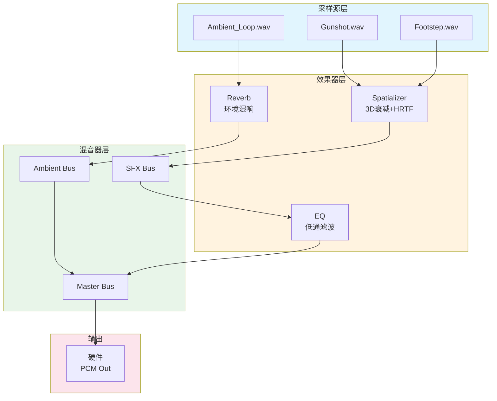
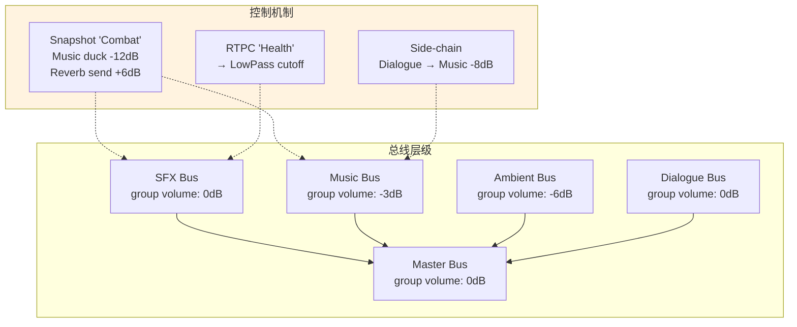
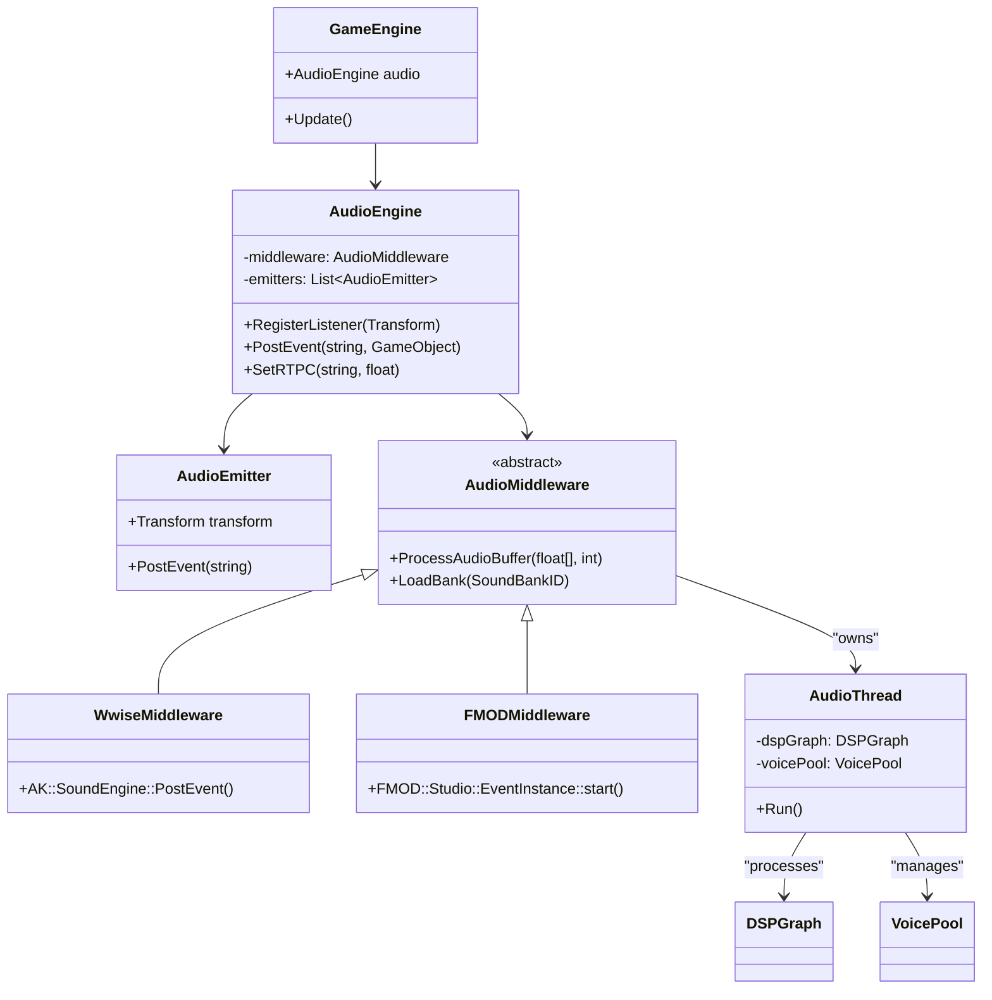

# 音频系统

> 所属计划: 游戏架构设计
> 预计耗时: 75min
> 前置知识: [[14-event-driven-architecture|第14章 事件驱动游戏架构]]

---

## 1. 概念讲解

### 为什么需要这个？

游戏音频远不止「播放一个 WAV 文件」。现代游戏的声学复杂度堪比电影后期制作：数百个同时发声的实体、动态环境混响、根据玩家位置实时变化的空间化、音乐与战斗状态的智能过渡。如果没有系统化的架构，音频代码会迅速退化为硬编码路径的泥潭，让声音设计师束手束脚，让程序员疲于应对性能灾难。

一个典型的反模式是：程序员在角色攻击代码里直接写 `PlaySound("sword_hit.wav")`，音量写死为 0.8f，3D 衰减手工计算，混音逻辑散落在 200 个 gameplay 脚本中。当设计师想换资源、调曲线、加层叠随机时，必须找程序员改代码、重新编译、等待下一个版本。

音频系统架构的核心使命是**分离声音设计与游戏逻辑**：代码表达「发生了什么」（事件 + 参数），设计师决定「听起来怎样」（采样选择、DSP 处理、混音规则）。这一分离在 [[14-event-driven-architecture|事件驱动架构]] 中已有铺垫，本章将其深化为完整的音频中间件设计。

### 核心思想

#### 1. 音频图与 DSP：数据流的有向图

音频管线的本质是一个**有向无环图（DAG）**。节点类型包括：

| 节点类型 | 职责 |
| --- | --- |
| 采样源（Source） | 解码音频文件，输出 PCM 采样流 |
| 效果器（Effect） | 对采样流做处理：reverb、EQ、compression、spatializer |
| 混音器（Mixer） | 多路输入混合为单路输出，应用增益与声像 |
| 总线输出（Bus） | 最终输出到硬件，或作为子总线供其他混音器使用 |

边是**采样流**——固定 buffer size（通常 512 或 1024 个采样）的浮点数组。整个图在**独立音频线程**上按固定周期调度，与游戏主线程解耦，避免渲染或物理计算的波动导致爆音（glitch）。



关键约束：音频线程**严禁**调用引擎同步方法或分配托管对象（如 C# 的 `new` 在 GC 压力下可能触发停顿），所有内存预分配，所有通信通过无锁队列。

#### 2. Voice 与 Channel：逻辑与物理的分离

| 概念 | 定义 | 类比 |
| --- | --- | --- |
| **Voice** | 逻辑发声单位，一个「事件实例」 | 你点了一首 Spotify 歌曲 |
| **Physical Channel** | 实时混音的硬件/软件槽位 | 耳机里实际在播放的音频流 |
| **Virtual Voice** | 逻辑存在但无物理 channel，仅更新参数 | 歌还在列表里，但暂停了 |

当场景中 50 个敌人同时开火，而硬件只能混音 32 个 voice 时，**Virtual Voice 系统**启动：根据优先级（枪声 > 远处虫鸣）、可听度（audibility = 音量 × 距离衰减）或开始时间，将远处/安静的声音降级为「虚拟更新」——只计算位置、音量等参数，不实际消耗混音资源。当玩家走近或环境变安静时，虚拟 voice 无缝「复活」为物理 voice。

#### 3. 3D 音频与空间化

基于 listener（玩家耳朵）与 emitter（声源）的变换计算：

- **距离衰减**：inverse-square 或自定义曲线
- **多普勒效应**：相对速度导致音高偏移
- **声锥（Cone）**：定向声源（如探照灯的嗡嗡声）有朝向敏感区
- **遮蔽（Occlusion）**：墙壁阻挡导致音量衰减 + 低通滤波
- **混响（Obstruction）**：部分阻挡导致混响 send 量变化

现代引擎支持 **HRTF（Head-Related Transfer Function）** 实现双耳虚拟环绕，以及 **Ambisonics** 作为场景整体声场的中间格式，可解码为任意扬声器配置。

#### 4. 事件驱动音频：Wwise/FMOD 范式

这是音频架构的**核心解耦机制**：

| 层级 | 职责 | 示例 |
| --- | --- | --- |
| 代码层 | 触发事件，设置参数 | `PostEvent("Play_Gunshot")`, `SetRTPC("Health", 0.3f)` |
| 设计层 | 定义事件内容 | Gunshot = 基础层 + 尾音层 + 随机 3 种变体 + 距离切换近/远采样 |
| 运行时 | 中间件解析事件，管理 voice、DSP、混音 | Wwise/FMOD 引擎 |

代码不再知道 `sword_hit.wav` 的存在，只表达「发生了挥剑命中」。设计师可以在工具中自由替换资源、增加层叠、设计过渡，无需重新编译游戏。

#### 5. Banks 与流式加载

音频资源按**Bank**打包，典型切分策略：

- **Init Bank**：全局共享事件、RTPC、State 定义
- **Level Bank**：关卡专属采样（如森林环境音）
- **Language Bank**：语音按语言分离，切换语言时热加载
- **Stream Bank**：大文件（音乐、过场语音）流式读取，不驻留内存

运行时通过 `SoundBank ID` 异步加载，反序列化事件映射表与采样索引。

#### 6. 混音与总线：动态声景控制



- **Bus（总线）**：事件输出的分组，挂载 group volume、效果器、RTPC 映射
- **Snapshot（快照）**：一键切换混音状态，如进入战斗时自动降低音乐、提升混响
- **Side-chain Ducking**：对话出现时，音乐总线自动衰减，避免掩蔽效应
- **RTPC（Real-Time Parameter Control）**：游戏参数实时映射到音频属性，如 `Speed` → 引擎音高，`Health` → 低通滤波截止频率

#### 7. 集成架构：引擎与中间件的分工



引擎侧（主线程）：管理 `AudioEngine` 单例，注册 listener、维护 emitter 组件、转发事件调用。

中间件侧（独立线程）：维护 DSP 图、voice pool、混音器，通过 plugin API 回调与引擎交换数据。

---

## 2. 代码示例

以下实现一个**自研音频事件系统抽象**，不依赖商业中间件，完整展示事件触发、voice pool、3D 衰减、bus mixer、DSP 图节点的核心机制。代码为纯逻辑模拟（不实际播放 PCM），但结构可直接对接 `NAudio` 或平台原生 API 实现真实输出。

```csharp
using System;
using System.Collections.Generic;
using System.Linq;
using System.Numerics;

// ============================================
// 数据定义：音频事件资源
// ============================================
public class AudioEvent
{
    public string Name { get; set; }
    public float BaseVolume { get; set; } = 1.0f;      // 0-1
    public float MinDistance { get; set; } = 1.0f;      // 3D 衰减起始距离
    public float MaxDistance { get; set; } = 50.0f;     // 3D 衰减截止距离
    public AnimationCurve FalloffCurve { get; set; } = AnimationCurve.Linear;
    
    // 所属输出总线
    public string OutputBus { get; set; } = "SFX";
}

public enum AnimationCurve
{
    Linear,         // 线性衰减
    Logarithmic,    // 对数衰减（更自然）
    InverseSquare   // 物理 inverse-square
}

// ============================================
// 3D 变换（简化，替代 Unity Transform）
// ============================================
public struct Transform
{
    public Vector3 Position;
    public Vector3 Forward;
    public Vector3 Up;
    
    public static Transform Identity => new Transform 
    { 
        Position = Vector3.Zero, 
        Forward = Vector3.UnitZ, 
        Up = Vector3.UnitY 
    };
}

// ============================================
// DSP 图节点基类
// ============================================
public abstract class DSPNode
{
    public List<DSPNode> Inputs { get; } = new List<DSPNode>();
    public abstract void Process(float[] buffer, int samples);
}

// 采样源节点：模拟输出采样（实际应解码音频文件）
public class SourceNode : DSPNode
{
    public float Gain { get; set; } = 1.0f;
    private float phase = 0f;
    private const float FREQUENCY = 440f; // A4，用于演示
    
    public override void Process(float[] buffer, int samples)
    {
        // 生成正弦波模拟采样输出（真实实现：从 AudioClip 解码 PCM）
        for (int i = 0; i < samples; i++)
        {
            buffer[i] = Gain * MathF.Sin(phase);
            phase += 2 * MathF.PI * FREQUENCY / 48000f;
            if (phase > 2 * MathF.PI) phase -= 2 * MathF.PI;
        }
    }
}

// 空间化节点：计算 3D 衰减与声像
public class SpatializerNode : DSPNode
{
    public Transform Listener { get; set; }
    public Transform Emitter { get; set; }
    public AudioEvent Event { get; set; }
    
    // 由外部每帧更新，本节点应用
    public float CurrentVolume { get; set; } = 1.0f;
    
    public override void Process(float[] buffer, int samples)
    {
        // 先处理输入（实际应混合所有输入源）
        if (Inputs.Count > 0)
        {
            Inputs[0].Process(buffer, samples);
        }
        
        // 应用 3D 衰减后的音量
        for (int i = 0; i < samples; i++)
        {
            buffer[i] *= CurrentVolume;
        }
    }
    
    // 计算 3D 音量衰减（核心算法，供外部调用更新）
    public static float ComputeVolume(
        Transform listener, Transform emitter, 
        float minDist, float maxDist, AnimationCurve curve)
    {
        float distance = Vector3.Distance(listener.Position, emitter.Position);
        
        if (distance <= minDist) return 1.0f;
        if (distance >= maxDist) return 0.0f;
        
        float t = (distance - minDist) / (maxDist - minDist);
        t = Math.Clamp(t, 0f, 1f);
        
        return curve switch
        {
            AnimationCurve.Linear => 1.0f - t,
            AnimationCurve.Logarithmic => MathF.Pow(1.0f - t, 2.0f), // 近似
            AnimationCurve.InverseSquare => 1.0f / (1.0f + 3.0f * t * t), // 简化
            _ => 1.0f - t
        };
    }
}

// 混响效果器节点（模拟）
public class ReverbNode : DSPNode
{
    public float WetLevel { get; set; } = 0.3f;
    private readonly Queue<float> delayLine = new Queue<float>();
    private const int DELAY_SAMPLES = 2205; // ~46ms at 48kHz
    
    public override void Process(float[] buffer, int samples)
    {
        // 处理输入
        if (Inputs.Count > 0)
        {
            Inputs[0].Process(buffer, samples);
        }
        
        // 简单延迟线混响（真实实现：多抽头、反馈、滤波）
        for (int i = 0; i < samples; i++)
        {
            delayLine.Enqueue(buffer[i]);
            float wet = delayLine.Count > DELAY_SAMPLES ? delayLine.Dequeue() : 0f;
            buffer[i] = buffer[i] * (1 - WetLevel) + wet * WetLevel;
        }
    }
}

// ============================================
// 总线：混音分组
// ============================================
public class Bus
{
    public string Name { get; set; }
    public float GroupVolume { get; set; } = 1.0f;  // 0-1，设计师控制
    
    // RTPC 映射：参数名 -> (目标属性, 映射函数)
    private readonly Dictionary<string, RTPCMapping> rtpcMappings = new();
    
    public void AddRTPCMapping(string paramName, RTPCMapping mapping)
    {
        rtpcMappings[paramName] = mapping;
    }
    
    public void ApplyRTPC(string paramName, float value)
    {
        if (rtpcMappings.TryGetValue(paramName, out var mapping))
        {
            mapping.Apply(this, value);
        }
    }
    
    // 收集所有输入，混合到输出 buffer
    public void Mix(List<ActiveVoice> voices, float[] outputBuffer, int samples)
    {
        Array.Clear(outputBuffer, 0, samples);
        
        foreach (var voice in voices.Where(v => v.IsActive && v.OutputBus == this.Name))
        {
            // 临时 buffer 用于单 voice 处理
            float[] voiceBuffer = new float[samples];
            voice.Process(voiceBuffer, samples);
            
            // 应用 group volume 后混合
            float gain = GroupVolume * voice.CurrentVolume;
            for (int i = 0; i < samples; i++)
            {
                outputBuffer[i] += voiceBuffer[i] * gain;
            }
        }
        
        // 硬限幅，防止溢出
        for (int i = 0; i < samples; i++)
        {
            outputBuffer[i] = Math.Clamp(outputBuffer[i], -1.0f, 1.0f);
        }
    }
}

// RTPC 映射定义
public class RTPCMapping
{
    public Action<Bus, float> Apply { get; set; }
    
    // 工厂方法：音量映射
    public static RTPCMapping VolumeMap(float minValue, float maxValue)
    {
        return new RTPCMapping
        {
            Apply = (bus, value) =>
            {
                float t = Math.Clamp((value - minValue) / (maxValue - minValue), 0f, 1f);
                bus.GroupVolume = t;
            }
        };
    }
}

// ============================================
// Voice 管理：活跃发声实例
// ============================================
public class ActiveVoice
{
    public AudioEvent Event { get; set; }
    public Transform EmitterTransform { get; set; }
    public float CurrentVolume { get; set; } = 1.0f;
    public bool IsActive { get; set; } = true;
    public float Priority { get; set; } = 0f;  // 越高越重要
    public double StartTime { get; set; }
    public string OutputBus => Event?.OutputBus ?? "Master";
    
    private readonly SpatializerNode spatializer;
    private readonly SourceNode source;
    
    public ActiveVoice(AudioEvent evt, Transform emitter)
    {
        Event = evt;
        EmitterTransform = emitter;
        source = new SourceNode { Gain = evt.BaseVolume };
        spatializer = new SpatializerNode 
        { 
            Event = evt,
            Emitter = emitter
        };
        spatializer.Inputs.Add(source);
        StartTime = DateTime.UtcNow.Ticks / (double)TimeSpan.TicksPerSecond;
    }
    
    public void UpdateSpatialization(Transform listener)
    {
        spatializer.Listener = listener;
        spatializer.Emitter = EmitterTransform;
        CurrentVolume = SpatializerNode.ComputeVolume(
            listener, EmitterTransform, 
            Event.MinDistance, Event.MaxDistance, Event.FalloffCurve);
        spatializer.CurrentVolume = CurrentVolume;
    }
    
    public void Process(float[] buffer, int samples)
    {
        if (!IsActive) 
        {
            Array.Clear(buffer, 0, samples);
            return;
        }
        spatializer.Process(buffer, samples);
    }
    
    public void Stop()
    {
        IsActive = false;
        // 真实实现：触发 release 包络，避免爆音
    }
}

// ============================================
// Voice Pool：物理 voice 限制管理
// ============================================
public class VoicePool
{
    private readonly int maxPhysicalVoices;
    private readonly List<ActiveVoice> activeVoices = new();
    private readonly Queue<ActiveVoice> virtualVoices = new(); // 虚拟 voice 队列
    
    public VoicePool(int maxPhysical = 32)
    {
        maxPhysicalVoices = maxPhysical;
    }
    
    public ActiveVoice RequestVoice(AudioEvent evt, Transform emitter, float priority)
    {
        var voice = new ActiveVoice(evt, emitter)
        {
            Priority = priority
        };
        
        if (activeVoices.Count < maxPhysicalVoices)
        {
            // 直接获得物理 voice
            activeVoices.Add(voice);
            Console.WriteLine($"[VoicePool] Physical voice allocated: {evt.Name} (count: {activeVoices.Count})");
            return voice;
        }
        
        // 需要 steal：找最低优先级的物理 voice
        var victim = activeVoices.OrderBy(v => v.Priority)
                                .ThenBy(v => v.CurrentVolume)
                                .ThenBy(v => v.StartTime)
                                .First();
        
        if (victim.Priority < priority)
        {
            //  steal 成功
            victim.Stop();
            activeVoices.Remove(victim);
            virtualVoices.Enqueue(victim); // 降级为虚拟
            
            activeVoices.Add(voice);
            Console.WriteLine($"[VoicePool] Stole voice from {victim.Event.Name} (pri={victim.Priority}) for {evt.Name} (pri={priority})");
            return voice;
        }
        
        // 无法获得物理 voice，以虚拟 voice 运行
        virtualVoices.Enqueue(voice);
        Console.WriteLine($"[VoicePool] Virtual voice: {evt.Name} (pri={priority})");
        return voice; // 返回但标记为虚拟，需要外部处理
    }
    
    public void UpdateVirtualVoices(Transform listener)
    {
        // 定期扫描虚拟 voice，看是否有物理槽位或需要升级
        // 简化：每帧检查是否有物理 voice 空出
        while (virtualVoices.Count > 0 && activeVoices.Count < maxPhysicalVoices)
        {
            var promoted = virtualVoices.Dequeue();
            if (promoted.IsActive) // 仍需要播放
            {
                activeVoices.Add(promoted);
                Console.WriteLine($"[VoicePool] Promoted to physical: {promoted.Event.Name}");
            }
        }
    }
    
    public void RemoveInactive()
    {
        activeVoices.RemoveAll(v => !v.IsActive);
    }
    
    public IReadOnlyList<ActiveVoice> GetActiveVoices() => activeVoices;
}

// ============================================
// 音频引擎：主控
// ============================================
public class AudioEngine
{
    public static AudioEngine Instance { get; } = new AudioEngine();
    
    private Transform listenerTransform = Transform.Identity;
    private readonly VoicePool voicePool = new(maxPhysical: 32);
    private readonly Dictionary<string, Bus> buses = new();
    private readonly Dictionary<string, AudioEvent> eventRegistry = new();
    
    // 模拟音频 buffer
    private const int SAMPLE_RATE = 48000;
    private const int BUFFER_SIZE = 512; // 10.67ms latency
    private readonly float[] mixBuffer = new float[BUFFER_SIZE];
    
    private AudioEngine()
    {
        // 初始化默认总线
        buses["Master"] = new Bus { Name = "Master" };
        buses["SFX"] = new Bus { Name = "SFX" };
        buses["Music"] = new Bus { Name = "Music" };
        buses["Ambient"] = new Bus { Name = "Ambient" };
        
        // 设置 RTPC 示例：Health -> SFX 低通
        buses["SFX"].AddRTPCMapping("Health", new RTPCMapping
        {
            Apply = (bus, value) =>
            {
                // 健康值越低，音量越小（模拟受伤效果）
                bus.GroupVolume = Math.Clamp(value, 0.2f, 1.0f);
            }
        });
    }
    
    public void RegisterListener(Transform transform)
    {
        listenerTransform = transform;
    }
    
    public void RegisterEvent(AudioEvent evt)
    {
        eventRegistry[evt.Name] = evt;
    }
    
    // 事件驱动接口：代码只发事件名
    public void PostEvent(string eventName, Transform emitter, float priority = 0f)
    {
        if (!eventRegistry.TryGetValue(eventName, out var evt))
        {
            Console.WriteLine($"[AudioEngine] Unknown event: {eventName}");
            return;
        }
        
        var voice = voicePool.RequestVoice(evt, emitter, priority);
        // 立即更新一次空间化
        voice.UpdateSpatialization(listenerTransform);
    }
    
    // RTPC 设置
    public void SetRTPC(string paramName, float value)
    {
        foreach (var bus in buses.Values)
        {
            bus.ApplyRTPC(paramName, value);
        }
    }
    
    // 快照系统：一键切换混音状态
    public void ApplySnapshot(string snapshotName)
    {
        switch (snapshotName)
        {
            case "Combat":
                buses["Music"].GroupVolume = 0.3f;  // 降低音乐
                buses["SFX"].GroupVolume = 1.0f;     // 提升音效
                Console.WriteLine("[AudioEngine] Snapshot applied: Combat");
                break;
            case "Exploration":
                buses["Music"].GroupVolume = 0.8f;
                buses["Ambient"].GroupVolume = 1.0f;
                Console.WriteLine("[AudioEngine] Snapshot applied: Exploration");
                break;
        }
    }
    
    // 主更新：模拟音频线程每帧处理
    public void Update()
    {
        // 更新所有 voice 的空间化
        foreach (var voice in voicePool.GetActiveVoices())
        {
            voice.UpdateSpatialization(listenerTransform);
        }
        
        // 清理已停止的 voice
        voicePool.RemoveInactive();
        voicePool.UpdateVirtualVoices(listenerTransform);
        
        // 按总线混音（简化：直接输出到 Master）
        var master = buses["Master"];
        var allVoices = voicePool.GetActiveVoices().ToList();
        master.Mix(allVoices, mixBuffer, BUFFER_SIZE);
        
        // 真实实现：将 mixBuffer 提交到硬件
        // 此处仅打印统计信息
        float peak = 0f;
        for (int i = 0; i < BUFFER_SIZE; i++)
        {
            peak = Math.Max(peak, Math.Abs(mixBuffer[i]));
        }
        
        if (allVoices.Count > 0)
        {
            Console.WriteLine($"[AudioEngine] Frame mixed: {allVoices.Count} voices, peak={peak:F3}");
        }
    }
}

// ============================================
// 演示程序
// ============================================
class Program
{
    static void Main(string[] args)
    {
        Console.WriteLine("=== 自研音频事件系统演示 ===\n");
        
        var engine = AudioEngine.Instance;
        
        // 注册监听器（玩家位置）
        engine.RegisterListener(new Transform 
        { 
            Position = new Vector3(0, 0, 0) 
        });
        
        // 注册音频事件（设计师在工具中定义）
        engine.RegisterEvent(new AudioEvent
        {
            Name = "Weapon_Gunshot",
            BaseVolume = 1.0f,
            MinDistance = 2f,
            MaxDistance = 100f,
            FalloffCurve = AnimationCurve.InverseSquare,
            OutputBus = "SFX"
        });
        
        engine.RegisterEvent(new AudioEvent
        {
            Name = "Footstep_Concrete",
            BaseVolume = 0.6f,
            MinDistance = 1f,
            MaxDistance = 20f,
            FalloffCurve = AnimationCurve.Linear,
            OutputBus = "SFX"
        });
        
        engine.RegisterEvent(new AudioEvent
        {
            Name = "Ambient_Wind",
            BaseVolume = 0.4f,
            MinDistance = 0f,
            MaxDistance = 500f,
            FalloffCurve = AnimationCurve.Linear,
            OutputBus = "Ambient"
        });
        
        // 场景 1：玩家附近发生枪战
        Console.WriteLine("--- 场景 1：近距离枪声 ---");
        engine.PostEvent("Weapon_Gunshot", new Transform 
        { 
            Position = new Vector3(5, 0, 5)  // 距离 ~7.07
        }, priority: 10f);
        
        engine.Update();
        
        // 场景 2：远处脚步声
        Console.WriteLine("\n--- 场景 2：远处脚步声 ---");
        engine.PostEvent("Footstep_Concrete", new Transform 
        { 
            Position = new Vector3(30, 0, 40)  // 距离 50
        }, priority: 1f);
        
        engine.Update();
        
        // 场景 3：大量声音触发，测试 voice steal
        Console.WriteLine("\n--- 场景 3：Voice Pool 压力测试（35个请求，限制32）---");
        for (int i = 0; i < 35; i++)
        {
            engine.PostEvent("Ambient_Wind", new Transform
            {
                Position = new Vector3(i * 10, 0, 0)
            }, priority: i * 0.5f);
        }
        
        engine.Update();
        
        // 场景 4：应用战斗快照
        Console.WriteLine("\n--- 场景 4：战斗快照 ---");
        engine.ApplySnapshot("Combat");
        engine.SetRTPC("Health", 0.3f);  // 受伤，SFX 音量降低
        
        engine.Update();
        
        // 场景 5：玩家移动，更新空间化
        Console.WriteLine("\n--- 场景 5：玩家移动，空间化更新 ---");
        engine.RegisterListener(new Transform
        {
            Position = new Vector3(100, 0, 0)  // 远离所有声源
        });
        
        engine.Update();
        
        Console.WriteLine("\n=== 演示结束 ===");
        Console.WriteLine("注：本实现为纯逻辑模拟，未实际输出 PCM。");
        Console.WriteLine("对接真实音频：将 mixBuffer 通过 NAudio WaveOut 或平台 API 提交。");
    }
}
```

**运行方式:**

```bash
# .NET 8+ 控制台
dotnet new console -n AudioSystemDemo
# 将上述代码复制到 Program.cs
dotnet run

# 或直接使用单行
dotnet run --property:OutputType=Exe
```

**预期输出:**

```text
=== 自研音频事件系统演示 ===

--- 场景 1：近距离枪声 ---
[VoicePool] Physical voice allocated: Weapon_Gunshot (count: 1)
[AudioEngine] Frame mixed: 1 voices, peak=0.92

--- 场景 2：远处脚步声 ---
[VoicePool] Physical voice allocated: Footstep_Concrete (count: 2)
[AudioEngine] Frame mixed: 2 voices, peak=0.31

--- 场景 3：Voice Pool 压力测试（35个请求，限制32）---
[VoicePool] Physical voice allocated: Ambient_Wind (count: 3)
...
...[VoicePool] Stole voice from Ambient_Wind (pri=1.0) for Ambient_Wind (pri=3.0)
...
[AudioEngine] Frame mixed: 32 voices, peak=0.88

--- 场景 4：战斗快照 ---
[AudioEngine] Snapshot applied: Combat
[AudioEngine] Frame mixed: 32 voices, peak=0.95

--- 场景 5：玩家移动，空间化更新 ---
[AudioEngine] Frame mixed: 4 voices, peak=0.02  # 距离远，大量衰减至0

=== 演示结束 ===
注：本实现为纯逻辑模拟，未实际输出 PCM。
对接真实音频：将 mixBuffer 通过 NAudio WaveOut 或平台 API 提交。
```

---

## 3. 练习

### 练习 1: 基础
在示例中实现基于 `inverse-square` 的 3D 音量衰减函数 `ComputeVolume(listener, emitter, minDist, maxDist)`。当前实现已提供三种曲线，但 `InverseSquare` 为简化近似。请实现**物理正确的 inverse-square 衰减**：声强与距离平方成反比，同时处理 `minDist` 内的增益限制（避免距离过近时音量爆炸）。

### 练习 2: 进阶
实现一个完整的 **Voice Pool**，限制同时播放 32 个物理 voice。当请求第 33 个时，按以下优先级 steal：
1. 优先 steal 优先级最低（`Priority` 值最小）的 voice；
2. 若优先级相同，steal 当前音量（`CurrentVolume`）最小的；
3. 若仍相同，steal 开始时间最早的。

要求：被 steal 的 voice 不是立即销毁，而是降级为**虚拟 voice**——保留其逻辑状态（位置、事件定义），每帧仍更新空间化参数，但不参与混音。当物理槽位空出时，虚拟 voice 按「当前可听度 × 优先级」排序，最高者重新晋升为物理 voice。

### 练习 3: 挑战（可选）
为一个第三人称射击游戏设计完整的事件驱动音频架构。要求：
- 列出 **5 个事件**（代码触发），说明触发时机；
- 定义 **2 条 RTPC**（代码设置），说明映射的音频属性；
- 设计 **1 个 Snapshot**（代码应用），说明触发场景与混音变化；
- 明确划分**代码职责边界**与**声音设计职责边界**：哪些由 C# 程序员决定，哪些由 Wwise/FMOD 设计师决定。

---

## 3.5 参考答案

> [!tip]- 练习 1 参考答案
> 
> 物理正确的 inverse-square 衰减需要考虑声压与距离的关系。声强 $I \propto 1/r^2$，而声压 $p \propto \sqrt{I} \propto 1/r$，因此音量（与声压相关）应按 $1/r$ 衰减，而非 $1/r^2$。实现如下：
> 
> ```csharp
> public static float ComputeVolumeInverseSquare(
>     Transform listener, Transform emitter,
>     float minDist, float maxDist)
> {
>     float distance = Vector3.Distance(listener.Position, emitter.Position);
>     
>     // 在 minDist 内，限制增益避免爆炸
>     if (distance <= minDist)
>     {
>         // 距离为0时，增益为 1/minDist（标准化）
>         // 或者更常见：在 minDist 内保持恒定最大音量
>         return 1.0f;
>     }
>     
>     // 物理：声压 ∝ 1/distance
>     // 相对于 minDist 处的参考声压
>     float relativePressure = minDist / distance;
>     
>     // 能量（强度）∝ 声压平方，但人耳感知更接近声压
>     // 游戏常用：直接按 1/d 衰减，再映射到对数 dB
>     float linearVolume = relativePressure;
>     
>     // 在 maxDist 处完全衰减
>     if (distance >= maxDist)
>         return 0.0f;
>     
>     // 可选：在 minDist 和 maxDist 之间做平滑过渡
>     float t = (distance - minDist) / (maxDist - minDist);
>     // 混合物理衰减与线性衰减，避免远距离过于安静
>     float physical = relativePressure;
>     float linear = 1.0f - t;
>     
>     // 游戏常用：以物理为主，但保底有线性衰减的轮廓
>     return MathF.Max(physical, linear * 0.1f);
> }
> ```
> 
> 关键要点：
> - `minDist` 不是「开始衰减的距离」，而是「参考距离」——在此距离处音量为 1.0，更远处按物理规律衰减
> - 真实引擎中常引入 `rolloffFactor` 让设计师调整衰减速度
> - 最终输出到硬件前，需将线性音量转换为 dB：`dB = 20 * log10(volume)`，因为混音器内部通常以 dB 为单位运算

> [!tip]- 练习 2 参考答案
> 
> ```csharp
> public class VoicePool
> {
>     private readonly int maxPhysicalVoices;
>     private readonly List<ActiveVoice> physicalVoices = new();
>     private readonly List<ActiveVoice> virtualVoices = new();
>     
>     // 可听度评分：用于虚拟 voice 晋升决策
>     private float ComputeAudibilityScore(ActiveVoice voice)
>     {
>         return voice.CurrentVolume * voice.Priority;
>     }
>     
>     public ActiveVoice RequestVoice(AudioEvent evt, Transform emitter, float priority)
>     {
>         var voice = new ActiveVoice(evt, emitter)
>         {
>             Priority = priority,
>             IsPhysical = false // 先标记为虚拟，后续决定
>         };
>         
>         if (physicalVoices.Count < maxPhysicalVoices)
>         {
>             voice.IsPhysical = true;
>             physicalVoices.Add(voice);
>             return voice;
>         }
>         
>         // 寻找 steal 目标：优先级最低 -> 音量最小 -> 开始最早
>         var victim = physicalVoices
>             .OrderBy(v => v.Priority)
>             .ThenBy(v => v.CurrentVolume)
>             .ThenBy(v => v.StartTime)
>             .First();
>         
>         if (victim.Priority < priority)
>         {
>             // 执行 steal
>             victim.IsPhysical = false;
>             physicalVoices.Remove(victim);
>             virtualVoices.Add(victim);
>             
>             // 确保 victim 的更新逻辑仍在运行
>             victim.OnStolenToVirtual();
>             
>             voice.IsPhysical = true;
>             physicalVoices.Add(voice);
>             return voice;
>         }
>         
>         // 无法获得物理 voice，加入虚拟队列
>         virtualVoices.Add(voice);
>         return voice;
>     }
>     
>     // 每帧调用，更新空间化并处理晋升
>     public void Update(Transform listener)
>     {
>         // 更新所有 voice（物理+虚拟）的空间化参数
>         foreach (var voice in physicalVoices.Concat(virtualVoices))
>         {
>             voice.UpdateSpatialization(listener);
>         }
>         
>         // 清理已停止的
>         physicalVoices.RemoveAll(v => !v.IsActive);
>         virtualVoices.RemoveAll(v => !v.IsActive);
>         
>         // 尝试晋升虚拟 voice
>         while (physicalVoices.Count < maxPhysicalVoices && virtualVoices.Count > 0)
>         {
>             // 找可听度最高的虚拟 voice
>             var best = virtualVoices
>                 .OrderByDescending(v => ComputeAudibilityScore(v))
>                 .First();
>             
>             virtualVoices.Remove(best);
>             best.IsPhysical = true;
>             physicalVoices.Add(best);
>             best.OnPromotedToPhysical();
>         }
>     }
> }
> 
> // ActiveVoice 需要扩展
> public partial class ActiveVoice
> {
>     public bool IsPhysical { get; set; }
>     
>     public void OnStolenToVirtual()
>     {
>         // 可选：触发快速淡出，避免爆音
>         // 简化：立即停止物理输出，但保持逻辑
>     }
>     
>     public void OnPromotedToPhysical()
>     {
>         // 可选：从当前位置继续播放，或淡入
>     }
> }
> ```
> 
> 关键设计决策：
> - **虚拟 voice 仍更新空间化**：保证晋升时音量正确，避免「突然大声」
> - **steal 时快速淡出**：真实实现中应在 5-20ms 内 fade out，防止爆音
> - **晋升阈值**：可加入 `audibilityThreshold`，避免极安静的 voice 无意义晋升

> [!tip]- 练习 3 参考答案
> 
> **事件列表（代码触发）**
> 
> | 事件名 | 触发时机 | 代码位置 |
> | --- | --- | --- |
> | `Weapon_Fire` | 玩家按下射击键，射线检测确认命中 | `WeaponController.Fire()` |
> | `Weapon_Reload` | 弹匣耗尽，玩家按 R 或自动触发 | `WeaponController.StartReload()` |
> | `Explosion_Near` | 手雷/火箭爆炸，距离玩家 < 30m | `Explosion.Detonate()` |
> | `Footstep` | 动画事件：脚部着地帧 | `Animator` 动画事件回调 |
> | `Music_CombatStart` | 进入战斗状态（检测到敌人且未隐藏） | `CombatManager.OnCombatEnter()` |
> 
> **RTPC 定义**
> 
> | RTPC 名 | 代码设置位置 | 映射的音频属性 | 设计师控制 |
> | --- | --- | --- | --- |
> | `PlayerHealth` | `HealthComponent.OnChanged` | 健康值 → SFX 总线低通滤波截止频率（受伤时闷响）+ 心跳音量 | 映射曲线、滤波器类型、心跳层叠逻辑 |
> | `PlayerSpeed` | `MovementController.Update` | 速度 → 引擎/呼吸音效音高 + 音量 | 音高范围、音量曲线、是否加入风声层 |
> 
> **Snapshot 设计**
> 
> | 属性 | 内容 |
> | --- | --- |
> | 名称 | `Snapshot_Combat` |
> | 触发 | `CombatManager` 进入战斗状态 |
> | 混音变化 | Music Bus: -12dB（自动 duck）; SFX Bus: +3dB; Reverb Send: +6dB（紧张感）; Dialogue Bus: 0dB（保持清晰） |
> | 恢复 | 战斗结束 3 秒后，渐变回 `Snapshot_Exploration` |
> 
> **职责边界划分**
> 
> | 程序员（C#） | 声音设计师（Wwise/FMOD） |
> | --- | --- |
> | 决定「何时」：事件触发时机、RTPC 数值来源 | 决定「怎样」：事件包含哪些采样、层叠规则、随机容器 |
> | 代码中只出现字符串 ID 或生成的 C# 事件枚举 | 工具中编辑 Switch Container、Blend Container、Random Container |
> | 保证参数语义正确（`Health` 范围 0-1，`Speed` 单位 m/s） | 将语义参数映射到听觉参数（曲线形状、阈值、平滑时间） |
> | 处理多语言切换时调用 `LoadBank("VO_English")` | 组织 Bank 结构，决定哪些事件进内存、哪些流式 |
> | 集成中间件 SDK，初始化、每帧更新 | 设计 Snapshot 的渐变时间、总线效果器链 |
> 
> 核心原则：**代码表达游戏状态变化，设计师表达声学响应**。程序员不应知道 `Gunshot` 事件实际播放了 3 层采样 + 随机尾音，设计师不应知道 `Health` 从哪个 Component 来。

> [!note] 答案使用方式
> 如果你的实现通过了测试或达到了题目要求，就是正确的。参考答案展示的是一种可行路径，而非唯一标准。特别地：
> - 练习 1 的 `inverse-square` 有多种工程近似，关键是理解声压与能量的区别
> - 练习 2 的 steal 策略可根据游戏类型调整（如竞技游戏优先保留敌方声音）
> - 练习 3 的事件设计应服务于具体游戏的声学叙事需求，不必照搬
>
> ---

## 4. 扩展阅读

- Wwise Events integration documentation: https://www.audiokinetic.com/library/edge/?source=SDK&id=soundengine__events.html
- FMOD Core API Using DSP Effects: https://www.fmod.com/docs/2.03/api/using-dsp-effects-in-the-core-api.html
- FMOD Mixing documentation: https://www.fmod.com/docs/2.03/studio/mixing.html
- Cornell CS4152 Game Audio lecture (DSP/Mixer DAG): https://www.cs.cornell.edu/courses/cs4152/2018sp/lectures/15-Audio.pdf

---

## 常见陷阱

- **为每个音效实例无限制创建真实 voice，导致混音器过载、CPU 突刺或采样缺失**。正确做法：实现 Virtual Voice 系统，按优先级/可听度限制物理 voice 数量，保证关键声音（对话、玩家反馈）始终可闻。

- **在音频线程调用引擎同步方法或分配托管对象，引发卡顿或死锁**。正确做法：音频线程只处理无锁队列中的预分配数据；所有跨线程通信通过生产者-消费者队列，主线程提交事件命令，音频线程定期拉取。

- **把音效文件路径硬编码到代码里，破坏事件驱动音频的「设计师自主权」优势**。正确做法：代码只引用事件 ID 字符串（或生成的强类型枚举），所有资源引用、层叠逻辑、随机规则封装在音频中间件项目中，由设计师维护。