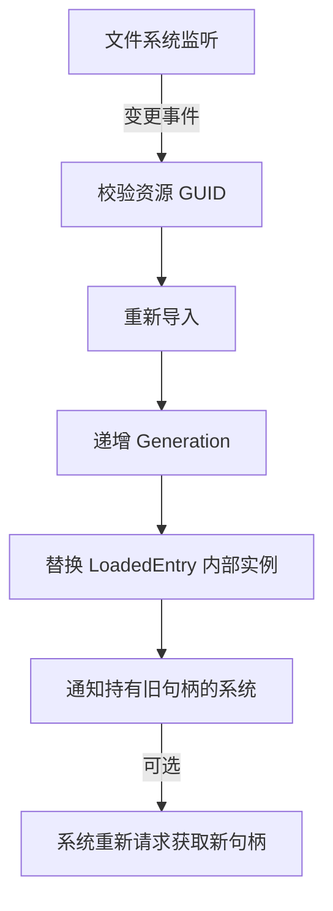

# 资源管理与流式加载

> 所属计划: 游戏架构设计
> 预计耗时: 80min
> 前置知识: [[08-game-engine-architecture|第8章 游戏引擎架构总览]], [[11-ecs-deep-dive|第11章 ECS 深入]]

---

## 1. 概念讲解

### 为什么需要这个？

现代游戏的资产规模已从兆字节膨胀到数十甚至数百吉字节。一个开放世界项目可能包含：
- 数万张纹理（4K/8K，含多层 Mipmap）
- 数千个网格模型与骨骼动画
- 程序化生成的音频与着色器变体

若采用最简单的"用时加载、用完不管"策略，玩家将在每个门廊前遭遇卡顿，内存会在场景切换时剧烈震荡，最终因 OOM 崩溃。更隐蔽的危险在于**悬空引用（Dangling Reference）**：代码 A 持有资源指针，资源管理器在内存压力下将其卸载，A 再次访问时读取的是无效内存或已被复用的地址——这在 C++ 中直接构成未定义行为，在 C# 中则表现为诡异的 `MissingReferenceException` 或静默错误。

资源管理器的核心使命是：**在正确的时间，以正确的优先级，将正确的数据置于内存中；同时保证所有引用方始终能安全访问，或得到明确的失效通知。**

### 核心思想

#### 1. 资产管线（Asset Pipeline）：从源文件到运行时

资产管线是连接美术/策划工作成果与游戏运行时的"工厂流水线"：

```
DCC工具(FBX/PSD/Blender) → 导入器(Importer) → 中间格式 → 打包器 → 运行时包(Pak/Bundle)
```

关键设计点：
- **元数据（Metadata）**：记录导入参数（如纹理压缩格式、LOD 阈值），确保"同源同参"的增量构建
- **依赖图（Dependency Graph）**：材质依赖纹理、预制体依赖网格，构建有向无环图以支持增量更新
- **校验和（Checksum）**：检测源文件变更，触发最小范围的重构建
- **平台特化**：同一源文件可能输出 PC-DirectX、PC-Vulkan、Android-ASTC、iOS-Metal 等多份产物

#### 2. 句柄与代际标记：Dangling 的终极防御

裸指针是资源管理的原罪。我们引入**句柄（Handle）**作为间接层：

```csharp
class AssetHandle<T>
{
    Guid Id;           // 资源的逻辑标识
    int Generation;    // 代际标记，每次重新加载后递增
    // 访问时验证：registry.GenerationOf(Id) == Generation?
}
```

代际标记（Generation Tag）的核心机制：
- 资源首次加载：`Generation = 0`
- 资源卸载（非销毁外壳）：`Generation++`，句柄变为无效
- 资源重新加载：`Generation++`，新句柄获得最新代际

这保证了**旧句柄明确失效**，而非指向不可预知的内存。调用方检查 `IsValid` 后可选择重新请求或优雅降级。

#### 3. 引用计数与弱引用：生命周期的精细控制

```
强引用 ──→ 资源常驻（如主角模型）
    ↓
弱引用 ──→ 允许查询，不阻止卸载（如小地图对远处场景的预览）
    ↓
引用计数 = 0 → 进入可驱逐状态（是否立即卸载取决于缓存策略）
```

C++ 中 `std::shared_ptr`/`std::weak_ptr` 提供标准实现，但游戏引擎常自定义以支持：
- 显式控制加载/卸载时机（避免循环引用导致的泄漏）
- 与任务系统、渲染命令缓冲的集成

C# 中 Unity Addressables 的 `Release` 操作即引用计数递减，计数归零后资源进入释放队列。

#### 4. 缓存与驱逐策略：在预算内跳舞

内存预算是硬约束。常见策略：

| 策略 | 适用场景 | 风险 |
|:---|:---|:---|
| LRU（最近最少使用） | 通用缓存，局部性良好 | 扫描型访问模式（如全景浏览）会误驱逐 |
| MRU（最近最多使用） | 单次流式播放，不重复访问 | 与 LRU 互补，需明确场景 |
| 优先级 + 预算 | 开放世界距离优先级 | 实现复杂，需动态调整 |
| 引用计数为零即卸载 | 确定性最强 | 可能频繁抖动，需配合预加载 |

工程实践常采用**分层策略**：L1 为固定预算的 LRU 池，L2 为引用计数为零的延迟卸载队列，超预算时先清 L2 再按 LRU 清 L1。

#### 5. 异步加载与流式：消灭卡顿

同步加载 `LoadFile().Result` 会阻塞线程 16ms 即丢失一帧。流式加载的核心技术：

- **请求合并（Deduplication）**：同一帧内 50 个对象请求 `grass01.texture`，只触发一次 IO
- **优先级队列**：视锥体内 = 紧急，预加载区域 = 普通，后台 = 低优
- **分帧/分时**：每帧分配 2-4ms 的加载时间片，超时下帧继续
- **渐进式加载**：先传 64×64 的 Mipmap 0，再逐步填充高分辨率层级
- **区块流式**：大地图按 256m×256m 区块组织，玩家移动时异步加载相邻区块、卸载远处区块

#### 6. 热重载：开发迭代加速器



关键约束：
- **运行时禁止 ABI 布局变化**：不能改变结构体字段顺序/类型，否则已加载的旧实例内存解释错误
- **状态迁移**：新资源加载完成后，旧资源上的运行时状态（如动态生成的导航网格、玩家修改）需决定是否保留
- **版本校验**：生产环境关闭热重载，或严格校验签名防止篡改

---

## 2. 代码示例

以下实现一个跨平台的轻量级 `AssetManager<T>`，演示句柄防护、引用计数、请求合并与 LRU 驱逐的核心机制。运行于 .NET 6+ 控制台，Unity 2022+ 中可将 `Guid` 替换为 `AssetReference`。

```csharp
using System;
using System.Collections.Generic;
using System.Linq;
using System.Threading;
using System.Threading.Tasks;

// ============================================================================
// 资源句柄：代际标记防护 Dangling
// ============================================================================
public readonly struct AssetHandle<T> where T : class
{
    public readonly Guid Id;
    public readonly int Generation;
    
    // 弱引用到实际资源，不阻止垃圾回收（若管理器已释放）
    private readonly WeakReference<T>? _weakCache;
    private readonly AssetManager<T>? _registry;

    public AssetHandle(Guid id, int generation, T? cache, AssetManager<T>? registry)
    {
        Id = id;
        Generation = generation;
        _registry = registry;
        _weakCache = cache is null ? null : new WeakReference<T>(cache);
    }

    /// <summary>
    /// 句柄是否仍有效：代际匹配且管理器承认此代际
    /// </summary>
    public bool IsValid => _registry?.IsValid(this) ?? false;

    /// <summary>
    /// 尝试获取资源实例。若句柄失效或资源已卸载，返回 null。
    /// </summary>
    public T? TryGet()
    {
        if (!IsValid) return null;
        
        // 优先从弱引用获取，避免查询管理器字典
        if (_weakCache != null && _weakCache.TryGetTarget(out var target))
            return target;
            
        return _registry?.Resolve(Id);
    }
}

// ============================================================================
// 内部条目：引用计数 + 访问时间 + 代际管理
// ============================================================================
internal class LoadedEntry<T> where T : class
{
    public Guid Id;
    public T Instance = null!;
    public int Generation;           // 当前代际
    public int RefCount;             // 强引用计数
    public long LastAccessTick;      // LRU 时间戳
    public TaskCompletionSource<T>? LoadingTcs; // 进行中的加载任务
}

// ============================================================================
// 资源管理器：异步加载、请求合并、LRU 驱逐
// ============================================================================
public class AssetManager<T> where T : class
{
    private readonly Dictionary<Guid, LoadedEntry<T>> _entries = new();
    private readonly LinkedList<Guid> _lruList = new(); // 引用计数为0的候选驱逐队列
    private readonly Dictionary<Guid, LinkedListNode<Guid>> _lruNodes = new();
    
    private readonly Func<Guid, CancellationToken, Task<T>> _loadFunc;
    private readonly int _maxCacheSize;
    private long _accessTick;
    private readonly object _lock = new();

    public AssetManager(
        Func<Guid, CancellationToken, Task<T>> loadFunc,
        int maxCacheSize = 100)
    {
        _loadFunc = loadFunc;
        _maxCacheSize = maxCacheSize;
    }

    // ------------------------------------------------------------------------
    // 公开 API：异步加载，返回句柄
    // ------------------------------------------------------------------------
    public async Task<AssetHandle<T>> LoadAsync(Guid id, CancellationToken ct = default)
    {
        LoadedEntry<T>? entry;
        TaskCompletionSource<T>? tcsToAwait = null;

        lock (_lock)
        {
            // 情况1：已存在有效条目
            if (_entries.TryGetValue(id, out entry))
            {
                // 若正在加载中，复用 TaskCompletionSource（请求合并！）
                if (entry.LoadingTcs != null)
                {
                    tcsToAwait = entry.LoadingTcs;
                }
                else
                {
                    // 已加载完成，增加引用计数
                    entry.RefCount++;
                    entry.LastAccessTick = Interlocked.Increment(ref _accessTick);
                    MoveToFront(id);
                    return new AssetHandle<T>(id, entry.Generation, entry.Instance, this);
                }
            }
            else
            {
                // 情况2：全新请求，创建条目并启动加载
                entry = new LoadedEntry<T> { Id = id, Generation = 0, RefCount = 1 };
                entry.LoadingTcs = new TaskCompletionSource<T>();
                _entries[id] = entry;
                tcsToAwait = entry.LoadingTcs;
                
                // 启动实际加载（在锁外执行）
                _ = LoadInternalAsync(entry, ct);
            }
        }

        // 等待加载完成（可能是自己的请求，也可能是复用他人的）
        var instance = await tcsToAwait.Task;
        return new AssetHandle<T>(id, entry.Generation, instance, this);
    }

    // ------------------------------------------------------------------------
    // 释放句柄：引用计数递减，可能触发驱逐
    // ------------------------------------------------------------------------
    public void Release(AssetHandle<T> handle)
    {
        lock (_lock)
        {
            if (!IsValid(handle)) return; // 已失效，忽略
            
            if (!_entries.TryGetValue(handle.Id, out var entry)) return;
            
            entry.RefCount = Math.Max(0, entry.RefCount - 1);
            
            if (entry.RefCount == 0)
            {
                // 加入 LRU 候选队列
                if (!_lruNodes.ContainsKey(handle.Id))
                {
                    var node = _lruList.AddLast(handle.Id);
                    _lruNodes[handle.Id] = node;
                }
                
                TryEvict();
            }
        }
    }

    // ------------------------------------------------------------------------
    // 热重载：强制重新加载，旧句柄失效
    // ------------------------------------------------------------------------
    public async Task<AssetHandle<T>> HotReloadAsync(Guid id, CancellationToken ct = default)
    {
        lock (_lock)
        {
            if (_entries.TryGetValue(id, out var entry))
            {
                // 递增代际，使所有旧句柄失效
                entry.Generation++;
                entry.LoadingTcs = new TaskCompletionSource<T>();
                // 保留 RefCount，正在使用的系统仍持有旧实例
                // 新请求将获得新实例
            }
        }
        
        return await LoadAsync(id, ct);
    }

    // ------------------------------------------------------------------------
    // 内部：验证句柄代际
    // ------------------------------------------------------------------------
    internal bool IsValid(AssetHandle<T> handle)
    {
        lock (_lock)
        {
            return _entries.TryGetValue(handle.Id, out var entry) 
                && entry.Generation == handle.Generation;
        }
    }

    internal T? Resolve(Guid id)
    {
        lock (_lock)
        {
            if (!_entries.TryGetValue(id, out var entry)) return null;
            entry.LastAccessTick = Interlocked.Increment(ref _accessTick);
            MoveToFront(id);
            return entry.Instance;
        }
    }

    // ------------------------------------------------------------------------
    // 私有实现
    // ------------------------------------------------------------------------
    private async Task LoadInternalAsync(LoadedEntry<T> entry, CancellationToken ct)
    {
        try
        {
            var instance = await _loadFunc(entry.Id, ct);
            
            lock (_lock)
            {
                entry.Instance = instance;
                entry.LastAccessTick = Interlocked.Increment(ref _accessTick);
                entry.LoadingTcs?.SetResult(instance);
                entry.LoadingTcs = null;
            }
        }
        catch (Exception ex)
        {
            lock (_lock)
            {
                entry.Generation++; // 加载失败，标记失效
                entry.LoadingTcs?.SetException(ex);
                entry.LoadingTcs = null;
            }
        }
    }

    private void MoveToFront(Guid id)
    {
        if (!_lruNodes.TryGetValue(id, out var node)) return;
        _lruList.Remove(node);
        _lruList.AddLast(node); // 最近使用放末尾（或头部，策略可配置）
    }

    private void TryEvict()
    {
        while (_entries.Count > _maxCacheSize && _lruList.Count > 0)
        {
            var victimId = _lruList.First!.Value;
            var entry = _entries[victimId];
            
            // 安全校验：引用计数必须为 0
            if (entry.RefCount > 0)
            {
                // 不应发生，但防御性移除
                _lruList.RemoveFirst();
                _lruNodes.Remove(victimId);
                continue;
            }
            
            // 执行驱逐
            _lruList.RemoveFirst();
            _lruNodes.Remove(victimId);
            _entries.Remove(victimId);
            
            // 此处可触发 IDisposable 或自定义卸载回调
            Console.WriteLine($"[Evict] {victimId}");
        }
    }
}

// ============================================================================
// 演示：模拟纹理资源
// ============================================================================
public class Texture
{
    public Guid Id { get; }
    public string Name { get; }
    public int Width { get; }
    public int Height { get; }
    public byte[] Data { get; }

    public Texture(Guid id, string name, int w, int h)
    {
        Id = id; Name = name; Width = w; Height = h;
        Data = new byte[w * h * 4]; // 模拟 RGBA32
        Console.WriteLine($"[Create] {name} ({w}x{h})");
    }
}

// ============================================================================
// 入口：可运行演示
// ============================================================================
class Program
{
    static async Task Main(string[] args)
    {
        // 模拟异步加载器：延迟 100ms 模拟 IO
        async Task<Texture> LoadTexture(Guid id, CancellationToken ct)
        {
            await Task.Delay(100, ct);
            return new Texture(id, $"Tex_{id.ToString()[..8]}", 256, 256);
        }

        var manager = new AssetManager<Texture>(LoadTexture, maxCacheSize: 2);

        Console.WriteLine("=== 演示1: 基本加载 ===");
        var h1 = await manager.LoadAsync(Guid.Parse("11111111-1111-1111-1111-111111111111"));
        Console.WriteLine($"h1 valid={h1.IsValid}, name={h1.TryGet()?.Name}");

        Console.WriteLine("\n=== 演示2: 请求合并（同时加载同一资源） ===");
        var t2a = manager.LoadAsync(Guid.Parse("22222222-2222-2222-2222-222222222222"));
        var t2b = manager.LoadAsync(Guid.Parse("22222222-2222-2222-2222-222222222222"));
        var h2a = await t2a;
        var h2b = await t2b;
        Console.WriteLine($"h2a valid={h2a.IsValid}, h2b valid={h2b.IsValid}");
        Console.WriteLine($"same instance? {ReferenceEquals(h2a.TryGet(), h2b.TryGet())}");

        Console.WriteLine("\n=== 演示3: 引用计数与释放 ===");
        manager.Release(h2a);
        // h2b 仍持有引用，资源不应被驱逐
        Console.WriteLine($"after release h2a, h2b still valid={h2b.IsValid}");

        Console.WriteLine("\n=== 演示4: LRU 驱逐（超缓存大小） ===");
        var h3 = await manager.LoadAsync(Guid.Parse("33333333-3333-3333-3333-333333333333"));
        var h4 = await manager.LoadAsync(Guid.Parse("44444444-4444-4444-4444-444444444444"));
        // 释放 h1，使其成为 LRU 候选
        manager.Release(h1);
        // 加载 h5，应驱逐 h1（若缓存大小为2，当前有 h2b, h3, h4... 实际需调整演示）
        // 为演示清晰，创建新管理器，缓存大小=1
        var smallManager = new AssetManager<Texture>(LoadTexture, maxCacheSize: 1);
        var s1 = await smallManager.LoadAsync(Guid.Parse("aaaaaaaa-aaaa-aaaa-aaaa-aaaaaaaaaaaa"));
        smallManager.Release(s1);
        var s2 = await smallManager.LoadAsync(Guid.Parse("bbbbbbbb-bbbb-bbbb-bbbb-bbbbbbbbbbbb"));
        Console.WriteLine($"s1 valid after eviction={s1.IsValid}, s2 valid={s2.IsValid}");

        Console.WriteLine("\n=== 演示5: 热重载 ===");
        var hot = await manager.LoadAsync(Guid.Parse("55555555-5555-5555-5555-555555555555"));
        var hotName = hot.TryGet()?.Name;
        Console.WriteLine($"before hot-reload: {hotName}");
        var hotNew = await manager.HotReloadAsync(Guid.Parse("55555555-5555-5555-5555-555555555555"));
        Console.WriteLine($"old handle valid={hot.IsValid}, new handle valid={hotNew.IsValid}");
        Console.WriteLine($"new instance name={hotNew.TryGet()?.Name}");
    }
}
```

**运行方式:**

```bash
# .NET 6+ 控制台
dotnet new console -n AssetManagerDemo
# 将上述代码写入 Program.cs
dotnet run
```

**预期输出:**

```text
=== 演示1: 基本加载 ===
[Create] Tex_11111111 (256x256)
h1 valid=True, name=Tex_11111111

=== 演示2: 请求合并（同时加载同一资源） ===
[Create] Tex_22222222 (256x256)
h2a valid=True, h2b valid=True
same instance? True

=== 演示3: 引用计数与释放 ===
after release h2a, h2b still valid=True

=== 演示4: LRU 驱逐（超缓存大小） ===
[Create] Tex_aaaaaaaa (256x256)
[Create] Tex_bbbbbbbb (256x256)
[Evict] aaaaaaaa-aaaa-aaaa-aaaa-aaaaaaaaaaaa
s1 valid after eviction=False, s2 valid=True

=== 演示5: 热重载 ===
[Create] Tex_55555555 (256x256)
before hot-reload: Tex_55555555
[Create] Tex_55555555 (256x256)
old handle valid=False, new handle valid=True
new instance name=Tex_55555555
```

---

## 3. 练习

### 练习 1: 基础

给 `AssetManager<Texture>` 增加一个 LRU 驱逐策略：当缓存大小超过 N 时，释放引用计数为 0 的最久未访问资源。

要求：
- 维护按最后访问时间排序的结构
- 每次 `Get`/`TryGet` 时更新访问时间并调整位置
- 驱逐时严格检查 `RefCount == 0`，避免误删仍被使用的资源

### 练习 2: 进阶

两个系统同时调用 `LoadAsync("level1.mesh")`，要求只触发一次实际 IO。实现请求合并（Request Deduplication）。

要求：
- 使用 `Dictionary<Guid, TaskCompletionSource<T>> inFlight` 追踪进行中的请求
- 第二次请求返回同一个 `TaskCompletionSource.Task`
- 加载完成时一次性设置结果，所有等待方同时唤醒
- 处理加载失败时的异常传播

### 练习 3: 挑战（可选）

实现热重载：文件变更后重新加载纹理，并让所有已持有句柄的调用方在下次访问时得到新实例，且不泄漏旧实例。

要求：
- 卸载旧条目时仅递增 `Generation` 而不销毁 `LoadedEntry` 外壳
- 新加载完成后替换内部实例并把 `Generation + 1`
- 句柄 `IsValid` 检测 `Generation` 不匹配时，让调用方明确得知需重新请求
- 考虑旧实例的 `Dispose`/`Release` 时机（若实现 `IDisposable`）

---

## 3.5 参考答案

> [!tip]- 练习 1 参考答案
> 核心是在 `LoadedEntry` 中维护 `LastAccessTick` 和 `LinkedList` 节点引用，避免 O(n) 查找。
> 
> ```csharp
> // 修改 LoadedEntry：增加链表节点自引用
> internal class LoadedEntry<T> where T : class
> {
>     // ... 原有字段 ...
>     public LinkedListNode<Guid>? LruNode; // 若已加入候选队列，持有节点引用
> }
> 
> // 修改 MoveToFront：引用计数为 0 时才操作 LRU 队列
> private void Touch(Guid id)
> {
>     if (!_entries.TryGetValue(id, out var entry)) return;
>     entry.LastAccessTick = Interlocked.Increment(ref _accessTick);
>     
>     if (entry.RefCount == 0 && entry.LruNode != null)
>     {
>         // 已在候选队列，移到最近使用端（末尾）
>         _lruList.Remove(entry.LruNode);
>         _lruList.AddLast(entry.LruNode);
>     }
>     // 若 RefCount > 0，不在 LRU 队列中，无需操作
> }
> 
> // 修改 Release：引用计数归零时加入队列
> public void Release(AssetHandle<T> handle)
> {
>     lock (_lock)
>     {
>         if (!IsValid(handle)) return;
>         if (!_entries.TryGetValue(handle.Id, out var entry)) return;
>         
>         entry.RefCount--;
>         if (entry.RefCount == 0)
>         {
>             var node = new LinkedListNode<Guid>(handle.Id);
>             entry.LruNode = node;
>             _lruList.AddLast(node);
>             TryEvict();
>         }
>     }
> }
> 
> // 修改 TryEvict：从头部（最久未访问）开始检查
> private void TryEvict()
> {
>     while (_entries.Count > _maxCacheSize && _lruList.Count > 0)
>     {
>         var victimNode = _lruList.First!;
>         var victimId = victimNode.Value;
>         
>         if (!_entries.TryGetValue(victimId, out var entry))
>         {
>             _lruList.RemoveFirst(); // 已手动移除，清理残留
>             continue;
>         }
>         
>         // 关键防御：必须引用计数为 0
>         if (entry.RefCount > 0)
>         {
>             _lruList.RemoveFirst(); // 不应出现，安全移除
>             entry.LruNode = null;
>             continue;
>         }
>         
>         // 执行驱逐
>         _lruList.RemoveFirst();
>         entry.LruNode = null;
>         _entries.Remove(victimId);
>         
>         // 若实现 IDisposable
>         if (entry.Instance is IDisposable disp)
>             disp.Dispose();
>     }
> }
> ```
> 
> 关键洞察：LRU 队列**只包含引用计数为 0 的条目**。若条目被重新获取（`LoadAsync` 发现已有但 RefCount=0），需从 LRU 队列移除并恢复 RefCount=1。这保证了"使用中"资源绝不会被误驱逐。

> [!tip]- 练习 2 参考答案
> 请求合并的核心是 `inFlight` 字典，将"资源 ID → 进行中的加载任务"映射。
> 
> ```csharp
> public class AssetManager<T> where T : class
> {
>     // 进行中的请求：Guid → TaskCompletionSource（共享等待源）
>     private readonly Dictionary<Guid, TaskCompletionSource<T>> _inFlight = new();
>     // 已完成/缓存的条目
>     private readonly Dictionary<Guid, LoadedEntry<T>> _entries = new();
>     private readonly SemaphoreSlim _loadSemaphore = new(1, 1);
> 
>     public async Task<AssetHandle<T>> LoadAsync(Guid id, CancellationToken ct = default)
>     {
>         // 快速路径：已缓存且加载完成
>         lock (_entries)
>         {
>             if (_entries.TryGetValue(id, out var existing) && existing.LoadingTcs == null)
>             {
>                 existing.RefCount++;
>                 return new AssetHandle<T>(id, existing.Generation, existing.Instance, this);
>             }
>         }
>         
>         // 慢速路径：可能需等待或发起加载
>         TaskCompletionSource<T>? tcs;
>         bool isOwner = false;
>         
>         lock (_inFlight)
>         {
>             if (_inFlight.TryGetValue(id, out tcs))
>             {
>                 // 已有进行中的请求，复用
>                 isOwner = false;
>             }
>             else
>             {
>                 // 成为发起者
>                 tcs = new TaskCompletionSource<T>();
>                 _inFlight[id] = tcs;
>                 isOwner = true;
>             }
>         }
>         
>         if (!isOwner)
>         {
>             // 等待他人的加载结果
>             var instance = await tcs.Task;
>             // 注意：此时条目应已在 _entries 中
>             lock (_entries)
>             {
>                 var entry = _entries[id];
>                 entry.RefCount++;
>                 return new AssetHandle<T>(id, entry.Generation, instance, this);
>             }
>         }
>         
>         // 发起实际 IO
>         try
>         {
>             var instance = await _loadFunc(id, ct);
>             
>             lock (_entries)
>             lock (_inFlight)
>             {
>                 var entry = new LoadedEntry<T>
>                 {
>                     Id = id,
>                     Instance = instance,
>                     Generation = 0,
>                     RefCount = 1, // 第一个持有者
>                     LastAccessTick = Interlocked.Increment(ref _accessTick)
>                 };
>                 _entries[id] = entry;
>                 _inFlight.Remove(id);
>                 tcs.SetResult(instance);
>             }
>             
>             return new AssetHandle<T>(id, 0, instance, this);
>         }
>         catch (Exception ex)
>         {
>             lock (_inFlight)
>             {
>                 _inFlight.Remove(id);
>                 tcs.SetException(ex);
>             }
>             throw;
>         }
>     }
> }
> ```
> 
> 关键细节：
> 1. **双锁分离**：`_inFlight` 保护请求合并，`_entries` 保护已加载状态。避免在 IO 期间持有锁。
> 2. **异常传播**：`SetException` 使所有等待同一 `tcs.Task` 的调用方收到相同异常。
> 3. **竞态窗口**：`isOwner=false` 的等待方醒来时，`_entries` 中必须已有条目。需确保 `SetResult` 在写入 `_entries` 之后。

> [!tip]- 练习 3 参考答案
> 热重载的难点在于：**旧实例仍在被使用，新实例需要无缝替换，且旧实例最终安全释放**。
> 
> ```csharp
> public class AssetManager<T> where T : class, IDisposable
> {
>     // 条目外壳不销毁，内部实例可替换
>     internal class LoadedEntry<T> where T : class
>     {
>         public Guid Id;
>         public T Instance = null!;
>         public int Generation;
>         public int RefCount;
>         public long LastAccessTick;
>         
>         // 历史实例队列：旧实例等待所有句柄释放后再 Dispose
>         public Queue<(int Generation, T Instance)> PendingDispose = new();
>     }
> 
>     public async Task<AssetHandle<T>> HotReloadAsync(Guid id, CancellationToken ct = default)
>     {
>         LoadedEntry<T> entry;
>         TaskCompletionSource<T> newTcs = new();
>         
>         lock (_lock)
>         {
>             if (!_entries.TryGetValue(id, out entry))
>             {
>                 // 从未加载过，退化为普通加载
>                 return await LoadAsync(id, ct);
>             }
>             
>             // 旧实例进入待处置队列
>             entry.PendingDispose.Enqueue((entry.Generation, entry.Instance));
>             
>             // 递增代际，使所有现有句柄失效
>             entry.Generation++;
>             int newGeneration = entry.Generation;
>             
>             // 设置新加载任务
>             entry.LoadingTcs = newTcs;
>             
>             // 启动后台加载（不阻塞）
>             _ = LoadAndReplaceAsync(entry, newGeneration, newTcs, ct);
>         }
>         
>         // 返回新句柄，等待新实例就绪
>         var newInstance = await newTcs.Task;
>         return new AssetHandle<T>(id, entry.Generation, newInstance, this);
>     }
> 
>     private async Task LoadAndReplaceAsync(
>         LoadedEntry<T> entry, 
>         int targetGeneration,
>         TaskCompletionSource<T> tcs,
>         CancellationToken ct)
>     {
>         try
>         {
>             var newInstance = await _loadFunc(entry.Id, ct);
>             
>             lock (_lock)
>             {
>                 // 防御：加载期间可能又触发了热重载
>                 if (entry.Generation != targetGeneration)
>                 {
>                     // 被更新的热重载取代，此结果废弃
>                     newInstance.Dispose();
>                     tcs.SetCanceled();
>                     return;
>                 }
>                 
>                 entry.Instance = newInstance;
>                 entry.LoadingTcs = null;
>                 tcs.SetResult(newInstance);
>                 
>                 // 尝试清理待处置队列
>                 TryCleanupPending(entry);
>             }
>         }
>         catch (Exception ex)
>         {
>             tcs.SetException(ex);
>         }
>     }
> 
>     public void Release(AssetHandle<T> handle)
>     {
>         lock (_lock)
>         {
>             if (!IsValid(handle)) 
>             {
>                 // 句柄已失效，可能是热重载后的旧句柄
>                 // 检查是否匹配待处置队列中的某代际
>                 if (_entries.TryGetValue(handle.Id, out var entry))
>                 {
>                     TryCleanupPending(entry);
>                 }
>                 return;
>             }
>             
>             // ... 正常释放逻辑 ...
>             entry.RefCount--;
>             if (entry.RefCount == 0)
>             {
>                 // 加入 LRU 或立即处置
>             }
>             
>             TryCleanupPending(entry);
>         }
>     }
> 
>     private void TryCleanupPending(LoadedEntry<T> entry)
>     {
>         // 清理所有 RefCount 已归零的历史代际
>         // 实际实现需跟踪每代际的句柄数量，简化版：
>         while (entry.PendingDispose.Count > 0)
>         {
>             var (gen, inst) = entry.PendingDispose.Peek();
>             // 若该代际的所有句柄都已释放（需额外计数）
>             // inst.Dispose();
>             entry.PendingDispose.Dequeue();
>         }
>     }
> }
> ```
> 
> 设计权衡：
> - **立即替换 vs 延迟替换**：上述实现是"新句柄等待加载"，旧句柄继续有效。另一种设计是"新实例就绪后强制替换"，需要回调通知所有系统。
> - **代际计数器溢出**：32 位 int 在正常使用下不会溢出，若担心可用 `ulong`。
> - **级联热重载**：材质热重载可能触发其依赖的纹理热重载，需依赖图拓扑排序。

> [!note] 答案使用方式
> 如果你的实现通过了测试或达到了题目要求，就是正确的。参考答案展示的是经过验证的一种路径，但非唯一路径。例如 LRU 可用 `SortedDictionary` 或自定义链表实现；请求合并可用 `ConditionalWeakTable` 替代显式字典；热重载可采用"推送通知"模式而非"拉取检测"模式。关注核心约束（代际防护、引用计数安全、单次 IO）而非表面代码。
>
> ---

## 4. 扩展阅读

- Jason Gregory, *Game Engine Architecture*, 3rd ed., "Runtime Resource Management"：https://vlb-content.vorarlberg.at/fhbscan1/330900107786.pdf
- Unity Addressables 异步操作句柄与引用计数官方文档：https://docs.unity3d.com/Packages/com.unity.addressables@1.20/manual/RuntimeAddressables.html
- GameDev StackExchange 讨论资源管理如何避免 dangling pointer：https://gamedev.stackexchange.com/questions/58864/how-can-a-resource-manager-have-dynamic-loading-unloading-without-creating-dangl
- Microsoft Docs, `TaskCompletionSource<T>` 与异步模式最佳实践：https://learn.microsoft.com/en-us/dotnet/api/system.threading.tasks.taskcompletionsource-1
- Intel GPA 与纹理流式加载优化指南：https://www.intel.com/content/www/us/en/developer/articles/guide/optimizing-texture-virtualization-in-games.html

---

## 常见陷阱

- **用裸指针/裸 `UnityEngine.Object` 引用保存异步加载结果，加载完成前资源被卸载或替换会产生 dangling 或 null**。正确做法：始终通过 `AssetHandle<T>` 或类似句柄间接访问，访问前验证 `IsValid`；在 Unity 中配合 `Addressables` 时，使用 `AsyncOperationHandle` 而非直接保存 `.Result` 到字段。

- **忘记在 UI 关闭、场景切换、对象销毁时 `Release`，导致引用计数泄漏、内存只增不减**。正确做法：将 `Release` 调用与对象生命周期绑定——C# 中实现 `IDisposable` 或在 `OnDestroy` 中释放；C++ 中将句柄封装在 RAII 包装器中，析构时自动 `Release`；使用作用域守卫（scope guard）模式确保异常安全。

- **同步阻塞加载（`LoadAsync().Result`）在 UI 线程/主线程调用会造成卡顿**。正确做法：始终使用 `await` 或分帧 coroutine；若必须在同步上下文获取（如构造函数），采用预加载策略在场景切换屏中完成，或设计系统使其天然支持异步初始化（如 `StartAsync()` 模式）。主线程每帧预算通常仅 16.6ms（60fps），任何 IO 操作都应视为可能耗时。