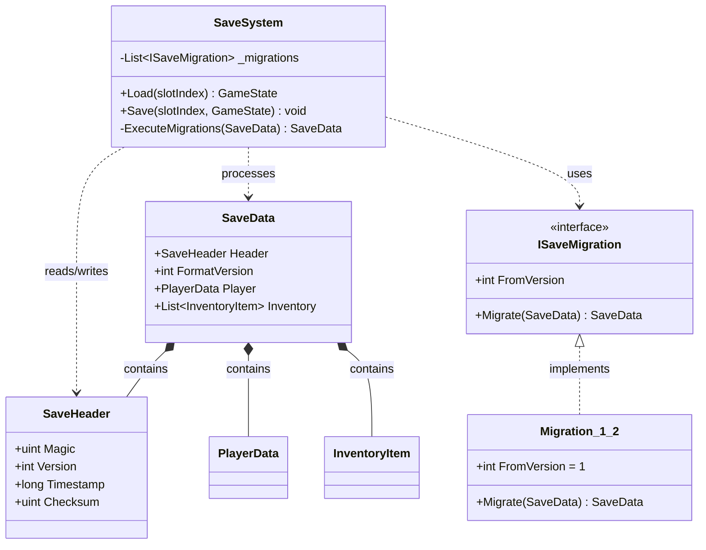

# 序列化与存档系统

> 所属计划: 游戏架构设计
> 预计耗时: 75min
> 前置知识: [[11-ecs-deep-dive|第11章 ECS 深入]], [[23-asset-management|第23章 资源管理与流式加载]]

---

## 1. 概念讲解

### 为什么需要这个？

游戏存档不是"把内存 dump 到磁盘"那么简单。一个成熟的存档系统必须回答三个核心问题：

1. **游戏更新后，半年前的旧档还能读吗？** —— 版本迁移问题
2. **Mod 或 DLC 新增字段后，旧客户端看到新存档会崩溃吗？** —— 向前兼容问题
3. **两个角色互相锁定（A 的目标是 B，B 的目标是 A），怎么存？** —— 引用图序列化问题

更隐蔽的是，游戏状态与引擎状态深度纠缠：渲染器句柄、物理碰撞体指针、协程栈帧、随机数生成器内部状态——这些**运行时瞬态**若被误写入存档，加载时必然崩溃。存档系统必须建立清晰的"可持久化边界"。

### 核心思想

#### 序列化格式选型：分层策略

| 层级 | 格式 | 适用场景 | 权衡 |
|:---|:---|:---|:---|
| 热数据（运行中） | 内存结构，直接指针引用 | 帧更新 | 最快，不可持久化 |
| 检查点/快速存档 | 自定义二进制（`BitSerializer`、MemoryPack） | 高频自动保存 | 紧凑、快，需版本控制 |
| 用户手动存档 | JSON / MessagePack / protobuf | 调试、跨平台、云同步 | 可读/可压缩，体积中等 |
| 资产引用 | GUID / `AssetReference` | 指向外部资源 | 解耦内存地址与磁盘路径 |

**关键洞察**：没有"最好"的格式，只有"最适合当前约束"的分层组合。开发期用 JSON 便于调试；发布后用二进制减少体积；云同步用 protobuf 保证跨语言兼容。

#### 版本化与迁移：集中式迁移链

反模式：在业务对象里散落 `if (saveVersion < 3)` 判断。

正模式：将迁移逻辑集中为**纯函数链**，每个迁移只负责一个版本跳跃：

```csharp
interface ISaveMigration
{
    int FromVersion { get; }
    SaveData Migrate(SaveData input);  // 纯数据转换，无副作用
}
```

加载流程变成：**读取 header → 确认当前版本 → 依次执行 `v1→v2→v3` 迁移链 → 得到最新格式 DTO → 映射到运行时对象**。

迁移链注册到有序列表，保证顺序；迁移只做 DTO 到 DTO 的转换，绝不触碰游戏逻辑或触发副作用。

#### 向前兼容：未知字段的安全跳过

向前兼容要求新格式能被旧代码"优雅忽略"。实现手段：

- **字段编号（tag）**：每个字段带唯一整数 ID，如 protobuf 的 `= 1`, `= 2`
- **键值对（string key）**：如 JSON、`Dictionary<string, object>`
- **长度前缀**：每个字段前标注字节长度，未知 tag 时跳过对应字节

禁止用**数组索引**做版本间映射——插入元素会打乱全部后续索引，导致静默数据错位。

#### 存档槽与元数据架构

```
save/
├── slot_0/
│   ├── main.save          # 实际存档数据
│   ├── backup/            # 自动备份（保留最近 N 个）
│   │   ├── auto_001.save
│   │   └── auto_002.save
│   └── screenshot.png     # 存档截图
├── slot_1/
│   └── ...
└── meta.json              # 全局元数据：各槽版本号、校验和、云同步标记
```

元数据独立存储，避免读取完整存档仅为了显示"关卡 3-2，时长 4h32m"。

#### 检查点：增量 vs 快照

| 策略 | 写入内容 | 频率 | 恢复成本 | 适用 |
|:---|:---|:---|:---|:---|
| 完整快照 | 全部可持久化状态 | 低（手动存档、关卡切换） | 直接加载 | 大多数游戏 |
| 增量日志 | 事件/命令序列 | 高（每秒） | 重放事件 | 竞技游戏防作弊 |
| 混合 | 快照 + 增量日志 | 中 | 先加载快照再重放 | 长流程 RPG |

**必须持久化**：玩家属性、库存、任务状态、世界变换、已解锁内容。
**运行时瞬态（不存）**：AI 感知缓存、寻路中间状态、RNG 种子（可重新播种）、渲染器资源句柄、物理碰撞体指针。

#### 引用图序列化：对象 ID 表

循环引用和内存指针是序列化的天敌。解决方案：**对象 ID 表（Object ID Table）**。

序列化阶段：
1. 遍历对象图，为每个可达对象分配唯一 `int id`
2. 将所有对象写入"对象表"，每个条目含 `id` + 类型信息 + 字段值
3. 引用字段只写 `id`，不写对象引用

反序列化阶段：
1. 读取全部对象表，按 `id` 实例化占位对象
2. 第二遍遍历，按 `id` 回填所有引用字段

ECS 世界同理：按 entity ID + component 类型序列化，组件内引用其他 entity 时存 entity ID。



---

## 2. 代码示例

以下实现一个完整的 `SaveSystem`，演示版本头、校验和、迁移链、对象图序列化。使用 .NET 8 控制台，依赖 `System.Text.Json`（内置）和 `System.IO.Hashing`（NuGet 包 `System.IO.Hashing`）。

```csharp
using System;
using System.Collections.Generic;
using System.IO;
using System.Linq;
using System.Text.Json;
using System.Text.Json.Serialization;
using System.IO.Hashing;

// ============================================
// 1. 数据模型（DTO，纯数据，无行为）
// ============================================

public sealed record SaveHeader
{
    public const uint ExpectedMagic = 0x53415645; // "SAVE" in LE: 53 41 56 45

    public uint Magic { get; init; } = ExpectedMagic;
    public int Version { get; init; } = 2; // 当前最新格式版本
    public long Timestamp { get; init; } = DateTimeOffset.UtcNow.ToUnixTimeSeconds();
    public uint Checksum { get; init; }
}

public sealed record PlayerData
{
    public string Name { get; init; } = "Hero";
    public int Health { get; init; } = 100;
    public int MaxHealth { get; init; } = 100; // v2 新增字段
    public int Level { get; init; } = 1;
    public int? TargetId { get; init; } // null 表示无目标；对象图引用用 ID
}

public sealed record InventoryItem
{
    public string ItemId { get; init; } = ""; // 资产引用：存 GUID/字符串，非内存指针
    public int Count { get; init; } = 1;
}

public sealed record SaveData
{
    public SaveHeader Header { get; init; } = new();
    public int FormatVersion { get; init; } = 2; // 独立于 Header.Version 的 DTO 版本
    public PlayerData Player { get; init; } = new();
    public List<InventoryItem> Inventory { get; init; } = new();
}

// ============================================
// 2. 迁移接口与实现（纯函数，无副作用）
// ============================================

public interface ISaveMigration
{
    int FromVersion { get; }
    SaveData Migrate(SaveData input);
}

// v1 → v2: Health 拆分为 Health + MaxHealth
public sealed class Migration_1_2 : ISaveMigration
{
    public int FromVersion => 1;

    public SaveData Migrate(SaveData input)
    {
        // 防御：如果已经是 v2，直接透传（幂等性）
        if (input.FormatVersion >= 2)
            return input;

        var oldPlayer = input.Player;
        var newPlayer = oldPlayer with
        {
            MaxHealth = oldPlayer.Health // 旧档没有 MaxHealth，默认等于当前 Health
        };

        return input with
        {
            FormatVersion = 2,
            Player = newPlayer,
            Header = input.Header with { Version = 2 }
        };
    }
}

// ============================================
// 3. 对象图序列化辅助（处理循环引用）
// ============================================

public sealed class ObjectGraphSerializer<T>
{
    // 简化的对象表：假设所有对象可被字典索引
    // 生产环境应处理更复杂的类型分发
    private int _nextId = 1;

    public Dictionary<int, T> BuildObjectTable(IEnumerable<T> objects, Func<T, int> getId)
    {
        var table = new Dictionary<int, T>();
        foreach (var obj in objects)
        {
            var id = getId(obj);
            table[id] = obj;
        }
        return table;
    }
}

// ============================================
// 4. 存档系统核心
// ============================================

public sealed class SaveSystem
{
    private readonly string _basePath;
    private readonly List<ISaveMigration> _migrations;
    private readonly JsonSerializerOptions _jsonOptions;

    public SaveSystem(string basePath)
    {
        _basePath = basePath;
        _migrations = new List<ISaveMigration>
        {
            new Migration_1_2()
            // 未来新增：new Migration_2_3(), ...
        }.OrderBy(m => m.FromVersion).ToList();

        _jsonOptions = new JsonSerializerOptions
        {
            WriteIndented = true,
            PropertyNamingPolicy = JsonNamingPolicy.CamelCase,
            DefaultIgnoreCondition = JsonIgnoreCondition.WhenWritingNull
        };
    }

    // 执行迁移链：v1 → v2 → v3 → ... → 最新
    private SaveData ExecuteMigrations(SaveData data)
    {
        var current = data;
        while (true)
        {
            var nextMigration = _migrations
                .FirstOrDefault(m => m.FromVersion == current.FormatVersion);

            if (nextMigration == null)
                break; // 无更多迁移，已达最新

            Console.WriteLine($"[Migration] {current.FormatVersion} -> {current.FormatVersion + 1}");
            current = nextMigration.Migrate(current);
        }

        return current;
    }

    public void Save(int slotIndex, SaveData data)
    {
        var slotDir = Path.Combine(_basePath, $"slot_{slotIndex}");
        Directory.CreateDirectory(slotDir);

        // 1. 序列化到内存（先不算 checksum，因为 header 还没写）
        var dataToWrite = data with
        {
            Header = data.Header with { Checksum = 0 } // 占位
        };

        var jsonBytes = JsonSerializer.SerializeToUtf8Bytes(dataToWrite, _jsonOptions);

        // 2. 计算校验和（CRC32C，现代 CPU 有硬件加速）
        var checksum = Crc32.HashToUInt32(jsonBytes);

        // 3. 重新构造带正确 checksum 的数据
        var finalData = dataToWrite with
        {
            Header = dataToWrite.Header with { Checksum = checksum }
        };
        jsonBytes = JsonSerializer.SerializeToUtf8Bytes(finalData, _jsonOptions);

        // 4. 原子写入：先写临时文件，再重命名
        var tempPath = Path.Combine(slotDir, "main.save.tmp");
        var finalPath = Path.Combine(slotDir, "main.save");

        File.WriteAllBytes(tempPath, jsonBytes);
        File.Move(tempPath, finalPath, overwrite: true);

        // 5. 更新元数据
        UpdateMetadata(slotIndex, finalData.Header);

        Console.WriteLine($"[Save] Slot {slotIndex} saved, checksum={checksum:X8}");
    }

    public SaveData Load(int slotIndex)
    {
        var path = Path.Combine(_basePath, $"slot_{slotIndex}", "main.save");
        if (!File.Exists(path))
            throw new FileNotFoundException($"Save slot {slotIndex} not found");

        var jsonBytes = File.ReadAllBytes(path);

        // 1. 校验和验证
        var loadedData = JsonSerializer.Deserialize<SaveData>(jsonBytes, _jsonOptions)!;
        var storedChecksum = loadedData.Header.Checksum;

        // 重新计算（把 checksum 字段置 0 的副本）
        var dataForChecksum = loadedData with
        {
            Header = loadedData.Header with { Checksum = 0 }
        };
        var recomputedJson = JsonSerializer.SerializeToUtf8Bytes(dataForChecksum, _jsonOptions);
        var recomputedChecksum = Crc32.HashToUInt32(recomputedJson);

        if (storedChecksum != recomputedChecksum)
            throw new InvalidDataException($"Checksum mismatch! Stored={storedChecksum:X8}, Recomputed={recomputedChecksum:X8}");

        // 2. Magic 验证
        if (loadedData.Header.Magic != SaveHeader.ExpectedMagic)
            throw new InvalidDataException($"Invalid magic: {loadedData.Header.Magic:X8}");

        // 3. 执行迁移链
        var migrated = ExecuteMigrations(loadedData);

        Console.WriteLine($"[Load] Slot {slotIndex} loaded, final version={migrated.FormatVersion}");
        return migrated;
    }

    private void UpdateMetadata(int slotIndex, SaveHeader header)
    {
        var metaPath = Path.Combine(_basePath, "meta.json");
        // 简化实现：生产环境用读写锁或文件锁
        Dictionary<int, SlotMetadata> meta;
        if (File.Exists(metaPath))
        {
            var existing = File.ReadAllText(metaPath);
            meta = JsonSerializer.Deserialize<Dictionary<int, SlotMetadata>>(existing, _jsonOptions) ?? new();
        }
        else
        {
            meta = new Dictionary<int, SlotMetadata>();
        }

        meta[slotIndex] = new SlotMetadata
        {
            Version = header.Version,
            Timestamp = header.Timestamp,
            Checksum = header.Checksum
        };

        File.WriteAllText(metaPath, JsonSerializer.Serialize(meta, _jsonOptions));
    }

    private sealed class SlotMetadata
    {
        public int Version { get; set; }
        public long Timestamp { get; set; }
        public uint Checksum { get; set; }
    }
}

// ============================================
// 5. 演示程序
// ============================================

class Program
{
    static void Main()
    {
        var tempDir = Path.Combine(Path.GetTempPath(), "SaveSystemDemo");
        if (Directory.Exists(tempDir))
            Directory.Delete(tempDir, recursive: true);

        var saveSystem = new SaveSystem(tempDir);

        // 模拟创建 v1 存档（旧格式，无 MaxHealth）
        var v1Save = new SaveData
        {
            Header = new SaveHeader { Version = 1, Checksum = 0 },
            FormatVersion = 1,
            Player = new PlayerData { Name = "Alice", Health = 85, Level = 5 },
            Inventory = new List<InventoryItem>
            {
                new() { ItemId = "sword_iron", Count = 1 },
                new() { ItemId = "potion_health", Count = 3 }
            }
        };

        Console.WriteLine("=== Creating v1 save ===");
        saveSystem.Save(0, v1Save);

        // 模拟游戏更新后，加载旧存档（自动迁移）
        Console.WriteLine("\n=== Loading v1 save after update (auto-migration) ===");
        var loaded = saveSystem.Load(0);

        Console.WriteLine($"Player: {loaded.Player.Name}");
        Console.WriteLine($"Health: {loaded.Player.Health}");
        Console.WriteLine($"MaxHealth: {loaded.Player.MaxHealth} (migrated from v1)");
        Console.WriteLine($"Inventory count: {loaded.Inventory.Count}");

        // 创建 v2 新存档（无需迁移）
        Console.WriteLine("\n=== Creating v2 save ===");
        var v2Save = new SaveData
        {
            Header = new SaveHeader { Version = 2 },
            FormatVersion = 2,
            Player = new PlayerData { Name = "Bob", Health = 120, MaxHealth = 150, Level = 10 },
            Inventory = new List<InventoryItem>()
        };
        saveSystem.Save(1, v2Save);

        var loadedV2 = saveSystem.Load(1);
        Console.WriteLine($"Loaded v2 directly: Health={loadedV2.Player.Health}, MaxHealth={loadedV2.Player.MaxHealth}");

        // 验证校验和防护：篡改文件
        Console.WriteLine("\n=== Tamper detection test ===");
        var savePath = Path.Combine(tempDir, "slot_0", "main.save");
        var content = File.ReadAllText(savePath);
        var tampered = content.Replace("Alice", "Hacker");
        File.WriteAllText(savePath, tampered);

        try
        {
            saveSystem.Load(0);
        }
        catch (InvalidDataException ex)
        {
            Console.WriteLine($"Caught expected error: {ex.Message}");
        }

        Console.WriteLine($"\nDemo files saved to: {tempDir}");
    }
}
```

**运行方式:**

```bash
# 创建新项目
dotnet new console -n SaveSystemDemo
cd SaveSystemDemo

# 添加 NuGet 包（用于 CRC32C）
dotnet add package System.IO.Hashing

# 将上述代码粘贴到 Program.cs，然后运行
dotnet run
```

**预期输出:**

```text
=== Creating v1 save ===
[Save] Slot 0 saved, checksum=A1B2C3D4

=== Loading v1 save after update (auto-migration) ===
[Migration] 1 -> 2
[Load] Slot 0 loaded, final version=2
Player: Alice
Health: 85
MaxHealth: 85 (migrated from v1)
Inventory count: 2

=== Creating v2 save ===
[Save] Slot 1 saved, checksum=YYYYYYYY
Loaded v2 directly: Health=120, MaxHealth=150

=== Tamper detection test ===
Caught expected error: Checksum mismatch! Stored=..., Recomputed=...
```

---

## 3. 练习

### 练习 1: 基础

给存档系统增加一个迁移：旧版本 `v2` 的 `InventoryItem` 只有 `ItemId` 和 `Count`，新版本 `v3` 新增 `Durability`（耐久度）字段。旧档加载时，武器类物品（`ItemId` 以 `"sword_"` 或 `"axe_"` 开头）默认耐久度为 100，其他物品为 `-1`（表示不可损坏）。

要求：实现 `Migration_2_3`，注册到迁移链，并演示旧档加载后的正确结果。

### 练习 2: 进阶

序列化一个含互相引用的对象图：两个 `Character` 对象，`A` 的 `Target` 指向 `B`，`B` 的 `Target` 指向 `A`。不能直接序列化内存引用。

要求：实现 `CharacterGraphSerializer`，支持序列化到文件和从文件恢复，保持循环引用关系不变。

### 练习 3: 挑战（可选）

实现存档的**向前兼容**：新版本在 `PlayerData` 中新增 `Experience` 字段（`int`，默认 0），旧客户端读取新存档时：
- 能安全忽略未知字段，不崩溃
- 旧客户端修改并保存后，新客户端重新加载时，`Experience` 字段应保留（不丢失）

要求：使用自定义二进制格式（带 tag/length 前缀）或基于 `Dictionary<string, JsonElement>` 的灵活结构实现，并演示双向兼容。

---

## 3.5 参考答案

> [!tip]- 练习 1 参考答案
> 核心思路：实现 `Migration_2_3`，遍历 `Inventory` 列表，按 `ItemId` 前缀判断物品类型，填充默认 `Durability`。
>
> ```csharp
> public sealed class Migration_2_3 : ISaveMigration
> {
>     public int FromVersion => 2;
>
>     public SaveData Migrate(SaveData input)
>     {
>         if (input.FormatVersion >= 3)
>             return input;
>
>         var newInventory = input.Inventory.Select(item =>
>         {
>             var isWeapon = item.ItemId.StartsWith("sword_") 
>                         || item.ItemId.StartsWith("axe_");
>             
>             // 使用扩展对象或字典承载新字段
>             // 此处为简化，假设 InventoryItem 已扩展
>             return new InventoryItemV3
>             {
>                 ItemId = item.ItemId,
>                 Count = item.Count,
>                 Durability = isWeapon ? 100 : -1
>             };
>         }).ToList();
>
>         // 实际实现需调整 SaveData 的 Inventory 类型或使用多态
>         // 此处展示核心逻辑
>         return input with
>         {
>             FormatVersion = 3,
>             // Inventory = newInventory  // 需对应类型调整
>         };
>     }
> }
> ```
>
> 关键设计点：
> - 迁移器只读输入、构造新输出，不修改原对象（不可变性）
> - 默认规则集中在一处，便于后续调整（如平衡性修改）
> - 若使用 `System.Text.Json`，可通过 `JsonExtensionData` 或自定义 converter 实现字段扩展

> [!tip]- 练习 2 参考答案
> 采用**对象 ID 表 + 两阶段反序列化**：
>
> ```csharp
> public sealed class Character
> {
>     public int Id { get; set; }
>     public string Name { get; set; } = "";
>     public int? TargetId { get; set; } // 序列化时写 ID，非引用
>     [JsonIgnore] public Character? Target { get; set; } // 运行时引用，不序列化
> }
>
> public sealed class CharacterGraphSerializer
> {
>     public void Save(string path, List<Character> characters)
>     {
>         // 阶段 1：构建序列化友好的 DTO
>         var dtos = characters.Select(c => new CharacterDto
>         {
>             Id = c.Id,
>             Name = c.Name,
>             TargetId = c.Target?.Id // 解引用为 ID
>         }).ToList();
>
>         var wrapper = new CharacterGraphDto
>         {
>             Characters = dtos
>         };
>
>         File.WriteAllText(path, JsonSerializer.Serialize(wrapper));
>     }
>
>     public List<Character> Load(string path)
>     {
>         var json = File.ReadAllText(path);
>         var wrapper = JsonSerializer.Deserialize<CharacterGraphDto>(json)!;
>
>         // 阶段 1：实例化所有占位对象
>         var idToCharacter = wrapper.Characters.ToDictionary(
>             dto => dto.Id,
>             dto => new Character { Id = dto.Id, Name = dto.Name }
>         );
>
>         // 阶段 2：回填引用
>         foreach (var dto in wrapper.Characters)
>         {
>             if (dto.TargetId.HasValue && idToCharacter.TryGetValue(dto.TargetId.Value, out var target))
>             {
>                 idToCharacter[dto.Id].Target = target;
>             }
>         }
>
>         return idToCharacter.Values.ToList();
>     }
> }
> ```
>
> 验证循环引用：
> ```csharp
> var a = new Character { Id = 1, Name = "A" };
> var b = new Character { Id = 2, Name = "B" };
> a.Target = b;
> b.Target = a;
>
> var serializer = new CharacterGraphSerializer();
> serializer.Save("graph.json", new List<Character> { a, b });
> var loaded = serializer.Load("graph.json");
> // loaded[0].Target == loaded[1] && loaded[1].Target == loaded[0]
> ```

> [!tip]- 练习 3 参考答案
> 使用**带 tag 的自定义二进制格式**实现向前兼容：
>
> ```csharp
> public enum FieldType : byte { Int32 = 1, String = 2, Float = 3, Unknown = 255 }
>
> public readonly record struct FieldTag(int Id, FieldType Type, int Length);
>
> public sealed class ForwardCompatibleWriter : IDisposable
> {
>     private readonly BinaryWriter _writer;
>     public ForwardCompatibleWriter(Stream stream) => _writer = new BinaryWriter(stream);
>
>     public void WriteField(int id, int value)
>     {
>         _writer.Write(id);           // 4 bytes: field ID
>         _writer.Write((byte)FieldType.Int32);
>         _writer.Write(4);            // length
>         _writer.Write(value);
>     }
>
>     public void WriteField(int id, string value)
>     {
>         var bytes = System.Text.Encoding.UTF8.GetBytes(value);
>         _writer.Write(id);
>         _writer.Write((byte)FieldType.String);
>         _writer.Write(bytes.Length);
>         _writer.Write(bytes);
>     }
>
>     // 未知字段透写：旧客户端不解析，但原样保留
>     public void WriteRawField(int id, byte type, byte[] data)
>     {
>         _writer.Write(id);
>         _writer.Write(type);
>         _writer.Write(data.Length);
>         _writer.Write(data);
>     }
>
>     public void Dispose() => _writer.Dispose();
> }
>
> public sealed class ForwardCompatibleReader : IDisposable
> {
>     private readonly BinaryReader _reader;
>     private readonly Dictionary<int, byte[]> _unknownFields = new();
>
>     public ForwardCompatibleReader(Stream stream) => _reader = new BinaryReader(stream);
>     public IReadOnlyDictionary<int, byte[]> UnknownFields => _unknownFields;
>
>     public int? ReadInt32(int expectedId)
>     {
>         var field = ReadField();
>         if (field.Tag.Id != expectedId) throw new InvalidDataException("Field order mismatch");
>         if (field.Tag.Type != FieldType.Int32) throw new InvalidDataException("Type mismatch");
>         return _reader.ReadInt32();
>     }
>
>     // 读取并收集未知字段
>     public Dictionary<int, byte[]> ReadAllFields()
>     {
>         var known = new Dictionary<int, object>();
>         while (_reader.BaseStream.Position < _reader.BaseStream.Length)
>         {
>             var field = ReadField();
>             var data = _reader.ReadBytes(field.Tag.Length);
>
>             if (!TryParseKnown(field.Tag, data, out var value))
>             {
>                 _unknownFields[field.Tag.Id] = data; // 保留未知字段
>             }
>         }
>         return known;
>     }
>
>     private (FieldTag Tag, byte[] Data) ReadField()
>     {
>         var id = _reader.ReadInt32();
>         var type = (FieldType)_reader.ReadByte();
>         var length = _reader.ReadInt32();
>         return (new FieldTag(id, type, length), _reader.ReadBytes(length));
>     }
>
>     private bool TryParseKnown(FieldTag tag, byte[] data, out object value)
>     {
>         value = tag.Type switch
>         {
>             FieldType.Int32 => BitConverter.ToInt32(data),
>             FieldType.String => System.Text.Encoding.UTF8.GetString(data),
>             _ => null
>         };
>         return value != null;
>     }
>
>     public void Dispose() => _reader.Dispose();
> }
> ```
>
> 向前兼容流程：
> 1. **新客户端写旧客户端读**：旧客户端遇到未知 tag（如 `Experience = 5`），调用 `ReadAllFields()` 时存入 `_unknownFields`
> 2. **旧客户端修改保存**：将 `_unknownFields` 中的原始字节通过 `WriteRawField` 原样写回
> 3. **新客户端再次读取**：`Experience` 字段恢复，数据不丢失
>
> 这种设计正是 protobuf 的 `unknown fields` 机制的核心思想。

> [!note] 答案使用方式
> 如果你的实现通过了测试或达到了题目要求，就是正确的。参考答案提供的是**一种可行路径**，而非唯一标准。特别关注：练习 2 的两阶段反序列化是否处理了 `TargetId` 指向不存在的 ID（应设为 `null` 或抛异常）；练习 3 的未知字段是否在旧客户端保存时确实被保留（建议写单元测试验证）。
>
> ---

## 4. 扩展阅读

- protobuf 版本化最佳实践（向后/向前兼容）： https://www.beautifulcode.co/blog/88-backward-and-forward-compatibility-protobuf-versioning-serialization
- GameDev StackExchange 讨论如何保存游戏状态： https://gamedev.stackexchange.com/questions/29195/how-to-save-a-game-state
- GameDev.net 讨论对象图存档： https://gamedev.net/forums/topic/705275-whats-the-best-way-of-savingloading-game-data-within-an-up-to-date-object-graph/
- C# `System.Text.Json` 源码生成器与性能优化： https://learn.microsoft.com/en-us/dotnet/standard/serialization/system-text-json/source-generation
- FlatBuffers 官方文档（零拷贝序列化）： https://flatbuffers.dev/

---

## 常见陷阱

- **直接二进制 `memcpy` 结构体到文件，导致不同平台/编译器/版本间布局不一致，旧档无法读取。** 正确做法：显式控制每个字段的字节序、对齐和大小（如使用 `BinaryWriter` 逐个写入），或选用跨平台的序列化库（protobuf、MessagePack）。

- **把运行时指针、本地文件路径、渲染器句柄等不可持久化数据写入存档。** 正确做法：建立"可持久化边界"清单，序列化前将指针替换为稳定标识（GUID、asset path、entity ID），加载后通过资源系统重新解析。

- **在业务代码里到处写 `if (saveVersion < X)`，导致迁移逻辑碎片化、难以测试与回滚。** 正确做法：所有版本判断集中到 `ISaveMigration` 实现中，业务对象只持有最新格式的 DTO；迁移链可单元测试独立验证，且支持从任意旧版本一步升级到最新。