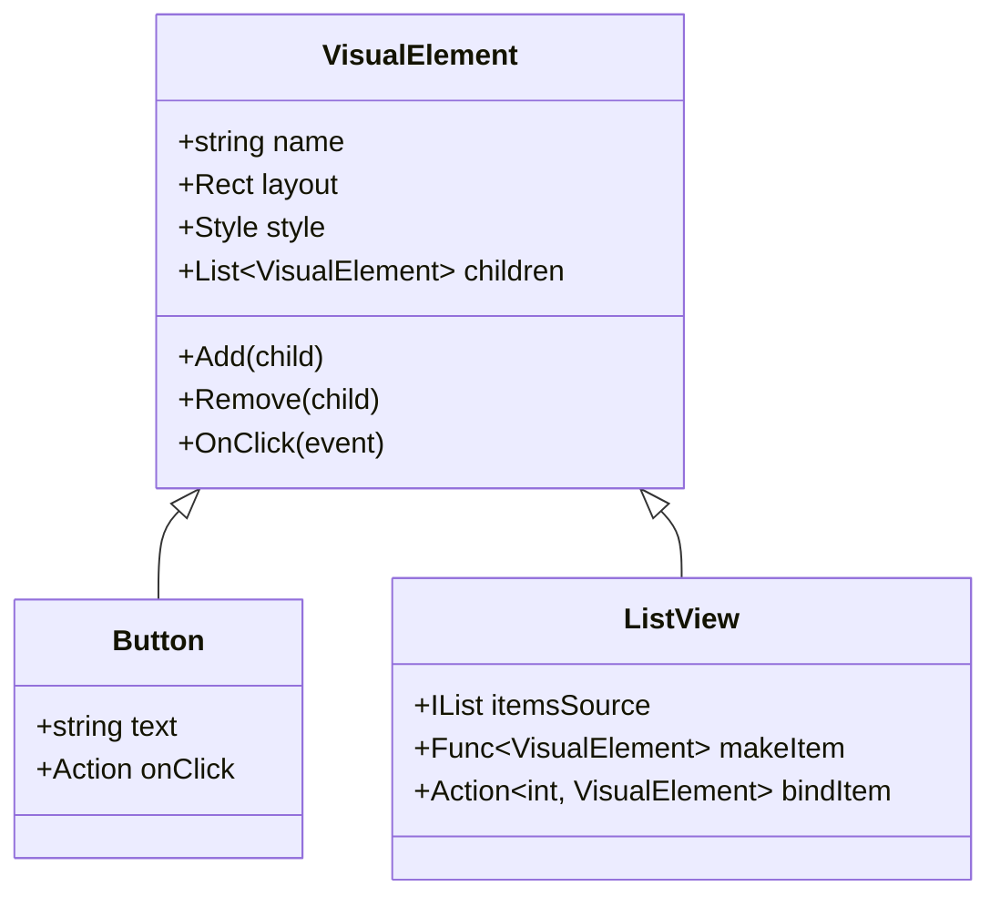
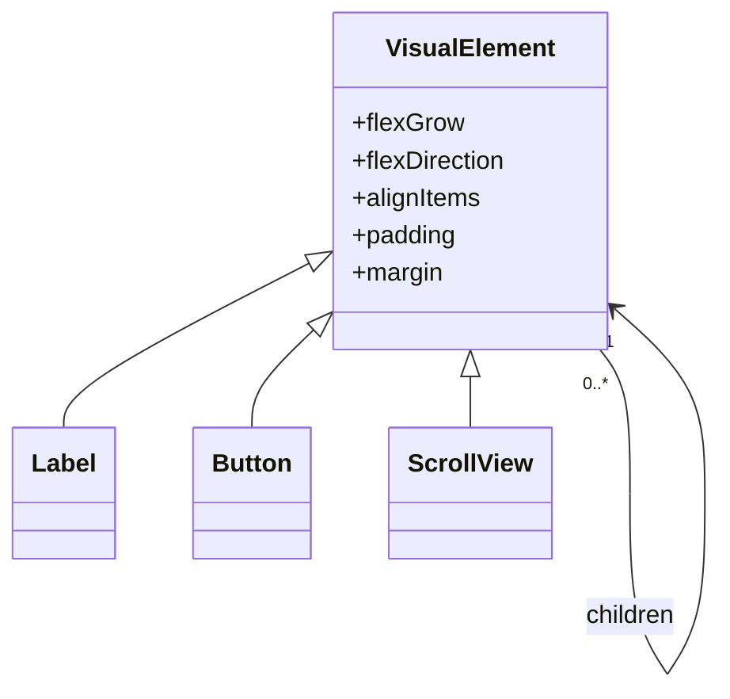
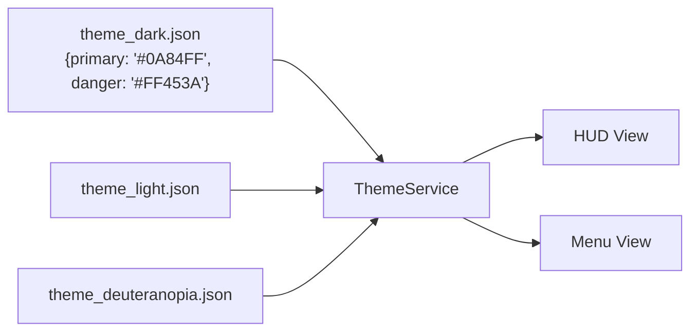

> 所属计划: 游戏架构设计
> 预计耗时: 70min
> 前置知识: [[13-game-state-management|第13章 游戏状态管理]], [[16-gameplay-decoupling|第16章 玩法解耦]]

---

## 1. 概念讲解

### 为什么需要这个？

游戏 UI 是玩家与虚拟世界之间的**所有交互界面**——从血条、小地图、背包网格，到设置菜单、对话框、商店面板。一个 3A  RPG 可能有 200+ 个独立界面，独立游戏也需要响应式 HUD 和可配置的控制方案。UI 架构的选择直接影响：

| 问题 | 架构不当的后果 |
|------|-------------|
| 分辨率从 1080p 切换到 4K 或移动端 | 按钮错位、文字截断、触控目标过小 |
| 添加"色盲模式"或"高对比度" | 需要逐一手动修改数百个控件颜色 |
| 本地化到德语（文本平均长 30%） | 布局崩坏，按钮被撑破 |
| 测试"玩家受到毒伤时血条变绿" | 必须启动完整游戏场景，无法单元测试 |
| 为屏幕阅读器适配 | 控件没有语义信息，辅助技术无法识别 |

UI 架构的核心矛盾是**表达力与可维护性**的权衡：即时模式（IMGUI）写起来快，但难以管理复杂状态；保留模式（Retained Mode）需要维护一棵持久树，但支持动画、数据绑定、无障碍。本章教你根据场景正确选择，并掌握组合策略。

---

### 核心思想

#### 保留模式 vs 即时模式（IMGUI）

**保留模式（Retained Mode）** 维护一棵持久的 UI 对象树。控件是对象，有生命周期，状态保存在树中：



Unity 的 uGUI（`GameObject` + `RectTransform`）、UI Toolkit（`VisualElement`）、Unreal 的 Slate、WPF、Qt 均属此类。事件通过**委托/回调**传播，动画系统可以插值控件的属性。

**即时模式（Immediate Mode GUI, IMGUI）** 每帧由代码即时描述界面，无持久树：

```mermaid
flowchart TD
    A[每帧开始] --> B[ImGui::Begin("HUD")]
    B --> C{ImGui::Button("Attack")?}
    C -->|true| D[执行攻击逻辑]
    C -->|false| E[ImGui::Text("HP: 100")]
    E --> F[ImGui::End]
    F --> G[下一帧重新开始]
```

Dear ImGui、Unity 旧 `OnGUI()` 是典型代表。控件没有对象，其"身份"由**当前窗口 ID + 标签字符串的哈希**隐式决定。`Button("OK")` 返回 `bool` 表示"本帧是否被点击"，不保留状态。

**选择矩阵**：

| 场景 | 推荐模式 | 理由 |
|------|---------|------|
| 调试面板、关卡编辑器、性能分析器 | IMGUI | 快速迭代，代码即布局，无需资源文件 |
| 游戏内 HUD、主菜单、设置面板 | 保留模式 | 需要动画、数据绑定、主题切换、无障碍 |
| 复杂动态列表（背包、技能树） | 保留模式 + 虚拟化 | `ListView` 只渲染可见项，IMGUI 需手动管理滚动状态 |
| 轻量提示条、浮动血条 | IMGUI 或保留模式均可 | 血条数量大时 IMGUI 可能更省（无对象开销），但保留模式更易统一风格 |

---

#### Dear ImGui 核心机制

Dear ImGui 的编程模型是**声明式但无持久化**：

```cpp
// 每帧执行，无对象留存到下一帧
ImGui::Begin("Player HUD");           // 压入窗口ID到栈
ImGui::Text("HP: %d / %d", hp, maxHp); // 生成文本，无返回值
if (ImGui::Button("Heal (50g)")) {    // 返回true仅当本帧被点击
    viewModel.RequestHeal();           // 发送命令，不直接改Model
}
ImGui::End();                          // 弹出窗口ID
```

**控件 ID 生成**：`Button("Heal")` 的 ID 是 `hash(window_id, "Heal")`。若同一窗口有两个 `"Heal"` 按钮，需用 `PushID` 区分：

```cpp
for (auto& item : inventory) {
    ImGui::PushID(item.instanceId);    // 用实例ID区分同名项
    if (ImGui::Button("Equip")) {
        viewModel.Equip(item.id);
    }
    ImGui::PopID();
}
```

**状态存储难题**：`InputText` 需要保留光标位置、选中文本，但 IMGUI 无持久对象。Dear ImGui 通过 `imgui_internal` 的哈希表存储（`GetID` → `ImGuiInputTextState`），但这意味着**状态与标签绑定**，改变标签会丢失状态。因此 IMGUI 不适合：
- 需要复杂动画过渡的 UI
- 多步骤表单（状态易丢失）
- 深度可访问性支持（屏幕阅读器需要稳定控件树）

---

#### 游戏内 MVC/MVVM

[[16-gameplay-decoupling|第16章 玩法解耦]] 介绍了 Command 模式，UI 层是其主要消费者。MVVM 是 MVC 的变体，专为**数据绑定**优化：

```mermaid
classDiagram
    class PlayerHealth {
        +int Current
        +int Max
        +TakeDamage(int)
    }
    class HealthViewModel {
        +float NormalizedHp
        +bool IsCritical
        +ICommand HealCommand
        +PropertyChanged
    }
    class HealthBarView {
        -VisualElement fillElement
        +Bind(ViewModel)
    }
    PlayerHealth --> HealthViewModel : 通知变更
    HealthViewModel --> HealthBarView : 绑定属性
    HealthBarView ..> HealthViewModel : 调用命令
    note right of HealthBarView
        View 不直接引用 PlayerHealth
    end note
```

**关键约束**：
- **Model**（`PlayerHealth`）：纯游戏逻辑，不知晓 UI 存在
- **ViewModel**（`HealthViewModel`）：为 UI 量身裁剪的数据形状，暴露可绑定属性与 `ICommand`
- **View**（`HealthBarView`）：只绑定 ViewModel，不直接调用 `Player.TakeDamage`

这实现了[[04-solid-grasp-pragmatic|第4章]]的**依赖倒置原则**：高层模块（UI）不依赖低层模块（游戏逻辑），二者依赖抽象（ViewModel 接口）。

---

#### UI 组合与层级

现代 UI 采用**自底向上组合**而非继承。Unity UI Toolkit 的 `VisualElement` 树、Web 的 DOM、Flutter 的 Widget 均遵循此模式：



**布局系统**：使用 Flexbox/Yoga/锚点，拒绝绝对坐标。`flex-grow: 1` 让元素填充剩余空间，`min-width: 44dp` 保证触控目标。

**事件传播**：点击按钮时，事件从根节点**隧道**（Tunneling）到目标，再**冒泡**（Bubbling）回根。可在任意层级拦截：

```csharp
// UI Toolkit 示例：在父级统一处理所有按钮音效
root.RegisterCallback<ClickEvent>(evt => {
    AudioService.Play("ui_click");
}, TrickleDown.TrickleDown);  // 隧道阶段捕获
```

**焦点与导航**：手柄/键盘需要显式焦点管理。`FocusController` 追踪当前焦点元素，`NavigationMoveEvent` 响应方向键。输入重绑定界面需临时禁用游戏输入（[[21-input-system|第21章]]的输入上下文切换）。

---

#### 主题与数据驱动

将视觉参数抽离为**主题资源**，实现运行时切换：



**数据驱动菜单结构**：菜单项从 JSON/YAML 加载，支持：
- **本地化**：文本键如 `"MENU_CONTINUE"` 运行时解析为当前语言
- **Mod 扩展**：Mod 添加新的 `MenuEntry` 到 `MainMenu` 的子项列表
- **动态可用性**：根据存档状态灰显"继续游戏"，根据平台隐藏"退出到桌面"（移动端无此概念）

---

#### 无障碍（Accessibility）

游戏 UI 必须对**屏幕阅读器、语音控制、单开关输入**可访问。核心要求：

| 属性 | 说明 | 示例 |
|------|------|------|
| `name` | 控件标签 | "生命值，75%，危险" |
| `role` | 控件类型 | `button`, `progressbar`, `checkbox` |
| `state` | 当前状态 | `selected`, `disabled`, `expanded` |

Unity UI Toolkit 的 `AccessibilityNode`、Microsoft 的 UI Automation、WAI-ARIA 是等效机制。**色盲安全**要求：不单独用颜色传达关键信息。毒伤状态用**绿色闪烁 + 骷髅图标 + 文字"中毒"**，而非仅绿色。

---

## 2. 代码示例

### 示例 A：C# 保留模式 MVVM（.NET 6+ 控制台模拟）

此示例用纯 C# 模拟 MVVM 数据绑定，无需 Unity 引擎。核心展示 `INotifyPropertyChanged` 如何驱动 View 刷新。

```csharp
using System;
using System.Collections.Generic;
using System.ComponentModel;
using System.Runtime.CompilerServices;

// ==================== MODEL ====================
// 纯游戏逻辑，无UI引用
public class PlayerHealth
{
    private int _current;
    private int _max;
    
    public PlayerHealth(int max)
    {
        _max = max;
        _current = max;
    }
    
    public int Current 
    { 
        get => _current;
        private set => _current = Math.Clamp(value, 0, _max);
    }
    
    public int Max => _max;
    
    public void TakeDamage(int amount)
    {
        Current -= amount;
        // 实际游戏中通过事件通知ViewModel
        OnHealthChanged?.Invoke();
    }
    
    public void Heal(int amount)
    {
        Current += amount;
        OnHealthChanged?.Invoke();
    }
    
    public event Action OnHealthChanged;
}

// ==================== VIEWMODEL ====================
// 为UI裁剪的数据形状，实现属性变更通知
public class HealthViewModel : INotifyPropertyChanged
{
    private readonly PlayerHealth _model;
    
    public HealthViewModel(PlayerHealth model)
    {
        _model = model;
        _model.OnHealthChanged += () => {
            // Model变更时，批量通知ViewModel属性刷新
            OnPropertyChanged(nameof(NormalizedHp));
            OnPropertyChanged(nameof(HpText));
            OnPropertyChanged(nameof(IsCritical));
            OnPropertyChanged(nameof(CanHeal));
        };
    }
    
    // 为进度条提供的归一化值 [0,1]
    public float NormalizedHp => _model.Max > 0 
        ? (float)_model.Current / _model.Max 
        : 0f;
    
    // 为文本显示提供的格式化字符串
    public string HpText => $"{_model.Current} / {_model.Max}";
    
    // 为视觉警告提供的布尔值
    public bool IsCritical => NormalizedHp < 0.2f;
    
    // 为按钮可用性提供的布尔值
    public bool CanHeal => _model.Current < _model.Max;
    
    // 命令：View调用此方法，而非直接操作Model
    public void HealCommand()
    {
        if (!CanHeal) return;
        _model.Heal(25); // 实际游戏中通过Command队列
        Console.WriteLine("[ViewModel] HealCommand executed");
    }
    
    // INotifyPropertyChanged 实现
    public event PropertyChangedEventHandler? PropertyChanged;
    
    protected void OnPropertyChanged([CallerMemberName] string? name = null)
        => PropertyChanged?.Invoke(this, new PropertyChangedEventArgs(name));
}

// ==================== VIEW ====================
// 模拟UI控件，订阅ViewModel变更
public class HealthBarView
{
    private readonly HealthViewModel _vm;
    private float _fillWidth;  // 模拟进度条填充宽度
    
    public HealthBarView(HealthViewModel vm)
    {
        _vm = vm;
        _vm.PropertyChanged += OnPropertyChanged;
        Refresh(); // 初始绑定
    }
    
    private void OnPropertyChanged(object? sender, PropertyChangedEventArgs e)
    {
        // 选择性刷新：只处理相关属性
        switch (e.PropertyName)
        {
            case nameof(HealthViewModel.NormalizedHp):
                _fillWidth = _vm.NormalizedHp * 100f; // 假设总宽100
                break;
            case nameof(HealthViewModel.IsCritical):
                // 切换颜色等
                break;
        }
        Refresh();
    }
    
    public void Refresh()
    {
        // 模拟渲染：控制台输出当前状态
        var bar = new string('#', (int)_fillWidth);
        var empty = new string('-', 100 - (int)_fillWidth);
        var color = _vm.IsCritical ? "\u001b[31m" : "\u001b[32m"; // ANSI颜色
        var reset = "\u001b[0m";
        
        Console.WriteLine($"{color}[{bar}{empty}]{reset} {_vm.HpText}");
        Console.WriteLine($"Critical: {_vm.IsCritical}, CanHeal: {_vm.CanHeal}");
    }
    
    // 模拟用户点击"治疗"按钮
    public void SimulateHealButtonClick()
    {
        Console.WriteLine("[View] Heal button clicked");
        _vm.HealCommand(); // 调用命令，不直接修改Model
    }
}

// ==================== 运行 ====================
public class Program
{
    public static void Main()
    {
        var model = new PlayerHealth(100);
        var vm = new HealthViewModel(model);
        var view = new HealthBarView(vm);
        
        Console.WriteLine("=== Initial State ===");
        // 已自动刷新
        
        Console.WriteLine("\n=== Take 30 Damage ===");
        model.TakeDamage(30);  // Model变更 → ViewModel通知 → View刷新
        
        Console.WriteLine("\n=== Take 50 More Damage (Critical) ===");
        model.TakeDamage(50);
        
        Console.WriteLine("\n=== Click Heal Button ===");
        view.SimulateHealButtonClick();
        
        Console.WriteLine("\n=== Click Heal Again (Should be no-op) ===");
        view.SimulateHealButtonClick();
    }
}
```

**运行方式:**

```bash
# .NET 8 SDK 已安装
dotnet new console -n MvvmHealthBar
# 将上述代码写入 Program.cs
dotnet run
```

**预期输出:**

```text
=== Initial State ===
[####################################################################################################] 100 / 100
Critical: False, CanHeal: False

=== Take 30 Damage ===
[##########################################################################################----------] 70 / 100
Critical: False, CanHeal: True

=== Take 50 More Damage (Critical) ===
[##################----------------------------------------------------------------------------------] 20 / 100
Critical: True, CanHeal: True

=== Click Heal Button ===
[View] Heal button clicked
[ViewModel] HealCommand executed
[##############################################------------------------------------------------------] 45 / 100
Critical: False, CanHeal: True

=== Click Heal Again (Should be no-op) ===
[View] Heal button clicked
[##############################################------------------------------------------------------] 45 / 100
Critical: False, CanHeal: True
```

---

### 示例 B：C++ Dear ImGui 即时模式 HUD

此示例展示 IMGUI 的核心编程模型。假设已集成 Dear ImGui（`imgui.h` + 后端渲染器）。

```cpp
#include "imgui.h"
#include <vector>
#include <string>

// ==================== MODEL ====================
struct PlayerStats {
    int hp = 100;
    int maxHp = 100;
    int gold = 500;
};

struct InventoryItem {
    int id;
    std::string name;
    bool equipped;
};

// ==================== VIEWMODEL ====================
// 即使IMGUI无持久树，仍应隔离命令逻辑
class HudViewModel {
public:
    PlayerStats& stats;
    std::vector<InventoryItem>& inventory;
    
    HudViewModel(PlayerStats& s, std::vector<InventoryItem>& inv) 
        : stats(s), inventory(inv) {}
    
    void RequestHeal() {
        if (stats.gold >= 50 && stats.hp < stats.maxHp) {
            stats.gold -= 50;
            stats.hp = std::min(stats.hp + 25, stats.maxHp);
        }
    }
    
    void RequestEquip(int itemId) {
        for (auto& item : inventory) {
            if (item.id == itemId) {
                item.equipped = !item.equipped; // 切换装备状态
                break;
            }
        }
    }
};

// ==================== IMGUI 渲染 ====================
void UpdateUI(HudViewModel& vm) {
    // 主HUD窗口
    ImGui::Begin("Player HUD", nullptr, ImGuiWindowFlags_NoCollapse);
    
    // 血量显示：文本 + 进度条
    ImGui::Text("HP: %d / %d", vm.stats.hp, vm.stats.maxHp);
    float hpRatio = (float)vm.stats.hp / vm.stats.maxHp;
    ImVec4 hpColor = hpRatio < 0.2f ? 
        ImVec4(1.0f, 0.0f, 0.0f, 1.0f) :  // 红色：危险
        ImVec4(0.0f, 1.0f, 0.0f, 1.0f);   // 绿色：正常
    
    ImGui::PushStyleColor(ImGuiCol_PlotHistogram, hpColor);
    ImGui::ProgressBar(hpRatio, ImVec2(-1, 0), "");
    ImGui::PopStyleColor();
    
    // 金币与治疗按钮
    ImGui::Text("Gold: %d", vm.stats.gold);
    bool canHeal = vm.stats.gold >= 50 && vm.stats.hp < vm.stats.maxHp;
    if (!canHeal) ImGui::BeginDisabled();
    
    if (ImGui::Button("Heal (50g)")) {
        vm.RequestHeal();  // 发送命令，不直接改stats
    }
    if (!canHeal) ImGui::EndDisabled();
    
    ImGui::Separator();
    
    // 装备列表：使用PushID避免控件ID冲突
    ImGui::Text("Inventory:");
    if (ImGui::BeginListBox("##inventory", ImVec2(-1, 150))) {
        for (auto& item : vm.inventory) {
            ImGui::PushID(item.id);  // 关键：区分同名物品
            
            // Selectable返回true当本帧被选中
            bool isSelected = item.equipped;
            if (ImGui::Selectable(item.name.c_str(), &isSelected, 
                                  ImGuiSelectableFlags_SpanAllColumns)) {
                vm.RequestEquip(item.id);  // 发送装备命令
            }
            
            // 装备状态指示：不能只用颜色！
            if (item.equipped) {
                ImGui::SameLine();
                ImGui::TextColored(ImVec4(0,1,1,1), "[EQUIPPED]");
                // 色盲辅助：图标+文字，非仅颜色
                ImGui::SameLine();
                ImGui::Text(" (Active)");
            }
            
            ImGui::PopID();
        }
        ImGui::EndListBox();
    }
    
    ImGui::End();
}

// ==================== 模拟游戏循环调用 ====================
// 实际项目中由引擎每帧调用
void MockGameLoop() {
    PlayerStats stats;
    std::vector<InventoryItem> inventory = {
        {101, "Iron Sword", false},
        {102, "Iron Sword", false},  // 同名不同实例！
        {203, "Health Potion", false},
    };
    HudViewModel vm(stats, inventory);
    
    // 模拟3帧
    for (int frame = 0; frame < 3; frame++) {
        // 模拟输入处理...
        // 模拟ImGui::NewFrame()...
        UpdateUI(vm);
        // 模拟ImGui::Render()...
        
        // 模拟伤害事件
        if (frame == 1) stats.hp -= 80;
    }
}
```

**运行方式:**

```bash
# 需先集成 Dear ImGui 到项目
# 参考: https://github.com/ocornut/imgui/blob/master/docs/BACKENDS.md
# 典型集成：imgui.cpp + imgui_impl_glfw.cpp + imgui_impl_opengl3.cpp

# 或使用示例框架
git clone https://github.com/ocornut/imgui.git
cd imgui/examples/example_glfw_opengl3
# 按平台编译（CMake/Makefile/VS项目）
```

**预期输出:**

```text
[ImGui 渲染帧 1]
┌─ Player HUD ─────────────┐
│ HP: 100 / 100            │
│ [████████████████████]   │
│ Gold: 500                │
│ [Heal (50g)]             │  <- 按钮可点击
│ ------------------------ │
│ Inventory:               │
│ ▶ Iron Sword             │
│   Iron Sword             │
│   Health Potion          │
└──────────────────────────┘

[ImGui 渲染帧 2]  // 受到伤害后
┌─ Player HUD ─────────────┐
│ HP: 20 / 100             │
│ [████----------------]   │  <- 红色进度条
│ Gold: 500                │
│ [Heal (50g)]             │  <- 仍可点击
│ ------------------------ │
│ Inventory:               │
│   Iron Sword             │
│ ▶ Iron Sword [EQUIPPED] (Active)  <- 点击后
│   Health Potion          │
└──────────────────────────┘
```

---

## 3. 练习

### 练习 1: 基础

用 MVVM 实现一个完整血量条：Model 是 `PlayerHealth { Current, Max }`，ViewModel 暴露 `NormalizedHp`（`float`，范围 `[0,1]`），View 只绑定该属性并在控制台用 ASCII 渲染进度条。

要求：
- `NormalizedHp` 实现为计算属性，触发 `PropertyChanged`
- View 禁止直接修改 `Current` 或 `Max`
- 添加 `IsLowHealth`（`< 30%`）属性，View 用不同颜色渲染

---

### 练习 2: 进阶

在 Dear ImGui 中实现一个可滚动的物品列表（20+ 项），支持：
- 点击物品触发 `EquipCommand(int itemId)`
- 使用 `ImGui::PushID` 确保同名物品不冲突
- 已装备物品显示 `[EQUIPPED]` 标记（文字+颜色，非仅颜色）
- 列表超出区域时自动显示滚动条

---

### 练习 3: 挑战（可选）

设计一个运行时主题切换系统，支持：
- 浅色/深色主题切换
- 色盲安全模式（至少支持红绿色盲 Deuteranopia）
- 主题切换时所有已打开界面自动刷新样式

---

## 3.5 参考答案

> [!tip]- 练习 1 参考答案
> 
> ```csharp
> using System;
> using System.ComponentModel;
> using System.Runtime.CompilerServices;
> 
> public class PlayerHealth
> {
>     public int Current { get; set; } = 75;
>     public int Max { get; set; } = 100;
> }
> 
> public class HealthViewModel : INotifyPropertyChanged
> {
>     private readonly PlayerHealth _model;
>     
>     public HealthViewModel(PlayerHealth model) => _model = model;
>     
>     // 计算属性：每次访问实时计算，但变更由外部通知驱动
>     public float NormalizedHp => _model.Max > 0 
>         ? (float)_model.Current / _model.Max 
>         : 0f;
>     
>     public bool IsLowHealth => NormalizedHp < 0.3f;
>     
>     // 模拟外部触发（实际由Model事件驱动）
>     public void Refresh() => OnPropertyChanged(nameof(NormalizedHp));
>     
>     public event PropertyChangedEventHandler? PropertyChanged;
>     protected void OnPropertyChanged([CallerMemberName] string? name = null)
>         => PropertyChanged?.Invoke(this, new PropertyChangedEventArgs(name));
> }
> 
> public class HealthBarView
> {
>     private readonly HealthViewModel _vm;
>     
>     public HealthBarView(HealthViewModel vm)
>     {
>         _vm = vm;
>         _vm.PropertyChanged += (s, e) => {
>             if (e.PropertyName == nameof(HealthViewModel.NormalizedHp))
>                 Render();
>         };
>     }
>     
>     public void Render()
>     {
>         int filled = (int)(_vm.NormalizedHp * 20); // 20字符宽
>         var bar = new string('█', filled).PadRight(20, '░');
>         var color = _vm.IsLowHealth ? "\u001b[33m" : "\u001b[32m"; // 黄/绿
>         Console.WriteLine($"{color}[{bar}] {_vm.NormalizedHp:P0}\u001b[0m");
>     }
> }
> 
> // 测试：View无法直接修改Current，必须通过ViewModel或Model
> var model = new PlayerHealth();
> var vm = new HealthViewModel(model);
> var view = new HealthBarView(vm);
> view.Render(); // 初始 75%
> model.Current = 20; vm.Refresh(); // 模拟伤害，触发刷新
> // 错误做法（编译错误，View无Current访问权限）：
> // view.Current = 50; 
> ```
> 
> 关键：View 的 `Render()` 只读取 `NormalizedHp`，不持有 `PlayerHealth` 引用。颜色选择避开红/绿对比（色盲友好：用亮度差异 + 黄色警告）。

> [!tip]- 练习 2 参考答案
> 
> ```cpp
> #include "imgui.h"
> #include <vector>
> #include <string>
> 
> struct Item { int id; std::string name; bool equipped; };
> 
> class InventoryViewModel {
> public:
>     std::vector<Item> items;
>     void EquipCommand(int itemId) {
>         for (auto& item : items) {
>             if (item.id == itemId) item.equipped = !item.equipped;
>         }
>     }
> };
> 
> void RenderInventory(InventoryViewModel& vm) {
>     ImGui::Begin("Inventory");
>     
>     // 固定高度列表框，自动滚动
>     if (ImGui::BeginListBox("##items", ImVec2(-1, 200))) {
>         for (auto& item : vm.items) {
>             // PushID 是核心：item.id 必须唯一且稳定
>             ImGui::PushID(item.id);
>             
>             // 构建显示标签：包含状态文字，非仅颜色
>             std::string label = item.name;
>             if (item.equipped) label += " [EQUIPPED] ✓";
>             
>             // Selectable 返回 true 当本帧被点击
>             bool selected = item.equipped;
>             if (ImGui::Selectable(label.c_str(), &selected, 
>                                   ImGuiSelectableFlags_SpanAllColumns)) {
>                 vm.EquipCommand(item.id);  // 发送命令
>             }
>             
>             // 辅助颜色：增强但不替代文字
>             if (item.equipped) {
>                 ImGui::SameLine();
>                 ImGui::TextColored(ImVec4(0,1,1,1), "ACTIVE");
>             }
>             
>             ImGui::PopID();  // 必须匹配 PushID
>         }
>         ImGui::EndListBox();
>     }
>     ImGui::End();
> }
> 
> // 测试：生成20+项验证滚动
> void Test() {
>     InventoryViewModel vm;
>     for (int i = 0; i < 25; i++) {
>         vm.items.push_back({1000 + i, "Item " + std::to_string(i), false});
>     }
>     // 模拟帧循环调用 RenderInventory(vm)
> }
> ```
> 
> 关键陷阱：若忘记 `PushID`，同名物品共享 ID 导致点击状态错乱。`item.id` 必须是持久稳定的全局 ID，非数组索引（删除后索引变化会破坏 ID）。

> [!tip]- 练习 3 参考答案
> 
> ```csharp
> // 主题调色板：所有颜色集中定义
> public class ThemePalette
> {
>     public Color Primary { get; set; }
>     public Color Danger { get; set; }   // 危险/警告
>     public Color Success { get; set; }  // 成功/治疗
>     public Color Background { get; set; }
>     public Color Text { get; set; }
>     
>     // 色盲安全预设：避免红绿对比
>     public static ThemePalette Dark => new() {
>         Primary = Color.FromRgb(10, 132, 255),      // 蓝
>         Danger = Color.FromRgb(255, 69, 58),       // 红（但用形状/文字辅助）
>         Success = Color.FromRgb(48, 209, 88),      // 绿（色盲模式替换为蓝）
>         Background = Color.FromRgb(0, 0, 0),
>         Text = Color.FromRgb(255, 255, 255)
>     };
>     
>     public static ThemePalette Deuteranopia => new() {
>         Primary = Color.FromRgb(10, 132, 255),      // 蓝（色盲可见）
>         Danger = Color.FromRgb(255, 193, 7),         // 琥珀色替代红
>         Success = Color.FromRgb(0, 150, 199),        // 蓝替代绿
>         Background = Color.FromRgb(0, 0, 0),
>         Text = Color.FromRgb(255, 255, 255)
>     };
> }
> 
> // 主题服务：全局可访问，支持切换通知
> public class ThemeService : INotifyPropertyChanged
> {
>     private ThemePalette _current = ThemePalette.Dark;
>     public ThemePalette Current 
>     { 
>         get => _current;
>         set { _current = value; OnPropertyChanged(nameof(Current)); }
>     }
>     
>     public void CycleTheme() => Current = Current == ThemePalette.Dark 
>         ? ThemePalette.Deuteranopia 
>         : ThemePalette.Dark;
>     
>     public event PropertyChangedEventHandler? PropertyChanged;
>     protected void OnPropertyChanged([CallerMemberName] string? name = null)
>         => PropertyChanged?.Invoke(this, new PropertyChangedEventArgs(name));
> }
> 
> // View 基类：自动订阅主题变更
> public abstract class ThemedView
> {
>     protected readonly ThemeService _theme;
>     
>     protected ThemedView(ThemeService theme)
>     {
>         _theme = theme;
>         _theme.PropertyChanged += (s, e) => {
>             if (e.PropertyName == nameof(ThemeService.Current))
>                 ApplyTheme();
>         };
>     }
>     
>     public abstract void ApplyTheme();
> }
> 
> // 具体 View：血量条应用主题
> public class ThemedHealthBar : ThemedView
> {
>     // 视觉元素引用
>     private readonly VisualElement _fillElement;  // 假设UI Toolkit
>     private readonly Label _statusLabel;
>     
>     public ThemedHealthBar(ThemeService theme, VisualElement fill, Label label) 
>         : base(theme) 
>     {
>         _fillElement = fill;
>         _statusLabel = label;
>         ApplyTheme(); // 初始应用
>     }
>     
>     public override void ApplyTheme()
>     {
>         var p = _theme.Current;
>         // 色盲安全：危险状态不用仅颜色，还用图标/文字
>         _fillElement.style.backgroundColor = p.Danger; // 但标签显示"CRITICAL"
>         _statusLabel.style.color = p.Text;
>         _statusLabel.text = "♦ CRITICAL ♦"; // 菱形辅助符号
>     }
> }
> ```
> 
> 架构要点：
> 1. **颜色集中**：禁止任何控件硬编码 `Color.Red`
> 2. **语义命名**：`Danger` 而非 `Red`，允许色盲模式映射到琥珀色
> 3. **形状+文字**：`♦ CRITICAL ♦` 不依赖颜色识别
> 4. **自动刷新**：`ThemeService` 变更 → 所有 `ThemedView` 自动 `ApplyTheme`

> [!note] 答案使用方式
> 如果你的实现通过了测试或达到了题目要求，就是正确的。参考答案展示的是典型实现路径，你可以用不同的语言、框架或设计模式达到相同目标。重点关注：练习1 的 View-Model 隔离、练习2 的 `PushID` 正确使用、练习3 的色盲安全策略（非仅颜色）。
>
> ---

## 4. 扩展阅读

- Dear ImGui 官方 GitHub 与文档：https://github.com/ocornut/imgui
- Dear ImGui 交互式演示与代码示例（imgui_demo.cpp）：https://github.com/ocornut/imgui/blob/master/imgui_demo.cpp
- Unity UI Toolkit 与 uGUI/IMGUI 系统对比：https://docs.unity3d.com/2023.1/Documentation/Manual/UI-system-compare.html
- 保留模式与即时模式 GUI 架构深度对比：https://collquinn.gitlab.io/portfolio/my-article.html
- Microsoft UI Automation 无障碍规范：https://learn.microsoft.com/en-us/windows/win32/winauto/entry-uiauto-win32
- WAI-ARIA 无障碍实践（Web 游戏参考）：https://www.w3.org/WAI/ARIA/apg/
- 色盲安全设计指南（Game Accessibility Guidelines）：https://gameaccessibilityguidelines.com/

---

## 常见陷阱

- **在 IMGUI 中保存控件状态到局部变量，下一帧丢失输入焦点与编辑内容**。Dear ImGui 的 `InputText` 状态存储在内部哈希表（`GetID` 索引），若标签动态变化（如 `InputText("HP: " + hp)`），ID 改变导致状态丢失。正确做法：使用 `##hidden_id` 分离显示标签与 ID，或改用保留模式管理复杂表单状态。

- **View 直接调用 `Player.TakeDamage` 等游戏逻辑，导致 UI 代码与玩法强耦合、难以单元测试**。正确做法：View 只调用 ViewModel 的 `ICommand` 或发送 `Command` 到队列（[[17-command-ability-system|第17章]]），ViewModel 通过事件/委托与 Model 交互。单元测试可单独实例化 ViewModel，用 Mock Model 验证绑定逻辑。

- **绝对坐标/硬编码像素布局导致不同分辨率、本地化文本长度变化时 UI 错位**。正确做法：使用 Flexbox/Yoga 等比例布局系统，设置 `min-width`、`max-width` 约束，用 `em` 或 `dp` 单位替代像素。本地化测试时强制德语/俄语文本验证布局弹性。