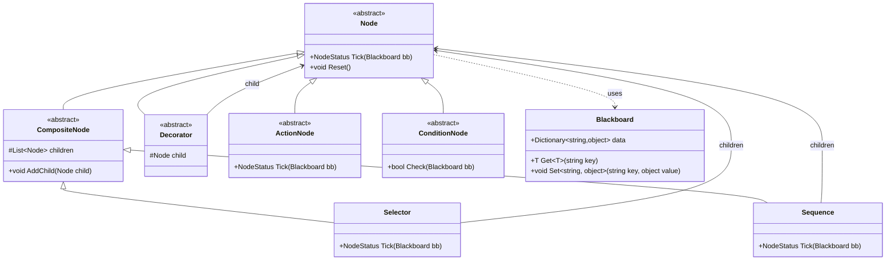
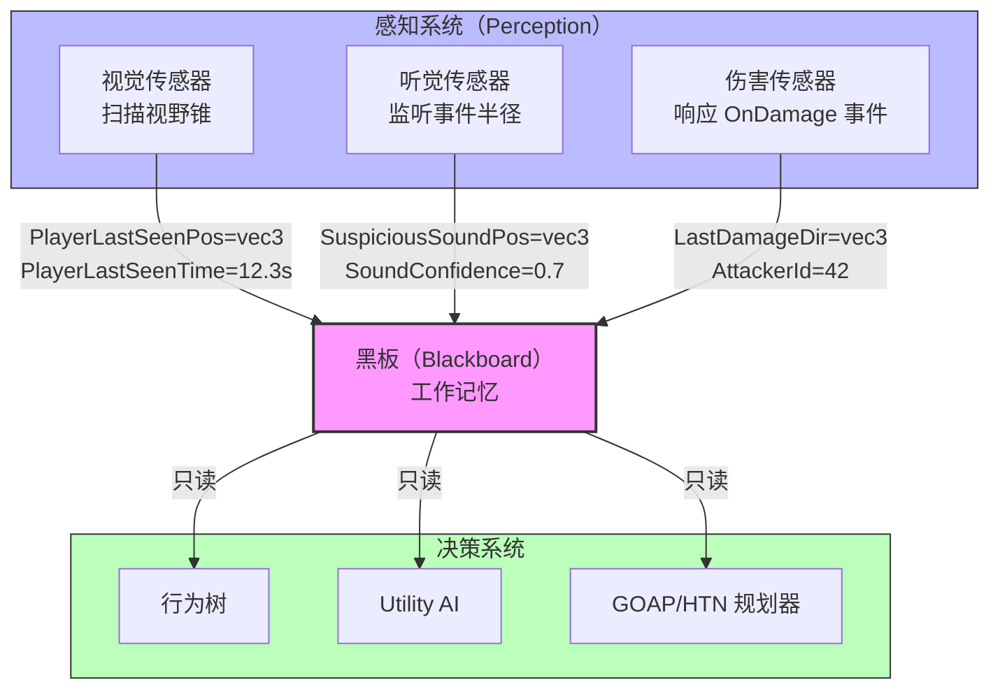

# AI 架构

> 所属计划: 游戏架构设计
> 预计耗时: 90min
> 前置知识: [[13-game-state-management|第13章 游戏状态管理]]

---

## 1. 概念讲解

### 为什么需要这个？

游戏 AI 不是"越聪明越好"，而是**"在正确的时间做出可信的决策"**。一个守卫 NPC 需要在巡逻时发现玩家、追击、攻击、呼叫援军、在失去目标后返回岗位——这些行为之间的切换如果硬编码，很快会变成意大利面条式的 `if-else` 地狱。

更深层的问题是**组合爆炸**：假设有 5 种目标（玩家、队友、道具、掩体、兴趣点）× 4 种状态（健康、受伤、濒死、死亡）× 3 种环境（开阔地、掩体后、室内），传统的状态枚举会产生 60 种"状态"，而状态之间的转移边可能达到数百条。我们需要**分层、模块化、可组合的决策架构**来驯服这种复杂性。

AI 架构的选择直接影响：
- **开发效率**：能否可视化调试、快速迭代设计师想法
- **运行时性能**：每帧决策耗时是否在预算内（通常 <1ms  per agent）
- **可扩展性**：新增行为是否需要修改现有代码
- **可预测性**：AI 是否表现稳定、可测试

### 核心思想

#### HFSM（分层有限状态机）

有限状态机（FSM）是最基础的 AI 模型：状态 + 转移条件。但当状态增多时，转移线呈 O(n²) 增长。**HFSM 通过层级封装解决状态爆炸**：

```
[Combat] 父状态（处理通用逻辑：寻找掩体、低血量撤退）
├── [MeleeAttack] 子状态
├── [RangedAttack] 子状态
└── [TakeCover] 子状态

[Idle] 父状态
├── [Patrol] 子状态
└── [GuardPost] 子状态
```

**关键机制**：
- **行为继承**：子状态自动获得父状态的更新逻辑（如 `Combat` 父状态每帧检查血量）
- **中断返回**：子状态可被外部事件强制退出，回到父状态或切换到其他父状态
- **转移局部化**：同一父状态下的子状态间转移，不需要与其他父状态建立连接

适合：角色动画状态机、简单 NPC（<10 种行为模式）、需要严格状态约束的系统（如"只有在 Combat 下才能攻击"）。

#### 行为树（Behavior Tree）

行为树将决策建模为**树形结构的任务执行**，而非状态转移。核心节点类型：

| 节点类型 | 职责 | 返回 |
|---------|------|------|
| `Selector` | 顺序执行子节点，直到一个返回 `Success` | `Success`/`Failure`/`Running` |
| `Sequence` | 顺序执行子节点，直到一个返回 `Failure` | `Success`/`Failure`/`Running` |
| `Decorator` | 包装单个子节点，添加控制逻辑（如 `Loop`、`Inverter`、`Cooldown`） | 依包装而定 |
| `Action` | 叶子节点，执行具体行为 | `Success`/`Failure`/`Running` |
| `Condition` | 叶子节点，检查世界状态（无副作用） | `Success`/`Failure` |

**Tick 机制**：行为树每帧从根节点 `Tick()`，节点返回 `Running` 表示"下帧继续"。这是行为树与经典"状态机"的本质区别——**没有持久状态，只有当前执行点**。

**黑板（Blackboard）**：解耦数据存储与决策逻辑。感知系统写入 `PlayerLastSeenPos`、`ThreatLevel`，行为树节点只读取。这让同一棵树可复用于不同 NPC（数据不同，结构相同）。



适合：战术/战斗 AI、需要可视化编辑的复杂行为、追求"可中断-恢复"的任务结构。

#### Utility AI

当行为树的分支结构无法表达"程度差异"时使用 Utility AI。核心思想：**把决策转化为评分问题**。

每个候选动作有一组 `Consideration`（考量因素），每个考量把黑板数据通过 **response curve** 映射到 [0,1]：

```
Score(AttackWithRifle) = 
  0.4 * DistanceCurve(distance)  // 远距离优势
+ 0.3 * AmmoCurve(ammoRatio)     // 弹药充足
+ 0.3 * CoverCurve(nearbyCover)  // 有掩体配合

Score(ChargeWithMelee) =
  0.6 * DistanceCurve(distance)  // 近距离优势
+ 0.2 * HealthCurve(selfHealth)  // 自身健康
+ 0.2 * EnemyHealthCurve(targetHealth)  // 敌人虚弱
```

**Response Curve 类型**：
- 线性：`y = x`
- 反线性：`y = 1 - x`
- Sigmoid：`y = 1 / (1 + e^(-k(x-x0)))`（平滑阈值）
- 阶梯：`y = x > threshold ? 1 : 0`

**关键优势**：动作间是**竞争关系**而非**硬编码优先级**， emergent 行为自然产生（如"低弹药时自动切换武器"无需显式规则）。

适合：开放世界 NPC 日常决策、动态策略选择、需要"模糊决策"的社交/经济 AI。

#### GOAP（Goal-Oriented Action Planning）

GOAP 让 AI **自主组合动作序列实现目标**。源自 STRIPS 规划器，核心元素：

| 元素 | 说明 |
|-----|------|
| `WorldState` | 布尔/数值事实的集合（`HasSword=true`, `AtLocation=Kitchen`） |
| `Action` | 有 `Preconditions`（执行前必须为真）、`Effects`（执行后变为真）、`Cost` |
| `Goal` | 目标世界状态（`IsEnemyDead=true`） |
| `Planner` | 搜索算法（通常 A*），从当前状态到目标状态的最低成本路径 |

**后向规划**：从目标出发，找能使目标成立的 Action，再递归满足该 Action 的 Preconditions，直到与当前世界状态衔接。

```
目标: IsFireExtinguished = true
  ← 需要: PourWater [pre: HasBucket, NearFire]
    ← 需要: PickupBucket [pre: NearBucket, effect: HasBucket]
      ← 当前状态: AtRoomA, FireAtRoomA, BucketAtRoomB
    ← 需要: MoveTo(RoomA) [pre: none, effect: AtRoomA]
      ← 当前状态已满足
```

适合：需要自主计划、涌现式解谜的 AI（如 F.E.A.R. 的敌人会翻桌子找掩体、推门包抄）。

#### HTN（Hierarchical Task Network）

HTN 是 GOAP 的"结构化"替代，用**任务分解**替代"状态搜索"：

| 元素 | 说明 |
|-----|------|
| `Primitive Task` | 可直接执行的原子动作（如 `MoveTo`, `PlayAnimation`） |
| `Compound Task` | 需分解为子任务的复合任务 |
| `Method` | 复合任务的分解方案，带 `Preconditions` |
| `Decomposition` | 递归将复合任务展开为原始任务序列 |

```
Compound: AttackEnemy
├── Method 1: [pre: HasRifle, pre: Ammo>0]
│   └── Sequence: [AimRifle, ShootRifle, ReloadIfNeeded]
├── Method 2: [pre: HasMeleeWeapon, pre: Distance<2]
│   └── Sequence: [MoveToMeleeRange, PlayAttackAnim]
└── Method 3: [pre: true]  // fallback
    └── Sequence: [FindWeapon, AttackEnemy]  // 递归！
```

HTN 比 GOAP 更易表达**层级策略**（"先尝试最优方案，不行再降级"）和**时序约束**（"必须在 X 之前做 Y"），但牺牲了一些自主性——分解结构由设计师预设。

适合：RTS 单位 AI、需要严格战术层级（班组→小队→个体）的复杂系统。

#### 黑板与感知系统



**黑板设计原则**：
- **写入单一**：只有感知系统修改感知数据，避免决策系统"幻觉"
- **时间戳关键**：`PlayerLastSeenTime` 比 `PlayerLastSeenPos` 更重要——决策系统据此判断"追击还是放弃"
- ** freshness 衰减**：长期未更新的条目自动降低置信度

#### 选型决策树

```
决策需求分析
├── 行为数量 < 10，转移明确，需要严格状态约束
│   └── → HFSM
├── 需要可视化编辑，行为可中断/恢复，战术结构化
│   └── → 行为树
├── 决策基于"程度"而非"是否"，需要涌现式选择
│   └── → Utility AI
├── 需要 AI 自主组合动作实现目标，解空间开放
│   └── → GOAP
└── 复杂层级策略，时序约束严格，RTS/战术层级
    └── → HTN
```

**混合架构**是常态：顶层用 Utility AI 选择"当前目标"（战斗/巡逻/社交），中层用行为树执行目标下的战术，底层用 HFSM 驱动动画状态。

---

## 2. 代码示例

### 示例 A：行为树核心实现

```csharp
// 文件: BehaviorTreeDemo.cs
// 运行环境: .NET 6+ 控制台
// 说明: 实现行为树核心节点 + 具体游戏逻辑，展示 Running 状态恢复

using System;
using System.Collections.Generic;

// ========== 基础枚举与黑板 ==========

public enum NodeStatus { Success, Failure, Running }

public class Blackboard
{
    private readonly Dictionary<string, object> _data = new();
    private readonly Dictionary<string, double> _timestamps = new();
    
    public void Set<T>(string key, T value)
    {
        _data[key] = value;
        _timestamps[key] = DateTime.Now.TimeOfDay.TotalSeconds;
    }
    
    public T Get<T>(string key, T defaultValue = default)
    {
        return _data.TryGetValue(key, out var val) ? (T)val : defaultValue;
    }
    
    // 获取数据新鲜度（秒），用于判断感知是否过期
    public double GetFreshness(string key)
    {
        if (!_timestamps.TryGetValue(key, out var ts)) return double.MaxValue;
        return DateTime.Now.TimeOfDay.TotalSeconds - ts;
    }
}

// ========== 节点基类 ==========

public abstract class Node
{
    // 当前运行中的子节点索引（用于恢复）
    protected int _runningChildIndex = -1;
    
    public abstract NodeStatus Tick(Blackboard bb);
    
    public virtual void Reset()
    {
        _runningChildIndex = -1;
    }
    
    // 中断当前运行（用于外部事件，如被攻击强制切换行为）
    public void Abort()
    {
        if (_runningChildIndex >= 0)
        {
            OnAbort();
            Reset();
        }
    }
    
    protected virtual void OnAbort() { }
}

// ========== 复合节点 ==========

public abstract class CompositeNode : Node
{
    protected readonly List<Node> Children = new();
    
    public void AddChild(Node child) => Children.Add(child);
    
    public override void Reset()
    {
        base.Reset();
        foreach (var child in Children) child.Reset();
    }
}

// Selector: 顺序执行，直到一个 Success（"或"逻辑）
public class Selector : CompositeNode
{
    public override NodeStatus Tick(Blackboard bb)
    {
        // 从上次 Running 的位置恢复，或从头开始
        int startIndex = _runningChildIndex >= 0 ? _runningChildIndex : 0;
        _runningChildIndex = -1; // 先清除，如果本次又 Running 会重新设置
        
        for (int i = startIndex; i < Children.Count; i++)
        {
            var status = Children[i].Tick(bb);
            
            switch (status)
            {
                case NodeStatus.Success:
                    // 成功：重置所有已尝试的子节点，返回成功
                    for (int j = startIndex; j <= i; j++) Children[j].Reset();
                    return NodeStatus.Success;
                    
                case NodeStatus.Running:
                    // 记录运行位置，下帧恢复
                    _runningChildIndex = i;
                    return NodeStatus.Running;
                    
                case NodeStatus.Failure:
                    // 继续尝试下一个
                    continue;
            }
        }
        
        // 全部失败
        for (int j = startIndex; j < Children.Count; j++) Children[j].Reset();
        return NodeStatus.Failure;
    }
    
    protected override void OnAbort()
    {
        if (_runningChildIndex >= 0 && _runningChildIndex < Children.Count)
        {
            Children[_runningChildIndex].Abort();
        }
    }
}

// Sequence: 顺序执行，直到一个 Failure（"与"逻辑）
public class Sequence : CompositeNode
{
    public override NodeStatus Tick(Blackboard bb)
    {
        int startIndex = _runningChildIndex >= 0 ? _runningChildIndex : 0;
        _runningChildIndex = -1;
        
        for (int i = startIndex; i < Children.Count; i++)
        {
            var status = Children[i].Tick(bb);
            
            switch (status)
            {
                case NodeStatus.Success:
                    // 继续下一个
                    continue;
                    
                case NodeStatus.Running:
                    _runningChildIndex = i;
                    return NodeStatus.Running;
                    
                case NodeStatus.Failure:
                    // 失败：重置所有已执行的子节点
                    for (int j = startIndex; j <= i; j++) Children[j].Reset();
                    return NodeStatus.Failure;
            }
        }
        
        // 全部成功
        for (int j = startIndex; j < Children.Count; j++) Children[j].Reset();
        return NodeStatus.Success;
    }
}

// ========== 装饰器：Inverter ==========

public class Inverter : Node
{
    private readonly Node _child;
    
    public Inverter(Node child) => _child = child;
    
    public override NodeStatus Tick(Blackboard bb)
    {
        var status = _child.Tick(bb);
        return status switch
        {
            NodeStatus.Success => NodeStatus.Failure,
            NodeStatus.Failure => NodeStatus.Success,
            NodeStatus.Running => NodeStatus.Running,
            _ => throw new ArgumentOutOfRangeException()
        };
    }
    
    public override void Reset() => _child.Reset();
}

// ========== 具体游戏节点 ==========

public class ConditionCanSeePlayer : Node
{
    private readonly float _maxDistance;
    private readonly float _maxFreshness; // 感知最大有效时间（秒）
    
    public ConditionCanSeePlayer(float maxDistance = 15f, float maxFreshness = 3f)
    {
        _maxDistance = maxDistance;
        _maxFreshness = maxFreshness;
    }
    
    public override NodeStatus Tick(Blackboard bb)
    {
        var freshness = bb.GetFreshness("PlayerLastSeenPos");
        if (freshness > _maxFreshness) return NodeStatus.Failure;
        
        var playerPos = bb.Get("PlayerLastSeenPos", System.Numerics.Vector3.Zero);
        var selfPos = bb.Get("SelfPos", System.Numerics.Vector3.Zero);
        var dist = System.Numerics.Vector3.Distance(playerPos, selfPos);
        
        Console.WriteLine($"  [CanSeePlayer] dist={dist:F1}, freshness={freshness:F1}s");
        
        return dist <= _maxDistance ? NodeStatus.Success : NodeStatus.Failure;
    }
}

public class ActionAttack : Node
{
    private int _ticksRemaining = 0;
    private const int AttackDuration = 3; // 攻击持续3帧
    
    public override NodeStatus Tick(Blackboard bb)
    {
        if (_ticksRemaining == 0)
        {
            Console.WriteLine("  [Attack] 开始攻击!");
            _ticksRemaining = AttackDuration;
        }
        
        _ticksRemaining--;
        Console.WriteLine($"  [Attack] 攻击中... 剩余 {_ticksRemaining} 帧");
        
        if (_ticksRemaining <= 0)
        {
            Console.WriteLine("  [Attack] 攻击完成!");
            _ticksRemaining = 0;
            return NodeStatus.Success;
        }
        
        return NodeStatus.Running;
    }
    
    public override void Reset()
    {
        base.Reset();
        _ticksRemaining = 0;
    }
}

public class ActionPatrol : Node
{
    private int _ticksRemaining = 0;
    private const int PatrolDuration = 5;
    
    public override NodeStatus Tick(Blackboard bb)
    {
        if (_ticksRemaining == 0)
        {
            Console.WriteLine("  [Patrol] 开始巡逻...");
            _ticksRemaining = PatrolDuration;
        }
        
        _ticksRemaining--;
        var waypoint = bb.Get("CurrentWaypoint", "A");
        Console.WriteLine($"  [Patrol] 向路点 {waypoint} 移动... 剩余 {_ticksRemaining} 帧");
        
        if (_ticksRemaining <= 0)
        {
            // 切换路点
            bb.Set("CurrentWaypoint", waypoint == "A" ? "B" : "A");
            Console.WriteLine("  [Patrol] 到达路点，切换目标");
            _ticksRemaining = 0;
            return NodeStatus.Success;
        }
        
        return NodeStatus.Running;
    }
    
    public override void Reset()
    {
        base.Reset();
        _ticksRemaining = 0;
    }
}

// ========== 模拟入口 ==========

class Program
{
    static void Main(string[] args)
    {
        var bb = new Blackboard();
        bb.Set("SelfPos", new System.Numerics.Vector3(0, 0, 0));
        bb.Set("CurrentWaypoint", "A");
        
        // 构建行为树: Selector[ Sequence[CanSeePlayer, Attack], Patrol ]
        var root = new Selector();
        var attackSequence = new Sequence();
        attackSequence.AddChild(new ConditionCanSeePlayer(maxDistance: 10f, maxFreshness: 2f));
        attackSequence.AddChild(new ActionAttack());
        root.AddChild(attackSequence);
        root.AddChild(new ActionPatrol());
        
        Console.WriteLine("=== 场景 1: 玩家未进入视野（前 5 帧）===");
        for (int frame = 0; frame < 5; frame++)
        {
            Console.WriteLine($"\n--- Frame {frame} ---");
            var status = root.Tick(bb);
            Console.WriteLine($"根节点返回: {status}");
        }
        
        Console.WriteLine("\n=== 场景 2: 玩家进入视野（第 5 帧）===");
        bb.Set("PlayerLastSeenPos", new System.Numerics.Vector3(3, 0, 4)); // 距离=5
        for (int frame = 5; frame < 12; frame++)
        {
            Console.WriteLine($"\n--- Frame {frame} ---");
            var status = root.Tick(bb);
            Console.WriteLine($"根节点返回: {status}");
        }
        
        Console.WriteLine("\n=== 场景 3: 玩家丢失（第 12 帧后，数据过期）===");
        // 模拟时间流逝：不更新 PlayerLastSeenPos，freshness 会超过 2 秒
        // 由于我们用的是实时时间，这里手动演示 Reset 后的行为
        root.Reset(); // 强制重置，模拟行为切换
        for (int frame = 12; frame < 15; frame++)
        {
            Console.WriteLine($"\n--- Frame {frame} ---");
            var status = root.Tick(bb);
            Console.WriteLine($"根节点返回: {status}");
        }
    }
}
```

**运行方式:**

```bash
dotnet new console -n BehaviorTreeDemo
cd BehaviorTreeDemo
# 将上述代码写入 Program.cs
dotnet run
```

**预期输出:**

```text
=== 场景 1: 玩家未进入视野（前 5 帧）===

--- Frame 0 ---
  [CanSeePlayer] dist=0.0, freshness=inf
  [Patrol] 开始巡逻...
  [Patrol] 向路点 A 移动... 剩余 4 帧
根节点返回: Running

--- Frame 1 ---
  [Patrol] 向路点 A 移动... 剩余 3 帧
根节点返回: Running

--- Frame 2 ---
  [Patrol] 向路点 A 移动... 剩余 2 帧
根节点返回: Running

--- Frame 3 ---
  [Patrol] 向路点 A 移动... 剩余 1 帧
根节点返回: Running

--- Frame 4 ---
  [Patrol] 向路点 A 移动... 剩余 0 帧
  [Patrol] 到达路点，切换目标
根节点返回: Success

=== 场景 2: 玩家进入视野（第 5 帧）===

--- Frame 5 ---
  [CanSeePlayer] dist=5.0, freshness=0.0s
  [Attack] 开始攻击!
  [Attack] 攻击中... 剩余 2 帧
根节点返回: Running

--- Frame 6 ---
  [Attack] 攻击中... 剩余 1 帧
根节点返回: Running

--- Frame 7 ---
  [Attack] 攻击中... 剩余 0 帧
  [Attack] 攻击完成!
根节点返回: Success

--- Frame 8 ---
  [CanSeePlayer] dist=5.0, freshness=3.0s
  [Patrol] 开始巡逻...
  [Patrol] 向路点 B 移动... 剩余 4 帧
根节点返回: Running

=== 场景 3: 玩家丢失（第 12 帧后，数据过期）===

--- Frame 12 ---
  [CanSeePlayer] dist=5.0, freshness=7.0s
  [Patrol] 开始巡逻...
  [Patrol] 向路点 B 移动... 剩余 4 帧
根节点返回: Running

--- Frame 13 ---
  [Patrol] 向路点 B 移动... 剩余 3 帧
根节点返回: Running

--- Frame 14 ---
  [Patrol] 向路点 B 移动... 剩余 2 帧
根节点返回: Running
```

---

### 示例 B：Utility AI 武器选择

```csharp
// 文件: UtilityAIDemo.cs
// 运行环境: .NET 6+ 控制台
// 说明: 实现考量因素、响应曲线、加权评分，选择最优武器

using System;
using System.Collections.Generic;
using System.Linq;

public class Blackboard
{
    public float DistanceToTarget;      // 米
    public float AmmoRatio;               // 0~1
    public float TargetArmor;             // 0~1
    public float SelfHealth;              // 0~1
    public bool IsInCover;                // 是否在掩体后
}

// 响应曲线接口
public interface IResponseCurve
{
    float Evaluate(float input);
}

public class LinearCurve : IResponseCurve
{
    public float Evaluate(float input) => Math.Clamp(input, 0, 1);
}

public class InverseLinearCurve : IResponseCurve
{
    public float Evaluate(float input) => 1f - Math.Clamp(input, 0, 1);
}

public class SigmoidCurve : IResponseCurve
{
    private readonly float _steepness;
    private readonly float _midpoint;
    
    public SigmoidCurve(float steepness = 10f, float midpoint = 0.5f)
    {
        _steepness = steepness;
        _midpoint = midpoint;
    }
    
    public float Evaluate(float input)
    {
        float x = Math.Clamp(input, 0, 1);
        return 1f / (1f + (float)Math.Exp(-_steepness * (x - _midpoint)));
    }
}

public class StepCurve : IResponseCurve
{
    private readonly float _threshold;
    
    public StepCurve(float threshold) => _threshold = threshold;
    
    public float Evaluate(float input) => input >= _threshold ? 1f : 0f;
}

// 考量因素
public class Consideration
{
    public string Name { get; }
    public Func<Blackboard, float> InputExtractor { get; }
    public IResponseCurve Curve { get; }
    public float Weight { get; }
    
    public Consideration(string name, Func<Blackboard, float> extractor, 
        IResponseCurve curve, float weight)
    {
        Name = name;
        InputExtractor = extractor;
        Curve = curve;
        Weight = weight;
    }
    
    public float Score(Blackboard bb)
    {
        float rawInput = InputExtractor(bb);
        float curved = Curve.Evaluate(rawInput);
        return curved * Weight;
    }
}

// 动作候选
public class UtilityAction
{
    public string Name { get; }
    public List<Consideration> Considerations { get; } = new();
    
    public UtilityAction(string name) => Name = name;
    
    public void AddConsideration(Consideration c) => Considerations.Add(c);
    
    public float Evaluate(Blackboard bb)
    {
        float totalScore = 0f;
        float totalWeight = 0f;
        
        foreach (var c in Considerations)
        {
            totalScore += c.Score(bb);
            totalWeight += c.Weight;
        }
        
        // 归一化：防止权重和不为 1
        return totalWeight > 0 ? totalScore / totalWeight : 0f;
    }
}

class Program
{
    static void Main()
    {
        var bb = new Blackboard
        {
            DistanceToTarget = 25f,   // 25米，中远距离
            AmmoRatio = 0.3f,           // 弹药只剩 30%
            TargetArmor = 0.6f,         // 目标有中等护甲
            SelfHealth = 0.7f,
            IsInCover = true
        };
        
        // 定义三种武器
        var rifle = new UtilityAction("突击步枪");
        rifle.AddConsideration(new Consideration("距离优势", 
            bb => 1f - Math.Clamp(bb.DistanceToTarget / 50f, 0, 1),  // 归一化到 0~1
            new SigmoidCurve(steepness: 8f, midpoint: 0.6f), 0.35f)); // 中距离优势
        rifle.AddConsideration(new Consideration("弹药充足", 
            bb => bb.AmmoRatio,
            new LinearCurve(), 0.25f));
        rifle.AddConsideration(new Consideration("破甲能力", 
            bb => bb.TargetArmor,
            new StepCurve(0.4f), 0.25f));  // 对中高护甲有效
        rifle.AddConsideration(new Consideration("掩体配合", 
            bb => bb.IsInCover ? 1f : 0f,
            new LinearCurve(), 0.15f));
        
        var shotgun = new UtilityAction("霰弹枪");
        shotgun.AddConsideration(new Consideration("近距离优势", 
            bb => 1f - Math.Clamp(bb.DistanceToTarget / 15f, 0, 1),
            new SigmoidCurve(steepness: 12f, midpoint: 0.3f), 0.45f)); // 极近距离优势
        shotgun.AddConsideration(new Consideration("弹药充足", 
            bb => bb.AmmoRatio,
            new LinearCurve(), 0.20f));
        shotgun.AddConsideration(new Consideration("破甲能力", 
            bb => bb.TargetArmor,
            new StepCurve(0.7f), 0.20f));  // 对高护甲差
        shotgun.AddConsideration(new Consideration("健康风险", 
            bb => bb.SelfHealth,
            new InverseLinearCurve(), 0.15f));  // 低健康时避免近战
        
        var sniper = new UtilityAction("狙击枪");
        sniper.AddConsideration(new Consideration("远距离优势", 
            bb => Math.Clamp(bb.DistanceToTarget / 50f, 0, 1),
            new SigmoidCurve(steepness: 10f, midpoint: 0.7f), 0.40f)); // 远距离优势
        sniper.AddConsideration(new Consideration("弹药充足", 
            bb => bb.AmmoRatio,
            new LinearCurve(), 0.20f));
        sniper.AddConsideration(new Consideration("破甲能力", 
            bb => bb.TargetArmor,
            new StepCurve(0.3f), 0.25f));
        sniper.AddConsideration(new Consideration("稳定输出", 
            bb => bb.IsInCover ? 1f : 0f,
            new StepCurve(1f), 0.15f));  // 必须掩体
        
        var actions = new[] { rifle, shotgun, sniper };
        
        Console.WriteLine("=== 当前战场状态 ===");
        Console.WriteLine($"距离目标: {bb.DistanceToTarget}m");
        Console.WriteLine($"弹药比例: {bb.AmmoRatio:P0}");
        Console.WriteLine($"目标护甲: {bb.TargetArmor:P0}");
        Console.WriteLine($"自身健康: {bb.SelfHealth:P0}");
        Console.WriteLine($"掩体状态: {bb.IsInCover}");
        Console.WriteLine();
        
        Console.WriteLine("=== 各武器评分详情 ===");
        foreach (var action in actions)
        {
            Console.WriteLine($"\n【{action.Name}】");
            foreach (var c in action.Considerations)
            {
                float raw = c.InputExtractor(bb);
                float curved = c.Curve.Evaluate(raw);
                float weighted = curved * c.Weight;
                Console.WriteLine($"  {c.Name}: 原始={raw:F2} → 曲线={curved:F2} × 权重={c.Weight} = {weighted:F3}");
            }
            float total = action.Evaluate(bb);
            Console.WriteLine($"  → 总分: {total:F3}");
        }
        
        var best = actions.OrderByDescending(a => a.Evaluate(bb)).First();
        Console.WriteLine($"\n=== 最终选择: {best.Name} ===");
        
        // 改变场景：玩家突脸
        Console.WriteLine("\n--- 场景变化：玩家冲到 5 米内！---");
        bb.DistanceToTarget = 5f;
        bb.AmmoRatio = 0.8f;
        
        var best2 = actions.OrderByDescending(a => a.Evaluate(bb)).First();
        Console.WriteLine($"新选择: {best2.Name}");
        
        // 详细看霰弹枪为什么赢了
        Console.WriteLine("\n霰弹枪详细评分:");
        foreach (var c in shotgun.Considerations)
        {
            float raw = c.InputExtractor(bb);
            float curved = c.Curve.Evaluate(raw);
            float weighted = curved * c.Weight;
            Console.WriteLine($"  {c.Name}: {raw:F2} → {curved:F2} × {c.Weight} = {weighted:F3}");
        }
    }
}
```

**运行方式:**

```bash
dotnet new console -n UtilityAIDemo
cd UtilityAIDemo
# 将上述代码写入 Program.cs
dotnet run
```

**预期输出:**

```text
=== 当前战场状态 ===
距离目标: 25m
弹药比例: 30%
目标护甲: 60%
自身健康: 70%
掩体状态: True

=== 各武器评分详情 ===

【突击步枪】
  距离优势: 原始=0.50 → 曲线=0.50 × 权重=0.35 = 0.175
  弹药充足: 原始=0.30 → 曲线=0.30 × 权重=0.25 = 0.075
  破甲能力: 原始=0.60 → 曲线=1.00 × 权重=0.25 = 0.250
  掩体配合: 原始=1.00 → 曲线=1.00 × 权重=0.15 = 0.150
  → 总分: 0.650

【霰弹枪】
  近距离优势: 原始=0.67 → 曲线=0.98 × 权重=0.45 = 0.441
  弹药充足: 原始=0.30 → 曲线=0.30 × 权重=0.20 = 0.060
  破甲能力: 原始=0.60 → 曲线=0.00 × 权重=0.20 = 0.000
  健康风险: 原始=0.70 → 曲线=0.30 × 权重=0.15 = 0.045
  → 总分: 0.546

【狙击枪】
  远距离优势: 原始=0.50 → 曲线=0.38 × 权重=0.40 = 0.152
  弹药充足: 原始=0.30 → 曲线=0.30 × 权重=0.20 = 0.060
  破甲能力: 原始=0.60 → 曲线=1.00 × 权重=0.25 = 0.250
  稳定输出: 原始=1.00 → 曲线=1.00 × 权重=0.15 = 0.150
  → 总分: 0.612

=== 最终选择: 突击步枪 ===

--- 场景变化：玩家冲到 5 米内！---
新选择: 霰弹枪

霰弹枪详细评分:
  近距离优势: 0.67 → 0.98 × 0.45 = 0.441
  ...
```

---

### 示例 C：GOAP/HTN 规划器接口（伪代码）

```csharp
// 伪代码：GOAP 核心接口，展示规划器如何工作
// 完整 A* 实现过长，这里展示类型设计与规划流程

// ========== GOAP 世界状态 ==========

public class WorldState : IEquatable<WorldState>
{
    // 用位掩码或字典存储原子事实
    public Dictionary<string, object> Facts { get; } = new();
    
    public bool Matches(WorldState goal) 
    {
        // 检查是否满足目标的所有要求
        foreach (var (key, value) in goal.Facts)
        {
            if (!Facts.TryGetValue(key, out var actual)) return false;
            if (!actual.Equals(value)) return false;
        }
        return true;
    }
    
    public WorldState Clone() => new() { Facts = new Dictionary<string, object>(Facts) };
    
    public void Apply(Effect effect) { /* 根据 effect 修改 Facts */ }
}

// ========== GOAP 动作 ==========

public class GoapAction
{
    public string Name { get; set; }
    public float Cost { get; set; } = 1f;
    
    // 执行前必须满足
    public WorldState Preconditions { get; set; } = new();
    
    // 执行后产生的效果
    public List<Effect> Effects { get; set; } = new();
    
    // 运行时检查：动态条件（如"路径可达"）
    public virtual bool CheckProceduralPrecondition(WorldState current, Blackboard bb) => true;
}

// ========== 效果类型 ==========

public abstract class Effect
{
    public abstract void Apply(WorldState state);
}

public class SetFactEffect : Effect
{
    public string Key { get; set; }
    public object Value { get; set; }
    public override void Apply(WorldState state) => state.Facts[Key] = Value;
}

public class RemoveFactEffect : Effect
{
    public string Key { get; set; }
    public override void Apply(WorldState state) => state.Facts.Remove(Key);
}

// ========== 规划器（后向 A*） ==========

public class GoapPlanner
{
    public List<GoapAction> Plan(
        WorldState currentState,
        WorldState goalState,
        List<GoapAction> availableActions,
        Blackboard bb)
    {
        // 1. 后向搜索：从 goalState 出发，找能"产生"目标状态的 Action
        // 2. 该 Action 的 Preconditions 成为新的子目标
        // 3. 递归直到子目标被 currentState 满足
        // 4. 正序执行找到的计划
        
        // 节点：WorldState + 已选动作序列 + 累计成本
        // 边：选择一个可用 Action，其 Effects 能减少"与当前状态的差距"
        
        var openSet = new PriorityQueue<PlanNode, float>();
        openSet.Enqueue(new PlanNode(goalState, new List<GoapAction>(), 0), 0);
        
        while (openSet.Count > 0)
        {
            var node = openSet.Dequeue();
            
            // 检查是否当前状态已满足此节点状态（后向搜索的终止条件）
            if (currentState.Matches(node.RequiredState))
            {
                return Reverse(node.Actions); // 反转得到正序计划
            }
            
            // 找所有能"帮助满足" requiredState 的 Action
            foreach (var action in availableActions)
            {
                if (!action.Effects.Any(e => HelpsAchieve(e, node.RequiredState))) 
                    continue;
                
                // 新状态 = 将 Action 的 Preconditions 加入要求
                var newRequired = node.RequiredState.Clone();
                // 移除被 Action 满足的，添加 Action 需要的
                foreach (var pre in action.Preconditions.Facts)
                {
                    newRequired.Facts[pre.Key] = pre.Value;
                }
                
                var newActions = new List<GoapAction>(node.Actions) { action };
                var newCost = node.Cost + action.Cost;
                
                openSet.Enqueue(
                    new PlanNode(newRequired, newActions, newCost), 
                    newCost + Heuristic(newRequired, currentState));
            }
        }
        
        return null; // 无可行计划
    }
    
    private bool HelpsAchieve(Effect effect, WorldState target) { /* ... */ }
    private float Heuristic(WorldState required, WorldState current) { /* ... */ }
    private List<GoapAction> Reverse(List<GoapAction> actions) 
    { 
        var result = new List<GoapAction>(actions);
        result.Reverse();
        return result;
    }
}

public record PlanNode(WorldState RequiredState, List<GoapAction> Actions, float Cost);

// ========== HTN 对比接口 ==========

public abstract class HtnTask
{
    public string Name { get; set; }
}

public class HtnPrimitiveTask : HtnTask
{
    public WorldState Preconditions { get; set; }
    public List<Effect> Effects { get; set; }
    public ActionExecutor Executor { get; set; } // 实际执行委托
}

public class HtnCompoundTask : HtnTask
{
    public List<HtnMethod> Methods { get; set; } = new();
}

public class HtnMethod
{
    public string Name { get; set; }
    public WorldState Preconditions { get; set; }
    public List<HtnTask> Subtasks { get; set; } = new(); // 可为复合或原始
}

public class HtnPlanner
{
    public List<HtnPrimitiveTask> Decompose(
        HtnCompoundTask root,
        WorldState currentState,
        Blackboard bb)
    {
        var plan = new List<HtnPrimitiveTask>();
        var stack = new Stack<HtnTask>();
        stack.Push(root);
        
        while (stack.Count > 0)
        {
            var task = stack.Pop();
            
            if (task is HtnPrimitiveTask primitive)
            {
                if (!primitive.Preconditions.Matches(currentState)) return null; // 失败
                plan.Add(primitive);
                foreach (var eff in primitive.Effects) eff.Apply(currentState);
            }
            else if (task is HtnCompoundTask compound)
            {
                // 选择第一个满足条件的 Method
                var validMethod = compound.Methods.FirstOrDefault(m => 
                    m.Preconditions.Matches(currentState));
                
                if (validMethod == null) return null; // 无法分解，回溯
                
                // 将子任务逆序压栈（保证正序执行）
                for (int i = validMethod.Subtasks.Count - 1; i >= 0; i--)
                {
                    stack.Push(validMethod.Subtasks[i]);
                }
            }
        }
        
        return plan;
    }
}
```

---

## 3. 练习

### 练习 1: 基础

实现一个简单行为树：敌人看到玩家就攻击，否则巡逻。

要求：
- 使用 `Selector` + `Sequence` 结构
- `CanSeePlayer` 读取黑板 `PlayerLastSeenPos` 的 freshness，超过 2 秒视为失败
- `Attack` 动作持续 3 帧，返回 `Running` 期间不重新评估条件
- `Patrol` 在 A、B 两个路点间循环，每段移动 4 帧

### 练习 2: 进阶

在 Utility AI 中实现"选择武器"：考虑距离、弹药量、敌人护甲，用 response curve 把输入映射到 `[0,1]`。

要求：
- 实现至少 3 种武器（步枪、霰弹枪、手枪）
- 每种武器有独立的 `WeaponConsideration` 列表
- 使用至少两种曲线类型（如 `SigmoidCurve` 和 `StepCurve`）
- 主循环输出每帧的评分详情和最终选择
- 测试场景：距离从 5m 渐变到 40m，观察武器切换

### 练习 3: 挑战（可选）

设计一个 GOAP 系统让 NPC 能"扑灭火焰"：火焰在房间 A，水桶在房间 B，目标是 `IsFireExtinguished`。

要求：
- 定义至少 3 个 `GoapAction`：`MoveTo(room)`、`PickupBucket`、`PourWater`
- 明确每个动作的 `Preconditions` 和 `Effects`
- 用伪代码或文字描述规划器的后向搜索过程
- 讨论：如果房间 B 的门被锁了，如何扩展系统处理失败重规划？

---

## 3.5 参考答案

> [!tip]- 练习 1 参考答案
> 
> 核心结构：`Selector` 下挂 `Sequence[CanSeePlayer, Attack]` 与 `Patrol`。
> 
> ```csharp
> // 关键：CanSeePlayer 作为 Condition，Attack 作为 Action
> // 两者在同一个 Sequence 中，保证"看到才攻击"的原子性
> 
> var root = new Selector();
> 
> var attackSeq = new Sequence();
> attackSeq.AddChild(new ConditionCanSeePlayer(maxDistance: 15f, maxFreshness: 2f));
> attackSeq.AddChild(new ActionAttack(duration: 3)); // 3帧攻击
> root.AddChild(attackSeq);
> 
> root.AddChild(new ActionPatrol(waypoints: new[] { "A", "B" }, moveDuration: 4));
> 
> // 关键实现细节：
> // 1. ConditionCanSeePlayer.Tick 检查 freshness 和距离，返回 Success/Failure
> // 2. ActionAttack 第一次 Tick 初始化 _ticksRemaining=3，后续递减
> // 3. Sequence 的 Running 恢复机制保证攻击不被中断
> // 4. 当 PlayerLastSeenPos 过期（>2s），Condition 返回 Failure
> //    Selector 会尝试下一个子节点（Patrol），实现自动切换
> 
> // 测试用例设计：
> // - 帧 0-3: 无玩家数据 → Patrol 运行
> // - 帧 4: 设置 PlayerLastSeenPos → 下一帧开始攻击
> // - 帧 5-7: 攻击 Running
> // - 帧 8+: 不更新位置 → freshness > 2s → 回到 Patrol
> ```
> 
> 完整可运行代码基于示例 A 的框架，替换 `ActionPatrol` 为双路点版本即可。

> [!tip]- 练习 2 参考答案
> 
> ```csharp
> // 三种武器定义
> var pistol = new UtilityAction("手枪");
> pistol.AddConsideration(new Consideration("通用距离", 
>     bb => 1f - Math.Abs(bb.DistanceToTarget - 10f) / 20f,  // 峰值在 10m
>     new SigmoidCurve(6f, 0.5f), 0.4f));
> pistol.AddConsideration(new Consideration("弹药效率", 
>     bb => bb.AmmoRatio,
>     new LinearCurve(), 0.3f));
> pistol.AddConsideration(new Consideration("无视护甲", 
>     bb => 1f - bb.TargetArmor,  // 低护甲优势
>     new InverseLinearCurve(), 0.3f));
> 
> // 渐变测试
> for (float dist = 5f; dist <= 40f; dist += 5f)
> {
>     bb.DistanceToTarget = dist;
>     var best = actions.OrderByDescending(a => a.Evaluate(bb)).First();
>     Console.WriteLine($"距离 {dist:F0}m: {best.Name}");
> }
> 
> // 预期输出模式：
> // 5-8m: 霰弹枪（近距离优势曲线陡峭）
> // 10-20m: 手枪（中等距离均衡）
> // 25-40m: 步枪（远距离 Sigmoid 上升）
> 
> // 关键：SigmoidCurve 的 midpoint 决定"最佳距离"
> // 步枪 midpoint=0.6（对应 30m） vs 手枪 midpoint=0.5（对应 10m）
> // 这种设计让武器选择平滑过渡，而非跳跃式切换
> ```
> 
> 进阶：加入 `AnimationCurve` 支持（Unity 风格），让设计师在编辑器中调整曲线形状。

> [!tip]- 练习 3 参考答案
> 
> **动作定义：**
> 
> | 动作 | Preconditions | Effects | Cost |
> |-----|-------------|---------|------|
> | `MoveTo(room)` | `none` | `At(room)` | 距离/速度 |
> | `PickupBucket` | `At(RoomB)` | `HasBucket` | 1 |
> | `PourWater` | `At(RoomA)` + `HasBucket` | `IsFireExtinguished` | 1 |
> 
> **后向搜索过程：**
> 
> ```
> 目标: IsFireExtinguished = true
>   需要 PourWater (唯一能产生此效果的 Action)
>     子目标: At(RoomA)=true, HasBucket=true
>     
>     分支 A: 满足 HasBucket
>       需要 PickupBucket
>         子目标: At(RoomB)=true
>           需要 MoveTo(RoomB)
>             当前状态: At(RoomA)=true (假设 NPC 起始在 A)
>             MoveTo(RoomB) 无 Preconditions，可直接执行
>           → 计划片段: [MoveTo(RoomB), PickupBucket]
>       
>     分支 B: 满足 At(RoomA)
>       当前状态已满足 (假设 NPC 起始在 A)
>       但执行 PickupBucket 后会变为 At(RoomB)
>       所以需要再次 MoveTo(RoomA)
>       
>     合并: [MoveTo(RoomB), PickupBucket, MoveTo(RoomA), PourWater]
>     反转得到正序执行计划
> ```
> 
> **门被锁的扩展：**
> 
> ```csharp
> // 方法 1: 动态 Procedural Precondition
> public class MoveTo : GoapAction
> {
>     public string TargetRoom;
>     
>     public override bool CheckProceduralPrecondition(WorldState current, Blackboard bb)
>     {
>         // 运行时检查门是否开着
>         var door = bb.Get<Door>($"DoorTo{TargetRoom}");
>         return door == null || door.IsOpen;
>     }
> }
> 
> // 方法 2: 增加 UnlockDoor Action
> var unlockDoor = new GoapAction("UnlockDoor");
> unlockDoor.Preconditions.Set("HasKey", true);
> unlockDoor.Preconditions.Set("NearDoor", true);
> unlockDoor.Effects.Add(new SetFactEffect("DoorOpen", true));
> 
> // 规划器自动将其纳入计划：
> // [MoveTo(Door), UnlockDoor, MoveTo(RoomB), ...]
> 
> // 方法 3: 失败重规划（Replanning）
> public class GoapAgent
> {
>     private List<GoapAction> _currentPlan;
>     private int _currentStep;
>     
>     public void Update(Blackboard bb, WorldState current)
>     {
>         if (_currentPlan == null || _currentStep >= _currentPlan.Count)
>         {
>             _currentPlan = _planner.Plan(current, _goal, _actions, bb);
>             _currentStep = 0;
>         }
>         
>         var action = _currentPlan[_currentStep];
>         
>         // 运行时检查失败
>         if (!action.CheckProceduralPrecondition(current, bb))
>         {
>             // 强制重规划
>             _currentPlan = null;
>             return;
>         }
>         
>         // 执行并推进
>         action.Execute(bb);
>         if (action.IsComplete) _currentStep++;
>     }
> }
> ```

> [!note] 答案使用方式
> 如果你的实现通过了测试或达到了题目要求，就是正确的。参考答案提供的是"一种可行路径"，而非唯一标准。行为树的节点组合方式、Utility AI 的曲线参数选择、GOAP 的状态编码方式都可以根据具体需求调整。重点验证：练习 1 的 Running 恢复是否正确、练习 2 的曲线是否真正影响选择、练习 3 的规划是否逻辑自洽。
>
> ---

## 4. 扩展阅读

- Game AI Pro — Behavior Tree Starter Kit: https://www.gameaipro.com/GameAIPro/GameAIPro_Chapter06_The_Behavior_Tree_Starter_Kit.pdf
- Game AI Pro — Utility Theory 入门: http://www.gameaipro.com/GameAIPro/GameAIPro_Chapter09_An_Introduction_to_Utility_Theory.pdf
- Jeff Orkin 关于 F.E.A.R. GOAP 的 Game Developer 文章: https://www.gamedeveloper.com/design/building-the-ai-of-f-e-a-r-with-goal-oriented-action-planning
- Game AI Pro — HTN 规划器示例: https://www.gameaipro.com/GameAIPro/GameAIPro_Chapter12_Exploring_HTN_Planners_through_Example.pdf

---

## 常见陷阱

- **行为树每帧从根 tick 造成重复计算与抖动**：应缓存 `Running` 节点并支持中断（Decorator abort）。正确做法：在 `Selector`/`Sequence` 中记录 `_runningChildIndex`，下帧从此位置恢复；使用 `Decorator` 的 `Abort` 机制（如 `Observer` 模式监听黑板变化，条件不满足时中断子树）。

- **Utility AI 直接把原始距离/血量当分数而不做 response curve 归一化，导致数值缩放问题与权重失效**。正确做法：所有输入必须先通过 response curve 映射到 `[0,1]`，再参与加权；距离、时间等物理量必须按游戏内合理范围归一化（如"最大视野距离"而非"浮点最大值"）。

- **在 HFSM 中把太多行为塞进一个层级，导致状态转移图仍然复杂、调试困难**。正确做法：当同一父状态下的子状态超过 7 个，或跨父状态的转移线超过 15 条时，应考虑将部分子状态提取为独立的行为树或 Utility AI 模块；HFSM 适合"互斥且完备"的状态分组，不适合表达"程度差异"或"并行目标"。