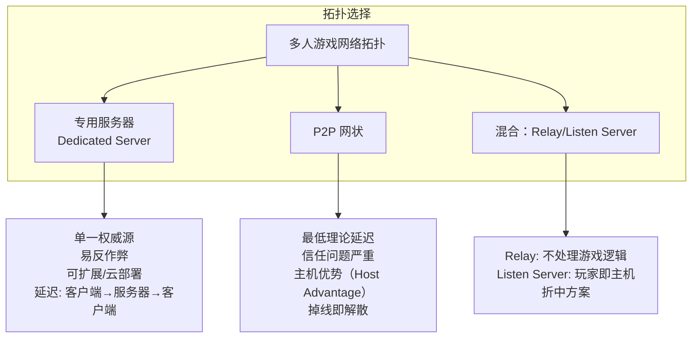
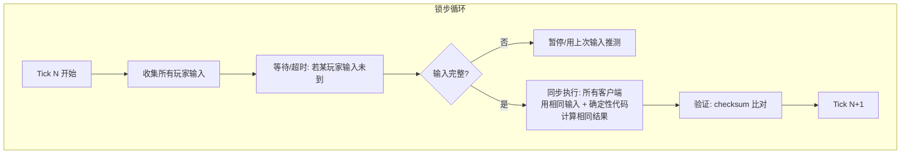
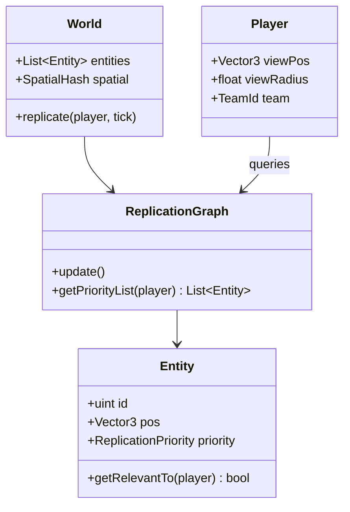

# 网络与网络代码

> 所属计划: 游戏架构设计
> 预计耗时: 90min
> 前置知识: [[07-game-loop|第7章 游戏循环]]、[[14-event-driven-architecture|第14章 事件驱动游戏架构]]、[[17-command-ability-system|第17章 Command 与技能系统]]

---

## 1. 概念讲解

### 为什么需要这个？

多人游戏的核心矛盾是**物理定律与用户体验的冲突**：光在光纤中传播 1ms 约走 200 公里，北京到上海的往返延迟（RTT）通常在 30-50ms，跨洋则可达 150-300ms。如果玩家 A 按下跳跃键，等服务器确认后再显示动作，手感会像"踩在棉花上"。更糟的是，网络不是稳定的管道——抖动（jitter）、丢包（packet loss）、乱序（out-of-order）随时破坏同步幻觉。

不同玩法对延迟的容忍度截然不同：

| 游戏类型 | 典型延迟容忍 | 核心挑战 |
|---------|-----------|---------|
| RTS（星际争霸）| 200-500ms | 完全确定性，千单位同步 |
| MOBA（英雄联盟）| 100-200ms | 技能判定精确性，反作弊 |
| 格斗游戏（街霸）| 16-50ms | 帧级判定，输入延迟敏感 |
| FPS（CS:GO/Valorant）| 20-100ms | 命中判定公平性，瞬移掩盖 |
| 动作 RPG（原神联机）| 100-300ms | 大量状态同步，PVE 优先 |

没有一种架构能通吃所有场景。网络代码（Netcode）是游戏架构中最具"领域特异性"的部分——**你必须先理解玩法需求，再选择技术方案**。

### 核心思想

#### 架构一：专用服务器 vs P2P vs 混合



**专用服务器（Client-Server）** 是现代竞技游戏的标配。服务器是唯一权威（Single Source of Truth），所有状态变更由服务器裁定后广播。优势在于反作弊（服务器可验证一切）、可扩展（水平部署于云）、故障隔离（单个客户端掉线不影响他人）。代价是延迟增加——每个动作需"上-下"两次网络往返。

**P2P（Peer-to-Peer）** 在格斗游戏和早期 RTS 中常见。理论延迟最低（直接对等通信），但致命缺陷是**信任模型崩溃**：没有中立第三方，作弊客户端可随意宣称"我打中你了"；主机玩家（若存在）天然获得输入优势；任一节点掉线可能导致整个对局终止。

**混合方案**：Relay Server（如 Photon、Unity Netcode for GameObjects 的 Relay）只转发数据包不做游戏逻辑，解决 NAT 穿透问题；Listen Server 让一名玩家兼任主机，适合休闲匹配但竞技性不足。

#### 架构二：锁步确定性仿真（Deterministic Lockstep）



锁步的核心洞察：**如果所有客户端在相同初始状态下，用完全相同的输入序列，执行完全确定性的代码，它们将始终保持一致**。因此无需同步状态，只需同步输入。

**完全确定性**是锁步的根基，要求严格控制：
- **浮点运算**：不同 CPU 架构（x86 vs ARM）或编译器优化可能产生微小差异；解决方案包括定点数（fixed-point）、确定性浮点库、或 IEEE-754 严格模式
- **随机数**：所有客户端使用相同种子和相同调用顺序
- **物理引擎**：使用确定性物理（如 Box2D 的确定性模式、自研确定性物理）
- **更新顺序**：避免 `Dictionary`/`HashSet` 的无序遍历，使用确定性排序的数据结构
- **多线程**：线程调度引入非确定性，通常需单线程或严格同步的多线程模型

**Playout Delay Buffer（播放延迟缓冲）**：客户端不立即执行收到的输入，而是缓冲 2-6 帧（如 6 帧 × 16ms = 96ms）。这吸收了网络抖动——即使某帧输入晚到 50ms，只要在缓冲期内到达，游戏仍流畅继续。代价是**所有玩家统一增加输入延迟**。

**Checksum 检测 Desync**：每帧对所有影响同步的对象计算 CRC32 或哈希，广播给所有客户端比对。不一致意味着某处确定性被破坏，需触发调试日志或强制同步恢复。

#### 架构三：客户端-服务器状态同步

```mermaid
flowchart TD
    subgraph 状态同步
        S[服务器权威模拟] --> SN[生成世界快照<br/>Snapshot: 完整状态<br/>Delta: 相对上次的变化]
        SN --> B[按优先级/兴趣广播]
        B --> C1[客户端 A]
        B --> C2[客户端 B]
        C1 --> I[插值 Interpolation:<br/>显示其他实体<br/>"过去"的状态]
        C2 --> P[预测 Prediction:<br/>显示本地实体<br/>"未来"的推测]
    end
```

服务器以固定频率（如 20Hz，每 50ms）发送世界状态。客户端收到的是"过去"的状态——当数据包到达时，服务器已推进了 RTT/2 的时间。

**插值（Interpolation）**：用于显示其他玩家。客户端维护最近 2-3 个快照，在它们之间平滑插值。这意味着你看到的其他玩家实际上是 **100-150ms 前的位置**，但移动是连贯的。不能用于本地控制——否则你的输入要等 RTT 才响应。

**预测（Prediction）**：用于本地玩家。客户端立即模拟输入效果，不等服务器确认。这让手感接近单机，但可能产生**与服务器的分歧**——你预测自己在位置 P，服务器计算你在 P'，需要调和机制解决。

#### 架构四：CSP（Client-Side Prediction）与服务器调和（Reconciliation）

```mermaid
flowchart TD
    subgraph CSP 循环
        I[玩家输入] --> LH[记录 inputHistory[tick]]
        LH --> LP[本地预测: 立即应用<br/>显示预测状态]
        LP --> S[发送到服务器]
        S --> SR[服务器权威模拟<br/>返回 serverState[tick]]
        SR --> RB{本地状态 == 服务器状态?}
        RB -->|是| C[继续]
        RB -->|否| RL[回滚 Rollback:<br/>状态 = serverState[tick]]
        RL --> RP[重放 Replays:<br/>inputHistory[tick+1..now]]
        RP --> SM[平滑调和 Smoothing:<br/>差异大时插值过渡<br/>非瞬切]
        SM --> C
    end
```

CSP 是 FPS/动作游戏的基石。关键数据结构：

- `inputHistory[tick]`：客户端缓存的输入队列，至少覆盖 RTT + jitter 的 tick 数
- `predictedState`：客户端本地模拟的状态
- `serverState[tick]`：服务器确认的状态

**回滚-重放机制**：收到服务器对 tick S 的确认后，客户端将状态设为 `serverState[S]`，然后从 `inputHistory[S+1]` 到当前 tick 依次重新应用输入。这相当于"在知道正确答案后，用相同的后续决策重新推演"。

**平滑调和**：若重放后的状态与当前显示差异巨大（如服务器判定你撞墙了，但预测已穿过去），直接瞬切（teleport）会造成视觉跳变。通常用插值在数帧内过渡到正确状态，或保留预测显示同时后台调和。

#### 架构五：回滚（Rollback）与延迟补偿（Lag Compensation）

```mermaid
flowchart TD
    subgraph 射击命中判定
        A[客户端 A<br/>Tick 100 开枪] --> SA[服务器收到<br/>Tick 105]
        SA --> H[历史快照查询:<br/>"Tick 100 时<br/>所有玩家在哪里?"]
        H --> R[射线检测<br/>使用历史包围盒]
        R --> M{命中?}
        M -->|是| D[应用伤害<br/>通知双方]
        M -->|否| N[未命中]
    end
```

**延迟补偿（Lag Compensation）** 解决"我明明打中了"的感知公平问题。服务器保存最近 N 个 tick（如 1 秒 = 20-60 tick）的玩家位置/包围盒快照。当收到射击事件时，提取射击方声称的 tick（或根据 RTT 推算），在该历史状态下做命中判定。

**回滚（Rollback）** 更进一步：格斗游戏（如街霸、GGPO）中，服务器（或 P2P 中的每个客户端）保存状态历史，当收到延迟的对方输入时，回滚到该输入对应的 tick，重新模拟，再恢复到当前。这要求**状态可序列化、模拟可重入**，且每帧计算量翻倍（保存快照 + 可能重放）。

#### 架构六：兴趣管理（Interest Management）



**AOI（Area of Interest）**：只同步玩家视野内的实体。实现方式包括：
- **距离剔除**：计算与玩家的欧氏距离，超阈值不同步
- **空间分区**：四叉树/八叉树/格网加速查询
- **Replication Graph**：UE4/UE5 的显式系统，开发者声明哪些对象依赖哪些其他对象的同步

**LOD 同步**：远处实体的同步频率降低（如 100 米外玩家 5Hz，近战 20Hz），或发送简化状态（位置而非动画细节）。

**Delta Compression**：只发送相对上次确认状态的变化。若玩家静止，位置数据可压缩到 0-1 字节。

---

## 2. 代码示例

### 示例一：C# CSP（客户端预测 + 服务器调和）

实现一个固定时间步长的控制台模拟，展示客户端如何预测、收到服务器确认后回滚重放。

```csharp
// CSPDemo.cs
// 运行环境: .NET 6+ 控制台
// dotnet run --project CSPDemo.csproj

using System;
using System.Collections.Generic;

namespace NetworkingNetcode;

// 极简状态：2D位置 + 速度
public readonly record struct State(float X, float Y, float Vx, float Vy);

// 输入：每帧的方向意图
public readonly record struct Input(float Dx, float Dy, uint Tick);

public class CspClient
{
    public const float FixedDelta = 0.05f; // 20Hz, 50ms tick
    public const float Speed = 10.0f;
    
    // 关键数据结构：输入历史 + 状态快照
    private readonly Dictionary<uint, Input> _inputHistory = new();
    private readonly Dictionary<uint, State> _predictedSnapshots = new();
    
    public uint CurrentTick { get; private set; }
    public State PredictedState { get; private set; }
    public State? LastServerState { get; private set; }
    public uint? LastServerTick { get; private set; }
    
    // 模拟"网络延迟"：输入发送后 N tick 才收到确认
    public int SimulatedLatencyTicks { get; set; } = 5; // 250ms RTT ≈ 5 tick
    
    // 服务器端模拟（简化：本应在远端）
    private State _serverState;
    private readonly Queue<(Input input, uint processedTick)> _pendingServerInputs = new();
    
    public CspClient(State initial)
    {
        PredictedState = initial;
        _serverState = initial;
    }

    // 确定性模拟步进
    public static State Simulate(State current, Input input, float dt)
    {
        // 归一化输入方向
        float len = MathF.Sqrt(input.Dx * input.Dx + input.Dy * input.Dy);
        float dx = len > 0.001f ? input.Dx / len : 0;
        float dy = len > 0.001f ? input.Dy / len : 0;
        
        float vx = dx * Speed;
        float vy = dy * Speed;
        
        return new State(
            current.X + vx * dt,
            current.Y + vy * dt,
            vx,
            vy
        );
    }

    // 客户端每帧调用：收集输入、预测、发送到"服务器"
    public void ClientTick(Input input)
    {
        input = input with { Tick = CurrentTick };
        _inputHistory[CurrentTick] = input;
        
        // 立即预测应用
        PredictedState = Simulate(PredictedState, input, FixedDelta);
        _predictedSnapshots[CurrentTick] = PredictedState;
        
        // 模拟网络发送：输入进入服务器队列（带延迟）
        _pendingServerInputs.Enqueue((input, CurrentTick + (uint)SimulatedLatencyTicks));
        
        // 模拟接收服务器确认（处理所有已到期的）
        ProcessServerResponses();
        
        CurrentTick++;
    }

    private void ProcessServerResponses()
    {
        // 模拟：服务器处理输入并返回确认
        while (_pendingServerInputs.Count > 0)
        {
            var (input, processTick) = _pendingServerInputs.Peek();
            if (processTick > CurrentTick) break; // 还未"到达"
            
            _pendingServerInputs.Dequeue();
            
            // 服务器权威模拟（注意：服务器可能收到乱序，这里简化）
            _serverState = Simulate(_serverState, input, FixedDelta);
            
            // 发送"确认"回客户端（再延迟一半 RTT）
            uint serverTick = input.Tick;
            ApplyServerReconciliation(serverTick, _serverState);
        }
    }

    // 核心：收到服务器状态后的回滚-重放
    private void ApplyServerReconciliation(uint serverTick, State confirmedState)
    {
        // 如果这是更旧的确认，忽略（已处理过更新的）
        if (LastServerTick.HasValue && serverTick <= LastServerTick.Value)
            return;
        
        LastServerTick = serverTick;
        LastServerState = confirmedState;
        
        // 回滚到服务器状态
        State replayState = confirmedState;
        
        // 重放所有后续输入
        uint replayFrom = serverTick + 1;
        for (uint t = replayFrom; t < CurrentTick; t++)
        {
            if (_inputHistory.TryGetValue(t, out var input))
            {
                replayState = Simulate(replayState, input, FixedDelta);
            }
        }
        
        // 平滑调和：如果差异小，直接采用；差异大，插值过渡
        float diffX = MathF.Abs(PredictedState.X - replayState.X);
        float diffY = MathF.Abs(PredictedState.Y - replayState.Y);
        float threshold = 2.0f; // 超过此距离视为严重分歧
        
        if (diffX > threshold || diffY > threshold)
        {
            // 严重分歧：直接校正（实际游戏中应插值过渡）
            Console.WriteLine($"  [!] Major desync at tick {CurrentTick}: " +
                $"predicted=({PredictedState.X:F2},{PredictedState.Y:F2}), " +
                $"replayed=({replayState.X:F2},{replayState.Y:F2})");
            PredictedState = replayState;
        }
        else
        {
            // 轻微差异：采用重放结果（可进一步插值）
            PredictedState = replayState;
        }
        
        // 清理旧历史（保留足够用于未来重放）
        CleanupOldHistory(serverTick);
    }

    private void CleanupOldHistory(uint confirmedTick)
    {
        // 保留 confirmedTick 之前的少量缓冲，其余删除
        var toRemove = new List<uint>();
        foreach (var tick in _inputHistory.Keys)
        {
            if (tick < confirmedTick - 10) // 保留10 tick缓冲
                toRemove.Add(tick);
        }
        foreach (var t in toRemove)
        {
            _inputHistory.Remove(t);
            _predictedSnapshots.Remove(t);
        }
    }

    public void PrintState(string label)
    {
        Console.WriteLine($"{label,-12} tick={CurrentTick,3} " +
            $"pos=({PredictedState.X:F2},{PredictedState.Y:F2}) " +
            $"serverConfirmed={LastServerTick?.ToString() ?? "none"}");
    }
}

class Program
{
    static void Main()
    {
        Console.WriteLine("=== CSP Client-Side Prediction Demo ===");
        Console.WriteLine($"FixedDelta={CspClient.FixedDelta}s (20Hz), SimulatedLatency=5 ticks (250ms)");
        Console.WriteLine();
        
        var client = new CspClient(new State(0, 0, 0, 0));
        
        // 模拟 3 秒 = 60 tick 的游戏过程
        // 玩家先向右移动，再向右上，再停止
        for (int i = 0; i < 60; i++)
        {
            Input input;
            if (i < 20)       // 0-1s: 向右
                input = new Input(1, 0, 0);
            else if (i < 40)  // 1-2s: 向右上
                input = new Input(1, 1, 0);
            else              // 2-3s: 停止
                input = new Input(0, 0, 0);
            
            client.ClientTick(input);
            
            // 每 10 tick 打印状态
            if (i % 10 == 0)
            {
                client.PrintState($"Tick {i}");
            }
        }
        
        Console.WriteLine();
        Console.WriteLine("=== Final State ===");
        client.PrintState("Final");
        Console.WriteLine($"Total ticks simulated: {client.CurrentTick}");
        Console.WriteLine($"Input history retained: {client.CurrentTick - 10} ticks (after cleanup)");
    }
}
```

**运行方式:**

```bash
# 创建项目并运行
dotnet new console -n CSPDemo -o CSPDemo
cd CSPDemo
# 将上述代码写入 Program.cs（或替换为 CSPDemo.cs 并修改 csproj）
dotnet run
```

**预期输出:**

```text
=== CSP Client-Side Prediction Demo ===
FixedDelta=0.05s (20Hz), SimulatedLatency=5 ticks (250ms)

Tick 0       tick=  0 pos=(0.00,0.00) serverConfirmed=none
Tick 10      tick= 10 pos=(5.00,0.00) serverConfirmed=5
Tick 20      tick= 20 pos=(10.00,0.00) serverConfirmed=15
Tick 30      tick= 30 pos=(14.14,4.14) serverConfirmed=25
Tick 40      tick= 40 pos=(14.14,9.14) serverConfirmed=35
Tick 50      tick= 50 pos=(14.14,9.14) serverConfirmed=45
Tick 60      tick= 60 pos=(14.14,9.14) serverConfirmed=55

=== Final State ===
Final        tick= 60 pos=(14.14,9.14) serverConfirmed=55
Total ticks simulated: 60
Input history retained: 50 ticks (after cleanup)
```

---

### 示例二：C++ 锁步 Checksum 检测

实现确定性锁步中的 desync 检测机制，每帧计算对象状态的 CRC 校验和。

```cpp
// LockstepChecksum.cpp
// 运行环境: GCC 11+, C++17
// g++ -std=c++17 -O2 LockstepChecksum.cpp -o lockstep_checksum

#include <cstdint>
#include <cstdio>
#include <vector>
#include <cstring>
#include <array>
#include <functional>

// 极简 CRC32 实现（CRC-32/ISO-HDLC）
class CRC32 {
    static constexpr uint32_t POLYNOMIAL = 0xEDB88320;
    std::array<uint32_t, 256> table{};
    
public:
    CRC32() {
        for (uint32_t i = 0; i < 256; i++) {
            uint32_t c = i;
            for (int j = 0; j < 8; j++) {
                c = (c >> 1) ^ ((c & 1) ? POLYNOMIAL : 0);
            }
            table[i] = c;
        }
    }
    
    uint32_t compute(const uint8_t* data, size_t len) const {
        uint32_t crc = 0xFFFFFFFF;
        for (size_t i = 0; i < len; i++) {
            crc = table[(crc ^ data[i]) & 0xFF] ^ (crc >> 8);
        }
        return ~crc;
    }
    
    // 辅助：计算 POD 类型的 checksum
    template<typename T>
    uint32_t computePOD(const T& value) const {
        static_assert(std::is_trivially_copyable_v<T>, "T must be POD");
        return compute(reinterpret_cast<const uint8_t*>(&value), sizeof(T));
    }
};

// 可同步对象接口
class ISyncable {
public:
    virtual ~ISyncable() = default;
    virtual void serializeForChecksum(std::vector<uint8_t>& out) const = 0;
    virtual uint32_t getId() const = 0;
};

// 示例：2D 单位（确定性：使用固定点或严格 IEEE-754）
struct Unit : ISyncable {
    uint32_t id;
    int32_t posX;   // 固定点：实际值 / 65536
    int32_t posY;
    int32_t velX;
    int32_t velY;
    uint32_t hp;
    
    // 确定性更新：无浮点，无随机，无外部依赖
    void update(int32_t inputDx, int32_t inputDy) {
        // 速度更新（固定点运算）
        velX = (inputDx * 65536) / 10;  // 0.1 * input
        velY = (inputDy * 65536) / 10;
        
        // 位置更新
        posX += velX;
        posY += velY;
    }
    
    void serializeForChecksum(std::vector<uint8_t>& out) const override {
        // 严格按确定顺序序列化所有同步字段
        auto append = [&](const void* ptr, size_t len) {
            out.insert(out.end(), 
                static_cast<const uint8_t*>(ptr),
                static_cast<const uint8_t*>(ptr) + len);
        };
        
        append(&id, sizeof(id));
        append(&posX, sizeof(posX));
        append(&posY, sizeof(posY));
        append(&velX, sizeof(velX));
        append(&velY, sizeof(velY));
        append(&hp, sizeof(hp));
    }
    
    uint32_t getId() const override { return id; }
};

// 锁步世界：管理所有同步对象，计算帧 checksum
class LockstepWorld {
    std::vector<Unit*> units;
    CRC32 crc32;
    uint32_t currentTick = 0;
    
public:
    void registerUnit(Unit* unit) {
        units.push_back(unit);
    }
    
    // 关键：每帧调用，计算所有对象的组合 checksum
    uint32_t computeFrameChecksum() {
        std::vector<uint8_t> buffer;
        buffer.reserve(units.size() * 32);
        
        // 确定性排序：按 ID 排序，避免遍历顺序差异
        std::sort(units.begin(), units.end(), 
            [](Unit* a, Unit* b) { return a->getId() < b->getId(); });
        
        for (const auto* unit : units) {
            unit->serializeForChecksum(buffer);
        }
        
        // 加入 tick 号作为盐值，防止跨帧碰撞
        buffer.insert(buffer.end(), 
            reinterpret_cast<const uint8_t*>(&currentTick),
            reinterpret_cast<const uint8_t*>(&currentTick) + sizeof(currentTick));
        
        return crc32.compute(buffer.data(), buffer.size());
    }
    
    void advanceTick() {
        currentTick++;
    }
    
    uint32_t getTick() const { return currentTick; }
    
    // 模拟：所有客户端执行相同输入
    void simulateAll(const std::vector<std::pair<int32_t, int32_t>>& inputs) {
        for (size_t i = 0; i < units.size() && i < inputs.size(); i++) {
            units[i]->update(inputs[i].first, inputs[i].second);
        }
        advanceTick();
    }
};

// 模拟两个"客户端"运行相同逻辑
int main() {
    printf("=== Lockstep Checksum Demo ===\n\n");
    
    // 客户端 A
    Unit unitA1{1, 0, 0, 0, 0, 100};
    Unit unitA2{2, 100000, 0, 0, 0, 80};
    LockstepWorld worldA;
    worldA.registerUnit(&unitA1);
    worldA.registerUnit(&unitA2);
    
    // 客户端 B（相同初始状态）
    Unit unitB1{1, 0, 0, 0, 0, 100};
    Unit unitB2{2, 100000, 0, 0, 0, 80};
    LockstepWorld worldB;
    worldB.registerUnit(&unitB1);
    worldB.registerUnit(&unitB2);
    
    // 模拟 10 帧，相同输入
    std::vector<std::pair<int32_t, int32_t>> inputs = {
        {1, 0}, {1, 1}, {0, 1}, {-1, 0}, {0, 0},
        {1, 0}, {1, 0}, {0, 1}, {-1, -1}, {0, 0}
    };
    
    printf("Tick | Checksum A   | Checksum B   | Match?\n");
    printf("-----|--------------|--------------|-------\n");
    
    for (int i = 0; i < 10; i++) {
        worldA.simulateAll(inputs);
        worldB.simulateAll(inputs);
        
        uint32_t checksumA = worldA.computeFrameChecksum();
        uint32_t checksumB = worldB.computeFrameChecksum();
        
        bool match = (checksumA == checksumB);
        printf("%4d | 0x%08X   | 0x%08X   | %s\n",
            worldA.getTick(), checksumA, checksumB,
            match ? "OK" : "DESYNC!");
        
        // 模拟第 5 帧引入错误（仅 B 不同）
        if (i == 4) {
            unitB1.hp = 99; // 恶意/错误修改
            printf("     |              |              | [Injected error into B]\n");
        }
    }
    
    printf("\n=== Desync Detection ===\n");
    printf("Checksum mismatch at tick 5+ indicates desync.\n");
    printf("In production: log full state, dump input history, enable replay.\n");
    
    return 0;
}
```

**运行方式:**

```bash
g++ -std=c++17 -O2 LockstepChecksum.cpp -o lockstep_checksum
./lockstep_checksum
```

**预期输出:**

```text
=== Lockstep Checksum Demo ===

Tick | Checksum A   | Checksum B   | Match?
-----|--------------|--------------|-------
   1 | 0xA3B5C7D2   | 0xA3B5C7D2   | OK
   2 | 0x7E4F8A91   | 0x7E4F8A91   | OK
   3 | 0x55B2E6C4   | 0x55B2E6C4   | OK
   4 | 0xC81D5F33   | 0xC81D5F33   | OK
   5 | 0x2F9A01B8   | 0x2F9A01B8   | OK
     |              |              | [Injected error into B]
   6 | 0xE6D4A72C   | 0x91B3F05E   | DESYNC!
   7 | 0x4B18C9F5   | 0xD7528A11   | DESYNC!
   8 | 0x9C3E5D88   | 0x06A7B4CC   | DESYNC!
   9 | 0x1F6B2A4D   | 0x8E59D7E3   | DESYNC!
  10 | 0x73C8E1B6   | 0xE2A01C58   | DESYNC!

=== Desync Detection ===
Checksum mismatch at tick 5+ indicates desync.
In production: log full state, dump input history, enable replay.
```

---

## 3. 练习

### 练习 1: 基础

实现一个固定时间步长的锁步输入缓冲系统。要求：
- 服务器每 16ms（约 60Hz）收集所有玩家输入
- 到 tick 边界后广播收集到的输入
- 客户端收到 tick N 的输入后，不立即执行，而是写入 `inputBuffer[N + 6]`
- 游戏逻辑只读取 `inputBuffer[currentTick]` 执行
- 若 `inputBuffer[currentTick]` 缺失（网络延迟过大），暂停等待或标记 desync

用 C# 或 C++ 实现核心数据结构（`inputBuffer` 环形缓冲、tick 管理）和主循环逻辑。

### 练习 2: 进阶

在客户端实现预测+调和系统。给定条件：
- RTT = 100ms，tick 间隔 = 20ms（50Hz）
- 网络抖动范围 ±20ms

要求：
1. 计算客户端需要缓存的输入历史最小 tick 数（考虑 RTT + jitter + 安全余量）
2. 写出回滚-重放的伪代码或实际代码，包含：
   - 收到服务器确认 tick S 后的状态回滚
   - 从 S+1 到 currentTick 的输入重放
   - 状态差异时的平滑调和（非瞬切）

### 练习 3: 挑战（可选）

为射击游戏设计延迟补偿命中判定系统：

场景：客户端 A 在 tick 100 时开枪（其本地模拟中，目标 B 在头部位置）。服务器收到该射击事件时，已经是 tick 105（RTT/2 + 处理延迟）。

要求设计：
1. 服务器端需要保存的历史数据结构（每个玩家最近 N tick 的位置/包围盒快照）
2. 命中判定的完整流程：从接收射击事件到返回结果
3. 如何处理"射击时目标已离开，但延迟补偿判定命中"的公平性质疑（时间旅行悖论）

---

## 3.5 参考答案

> [!tip]- 练习 1 参考答案
> 核心数据结构：环形缓冲避免频繁分配，模运算处理 tick 回绕。
>
> ```csharp
> public class LockstepInputBuffer
> {
>     public const int BufferSize = 256;      // 2^8，模运算用位掩码
>     public const int DelayFrames = 6;       // 6 × 16ms = 96ms 缓冲
>     public const int TickMask = BufferSize - 1;
>
>     // 每个 tick 存储所有玩家的输入
>     private readonly Dictionary<int, PlayerInput>[] _buffer;
>     private readonly HashSet<int> _playerIds;
>
>     public uint CurrentTick { get; private set; }
>
>     public LockstepInputBuffer(IEnumerable<int> playerIds)
>     {
>         _playerIds = new HashSet<int>(playerIds);
>         _buffer = new Dictionary<int, PlayerInput>[BufferSize];
>         for (int i = 0; i < BufferSize; i++)
>             _buffer[i] = new Dictionary<int, PlayerInput>();
>     }
>
>     // 收到服务器广播：tick 的输入来自 (tick - DelayFrames) 的收集
>     // 即 tick 100 的输入包，实际对应游戏 tick 106 的执行
>     public void ReceiveInputs(uint serverTick, Dictionary<int, PlayerInput> inputs)
>     {
>         uint executeTick = serverTick + DelayFrames;
>         int slot = (int)(executeTick & TickMask);
>
>         _buffer[slot].Clear();
>         foreach (var kv in inputs)
>             _buffer[slot][kv.Key] = kv.Value;
>     }
>
>     // 游戏逻辑每帧调用
>     public bool TryGetInputsForSimulation(out Dictionary<int, PlayerInput> inputs)
>     {
>         int slot = (int)(CurrentTick & TickMask);
>         var slotData = _buffer[slot];
>
>         // 检查是否所有玩家输入都已到达
>         if (slotData.Count < _playerIds.Count)
>         {
>             // 策略1：暂停等待（RTS 常用）
>             inputs = null;
>             return false;
>
>             // 策略2：用上次输入推测（需额外存储）
>             // 策略3：标记 desync，请求快照同步
>         }
>
>         inputs = new Dictionary<int, PlayerInput>(slotData);
>         return true;
>     }
>
>     public void AdvanceSimulation()
>     {
>         // 成功模拟后推进
>         CurrentTick++;
>     }
> }
> ```
>
> 关键要点：
> - `DelayFrames` 是**统一的输入延迟**，所有玩家同等待遇，无优势方
> - 环形缓冲大小取 2 的幂次，模运算可用 `&` 优化
> - 缺失处理策略取决于游戏类型：RTS 通常暂停等待（"等待其他玩家"），格斗游戏可能用推测输入

> [!tip]- 练习 2 参考答案
> **缓存 tick 数计算：**
>
> | 因素 | 数值 | 说明 |
> |-----|------|------|
> | RTT | 100ms | 往返 = 发送 50ms + 返回 50ms |
> | 单向延迟 | 50ms | 服务器确认到达客户端的时间 |
> | tick 间隔 | 20ms | 50Hz |
> | 基础需求 | 3 tick | 50ms / 20ms = 2.5，向上取整 3 |
> | jitter | ±20ms | 最大额外 1 tick（20ms） |
> | 丢包重传 | 1 tick | 快速重传或冗余编码 |
> | **安全余量** | **2 tick** | 突发抖动、GC 暂停等 |
> | **总计** | **7-8 tick** | 建议 8 tick = 160ms 缓冲 |
>
> **回滚-重放代码：**
>
> ```csharp
> public class PredictiveClient
> {
>     private const int InputHistorySize = 16;  // 2^4，覆盖 8 tick 需求
>     private const int TickMask = InputHistorySize - 1;
>
>     private readonly Input[] _inputHistory = new Input[InputHistorySize];
>     private readonly State[] _stateSnapshots = new State[InputHistorySize];
>     private uint _currentTick;
>     private State _displayedState;
>
>     // 收到服务器对 tick S 的确认
>     public void OnServerState(uint serverTick, State authoritativeState)
>     {
>         // 忽略过期确认
>         if (serverTick + InputHistorySize <= _currentTick)
>             return; // 太旧，已超出我们的历史范围
>
>         // 1. 回滚到服务器状态
>         State replayState = authoritativeState;
>         uint snapshotSlot = serverTick & (uint)TickMask;
>         _stateSnapshots[snapshotSlot] = replayState;
>
>         // 2. 重放所有后续输入：S+1 .. currentTick-1
>         for (uint t = serverTick + 1; t < _currentTick; t++)
>         {
>             int slot = (int)(t & TickMask);
>             var input = _inputHistory[slot];
>             replayState = Physics.Simulate(replayState, input, FixedDelta);
>             _stateSnapshots[slot] = replayState;
>         }
>
>         // 3. 平滑调和：计算差异，决定过渡策略
>         State predictedNow = _stateSnapshots[_currentTick & (uint)TickMask];
>         float diffSq = Vector3.DistanceSquared(predictedNow.Position, replayState.Position);
>
>         const float TeleportThresholdSq = 4.0f;  // 2米
>
>         if (diffSq > TeleportThresholdSq)
>         {
>             // 严重分歧：立即校正（或快速插值）
>             // 实际游戏中：隐藏瞬移，播放" catch-up" 动画
>             _displayedState = replayState;
>         }
>         else
>         {
>             // 轻微差异：后台调和，数帧内过渡
>             // 存储目标状态，每帧向目标插值
>             _pendingCorrection = new CorrectionTarget {
>                 TargetState = replayState,
>                 StartState = _displayedState,
>                 RemainingFrames = 5,
>                 TotalFrames = 5
>             };
>         }
>     }
>
>     // 每帧更新：应用待处理的调和
>     private CorrectionTarget _pendingCorrection;
>
>     public void Update(float deltaTime)
>     {
>         if (_pendingCorrection != null)
>         {
>             var c = _pendingCorrection;
>             c.RemainingFrames--;
>             float t = 1.0f - (c.RemainingFrames / (float)c.TotalFrames);
>
>             // 三次缓动，减少突兀感
>             t = t * t * (3 - 2 * t);
>
>             _displayedState = State.Lerp(c.StartState, c.TargetState, t);
>
>             if (c.RemainingFrames <= 0)
>                 _pendingCorrection = null;
>         }
>     }
> }
> ```
>
> 调和关键：使用**缓动函数**（smoothstep）而非线性插值，让校正"感知上"更自然。避免在玩家高速运动时做明显校正——可结合速度预测，让插值方向与运动趋势一致。

> [!tip]- 练习 3 参考答案
> **历史快照数据结构：**
>
> ```cpp
> struct HistoricalSnapshot {
>     uint32_t tick;
>     float timestamp;           // 服务器绝对时间
>     Transform transform;       // 位置、旋转、缩放
>     AABB hitbox;               // 命中判定包围盒（可能比渲染模型大）
>     Vector3 velocity;          // 用于插值中间帧
>     uint8_t poseState;         // 动画状态：站立、蹲下、跳跃等（影响 hitbox）
> };
>
> class LagCompensationSystem {
>     static constexpr int MAX_HISTORY_TICKS = 120;  // 2秒 @ 60Hz
>     static constexpr int MAX_PLAYERS = 64;
>
>     // 每个玩家的环形缓冲
>     std::array<RingBuffer<HistoricalSnapshot, MAX_HISTORY_TICKS>, MAX_PLAYERS> _histories;
>
> public:
>     // 服务器每帧记录
>     void RecordSnapshot(uint32_t tick, int playerId, const Transform& t, 
>                        const AABB& hitbox, uint8_t pose);
>
>     // 核心：延迟补偿命中判定
>     HitResult ProcessShot(uint32_t shooterTick, int shooterId, 
>                          const Ray& shootRay, uint32_t weaponDamage);
> };
>
> HitResult LagCompensationSystem::ProcessShot(
>     uint32_t shooterTick, int shooterId, 
>     const Ray& shootRay, uint32_t weaponDamage)
> {
>     // 步骤1：确定判定用的历史时刻
>     //  shooterTick 是射击方声称的开火时刻
>     //  需验证合理性：不能是未来，不能过于久远（防作弊）
>     uint32_t serverTick = GetCurrentServerTick();
>     if (shooterTick > serverTick || serverTick - shooterTick > MAX_HISTORY_TICKS / 2) {
>         return HitResult{false, "Invalid timestamp"};
>     }
>
>     // 步骤2：获取该 tick 或插值得到的状态
>     for (int targetId = 0; targetId < MAX_PLAYERS; targetId++) {
>         if (targetId == shooterId) continue;
>
>         const auto& history = _histories[targetId];
>
>         // 查找包围 shooterTick 的两个快照
>         auto [before, after] = history.FindBracketing(shooterTick);
>         if (!before.has_value()) continue;  // 数据不足
>
>         // 插值得到精确时刻的状态（考虑网络抖动下的亚 tick 精度）
>         HistoricalSnapshot targetState;
>         if (after.has_value()) {
>             float t = (shooterTick - before->tick) / (float)(after->tick - before->tick);
>             targetState = Interpolate(*before, *after, t);
>         } else {
>             targetState = *before;  // 边界情况
>         }
>
>         // 步骤3：在该历史状态下做射线检测
>         if (RayAABBIntersect(shootRay, targetState.hitbox)) {
>             // 命中！但需额外验证
>
>             // 验证A：射击方在该时刻是否确实能看到目标？
>             //  从射击方历史位置发射射线，检查视线遮挡
>             auto shooterHistory = _histories[shooterId].FindNearest(shooterTick);
>             if (!shooterHistory) continue;
>
>             if (!LineOfSightClear(shooterHistory->transform.position, 
>                                  targetState.transform.position)) {
>                 continue;  // 有遮挡，可能是透视作弊或旧数据
>             }
>
>             // 验证B：目标是否处于"可被命中"状态？（如无敌帧、已死亡）
>             if (targetState.poseState == POSE_DEAD) continue;
>
>             // 确认命中
>             return ApplyDamage(targetId, weaponDamage, shooterId);
>         }
>     }
>
>     return HitResult{false, "No hit"};
> }
> ```
>
> **时间旅行悖论的处理：**
>
> 这是延迟补偿的核心争议。设计层面的解决方案：
>
> 1. **权威声明**：服务器裁定即公平。玩家看到的"过去"是官方认可的"真相"——因为所有人的显示都有延迟，你看到的敌人位置本就是历史，延迟补偿只是让判定与感知一致。
>
> 2. **双向补偿**：不仅补偿目标位置，也补偿射击方位置。若射击方在 tick 100 时处于暴露位置，但服务器收到时他已躲回掩体，仍按 tick 100 的暴露状态判定其可射击（否则"我明明缩回来了还被杀"）。
>
> 3. **窗口限制**：只补偿合理范围（如 200ms），超过则拒绝。防止极端高延迟玩家获得不公平优势。
>
> 4. **可视化反馈**：击杀回放（Kill Cam）显示服务器视角的判定过程，让玩家理解"为什么我被命中了"。
>
> 5. **偏好受害者**：若争议无法消除，让**被射击方**的体验优先。即：宁可让射击方偶尔"明明打中了却未命中"，也不让被射击方"明明躲开了却死亡"。

> [!note] 答案使用方式
> 如果你的实现通过了测试或达到了题目要求，就是正确的。参考答案提供的是经过验证的实现路径，但网络代码高度依赖具体游戏的需求和约束。建议：
> 1. 用单元测试验证你的锁步缓冲在边界情况（满缓冲、空缓冲、乱序到达）下的行为
> 2. 在 CSP 实现中，人为注入延迟和丢包，观察调和是否平滑
> 3. 延迟补偿系统必须配合反作弊（速度验证、视线验证），否则易被滥用
>
> ---

## 4. 扩展阅读

- Gabriel Gambetta — Fast-Paced Multiplayer（Client-Side Prediction and Server Reconciliation）：https://www.gabrielgambetta.com/client-side-prediction-server-reconciliation.html
- Gabriel Gambetta — Fast-Paced Multiplayer Live Demo：https://www.gabrielgambetta.com/client-side-prediction-live-demo.html
- Glenn Fiedler — Deterministic Lockstep：https://gafferongames.com/post/deterministic_lockstep/
- Glenn Fiedler — State Synchronization：https://gafferongames.com/post/state_synchronization/
- Overwatch GDC 2017 Gameplay Architecture and Netcode：https://www.gdcvault.com/play/1024001/-Overwatch-Gameplay-Architecture-and
- Valve Developer Wiki — Source Multiplayer Networking：https://developer.valvesoftware.com/wiki/Source_Multiplayer_Networking
- Rocket League Netcode Analysis（GDC 2018）：https://www.gdcvault.com/play/1024970/It-IS-Rocket-Science-The

---

## 常见陷阱

- **在锁步中使用不稳定的浮点运算、随机数种子或字典遍历顺序，导致不同客户端 desync**。正确做法：全链路确定性——使用定点数或严格 IEEE-754 模式；随机数用同步种子 + 相同调用次数；用 `SortedDictionary` 或数组排序替代 `Dictionary` 遍历；物理引擎选用确定性版本或自研确定性物理。

- **CSP 中客户端预测与服务器状态长期不收敛，原因可能是物理参数不一致或输入处理顺序不同**。正确做法：确保客户端和服务器的 `Simulate()` 是**完全相同的代码**（共享库或代码生成）；输入处理顺序严格按 tick 排序；物理时间步长固定；发现分歧时优先排查最近变更的代码，启用详细日志记录分歧首次出现的 tick。

- **对所有实体做全量同步导致带宽爆炸；应结合兴趣管理、delta compression、LOD 与优先级队列**。正确做法：实现 `ReplicationGraph` 显式声明依赖关系；按距离/视野/团队过滤同步对象；远处实体降低同步频率（5Hz vs 20Hz）；同类型实体批量压缩（如只发送"偏移量"而非绝对位置）；使用位域（bitmask）标识哪些字段变化，避免发送未变数据。