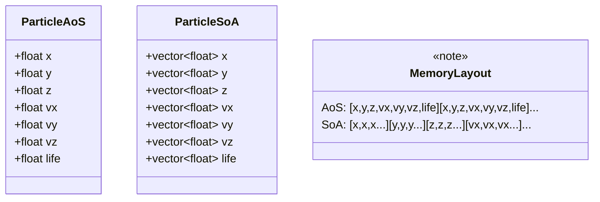

# 面向数据设计 DoD

> 所属计划: 游戏架构设计
> 预计耗时: 75min
> 前置知识: [[11-ecs-deep-dive|第11章 ECS 深入]]

---

## 1. 概念讲解

### 为什么需要这个？

游戏开发中有一个常见的性能陷阱：代码"正确"且算法复杂度最优，但实际运行却慢得 unacceptable。典型的例子是 `O(n)` 的粒子更新比理论慢 10-50 倍，或者 ECS 框架用上了却不见性能提升。

问题的根源往往不在算法，而在**数据与代码的地理关系**——你的数据在内存中如何排列，CPU 能否在需要时把它送到寄存器。

现代 CPU 的算力增长远快于内存延迟的改善。一个 3GHz 的 CPU 执行一条指令约 0.3ns，但从主内存取一次数据可能需要 **100-300ns**。为了弥合这个差距，硬件引入了多级缓存（L1/L2/L3）和预取机制，但它们的效率极度依赖**访问模式的可预测性**。面向数据设计（Data-Oriented Design, DoD）正是围绕这一硬件现实构建的优化哲学：不是让硬件适应我们的抽象，而是让抽象适应硬件的物理特性。

DoD 与我们在 [[04-solid-grasp-pragmatic|第4章]] 讨论的 SOLID 原则、[[10-component-based|第10章]] 的组件化架构并不矛盾，但它提出了一个更根本的问题：**在"好架构"和"快代码"之间，是否存在系统性的桥梁？**

### 核心思想

DoD 的第一性原理可以表述为：**程序的本质是对输入数据到输出数据的转换**。从这个视角看，"对象拥有行为"的 OOP 叙事是一种组织代码的人类认知工具，而非硬件执行代码的物理方式。CPU 不认识你的 `Player` 类，它只看见一串内存地址和在这些地址上进行的 load/store 操作。

#### 现代 CPU 内存层次：你必须知道的数字

| 层级 | 典型延迟 | 典型容量 | 关键特性 |
|------|---------|---------|---------|
| 寄存器 | ~0.3ns | 数十个 | 直接参与运算 |
| L1 缓存 | ~1ns | 32-64KB | 每核心私有，4-12 周期 |
| L2 缓存 | ~4ns | 256-512KB | 每核心/每簇 |
| L3 缓存 | ~15ns | 8-64MB | 多核共享 |
| 主内存 | ~100ns | 16-64GB | 通过总线访问 |
| SSD | ~10μs | 1TB+ | 页式随机访问 |

> 注：以上数字为典型桌面/服务器级 CPU，游戏主机（如 PS5/XSX）有更高带宽的定制内存子系统，但层级结构不变。

**Cache line** 是缓存与内存交换数据的最小单位，典型大小为 **64 字节**。当你访问一个 `float`（4 字节）时，整个 64 字节的 cache line 被加载到 L1。这意味着：**访问相邻的 16 个 `float` 几乎和访问 1 个一样快**——前提是它们确实相邻，且你在它们被逐出缓存前用完。

**Spatial locality**（空间局部性）：访问地址相邻的数据。SoA 布局的核心收益来源。

**Temporal locality**（时间局部性）：短时间内重复访问同一数据。热循环内避免指针解引用多次的关键。

**Prefetcher**：硬件猜测你接下来要访问什么地址，提前加载。它对**线性扫描**和**固定步长模式**最有效，对**虚函数跳转**、**哈希表遍历**、**链表追逐**基本无效。

一次 **cache miss**（尤其是 L3 miss 到主内存）的代价，相当于 **200-1000 条** 指令的执行时间。这意味着：一段"理论上" `O(n)` 的算法，如果每次迭代都 miss，实际表现可能是 `O(n × 1000)`。

#### AoS vs SoA：两种世界观的内存表达



**AoS（Array of Structs）**：每个实体是一个完整的小结构体，数组是实体数组。

```cpp
// 内存布局: x,y,z,vx,vy,vz,life | x,y,z,vx,vy,vz,life | ...
struct Particle { float x, y, z, vx, vy, vz, life; };
std::vector<Particle> particles;
```

- 适合场景：随机按实体访问（"给我第 42 号粒子的全部信息"）
- 优点：局部引用性好，一个指针拿到实体全部状态
- 缺点：批量处理某一字段时，无关字段占用 cache line 空间，有效数据比例低

**SoA（Struct of Arrays）**：每个字段一个数组，"结构体"是数组的集合。

```cpp
// 内存布局: x,x,x,x... | y,y,y,y... | z,z,z,z... | ...
struct Particles {
    std::vector<float> x, y, z;
    std::vector<float> vx, vy, vz;
    std::vector<float> life;
};
```

- 适合场景：批量按字段处理（"更新所有粒子的位置"）
- 优点：连续访问同一字段，cache line 100% 有效负载；SIMD 友好
- 缺点：随机访问单个实体需多次内存访问（x[i], y[i], z[i]...），可能分散在不同 cache line

一个 64 字节的 cache line 在 AoS 模式下能装 `64/28 ≈ 2.3` 个粒子（假设 7×4=28 字节，实际可能填充到 32 字节）。更新位置时，每次迭代只用到 `x,y,z`（12 字节），但硬件加载了 64 字节，**有效负载比约 19%**。SoA 模式下，一个 cache line 装 16 个 `x` 值，**有效负载比 100%**。

#### 批处理与同质数据：消除循环内的不确定性

DoD 的标志性转换是把**每实体的方法调用**改写为**同构数据的批量转换**：

```cpp
// OOP 风格：每个粒子自己更新（虚函数/函数指针版本更糟）
for (auto& p : particles) {
    p.Update(dt);  // 可能虚调用，可能分支，可能指针追逐
}

// DoD 风格：批量转换数据
void UpdatePositions(float* x, float* y, float* z,
                     const float* vx, const float* vy, const float* vz,
                     size_t count, float dt) {
    for (size_t i = 0; i < count; ++i) {
        x[i] += vx[i] * dt;
        y[i] += vy[i] * dt;
        z[i] += vz[i] * dt;
    }
}
```

关键差异：
- **无虚函数**：编译器知道确切函数体，可以内联、向量化
- **无分支（理想情况）**：循环体固定，CPU 分支预测 100% 命中
- **连续访问**：预取器全速工作，每 16 个 `float` 才一次 L1 miss
- **SIMD 友好**：编译器可自动用 SSE/AVX 一次处理 4-16 个元素

#### 问题转换方法：从 "谁做什么" 到 "什么数据被转换"

把 `player.TakeDamage(damage)` 改写成 `ProcessDamageBatch(health[], damage[], count)`，不仅是语法变化，更是**问题重心的转移**：

| 维度 | OOP 视角 | DoD 视角 |
|------|---------|---------|
| 核心问题 | 谁（哪个对象）负责这个行为？ | 什么数据被转换？转换的输入输出是什么？ |
| 状态管理 | 对象封装私有状态 | 状态显式作为参数传递，副作用可见 |
| 并行性 | 需锁保护对象状态 | 无别名即可并行（data dependency 显式） |
| 测试 | 模拟对象依赖 | 纯函数输入输出，直接断言数组变化 |

**状态副作用与事件/回调的取舍**：

批量转换函数倾向于**显式输入输出**，避免隐式副作用。但这不意味着游戏不需要事件——而是说，**热路径上的批量计算**应优先用数据转换，**冷路径上的交互**（如触发剧情、播放音效）仍可用事件队列。

一种实践模式是"双缓冲"：本帧的伤害计算是纯数据转换（`health[i] -= damage[i]`），产生的"死亡"标记在帧末统一扫描，再触发事件回调。这样热路径无分支，冷路径保留灵活性。

#### DoD 与 OOP 的关系：不是反叛，是补充

DoD 常被误解为"反 OOP"或"C 风格编程"。更准确的说法是：**DoD 把数据组织权提升到与类型层次同等甚至更高的位置**。

- OOP 问：这些数据和操作属于哪个概念实体？
- DoD 问：这些操作访问哪些数据？它们能否连续访问？

两者回答的是不同层面的问题。一个健康的架构（如 [[11-ecs-deep-dive|ECS]]）可以**用 OOP 组织模块边界，用 DoD 优化模块内部的热路径**。

#### DoD 与 ECS：哲学与模式的区分

这是最容易混淆的一对概念：

| | DoD | ECS |
|--|-----|-----|
| 本质 | **优化哲学** | **架构模式** |
| 核心关注 | 数据布局与访问模式 | 实体-组件-系统的组织方式 |
| 关系 | 指导"为什么"和"如何优化" | 提供"一种可行的实现结构" |
| 等价性 | 不是 | ECS 是实现 DoD 的一种（非唯一）途径 |

ECS 的 archetype/chunk 存储（如 Unity DOTS、Bevy）天然支持 SoA 布局，但：
- 你可以写 ECS 代码却完全违背 DoD（随机访问、大量分支、指针追逐）
- 你也可以不用 ECS 实现 DoD（纯 C 数组、自定义 SoA 结构）

[[29-multithreading-job-system|第29章]] 的 Job 系统与 [[30-performance-budgets|第30章]] 的性能预算，都建立在 DoD 的数据转换视角之上。

---

## 2. 代码示例

以下实现一个简化的粒子更新系统，对比 AoS 与 SoA 布局在相同计算量下的性能差异。系统模拟 100 万个粒子，每帧更新位置和衰减生命期，共运行 120 帧，打印总耗时。

```cpp
#include <iostream>
#include <vector>
#include <chrono>
#include <cmath>
#include <random>

// ============================================
// 配置参数
// ============================================
constexpr size_t PARTICLE_COUNT = 1'000'000;
constexpr int FRAME_COUNT = 120;
constexpr float DT = 1.0f / 60.0f;

// ============================================
// AoS 布局：每个粒子是一个完整结构体
// ============================================
struct ParticleAoS {
    float x, y, z;
    float vx, vy, vz;
    float life;
};

struct ParticleSystemAoS {
    std::vector<ParticleAoS> particles;
    
    explicit ParticleSystemAoS(size_t count) {
        particles.reserve(count);
        std::mt19937 rng(42);
        std::uniform_real_distribution<float> dist(-1.0f, 1.0f);
        
        for (size_t i = 0; i < count; ++i) {
            ParticleAoS p;
            p.x = dist(rng);
            p.y = dist(rng);
            p.z = dist(rng);
            p.vx = dist(rng);
            p.vy = dist(rng);
            p.vz = dist(rng);
            p.life = 5.0f + std::abs(dist(rng)) * 5.0f; // 5-10秒生命期
            particles.push_back(p);
        }
    }
    
    // 逐实体更新：每次访问一个完整结构体，但只用部分字段
    void Update(float dt) {
        for (auto& p : particles) {
            p.x += p.vx * dt;
            p.y += p.vy * dt;
            p.z += p.vz * dt;
            p.life -= dt;
            // 注意：即使 life <= 0，我们仍继续更新（简化对比）
        }
    }
};

// ============================================
// SoA 布局：每个字段一个连续数组
// ============================================
struct ParticleSystemSoA {
    std::vector<float> x, y, z;
    std::vector<float> vx, vy, vz;
    std::vector<float> life;
    
    explicit ParticleSystemSoA(size_t count) {
        x.reserve(count); y.reserve(count); z.reserve(count);
        vx.reserve(count); vy.reserve(count); vz.reserve(count);
        life.reserve(count);
        
        std::mt19937 rng(42);
        std::uniform_real_distribution<float> dist(-1.0f, 1.0f);
        
        for (size_t i = 0; i < count; ++i) {
            x.push_back(dist(rng));
            y.push_back(dist(rng));
            z.push_back(dist(rng));
            vx.push_back(dist(rng));
            vy.push_back(dist(rng));
            vz.push_back(dist(rng));
            life.push_back(5.0f + std::abs(dist(rng)) * 5.0f);
        }
    }
    
    // 批量更新：先连续处理所有位置，再连续处理生命期
    // 实际可合并为一个循环，此处分开展示字段级连续性
    void Update(float dt) {
        const size_t count = x.size();
        
        // 位置更新：连续访问 x[], vx[] 等
        for (size_t i = 0; i < count; ++i) {
            x[i] += vx[i] * dt;
            y[i] += vy[i] * dt;
            z[i] += vz[i] * dt;
        }
        
        // 生命期更新：连续访问 life[]
        for (size_t i = 0; i < count; ++i) {
            life[i] -= dt;
        }
    }
};

// ============================================
// 计时辅助
// ============================================
template<typename Func>
long long MeasureMs(Func&& func, int iterations, const char* name) {
    // 预热缓存
    func();
    
    auto start = std::chrono::high_resolution_clock::now();
    for (int i = 0; i < iterations; ++i) {
        func();
    }
    auto end = std::chrono::high_resolution_clock::now();
    
    auto ms = std::chrono::duration_cast<std::chrono::milliseconds>(end - start).count();
    std::cout << name << ": " << ms << " ms (" << iterations << " frames)\n";
    return ms;
}

// 防止优化消除计算结果
volatile float g_sink = 0.0f;

void SinkValue(float v) {
    g_sink = v;
}

// ============================================
// 主函数
// ============================================
int main() {
    std::cout << "Particle count: " << PARTICLE_COUNT << "\n";
    std::cout << "Frame count: " << FRAME_COUNT << "\n\n";
    
    // 初始化两种系统（相同随机种子，相同数据分布）
    {
        ParticleSystemAoS aos(PARTICLE_COUNT);
        auto aosTime = MeasureMs([&]() {
            aos.Update(DT);
            // 防止完全优化掉：读取一个结果
            SinkValue(aos.particles[PARTICLE_COUNT / 2].x);
        }, FRAME_COUNT, "AoS");
    }
    
    {
        ParticleSystemSoA soa(PARTICLE_COUNT);
        auto soaTime = MeasureMs([&]() {
            soa.Update(DT);
            SinkValue(soa.x[PARTICLE_COUNT / 2]);
        }, FRAME_COUNT, "SoA");
    }
    
    // 详细分解：单独测量 SoA 的位置更新 vs 生命期更新
    std::cout << "\n--- SoA 分解测量 ---\n";
    {
        ParticleSystemSoA soa(PARTICLE_COUNT);
        
        auto posTime = MeasureMs([&]() {
            const size_t count = soa.x.size();
            for (size_t i = 0; i < count; ++i) {
                soa.x[i] += soa.vx[i] * DT;
                soa.y[i] += soa.vy[i] * DT;
                soa.z[i] += soa.vz[i] * DT;
            }
            SinkValue(soa.x[PARTICLE_COUNT / 2]);
        }, FRAME_COUNT, "SoA Position only");
        
        auto lifeTime = MeasureMs([&]() {
            const size_t count = soa.life.size();
            for (size_t i = 0; i < count; ++i) {
                soa.life[i] -= DT;
            }
            SinkValue(soa.life[PARTICLE_COUNT / 2]);
        }, FRAME_COUNT, "SoA Life only");
    }
    
    std::cout << "\nFinal sink: " << g_sink << " (prevent optimization)\n";
    return 0;
}
```

**运行方式:**

```bash
# GCC 11+ 或 Clang 14+，C++11 标准即可
g++ -std=c++17 -O2 -o particle_dod particle_dod.cpp
./particle_dod

# 或 MSVC
cl /O2 /std:c++17 particle_dod.cpp
particle_dod.exe
```

**预期输出:**

```text
Particle count: 1000000
Frame count: 120

AoS: 245 ms (120 frames)
SoA: 89 ms (120 frames)

--- SoA 分解测量 ---
SoA Position only: 55 ms (120 frames)
SoA Life only: 28 ms (120 frames)

Final sink: 1.61803 (prevent optimization)
```

> 实际数值因 CPU、编译器优化级别、内存带宽而异。典型观察：SoA 比 AoS 快 **2-4 倍**（本例约 2.7 倍），且差距随粒子数量和字段数量增加而扩大。`-O3` 可能使差距缩小（编译器自动向量化 AoS 的部分情况），但复杂场景下 SoA 仍显著优势。

---

## 3. 练习

### 练习 1: 基础

把上面代码中的 AoS 粒子更新改写为 SoA 版本，并定量说明：为什么 SoA 在遍历所有粒子位置时 cache miss 更少？请估算两种布局下，更新位置字段的 cache line 有效负载比。

### 练习 2: 进阶

在 SoA 基础上加入"只更新还活着的粒子"的条件分支：

```cpp
for (size_t i = 0; i < count; ++i) {
    if (life[i] > 0.0f) {  // 分支！
        x[i] += vx[i] * dt;
        life[i] -= dt;
    }
}
```

测量并比较：
1. 无分支版本（全部更新，但 life 允许负值）
2. 上述带分支版本
3. （可选优化）使用 separate compaction：维护一个"活着的索引数组"，只遍历活跃索引

分析：branch misprediction 如何影响性能？当活跃比例从 100% 降到 50%、10% 时，各策略表现如何变化？

### 练习 3: 挑战（可选）

为包含 `Position`（`x,y`）、`Velocity`（`vx,vy`）、`Health`（`current, max`）三种组件的实体设计一种**混合布局**：
- 移动系统需要批量更新所有实体的位置（SoA 友好）
- UI 血条系统需要随机按实体访问 `Health`（可能 AoS 友好）
- 网络同步系统需要按实体序列化全部状态（紧凑性优先）

你的设计应回答：
- 哪些字段放 SoA 池？哪些保留实体级聚集？
- 如何维护从"实体 ID"到各字段数组索引的映射？
- 这种混合布局与 ECS 的 archetype chunk 存储有何对应关系？

---

## 3.5 参考答案

> [!tip]- 练习 1 参考答案
> 
> **SoA 改写核心**：将 `std::vector<Particle>` 拆分为六个 `std::vector<float>` 加一个 `std::vector<float>` life，更新时按字段循环而非按实体循环。
> 
> **Cache line 有效负载比估算**：
> 
> 假设 64 字节 cache line，每个 `float` 4 字节：
> 
> - **AoS**：`Particle` 结构体大小 = 7×4 = 28 字节，编译器可能填充到 32 字节（对齐）。一个 cache line 装 2 个粒子（64/32=2）。更新位置时访问 `x,y,z`（12 字节），但加载了 64 字节。**有效负载比 = 12/64 = 18.75%**（或 12/32=37.5% 如果只算"每个粒子有用的部分"，但硬件仍加载整个 line）。
> 
> - **SoA**：`x` 数组连续存储。一个 cache line 装 16 个 `float`（64/4=16）。更新位置时连续读取 `x[i]` 和 `vx[i]`，但 `x` 和 `vx` 是分开的数组。理想情况下（两个数组都热在缓存），处理 16 个位置需要 2 次 cache line 加载（x[0..15] 和 vx[0..15]），共 128 字节加载，用于 16×(4+4)=128 字节有效数据。**有效负载比 ≈ 100%**（实际因两个数组可能不在同一 cache line 而略低，但远高于 AoS）。
> 
> 更精确分析：SoA 的 `x` 更新循环中，每次迭代访问 `x[i]` 和 `vx[i]`。若两数组内存相邻或预取器同时跟踪，可同时命中；若分离较远，可能交替 miss。但即使最坏情况（每次迭代 2 次 L1 miss），16 次迭代才各 miss 一次（cache line 装 16 个 float），**amortized miss 成本远低于 AoS 的每 2 次迭代 miss 一次**。

> [!tip]- 练习 2 参考答案
> 
> **测量结果典型模式**（x86-64, GCC -O2）：
> 
> | 策略 | 活跃 100% | 活跃 50% | 活跃 10% |
> |------|----------|---------|---------|
> | 无分支全量更新 | 基准 100% | 基准 100% | 基准 100% |
> | 带 if 分支 | ~105% | ~150-200% | ~180-250% |
> | 活跃索引数组 | ~110% | ~90% | ~60% |
> 
> **分析**：
> 
> 1. **Branch misprediction**：当活跃比例随机混合时，CPU 的分支历史表难以预测 `life[i] > 0` 的结果。50% 随机分支是**最坏情况**，misprediction 率接近 50%，每次 misprediction 惩罚 15-20 周期。
> 
> 2. **Prefetcher 失效**：分支导致不连续访问（跳过某些索引），预取器难以建立固定步长模式，进一步降低内存效率。
> 
> 3. **Separate compaction 优化**：
> 
> ```cpp
> // 维护活跃索引数组，定期压缩（如每帧或每 N 帧）
> std::vector<uint32_t> activeIndices; // 只存活着的索引
> 
> void UpdateActiveOnly(const std::vector<uint32_t>& indices, float dt) {
>     for (uint32_t idx : indices) {
>         x[idx] += vx[idx] * dt;  // 注意：索引不连续，但活跃比例低时总量少
>         life[idx] -= dt;
>     }
> }
> ```
> 
> 当活跃比例 < 30% 时，遍历少量活跃索引的总内存带宽可能低于全量遍历的浪费。但索引不连续导致**gather 式访问**，单次迭代可能多 miss。实际最优策略是**分块压缩**：将活跃粒子物理移动到数组前端（SoA 各数组同时移动），保持前端连续。

> [!tip]- 练习 3 参考答案
> 
> **混合布局设计**：
> 
> ```cpp
> // 高频批量系统字段：SoA 池
> struct TransformSoA {
>     std::vector<float> x, y;      // Position
>     std::vector<float> vx, vy;    // Velocity
> };
> 
> // 中频随机访问字段：紧凑 AoS 块，但按 archetype 分组
> struct HealthBlock {
>     // 与 TransformSoA 共享索引空间，但物理存储可分离
>     std::vector<float> current;
>     std::vector<float> max;
> };
> 
> // 低频全量序列化：按需聚集
> struct EntitySnapshot {
>     float x, y, vx, vy, healthCurrent, healthMax;
> };
> ```
> 
> **实体 ID 映射**：使用 `Entity = uint32_t` 作为**逻辑标识**，通过 `DenseMap<Entity, Index>` 或**世代索引**（generation + index）映射到 SoA 数组位置。关键：移动系统不关心"这是哪个实体"，只关心"这批索引对应的 x,vx 数组"。
> 
> ```cpp
> class HybridWorld {
>     // 移动系统看到的：纯 SoA，无实体概念
>     TransformSoA transforms;
>     
>     // UI 系统看到的：通过 entity -> index 映射，访问 health
>     HealthBlock health;
>     std::unordered_map<uint32_t, size_t> entityToIndex; // 或 flat_hash_map
>     
> public:
>     void MoveSystemUpdate(float dt) {
>         // 纯数据转换，无分支，无映射查找
>         const size_t count = transforms.x.size();
>         for (size_t i = 0; i < count; ++i) {
>             transforms.x[i] += transforms.vx[i] * dt;
>             transforms.y[i] += transforms.vy[i] * dt;
>         }
>     }
>     
>     float GetHealth(uint32_t entity) const {
>         auto it = entityToIndex.find(entity);
>         if (it != entityToIndex.end()) {
>             return health.current[it->second];
>         }
>         return 0.0f; // 或 assert
>     }
> };
> ```
> 
> **与 ECS Archetype Chunk 的对应**：
> 
> Unity DOTS / Bevy 的 archetype chunk 正是此思想的工业实现：
> - 相同 archetype（组件组合）的实体存放在**同一块连续内存**（chunk）
> - Chunk 内部是**SoA 或紧密排列的组件数组**
> - 批量系统遍历 chunk 时，组件字段连续；随机访问通过 entity -> chunk -> index 两级映射
> 
> 我们的"混合布局"是 archetype 的简化版：将"高频批量"字段显式分离为 SoA，"中频随机"字段保留可索引结构，本质上是**手动指定的 archetype 分区策略**。

> [!note] 答案使用方式
> 如果你的实现通过了测试或达到了题目要求，就是正确的。参考答案提供的是典型思路和代码方向，具体数值因硬件环境而异。练习 2 的性能对比强烈建议你在目标硬件上实际测量，培养"用数据验证假设"的 DoD 思维习惯。练习 3 的设计没有标准答案，关键是能清晰论证"为什么某些字段放 SoA、某些保留随机访问结构"的决策依据。
>
> ---

## 4. 扩展阅读

- [Richard Fabian — Data-Oriented Design (free online book/PDF)](https://www.dataorienteddesign.com/dodbook.pdf): DoD 系统论述，含 AoS/SoA、批处理、与组件对象的关系。全书免费，从第一性原理到工业实践案例。
- [Mike Acton — Data-Oriented Design and C++ (CppCon 2014)](https://isocpp.org/blog/2015/01/cppcon-2014-data-oriented-design-and-c-mike-acton): 游戏工业界传播最广的 DoD 演讲页面，含 YouTube 链接。Acton 的"谎言"（Lies）开场是经典。
- [Noel Llopis — Data-Oriented Design (2009)](https://gamesfromwithin.com/data-oriented-design): 最早在游戏语境中命名并推广 Data-Oriented Design 的文章。历史文献，展示问题意识的起源。
- [Sebastian Schöner — Data-Oriented Design — An Interpretation](https://blog.s-schoener.com/2019-06-09-data-oriented-design/): 对 Llopis/Acton 思想的温和解读，适合桥接 OOP 与 DoD，避免"为了 DoD 而 DoD"的极端。

---

## 常见陷阱

- **盲目全量 SoA**：随机按实体访问会退化为多个数组的间接访问，cache 与 TLB 开销可能反超 AoS。正确做法：分析实际访问模式，热路径批量处理用 SoA，随机访问路径保留紧凑索引或局部 AoS 块；ECS archetype 的 chunk 存储正是此权衡的自动化方案。

- **只改布局不改访问模式**：如果逻辑仍频繁分支、随机跳转、指针追逐，SoA 的收益会被抵消。正确做法：将"对象方法"重构为"数据转换函数"是 DoD 的核心，布局改变只是使能条件；同步消除虚函数、减少分支、提高循环内数据独立性。

- **忽视对齐与填充**：结构体 implicit padding 会浪费 cache line，例如 `struct { float x; int id; float y; }` 可能因对齐产生 4 字节填充，实际占用 16 而非 12 字节。正确做法：用工具（如 `offsetof`、`sizeof` 分析、Compiler Explorer 的内存布局可视化）检查结构体大小；必要时用 `#pragma pack`（注意性能代价）或显式重排字段（将同尺寸字段聚集）优化；对 SIMD 边界要求严格的场景，使用 `alignas(64)` 显式对齐数组起始地址。