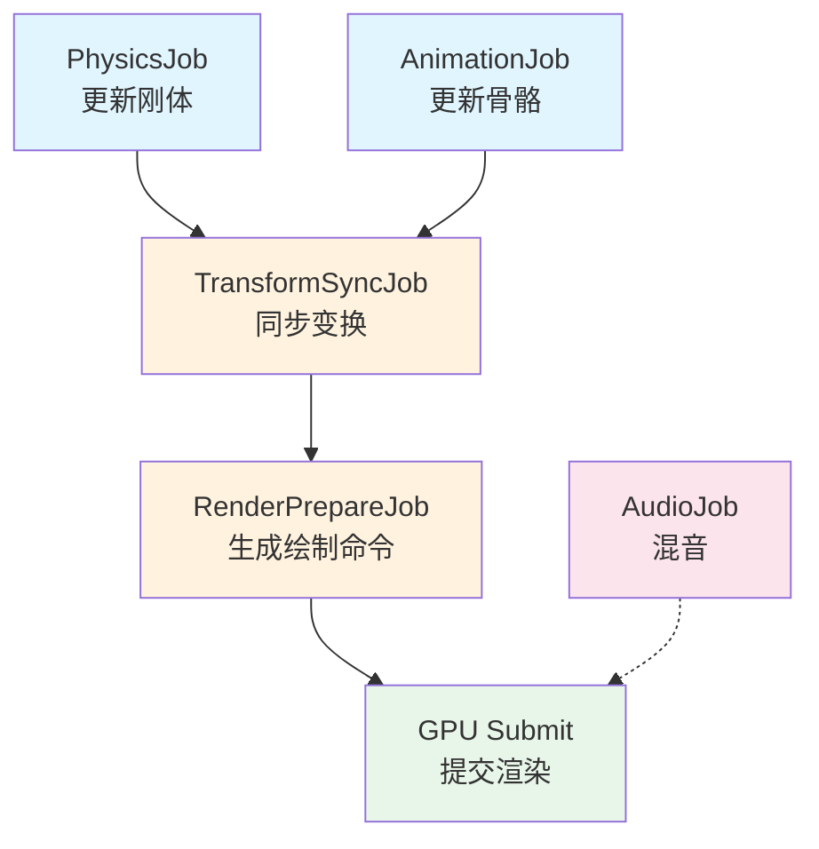
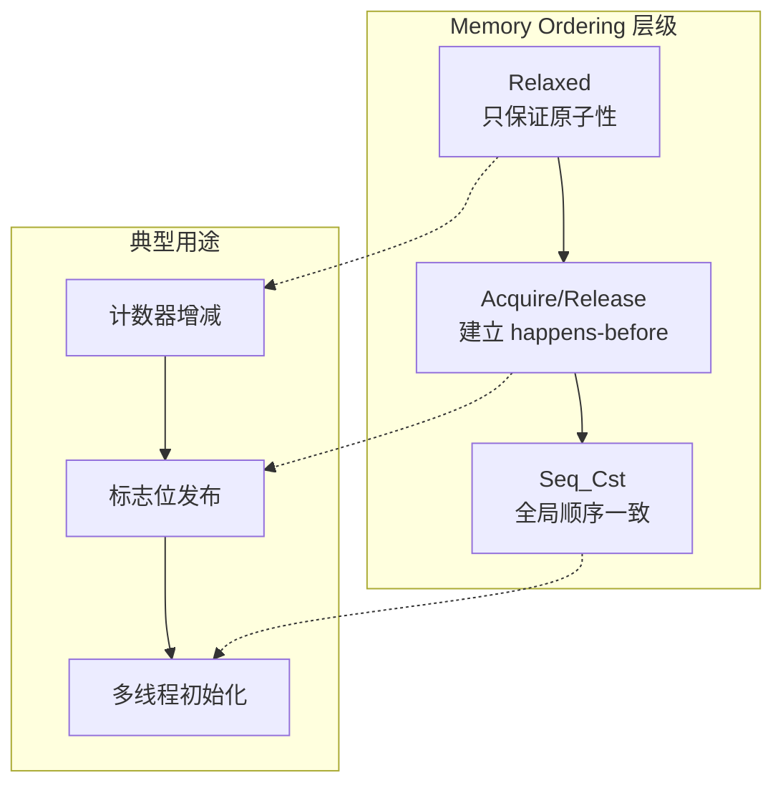
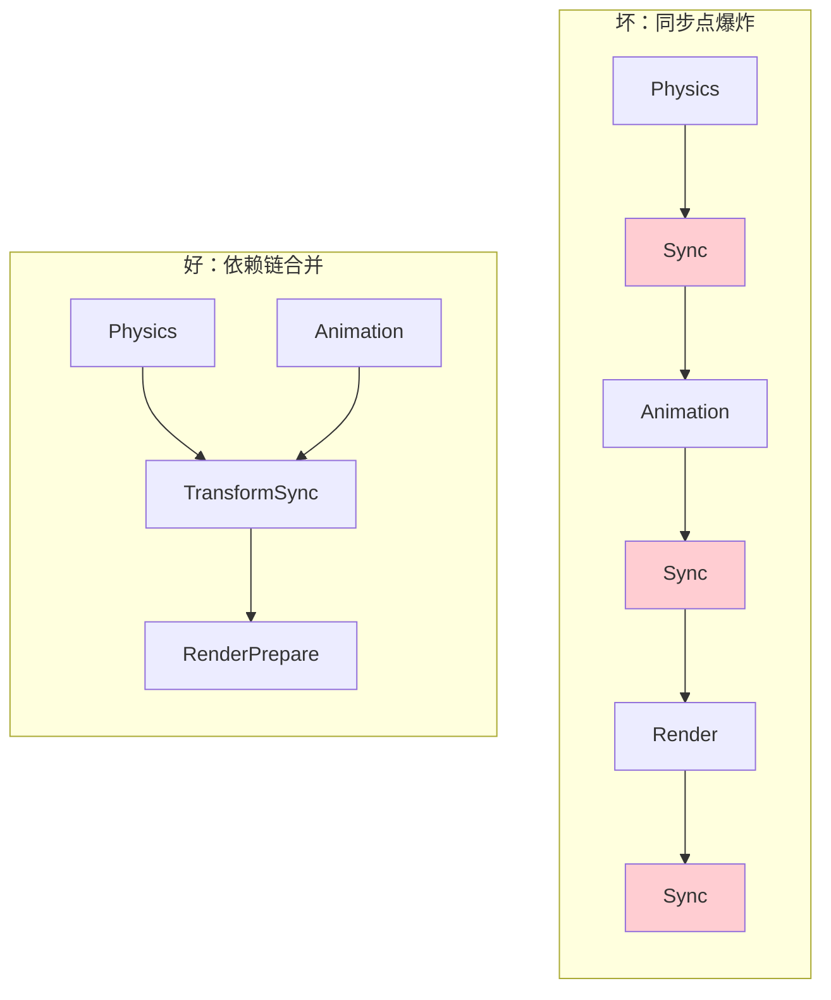

# 多线程与 Job 系统

> 所属计划: 游戏架构设计
> 预计耗时: 80min
> 前置知识: [[07-game-loop|第7章 游戏循环]]、[[28-data-oriented-design|第28章 面向数据设计 DoD]]

---

## 1. 概念讲解

### 为什么需要这个？

现代游戏面临一个残酷的算术题：60 FPS 意味着每帧只有 **16.6 毫秒**，而 120 FPS 仅 **8.3 毫秒**。与此同时，CPU 的物理核心数从 2005 年的单核/双核，增长到如今的 8 核、16 核甚至更多——但**单核性能的提升已趋近物理极限**。如果游戏逻辑继续跑在单线程上，就是在让 87.5% 的硅面积闲置（16 线程只跑 1 个）。

更紧迫的是，16.6 毫秒内要塞进越来越多的工作：游戏逻辑更新、物理模拟、动画蒙皮、AI 寻路、音频混音、资源流式加载、网络同步、渲染命令准备……这些任务天然具有不同的并行特征——物理模拟可以按区域分片，动画可以按角色并行，粒子更新可以 SIMD 向量化。继续让主线程串行执行，等于主动放弃性能预算。

[[07-game-loop|游戏循环]] 一章讨论了单线程循环的瓶颈；[[28-data-oriented-design|面向数据设计]] 一章展示了如何重组数据以获得缓存友好性。本章将两者结合：用 **Job/任务系统** 把数据友好的工作单元调度到多核上，同时保证**安全、可预测、无数据竞争**。

### 核心思想

#### Job 抽象：从线程到任务

传统多线程编程直接操作 `Thread` 或 `std::thread`，开发者负责创建、销毁、同步、避免死锁。Job 系统则引入一个中间抽象层：

> **Job** = 一段可调度的工作单元，包含：输入数据、执行函数、完成状态。
> **Job Graph** = 有向无环图（DAG），节点是 job，边是依赖关系。



图中的**关键路径**（A→C→D→E 或 B→C→D→E）决定了最短帧时间。Job 系统的调度器目标就是：在依赖约束下，最大化并行度，压缩关键路径长度。

#### 数据竞争与所有权：安全的并行根基

并行最大的敌人是**数据竞争（Data Race）**：两个线程同时访问同一内存，至少一个是写操作，且没有同步。具体分两种：

| 竞争类型 | 场景 | 后果 |
|---------|------|------|
| Write-Write | 两个线程同时写 `totalDamage += myDamage` | 丢失更新，结果小于预期 |
| Read-Write | 线程 A 读 `position`，线程 B 同时写 `position` | 读到撕裂值（torn read），逻辑错乱 |

C# Job System 的安全模型通过**编译期/运行期双重检查**解决此问题：
- `[ReadOnly]`：标记只读数据，调度器允许多 job 并发读
- `[WriteOnly]`：标记只写数据，确保无读者与之并行
- 未标记 = 读写，独占访问，其他 job 不能同时访问

这本质上是**所有权系统**的简化版——类似 Rust 的借用检查器，但由 Unity 的运行时强制执行（通过 `AtomicSafetyHandle`）。

C++ 引擎则通常采用更底层的策略：手动管理所有权、使用 `std::atomic`、或 lock-free 数据结构。

#### 无锁与原子：调度器的引擎

Job 系统的核心调度结构是 **work-stealing queue**：
- 每个工作线程有一个本地双端队列
- 自己生产的 job 压入队尾，自己消费队尾
- **空闲线程从其他线程的队头"偷取" job**，减少竞争

"偷取"操作必须是无锁（lock-free）的，否则 thief 线程与 owner 线程竞争锁，抵消并行收益。实现依赖**原子操作**：



- `memory_order_relaxed`：仅原子性，无顺序保证，用于单纯计数
- `memory_order_acquire`（读）+ `memory_order_release`（写）：形成**同步点**，确保 release 之前的写对 acquire 之后的读可见——这是 job 依赖实现的基础
- `memory_order_seq_cst`：最强一致性，但开销最大，通常用于初始化或调试

> **ABA 问题**：线程 T1 读取值 A，被中断；T2 将 A→B→A；T1 回来比较，发现还是 A，误以为没变化。无锁队列通常用**带标签的指针（tagged pointer）**或**双 CAS** 解决。

#### 帧预算并行：关键路径意识

不是"能并行就并行"。一帧的工作应按以下原则拆分：

1. **识别天然并行**：粒子更新、骨骼动画、遮挡剔除、纹理流式加载——无互相依赖，可并行
2. **估算关键路径**：用依赖图找出最长链，优化它（如将串行的物理→动画→渲染准备，改为动画与物理并行后同步）
3. **控制同步点**：每加一个 `Complete()`/`fence`，就是一次全局停顿。同步点爆炸会让并行退化为串行



#### 渲染与更新并行：时间上的解耦

最困难的并行是 **CPU 更新 vs GPU 渲染**，因为它们在不同时间尺度上工作：

| 方案 | 机制 | 延迟 |
|-----|------|------|
| 串行 | Update → Render → Present | 1 帧 |
| 双缓冲 | Update 写 `nextState`，Render 读 `prevState` | 1 帧 |
| 三缓冲 | 增加一个缓冲，减少 Render 等待 Update | 2-3 帧 |

核心机制是 **Fence（栅栏/围栏）**：
- **CPU Fence**：`JobHandle.Complete()` 或 `std::future::wait()`，CPU 线程等待 job 完成
- **GPU Fence**：`glFenceSync` / `ID3D12Fence` / `vkQueueSubmit` + `vkWaitForFences`，CPU 等待 GPU 完成某批命令
- **Frame Fence**：标记一帧的所有工作完成，允许交换缓冲

```mermaid
flowchart TD
    subgraph "Frame N"
        U[Update Thread<br/>写 nextState[N]] --> F1{Fence: UpdateDone}
        F1 --> R[Render Thread<br/>读 prevState[N]]
    end
    
    subgraph "Frame N+1"
        U2[Update Thread<br/>写 nextState[N+1]] --> F2{Fence: UpdateDone}
        F2 --> R2[Render Thread<br/>读 prevState[N+1]]
    end
    
    R -.->|"交换指针"| U2
    F1 -.->|"signal"| R
    F2 -.->|"signal"| R2
    
    style U fill:#e3f2fd
    style U2 fill:#e3f2fd
    style R fill:#f3e5f5
    style R2 fill:#f3e5f5
```

> 关键规则：**Render 阶段对状态只读，Update 对下一帧状态只写**。禁止交叉读写，否则回到数据竞争地狱。

---

## 2. 代码示例

以下示例展示 Unity C# Job System 的核心用法：并行的位置更新，以及 JobHandle 依赖组合。

```csharp
using Unity.Burst;
using Unity.Collections;
using Unity.Jobs;
using Unity.Mathematics;
using UnityEngine;

public class JobSystemDemo : MonoBehaviour
{
    // 实体数量
    const int Count = 10000;
    
    // 使用 NativeArray 而非托管数组，确保内存布局对 Burst 可见
    NativeArray<float3> positions;
    NativeArray<float3> velocities;
    NativeArray<float3> forces;

    void Start()
    {
        // Allocator.Persistent 用于跨帧存活的数据；短期数据用 TempJob
        positions = new NativeArray<float3>(Count, Allocator.Persistent);
        velocities = new NativeArray<float3>(Count, Allocator.Persistent);
        forces = new NativeArray<float3>(Count, Allocator.Persistent);
        
        // 初始化随机数据
        var random = new Unity.Mathematics.Random(12345);
        for (int i = 0; i < Count; i++)
        {
            positions[i] = random.NextFloat3(-100f, 100f);
            velocities[i] = random.NextFloat3(-10f, 10f);
            forces[i] = random.NextFloat3(-5f, 5f);
        }
    }

    void Update()
    {
        float dt = Time.deltaTime;

        // Job 1: 独立——根据力更新速度
        var applyForcesJob = new ApplyForcesJob
        {
            Forces = forces,
            Velocities = velocities,
            DeltaTime = dt
        }.Schedule(Count, 64); // 64 = 每个 batch 的元素数，影响粒度

        // Job 2: 独立——更新位置（但依赖 velocities 的最终值）
        // 注意：这里故意展示依赖组合，实际中若 MoveJob 需要新速度，必须等待 ApplyForcesJob
        var moveJob = new MoveJob
        {
            Velocities = velocities,
            Positions = positions,
            DeltaTime = dt
        }.Schedule(Count, 64);

        // 组合依赖：第三个 job 必须等前两个都完成
        JobHandle combinedDependency = JobHandle.CombineDependencies(applyForcesJob, moveJob);

        // Job 3: 依赖前两个——边界约束（示例：限制在球体内）
        var constrainJob = new ConstrainPositionJob
        {
            Positions = positions,
            MaxRadius = 200f
        }.Schedule(Count, 32, combinedDependency); // 传入依赖

        // 确保本帧结束前完成（实际游戏中应作为下一帧的依赖，而非 Complete）
        constrainJob.Complete();

        // 可选：将结果同步回 GameObject（仅演示，真实 ECS 中无需）
        // 这里仅验证运行
        if (Time.frameCount % 60 == 0)
        {
            float3 center = float3.zero;
            for (int i = 0; i < Count; i++) center += positions[i];
            center /= Count;
            Debug.Log($"Frame {Time.frameCount}: centroid = {center}");
        }
    }

    void OnDestroy()
    {
        // NativeArray 必须手动释放
        if (positions.IsCreated) positions.Dispose();
        if (velocities.IsCreated) velocities.Dispose();
        if (forces.IsCreated) forces.Dispose();
    }

    // ==================== Job 定义 ====================

    [BurstCompile] // 编译为 SIMD 优化的机器码
    struct ApplyForcesJob : IJobParallelFor
    {
        [ReadOnly] public NativeArray<float3> Forces;    // 只读：多线程安全并发读
        public NativeArray<float3> Velocities;            // 读写：独占访问
        
        public float DeltaTime;

        public void Execute(int index)
        {
            // F = ma, 假设质量为 1
            Velocities[index] += Forces[index] * DeltaTime;
        }
    }

    [BurstCompile]
    struct MoveJob : IJobParallelFor
    {
        [ReadOnly] public NativeArray<float3> Velocities;
        public NativeArray<float3> Positions;
        
        public float DeltaTime;

        public void Execute(int index)
        {
            Positions[index] += Velocities[index] * DeltaTime;
        }
    }

    [BurstCompile]
    struct ConstrainPositionJob : IJobParallelFor
    {
        public NativeArray<float3> Positions; // 读写
        
        public float MaxRadius;

        public void Execute(int index)
        {
            float3 pos = Positions[index];
            float lenSq = math.lengthsq(pos);
            if (lenSq > MaxRadius * MaxRadius)
            {
                Positions[index] = math.normalize(pos) * MaxRadius;
            }
        }
    }
}
```

**运行方式:**

```bash
# 在 Unity 2022.3 LTS 或更新版本中
# 1. 创建新场景，挂载 JobSystemDemo 脚本到任意 GameObject
# 2. 确保 Package Manager 中已安装：
#    - Burst (com.unity.burst)
#    - Collections (com.unity.collections)
#    - Mathematics (com.unity.mathematics)
# 3. 进入 Play Mode 运行
# 4. 观察 Console 输出与 Profiler 的 Timeline 视图

# 验证 Burst 编译：Window > Analysis > Burst Inspector
```

**预期输出:**

```text
Frame 60: centroid = float3(0.5, -1.2, 3.8)
Frame 120: centroid = float3(0.3, -0.9, 2.1)
...

# Profiler Timeline 视图应显示：
# - ApplyForcesJob 与 MoveJob 的 worker 线程条（可能重叠或顺序，取决于依赖）
# - ConstrainPositionJob 在前两者完成后开始
# 所有 job 显示 [Burst] 标签表示已编译
```

> **关键结构解析**：
> - `IJobParallelFor`：并行 for 循环抽象，`Execute(int index)` 被调度到多个 worker
> - `[ReadOnly]`/`[WriteOnly]`：安全标注，调度器据此验证依赖图
> - `NativeArray<T>`：非托管堆内存，Burst 可见，需手动 `Dispose`
> - `JobHandle.CombineDependencies`：合并多个前置依赖，形成 DAG 合并点
> - `Schedule(batchSize, dependency)`：batchSize 控制粒度，太小则调度开销大，太大则并行度不足

---

## 3. 练习

### 练习 1: 基础

创建 `VelocitiesJob` 与 `ForcesJob` 两个互相独立的 job，再用 `JobHandle.CombineDependencies` 把它们作为 `PositionsJob` 的前置依赖。解释为什么 `CombineDependencies` 比顺序调用 `Complete()` 更高效。

### 练习 2: 进阶

分析以下代码的数据竞争问题，并用两种方案修正：

```csharp
[BurstCompile]
struct DamageJob : IJobParallelFor
{
    public NativeArray<int> EnemyHealths;
    public int DamagePerHit;
    
    // 全局共享的累加器——危险！
    public static int totalDamage; // 注意：Burst 不支持 static，此处仅示意
    
    public void Execute(int index)
    {
        EnemyHealths[index] -= DamagePerHit;
        totalDamage += DamagePerHit; // 多线程同时读写！
    }
}
```

### 练习 3: 挑战（可选）

设计一个"更新-渲染分离"的最小模型：update job 写 `nextState`，render thread 读 `prevState`，中间用 fence 切换。要求：
- 使用双缓冲 `GameState[]`
- update 完成后 signal fence
- render thread wait fence 后交换指针
- 明确禁止哪些操作（交叉读写等）

---

## 3.5 参考答案

> [!tip]- 练习 1 参考答案
> ```csharp
> using Unity.Burst;
> using Unity.Collections;
> using Unity.Jobs;
> using Unity.Mathematics;
> 
> public class CombinedDependenciesExample
> {
>     public struct VelocitiesJob : IJobParallelFor
>     {
>         [ReadOnly] public NativeArray<float3> Forces;
>         public NativeArray<float3> Velocities;
>         public float DeltaTime;
>         
>         public void Execute(int index)
>         {
>             Velocities[index] += Forces[index] * DeltaTime;
>         }
>     }
>     
>     public struct ForcesJob : IJobParallelFor
>     {
>         [ReadOnly] public NativeArray<float3> Masses;
>         public NativeArray<float3> Forces;
>         public float DeltaTime;
>         
>         public void Execute(int index)
>         {
>             // 示例：根据质量重新计算力
>             Forces[index] = new float3(0, -9.8f, 0) * Masses[index];
>         }
>     }
>     
>     public struct PositionsJob : IJobParallelFor
>     {
>         [ReadOnly] public NativeArray<float3> Velocities;
>         public NativeArray<float3> Positions;
>         public float DeltaTime;
>         
>         public void Execute(int index)
>         {
>             Positions[index] += Velocities[index] * DeltaTime;
>         }
>     }
>     
>     public static JobHandle ScheduleChain(
>         NativeArray<float3> forces, NativeArray<float3> masses,
>         NativeArray<float3> velocities, NativeArray<float3> positions,
>         float dt, int count)
>     {
>         // 两个独立 job 同时调度
>         var velocitiesHandle = new VelocitiesJob
>         {
>             Forces = forces,
>             Velocities = velocities,
>             DeltaTime = dt
>         }.Schedule(count, 64);
>         
>         var forcesHandle = new ForcesJob
>         {
>             Masses = masses,
>             Forces = forces,
>             DeltaTime = dt
>         }.Schedule(count, 64);
>         
>         // 合并依赖：PositionsJob 必须等两者都完成
>         // 注意：这里假设 PositionsJob 需要新的 forces 和 velocities
>         // 实际语义需根据业务调整
>         JobHandle combined = JobHandle.CombineDependencies(velocitiesHandle, forcesHandle);
>         
>         var positionsHandle = new PositionsJob
>         {
>             Velocities = velocities,
>             Positions = positions,
>             DeltaTime = dt
>         }.Schedule(count, 64, combined); // 传入合并后的依赖
>         
>         return positionsHandle;
>     }
> }
> ```
> 
> **为什么 `CombineDependencies` 比顺序 `Complete()` 更高效：**
> 
> 顺序 `Complete()` 的伪代码：
> ```csharp
> velocitiesHandle.Complete(); // 阻塞等待，此时 forcesJob 可能也在跑，但本线程空转
> forcesHandle.Complete();     // 若 forcesJob 已完成，立即返回；否则继续等待
> // 现在才调度 PositionsJob
> ```
> 
> 问题：
> 1. **线程空转**：调用 `Complete()` 的线程阻塞等待，不能去做其他有用工作
> 2. **串行化**：即使两个 job 独立，也变成了"等 A 完 → 等 B 完 → 启动 C"的伪并行
> 3. **调度器失去全局视野**：调度器不知道 C 需要 A 和 B，无法优化 worker 分配
> 
> `CombineDependencies` 让调度器看到完整 DAG，A 和 B 可以真正并行跑在不同 worker 上，C 在最后一个完成的 worker 上立即启动，无额外同步开销。

> [!tip]- 练习 2 参考答案
> 
> **识别数据竞争：**
> 
> `totalDamage += DamagePerHit` 是典型的 **read-modify-write** 操作，在 CPU 层面分解为：
> 1. 读取 `totalDamage` 到寄存器
> 2. 寄存器 + `DamagePerHit`
> 3. 写回内存
> 
> 两个线程交错执行时：
> ```
> T1: 读 totalDamage=100
> T2: 读 totalDamage=100  (读到旧值！)
> T1: 写 100+10=110
> T2: 写 100+10=110  (T1 的更新丢失！)
> ```
> 结果应为 120，实际得到 110——**丢失更新（Lost Update）**。
> 
> **修正方案 A：原子操作（适合低竞争、必须全局立即可见）**
> 
> ```csharp
> using System.Threading; // Interlocked
> 
> // 注意：Burst 编译时不支持 Interlocked，需用 Unity.Collections 的原子包装
> // 或在主线程做归约。以下展示概念：
> 
> [BurstCompile]
> struct DamageJobAtomic : IJobParallelFor
> {
>     public NativeArray<int> EnemyHealths;
>     public int DamagePerHit;
>     
>     // 改用 NativeArray<int> 包装，配合 AtomicSafetyHandle 不安全
>     // 实际 Burst 方案：使用 Unity.Collections 的 NativeReference<int> + 自定义原子操作
>     // 或更简单地：不在 job 内累加，输出每元素 damage 后归约
>     
>     [NativeDisableParallelForRestriction] // 危险！仅用于特殊原子数组
>     public NativeArray<int> TotalDamageAtomic; // 假设底层支持
>     
>     public void Execute(int index)
>     {
>         EnemyHealths[index] -= DamagePerHit;
>         // Burst 下替代方案：使用 Unity.Mathematics 无直接原子支持
>         // 实际项目常用方案 B
>     }
> }
> 
> // 更实际的 Unity 方案：使用 NativeStream 或 EntityCommandBuffer 延迟应用
> // 或 Jobs 2.0 实验性的 NativeReference<T> 原子操作
> ```
> 
> **修正方案 B：局部累加 + 单线程归约（推荐，避免 cache line bouncing）**
> 
> ```csharp
> [BurstCompile]
> struct DamageJobLocal : IJobParallelFor
> {
>     public NativeArray<int> EnemyHealths;
>     public int DamagePerHit;
>     
>     // 每线程一个槽位，消除 false sharing
>     // 槽位数 = worker 线程数，通常 2 的幂次对齐到 cache line
>     [NativeDisableParallelForRestriction]
>     public NativeArray<int> PerThreadDamage;
>     
>     public void Execute(int index)
>     {
>         EnemyHealths[index] -= DamagePerHit;
>         
>         // 获取当前线程索引（Job System 提供）
>         int threadIndex = math.min(Unity.Jobs.LowLevel.Unsafe.JobsUtility.JobWorkerThreadIndex, 
>                                    PerThreadDamage.Length - 1);
>         PerThreadDamage[threadIndex] += DamagePerHit;
>     }
> }
> 
> // 主线程或后续 job 归约
> [BurstCompile]
> struct ReduceJob : IJob
> {
>     [ReadOnly] public NativeArray<int> PerThreadDamage;
>     public NativeArray<int> TotalDamage;
>     
>     public void Execute()
>     {
>         int sum = 0;
>         for (int i = 0; i < PerThreadDamage.Length; i++)
>             sum += PerThreadDamage[i];
>         TotalDamage[0] = sum;
>     }
> }
> ```
> 
> **方案 B 的优势：**
> - 每个线程写独立的 cache line，避免 **cache line bouncing**（多核反复使对方缓存失效）
> - 归约是 O(线程数) 而非 O(实体数)，开销极小
> - 完全 Burst 兼容，无原子操作开销

> [!tip]- 练习 3 参考答案
> 
> ```csharp
> using System.Threading;
> using Unity.Collections;
> using Unity.Jobs;
> using Unity.Mathematics;
> 
> // 极简双缓冲状态
> public struct GameState
> {
>     public NativeArray<float3> Positions;
>     public NativeArray<float3> Velocities;
>     // 其他状态...
> }
> 
> public class UpdateRenderSeparation
> {
>     GameState[] buffers; // 双缓冲：0 和 1
>     int writeIndex;      // update 写入的索引
>     int readIndex;       // render 读取的索引
>     
>     // 同步原语：manual reset event 作为 frame fence
>     ManualResetEventSlim updateDoneFence;
>     ManualResetEventSlim renderReadyFence;
>     
>     Thread renderThread;
>     bool running;
>     
>     public UpdateRenderSeparation(int entityCount)
>     {
>         buffers = new GameState[2];
>         for (int i = 0; i < 2; i++)
>         {
>             buffers[i] = new GameState
>             {
>                 Positions = new NativeArray<float3>(entityCount, Allocator.Persistent),
>                 Velocities = new NativeArray<float3>(entityCount, Allocator.Persistent)
>             };
>         }
>         
>         writeIndex = 0;
>         readIndex = 1; // 初始渲染读旧帧（或空）
>         
>         updateDoneFence = new ManualResetEventSlim(false);
>         renderReadyFence = new ManualResetEventSlim(true); // 初始允许 update
>         
>         running = true;
>         renderThread = new Thread(RenderLoop);
>         renderThread.Start();
>     }
>     
>     // 主线程 / Update 线程调用
>     public void UpdateFrame(float dt, IJobParallelFor updateJob)
>     {
>         // 等待 render 完成读取上一帧的 readIndex
>         renderReadyFence.Wait();
>         renderReadyFence.Reset();
>         
>         // 现在安全地写 writeIndex
>         GameState nextState = buffers[writeIndex];
>         
>         // 调度 update job 写 nextState
>         var handle = updateJob.Schedule(nextState.Positions.Length, 64);
>         handle.Complete(); // 确保 job 完成
>         
>         // Signal: update 完成，render 可以读取这一帧
>         updateDoneFence.Set();
>     }
>     
>     void RenderLoop()
>     {
>         while (running)
>         {
>             // 等待 update 完成
>             updateDoneFence.Wait();
>             updateDoneFence.Reset();
>             
>             // 交换指针：原子操作或简单赋值
>             // 注意：这里假设单 writer（update 线程）单 reader（render 线程）
>             int newReadIndex = writeIndex;  // 刚写完的变成可读
>             writeIndex = readIndex;          // 旧的读缓冲回收为写缓冲
>             readIndex = newReadIndex;
>             
>             GameState renderState = buffers[readIndex];
>             
>             // === RENDER 阶段：只读！ ===
>             // 生成渲染命令、提交 GPU、等等
>             // 严禁写 renderState 的任何字段！
>             GenerateRenderCommands(renderState);
>             
>             // Signal: render 完成读取，update 可以写下一帧
>             renderReadyFence.Set();
>         }
>     }
>     
>     void GenerateRenderCommands(GameState state)
>     {
>         // 只读访问：生成 DrawCall 参数
>         for (int i = 0; i < state.Positions.Length; i++)
>         {
>             float3 pos = state.Positions[i]; // 读，安全
>             // SubmitDraw(pos, ...);
>         }
>     }
>     
>     public void Dispose()
>     {
>         running = false;
>         updateDoneFence.Set(); // 唤醒 render thread 退出
>         renderThread.Join();
>         
>         foreach (var buf in buffers)
>         {
>             if (buf.Positions.IsCreated) buf.Positions.Dispose();
>             if (buf.Velocities.IsCreated) buf.Velocities.Dispose();
>         }
>         updateDoneFence.Dispose();
>         renderReadyFence.Dispose();
>     }
> }
> ```
> 
> **关键设计约束：**
> 
> | 操作 | 允许？ | 后果 |
> |-----|--------|------|
> Update 写 `buffers[writeIndex]` | ✅ 是 | 设计目的 |
> Update 读 `buffers[writeIndex]` | ⚠️ 谨慎 | 可能读到上一帧残留，需初始化 |
> Update 读 `buffers[readIndex]` | ❌ 禁止 | 与 Render 并发读，可能读到撕裂帧 |
> Render 读 `buffers[readIndex]` | ✅ 是 | 设计目的 |
> Render 写 `buffers[readIndex]` | ❌ 禁止 | 数据竞争！下一帧 update 可能同时写 |
> Render 读 `buffers[writeIndex]` | ❌ 禁止 | 读到未完成帧，画面闪烁 |
> 
> **Fence 语义对照：**
> - `renderReadyFence` = "render 已读完，write buffer 可用" → update 的 **acquire**
> - `updateDoneFence` = "update 已写完，read buffer 可用" → render 的 **acquire**
> 
> 这与 GPU 的 `vkAcquireNextImageKHR` / `vkQueueSubmit` + `vkWaitForFences` 模型同构。

> [!note] 答案使用方式
> 如果你的实现通过了测试或达到了题目要求，就是正确的。参考答案展示的是典型路径，不是唯一标准。练习 1 的依赖组合方式、练习 2 的局部累加策略、练习 3 的 fence 命名和具体同步原语均可根据目标平台调整（如用 `AutoResetEvent`、`SemaphoreSlim` 或 Unity 的 `JobHandle` 替代 `ManualResetEventSlim`）。核心要验证的是：无数据竞争、无死锁、满足 happens-before 关系。
>
> ---

## 4. 扩展阅读

- [Unity Manual — Job System](https://docs.unity3d.com/Manual/JobSystem.html): Unity 官方 Job System 文档，含调度、依赖、安全系统
- [Christian Gyrling — Parallelizing the Naughty Dog Engine Using Fibers (GDC Vault)](https://www.gdcvault.com/play/1022186/parallelizing-the-naughty-dog-engine): 主机引擎 fiber-based job system 经典演讲
- [Christian Gyrling — Parallelizing the Naughty Dog Engine (PDF slides)](https://media.gdcvault.com/gdc2015/presentations/Gyrling_Christian_Parallelizing_The_Naughty.pdf): 对应演讲幻灯片，含线程/fiber/job 设计图
- [Sebastian Schöner — Job Types in the Unity Job System](https://blog.s-schoener.com/2019-04-26-unity-job-zoo/): 对 Unity Job 类型、`[ReadOnly]`/`[WriteOnly]` 安全属性的深入解读

---

## 常见陷阱

- **裸访问共享可变状态**：job 内写全局静态字段是数据竞争高发区，应通过 `NativeArray`/`NativeQueue`/`NativeHashMap` 并标注 `[ReadOnly]`/`[WriteOnly]` 读写属性。正确做法：所有跨 job 数据流经 `NativeContainer`，让 Unity 的 `AtomicSafetyHandle` 在编辑期捕获竞争。

- **过度并行**：job 粒度太细（如每个元素一个 job，或 batchSize=1）导致调度开销、上下文切换、cache line 乒乓超过并行收益。正确做法：通过 Profiler 的 Timeline 视图测量，调整 `batchSize` 使每个 worker 执行 0.1-1ms 量级的工作；通常 batchSize 取 32-256，与数据大小和算法复杂度相关。

- **忽略 false sharing**：多个线程写的变量恰好落在同一 cache line（通常 64 字节），会触发大量缓存一致性流量，使多核性能倒退到单核水平。正确做法：按线程分配独立缓冲区，并用 `[StructLayout(LayoutKind.Explicit)]` 或填充（padding）确保关键计数器位于不同 cache line；如 `PerThreadDamage` 数组的大小应向上对齐到 `SystemInfo.processorCount` 的下一个 2 的幂次，并考虑 64 字节对齐。