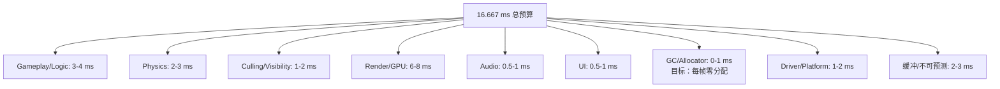

# 性能预算与性能驱动架构

> 所属计划: 游戏架构设计
> 预计耗时: 70min
> 前置知识: [[07-game-loop|第7章 游戏循环]], [[28-data-oriented-design|第28章 面向数据设计 DoD]]

---

## 1. 概念讲解

### 为什么需要这个？

游戏开发中有一个经典陷阱：项目前期大家畅快地写功能，等到集成测试时才发现帧率暴跌，然后陷入"打地鼠式优化"——今天修这里，明天那里又崩，最终代码被改得千疮百孔。性能预算（Performance Budget）的存在，就是为了在**架构层面**预防这个问题。

帧时间是硬约束。60 fps 意味着每帧必须在 **16.667 ms** 内完成全部工作；30 fps 则是 **33.333 ms**。这不是"建议"，而是物理现实——超过这个阈值，玩家就会看到卡顿、输入延迟、眩晕。更残酷的是，这个预算还要被 VSync（垂直同步）进一步收紧：如果一帧错过了显示器的刷新时间点，它必须等待下一个周期，造成视觉上的"跳帧"。

性能预算的本质是**把帧时间当作有限资源进行分配**，就像项目有资金预算一样。没有预算的优化是盲目的，而有预算的架构决策才是可衡量的。

### 核心思想

**1. 帧预算的数学基础**

| 目标帧率 | 帧时间预算 | 常见应用场景 |
| --- | --- | --- |
| 120 fps | 8.333 ms | 竞技射击、VR |
| 60 fps | 16.667 ms | 主流动作游戏 |
| 30 fps | 33.333 ms | 开放世界、复杂模拟 |
| 24 fps | 41.667 ms | 电影式叙事（罕见） |

VSync 与 frame pacing 的关系：开启 VSync 时，GPU 完成渲染后必须等待下一次屏幕刷新才能 present。如果 GPU 在 16 ms 时完成，但刷新在 16.667 ms，则实际 present 等待约 0.667 ms；如果 GPU 在 17 ms 完成，则必须等待至 33.333 ms，**一帧的微小超支导致两倍的视觉延迟**。这就是 frame pacing 工具（如 Android's Frame Pacing API、Swappy）存在的原因——它们通过动态调整呈现时间来平滑这种抖动。

**2. 预算分配：谁拿多少？**

一个典型的 60 fps 帧预算分配（非 VR，中等复杂度场景）：



关键洞察：**Render 通常占最大头**，但 CPU 端的 gameplay 和 physics 最容易失控——因为它们由开发者代码直接驱动，而 GPU 时间部分受驱动和硬件抽象层缓冲。

**3. Profiling 驱动设计：先测量，再动刀**

Donald Knuth 的名言"过早优化是万恶之源"在游戏开发中有个精确版本：**无 profiling 的优化不仅是过早的，几乎总是错误的**。人类直觉对性能瓶颈的判断准确率极低，因为现代计算机的内存层次、分支预测、指令级并行远超直觉范围。

工具分层：

| 工具 | 适用层级 | 核心能力 | 典型场景 |
| --- | --- | --- | --- |
| Unity Profiler | 引擎/脚本 | 函数级 CPU 时间、GC 分配、GPU 时间 | 快速迭代，脚本热点 |
| Superluminal | 原生/C++ | 采样精度高，内核态/用户态完整 | 引擎底层，Windows 原生 |
| Tracy | 跨平台/C++ | 帧级时间线，多线程可视化，低开销 | 自研引擎，长期监控 |
| RenderDoc | GPU | 单帧抓帧，draw call 拆解，shader 调试 | 渲染异常，GPU 瓶颈 |
| PIX | DirectX 12 | GPU 时间线，内存分配，着色器性能计数器 | Xbox/PC D3D12 优化 |

**4. 火焰图与热路径：读懂性能的语言**

火焰图（Flame Graph）是性能分析的通用可视化。Y 轴是调用栈深度，X 轴是样本数（或时间），颜色通常无意义。

两个核心指标：

- **Self time（自身时间）**：函数体本身执行的时间，不包括子调用。高 self time = 函数本身有计算热点。
- **Total time（总时间）**：函数及其所有子调用的累计时间。高 total time = 函数处于热路径上，可能是"被调用太多次"或"调用链太深"。

区分"被调用多"与"单次重"是架构决策的关键：

| 模式 | 症状 | 架构对策 |
| --- | --- | --- |
| 被调用多 | self time 低，total time 高，调用次数极大 | 减少调用频率（事件驱动替代轮询）、批处理、空间分区减少查询 |
| 单次重 | self time 高，调用次数少 | 算法优化、SIMD、缓存友好布局（见 [[28-data-oriented-design]]） |
| 两者兼具 | 灾难 | 需要重构数据流，可能涉及系统边界调整 |

**5. 内存带宽与分配预算：隐形的帧时间杀手**

CPU 优化了，帧时间仍不稳？检查内存：

- **CPU-GPU 带宽**：每帧上传的纹理、顶点缓冲区、uniform 数据。移动端尤其敏感——LPDDR 带宽是共享的，CPU 和 GPU 争用。
- **GC 压力**：.NET/Unity 中，每帧分配触发 GC 的时机不可预测。目标应是**每帧零托管分配**，通过对象池、struct、值类型数组实现。
- **缓存未命中**：DoD 的核心论点——随机内存访问的代价是连续访问的 10-100 倍。

**6. 性能驱动的架构流程**

```
设定预算 → 原型实现 → Profile → 对比预算 → 回归/重构 → 迭代
```

关键实践：

- **P95/P99 帧时间 > 平均帧时间**：平均 16 ms 但 P99 为 50 ms 的游戏，玩家体验是"频繁卡顿"。性能回归测试应断言 P95，而非均值。
- **自动采集与断言**：CI 中运行固定场景，记录帧时间序列，若 P95 超过预算阈值则构建失败。

**7. 性能回归与 CI**

现代实践将性能测试纳入持续集成：

- 固定场景（deterministic replay 或 scripted camera path）
- 多硬件配置的云真机/虚拟机
- 帧时间、GPU 时间、内存分配的自动采集
- 与基线对比，生成趋势图
- 超阈值时：阻断构建 + 生成火焰图附件 + 自动 bisect 定位回归提交

---

## 2. 代码示例

实现一个 C# 控制台帧预算追踪器，模拟一帧内多个子系统的耗时监测，自动标记超预算模块。采用 `IDisposable` 模式实现作用域计时，支持嵌套和并发类别累加。

```csharp
using System;
using System.Collections.Generic;
using System.Diagnostics;
using System.Threading;

// ============================================
// 帧预算追踪器：模拟多子系统性能监控
// 运行环境: .NET 6+ 控制台（或 Unity）
// 无外部依赖
// ============================================

/// <summary>
/// 单个子系统的预算追踪器，使用 IDisposable 实现作用域计时
/// </summary>
class FrameBudgetTracker : IDisposable
{
    private readonly string _name;
    private readonly double _budgetMs;
    private readonly Stopwatch _sw;
    private readonly Action<string, double, double, bool> _onComplete;

    public FrameBudgetTracker(string name, double budgetMs, Action<string, double, double, bool> onComplete = null)
    {
        _name = name;
        _budgetMs = budgetMs;
        _onComplete = onComplete;
        _sw = Stopwatch.StartNew();
    }

    public void Dispose()
    {
        double elapsed = _sw.Elapsed.TotalMilliseconds;
        bool exceeded = elapsed > _budgetMs;
        string status = exceeded ? "OVER BUDGET" : "OK";
        
        Console.WriteLine($"[{status}] {_name}: {elapsed:F3}ms / {_budgetMs:F3}ms (delta: {elapsed - _budgetMs:F3}ms)");
        
        _onComplete?.Invoke(_name, elapsed, _budgetMs, exceeded);
    }
}

/// <summary>
/// 整帧统筹：收集各子系统数据，计算总预算使用率
/// </summary>
class FrameBudget
{
    private readonly double _totalBudgetMs;
    private readonly Dictionary<string, double> _budgets = new();
    private readonly Dictionary<string, double> _actuals = new();
    private readonly List<string> _violations = new();

    public FrameBudget(double totalBudgetMs)
    {
        _totalBudgetMs = totalBudgetMs;
    }

    public void RegisterSubsystem(string name, double budgetMs)
    {
        _budgets[name] = budgetMs;
    }

    public FrameBudgetTracker Track(string name)
    {
        if (!_budgets.ContainsKey(name))
            throw new ArgumentException($"未注册子系统: {name}");
        
        return new FrameBudgetTracker(name, _budgets[name], OnSubsystemComplete);
    }

    private void OnSubsystemComplete(string name, double actual, double budget, bool exceeded)
    {
        _actuals[name] = actual;
        if (exceeded) _violations.Add(name);
    }

    public void PrintSummary()
    {
        double totalActual = 0;
        foreach (var kvp in _actuals)
        {
            totalActual += kvp.Value;
        }

        Console.WriteLine("\n=== 帧预算总结 ===");
        Console.WriteLine($"总预算: {_totalBudgetMs:F3}ms | 实际使用: {totalActual:F3}ms | 利用率: {100 * totalActual / _totalBudgetMs:F1}%");
        
        if (_violations.Count > 0)
        {
            Console.WriteLine($"超预算模块: {string.Join(", ", _violations)}");
        }
        else
        {
            Console.WriteLine("所有模块在预算内");
        }
        
        // 检查总预算
        if (totalActual > _totalBudgetMs)
        {
            Console.WriteLine($"[CRITICAL] 整帧超预算 {totalActual - _totalBudgetMs:F3}ms!");
        }
    }
}

class Program
{
    static void Main(string[] args)
    {
        // 模拟 60fps 场景：总预算 16.667ms
        var frame = new FrameBudget(16.667);
        
        // 注册各子系统预算
        frame.RegisterSubsystem("Update", 4.0);
        frame.RegisterSubsystem("Physics", 3.0);
        frame.RegisterSubsystem("Render", 7.0);
        frame.RegisterSubsystem("Audio", 1.0);
        frame.RegisterSubsystem("UI", 1.5);

        Console.WriteLine("=== 模拟帧开始 ===\n");

        // Update: 模拟正常 gameplay 逻辑
        using (frame.Track("Update"))
        {
            SimulateWorkload(2.5); // 2.5ms 工作
        }

        // Physics: 模拟较重负载（故意超预算演示）
        using (frame.Track("Physics"))
        {
            SimulateWorkload(4.2); // 4.2ms > 3.0ms 预算
        }

        // Render: 模拟正常渲染
        using (frame.Track("Render"))
        {
            SimulateWorkload(5.5);
        }

        // Audio: 快速完成
        using (frame.Track("Audio"))
        {
            SimulateWorkload(0.3);
        }

        // UI: 模拟轻微超支
        using (frame.Track("UI"))
        {
            SimulateWorkload(1.8); // 1.8ms > 1.5ms 预算
        }

        frame.PrintSummary();
    }

    // 用自旋等待模拟 CPU 工作负载（比 Thread.Sleep 更精确）
    static void SimulateWorkload(double milliseconds)
    {
        var sw = Stopwatch.StartNew();
        while (sw.Elapsed.TotalMilliseconds < milliseconds)
        {
            // 自旋等待，模拟 CPU 计算
            for (int i = 0; i < 1000; i++) { }
        }
    }
}
```

**运行方式:**

```bash
# .NET 6+ 控制台
dotnet new console -n BudgetTracker
# 将上述代码复制到 Program.cs
dotnet run

# 或使用单文件执行
dotnet run --property:OutputType=Exe
```

**预期输出:**

```text
=== 模拟帧开始 ===

[OK] Update: 2.512ms / 4.000ms (delta: -1.488ms)
[OVER BUDGET] Physics: 4.203ms / 3.000ms (delta: 1.203ms)
[OK] Render: 5.498ms / 7.000ms (delta: -1.502ms)
[OK] Audio: 0.301ms / 1.000ms (delta: -0.699ms)
[OVER BUDGET] UI: 1.801ms / 1.500ms (delta: 0.301ms)

=== 帧预算总结 ===
总预算: 16.667ms | 实际使用: 14.315ms | 利用率: 85.9%
超预算模块: Physics, UI
```

---

## 3. 练习

### 练习 1: 基础

为示例中的 Physics、Render、Audio 分别设置预算并在 `using` 块中包裹它们，运行后指出哪个子系统最先超预算。修改 `SimulateWorkload` 的参数，使 Physics 持续超预算，讨论应对策略。

### 练习 2: 进阶

实现一个"预算感知 LOD"系统：当 Render 模块耗时超过预算时，下一帧自动减少 draw call 数量。要求：
- 维护 `RenderBudgetExceeded` 标志与 `CurrentLodLevel` 状态
- 使用上一帧的计时数据决定下一帧的 LOD，避免同帧反馈抖动
- 提供 `SetLodLevel(int level)` 与 `GetRecommendedLodLevel()` 接口

### 练习 3: 挑战（可选）

实现一个每帧内存分配计数器：
- 使用 `GC.GetTotalMemory(false)` 在帧开始与结束记录托管堆差值
- 若超过阈值（如 1024 bytes/帧）则告警
- 讨论如何引导到对象池或 arena allocator 以消除临时分配

---

## 3.5 参考答案

> [!tip]- 练习 1 参考答案
> ```csharp
> // 修改后的 Main 方法，Physics 持续超预算
> static void Main(string[] args)
> {
>     var frame = new FrameBudget(16.667);
>     frame.RegisterSubsystem("Update", 4.0);
>     frame.RegisterSubsystem("Physics", 3.0);   // 预算 3ms
>     frame.RegisterSubsystem("Render", 7.0);
>     frame.RegisterSubsystem("Audio", 1.0);
> 
>     // 模拟多帧
>     for (int frameNum = 0; frameNum < 3; frameNum++)
>     {
>         Console.WriteLine($"\n--- Frame {frameNum} ---");
>         
>         using (frame.Track("Update"))
>             SimulateWorkload(2.0);
>         
>         using (frame.Track("Physics"))
>             SimulateWorkload(5.0);  // 持续 5ms > 3ms，超预算
>         
>         using (frame.Track("Render"))
>             SimulateWorkload(4.0);
>         
>         using (frame.Track("Audio"))
>             SimulateWorkload(0.2);
>     }
>     
>     // Physics 最先且持续超预算
>     // 应对策略：
>     // 1. 降低物理迭代次数：Physics.fixedTimestep 从 0.02 改为 0.03
>     // 2. 分帧处理：将物理对象分批，奇偶帧分别更新
>     // 3. 简化碰撞体：用 sphere 替代 mesh collider
>     // 4. 空间分区：减少 Broad Phase 碰撞对数量
> }
> ```
> 关键观察：最先超预算的是 Physics（如果按代码顺序执行）。持续超预算表明架构级调整比微优化更有效——降低迭代次数或分帧是 O(1) 的改进，而优化单个碰撞检测是 O(n) 的挣扎。

> [!tip]- 练习 2 参考答案
> ```csharp
> /// <summary>
> /// 预算感知 LOD 管理器：用上一帧数据决定下一帧
> /// </summary>
> class BudgetAwareLodManager
> {
>     private readonly double _renderBudgetMs;
>     private double _lastFrameRenderTime;
>     private bool _renderBudgetExceeded;
>     private int _currentLodLevel; // 0=最高, 增大=降低
>     private readonly int _maxLodLevel;
>     
>     // 防抖：连续超预算才提升 LOD，避免单帧 spike 导致画质骤降
>     private int _consecutiveExceededFrames;
>     private const int EXCEED_THRESHOLD = 2; // 连续 2 帧才降级
> 
>     public BudgetAwareLodManager(double renderBudgetMs, int maxLodLevel = 3)
>     {
>         _renderBudgetMs = renderBudgetMs;
>         _maxLodLevel = maxLodLevel;
>     }
> 
>     /// <summary>在帧结束时调用，传入实际渲染耗时</summary>
>     public void ReportFrameTime(double actualMs)
>     {
>         _lastFrameRenderTime = actualMs;
>         
>         if (actualMs > _renderBudgetMs)
>         {
>             _consecutiveExceededFrames++;
>             if (_consecutiveExceededFrames >= EXCEED_THRESHOLD)
>             {
>                 _renderBudgetExceeded = true;
>                 _currentLodLevel = Math.Min(_currentLodLevel + 1, _maxLodLevel);
>                 _consecutiveExceededFrames = 0; // 重置，避免连续跳多级
>             }
>         }
>         else
>         {
>             _consecutiveExceededFrames = 0;
>             // 预算充裕时，缓慢恢复画质（可选）
>             if (_currentLodLevel > 0 && actualMs < _renderBudgetMs * 0.7)
>             {
>                 _currentLodLevel--;
>             }
>             _renderBudgetExceeded = false;
>         }
>     }
> 
>     public int GetRecommendedLodLevel() => _currentLodLevel;
>     public bool WasBudgetExceeded() => _renderBudgetExceeded;
>     
>     /// <summary>外部系统查询当前应使用的 draw call 数量</summary>
>     public int GetDrawCallBudget(int baseDrawCalls)
>     {
>         // LOD 每升一级，draw call 减少约 30%
>         double multiplier = Math.Pow(0.7, _currentLodLevel);
>         return (int)(baseDrawCalls * multiplier);
>     }
> }
> 
> // 使用方式（在 FrameBudgetTracker 的回调中集成）：
> var lodManager = new BudgetAwareLodManager(7.0);
> 
> // ... 在帧结束时 ...
> lodManager.ReportFrameTime(renderActualTime);
> int lod = lodManager.GetRecommendedLodLevel();
> // 下一帧根据 lod 设置场景细节
> ```
> 核心设计决策：
> 1. **一帧延迟**：必须用 `_lastFrameRenderTime` 决定本帧 LOD，不能同帧反馈——否则渲染到一半改设置会导致不一致
> 2. **防抖阈值**：`EXCEED_THRESHOLD` 避免单帧 spike（如 shader 编译）导致画质骤降
> 3. **缓慢恢复**：只有持续低于预算的 70% 才降级 LOD，避免 LOD 频繁跳变造成视觉闪烁

> [!tip]- 练习 3 参考答案
> ```csharp
> /// <summary>
> /// 每帧内存分配监控器
> /// </summary>
> class FrameAllocationTracker
> {
>     private readonly long _thresholdBytes;
>     private long _frameStartBytes;
>     private long _lastFrameAllocation;
> 
>     public FrameAllocationTracker(long thresholdBytes = 1024)
>     {
>         _thresholdBytes = thresholdBytes;
>     }
> 
>     public void BeginFrame()
>     {
>         // false = 不强制 GC，测量真实分配压力
>         _frameStartBytes = GC.GetTotalMemory(false);
>     }
> 
>     public void EndFrame()
>     {
>         long endBytes = GC.GetTotalMemory(false);
>         _lastFrameAllocation = endBytes - _frameStartBytes;
>         
>         if (_lastFrameAllocation > _thresholdBytes)
>         {
>             Console.WriteLine($"[ALLOC ALERT] 本帧分配 {_lastFrameAllocation} bytes，超过阈值 {_thresholdBytes} bytes");
>         }
>     }
> 
>     public long LastFrameAllocation => _lastFrameAllocation;
> }
> 
> // 进阶：结合对象池消除分配
> class PooledList<T>
> {
>     private static readonly Stack<List<T>> _pool = new();
>     
>     public static List<T> Rent()
>     {
>         if (_pool.Count > 0) return _pool.Pop();
>         return new List<T>(64); // 预分配容量
>     }
>     
>     public static void Return(List<T> list)
>     {
>         list.Clear(); // 保留容量，清除引用
>         _pool.Push(list);
>     }
> }
> 
> // Arena Allocator 模式（适用于帧级临时数据）
> class FrameArena
> {
>     private byte[] _buffer;
>     private int _offset;
>     
>     public FrameArena(int capacity = 65536)
>     {
>         _buffer = new byte[capacity];
>     }
>     
>     public Span<T> Allocate<T>(int count) where T : struct
>     {
>         int size = System.Runtime.InteropServices.Marshal.SizeOf<T>() * count;
>         if (_offset + size > _buffer.Length)
>             throw new InvalidOperationException("Arena 溢出，需增大容量或分帧");
>         
>         var span = System.Runtime.InteropServices.MemoryMarshal.Cast<byte, T>(
>             _buffer.AsSpan(_offset, size));
>         _offset += size;
>         return span;
>     }
>     
>     public void Reset() => _offset = 0; // 整帧结束时一次性重置，零分配
> }
> ```
> 关键要点：
> - `GC.GetTotalMemory(false)` 的 `false` 至关重要——强制 GC 会掩盖真实的分配模式
> - 对象池的 `Return` 必须 `Clear()` 但不 `TrimExcess()`，保留容量供复用
> - Arena allocator 是 DoD 的核心工具：一帧内所有临时数据从预分配 buffer 切片，帧末 `Reset()` 即"释放"，对 GC 完全不可见

> [!note] 答案使用方式
> 如果你的实现通过了测试或达到了题目要求，就是正确的。参考答案展示的是**一种可行路径**，而非唯一标准。特别地：
> - 练习 2 的 LOD 降级策略可以有多种变体（如基于距离的 LOD 与基于预算的 LOD 混合）
> - 练习 3 的 arena allocator 在 C++ 中更常见（`LinearAllocator`），C# 中需借助 `Span<T>` 和 `unsafe` 或 `MemoryMarshal` 实现零拷贝
> - 核心验收标准：是否避免了同帧反馈、是否消除了每帧 GC 压力、是否有明确的预算阈值与告警机制
>
> ---

## 4. 扩展阅读

- [Noel Llopis — Backwards is Forward: Making Better Games with Test-Driven Development](https://gamesfromwithin.com/backwards-is-forward-making-better-games-with-test-driven-development): 虽然主题是 TDD，但作者同时是游戏性能与预算管理的早期倡导者，文风适合游戏开发者
- [Noel Llopis — Data-Oriented Design](https://gamesfromwithin.com/data-oriented-design): DoD 与性能预算紧密相关，是同一时期同一作者的核心文章
- [Tracy Profiler (GitHub)](https://github.com/wolfpld/tracy): 现代游戏常用的帧级/任务级采样分析器，支持多线程与 GPU
- [Unity Profiler documentation](https://docs.unity3d.com/Manual/Profiler.html): Unity 官方性能分析文档，含 CPU/GPU/Memory 视图

---

## 常见陷阱

- **无 profiling 的"premature optimization"**：凭直觉改热路径往往改错地方。正确做法：先用火焰图确认 self time 最高的函数，再评估其优化潜力（算法复杂度 vs 常数因子）
- **只看平均帧时间**：99 分位帧时间（P99）spikes 才是玩家卡顿的真实来源。正确做法：性能回归测试断言 P95/P99，均值仅作参考；报告帧时间分布直方图而非单点数值
- **忽视内存带宽与分配**：优化了 CPU 计算却引入大量 `new` 或纹理上传，帧时间仍然不稳。正确做法：将内存分配纳入预算体系，每帧目标零托管分配；profile 时同时监控 CPU 时间、GPU 时间、内存带宽占用三条线