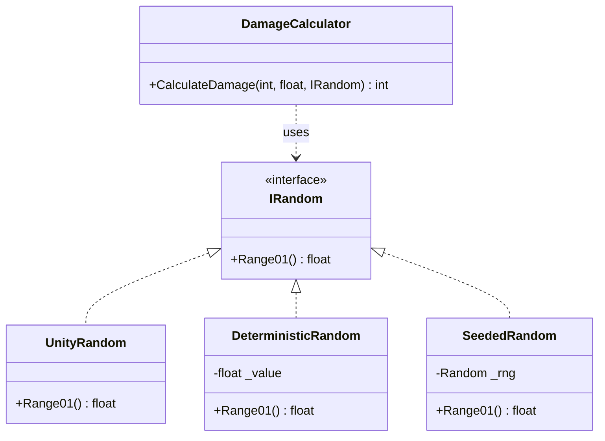
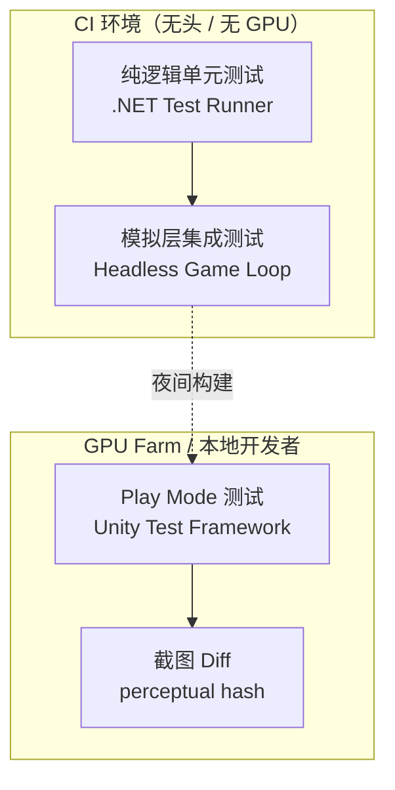
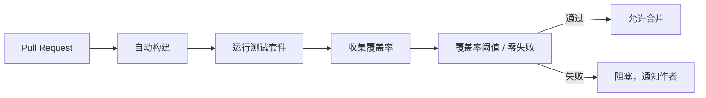

# 游戏架构测试

> 所属计划: 游戏架构设计
> 预计耗时: 75min
> 前置知识: [[14-event-driven-architecture|14. 事件驱动游戏架构]], [[15-service-locator-singletons|15. Service Locator 与 Singleton 替代]]

---

## 1. 概念讲解

游戏开发长期被视为"难以测试"的领域——渲染管线依赖 GPU、物理模拟依赖时间步、AI 行为带有随机性，这些似乎都在抗拒自动化测试。然而，测试不是奢侈品，而是架构健康的氧气：它让重构成为可能，让多人协作有安全网，让 CI 能在大合并前拦截回归。本章的核心命题是：**可测试性不是事后补丁，而是架构设计的一级约束**。我们将从游戏测试金字塔出发，逐层建立策略，最终让测试融入开发节奏。

### 为什么需要这个？

游戏系统的特殊性放大了传统软件测试的痛点：

| 痛点 | 根因 | 后果 |
| --- | --- | --- |
| 测试启动慢 | `MonoBehaviour` 依赖 Unity 引擎初始化 | 开发者逃避运行测试 |
| 结果不稳定 | 使用 `Time.deltaTime` 和 `Random.Range` |  flaky test，信任崩塌 |
| 耦合黑洞 | 伤害计算直接读全局 `GameManager.Instance` | 无法独立验证规则 |
| 回归难发现 | 关卡数值调整无自动校验 | 平衡性崩坏流入生产 |
| CI 阻塞 | 测试需要渲染窗口 | 服务器无法执行 |

这些痛点的共同模式是：**业务逻辑与运行时环境纠缠在一起**。我们在 [[03-coupling-cohesion-di|第3章]] 讨论过依赖注入（DI）解耦模块，在 [[15-service-locator-singletons|第15章]] 批判了 `ServiceLocator` 的隐藏耦合——测试正是这些设计原则最直接的消费者。一个为测试而设计的架构，往往也是更清晰、更模块化的架构。

### 核心思想

#### 1. 游戏测试金字塔

传统测试金字塔（大量单元测试、少量集成测试、极少 E2E）在游戏领域需要变形：

```
        /\
       /  \  少量高保真场景测试
      /____\  (Play Mode / 截图 diff / GPU farm)
     /      \
    /        \  适量集成/系统测试
   /__________\  (子系统交互、事件总线、存档加载)
  /            \
 /              \  大量快速单元测试
/________________\  (纯逻辑、无引擎、毫秒级)
```

**单元测试**覆盖规则引擎、状态机、伤害公式、AI 决策评分——这些在 [[05-domain-modeling|第5章]] 中识别的领域核心。它们不触碰 `UnityEngine` 命名空间，在 .NET 测试运行器中几秒内完成。

**集成测试**验证子系统契约：事件总线是否按序投递？存档序列化后反序列化是否保持状态？服务定位器替换实现后，旧消费者是否仍工作？

**场景/Play Mode 测试**保留给"只有跑起来才知道"的领域：摄像机碰撞、动画过渡手感、粒子视觉效果。这些测试昂贵，所以必须精确定位——用 [[30-performance-budgets|第30章]] 的预算思维管理测试成本。

#### 2. 依赖注入提升可测试性

测试的核心技术是**控制依赖**。不是控制 `GameManager.Instance`，而是控制 `IRandom`、`IInputProvider`、`IAssetLoader` 的行为：



生产环境注入 `UnityRandom`（封装 `UnityEngine.Random`），测试注入 `DeterministicRandom`（固定返回值）或 `SeededRandom`（固定种子）。接口隔离让"随机"不再是不可控的混沌，而是可编排的剧本。

#### 3. 确定性测试

游戏天然包含随机性和时间依赖性，但测试必须**可重复**。确定性策略：

| 领域 | 非确定性来源 | 确定性替代 |
| --- | --- | --- |
| 随机数 | `System.Random()` / `UnityEngine.Random` | 注入 `IRandom`，测试用固定种子或固定值 |
| 时间步 | `Time.deltaTime` 帧间波动 | 固定 `dt` 参数，或注入 `ITimeProvider` |
| 浮点 | 不同平台 `Mathf.Sqrt` 精度差异 | 使用 `double` 或容差断言 `Assert.InRange` |
| 迭代顺序 | `Dictionary` / `GetComponentsInChildren` | 显式排序或改用 `SortedDictionary` |
| 存档 | `DateTime.Now` 写入存档 | 注入 `IDateTimeProvider` |

确定性不是消除随机，而是**将随机来源参数化**。这在 [[27-networking-netcode|第27章]] 的回放同步和 [[24-serialization-save|第24章]] 的存档一致性中同样关键——同一套机制服务多个质量属性。

#### 4. 快照测试（Snapshot Testing）

对复杂、易变但结构化的输出，维护断言是维护负担。快照测试捕获"golden"状态，后续自动 diff：

- **关卡结果**：通关时间、收集品数量、敌人击杀数
- **UI 布局**：分辨率适配后的元素坐标
- **序列化存档**：二进制/JSON 的字节级或结构化对比

工具链可选：Verify (xUnit) 用于 .NET，Jest snapshot 用于 Node.js 工具链，或自定义 `Assert.Equal(goldenBytes, actualBytes)`。

#### 5. 头less/Play Mode 测试分层



**模拟层（Simulation Layer）**是架构的关键分割点：不依赖渲染的游戏状态更新（位置积分、碰撞检测、规则触发）提取为纯 C# 库，在 CI 中无头运行。渲染层（[[19-rendering-pipeline|第19章]]）的测试降级为视觉回归，仅在 GPU 可用时执行。

#### 6. 单元测试 vs `MonoBehaviour`

Unity 的 `MonoBehaviour` 是测试的敌人：它隐含 `GameObject` 生命周期、`Start`/`Update` 的引擎调度、场景依赖。解耦策略：

| 反模式 | 重构目标 | 测试方式 |
| --- | --- | --- |
| `Update()` 中写 FSM 转换 | `PlayerStateMachine.Tick(input, dt)` | 直接调用，断言状态 |
| `OnCollisionEnter` 计算伤害 | `DamageCalculator.Calculate(...)` | 纯函数，参数化测试 |
| `Awake()` 读取 `PlayerPrefs` | 构造函数接收 `ISettingsProvider` | 注入 mock，验证读取次数 |

规则是：**引擎回调是胶水，不是逻辑**。逻辑沉入纯 C# 类，测试绕过引擎。

#### 7. CI 集成闭环



覆盖率阈值不是虚荣指标，而是防止测试债务的护栏。关键路径（伤害计算、存档序列化、网络状态机）要求 90%+，胶水代码允许 0%。

---

## 2. 代码示例

以下实现一个纯 C# 的伤害计算器，演示依赖注入如何使暴击判定从"不可测试"变为"完全可控"。

```csharp
using System;
using Xunit;

// ==================== 生产接口 ====================
public interface IRandom
{
    /// <summary>返回 [0, 1) 范围内的浮点数</summary>
    float Range01();
}

// ==================== 生产实现（Unity 环境用）====================
public class UnityRandom : IRandom
{
    public float Range01() => UnityEngine.Random.value; // 生产环境使用
}

// ==================== 测试替身：固定值 ====================
public class DeterministicRandom : IRandom
{
    private readonly float _value;
    public DeterministicRandom(float value) => _value = value;
    public float Range01() => _value;
}

// ==================== 测试替身：固定种子序列 ====================
public class SeededRandom : IRandom
{
    private readonly System.Random _rng;
    public SeededRandom(int seed) => _rng = new System.Random(seed);
    public float Range01() => (float)_rng.NextDouble();
}

// ==================== 核心领域逻辑 ====================
public class DamageCalculator
{
    /// <summary>
    /// 计算最终伤害，暴击时翻倍。
    /// 所有外部依赖通过参数注入，无隐藏状态。
    /// </summary>
    public int CalculateDamage(int baseDamage, float critChance, IRandom random)
    {
        if (baseDamage < 0) throw new ArgumentOutOfRangeException(nameof(baseDamage));
        if (critChance < 0f || critChance > 1f) throw new ArgumentOutOfRangeException(nameof(critChance));
        
        bool isCrit = random.Range01() < critChance;
        return isCrit ? baseDamage * 2 : baseDamage;
    }
}

// ==================== xUnit 测试 ====================
public class DamageCalculatorTests
{
    [Fact]
    public void Crit_DoublesDamage_WhenRollBelowCritChance()
    {
        // 安排：随机数返回 0.0，必然小于 0.5 的暴击率
        var random = new DeterministicRandom(0.0f);
        var calc = new DamageCalculator();
        
        // 执行
        int result = calc.CalculateDamage(10, 0.5f, random);
        
        // 断言
        Assert.Equal(20, result);
    }

    [Fact]
    public void NoCrit_ReturnsBaseDamage_WhenRollAboveCritChance()
    {
        // 安排：随机数返回 0.9，大于 0.5 的暴击率
        var random = new DeterministicRandom(0.9f);
        var calc = new DamageCalculator();
        
        int result = calc.CalculateDamage(10, 0.5f, random);
        
        Assert.Equal(10, result);
    }

    [Fact]
    public void ExactThreshold_Behavior_IsDeterministic()
    {
        // 边界：random.Range01() < critChance，等于时不暴击
        var random = new DeterministicRandom(0.5f);
        var calc = new DamageCalculator();
        
        int result = calc.CalculateDamage(10, 0.5f, random);
        
        Assert.Equal(10, result); // 0.5 < 0.5 为 false
    }

    [Fact]
    public void SeededRandom_ReproducesSameSequence()
    {
        // 验证序列随机性也可重复
        var random1 = new SeededRandom(42);
        var random2 = new SeededRandom(42);
        var calc = new DamageCalculator();
        
        int result1 = calc.CalculateDamage(10, 0.5f, random1);
        int result2 = calc.CalculateDamage(10, 0.5f, random2);
        
        Assert.Equal(result1, result2); // 相同种子，相同结果
    }

    [Theory]
    [InlineData(-1, 0.5f, typeof(ArgumentOutOfRangeException))]
    [InlineData(10, -0.1f, typeof(ArgumentOutOfRangeException))]
    [InlineData(10, 1.1f, typeof(ArgumentOutOfRangeException))]
    public void InvalidParameters_ThrowException(int baseDamage, float critChance, Type expectedException)
    {
        var random = new DeterministicRandom(0.0f);
        var calc = new DamageCalculator();
        
        Assert.Throws(expectedException, () => calc.CalculateDamage(baseDamage, critChance, random));
    }
}
```

**运行方式:**

```bash
# 需要 .NET 8+ SDK
dotnet new xunit -n DamageCalculator.Tests
cd DamageCalculator.Tests
# 将上述代码保存为 DamageCalculator.cs 和 DamageCalculatorTests.cs
dotnet add package xunit
dotnet add package xunit.runner.visualstudio
dotnet test --verbosity normal
```

**预期输出:**

```text
  Deterministic 测试套件
  └─ Crit_DoublesDamage_WhenRollBelowCritChance [2ms]
  └─ NoCrit_ReturnsBaseDamage_WhenRollAboveCritChance [1ms]
  └─ ExactThreshold_Behavior_IsDeterministic [1ms]
  └─ SeededRandom_ReproducesSameSequence [1ms]
  └─ InvalidParameters_ThrowException(baseDamage: -1, critChance: 0.5, ...) [2ms]
  └─ InvalidParameters_ThrowException(baseDamage: 10, critChance: -0.1, ...) [1ms]
  └─ InvalidParameters_ThrowException(baseDamage: 10, critChance: 1.1, ...) [1ms]

测试运行成功。
总共测试: 7
     通过: 7
     失败: 0
总时间: ~0.5s
```

> **Unity 迁移说明**：将 `xUnit` 的 `[Fact]` 替换为 NUnit 的 `[Test]`，`Assert.Equal` 替换为 `Assert.AreEqual`，`[Theory]` 替换为 `[TestCase]`。核心 `DamageCalculator` 和 `IRandom` 完全无需修改，放入 `Assets/Scripts/Domain/` 即可被 Unity 和测试项目共同引用。

---

## 3. 练习

### 练习 1: 基础
为 `DamageCalculator` 添加"最小伤害为 1"的规则（考虑 `baseDamage` 为 0、负防御减免导致计算结果为负等边界），并写出覆盖这些边界的 xUnit 测试。

### 练习 2: 进阶
假设你有一段写在 `MonoBehaviour` 中的玩家状态机：

```csharp
public class PlayerController : MonoBehaviour
{
    void Update() {
        if (Input.GetKeyDown(KeyCode.Space) && _isGrounded) 
            _state = State.Jump;
        else if (Mathf.Abs(Input.GetAxis("Horizontal")) > 0.1f)
            _state = State.Run;
        // ...
    }
}
```

将其核心逻辑拆分为纯 C# `PlayerStateMachine` 类，并为其编写单元测试。要求：
- 状态转换逻辑不依赖 `UnityEngine.Input` 或 `MonoBehaviour`
- 通过接口注入输入状态
- 测试覆盖 `Idle → Run → Jump` 的完整转换链

### 练习 3: 挑战（可选）
实现一个最小确定性回放测试：
- 记录 100 帧的输入序列（每帧包含方向键 + 动作键布尔值）
- 使用固定 `dt = 0.016f`（60 FPS）、seeded `System.Random`（seed=12345）
- 所有随机行为通过 `IRandom` 注入
- 重放后断言最终血量与预先保存的"golden"快照一致
- 讨论：如果加入浮点物理积分，如何控制跨平台确定性？

---

## 3.5 参考答案

> [!tip]- 练习 1 参考答案
> **规则修改**：在 `CalculateDamage` 中加入最小伤害约束。注意暴击后也要应用下限。
> 
> ```csharp
> public int CalculateDamage(int baseDamage, float critChance, IRandom random, int defense = 0)
> {
>     if (baseDamage < 0) throw new ArgumentOutOfRangeException(nameof(baseDamage));
>     if (critChance < 0f || critChance > 1f) throw new ArgumentOutOfRangeException(nameof(critChance));
>     
>     bool isCrit = random.Range01() < critChance;
>     int rawDamage = isCrit ? baseDamage * 2 : baseDamage;
>     int finalDamage = Math.Max(1, rawDamage - defense); // 关键：最小伤害为 1
>     return finalDamage;
> }
> ```
> 
> **边界测试**：
> ```csharp
> [Theory]
> [InlineData(0, 0, 0.0f, 1)]      // base=0, def=0 → max(1, 0) = 1
> [InlineData(5, 10, 0.0f, 1)]     // base=5, def=10 → max(1, -5) = 1
> [InlineData(10, 0, 0.0f, 10)]    // 正常情况
> [InlineData(10, 0, 0.0f, 20)]    // 暴击翻倍
> public void MinDamage_IsOne(int baseDamage, int defense, float roll, int expected)
> {
>     var random = new DeterministicRandom(roll); // 0.0 确保不暴击，或根据 critChance 调整
>     // 注意：若 critChance=0.5f 且 roll=0.0f，则暴击；此处需配合 critChance 参数
> }
> 
> [Fact]
> public void NegativeDefense_BoostsDamage()
> {
>     var random = new DeterministicRandom(0.9f); // 不暴击
>     var calc = new DamageCalculator();
>     int result = calc.CalculateDamage(10, 0.0f, random, defense: -5); // 负防御 = 增伤
>     Assert.Equal(15, result);
> }
> ```

> [!tip]- 练习 2 参考答案
> **提取后的纯 C# 状态机**：
> 
> ```csharp
> public enum PlayerState { Idle, Run, Jump }
> 
> public interface IInputState
> {
>     bool JumpPressed { get; }
>     float HorizontalAxis { get; }
> }
> 
> public class PlayerStateMachine
> {
>     public PlayerState CurrentState { get; private set; } = PlayerState.Idle;
>     public bool IsGrounded { get; set; } = true; // 由外部物理系统更新
>     
>     public void Tick(IInputState input, float dt)
>     {
>         switch (CurrentState)
>         {
>             case PlayerState.Idle:
>             case PlayerState.Run:
>                 if (input.JumpPressed && IsGrounded)
>                     CurrentState = PlayerState.Jump;
>                 else if (Math.Abs(input.HorizontalAxis) > 0.1f)
>                     CurrentState = PlayerState.Run;
>                 else
>                     CurrentState = PlayerState.Idle;
>                 break;
>             case PlayerState.Jump:
>                 // 简化的落地逻辑：由外部调用 IsGrounded = true 后切回 Idle
>                 if (IsGrounded)
>                     CurrentState = PlayerState.Idle;
>                 break;
>         }
>     }
> }
> 
> // 测试替身
> public class MockInput : IInputState
> {
>     public bool JumpPressed { get; set; }
>     public float HorizontalAxis { get; set; }
> }
> 
> // 测试
> public class PlayerStateMachineTests
> {
>     [Fact]
>     public void IdleToRun_WhenHorizontalInput()
>     {
>         var fsm = new PlayerStateMachine();
>         var input = new MockInput { HorizontalAxis = 0.5f };
>         
>         fsm.Tick(input, 0.016f);
>         
>         Assert.Equal(PlayerState.Run, fsm.CurrentState);
>     }
> 
>     [Fact]
>     public void RunToJump_WhenJumpPressedAndGrounded()
>     {
>         var fsm = new PlayerStateMachine { CurrentState = PlayerState.Run, IsGrounded = true };
>         var input = new MockInput { HorizontalAxis = 0.5f, JumpPressed = true };
>         
>         fsm.Tick(input, 0.016f);
>         
>         Assert.Equal(PlayerState.Jump, fsm.CurrentState);
>     }
> 
>     [Fact]
>     public void JumpBlocked_WhenNotGrounded()
>     {
>         var fsm = new PlayerStateMachine { IsGrounded = false };
>         var input = new MockInput { JumpPressed = true };
>         
>         fsm.Tick(input, 0.016f);
>         
>         Assert.Equal(PlayerState.Idle, fsm.CurrentState); // 无法起跳
>     }
> 
>     [Fact]
>     public void FullChain_Idle_Run_Jump()
>     {
>         var fsm = new PlayerStateMachine();
>         var input = new MockInput();
>         
>         // 帧 1: 开始跑
>         input.HorizontalAxis = 0.5f;
>         fsm.Tick(input, 0.016f);
>         Assert.Equal(PlayerState.Run, fsm.CurrentState);
>         
>         // 帧 2: 起跳
>         input.JumpPressed = true;
>         fsm.Tick(input, 0.016f);
>         Assert.Equal(PlayerState.Jump, fsm.CurrentState);
>         
>         // 帧 3: 空中，水平输入不应改变状态
>         fsm.IsGrounded = false;
>         input.JumpPressed = false;
>         fsm.Tick(input, 0.016f);
>         Assert.Equal(PlayerState.Jump, fsm.CurrentState);
>     }
> }
> ```

> [!tip]- 练习 3 参考答案
> **核心架构**：
> 
> ```csharp
> public record InputSnapshot(bool Left, bool Right, bool Jump, bool Attack);
> 
> public class ReplayEngine
> {
>     private readonly List<InputSnapshot> _history = new();
>     private readonly IRandom _random;
>     private readonly PlayerStateMachine _player;
>     private float _health = 100f;
>     
>     public ReplayEngine(IRandom random) => _random = random;
>     
>     public void RunFrame(InputSnapshot input, float dt)
>     {
>         _history.Add(input);
>         // 简化：随机伤害事件
>         if (input.Attack && _random.Range01() < 0.3f)
>             _health -= 10f * _random.Range01(); // 伤害浮动
>     }
>     
>     public float FinalHealth => _health;
>     public IReadOnlyList<InputSnapshot> History => _history;
> }
> 
> // 确定性测试
> [Fact]
> public void Replay_MatchesGoldenSnapshot()
> {
>     var inputs = Enumerable.Range(0, 100)
>         .Select(i => new InputSnapshot(
>             Left: i % 4 == 0,
>             Right: i % 4 == 1,
>             Jump: i % 10 == 0,
>             Attack: i % 3 == 0
>         )).ToList();
>     
>     // 录制/重放使用相同种子
>     var engine = new ReplayEngine(new SeededRandom(12345));
>     foreach (var input in inputs)
>         engine.RunFrame(input, 0.016f);
>     
>     // golden 值通过首次运行记录，后续回归测试比对
>     const float GoldenHealth = 73.4521f; // 示例，实际应序列化到文件
>     Assert.Equal(GoldenHealth, engine.FinalHealth, tolerance: 0.0001f);
> }
> ```
> 
> **浮点跨平台确定性策略**：
> - 使用 `double` 替代 `float` 减少累积误差
> - 固定物理步长，禁止子步自适应
> - 对 `Mathf.Sqrt` / `Mathf.Atan2` 等平台差异敏感操作，考虑确定性数学库如 [FixedMath.NET](https://github.com/asik/FixedMath.NET) 或定点数
> - 存档快照保存为 `decimal` 或字符串，避免二进制浮点比较

> [!note] 答案使用方式
> 如果你的实现通过了测试或达到了题目要求，就是正确的。参考答案展示的是一种可行路径，不是唯一标准。练习 2 的状态机设计可能有多种状态编码方式（枚举 vs 状态对象模式），练习 3 的快照存储格式（JSON、MessagePack、自定义二进制）可根据团队约定选择。关键是保持**注入依赖、固定输入、可重复验证**的原则。
>
> ---

## 4. 扩展阅读

- [Noel Llopis — Backwards is Forward: Making Better Games with Test-Driven Development](https://gamesfromwithin.com/backwards-is-forward-making-better-games-with-test-driven-development): 游戏 TDD 的经典文章，也是本阶段测试思想的来源之一。Llopis 在 2009 年提出的"测试游戏逻辑而非游戏引擎"至今仍是核心原则。
- [ChickenSoft — Enjoyable Game Architecture](https://chickensoft.games/blog/game-architecture): 讨论 Godot/C# 游戏架构中如何通过分层与 DI 获得可测试性，包含具体的项目结构和 CI 配置示例。
- [Unity Test Framework documentation](https://docs.unity3d.com/Packages/com.unity.test-framework@3.4/manual/index.html): Unity 官方 Play Mode / Edit Mode 测试框架文档，涵盖如何在编辑器内和命令行运行测试。
- [Michael Feathers — Working Effectively with Legacy Code](https://www.amazon.com/Working-Effectively-Legacy-Michael-Feathers/dp/0131177052): 第 4 章起大量讨论 seams 与 characterization tests，是重构测试的权威参考。游戏中常见的"先写 characterization test 捕获现有行为，再重构"策略直接来源于此。

---

## 常见陷阱

- **测试过度依赖引擎**：通过 `MonoBehaviour` 测试导致启动慢、耦合高、结果不稳定。正确做法：将规则计算、状态转换提取到纯 C# 类，测试直接实例化调用；仅在必要时使用 Unity Test Framework 的 Play Mode 测试验证引擎集成点。

- **非确定性输入**：使用真实 `Random` 或 `Time.deltaTime` 会让同一测试每次结果不同，导致 flaky test 和调试噩梦。正确做法：所有随机和时间源通过接口注入，生产用平台实现，测试用固定值/固定种子/固定 `dt` 的替身。

- **忽视集成测试**：单元测试通过但子系统组装后仍可能因事件总线顺序（[[14-event-driven-architecture|第14章]]）、`ServiceLocator` 全局状态（[[15-service-locator-singletons|第15章]]）而失败。正确做法：维护适量的集成测试套件，验证"拼起来后是否仍工作"，特别关注跨模块的事件契约和初始化顺序。