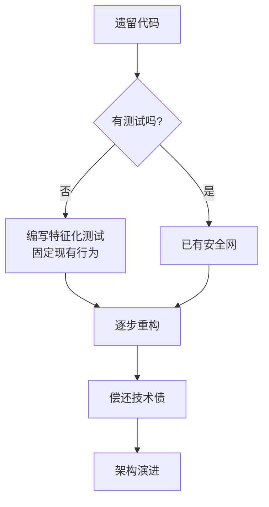
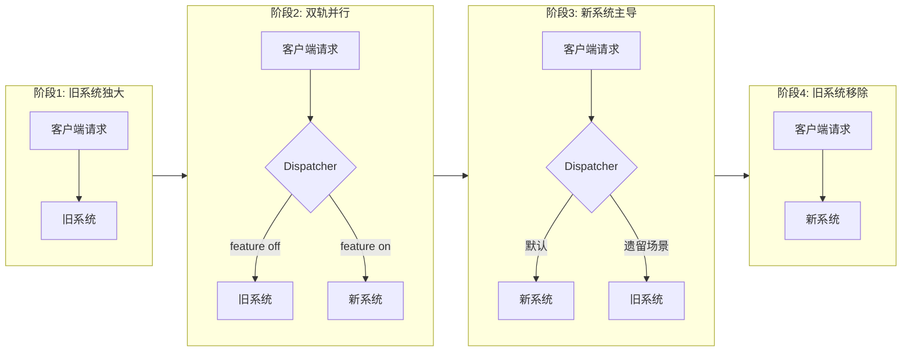

# 架构演进与重构

> 所属计划: 游戏架构设计
> 预计耗时: 70min
> 前置知识: [[01-architecture-overview]] 至 [[31-testing-game-architecture]] 综合

---

## 1. 概念讲解

### 为什么需要这个？

游戏项目很少从一开始就有"完美"的架构。更常见的剧本是：原型期追求速度，代码快速堆砌；上线期流量涌入，性能瓶颈暴露；运营期需求不断，原始设计逐渐腐化。到了某个时刻，团队会面临一个经典困境——**重写还是重构？**

Joel Spolsky 在 2000 年记录了 Netscape 的惨痛教训：Netscape 5.0 决定从零重写浏览器引擎，结果历时三年半，期间 IE 抢占市场，最终 Netscape 失去主导地位。这个案例成为软件工程史上最著名的"大重写"警示。游戏行业同样如此：重写期间老代码冻结，无法响应玩家需求，新系统的未知风险不可控，而市场窗口不会等待。

因此，我们需要一套**演进式技术**：在不停止服务的前提下，逐步偿还技术债，让架构随项目生命周期持续进化。这正是本章的核心——接缝（Seams）、绞杀者模式（Strangler Fig）、抽象分支（Branch by Abstraction）与技术债管理的组合拳。

### 核心思想

#### 遗留代码的本质：没有测试的代码

Michael Feathers 在《Working Effectively with Legacy Code》中给出了一个精准定义：**遗留代码就是"没有测试的代码"**。注意这个定义的颠覆性——它不按年代划分，而是按**可验证性**划分。昨天写的代码，如果没有测试，就是遗留代码；十年前的代码，如果有完整测试覆盖，就不是遗留代码。

这个定义重构了我们的行动优先级：重构前不是先改代码，而是先建立**测试保护网**（Test Protection Net）。Feathers 提出"characterization tests"（特征化测试）：先写测试捕获现有行为，哪怕行为本身是"错误的"——这样重构时才能确认"我没有破坏任何东西"。



#### Seams（接缝）：找到重构的切入点

Feathers 将"接缝"定义为**程序中两个行为可以分离的特殊位置**。他识别出三种类型：

| 接缝类型 | 机制 | 游戏中的实用性 |
|---------|------|-------------|
| 预处理接缝 | 宏、条件编译 | 较低，跨平台构建时偶尔使用 |
| 链接接缝 | 动态链接、插件替换 | 中等，Mod 系统、渲染后端切换 |
| **对象接缝** | **接口、虚方法、委托替换实现** | **最高，核心重构技术** |

对象接缝是游戏重构的主力工具。关键洞察：**把"直接调用具体实现"变成"通过抽象调用"**。例如：
- `PlayerPrefs.SetInt()` → `ISaveRepository.SaveInt()`
- `new LegacyQuestSystem()` → `IQuestService` 由 DI 容器注入
- 直接 `Instantiate(bulletPrefab)` → `IObjectSpawner.Spawn()`

建立接缝后，就可以在测试中使用 `InMemorySaveRepository`、`MockQuestService`、`FakeObjectSpawner`，也为后续替换实现铺平道路。

#### 绞杀者模式（Strangler Fig）：新系统围绕旧系统生长

这个名字来自澳大利亚的绞杀榕：种子落在宿主树上，向下生根、向上生长，最终包裹并取代宿主树，而宿主在此过程中逐渐枯死。

软件工程中，绞杀者模式的核心是：**新系统逐步接管旧系统的职责，而非一次性替换**。典型实施步骤：

1. **识别边界**：找到旧系统中可以独立替换的子系统（如库存、任务、匹配）
2. **建立路由**：在入口点放置分发器（Dispatcher），根据规则选择新旧路径
3. **逐步迁移**：从最简单/最低风险的场景开始，扩大新系统覆盖范围
4. **最终移除**：旧路径无调用后，删除遗留代码



#### 抽象分支（Branch by Abstraction）：主干上的和平演变

传统"分支开发"的问题是：长期分支导致合并地狱，新功能在分支上"冻结"，无法获得主干上的反馈。抽象分支提供另一种思路：

1. **在主干上创建抽象**（接口或抽象类）
2. **旧实现适配到抽象**（通常直接就是旧代码，或写适配器）
3. **新实现并行开发**，同样遵循抽象
4. **特性开关控制切换**，可以随时回滚
5. **逐步迁移调用方**，从边缘到核心
6. **最终删除旧实现和开关**

这与绞杀者模式的关键区别：绞杀者强调**系统级替换**，抽象分支强调**代码级共存**；两者经常结合使用。

#### 技术债管理：区分"战术债"与"腐化债"

技术债不是洪水猛兽，Martin Fowler 将其比作金融债务：明智的借贷可以加速发展，但需支付利息。

| 类型 | 特征 | 应对策略 |
|-----|------|---------|
| **战术债**（有意承担） | 为了抢占市场窗口，明知有瑕疵但可快速回滚 | 记录决策上下文，设定偿还期限，利率可控 |
| **腐化债**（无意积累） | 设计腐烂、知识流失、临时方案变成永久方案 | 零容忍，立即列入重构计划 |

管理实践：
- **Backlog 可视化**：用标签区分 `debt::tactical` 和 `debt::rotten`，定期评审
- **风险矩阵**：横轴"影响范围"，纵轴"修复成本"，优先处理高影响低成本
- **Bus Factor 监控**：关键子系统只有 1 人理解？立即要求知识转移和文档化

#### 生产期保持灵活的工程实践

| 实践 | 目的 | 与演进的关系 |
|-----|------|-----------|
| 模块化/清晰边界 | 降低替换成本 | 接缝的前提 |
| 特性开关（Feature Flags） | 运行时切换行为 | 绞杀者/抽象分支的控制机制 |
| 金丝雀发布（Canary） | 小流量验证新系统 | 降低替换风险 |
| 可观测性（Metrics/Tracing/Logging） | 快速发现问题 | 验证迁移是否成功 |

---

## 2. 代码示例

实现一个"绞杀者调度器"：通过接口接缝封装旧库存服务与新库存服务，用特性开关决定请求路由。展示如何在不修改调用方的情况下，逐步迁移核心系统。

```csharp
using System;

// ============================================
// 1. 抽象接缝：接口定义契约
// ============================================
public interface IInventoryService
{
    void AddItem(string itemId, int quantity);
    int GetItemQuantity(string itemId);
}

// ============================================
// 2. 旧实现：直接操作"数据库"的遗留逻辑
// ============================================
public class LegacyInventoryService : IInventoryService
{
    // 模拟旧系统的内部状态（实际可能是 PlayerPrefs、SQLite、二进制存档等）
    private readonly System.Collections.Generic.Dictionary<string, int> _db
        = new System.Collections.Generic.Dictionary<string, int>();

    public void AddItem(string itemId, int quantity)
    {
        // 旧逻辑：直接修改，无事件，无校验
        if (_db.ContainsKey(itemId))
            _db[itemId] += quantity;
        else
            _db[itemId] = quantity;

        Console.WriteLine($"[Legacy] Add {quantity}x {itemId} -> total: {_db[itemId]}");
    }

    public int GetItemQuantity(string itemId)
    {
        return _db.TryGetValue(itemId, out var qty) ? qty : 0;
    }
}

// ============================================
// 3. 新实现：基于事件驱动的 ECS 友好设计
// ============================================
public class NewInventoryService : IInventoryService
{
    private readonly System.Collections.Generic.Dictionary<string, int> _state
        = new System.Collections.Generic.Dictionary<string, int>();

    // 事件供其他系统订阅（如 UI 更新、成就触发）
    public event Action<string, int, int> ItemAdded; // itemId, delta, newTotal

    public void AddItem(string itemId, int quantity)
    {
        var oldQty = _state.TryGetValue(itemId, out var o) ? o : 0;
        var newQty = oldQty + quantity;
        _state[itemId] = newQty;

        ItemAdded?.Invoke(itemId, quantity, newQty);
        Console.WriteLine($"[New] Add {quantity}x {itemId} -> total: {newQty} (event emitted)");
    }

    public int GetItemQuantity(string itemId)
    {
        return _state.TryGetValue(itemId, out var qty) ? qty : 0;
    }
}

// ============================================
// 4. 绞杀者调度器：特性开关控制路由
// ============================================
public class InventoryServiceDispatcher : IInventoryService
{
    private readonly IInventoryService _legacy;
    private readonly IInventoryService _new;
    private readonly Func<bool> _useNew;  // 特性开关：运行时决策

    // 审计日志：对比新旧系统行为差异（迁移期关键！）
    private readonly bool _auditMode;

    public InventoryServiceDispatcher(
        IInventoryService legacy,
        IInventoryService newService,
        Func<bool> useNew,
        bool auditMode = true)
    {
        _legacy = legacy ?? throw new ArgumentNullException(nameof(legacy));
        _new = newService ?? throw new ArgumentNullException(nameof(newService));
        _useNew = useNew ?? throw new ArgumentNullException(nameof(useNew));
        _auditMode = auditMode;
    }

    public void AddItem(string itemId, int quantity)
    {
        var useNew = _useNew();

        if (_auditMode && useNew)
        {
            // 迁移期：同时调用两边，对比结果（金丝雀模式）
            var legacyBefore = _legacy.GetItemQuantity(itemId);
            _legacy.AddItem(itemId, quantity);  // 基准行为
            var legacyAfter = _legacy.GetItemQuantity(itemId);

            _new.AddItem(itemId, quantity);     // 新行为
            var newAfter = _new.GetItemQuantity(itemId);

            if (legacyAfter != newAfter)
            {
                Console.WriteLine($"[AUDIT ALERT] Divergence on {itemId}: legacy={legacyAfter}, new={newAfter}");
            }
            else
            {
                Console.WriteLine($"[AUDIT OK] Both systems agree: {newAfter}");
            }
        }
        else if (useNew)
        {
            _new.AddItem(itemId, quantity);
        }
        else
        {
            _legacy.AddItem(itemId, quantity);
        }
    }

    public int GetItemQuantity(string itemId)
    {
        // 读操作：优先从新系统读（假设新系统是最终目标）
        // 迁移期可能需要更复杂的策略
        return _useNew() ? _new.GetItemQuantity(itemId) : _legacy.GetItemQuantity(itemId);
    }

    // 迁移管理：查询当前状态
    public MigrationStatus GetMigrationStatus()
    {
        return new MigrationStatus(
            NewEnabled: _useNew(),
            AuditActive: _auditMode,
            LegacyType: _legacy.GetType().Name,
            NewType: _new.GetType().Name
        );
    }

    public record MigrationStatus(bool NewEnabled, bool AuditActive, string LegacyType, string NewType);
}

// ============================================
// 5. 特性开关源：支持多种配置方式
// ============================================
public static class FeatureFlags
{
    // 简单静态开关（开发测试）
    public static bool UseNewInventoryStatic { get; set; } = false;

    // 基于百分比的灰度（生产环境）
    public static Func<bool> PercentageRollout(double percentage)
    {
        var random = new Random();
        return () => random.NextDouble() < percentage;
    }

    // 基于用户分桶的灰度（确保同一用户始终走同一路径）
    public static Func<bool> UserBucketRollout(string userId, double percentage)
    {
        // 用确定性哈希保证同一 userId 始终得到相同结果
        var hash = userId.GetHashCode();
        var bucket = Math.Abs(hash) % 1000;
        return () => bucket < percentage * 1000;
    }

    // 组合条件：新功能开关 AND 特定条件
    public static Func<bool> Conditional(Func<bool> baseFlag, Func<bool> additionalCondition)
    {
        return () => baseFlag() && additionalCondition();
    }
}

// ============================================
// 6. 演示程序
// ============================================
class Program
{
    static void Main(string[] args)
    {
        Console.WriteLine("=== 绞杀者库存调度器演示 ===\n");

        // 场景1：完全走旧系统
        Console.WriteLine("--- 场景1: 旧系统独占 ---");
        var legacyOnly = CreateDispatcher(() => false);
        legacyOnly.AddItem("sword_001", 1);
        legacyOnly.AddItem("sword_001", 2);

        // 场景2：审计模式，双轨对比（迁移关键期）
        Console.WriteLine("\n--- 场景2: 审计模式（双轨并行对比） ---");
        var auditMode = CreateDispatcher(() => true, auditMode: true);
        auditMode.AddItem("potion_heal", 5);
        auditMode.AddItem("potion_heal", 3);

        // 场景3：灰度发布，50% 请求走新系统
        Console.WriteLine("\n--- 场景3: 50% 灰度发布 ---");
        var grayFlag = FeatureFlags.PercentageRollout(0.5);
        var grayDispatcher = CreateDispatcher(grayFlag, auditMode: false);
        for (int i = 0; i < 10; i++)
        {
            grayDispatcher.AddItem($"loot_{i}", 1);
        }

        // 场景4：按用户分桶，确保一致性
        Console.WriteLine("\n--- 场景4: 用户分桶灰度 ---");
        var user1 = FeatureFlags.UserBucketRollout("player_12345", 0.3);
        var user2 = FeatureFlags.UserBucketRollout("player_99999", 0.3);
        
        Console.WriteLine("User player_12345 (应始终一致):");
        var d1 = CreateDispatcher(user1, auditMode: false);
        d1.AddItem("rare_drop", 1);
        d1.AddItem("rare_drop", 1);

        Console.WriteLine("User player_99999 (应始终一致):");
        var d2 = CreateDispatcher(user2, auditMode: false);
        d2.AddItem("rare_drop", 1);
        d2.AddItem("rare_drop", 1);

        // 场景5：组合条件——新系统开关 AND 武器类型
        Console.WriteLine("\n--- 场景5: 组合条件（新系统+武器类型） ---");
        var baseFlag = () => true; // 总开关开
        var weaponOnly = () => true; // 简化：所有item都满足，实际应检查前缀
        var combined = FeatureFlags.Conditional(baseFlag, weaponOnly);
        var conditional = CreateDispatcher(combined, auditMode: false);
        conditional.AddItem("weapon_excalibur", 1);
        conditional.AddItem("armor_plate", 1); // 实际也应走新系统，因条件简化

        // 状态查询
        Console.WriteLine("\n--- 迁移状态查询 ---");
        var status = auditMode.GetMigrationStatus();
        Console.WriteLine($"Status: {status}");
    }

    static InventoryServiceDispatcher CreateDispatcher(
        Func<bool> useNew,
        bool auditMode = true)
    {
        var legacy = new LegacyInventoryService();
        var newService = new NewInventoryService();
        
        // 订阅新系统事件（演示可观测性）
        newService.ItemAdded += (item, delta, total) =>
            Console.WriteLine($"  [Event] {item} +{delta} = {total}");
        
        return new InventoryServiceDispatcher(legacy, newService, useNew, auditMode);
    }
}
```

**运行方式:**

```bash
# .NET 6+ 控制台
dotnet new console -n StranglerDemo
# 将上述代码复制到 Program.cs
dotnet run
```

**预期输出:**

```text
=== 绞杀者库存调度器演示 ===

--- 场景1: 旧系统独占 ---
[Legacy] Add 1x sword_001 -> total: 1
[Legacy] Add 2x sword_001 -> total: 3

--- 场景2: 审计模式（双轨并行对比） ---
[Legacy] Add 5x potion_heal -> total: 5
[New] Add 5x potion_heal -> total: 5 (event emitted)
  [Event] potion_heal +5 = 5
[AUDIT OK] Both systems agree: 5
[Legacy] Add 3x potion_heal -> total: 8
[New] Add 3x potion_heal -> total: 8 (event emitted)
  [Event] potion_heal +3 = 8
[AUDIT OK] Both systems agree: 8

--- 场景3: 50% 灰度发布 ---
[New] Add 1x loot_0 -> total: 1 (event emitted)
  [Event] loot_0 +1 = 1
[Legacy] Add 1x loot_1 -> total: 1
[New] Add 1x loot_2 -> total: 1 (event emitted)
  [Event] loot_2 +1 = 1
...（随机分布，约50%各走一路）

--- 场景4: 用户分桶灰度 ---
User player_12345 (应始终一致):
[New] Add 1x rare_drop -> total: 1 (event emitted)
  [Event] rare_drop +1 = 1
[New] Add 1x rare_drop -> total: 2 (event emitted)
  [Event] rare_drop +1 = 2

User player_99999 (应始终一致):
[Legacy] Add 1x rare_drop -> total: 1
[Legacy] Add 1x rare_drop -> total: 2

--- 场景5: 组合条件（新系统+武器类型） ---
[New] Add 1x weapon_excalibur -> total: 1 (event emitted)
  [Event] weapon_excalibur +1 = 1
[New] Add 1x armor_plate -> total: 1 (event emitted)
  [Event] armor_plate +1 = 1

--- 迁移状态查询 ---
Status: MigrationStatus { NewEnabled = True, AuditActive = True, LegacyType = LegacyInventoryService, NewType = NewInventoryService }
```

---

## 3. 练习

### 练习 1: 基础

给定以下直接调用 `PlayerPrefs` 的 `SaveManager`，找出至少两个 seams 并将其重构为可注入的 `ISaveRepository`：

```csharp
public class SaveManager
{
    public void SavePlayerLevel(int level)
    {
        PlayerPrefs.SetInt("PlayerLevel", level);
        PlayerPrefs.Save();
    }

    public int LoadPlayerLevel()
    {
        return PlayerPrefs.GetInt("PlayerLevel", 1);
    }

    public void SaveInventory(string json)
    {
        PlayerPrefs.SetString("Inventory", json);
        PlayerPrefs.Save();
    }
}
```

要求：
1. 定义 `ISaveRepository` 接口，包含 `SaveInt`、`LoadInt`、`SaveString`、`LoadString` 方法
2. 创建 `PlayerPrefsSaveRepository` 实现（适配现有行为）
3. 创建 `InMemorySaveRepository` 用于测试（用 `Dictionary<string, object>` 存储）
4. 重构 `SaveManager` 通过构造函数注入 `ISaveRepository`
5. 编写测试验证：保存后读取能拿到相同值

### 练习 2: 进阶

基于本章代码示例的 `InventoryServiceDispatcher`，实现一个**条件特性开关**：当 `useNewInventory` 为 `true` **且** `itemId` 以 `"weapon_"` 开头时走新服务，否则走旧服务。

额外要求：
- 在审计模式下，记录"因条件不满足而回退到旧系统"的次数
- 设计一个 `MigrationMetrics` 类，统计：新路径调用次数、旧路径调用次数、条件拦截次数、审计发现差异次数
- 提供查询接口，供监控面板调用

### 练习 3: 挑战（可选）

为一个深继承的敌人 AI 类层次设计迁移到组件/ECS 的绞杀者计划：

```csharp
public class Enemy { /* 基础 HP、位置 */ }
public class MeleeEnemy : Enemy { /* 近战攻击逻辑 */ }
public class BossEnemy : MeleeEnemy { /* 特殊技能、阶段转换 */ }
public class RangedEnemy : Enemy { /* 远程攻击逻辑 */ }
```

当前问题：
- `BossEnemy` 继承 `MeleeEnemy`，但某些 Boss 需要远程能力，导致"继承尴尬"
- 所有 AI 逻辑硬编码在 `Update()` 中，无法组合复用
- 新需求：添加"会治疗队友的敌人"，治疗逻辑与近战/远程正交

要求设计四步迁移计划，说明每步如何保持游戏可运行，以及接缝位置。

---

## 3.5 参考答案

> [!tip]- 练习 1 参考答案
> 
> **核心思路**：对象接缝（将 `PlayerPrefs` 封装到实现类）+ 参数接缝（构造函数注入）。
> 
> ```csharp
> // 接口定义：抽象接缝
> public interface ISaveRepository
> {
>     void SaveInt(string key, int value);
>     int LoadInt(string key, int defaultValue = 0);
>     void SaveString(string key, string value);
>     string LoadString(string key, string defaultValue = "");
> }
> 
> // 生产实现：适配 PlayerPrefs
> public class PlayerPrefsSaveRepository : ISaveRepository
> {
>     public void SaveInt(string key, int value)
>     {
>         PlayerPrefs.SetInt(key, value);
>         PlayerPrefs.Save();
>     }
> 
>     public int LoadInt(string key, int defaultValue = 0) 
>         => PlayerPrefs.GetInt(key, defaultValue);
> 
>     public void SaveString(string key, string value)
>     {
>         PlayerPrefs.SetString(key, value);
>         PlayerPrefs.Save();
>     }
> 
>     public string LoadString(string key, string defaultValue = "") 
>         => PlayerPrefs.GetString(key, defaultValue);
> }
> 
> // 测试实现：内存存储，无外部依赖
> public class InMemorySaveRepository : ISaveRepository
> {
>     private readonly Dictionary<string, object> _data = new();
> 
>     public void SaveInt(string key, int value) => _data[key] = value;
>     public int LoadInt(string key, int defaultValue = 0) 
>         => _data.TryGetValue(key, out var v) ? (int)v : defaultValue;
>     public void SaveString(string key, string value) => _data[key] = value;
>     public string LoadString(string key, string defaultValue = "") 
>         => _data.TryGetValue(key, out var v) ? (string)v : defaultValue;
> }
> 
> // 重构后的 SaveManager
> public class SaveManager
> {
>     private readonly ISaveRepository _repository;
> 
>     // 参数接缝：通过构造函数注入
>     public SaveManager(ISaveRepository repository)
>     {
>         _repository = repository ?? throw new ArgumentNullException(nameof(repository));
>     }
> 
>     public void SavePlayerLevel(int level) 
>         => _repository.SaveInt("PlayerLevel", level);
> 
>     public int LoadPlayerLevel() 
>         => _repository.LoadInt("PlayerLevel", 1);
> 
>     public void SaveInventory(string json) 
>         => _repository.SaveString("Inventory", json);
> }
> 
> // 测试验证
> public class SaveManagerTests
> {
>     public static void Main()
>     {
>         var repo = new InMemorySaveRepository();
>         var manager = new SaveManager(repo);
> 
>         manager.SavePlayerLevel(42);
>         var level = manager.LoadPlayerLevel();
>         Console.WriteLine(level == 42 ? "PASS" : "FAIL"); // PASS
> 
>         // 验证隔离性：新实例不受污染
>         var repo2 = new InMemorySaveRepository();
>         var manager2 = new SaveManager(repo2);
>         Console.WriteLine(manager2.LoadPlayerLevel() == 1 ? "PASS" : "FAIL"); // PASS（默认值）
>     }
> }
> ```
> 
> 关键洞察：`PlayerPrefs` 是全局静态状态，直接调用导致测试相互污染、无法并行。通过接缝，测试使用 `InMemorySaveRepository`，每个测试独立；生产环境使用 `PlayerPrefsSaveRepository`；未来可无缝替换为 `CloudSaveRepository`（如 Steam Cloud、PlayFab）。

> [!tip]- 练习 2 参考答案
> 
> **核心思路**：在 dispatcher 中组合多个条件，并引入指标收集实现可观测性。
> 
> ```csharp
> // 迁移指标：供监控和决策
> public class MigrationMetrics
> {
>     public long NewPathCalls { get; private set; }
>     public long LegacyPathCalls { get; private set; }
>     public long ConditionBlockedCalls { get; private set; } // 总开关开但item条件不满足
>     public long AuditDivergences { get; private set; }
> 
>     public void RecordNewPath() => Interlocked.Increment(ref NewPathCalls);
>     public void RecordLegacyPath() => Interlocked.Increment(ref LegacyPathCalls);
>     public void RecordConditionBlocked() => Interlocked.Increment(ref ConditionBlockedCalls);
>     public void RecordAuditDivergence() => Interlocked.Increment(ref AuditDivergences);
> 
>     public override string ToString() =>
>         $"MigrationMetrics{{New={NewPathCalls}, Legacy={LegacyPathCalls}, " +
>         $"Blocked={ConditionBlockedCalls}, Divergences={AuditDivergences}}}";
> }
> 
> // 增强版调度器
> public class ConditionalInventoryDispatcher : IInventoryService
> {
>     private readonly IInventoryService _legacy;
>     private readonly IInventoryService _new;
>     private readonly Func<bool> _useNew;           // 总开关
>     private readonly Func<string, bool> _itemPredicate; // 物品条件
>     private readonly MigrationMetrics _metrics;
>     private readonly bool _auditMode;
> 
>     public ConditionalInventoryDispatcher(
>         IInventoryService legacy,
>         IInventoryService newService,
>         Func<bool> useNew,
>         Func<string, bool> itemPredicate,  // e.g., id => id.StartsWith("weapon_")
>         MigrationMetrics metrics,
>         bool auditMode = true)
>     {
>         _legacy = legacy;
>         _new = newService;
>         _useNew = useNew;
>         _itemPredicate = itemPredicate;
>         _metrics = metrics;
>         _auditMode = auditMode;
>     }
> 
>     public void AddItem(string itemId, int quantity)
>     {
>         var globalFlag = _useNew();
>         var itemAllowed = _itemPredicate(itemId);
> 
>         // 决策逻辑：总开关 && 物品条件
>         var useNewPath = globalFlag && itemAllowed;
> 
>         if (globalFlag && !itemAllowed)
>         {
>             _metrics.RecordConditionBlocked();
>             Console.WriteLine($"[CONDITION BLOCK] {itemId} rejected by predicate, falling back to legacy");
>         }
> 
>         if (_auditMode && useNewPath)
>         {
>             // 审计模式：双轨对比（同原示例，但增加指标）
>             var legacyBefore = _legacy.GetItemQuantity(itemId);
>             _legacy.AddItem(itemId, quantity);
>             var legacyAfter = _legacy.GetItemQuantity(itemId);
> 
>             _new.AddItem(itemId, quantity);
>             var newAfter = _new.GetItemQuantity(itemId);
> 
>             if (legacyAfter != newAfter)
>             {
>                 _metrics.RecordAuditDivergence();
>                 Console.WriteLine($"[AUDIT ALERT] {itemId}: legacy={legacyAfter}, new={newAfter}");
>             }
>             else
>             {
>                 Console.WriteLine($"[AUDIT OK] {itemId}: both = {newAfter}");
>             }
> 
>             _metrics.RecordNewPath();
>         }
>         else if (useNewPath)
>         {
>             _new.AddItem(itemId, quantity);
>             _metrics.RecordNewPath();
>         }
>         else
>         {
>             _legacy.AddItem(itemId, quantity);
>             _metrics.RecordLegacyPath();
>         }
>     }
> 
>     public int GetItemQuantity(string itemId) =>
>         useNewPath(itemId) ? _new.GetItemQuantity(itemId) : _legacy.GetItemQuantity(itemId);
> 
>     private bool useNewPath(string itemId) => _useNew() && _itemPredicate(itemId);
> 
>     public MigrationMetrics GetMetrics() => _metrics;
> }
> 
> // 使用示例
> var metrics = new MigrationMetrics();
> var dispatcher = new ConditionalInventoryDispatcher(
>     legacy: new LegacyInventoryService(),
>     newService: new NewInventoryService(),
>     useNew: () => true,  // 总开关：新系统已就绪
>     itemPredicate: id => id.StartsWith("weapon_"),  // 但只开放武器类型
>     metrics: metrics,
>     auditMode: true
> );
> 
> dispatcher.AddItem("weapon_sword", 1);   // 走新路径 + 审计
> dispatcher.AddItem("armor_shield", 1);    // 条件拦截，回退旧路径
> dispatcher.AddItem("weapon_bow", 2);      // 走新路径 + 审计
> 
> Console.WriteLine(metrics);
> // 预期: MigrationMetrics{New=2, Legacy=1, Blocked=1, Divergences=0}
> ```
> 
> 设计要点：
> - `ConditionBlockedCalls` 是**关键业务指标**：它揭示"新系统就绪但覆盖范围不足"，驱动迁移优先级决策
> - 审计模式在生产环境应可动态开关，避免性能开销
> - 指标使用 `Interlocked` 保证线程安全，适配游戏服务端高并发场景

> [!tip]- 练习 3 参考答案
> 
> **四步绞杀者迁移计划**：
> 
> **第一步：抽象接缝——提取 `IEnemyBehavior` 接口（不破坏旧类）**
> 
> ```csharp
> // 新接口：定义敌人行为的契约
> public interface IEnemyBehavior
> {
>     void Update(float deltaTime, EnemyContext context);
>     bool CanAttack(EnemyContext context);
>     void OnDamaged(float damage, DamageSource source);
> }
> 
> // 适配器：让旧 Enemy 子类继续工作，同时暴露为接口
> public class LegacyEnemyBehaviorAdapter : IEnemyBehavior
> {
>     private readonly Enemy _legacyInstance;
> 
>     public LegacyEnemyBehaviorAdapter(Enemy legacy)
>     {
>         _legacyInstance = legacy;
>     }
> 
>     public void Update(float deltaTime, EnemyContext context)
>     {
>         // 调用旧类的 Update（可能需要反射或提取 protected 方法）
>         _legacyInstance.Update(); // 假设已调整为 public 或内部可见
>     }
> 
>     // ... 其他方法类似适配
> }
> 
> // EnemyContext 传递必要的外部信息（玩家位置、关卡状态等）
> public record EnemyContext(Vector3 PlayerPosition, float GameTime, IReadOnlyList<Enemy> AllEnemies);
> ```
> 
> 此步关键：旧代码完全不删除，只增加适配层。接缝在 `Enemy` 的 `Update()` 方法——原本直接调用，现在通过 `IEnemyBehavior` 分发。
> 
> **第二步：组件化实现——新行为树/Utility AI/GOAP 系统**
> 
> ```csharp
> // 基于组件的设计：行为由多个可组合的策略构成
> public class BehaviorTreeEnemy : IEnemyBehavior
> {
>     private readonly INode _root;
>     private readonly Blackboard _blackboard;
> 
>     public BehaviorTreeEnemy(INode root, Blackboard blackboard)
>     {
>         _root = root;
>         _blackboard = blackboard;
>     }
> 
>     public void Update(float deltaTime, EnemyContext context)
>     {
>         _blackboard.Set("playerPos", context.PlayerPosition);
>         _root.Tick(_blackboard);
>     }
> 
>     public bool CanAttack(EnemyContext context) => 
>         _blackboard.Get<float>("distanceToPlayer") < _blackboard.Get<float>("attackRange");
> 
>     public void OnDamaged(float damage, DamageSource source) =>
>         _blackboard.Set("lastDamageSource", source);
> }
> 
> // 具体策略节点：可复用、可组合
> public class MeleeAttackNode : INode { /* ... */ }
> public class RangedAttackNode : INode { /* ... */ }
> public class HealAllyNode : INode { /* ... */ }  // 新需求：治疗队友
> public class PhaseTransitionNode : INode { /* Boss 阶段转换 */ }
> ```
> 
> 此步实现"组合优于继承"：Boss 可以同时拥有 `MeleeAttackNode` + `RangedAttackNode` + `PhaseTransitionNode`，无继承尴尬。
> 
> **第三步：Dispatcher 按条件切换——敌人类型或关卡粒度**
> 
> ```csharp
> public class EnemyBehaviorDispatcher
> {
>     private readonly Dictionary<string, Func<EnemyData, IEnemyBehavior>> _factories;
>     private readonly Func<string, bool> _useNewForEnemyType;
> 
>     public IEnemyBehavior CreateBehavior(EnemyData data)
>     {
>         if (_useNewForEnemyType(data.EnemyTypeId))
>         {
>             // 新系统：从配置构建行为树
>             return BuildBehaviorTree(data);
>         }
>         else
>         {
>             // 旧系统：创建传统 Enemy 子类，包装适配器
>             var legacy = InstantiateLegacyEnemy(data);
>             return new LegacyEnemyBehaviorAdapter(legacy);
>         }
>     }
> 
>     // 渐进策略：先在新关卡试用，成熟后推广到旧关卡
>     private bool DefaultRollout(string enemyTypeId) => 
>         enemyTypeId.StartsWith("new_") ||  // 新设计的敌人
>         _completedLevels.Contains(CurrentLevel) && _testedTypes.Contains(enemyTypeId);
> }
> ```
> 
> 切换粒度选择：
> - **按敌人类型**：适合"新敌人直接用新系统"
> - **按关卡**：适合"新关卡试用新系统，旧关卡保持兼容"
> - **按玩家**：A/B 测试新 AI 的留存/难度数据
> 
> **第四步：删除旧类——确认无调用后清理**
> 
> 删除条件：
> 1. 所有 `Enemy` 子类在 Dispatcher 中都有新系统替代
> 2. 连续 N 个版本无 `LegacyEnemyBehaviorAdapter` 实例创建
> 3. 存档/回放系统已迁移（旧存档格式能正确转换为新组件配置）
> 
> ```csharp
> // 最终简化：Dispatcher 变为纯工厂
> public class ModernEnemyFactory
> {
>     public IEnemyBehavior Create(EnemyData data) => BuildBehaviorTree(data);
> }
> ```
> 
> 迁移时间线建议：
> | 版本 | 里程碑 | 风险管控 |
> |-----|--------|---------|
> | v1.2 | 提取 `IEnemyBehavior`，适配器覆盖 100% 旧类 | 全量回归测试 |
> | v1.3 | 新敌人类型使用行为树 | 旧关卡不受影响 |
> | v1.4 | 1 个旧 Boss 迁移到行为树，灰度 10% 玩家 | 监控通关率、Bug 报告 |
> | v1.5 | 扩展至 50% 旧敌人 | 保留回滚开关 |
> | v1.6 | 全部迁移，删除旧类 | 最终存档兼容性验证 |
> 
> 关键洞察：深继承的"继承尴尬"（如 Boss 需要远程能力但继承自 MeleeEnemy）是典型设计腐化。组件化通过**扁平组合**解决：能力不是继承来的，而是配置出来的。绞杀者模式确保这个重构不需要"停止开发三个月"。

> [!note] 答案使用方式
> 如果你的实现通过了测试或达到了题目要求，就是正确的。参考答案展示的是"一种可行路径"，而非唯一标准答案。重点验证：你的接缝是否让旧代码可测试？特性开关是否支持运行时回滚？绞杀者计划是否有明确的里程碑和退出条件？
>
> ---

## 4. 扩展阅读

- [Martin Fowler — Strangler Fig Application](https://martinfowler.com/bliki/StranglerFigApplication.html): 绞杀者模式的原始定义与动机，包含实际案例的时间线分析。
- [Martin Fowler — Branch by Abstraction](https://martinfowler.com/bliki/BranchByAbstraction.html): 抽象分支技术的权威说明，强调"在主干上进化"而非长期分支。
- [Joel Spolsky — Things You Should Never Do, Part I](https://www.joelonsoftware.com/2000/04/06/things-you-should-never-do-part-i/): Netscape 重写教训，软件工程史上最经典的反重写论证。
- [Michael Feathers — Working Effectively with Legacy Code](https://www.amazon.com/Working-Effectively-Legacy-Michael-Feathers/dp/0131177052): seams、characterization tests、测试保护网的系统性来源，遗留代码工作的必读书。

---

## 常见陷阱

- **无测试覆盖的重构**：Feathers 的核心警告——没有测试就重构等同于走钢丝。正确做法：先写 characterization tests 固定现有行为，即使行为是"错误"的；重构后测试保持绿色，确认等价变换；最后才修改行为并更新测试。游戏开发中，characterization tests 可以是"录制-回放"式的：记录 100 帧的输入和状态，重构后对比输出差异。

- **旧路径长期并存**：绞杀者模式需要明确的弃用里程碑（如"v1.5 后 LegacyInventoryService 进入维护模式，v2.0 删除"），否则新旧双轨维护成本会反噬——新 Bug 要修两遍、性能优化要分析两条路径、新人要理解两套系统。正确做法：在特性开关代码中内置 `DEPRECATED_SINCE` 和 `REMOVE_BY` 注释，与项目管理工具联动，到期自动触发清理任务。

- **一次性大重写**：看似"彻底解决问题"，实则冻结功能演进、丢失累积的 Bug 修复、新系统风险不可控。正确做法：将"重写"拆解为一系列绞杀者/抽象分支步骤，每步产生可交付的价值；用 [[31-testing-game-architecture]] 的测试策略保护每步；用本章的 metrics 验证迁移效果。记住 Spolsky 的忠告："重写是软件开发中最严重的战略错误之一。"