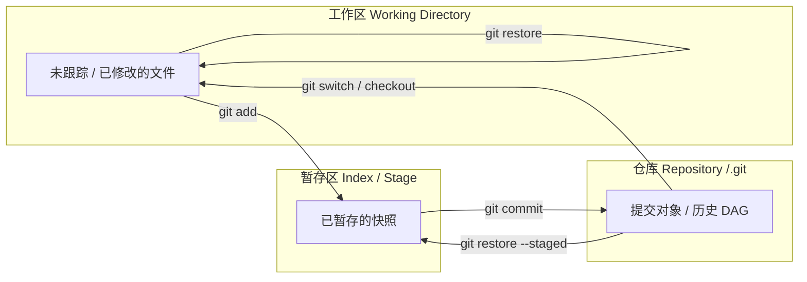
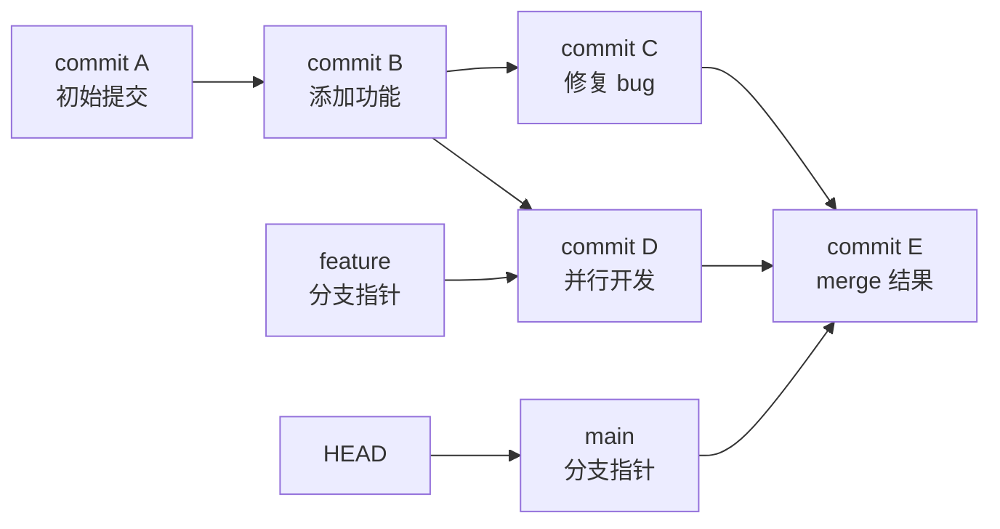

# Git 心智模型：快照而非差异

> 所属计划: [[git-deep-dive|Git 进阶——从日常使用到底层原理]]
> 预计耗时: 45min
> 前置知识: 无

---

## 1. 概念讲解

### 为什么需要这个？

大多数初学者第一次接触 Git 时，会本能地以为它和 SVN、Perforce 一样：每次提交存的是"相对于上一次的修改清单"。这个误解会让你在学到 `merge`、`rebase`、`cherry-pick` 时处处碰壁——

- 为什么 Git 能随意切换分支而不需要联网？
- 为什么 `git log --graph` 画出来的是一张"网"而不是一条直线？
- 为什么 `reset --hard` 能找回文件，而单纯删除文件却"没丢历史"？

这些问题的答案都取决于同一个心智模型：**Git 保存的是每次提交的完整快照，而不是差异**。本节是整套教程的地基，后面的分支、合并、底层对象、Rebase 都建立在这个模型之上。

### 核心思想：快照 vs 差异

想象你在玩一款 RPG 游戏：

- **差异模型（SVN / Perforce）** 像是一本"变更日志"：只记录"第 `#1` 步你捡了剑，第 `#2` 步你卖了药水"。要还原第 10 步的状态，得从第 0 步开始逐条重放日志。
- **快照模型（Git）** 像是一组"游戏存档"：每次提交都是那一刻整个游戏世界的完整截图。你可以直接读第 10 个存档，不需要重放前面 `#1` 到 `#9` 的操作。

Git 的每次提交都是一次完整快照。如果某个文件在这次提交里没改，Git 会**复用同一个底层对象**，而不是把文件再存一遍。因此快照模型并不浪费空间——重复数据的去重由对象存储和 [[09-git-object-model|packfile]] 负责，第 9 节会详细展开。

> [!note]
> Git 在运行时当然可以算 diff（`git diff`），但那是根据两次快照临时算出来的。磁盘上的提交对象本身没有 diff。

#### 对比：Git 与中心化 VCS

| 维度 | Git（快照模型） | SVN / Perforce（差异模型） |
|------|----------------|---------------------------|
| 每次提交存什么 | 完整目录快照 | 文件级增量 / 变更集 |
| 历史遍历 | 直接读取任一提交 | 常需从基线逐步重放 |
| 分支本质 | 一个指向提交的轻量指针 | 通常是目录的独立副本 |
| 离线能力 | 完整历史在本地 | 多数历史操作依赖服务器 |
| 合并策略 | 基于 DAG 多祖先 | 通常基于单一主线 |

### 三种状态 / 三个区域

Git 把文件放在三个不同的区域里：

- **工作区（Working Directory）**：你实际看到的文件系统，可以任意修改。
- **暂存区（Index / Stage）**：下一次 `git commit` 会记录的内容，是一个"准备写入仓库的快照"。
- **仓库（Repository / `.git`）**：所有提交、分支、历史的真正存放地。

三者的关系和数据流向如下图所示：



> [!tip]
> 现代 Git（2.23+）推荐使用 `git restore` 和 `git switch`，避免 `git checkout` 因为承载太多语义而带来的困惑。`git checkout` 仍然可用，与上面两条命令等价。

### 提交是不可变的快照

一个提交（commit）对象包含：

- 一个 **tree**：这次提交时整个项目目录的快照；
- 零个或多个 **parent**：父提交（初始提交没有 parent，合并提交可以有多个）；
- **作者、提交者、时间戳、提交信息**。

因为内容不变，提交的 hash 也就不变。Git 用 **SHA-1**（默认）或 **SHA-256** 给对象命名。2.42 之后 SHA-256 仓库不再是实验性质，但目前新建仓库默认仍是 SHA-1。

> [!important]
> 提交对象一旦创建就不可修改。"修改历史"其实是创建新的提交对象，并让分支指针指向新的对象，旧对象仍留在 `.git/objects` 里，直到垃圾回收。

### 历史是有向无环图（DAG）

提交通过 parent 指针连成一张图：

- 普通提交：指向唯一的父提交；
- 合并提交：指向两个或多个父提交；
- 分支（`main`、`feature` 等）：只是一个指向某个提交的可移动指针；
- `HEAD`：指向当前分支（或当前提交，detached HEAD 时）。



分支的"轻量"体现在：创建一个分支只是在 `.git/refs/heads/` 里写了一个文件，内容只有 40 个字符的 hash。这也是为什么 Git 分支如此廉价。

### `.git` 目录里有什么

`.git` 就是整个仓库。关键文件和目录如下：

| 路径 | 作用 |
|------|------|
| `.git/HEAD` | 当前 `HEAD` 指向哪里：分支引用或裸 hash |
| `.git/config` | 本仓库的专属配置（覆盖全局 `~/.gitconfig`） |
| `.git/objects/` | 所有 Git 对象的存储地（blob、tree、commit、tag） |
| `.git/refs/heads/` | 本地分支指针 |
| `.git/refs/tags/` | 标签指针 |
| `.git/index` | 暂存区的二进制快照 |
| `.git/logs/` | `HEAD` 和分支的更新日志（`reflog` 的数据源） |
| `.git/hooks/` | 客户端钩子脚本 |

> [!note]
> `objects/` 里的对象可能以松散文件存在，也可能被 `git gc` 打包进 `.git/objects/pack/`。日常不需要手动运行 `git gc`，Git 会在后台自动维护。

---

## 2. 代码示例

下面在 `git-playground` 仓库里做几次提交，直观感受"快照"的含义。

**运行环境要求**：Git 2.40+；Linux / macOS / Windows（PowerShell/Git Bash 均可）。

**运行方式：**

```bash
# 创建并进入练习仓库
mkdir git-playground && cd git-playground
git init

# 第一次提交：创建初始文件
echo "Hello Git" > README.md
git add README.md
git commit -m "Initial commit"

# 第二次提交：修改文件
echo "Line 2" >> README.md
git add README.md
git commit -m "Add line 2"

# 第三次提交：新增文件
echo "print('hello')" > app.py
git add app.py
git commit -m "Add app.py"

# 查看历史图
git log --oneline --graph --all

# 查看 HEAD 提交对象的内容：注意它指向的 tree
git cat-file -p HEAD
```

**预期输出：**

```text
* 3f4a8c2 Add app.py
* 7e1b9d4 Add line 2
* 9a2c5e1 Initial commit
```

```text
tree 2c4f6a8d3e...
parent 7e1b9d4...
author Your Name <you@example.com> 1719000000 +0800
committer Your Name <you@example.com> 1719000000 +0800

Add app.py
```

> [!note]
> 你看到的 hash 和时间戳与上面不同，这很正常——hash 由内容、作者、时间共同决定。关键是注意到 `tree` 行：它才是这次提交时整个目录的快照。`parent` 行则把这次提交挂到了 DAG 上。

---

## 3. 练习

所有练习都在 `git-playground` 仓库中完成。若尚未创建，请先按"代码示例"初始化。

### 练习 1: 观察 `HEAD` 的内容

在 `git-playground` 中再做 3 次提交（内容随意），然后执行 `cat .git/HEAD` 并记录输出。请解释：`.git/HEAD` 里写的是什么？如果切换到分离 `HEAD` 状态，它的内容会变成什么？

### 练习 2: 查看 HEAD 指向的 tree

使用 `git cat-file -p HEAD` 找到 `tree` 行对应的 hash，然后执行 `git cat-file -p <tree-hash>`。请解释输出中每一列代表什么，并说明 tree 与 commit 对象的关系。

### 练习 3: 为什么快照而非差异（可选）

结合本节内容，解释：

1. 为什么 Git 选择存快照而不是差异？
2. 如果每次提交都存完整快照，为什么不担心仓库体积爆炸？
3. `packfile` 在这个过程中起什么作用？（提示：本节只引出概念，详细内容见 [[09-git-object-model]]。）

---

## 3.5 参考答案

> [!tip]- 练习 1 参考答案
> 参考答案不是唯一解——如果你的实现通过/达到要求就是正确的。
>
> ```bash
> cd git-playground
> cat .git/HEAD
> ```
>
> ```text
> ref: refs/heads/main
> ```
>
> `.git/HEAD` 通常是一个**符号引用**（symbolic ref），指向当前分支文件。输出 `ref: refs/heads/main` 表示 `HEAD` 正指向 `main` 分支；部分环境或旧配置可能显示 `ref: refs/heads/master`，含义相同。
>
> 若进入分离 `HEAD` 状态，例如：
>
> ```bash
> git checkout HEAD~1
> cat .git/HEAD
> ```
>
> 此时 `.git/HEAD` 会直接写上一个裸 hash：
>
> ```text
> 7e1b9d4...
> ```
>
> 这表示 `HEAD` 不再指向某个分支，而是直接指向一个具体的提交。

> [!tip]- 练习 2 参考答案
> 参考答案不是唯一解——如果你的实现通过/达到要求就是正确的。
>
> ```bash
> cd git-playground
> git cat-file -p HEAD
> # 复制 tree 行后面的 hash
> git cat-file -p <tree-hash>
> ```
>
> 典型输出类似：
>
> ```text
> 100644 blob 8ab686eafeb1f44702738c8b0f24f2567c36da6d	README.md
> 100644 blob 7d4e3f1a2b...	app.py
> ```
>
> 各列含义：
>
> | 字段 | 含义 |
> |------|------|
> | `100644` | 文件模式（普通文件） |
> | `blob` | 对象类型 |
> | `8ab686ea...` | 文件内容对象的 hash |
> | `README.md` | 文件名 |
>
> **tree 与 commit 的关系**：commit 对象只保存元数据（作者、时间、提交信息、父提交），真正的目录快照由它引用的 tree 对象保存。tree 再引用 blob（文件内容）和其他子 tree。这种分层结构让 Git 可以高效复用未改动的对象。

> [!tip]- 练习 3 参考答案（可选）
> 参考答案不是唯一解——如果你的实现通过/达到要求就是正确的。
>
> 1. **为什么快照**：快照让切换分支、合并、rebase 等操作可以基于完整状态直接计算，而不需要像差异模型那样逐条重放变更日志。这让 Git 的本地操作极快，也让 DAG 模型自然成立。
> 2. **体积不爆炸**：相同内容的文件只存一次（由 hash 去重）。如果文件没改，新的 tree 会直接引用同一个 blob，不会复制内容。
> 3. **packfile 的角色**：随着时间推移，松散对象会越来越多。`git gc` 会把许多对象打包成 `.git/objects/pack/` 下的 packfile，并对相似内容进行**增量压缩**（delta compression）。这样仓库既保留了快照语义，又节省了磁盘空间。packfile 的详细格式和实现见 [[09-git-object-model]]。

> [!note] 答案使用方式
> 先独立完成练习，再展开查看参考答案。参考答案不是唯一解——如果你的实现通过了测试或达到了题目要求，就是正确的。

---

## 4. 扩展阅读

- [Git 官方文档：Git 基本原理](https://git-scm.com/book/en/v2/Getting-Started-What-is-Git%3F)
- [GitHub Blog: Commits are snapshots, not diffs](https://github.blog/2020-12-17-commits-are-snapshots-not-diffs/)
- [Git 官方文档：Git 对象](https://git-scm.com/book/en/v2/Git-Internals-Git-Objects)
- [Git 哈希函数过渡文档（SHA-256）](https://www.kernel.org/pub/software/scm/git/docs/technical/hash-function-transition.html)

---

## 常见陷阱

- **误解 Git 存 diff 导致无法理解 merge/rebase**：如果历史是一串 diff，合并就只能是"把两组补丁叠在一起"；但 Git 的历史是快照 DAG，merge 是把两个完整目录状态合并成一个新的快照。先建立快照心智模型，分支与合并自然会变得清晰。
- **混淆 working dir 和 index 状态**：`git add` 之后工作区可能还和暂存区不同；`git diff` 看的是工作区 vs 暂存区，`git diff --cached` 看的是暂存区 vs 最新提交。提交前用 `git status` 和 `git diff --cached` 确认你要记录的内容。
- **以为删除文件就丢了历史**：只要文件曾经被提交过，即使你在工作区把它删了，它仍然存在于 `.git/objects` 和 DAG 中。用 `git restore <file>` 或 `git checkout HEAD -- <file>` 可以找回。真正丢失需要满足：对象被 prune、packfile 被删除、且没有 reflog/backups。
- **以为分支会复制文件**：分支只是一个指向提交的指针文件，创建分支几乎不占用空间。不要因为"怕仓库变大"而不敢开分支。

---

> [!note]
> 本节内容与 [[02-staging-area-mastery]] 紧密衔接：下一节会深入暂存区，讲解 `git add -p`、`git restore`、部分暂存等精细化操作。第 9 节 [[09-git-object-model]] 将进一步拆解 `blob`、`tree`、`commit`、`tag` 四种对象和 packfile 的底层实现。
