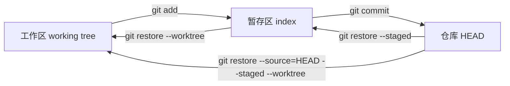
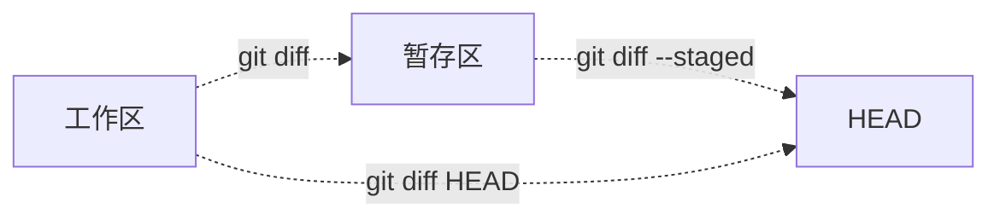

# 暂存区精通：精细化提交

> 所属计划: [[git-deep-dive|Git 进阶——从日常使用到底层原理]]
> 预计耗时: 45min
> 前置知识: [[01-git-mental-model|Git 心智模型：快照而非差异]]

---

## 1. 概念讲解

### 为什么需要这个？

日常开发中，我们经常在一次编码里顺手修了好几个东西：

- 修了一个拼写错误
- 给函数加了注释
- 顺手调整了一个常量

如果直接 `git commit -a`，这些毫不相关的改动会被塞进同一个提交。等到一周后排查问题时，你会发现提交信息写的是"修复 bug"，里面却混着注释和重构，根本无法用 `git bisect` 或 `git revert` 精准处理。

**暂存区（staging area / index）就是 Git 给你的"编辑台"**：它让你在真正提交之前，先挑选本次要放进快照的改动，把一个大杂烩拆成多个语义清晰的小提交。

### 核心思想

Git 不是直接从工作区生成提交，而是先把你选中的内容复制到**暂存区**（`.git/index`），再对暂存区拍一张快照形成提交。

你可以把暂存区想象成机场安检前的托盘：

- **工作区（working tree）** = 你的行李箱，里面什么都有
- **暂存区（index）** = 托盘，你只把这次要托运的东西放上去
- **仓库（.git）** = 飞机货舱，托运完成后东西就锁进去了



> [!important]
> `git restore --staged` 只会让暂存区回退到 `HEAD`，**不会动工作区的文件**；`git restore --worktree` 才会把工作区文件恢复到暂存区状态。

### `.git/index` 的本质

暂存区不是一个"差异补丁"，而是一份**二进制清单**，记录了"下一次提交应该包含哪些文件、对应哪些 blob 对象"。你可以用底层命令查看：

```bash
# 查看 index 文件本身（二进制，不要 cat）
ls -l .git/index

# 用 Git 自带的命令查看清单内容
git ls-files --stage
```

在一个刚初始化并 `git add` 过 `calculator.py` 的仓库里，`git ls-files --stage` 会输出类似：

```text
100644 e69de29bb2d1d6434b8b29ae775ad8c2e48c5391 0	calculator.py
```

格式是：`<模式> <blob hash> <stage>\t<路径>`。`stage` 为 `0` 表示正常暂存；合并冲突时会出现 `1/2/3` 等 stage 号（详见 [[04-branch-merge-deep|分支与合并深入]]）。

### 四种 `git diff` 的区别



| 命令 | 左侧 | 右侧 | 用途 |
|------|------|------|------|
| `git diff` | 工作区 | 暂存区 | 查看**未暂存**的改动 |
| `git diff --staged` / `--cached` | 暂存区 | `HEAD` | 查看**已暂存、待提交**的改动 |
| `git diff HEAD` | 工作区 | `HEAD` | 查看相对于最新提交的所有改动 |
| `git diff <commit>` | 工作区 | `<commit>` | 查看相对于任意提交的改动 |

> [!tip]
> 养成习惯：提交前跑 `git diff --staged`，确认托盘里装的确实是你想托运的东西。

### `git add -A` / `-u` / `.` 的区别

这三个命令看起来都能"加东西"，实际行为有 subtle 但关键的区别：

| 命令 | 新文件 | 修改的已跟踪文件 | 删除的已跟踪文件 | 作用范围 |
|------|--------|------------------|------------------|----------|
| `git add -A` | 包含 | 包含 | 包含 | 整个仓库 |
| `git add -u` | 不包含 | 包含 | 包含 | 整个仓库 |
| `git add .` | 包含 | 包含 | 包含当前目录内的删除 | 当前目录及子目录 |

> [!warning]
> `git add .` 不会处理仓库其他位置的删除；如果你在项目根目录运行，它和 `git add -A` 效果接近，但在子目录里运行就会漏掉外层改动。

### 逐块暂存：`git add -p` / `-e` / `-i`

`git add -p`（`--patch`）是精细化管理的核心。Git 会把工作区的改动切成一个个 **hunk**（块），让你逐个决定：

- `y` 暂存这块
- `n` 跳过这块
- `s` 把这块再拆小（如果可能）
- `e` 手动编辑这块
- `q` 退出

如果你的改动不在同一处，Git 会自动分成多个 hunk；如果两块改动靠得太近被合并成一个 hunk，可以用 `s` 尝试拆分。

`git add -e` 会打开编辑器，让你直接修改补丁内容；`git add -i` 提供一个菜单式交互界面，适合批量挑选多个文件。现代工作流里 `git add -p` 用得最多。

### 现代恢复命令：`git restore`

Git 2.23 引入了 `git restore`，把 `git checkout` 和 `git reset` 那些容易混淆的用法拆清楚：

| 意图 | 现代命令 | 老命令（仍可用但易混淆） |
|------|----------|--------------------------|
| 撤销暂存，保留工作区改动 | `git restore --staged <file>` | `git reset HEAD <file>` |
| 丢弃工作区改动 | `git restore --worktree <file>` | `git checkout -- <file>` |
| 从某提交恢复文件到工作区和暂存区 | `git restore --source=<commit> --staged --worktree <file>` | `git checkout <commit> -- <file>` |
| 丢弃工作区和暂存区改动 | `git restore --source=HEAD --staged --worktree <file>` | `git checkout HEAD -- <file>` |

### 改写最近一次提交

有时候刚 `git commit` 就发现漏了文件、写错了提交信息，或者想拆分得太晚：

- `git commit --amend`：用暂存区的内容替换最后一次提交。如果暂存区没新改动，就只改提交信息。
- `git commit --amend --no-edit`：保留原提交信息，只把暂存区新内容补进去。
- `git commit --fixup=<commit>`：创建一个"fixup!"前缀的提交，专门用于后续 `git rebase -i --autosquash` 自动合并（详见 [[05-rebase-core|Rebase 核心技能]]）。
- `git commit -c <commit>`：以上一次提交信息为模板并编辑；`-C` 则直接复用不编辑。

> [!warning]
> `--amend` 会生成新的 commit hash。如果上一次提交已经 push 到公共分支，**不要 amend**，否则会造成历史重写灾难；应该用 `git revert` 或 `git commit --fixup` + rebase（且只在个人分支上 rebase）。

---

## 2. 代码示例

### 示例 1：用 `git add -p` 把同一文件拆成两个原子提交

运行环境：Git ≥ 2.40，Bash/Git Bash/WSL。Windows 用户建议先执行 `git config core.autocrlf false`，避免行尾转换干扰 diff。

**运行方式：**

```bash
# 1. 创建并进入练习仓库
mkdir git-playground-staging
cd git-playground-staging
git init -b main

# 2. 配置当前仓库的用户信息
git config user.name "Learner"
git config user.email "learner@example.com"
git config core.autocrlf false

# 3. 创建初始文件并提交
cat > calculator.py <<'EOF'
def add(a, b):
    return a + b

def subtract(a, b):
    return a - b
EOF
git add calculator.py
git commit -m "Initial calculator"

# 4. 同时修改两个函数（我们想拆成两次提交）
cat > calculator.py <<'EOF'
def add(a, b):
    """Return sum."""
    return a + b

def subtract(a, b):
    """Return difference."""
    return a - b
EOF

# 5. 查看未暂存的改动
git diff

# 6. 交互式分块暂存：先输入 s 拆分，再 y 暂存第一块，n 跳过第二块
#    为了可复现，这里用 printf 模拟按键；你也可以手动输入
printf 's\ny\nn\n' | git add -p calculator.py

# 7. 确认暂存区 vs 工作区
git diff --staged   # 已暂存：add() 的 docstring
git diff            # 未暂存：subtract() 的 docstring

# 8. 提交第一部分
git commit -m "Add docstring to add()"

# 9. 暂存剩下的改动并提交
printf 'y\n' | git add -p calculator.py
git commit -m "Add docstring to subtract()"

# 10. 查看最终历史
git log --oneline
```

**预期输出：**

```text
--- status ---
 M calculator.py

--- diff ---
diff --git a/calculator.py b/calculator.py
index d05a819..0e49cbc 100644
--- a/calculator.py
+++ b/calculator.py
@@ -1,5 +1,7 @@
 def add(a, b):
+    """Return sum."""
     return a + b

 def subtract(a, b):
+    """Return difference."""
     return a - b

--- add -p ---
(1/1) Stage this hunk [y,n,q,a,d,s,e,p,P,?]? Split into 2 hunks.
@@ -1,4 +1,5 @@
 def add(a, b):
+    """Return sum."""
     return a + b

 def subtract(a, b):
(1/2) Stage this hunk [y,n,q,a,d,k,K,j,J,g,/,e,p,P,?]?
@@ -2,4 +3,5 @@
     return a + b

 def subtract(a, b):
+    """Return difference."""
     return a - b
(2/2) Stage this hunk [y,n,q,a,d,K,J,g,/,e,p,P,?]?

--- staged diff ---
@@ -1,4 +1,5 @@
 def add(a, b):
+    """Return sum."""
     return a + b

--- unstaged diff ---
@@ -3,4 +3,5 @@
 def subtract(a, b):
+    """Return difference."""
     return a - b

--- log ---
9af1700 Add docstring to subtract()
2dfc954 Add docstring to add()
886e5aa Initial calculator
```

### 示例 2：`git restore` 撤销暂存与丢弃改动

**运行方式：**

```bash
# 接上一个示例仓库，或者新建一个
cd git-playground-staging

# 修改文件并暂存
echo "def multiply(a, b):" >> calculator.py
git add calculator.py

# 发现暂存错了，先撤销暂存（工作区改动保留）
git restore --staged calculator.py

# 确认状态：M 回到工作区
git status --short

# 进一步决定不要这个改动了，丢弃工作区改动
git restore --worktree calculator.py

# 文件恢复如初
git status --short
```

**预期输出：**

```text
--- after add ---
M  calculator.py

--- after restore --staged ---
 M calculator.py

--- after restore --worktree ---

```

### 示例 3：`git commit --amend` 修改上一次提交

**运行方式：**

```bash
cd git-playground-staging

# 假设上次提交信息写错了
git commit --amend -m "Add docstring to add() and subtract()"

# 查看历史，hash 已经变了
git log --oneline
```

**预期输出：**

```text
3a7f1e2 Add docstring to add() and subtract()
886e5aa Initial calculator
```

> [!note]
> `--amend` 会替换最后一个提交对象，因此 commit hash 从 `9af1700` 之类变成了新的 `3a7f1e2`。

### 示例 4：`git commit --fixup` + `git rebase --autosquash`

**运行方式：**

```bash
# 接示例 1 的仓库，确保当前在 main 且历史干净
cd git-playground-staging
git status

# 为 subtract() 的提交补一个修复（例如添加类型检查）
cat > calculator.py <<'EOF'
def add(a, b):
    """Return sum."""
    return a + b

def subtract(a, b):
    """Return difference."""
    if not isinstance(a, (int, float)) or not isinstance(b, (int, float)):
        raise TypeError("numbers only")
    return a - b
EOF
git add calculator.py

# 创建一个 fixup 提交，目标是最新的 subtract() 提交（HEAD）
git commit --fixup=HEAD

# 查看历史：会出现一个 "fixup! Add docstring to subtract()" 提交
git log --oneline

# 用 autosquash 自动把 fixup 合并进目标提交
# 在 Bash/Git Bash 中可用 GIT_SEQUENCE_EDITOR=true 非交互式接受默认 todo
GIT_SEQUENCE_EDITOR=true git rebase -i --autosquash HEAD~2

# 现在 fixup 提交已经消失，subtract() 的提交内容已合并
**预期输出：**

```text
<新hash> Add docstring to subtract()
2dfc954 Add docstring to add()
886e5aa Initial calculator
```

> [!important]
> `git rebase -i` 会重写历史。这个技巧只适用于尚未 push 的个人分支。关于 rebase 的完整细节与黄金法则，见 [[05-rebase-core|Rebase 核心技能]]。

---

## 3. 练习

### 练习 1: 同一文件分两次 `add -p` 提交

在 `git-playground-staging` 里创建 `utils.py`，包含两个独立函数（例如 `greet()` 和 `farewell()`）。一次性给两个函数都加上文档字符串，然后用 `git add -p` 把它们拆成两次提交：

- 第一次：只提交 `greet()` 的改动，提交信息为 `Add docstring to greet()`
- 第二次：只提交 `farewell()` 的改动，提交信息为 `Add docstring to farewell()`

### 练习 2: 用 `commit --amend` 修改上次提交信息

在刚刚的练习中，故意把第二次提交信息写成 `Add docstring to farewell`，然后用 `git commit --amend` 把它改成正确的 `Add docstring to farewell()`。观察 commit hash 是否变化。

### 练习 3: `git commit --fixup` + 自动 squash（可选）

继续上面的仓库：

1. 给 `farewell()` 再加一个参数校验（例如参数非空检查），提交为 `git commit --fixup=HEAD`
2. 使用 `git rebase -i --autosquash HEAD~2` 把这个 fixup 自动合并进 `Add docstring to farewell()`
3. 确认最终历史中 fixup 提交已经消失

---

## 3.5 参考答案

> [!tip]- 练习 1 参考答案
> 参考答案不是唯一解——如果你的实现通过/达到要求就是正确的。
>
> ```bash
> # 在练习仓库中
> cat > utils.py <<'EOF'
> def greet(name):
>     return f"Hello, {name}"
>
> def farewell(name):
>     return f"Goodbye, {name}"
> EOF
> git add utils.py
> git commit -m "Add utils module"
>
> # 同时修改两个函数
> cat > utils.py <<'EOF'
> def greet(name):
>     """Greet someone."""
>     return f"Hello, {name}"
>
> def farewell(name):
>     """Bid farewell."""
>     return f"Goodbye, {name}"
> EOF
>
> # 分块暂存：s 拆分，y 暂存 greet，n 跳过 farewell
> printf 's\ny\nn\n' | git add -p utils.py
> git commit -m "Add docstring to greet()"
>
> # 暂存剩余的 farewell 改动
> printf 'y\n' | git add -p utils.py
> git commit -m "Add docstring to farewell()"
> ```
>
> ```text
> abc1234 Add docstring to farewell()
> def5678 Add docstring to greet()
> 1234567 Add utils module
> ```

> [!tip]- 练习 2 参考答案
> 参考答案不是唯一解——如果你的实现通过/达到要求就是正确的。
>
> ```bash
> # 先故意写错提交信息
> git commit -m "Add docstring to farewell"
>
> # 修改提交信息
> git commit --amend -m "Add docstring to farewell()"
>
> # 对比 hash，发现已经改变
> git log --oneline
> ```
>
> ```text
> a1b2c3d Add docstring to farewell()
> ...
> ```
>
> 注意：如果错误提交已经 push，不要 `--amend`，应使用 `git revert` 或联系团队。

> [!tip]- 练习 3 参考答案（可选）
> 参考答案不是唯一解——如果你的实现通过/达到要求就是正确的。
>
> ```bash
> # 给 farewell 加参数校验
> cat > utils.py <<'EOF'
> def greet(name):
>     """Greet someone."""
>     return f"Hello, {name}"
>
> def farewell(name):
>     """Bid farewell."""
>     if not name:
>         raise ValueError("name is required")
>     return f"Goodbye, {name}"
> EOF
>
> git add utils.py
> git commit --fixup=HEAD
>
> # 自动 squash（Bash/Git Bash）
> GIT_SEQUENCE_EDITOR=true git rebase -i --autosquash HEAD~2
>
> git log --oneline
> ```
>
> ```text
> x9y8z7w Add docstring to farewell()
> ...
> ```
>
> 在交互式编辑器里，你会看到 todo 列表已经把 `fixup!` 行排在目标提交下方；保存退出即可。详情见 [[05-rebase-core|Rebase 核心技能]]。

> [!note] 答案使用方式
> 先独立完成练习，再展开查看参考答案。参考答案不是唯一解——如果你的实现通过了测试或达到了题目要求，就是正确的。

---

## 4. 扩展阅读

- [Git 官方文档：git-add](https://git-scm.com/docs/git-add)
- [Git 官方文档：git-restore](https://git-scm.com/docs/git-restore)
- [Git 官方文档：git-commit](https://git-scm.com/docs/git-commit)
- [GitHub Blog: git-restore](https://github.blog/2019-08-19-highlights-from-git-2-23/)
- [[05-rebase-core|Rebase 核心技能]] — 深入了解 `--autosquash` 与交互式 rebase
- [[06-reflog-undo|Reflog 与撤销的艺术]] — 万一改错历史如何找回旧提交

---

## 常见陷阱

- **`git add .` 一次性塞入无关改动**：`add .` 会把当前目录下所有新文件、修改、删除全塞进暂存区。提交前应养成 `git diff --staged` 检查的习惯，或者用 `git add -p` 逐块挑选。

- **忘记 `--staged` 导致 `git diff` 看不到已暂存内容**：`git diff` 默认只显示"工作区 vs 暂存区"。如果你想审查即将提交的内容，必须用 `git diff --staged` 或 `git diff --cached`。

- **`--amend` 已经 push 的提交**：`git commit --amend` 会生成新的 commit hash。一旦原提交已经存在于远程仓库，amend 后再 push 会造成非快进冲突，可能覆盖他人工作。已推送的提交应使用 `git revert`，或只在个人分支 rebase 后使用 `--force-with-lease`（详见 [[13-remote-collaboration|远程协作进阶]]）。

- **`git restore --worktree` 会丢失未暂存改动**：该命令直接把工作区文件恢复成暂存区/HEAD 版本，**没有回收站**。恢复前可用 `git diff` 确认要丢弃的内容，或先 `git stash` 备份。

- **混淆 `git add -u` 与 `-A`**：`-u` 只处理已跟踪文件，不会把新文件加入暂存区。如果你新建了文件却用 `-u`，提交时会发现新文件没被包含。
