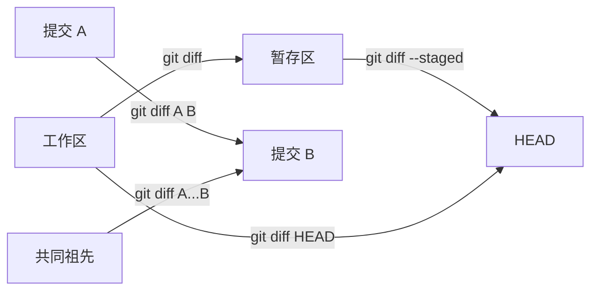

# diff、log 与历史导航

> 所属计划: [[git-deep-dive|Git 进阶——从日常使用到底层原理]]
> 预计耗时: 60min
> 前置知识: [[01-git-mental-model|Git 心智模型：快照而非差异]]

---

## 1. 概念讲解

### 为什么需要这个？

项目做久了，历史会变成一张有向无环图（DAG）。日常开发里你经常会问：

- 这个文件为什么这么写？
- 某个 bug 到底是哪次提交引入的？
- 我上周到底改了什么？
- 这两个分支之间到底差了哪些提交？

`git log` 负责"历史导航"——在 DAG 上按条件列出提交；`git diff` 负责"差异计算"——比较任意两个快照；`git blame` 负责"行级溯源"。三者组合，就能把历史看得清清楚楚。

### 核心思想

Git 的历史是**快照序列**，不是差异序列。`git log` 只是在这些快照之间游走，`git diff` 则是在你指定的两个快照之间做"找不同"。因此我们的 workflow 通常是：

1. 先定范围：用 `git log` 找到可疑提交。
2. 再看内容：用 `git diff` / `git show` 看具体改了什么。
3. 最后定位到人/时间：用 `git blame` 看每一行的最后修改者。

#### `git log` 强力格式化

常用选项：

| 选项 | 作用 |
|------|------|
| `--oneline` | 每提交一行，显示短 hash 和标题 |
| `--graph` | ASCII 图展示分支/合并结构 |
| `--all` | 显示所有分支的历史 |
| `--decorate` | 显示分支/tag 名 |
| `--stat` | 显示改动文件统计 |
| `-p` | 显示完整补丁 |
| `--format='...'` | 自定义每行输出 |
| `--since` / `--until` | 按时间过滤 |
| `--author` | 按作者过滤 |
| `--grep` | 按提交信息过滤 |
| `-S"<string>"` | pickaxe：字符串出现次数发生变化的提交 |
| `-G"<regex>"` | pickaxe：正则匹配到的行发生变化的提交 |

`%h` 短 hash、`%s` subject、`%an` 作者名、`%cr` 相对时间等占位符在脚本和别名里非常常用。

#### `git diff` 全变体



常见比较：

| 命令 | 比较对象 |
|------|----------|
| `git diff` | 工作区 vs 暂存区 |
| `git diff --staged` | 暂存区 vs `HEAD` |
| `git diff HEAD` | 工作区 vs `HEAD` |
| `git diff <commit>` | 工作区 vs 指定提交 |
| `git diff A B` | 提交 A vs 提交 B |

> [!warning] `..` 与 `...` 在 `git log` 和 `git diff` 里含义不同
>
> | 语法 | `git log` 含义 | `git diff` 含义 |
> |------|----------------|-----------------|
> | `A..B` | 在 B 可达、但不在 A 可达的提交 | 等价于 `git diff A B`（两端点直接比较） |
> | `A...B` | 对称差：只在 A 或只在 B 的提交 | 从 `merge-base(A,B)` 到 B 的差异 |
>
> 记忆窍门：`git log` 的 `..` 是"减法"，`...` 是"异或"；`git diff` 的 `...` 是"看我这边从分岔后改了什么"。

#### `git show <commit>`

一次性看某个提交的元数据 + 补丁。等价于 `git log -1 -p <commit>`，但更方便。加上 `--stat` 只看改动文件统计，加上 `--name-only` 只看文件名。

#### `git blame` / `git blame -w`

给文件的每一行标注"最后一次修改它的提交和作者"。`-w` 忽略空白差异，`-C` 检测跨文件复制，`-M` 检测行移动。

#### `git log -S` / `-G` 搜历史

`-S`（pickaxe）找**字符串出现次数变化**的提交；`-G` 用正则匹配**增删行**。两者配合 `-p` 才能看到具体补丁。这是"代码考古"的核心工具。

#### `git reflog` 简述

`reflog` 是 `HEAD` 在本地的操作日志：每次提交、切换分支、rebase、reset 都会留下记录。默认已可达记录保留 90 天，不可达记录保留 30 天。它是"后悔药"，详解见 [[06-reflog-undo|Reflog 与撤销的艺术]]。

#### `git rev-parse`

把引用（如 `HEAD`、`main~3`）解析成 SHA，也支持 `--abbrev-ref HEAD` 获取当前分支名。常用于脚本、别名和 CI。

---

## 2. 代码示例

场景：在 `git-playground` 仓库里，找出 `div()` 函数"没有零除保护"是哪次提交引入的，并演示 `git diff` 的多种用法。

**环境要求**：Git ≥ 2.40；建议 Git Bash / WSL / macOS / Linux。Windows CMD/PowerShell 的部分 shell 语法可能不兼容。

> [!note] 关于行尾
> 如果你在 Windows 上遇到 "LF will be replaced by CRLF" 的警告，可以执行 `git config core.autocrlf false`（本仓库级别）避免它干扰 diff。

**运行方式**：

```bash
# 1. 创建练习仓库
mkdir git-playground && cd git-playground
git init -b main
git config user.name "Learner"
git config user.email "learner@example.com"
git config core.autocrlf false   # 避免行尾转换干扰 diff

# 2. 构造主分支历史
printf 'def add(a, b):\n    return a + b\n' > calc.py
git add calc.py && git commit -m "feat: add add()"

printf 'def add(a, b):\n    return a + b\n\ndef sub(a, b):\n    return a - b\n' > calc.py
git add calc.py && git commit -m "feat: add sub()"

printf 'def add(a, b):\n    return a + b\n\ndef sub(a, b):\n    return a - b\n\ndef div(a, b):\n    return a / b\n' > calc.py
git add calc.py && git commit -m "feat: add div() (bug: no zero guard)"

printf 'def add(a, b):\n    return a + b\n\ndef div(a, b):\n    return a / b\n' > calc.py
git add calc.py && git commit -m "refactor: remove sub()"

# 3. 加一个纯格式化的提交，演示 blame -w
printf 'def add( a, b ):\n    return a + b\n\ndef div( a, b ):\n    return a / b\n' > calc.py
git add calc.py && git commit -m "style: reformat spacing"

# 4. 创建一个 experiment 分支，用于演示 .. 与 ...
git switch -c experiment $(git rev-list --max-parents=0 HEAD)
printf 'def add(a, b):\n    return a + b\n\ndef mul(a, b):\n    return a * b\n' > calc.py
git add calc.py && git commit -m "feat: add mul() on experiment"

# 切回 main
git switch main

# 5. 查看 DAG
git log --oneline --graph --all --decorate

# 6. 找出引入 div() 的提交
git log -p -S"def div" -- calc.py

# 7. blame 每一行的最后修改者
git blame -w calc.py

# 8. 看某个提交的完整信息
git show --stat HEAD~2

# 9. diff 的三种日常场景
printf 'def add( a, b ):\n    return a + b\n\ndef div( a, b ):\n    if b == 0:\n        raise ValueError("division by zero")\n    return a / b\n' > calc.py
git diff              # 工作区 vs 暂存区
git add calc.py
git diff --staged     # 暂存区 vs HEAD
git diff HEAD         # 工作区 vs HEAD

# 10. 分支间的 .. 与 ...
git diff main..experiment
git diff main...experiment
git log --oneline main..experiment
git log --oneline main...experiment

# 11. 解析引用
git rev-parse HEAD
git rev-parse main~2
git rev-parse --abbrev-ref HEAD

# 12. reflog
git reflog
```

**预期输出（节选，hash 以你本地实际为准）**：

DAG：

```text
* ea6c085 (HEAD -> main) style: reformat spacing
* 3c094ac refactor: remove sub()
* 80c6e99 feat: add div() (bug: no zero guard)
* b86e28e feat: add sub()
| * 5f94cf0 (experiment) feat: add mul() on experiment
|/
* 050336f feat: add add()
```

`git log -p -S"def div" -- calc.py` 会定位到引入 `div()` 的提交：

```text
80c6e99 feat: add div() (bug: no zero guard)
  diff --git a/calc.py b/calc.py
  ...
  +def div(a, b):
  +    return a / b
```

`git blame -w calc.py`（`-w` 让格式化提交不影响归属）：

```text
^050336f (Learner 2026-06-23 18:50:12 +0800 1) def add( a, b ):
^050336f (Learner 2026-06-23 18:50:12 +0800 2)     return a + b
b86e28ee (Learner 2026-06-23 18:50:12 +0800 3)
80c6e991 (Learner 2026-06-23 18:50:12 +0800 4) def div( a, b ):
80c6e991 (Learner 2026-06-23 18:50:12 +0800 5)     return a / b
```

`git diff main..experiment` 与 `git diff main...experiment` 的区别：

```text
# main..experiment：main 与 experiment 当前的直接差异
calc.py | 4 ++--
- def div(a, b):
-     return a / b
+ def mul(a, b):
+     return a * b

# main...experiment：experiment 自从与 main 分岔后改了什么
calc.py | 3 +++
+ def mul(a, b):
+     return a * b
```

---

## 3. 练习

### 练习 1: 自定义 log 别名

写一个 Git 别名 `git who`，它使用 `--format` 同时显示短 hash、提交标题、相对时间和作者名，并且默认查看所有分支。运行效果类似：

```text
<hash> style: reformat spacing (2 minutes ago) <Learner>
<hash> feat: add div() (bug: no zero guard) (5 minutes ago) <Learner>
...
```

### 练习 2: 找出"删除函数"的提交

在上面的 playground 中，`sub()` 函数后来被删掉了。使用 `git log -S` 找出**删除** `sub()` 的提交，并查看那次提交的完整 diff。

### 练习 3: 用 `-L` 追溯函数历史（可选）

使用 `git log -L` 追溯 `calc.py` 中 `div()` 函数的历史演变，观察零除保护是在哪一步加入的（如果你做了 bug 修复）或缺失了多久。

---

## 3.5 参考答案

> [!tip]- 练习 1 参考答案
> 参考答案不是唯一解——只要别名输出的字段和要求一致，就是正确的。
> ```bash
> git config alias.who "log --format='%h %s (%cr) <%an>' --all"
> ```
> 然后执行：
> ```bash
> git who
> ```
> 常见占位符：`%h` 短 hash、`%s` subject、`%cr` 相对提交时间、`%an` 作者名、`%ae` 作者邮箱。

> [!tip]- 练习 2 参考答案
> `-S` 会找字符串出现次数发生变化的提交；`sub()` 被删除意味着 `def sub` 出现次数从 1 变成 0。
> ```bash
> git log -p -S"def sub" -- calc.py
> ```
> 输出应包含 `refactor: remove sub()`，并显示 `-def sub(a, b):` 等删除行。

> [!tip]- 练习 3 参考答案（可选）
> `git log -L` 支持函数名或行号范围。对 `div()` 函数：
> ```bash
> git log -L ':div:calc.py'
> ```
> 如果函数名识别失败，可改用当前文件中的行号范围，例如：
> ```bash
> git log -L 4,5:calc.py
> ```
> 配合 `-p` 可以看到每次改动对应的补丁。

> [!note] 答案使用方式
> 先独立完成练习，再展开查看参考答案。参考答案不是唯一解——如果你的实现通过了测试或达到了题目要求，就是正确的。

---

## 4. 扩展阅读

- [Pro Git: Viewing the Commit History](https://git-scm.com/book/en/v2/Git-Basics-Viewing-the-Commit-History)
- [Pro Git: 查看已暂存和未暂存的改动](https://git-scm.com/book/en/v2/Git-Basics-Recording-Changes-to-the-Repository#_viewing_your_staged_and_unstaged_changes)
- [Git 文档：git-blame](https://git-scm.com/docs/git-blame)
- [Git 文档：git-log 的 -S/-G 选项](https://git-scm.com/docs/git-log#Documentation/git-log.txt--Sltstringgt)
- [Git 文档：git-rev-parse](https://git-scm.com/docs/git-rev-parse)

---

## 常见陷阱

- **`git diff A..B` 与 `git diff A...B` 混淆**：`..` 是直接比较两个端点，`...` 是"从共同祖先到 B"。与 `git log` 的 `..`/`...` 含义不同，第一次用的时候建议先用 `git merge-base A B` 确认分岔点。

- **`git blame` 被格式化/移动代码误导**：一次纯空格或换行调整会让 `blame` 把责任算到那次格式化提交上。先用 `git blame -w` 忽略空白；如果代码是从别处复制/移动过来的，再加 `-C` / `-M`。

- **不知道 pickaxe 能搜内容历史**：很多人用 `git log --grep` 搜提交信息，却不知道 `-S` 和 `-G` 能搜代码本身。`-S` 适合找"这个字符串是什么时候出现/消失的"，`-G` 适合正则匹配增删行。

- **`git log -S` 默认区分大小写且不支持正则**：`-S` 后面是固定字符串，大小写敏感；需要正则时用 `-G`。

- **把 `reflog` 当成远程/共享的**：`reflog` 只保存在本地 `.git/logs/`，`clone` 或 `push` 不会带走它。想"后悔"必须在当前仓库操作，详情见 [[06-reflog-undo|Reflog 与撤销的艺术]]。

- **`git log` 不带 `--all` 时看不到其他分支**：默认只走当前分支可达的提交。要查全仓库历史，记得加 `--all` 或显式指定分支名。
