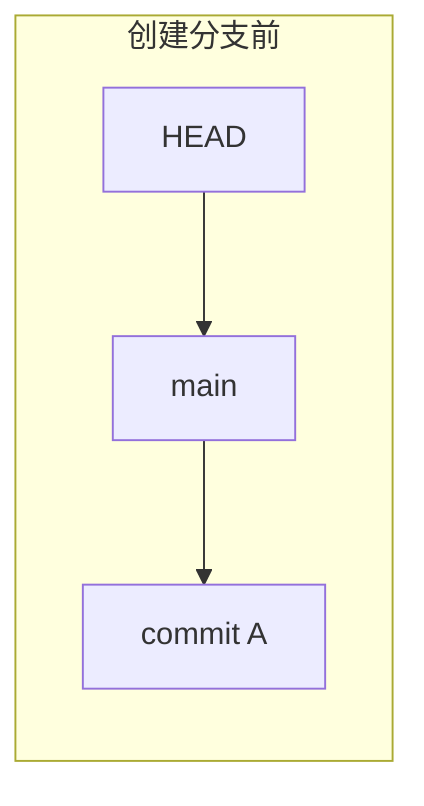
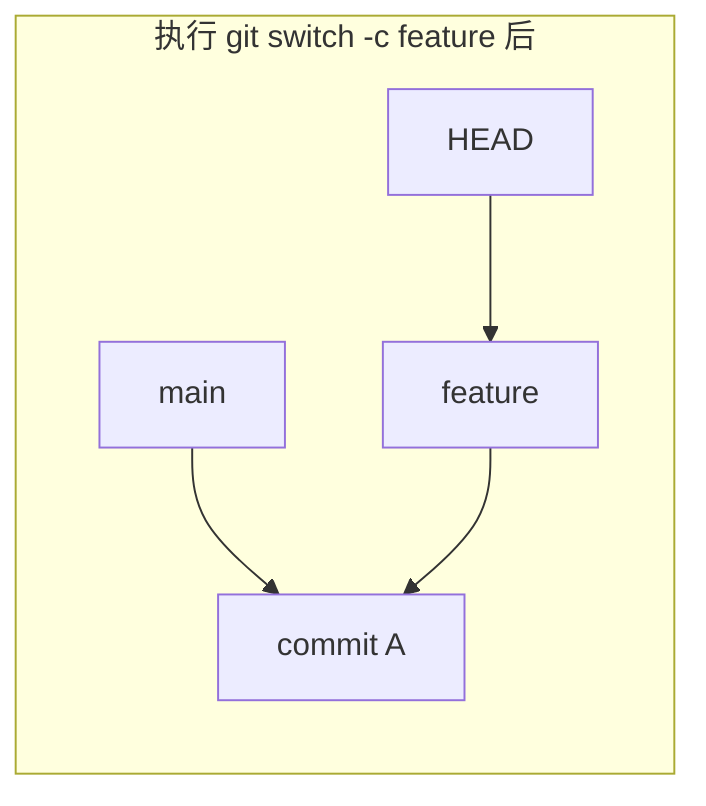
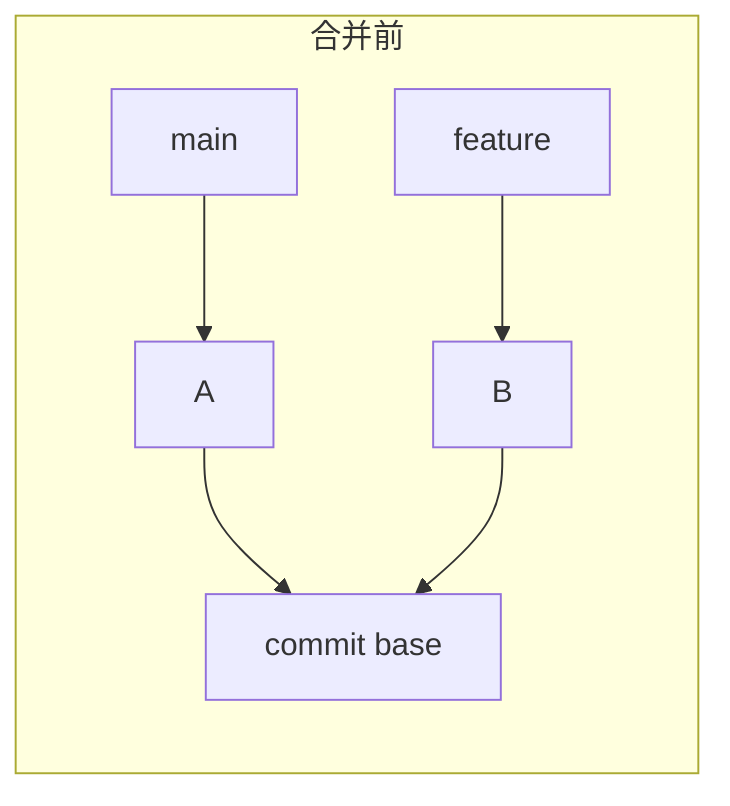
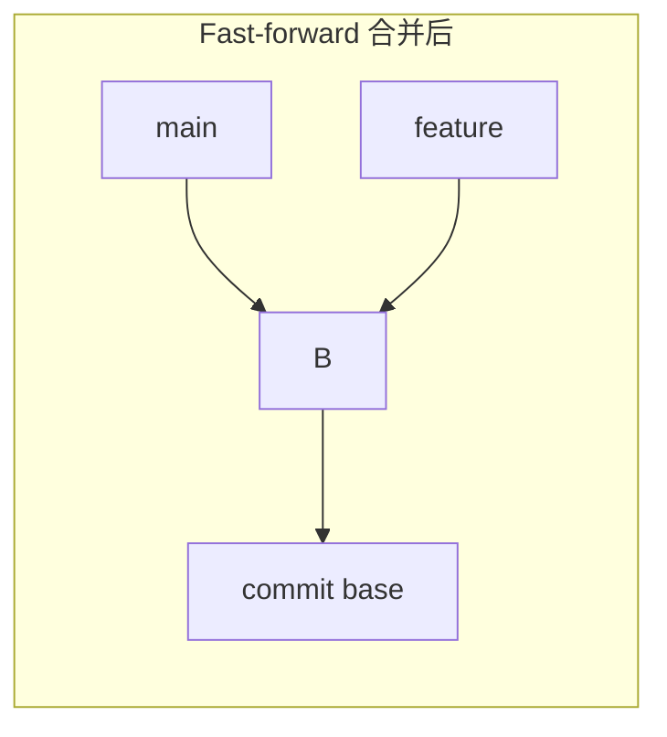
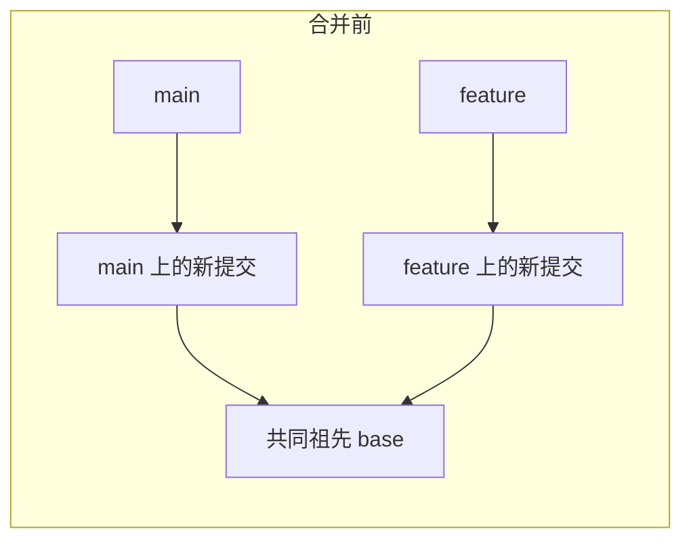
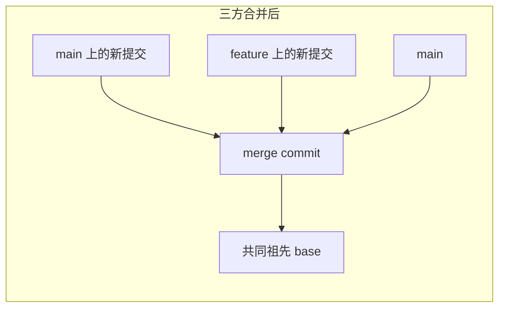

# 分支与合并深入

> 所属计划: [[git-deep-dive|Git 进阶——从日常使用到底层原理]]
> 预计耗时: 60min
> 前置知识: [[01-git-mental-model|Git 心智模型：快照而非差异]]

---

## 1. 概念讲解

### 为什么需要这个？

分支是 Git 最核心的协作工具之一。它让开发者可以并行实验、隔离功能开发、修复线上问题，而不用担心互相干扰。但很多人在合并时只依赖“自动合并”，一旦看到 `CONFLICT` 就慌了；或者在团队里因为滥用 `merge` 导致历史图变成一团乱麻。

理解“分支只是一根指针”、“fast-forward 与三方合并的区别”、“何时该用 `--no-ff`”以及“冲突到底怎么产生的”，能帮你做出更干净的历史、更安全地解决合并冲突。

### 核心思想

#### 分支 = 指向提交的轻量指针

在 Git 中，分支并不是“复制了一份代码”，它只是 `.git/refs/heads/<分支名>` 里的一个小文件，存着一个 commit hash。创建分支的成本几乎为零。

`HEAD` 是一个特殊的符号引用（symbolic ref），指向当前所在分支。`git switch feature` 本质上只是让 `HEAD` 指向 `feature`，然后更新工作目录。





#### 现代命令：`git switch` 与 `git checkout`

Git 2.23 引入了 `git switch` 和 `git restore`，把 `git checkout` 过载的语义拆解开：

| 意图 | 现代命令（推荐） | 老命令 |
| --- | --- | --- |
| 切换到已有分支 | `git switch main` | `git checkout main` |
| 创建并切换 | `git switch -c feature` | `git checkout -b feature` |
| 切回上一个分支 | `git switch -` | `git checkout -` |
| 恢复文件 | `git restore <file>` | `git checkout -- <file>` |

> [!note]
> `git checkout` 仍然可用，但在教学中优先使用 `git switch`/`git restore`，可以减少新手把“切换分支”和“恢复文件”搞混的概率。

### Fast-forward 合并 vs 三方合并

#### Fast-forward（快进）

如果目标分支（如 `main`）在分叉后没有新提交，Git 会直接把 `main` 指针滑到 `feature` 的最新提交。历史保持一条直线，没有产生新的合并提交。





#### 三方合并（3-way merge）

如果 `main` 和 `feature` 在分叉后都产生了新提交，Git 会找出它们的共同祖先（base），然后把两边的改动合并成一个新的合并提交（merge commit）。这个合并提交有两个父提交。





### `--no-ff`：强制保留合并提交

即使当前合并可以 fast-forward，使用 `git merge --no-ff feature` 也会创建一个合并提交。为什么团队常这么做？

- **保留功能边界**：`git log --first-parent main` 可以只看 `main` 上的“功能级”提交。
- **便于回滚**：想撤销整个 `feature`，可以 `git revert -m 1 <merge-commit>`，而不需要逐个 revert 分支里的提交。
- **历史可读性**：在 graph 上能清晰看到“这个提交来自哪个功能分支”。

代价是历史不再是纯线性，但对于需要审计和发布的团队来说，这通常是值得的。

### 冲突产生原理与解决流程

冲突只在**同一文件的同一区域**出现不同修改时才会发生。Git 在文件中插入冲突标记：

```text
<​<<<<<< HEAD
当前分支（HEAD）的内容
=​======
对方分支的内容
>​>>>>>> feature
```

#### 标准解决流程

1. `git status` 查看哪些文件冲突。
2. 打开冲突文件，找到 `<​<<<<<<` 标记。
3. 决定保留哪边、合并两边，或重写这段内容。
4. 删除所有 `<​<<<<<<`、`=​======`、`>​>>>>>>` 标记。
5. `git add <文件>` 标记冲突已解决。
6. `git commit` 或 `git merge --continue` 完成合并。

如果在解决过程中发现搞砸了，随时可以用：

```bash
# 放弃本次合并，回到合并前的状态
git merge --abort
```

> [!important]
> `git merge --abort` 是合并事故里的“全身而退”按钮。它只在合并进行中有效，一旦完成合并就无法再用这个命令撤销。

### Merge 策略简介

Git 内部有多种合并策略，日常最常见的是 `ort`（从 Git 2.33 起成为默认）。

| 策略 | 说明 | 典型场景 |
| --- | --- | --- |
| `ort` | 现代默认策略，速度快、处理重命名更好 | 日常合并 |
| `recursive` | 旧默认策略（2.33 前） | 老版本 Git |
| `ours` | 保留当前分支内容，忽略对方改动 | 只想记录合并但不想引入对方代码 |
| `octopus` | 一次合并多个分支 | `git merge a b c` |
| `resolve` | 旧策略，已很少用 | 历史兼容 |

可通过 `git merge -s ort feature` 显式指定，但通常不需要。

> [!tip]
> 如果两个分支完全没有共同祖先（例如用 `git switch --orphan <分支名>` 创建的“孤儿分支”），默认合并会被拒绝。此时需要显式加 `--allow-unrelated-histories`。

```bash
git merge --allow-unrelated-histories orphan-branch
```

### 合并 vs Rebase：怎么选？

| 维度 | `git merge` | `git rebase` |
| --- | --- | --- |
| 历史形状 | 保留分叉与合并提交 | 线性，仿佛一直在最新 base 上开发 |
| 是否改写历史 | 否 | 是（生成新 commit hash） |
| 适用场景 | 公共分支、保留真实协作历史 | 本地 feature 分支整理提交 |
| 风险 | 合并冲突当场解决 | 重写已推送的提交会坑队友 |

黄金法则：**不要 rebase 已经推送到公共仓库的提交**。关于 rebase 的完整技术细节见 [[05-rebase-core|Rebase 核心技能]]。

---

## 2. 代码示例

下面的示例在一个全新的 `branch-merge-demo` 仓库中演示：

1. 创建 `feature` 分支并做非冲突改动；
2. 观察 fast-forward 合并；
3. 回退后用 `--no-ff` 强制产生合并提交；
4. 构造一个真实冲突并手动解决。

**运行环境要求**：Git ≥ 2.40；Windows 用户建议关闭 `core.autocrlf` 以避免行尾警告。

**运行方式：**

```bash
# 1. 创建并进入示例仓库
mkdir branch-merge-demo && cd branch-merge-demo
git init -b main

# 关闭行尾转换，避免 Windows 下出现大量警告
git config core.autocrlf false

git config user.name "Demo User"
git config user.email "demo@example.com"

# 2. 在 main 上创建基础提交
printf "# 菜谱\n\n## 基础汤底\n- 水 500ml\n- 鸡汤 100ml\n" > recipe.md
git add recipe.md
git commit -m "基础汤底"

# 3. 创建 feature 分支并加一行内容
git switch -c feature
printf "# 菜谱\n\n## 基础汤底\n- 水 500ml\n- 鸡汤 100ml\n- 香菇 3朵\n" > recipe.md
git add recipe.md
git commit -m "feature: 加入香菇"

# 4. 切回 main 做 fast-forward 合并
git switch main
git merge feature -m "合并 feature"
git log --oneline --graph --all

# 5. 回退到合并前，改用 --no-ff
git reset --hard HEAD~1
git merge --no-ff feature -m "合并 feature（--no-ff）"
git log --oneline --graph --all

# 6. 准备冲突场景：main 增加鸡汤量
git reset --hard HEAD~1
printf "# 菜谱\n\n## 基础汤底\n- 水 500ml\n- 鸡汤 200ml\n" > recipe.md
git add recipe.md
git commit -m "main: 增加鸡汤量"

# 7. 从基础提交分出 feature-conflict，修改同一行
git switch -c feature-conflict HEAD~1
printf "# 菜谱\n\n## 基础汤底\n- 水 500ml\n- 鸡汤 150ml\n- 香菇 3朵\n" > recipe.md
git add recipe.md
git commit -m "feature-conflict: 调整鸡汤并加香菇"

# 8. 切回 main 触发冲突并解决
git switch main
git merge feature-conflict

# 此时 recipe.md 会出现冲突标记，手动编辑保留想要的内容：
# printf "# 菜谱\n\n## 基础汤底\n- 水 500ml\n- 鸡汤 180ml\n- 香菇 3朵\n" > recipe.md

git add recipe.md
git commit -m "合并 feature-conflict：折中鸡汤量并加入香菇"
git log --oneline --graph --all
```

**预期输出：**

```text
Initialized empty Git repository in .../branch-merge-demo/.git/
[main (root-commit) 70b7ae6] 基础汤底
 1 file changed, 5 insertions(+)
 create mode 100644 recipe.md
=== 1) 创建 feature 分支并提交 ===
Switched to a new branch 'feature'
[feature c9c643e] feature: 加入香菇
 1 file changed, 1 insertion(+)
Switched to branch 'main'
=== 2) fast-forward 合并 ===
Updating 70b7ae6..c9c643e
Fast-forward (no commit created; -m option ignored)
 recipe.md | 1 +
 1 file changed, 1 insertion(+)
* c9c643e feature: 加入香菇
* 70b7ae6 基础汤底
=== 3) 回退，改用 --no-ff 合并 ===
HEAD is now at 70b7ae6 基础汤底
Merge made by the 'ort' strategy.
 recipe.md | 1 +
 1 file changed, 1 insertion(+)
*   fa484fe 合并 feature（--no-ff）
|\  
| * c9c643e feature: 加入香菇
|/  
* 70b7ae6 基础汤底
=== 4) 准备冲突：main 改鸡汤量 ===
HEAD is now at 70b7ae6 基础汤底
[main d177581] main: 增加鸡汤量
 1 file changed, 1 insertion(+), 1 deletion(-)
Switched to a new branch 'feature-conflict'
[feature-conflict 9de65b3] feature-conflict: 调整鸡汤并加香菇
 1 file changed, 2 insertions(+), 1 deletion(-)
Switched to branch 'main'
=== 5) 触发冲突并解决 ===
Auto-merging recipe.md
CONFLICT (content): Merge conflict in recipe.md
Automatic merge failed; fix conflicts and then commit the result.
--- 冲突标记如下 ---
# 菜谱

## 基础汤底
- 水 500ml
<​<<<<<< HEAD
- 鸡汤 200ml
=​======
- 鸡汤 150ml
- 香菇 3朵
>​>>>>>> feature-conflict
[main 8e5b89f] 合并 feature-conflict：折中鸡汤量并加入香菇
=== 6) 最终历史 ===
*   8e5b89f 合并 feature-conflict：折中鸡汤量并加入香菇
|\  
| * 9de65b3 feature-conflict: 调整鸡汤并加香菇
* | d177581 main: 增加鸡汤量
|/  
| * c9c643e feature: 加入香菇
|/  
* 70b7ae6 基础汤底
```

> [!tip]
> 示例里 commit hash 会和你本地完全一致（如果你按同样步骤执行），即便不同也是正常的；重点看 `--graph` 画出的历史形状和 `Fast-forward`、`CONFLICT` 等关键字。

---

## 3. 练习

建议在专门的练习仓库（例如 `git-playground`）中完成，不要直接动真实项目。

### 练习 1: 制造并解决一次冲突

基于本节示例仓库，再做一次新的合并冲突：

1. 在 `main` 上修改 `recipe.md`，把“水 500ml”改成“水 600ml”并提交。
2. 从当前 `main` 的父提交分出一个 `feature-soup` 分支，把同一行改成“水 450ml”并提交。
3. 切回 `main`，合并 `feature-soup`，预期会产生冲突。
4. 手动解决冲突，选择“水 550ml”作为最终结果，完成合并。

### 练习 2: 用 `--no-ff` 合并并解释 merge commit 的价值

1. 在练习仓库里新建 `feature-ui` 分支并做两次提交。
2. 切回 `main`，执行 `git merge --no-ff feature-ui -m "合并 feature-ui"`。
3. 用 `git log --oneline --graph --first-parent main` 查看历史。
4. 回答：`--first-parent` 显示的历史和 `git log --oneline --graph main` 有什么不同？为什么团队喜欢 `--no-ff`？

### 练习 3: 配置 `merge.conflictStyle = zdiff3`（可选）

1. 在当前仓库或全局配置 `git config merge.conflictStyle zdiff3`。
2. 重复练习 1 的冲突场景，不解决，查看冲突文件中的标记。
3. 对比默认冲突样式和 `zdiff3` 样式：多了什么信息？它如何帮助你判断“原本是什么”？
4. 完成后用 `git merge --abort` 退出合并状态。

---

## 3.5 参考答案

> [!tip]- 练习 1 参考答案
> 参考答案不是唯一解——如果你的操作成功触发了冲突并按预期解决了，就是正确的。
>
> ```bash
> # 在 main 上改水量
> git switch main
> printf "# 菜谱\n\n## 基础汤底\n- 水 600ml\n- 鸡汤 100ml\n" > recipe.md
> git add recipe.md
> git commit -m "main: 增加水量"
>
> # 从父提交分出 feature-soup 并改同一行
> git switch -c feature-soup HEAD~1
> printf "# 菜谱\n\n## 基础汤底\n- 水 450ml\n- 鸡汤 100ml\n" > recipe.md
> git add recipe.md
> git commit -m "feature-soup: 减少水量"
>
> # 合并并解决冲突
> git switch main
> git merge feature-soup
> # 编辑 recipe.md，保留 - 水 550ml
> git add recipe.md
> git commit -m "合并 feature-soup：折中水量"
> ```
>
> 要点：`git merge` 后若看到 `CONFLICT (content)` 即成功触发冲突；解决时务必删除 `<​<<<<<<`、`=​======`、`>​>>>>>>` 三行标记。

> [!tip]- 练习 2 参考答案
> 参考答案不是唯一解——只要你能解释 `--no-ff` 在历史保留上的作用即可。
>
> ```bash
> git switch -c feature-ui main
> printf "# 页面\n\n## 新增按钮\n- 提交\n" > ui.md
> git add ui.md
> git commit -m "feature-ui: 新增提交按钮"
>
> printf "# 页面\n\n## 新增按钮\n- 提交\n- 取消\n" > ui.md
> git add ui.md
> git commit -m "feature-ui: 新增取消按钮"
>
> git switch main
> git merge --no-ff feature-ui -m "合并 feature-ui"
> ```
>
> 查看效果：
>
> ```bash
> # 只沿 main 的第一父线看，feature-ui 的两条提交被“折叠”在 merge commit 里
> git log --oneline --graph --first-parent main
> ```
>
> 典型输出类似：
>
> ```text
> *   <hash> 合并 feature-ui
> *   <hash> 之前的 main 提交
> ```
>
> 价值：`--first-parent main` 像是一份“功能发布清单”，每个 merge commit 对应一个完整功能，便于 release note 和回滚。

> [!tip]- 练习 3 参考答案（可选）
> 参考答案不是唯一解——理解 `zdiff3` 多出的“共同祖先”信息即可。
>
> ```bash
> # 仓库级别启用 zdiff3
> git config merge.conflictStyle zdiff3
>
> # 重新制造冲突（复用练习 1 的两分支）
> git switch main
> git merge feature-soup
> cat recipe.md
> ```
>
> 在 `zdiff3` 模式下，冲突区会变成四段：
>
> ```text
> <​<<<<<< HEAD
> - 水 600ml
> |​|||||| <base-hash>
> - 水 500ml
> =​======
> - 水 450ml
> >​>>>>>> feature-soup
> ```
>
> 多出来的 `|​||||||` 段显示的是**共同祖先**里的内容（这里是 `水 500ml`）。它让你一眼看出双方各自改了多少，而不是只看到两个对立版本。
>
> ```bash
> # 退出合并状态，不保留结果
> git merge --abort
> ```

> [!note] 答案使用方式
> 先独立完成练习，再展开查看参考答案。参考答案不是唯一解——如果你的实现通过了测试或达到了题目要求，就是正确的。

---

## 4. 扩展阅读

- [Pro Git: 分支简介](https://git-scm.com/book/zh/v2/Git-%E5%88%86%E6%94%AF-%E5%88%86%E6%94%AF%E7%AE%80%E4%BB%8B)
- [Pro Git: 分支的合并](https://git-scm.com/book/zh/v2/Git-%E5%88%86%E6%94%AF-%E5%88%86%E6%94%AF%E7%9A%84%E6%96%B0%E5%BB%BA%E4%B8%8E%E5%90%88%E5%B9%B6)
- [Git 文档：git-merge](https://git-scm.com/docs/git-merge)
- [Git 文档：ort merge strategy](https://git-scm.com/docs/merge-strategies#Documentation/merge-strategies.txt-ort)
- [Atlassian: Merging vs Rebasing](https://www.atlassian.com/git/tutorials/merging-vs-rebasing)

---

## 常见陷阱

- **在主分支直接合并半成品分支，导致历史混乱**：在团队仓库里，应该通过 Pull Request / Merge Request 完成代码审查后再合并；本地实验分支合完若不需要，及时删除。
- **解决冲突时误删他人代码**：不要只保留 `HEAD` 或只保留对方版本。冲突标记里的内容都要逐行检查，必要时和原提交作者确认。
- **不知道 `git merge --abort` 可以全身而退**：合并进行到一半、冲突越解越乱时，立刻 `git merge --abort` 回到合并前状态，比硬提交错误结果安全得多。
- **把 fast-forward 和三方合并混为一谈**：`Fast-forward` 不生成新提交，而三方合并会生成 merge commit；观察历史时若期望看到 merge commit，记得加 `--no-ff`。
- **合并策略/冲突样式配置在团队间不一致**：建议在项目 `.gitattributes` 或团队文档里统一 `merge.conflictStyle` 等配置，减少代码审查时的噪音。

