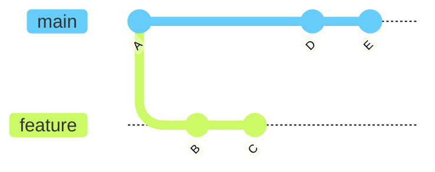
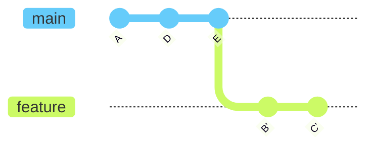
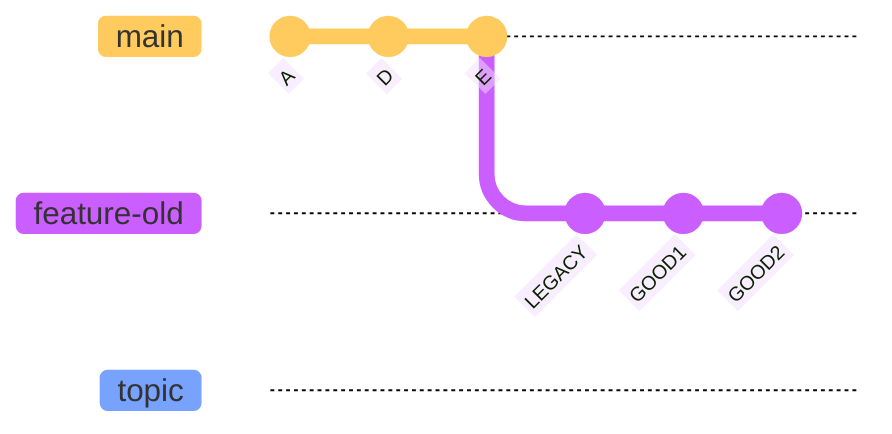

# Git 进阶 - Rebase 核心技能

> 所属计划: [[git-deep-dive|Git 进阶——从日常使用到底层原理]]
> 预计耗时: 75min
> 前置知识: [[03-diff-log-history|第 3 节 diff、log 与历史导航]]、[[04-branch-merge-deep|第 4 节 分支与合并深入]]

---

## 1. 概念讲解

### 为什么需要这个？

在 [[04-branch-merge-deep|分支与合并]] 中，我们学会了用 `git merge` 把分支合并到一起。`merge` 很安全：它保留原有提交，只在末尾补一个合并提交。但长期频繁地 `merge` 会让历史变成一张纵横交错的“意大利面图”，难以追踪某个功能到底由哪些提交组成。

`git rebase` 提供另一种思路：**把当前分支的提交“摘下来”，重新接到另一个基点上**。结果是历史变成一条干净的直线，每个功能分支都像是在 `main` 最新点上直接长出来的。

典型使用场景：

- 特性分支开发了两周，`main` 已经前进很多，你想在最新的 `main` 上继续测试/合并；
- 本地有 5 个“WIP / fix typo / add test / fix test / refactor”小提交，想整理成 2 个语义清晰的提交再提交 PR；
- 你基于错误的旧分支切出了新分支，需要把它“搬家”到正确基点上。

> [!important]
> Rebase 是**改写历史**的操作。它会生成**新的提交对象**（commit hash 改变），旧提交并不会真正消失，而是变成“不可达”，90 天后才可能被 `git gc` 清理。理解这一点是安全使用 rebase 的前提。

### 核心思想：重放提交

把分支 `feature` rebase 到 `main` 上时，Git 实际上做三件事：

1. 找到 `feature` 与旧基点（共同祖先）之间的提交序列；
2. 把这些提交按顺序算成**补丁**（diff）；
3. 把这些补丁在 `main` 最新提交上**逐个重新应用**，生成新的提交。



上图：main 在 `A` 之后继续产生了 `D`、`E`；feature 在 `A` 之后产生了 `B`、`C`。`git rebase main` 会把 `B`、`C` 重放到 `E` 之后：



`B'`、`C'` 与原来的 `B`、`C` **内容相同但 hash 不同**，因为它们有了新的父提交和生成时间。

### 交互式 rebase：像编辑清单一样整理历史

`git rebase -i <基线>` 会打开一个“todo 清单”，每一行代表一个要重放的提交，前面有一个动作：

| 动作 | 简写 | 含义 |
| --- | --- | --- |
| `pick` | `p` | 保留该提交（可调整顺序） |
| `reword` | `r` | 保留提交，但修改提交信息 |
| `edit` | `e` | 保留提交，但在应用后暂停，允许你修改提交内容 |
| `squash` | `s` | 把该提交合并到上一个提交，保留两个提交信息供编辑 |
| `fixup` | `f` | 把该提交合并到上一个提交，**丢弃**该提交信息 |
| `drop` | `d` | 删除该提交 |
| `exec` | `x` | 在该提交后执行 shell 命令（可选进阶） |

> [!note]
> 有人会把整个操作本身称为 rebase。在 todo 清单里可配置的“动作”主要是上表中的 `pick` / `reword` / `edit` / `squash` / `fixup` / `drop` / `exec` 等；并不存在一个叫 `rebase` 的 todo 动作，它指的是“把这些提交重新接到新基点上”的整个过程。

### `--onto`：精准移植提交

普通 `git rebase main` 的默认旧基点是当前分支与 `main` 的**合并基准**（merge base）。当你想把分支上**某一段连续提交**移到另一个完全不同的基点上时，就需要三参数 `--onto`：

```bash
git rebase --onto <新基点> <旧基点> <要移动的分支>
```

含义：取 `<旧基点>..<要移动的分支>` 之间的提交，把它们接到 `<新基点>` 上。

### 黄金法则：绝不 rebase 公共提交

> [!warning]
> **不要 rebase 已经推送到公共分支的提交。** 因为 rebase 会生成新 hash，一旦别人基于旧提交继续开发，你重写后推送会导致历史分叉，团队成员被迫处理混乱的合并。

安全口诀：

- 本地未推送的提交 → 可以 rebase；
- 已推送到共享远程的提交 → 用 `git revert` 或另开新提交修正；
- 不得不重写已推送分支时 → 使用 `git push --force-with-lease`（详见 [[13-remote-collaboration|第 13 节 远程协作进阶]]），并确保团队知情。

### `--autosquash` 与 `--update-refs`

- `--autosquash`：配合 `git commit --fixup=<目标提交>` 生成的“`fixup! ...`”提交，交互式 rebase 会自动把它们排到目标提交后面并设为 `fixup`，省去手动整理。
- `--update-refs`（Git ≥ 2.38）：当多个分支像“堆叠”一样依赖当前分支时，rebase 会同时更新这些依赖分支的指针，避免手动逐个 rebase。详见后面的代码示例。

---

## 2. 代码示例

### 环境要求

- Git ≥ 2.40（推荐 ≥ 2.38 以使用 `--update-refs`）。
- 使用 `git switch` / `git restore`（Git 2.23+）。
- 以下示例在独立目录 `git-playground-rebase` 中运行，**不要**在真实项目目录里直接复制粘贴。
- 为避免 Windows 行尾（`core.autocrlf`）导致示例冲突，每个练习仓库建议先执行 `git config core.autocrlf false`。

### 示例 1：普通 rebase 让 feature 跟上 main

**运行方式:**

```bash
# 创建并进入练习仓库
mkdir git-playground-rebase && cd git-playground-rebase
git init
git config core.autocrlf false
git switch -c main

# 创建初始提交 A
echo "A" > file.txt
git add file.txt
git commit -m "A: init"

# 切出 feature 分支并产生 B
git switch -c feature
echo "B" >> file.txt
git commit -am "B: feature part 1"

# 切回 main 产生 D、E，模拟别人继续推进
git switch main
echo "D" >> main.txt && git add main.txt && git commit -m "D: main update 1"
echo "E" >> main.txt && git commit -am "E: main update 2"

# 查看当前分叉历史
git log --oneline --graph --all --decorate

# 把 feature 变基到最新 main
git switch feature
git rebase main

# 查看变基后的线性历史
git log --oneline --graph --all --decorate
```

**预期输出（节选）:**

```text
* a1b2c3d (HEAD -> feature) B: feature part 1
* e4f5g6h (main) E: main update 2
* i7j8k9l D: main update 1
* m0n1o2p A: init
```

> [!tip]
> 变基后 `feature` 指向 `E` 之后的新提交，`main` 保持不动。`B` 的 hash 已经改变。

---

### 示例 2：交互式 rebase 把 5 个零散提交整理成 2 个语义提交

**运行方式:**

```bash
# 继续在刚才的仓库里操作，基于示例 1 的 feature 分支
# 确保当前在 feature
git switch feature

# 制造 5 个零散提交
echo "search api" >> search.txt
git add search.txt
git commit -m "WIP: add search scaffold"

echo "search impl" >> search.txt
git commit -am "implement search"

echo "typo fixed" >> search.txt
git commit -am "fix typo"

echo "test" >> search_test.txt
git add search_test.txt
git commit -m "add search test"

echo "refactor" >> search.txt
git commit -am "refactor search"

# 查看当前历史
git log --oneline main..feature
```

**预期输出:**

```text
1a2b3c4 refactor search
5d6e7f8 add search test
8g9h0i1 fix typo
2j3k4l5 implement search
6m7n8o9 WIP: add search scaffold
```

现在我们要把这 5 个提交整理为 2 个：

1. `feat: implement search`（包含 scaffold + implement + fix typo + refactor）
2. `test: add search test`

执行交互式 rebase：

```bash
# 以 main 为基线，整理从 main 到 feature 的所有提交
git rebase -i main
```

Git 会打开编辑器，显示类似下面的 todo 清单（实际 hash 不同）：

```text
pick 6m7n8o9 WIP: add search scaffold
pick 2j3k4l5 implement search
pick 8g9h0i1 fix typo
pick 5d6e7f8 add search test
pick 1a2b3c4 refactor search
```

把它改成：

```text
pick 2j3k4l5 implement search
fixup 6m7n8o9 WIP: add search scaffold
fixup 8g9h0i1 fix typo
fixup 1a2b3c4 refactor search
pick 5d6e7f8 add search test
```

保存退出后，Git 会再次打开提交信息编辑器，让你写第一个合并后提交的信息。输入：

```text
feat: implement search

- add search scaffold
- implement core logic
- fix typo and refactor
```

保存退出。查看结果：

```bash
git log --oneline main..feature
```

**预期输出:**

```text
9p0q1r2 test: add search test
3s4t5u6 feat: implement search
```

> [!note]
> 练习中如果不会用 Vim/默认编辑器，可以临时把编辑器改成更友好的工具：
> `git config --global core.editor "code --wait"`（VS Code）或 `notepad`（Windows）。
> 也可以设置 `GIT_SEQUENCE_EDITOR` 只影响本次 rebase 的 todo 文件。

---

### 示例 3：`--onto` 删除中间提交并移植剩余提交

假设分支 `topic` 原本从 `feature` 切出，现在你想让它直接从 `main` 开始，并跳过 `feature` 上的某个提交。

**运行方式:**

```bash
# 接示例 2，先回到 main 并创建一个会被跳过的提交
git switch main
echo "legacy" >> legacy.txt
git add legacy.txt
git commit -m "LEGACY: experimental code"

# 从 main 切出 feature-old（模拟旧 feature）
git switch -c feature-old

# 在 feature-old 上产生两个提交
echo "good1" >> good.txt
git add good.txt
git commit -m "GOOD1: valuable work"

echo "good2" >> good.txt
git commit -am "GOOD2: more valuable work"

# 从 feature-old 切出 topic
git switch -c topic

# 查看历史
git log --oneline --graph --all --decorate
```

当前结构类似：



现在要把 `topic` 上源自 `feature-old` 的 `GOOD1`、`GOOD2` 直接接到 `main`（跳过 `LEGACY`）：

```bash
# 三参数 --onto：新基点 = main，旧基点 = feature-old，要移动的分支 = topic
git rebase --onto main feature-old topic

# 查看结果
git log --oneline --graph --all --decorate
```

**预期输出（节选）:**

```text
* x1y2z3a (HEAD -> topic) GOOD2: more valuable work
* b4c5d6e GOOD1: valuable work
* e4f5g6h (main) E: main update 2
```

`LEGACY` 提交不再在 `topic` 的历史里。注意：`feature-old` 分支本身不受影响，只是 `topic` 被搬家了。

---

### 示例 4：`--autosquash` 自动整理 fixup 提交

**运行方式:**

```bash
# 基于示例 2 整理后的 feature 继续
git switch feature

# 找到 feat 提交的 hash（假设为 3s4t5u6）
FEAT_HASH=$(git rev-parse HEAD~1)

# 创建一个 fixup 提交，Git 会记录它要合并到哪个提交
echo "search edge case" >> search.txt
git commit -am "fixup! feat: implement search"

# 再创建一个 fixup 提交
echo "search test helper" >> search_test.txt
git commit -am "fixup! test: add search test"

# 查看当前历史：两个 fixup! 提交在末尾
git log --oneline main..feature
```

**预期输出:**

```text
7h8i9j0 fixup! test: add search test
4k5l6m7 fixup! feat: implement search
9p0q1r2 test: add search test
3s4t5u6 feat: implement search
```

使用 `--autosquash` 自动排序：

```bash
git rebase -i main --autosquash
```

Git 打开的 todo 清单会自动变成：

```text
pick 3s4t5u6 feat: implement search
fixup 4k5l6m7 fixup! feat: implement search
pick 9p0q1r2 test: add search test
fixup 7h8i9j0 fixup! test: add search test
```

保存退出后，两个 fixup 提交分别合并进目标提交，历史再次变得干净。

> [!tip]
> 可以设置 `git config --global rebase.autosquash true`，以后 `git rebase -i` 默认启用 `--autosquash`。

---

### 示例 5：`--update-refs` 处理堆叠分支（Git ≥ 2.38）

现代工作流中经常出现“堆叠 PR”：

- `feature-a` 基于 `main`；
- `feature-b` 基于 `feature-a`；
- `feature-c` 基于 `feature-b`。

如果 `feature-a` 被 review 要求改动并 rebase 到最新 `main`，`feature-b` 和 `feature-c` 原本指向的旧提交就“悬空”了。手动逐个 rebase 很麻烦。`--update-refs` 可以一次更新所有依赖分支。

**运行方式:**

```bash
# 新建一个干净环境
cd ..
rm -rf git-playground-rebase-stacked
mkdir git-playground-rebase-stacked && cd git-playground-rebase-stacked
git init
git config core.autocrlf false
git switch -c main

# main: A -> M1
echo "A" > a.txt && git add a.txt && git commit -m "A"
echo "M1" >> a.txt && git commit -am "M1"

# feature-a: A1（使用独立文件避免冲突）
git switch -c feature-a
echo "A1" > feature-a.txt && git add feature-a.txt && git commit -m "A1"

# feature-b: A1 -> B1
git switch -c feature-b
echo "B1" > feature-b.txt && git add feature-b.txt && git commit -m "B1"

# feature-c: A1 -> B1 -> C1
git switch -c feature-c
echo "C1" > feature-c.txt && git add feature-c.txt && git commit -m "C1"

# main 继续前进到 M2
git switch main
echo "M2" >> a.txt && git commit -am "M2"

# 把堆叠分支最顶端的 feature-c 变基到 main，同时更新 feature-a 和 feature-b
git rebase main feature-c --update-refs

# 查看所有分支位置
git log --oneline --graph --all --decorate
```

**预期输出（节选）:**

```text
* c7d8e9f (HEAD -> feature-c) C1
* b0c1d2e (feature-b) B1
* a3b4c5d (feature-a) A1
* m6n7o8p (main) M2
* q9r0s1t M1
* u2v3w4x A
```

`feature-a`、`feature-b`、`feature-c` 一起前移到了新的提交链上，无需手动逐个 rebase。

> [!warning]
> `--update-refs` 只更新**本地**分支引用。如果 `feature-b` / `feature-c` 已经推送到远程，推送时仍要按 [[13-remote-collaboration|远程协作]] 的安全流程处理。

---

### 示例 6：rebase 冲突处理

Rebase 过程中，如果当前补丁与目标基点上的代码冲突，Git 会暂停并让你解决。

**运行方式:**

```bash
# 新建环境
cd ..
rm -rf git-playground-rebase-conflict
mkdir git-playground-rebase-conflict && cd git-playground-rebase-conflict
git init
git config core.autocrlf false
git switch -c main

# main 提交 A
echo "line1" > config.txt && git add config.txt && git commit -m "A: add config"

# 从 main 切出 feature 并提交 C
git switch -c feature
echo "line2 feature" >> config.txt && git commit -am "C: feature adds line2"

# main 继续提交 B，与 feature 的 C 修改同一行
git switch main
echo "line2 main" >> config.txt && git commit -am "B: main adds line2"

# 变基会产生冲突
git switch feature
git rebase main
```

**预期输出:**

```text
Auto-merging config.txt
CONFLICT (content): Merge conflict in config.txt
error: could not apply C: feature adds line2
hint: Resolve all conflicts manually, mark them as resolved with
hint: "git add/rm <conflicted-files>", then run "git rebase --continue".
hint: Disable this message with "git config advice.mergeConflict false"
```

查看冲突文件：

```bash
cat config.txt
```

**预期输出:**

```text
line1
<<<<<<< HEAD
line2 main
=======
line2 feature
>>>>>>> C: feature adds line2
```

解决冲突：

```bash
# 编辑文件，保留你想要的内容，例如：
printf "line1\nline2 main\nline2 feature\n" > config.txt

# 标记冲突已解决
git add config.txt

# 继续 rebase
git rebase --continue
```

> [!tip]
> 冲突解决中途，如果你发现搞错了，可以随时中止：
> ```bash
> git rebase --abort
> ```
> 这会回到 rebase 之前的状态，工作区和 index 都会被恢复。

---

## 3. 练习

所有练习建议在独立的 `git-playground-rebase` 仓库中完成，完成一个练习后可删除目录重建。

### 练习 1: squash 合并最近 3 个提交

在你自己的练习仓库里，创建一个分支并做 3 个提交（例如“add header / fix css / add footer”），然后使用交互式 rebase 把它们合并成 1 个提交，提交信息为 `feat: rebuild landing page`。

### 练习 2: reword 改写中间提交信息

构造 3 个提交：

1. `add login form`
2. `fix bux`（故意拼错）
3. `add tests`

使用交互式 rebase 把第 2 个提交的提交信息改成 `fix bug`，但**不要**改变它的代码内容。

### 练习 3: 用 `--onto` 把 feature 分支从旧基点迁到新基点（可选）

构造如下历史：

- `main` 上有提交 `M1`；
- 从 `M1` 切出 `old-base` 并产生提交 `O1`；
- 从 `old-base` 切出 `feature` 并产生提交 `F1`、`F2`。

现在要求：把 `feature` 上的 `F1`、`F2` 直接接到 `main` 的最新提交上，使 `feature` 不再依赖 `old-base` 和 `O1`。

---
## 3.5 参考答案

> [!tip]- 练习 1 参考答案
> 参考答案不是唯一解——如果你的实现通过了自我检查（`git log --oneline` 显示只剩 1 个语义提交，且内容包含原来的 3 次改动），就是正确的。

> ```bash
> # 创建练习环境
> mkdir git-playground-ex1 && cd git-playground-ex1
> git init
> git config core.autocrlf false
> git switch -c main
>
> # 初始提交
> echo "base" > index.html && git add index.html && git commit -m "init"
>
> # 创建分支并做 3 个提交
> git switch -c landing
> echo "<header>" >> index.html && git commit -am "add header"
> echo "<style>" >> index.html && git commit -am "fix css"
> echo "<footer>" >> index.html && git commit -am "add footer"
>
> # 交互式 rebase，合并最近 3 个提交
> git rebase -i HEAD~3
> ```
>
> 在打开的 todo 清单中改成：
>
> ```text
> pick <hash1> add header
> squash <hash2> fix css
> squash <hash3> add footer
> ```
>
> 保存后编辑合并后的提交信息为：
>
> ```text
> feat: rebuild landing page
> ```
>
> 验证：
> ```bash
> git log --oneline
> git show --stat HEAD
> ```

> [!tip]- 练习 2 参考答案
> 参考答案不是唯一解——如果你能让中间那个拼错的提交信息变成 `fix bug` 而文件内容不变，就是正确的。
>
> ```bash
> mkdir git-playground-ex2 && cd git-playground-ex2
> git init
> git config core.autocrlf false
> git switch -c main
>
> echo "base" > app.py && git add app.py && git commit -m "init"
> git switch -c login
> echo "form" >> app.py && git commit -am "add login form"
> echo "bugfix" >> app.py && git commit -am "fix bux"
> echo "tests" >> app.py && git commit -am "add tests"
>
> # 以 init 为基线，整理 3 个提交
> git rebase -i HEAD~3
> ```
>
> 在 todo 清单中把第二个提交前的 `pick` 改成 `reword`：
>
> ```text
> pick <hash1> add login form
> reword <hash2> fix bux
> pick <hash3> add tests
> ```
>
> 保存后，Git 会单独弹出提交信息编辑器，把 `fix bux` 改为 `fix bug`，再次保存。
>
> 验证：
> ```bash
> git log --oneline
> # 应该看到 3 个提交，中间为 fix bug
> git diff HEAD~2 HEAD~1 --stat
> # 该提交的内容应该仍然是添加 bugfix 这一行
> ```

> [!tip]- 练习 3 参考答案（可选）
> 参考答案不是唯一解——只要 `feature` 的历史不再包含 `O1` 且包含 `F1`、`F2` 即可。
>
> ```bash
> mkdir git-playground-ex3 && cd git-playground-ex3
> git init
> git config core.autocrlf false
> git switch -c main
>
> # main 上的提交
> echo "M0" > m.txt && git add m.txt && git commit -m "M0"
> echo "M1" >> m.txt && git commit -am "M1"
>
> # old-base 从 M1 切出
> git switch -c old-base
> echo "O1" > o.txt && git add o.txt && git commit -m "O1"
>
> # feature 从 old-base 切出
> git switch -c feature
> echo "F1" > f.txt && git add f.txt && git commit -m "F1"
> echo "F2" >> f.txt && git commit -am "F2"
>
> # 查看历史，确认结构
> git log --oneline --graph --all --decorate
> ```
>
> 使用 `--onto` 三参数形式：
>
> ```bash
> git rebase --onto main old-base feature
> ```
>
> 含义：把 `old-base..feature` 范围的提交（即 `F1`、`F2`）接到 `main` 上。
>
> 验证：
> ```bash
> git log --oneline --graph --all --decorate
> # feature 应该在 main 之后，顺序为 F1 -> F2
> # old-base 分支仍然保留 O1，feature 不再经过 O1
> ```

> [!note] 答案使用方式
> 先独立完成练习，再展开查看参考答案。参考答案不是唯一解——如果你的实现通过了测试或达到了题目要求，就是正确的。

---

## 4. 扩展阅读

- [Git 官方文档：git-rebase](https://git-scm.com/docs/git-rebase)
- [Git Book：Rebasing 章节](https://git-scm.com/book/zh/v2/Git-%E5%88%86%E6%94%AF-%E5%8F%98%E5%9F%BA)
- [Git Book：交互式变基](https://git-scm.com/book/zh/v2/Git-%E5%B7%A5%E5%85%B7-%E9%87%8D%E5%86%99%E5%8E%86%E5%8F%B2)
- [GitHub Blog：Git 2.38 发布说明（含 `--update-refs`）](https://github.blog/2022-10-03-highlights-from-git-2-38/)
- [Atlassian：merge vs rebase 工作流对比](https://www.atlassian.com/git/tutorials/merging-vs-rebasing)

---

## 常见陷阱

- **Rebase 公共分支重写历史**: 已推送到共享仓库的提交被 rebase 后会产生新 hash，队友拉取时会出现分叉。正确做法：本地私有历史才 rebase；已推送的修正用 `git revert` 或新提交，迫不得已时用 `git push --force-with-lease` 并通知团队。

- **冲突中慌乱使用 `--skip`**: `--skip` 会**跳过当前提交**而不是跳过冲突，意味着该提交引入的改动全部丢失。正确做法：先 `git status` 看清冲突文件，手动解决后 `git add` 再 `git rebase --continue`；若不想继续则 `git rebase --abort` 回退。

- **不理解 hash 变化而以为提交“丢了”**: rebase 后原提交的 hash 失效，新提交有新 hash。若发现整理错了，旧提交还在 `git reflog` 里，可用 [[06-reflog-undo|第 6 节 Reflog 与撤销的艺术]] 的方法找回。

- **在 rebase 中修改代码后忘记 `--amend` 当前提交**: 使用 `edit` 动作暂停后，你修改了文件，但直接 `git rebase --continue` 会把修改带入**下一个**提交。正确做法：暂停后修改文件，执行 `git commit --amend` 更新当前提交，再 `git rebase --continue`。

- **`git pull` 默认 merge 污染线性历史**: 想在拉取公共分支更新后保持本地 feature 线性，应使用 `git pull --rebase`（或先 `git fetch` 再 `git rebase origin/main`），而不是默认的 `git pull`。详见 [[13-remote-collaboration|第 13 节 远程协作进阶]]。
