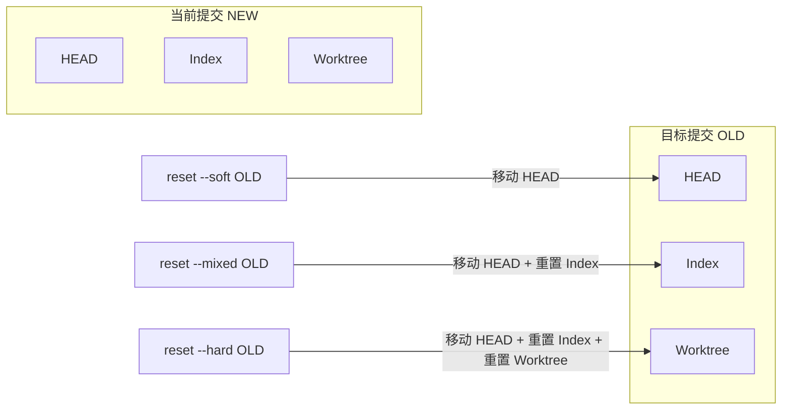
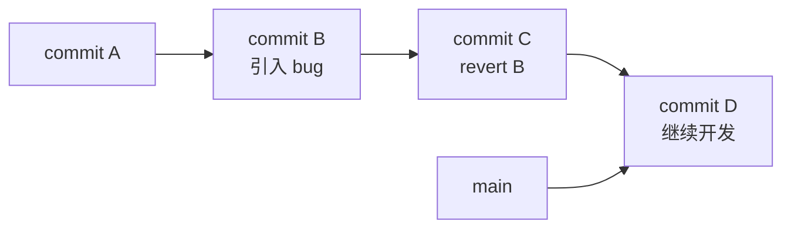

# Reflog 与撤销的艺术

> 所属计划: [[git-deep-dive|Git 进阶——从日常使用到底层原理]]
> 预计耗时: 60min
> 前置知识: [[05-rebase-core|Rebase 核心技能]]

---

## 1. 概念讲解

### 为什么需要这个？

进阶使用 Git 时，你迟早会碰到这些心跳骤停的瞬间：

- 手滑执行了 `git reset --hard HEAD~3`，刚写的代码"没了"；
- 交互式 `rebase -i` 整理历史时误删了一个提交；
- `commit --amend` 之后发现改错了，想回到 amend 之前；
- 删掉了一个本地分支，突然想起上面还有没合并的改动。

这些操作看起来都在"改写历史"，但真相是：**旧的提交对象并没有立刻消失**。Git 在后台默默维护着一份 `HEAD` 的操作日志——`reflog`。理解 `reflog` 和各种撤销命令的边界，是进阶用户的"安全网"。

### 核心思想：reflog 是 HEAD 的行车记录仪

`git reflog`（reference log）记录了**每一次 `HEAD` 的移动**：

- `commit`：HEAD 前进到新提交；
- `reset`：HEAD 跳到另一个提交；
- `checkout`/`switch`：HEAD 切换分支；
- `rebase`：HEAD 被重新接到新的基点上；
- `merge`：HEAD 移动到合并提交；
- `cherry-pick`：HEAD 复制提交后前进；
- `commit --amend`：HEAD 被替换到新的提交对象。

可以这样理解：DAG 是你车的导航路线，reflog 是行车记录仪——即使导航记录被重置，行车记录仪里还留着每一次转向。

> [!important]
> Reflog 是**本地独有**的，默认不会随 `push`/`clone` 传播。这是安全网的边界：本机可以救，换了机器就没有了。

#### Reflog 的保留策略

Git 默认会清理旧的 reflog 条目：

| 条目类型 | 默认保留期 | 说明 |
|----------|-----------|------|
| 可达（reachable） | 90 天 | 仍然能从当前引用到达的提交对应的 reflog 条目 |
| 不可达（unreachable） | 30 天 | 已经从分支、标签等引用上"断开"的条目 |

这些默认值由配置 `gc.reflogExpire` 和 `gc.reflogExpireUnreachable` 控制，通常不需要改动。

### 三种 `git reset` 模式

`git reset` 是把当前分支指针（以及可选的 `HEAD`、暂存区、工作区）移动到另一个提交。根据参数不同，它只影响不同的"层"：

| 模式 | HEAD/分支 | 暂存区（index） | 工作区（worktree） | 适用场景 |
|------|-----------|----------------|-------------------|----------|
| `--soft` | 移动 | 保留 | 保留 | 想重新组织最近一次或最近几次提交 |
| `--mixed`（默认） | 移动 | 重置为目标提交 | 保留 | 撤销 `git add`，或回退后保留改动重新提交 |
| `--hard` | 移动 | 重置为目标提交 | 重置为目标提交 | 彻底丢弃改动，回到某个干净状态 |

可以用"洋葱模型"理解：HEAD 是最外层，index 是中间层，worktree 是最内层。`--soft` 只剥最外层，`--mixed` 剥两层，`--hard` 剥三层。



> [!tip]
> 现代 Git（2.23+）推荐用 `git restore` 管理 index/worktree 的撤销，用 `git switch` 管理分支切换。`git reset` 仍是最直接的"移动分支指针"工具，但要清楚它改写了历史。

### `git revert`：用新提交抵消旧提交

`git revert <commit>` 会创建一个新的提交，其内容刚好是目标提交的**反向补丁**。它的最大优势是**不改写历史**，因此可以安全地用于已经 `push` 到公共分支的提交。



对比 `reset` 与 `revert`：

| 维度 | `git reset` | `git revert` |
|------|-------------|--------------|
| 历史是否改写 | 是，删除或移动已有提交 | 否，追加新的反向提交 |
| 是否安全用于已推送提交 | 否（会与别人冲突） | 是 |
| 是否丢失改动 | `--hard` 会，其他模式不一定 | 不会，原提交仍在 |
| 适用场景 | 本地历史整理 | 公共分支撤销某次改动 |

### 用 reflog 找回"丢失"的提交

假设你执行了 `git reset --hard HEAD~3`，看起来最近三个提交"没了"，但其实它们还在 `.git/objects` 里，reflog 也记着它们：

```bash
git reflog
```

输出类似：

```text
abc1234 HEAD@{0}: reset: moving to HEAD~3
def5678 HEAD@{1}: commit: 第三次提交
9a0bcde HEAD@{2}: commit: 第二次提交
1f2g3hi HEAD@{3}: commit: 第一次提交
```

找到重置之前的那个 hash（这里 `HEAD@{1}` 或 `def5678`），然后：

```bash
git reset --hard def5678
```

工作就回来了。

> [!warning]
> `--hard` 会覆盖工作区和暂存区。恢复前如果你已有新的未提交改动，先用 `git stash` 或另存文件，否则会被覆盖。

### 恢复单个文件到旧版本

如果只是想从旧提交里拿一个文件，不需要移动分支指针：

```bash
# 现代命令：从旧提交恢复文件到工作区
git restore --source=HEAD~2 -- app.py

# 只恢复到暂存区，不改动工作区
git restore --source=HEAD~2 --staged -- app.py

# 旧命令，效果等价
git checkout HEAD~2 -- app.py
```

这些命令**不修改历史**，只是从旧快照里把文件内容拿回来。

### 清理：reflog 过期与 `git gc`

Reflog 本身也需要清理，否则 `.git/logs/` 会无限增长：

```bash
# 手动让不可达条目立即过期（谨慎）
git reflog expire --expire-unreachable=now --all

# 触发垃圾回收，清理过期对象
git gc --prune=now
```

> [!important]
> 不要在想"可能还能救"的时候运行 `git gc --prune=now`。一旦 reflog 条目过期且对象不在任何分支/tag 上，Git 就会真正删除这些对象。

---

## 2. 代码示例

下面在 `git-playground` 仓库中演示：先制造一个"误操作"，再用 `reflog` 救回。

**运行环境要求**：Git 2.40+；Linux / macOS / Windows（PowerShell/Git Bash 均可）。

**运行方式：**

```bash
# 1. 创建练习仓库
mkdir git-playground && cd git-playground
git init

# 2. 连续做三次提交
echo "v1" > app.py
git add app.py
git commit -m "Add app.py v1"

echo "v2" >> app.py
git add app.py
git commit -m "Add app.py v2"

echo "v3" >> app.py
git add app.py
git commit -m "Add app.py v3"

# 3. 查看当前历史
git log --oneline --graph --all

# 4. 模拟误操作：reset --hard 回退两个提交
git reset --hard HEAD~2

# 5. 工作区和历史都回到了 v1，v2/v3 看似消失
git log --oneline --graph --all
cat app.py

# 6. 查看 reflog，找到 reset 之前的 hash
git reflog

# 7. 恢复：把分支指针移回 reset 之前的状态
# 注意：把下面的 <hash> 替换为 reflog 中 "Add app.py v3" 那一行的 hash
git reset --hard <hash>

# 8. 确认历史恢复
git log --oneline --graph --all
cat app.py
```

**预期输出（第 6 步 reflog 示例）：**

```text
abc1234 HEAD@{0}: reset: moving to HEAD~2
def5678 HEAD@{1}: commit: Add app.py v3
9a0bcde HEAD@{2}: commit: Add app.py v2
1f2g3hi HEAD@{3}: commit: Add app.py v1
04ijklm HEAD@{4}: commit (initial): Add app.py v1
```

> [!tip]
> `HEAD@{N}` 表示 reflog 中的第 N 条记录，`N` 越大代表越早。也可以用具体时间表达式，例如 `HEAD@{"1 hour ago"}`，但不如直接看 hash 可靠。

**演示三种 reset 模式的效果：**

```bash
# 从 v3 开始
git reset --hard HEAD   # 确保回到 v3

# --soft：只移动 HEAD，index 和 worktree 不变
git reset --soft HEAD~1
git status              # 显示 v3 的改动已暂存，等待重新提交
git reset --hard HEAD   # 回到干净状态

# --mixed（默认）：移动 HEAD + 清空 index，worktree 保留改动
git reset --mixed HEAD~1
git status              # 显示 v3 的改动未暂存
# 重新 add + commit 即可
git add app.py && git commit -m "Add app.py v3"

# --hard：全部重置，工作区也回到旧版本
git reset --hard HEAD~1
cat app.py              # 只看到 v2
```

---

## 3. 练习

所有练习都在 `git-playground` 仓库中完成。若尚未创建，请先按"代码示例"初始化。

### 练习 1: 用 reflog 从 `reset --hard` 中恢复

在 `git-playground` 中创建一个新文件 `feature.txt`，连续做 3 次提交（每次追加一行内容）。然后执行 `git reset --hard HEAD~2`。通过 `git reflog` 找到被丢弃的提交并恢复。请记录你使用的 hash 或 `HEAD@{N}` 表达式。

### 练习 2: 对比 `revert` 与 `reset` 撤销已推送提交

1. 在 `git-playground` 中再做一个提交并记下 hash；
2. 假设这个提交已经"被推送到公共分支"，用 `git revert <hash>` 撤销它，观察历史图；
3. 新建一个临时分支，在临时分支上用 `git reset --hard <hash>~1` 撤销同一个提交，观察历史图与原分支的区别；
4. 解释为什么 `revert` 适合公共分支而 `reset` 不适合。

### 练习 3: 用 `reset --soft` 重新组织提交（可选）

在 `git-playground` 中做 3 次小提交，每次只修改一行 `app.py`。然后执行 `git reset --soft HEAD~3`，把这 3 个小改动重新整理成 1 个提交（提交信息写 `"Consolidate app.py changes"`），或者整理成 2 个更有语义的提交。用 `git log --oneline` 验证最终结果。

---

## 3.5 参考答案

> [!tip]- 练习 1 参考答案
> 参考答案不是唯一解——如果你的实现通过/达到要求就是正确的。
>
> ```bash
> cd git-playground
>
> # 创建 feature.txt 并做 3 次提交
> echo "line 1" > feature.txt && git add feature.txt && git commit -m "feature: line 1"
> echo "line 2" >> feature.txt && git add feature.txt && git commit -m "feature: line 2"
> echo "line 3" >> feature.txt && git add feature.txt && git commit -m "feature: line 3"
>
> # 模拟误操作
> git reset --hard HEAD~2
>
> # 查看 reflog，找到 feature: line 3 的 hash
> git reflog
> ```
>
> 典型输出：
>
> ```text
> a1b2c3d HEAD@{0}: reset: moving to HEAD~2
> e4f5g6h HEAD@{1}: commit: feature: line 3
> i7j8k9l HEAD@{2}: commit: feature: line 2
> m0n1o2p HEAD@{3}: commit: feature: line 1
> ```
>
> 恢复：
>
> ```bash
> # 用具体 hash 或 HEAD@{1}
> git reset --hard HEAD@{1}
> cat feature.txt
> ```
>
> 你应该能看到 `line 1`、`line 2`、`line 3` 三行内容。

> [!tip]- 练习 2 参考答案
> 参考答案不是唯一解——如果你的实现通过/达到要求就是正确的。
>
> ```bash
> cd git-playground
>
> # 先确保有内容可撤销
> echo "buggy line" >> app.py
> git add app.py
> git commit -m "Introduce a bug"
> BUGGY=$(git rev-parse HEAD)
>
> # revert：创建反向提交，历史不改写
> git revert --no-edit "$BUGGY"
> git log --oneline --graph --all
> ```
>
> 典型历史：
>
> ```text
> * abc1234 Revert "Introduce a bug"
> * def5678 Introduce a bug
> * 9a0bcde Add app.py v3
> ```
>
> 在临时分支上用 reset：
>
> ```bash
> git branch temp-backup
> git switch temp-backup
> git reset --hard "$BUGGY"~
> git log --oneline --graph --all
> ```
>
> 你会看到 `temp-backup` 分支不再包含 `Introduce a bug` 这个提交，而 `main`（或当前分支）上仍然保留，只是后面多了一个 `Revert` 提交。
>
> **核心区别**：`revert` 追加新提交，不改动已有 hash，别人 `pull` 时不会冲突；`reset` 删除已有提交，hash 消失，如果别人已经基于这些提交工作，再 `push` 会产生"非快进"冲突并可能覆盖他人提交。

> [!tip]- 练习 3 参考答案（可选）
> 参考答案不是唯一解——如果你的实现通过/达到要求就是正确的。
>
> ```bash
> cd git-playground
>
> # 确保 app.py 干净，并做 3 次小提交
> git checkout -- app.py 2>/dev/null || true
> echo "part A" >> app.py && git add app.py && git commit -m "Add part A"
> echo "part B" >> app.py && git add app.py && git commit -m "Add part B"
> echo "part C" >> app.py && git add app.py && git commit -m "Add part C"
>
> # 软重置回 3 个提交之前
> git reset --soft HEAD~3
>
> # 此时所有改动都已暂存，但还没提交
> git status
>
> # 方案 A：合并成 1 个提交
> git commit -m "Consolidate app.py changes"
>
> # 方案 B：拆成 2 个提交（先取消暂存，再分两次 add/commit）
> # git reset HEAD app.py          # 先全部取消暂存
> # sed -n '1,2p' app.py > tmp     # 仅示例：按行拆分
> # git add app.py && git commit -m "Add parts A and B"
> # echo "part C" >> app.py        # 重新加回 part C
> # git add app.py && git commit -m "Add part C"
> ```
>
> 验证：
>
> ```bash
> git log --oneline --graph --all
> ```
>
> 如果你选择方案 A，应该只看到 1 个新提交替换了原来的 3 个小提交；原来的 3 个提交 hash 已经不可从当前分支到达，但仍然在 reflog 里。

> [!note] 答案使用方式
> 先独立完成练习，再展开查看参考答案。参考答案不是唯一解——如果你的实现通过了测试或达到了题目要求，就是正确的。

---

## 4. 扩展阅读

- [Git 官方文档：git-reflog](https://git-scm.com/docs/git-reflog)
- [Git 官方文档：git-reset](https://git-scm.com/docs/git-reset)
- [Git 官方文档：git-revert](https://git-scm.com/docs/git-revert)
- [Git 官方文档：git-restore](https://git-scm.com/docs/git-restore)
- [GitHub Blog: Recovering lost commits with reflog](https://github.blog/open-source/git/recovering-commits-and-files-with-git-reflog/)
- [Pro Git 中文版：Git 内部原理 - 维护与数据恢复](https://git-scm.com/book/zh/v2/Git-%E5%86%85%E9%83%A8%E5%8E%9F%E7%90%86-%E7%BB%B4%E6%8A%A4%E4%B8%8E%E6%95%B0%E6%8D%AE%E6%81%A2%E5%A4%8D)

---

## 常见陷阱

- **误以为 `reset --hard` 后数据真的没了**：只要没有运行 `git gc --prune=now` 或等待 reflog 过期，`git reflog` 通常能找回被丢弃的提交。这是 Git 的"后悔药"，但仅限于本机。
- **对公共分支用 `reset` 而不是 `revert`**：如果提交已经 `push` 到共享仓库，用 `reset` 会改写历史，导致队友 `pull` 时冲突甚至丢失他人提交。公共分支撤销请用 `git revert`。
- **reflog 不跨克隆传播**：`reflog` 数据保存在 `.git/logs/` 里，不会随 `git push`/`git clone` 复制。在本机 A 删除的分支可以通过 A 的 reflog 找回，但本机 B 上没有这个记录。
- **混淆 `--mixed` 与 `--soft`**：`--soft` 会保留暂存区状态，适合重新提交；`--mixed` 会把改动从暂存区清出但保留在工作区，适合重新挑选要提交的内容。不确定时用 `--mixed`，因为它不会丢失工作区改动。
- **清理前没有备份**：运行 `git reflog expire --expire-unreachable=now --all` 或 `git gc --prune=now` 之前，先用 `git branch backup` 或 `git tag backup` 做一个可达引用，避免真正丢失还想保留的历史。

> 本节内容与 [[05-rebase-core|Rebase 核心技能]] 紧密衔接：rebase 会生成新提交并让旧提交不可达，而 reflog 正是找回这些旧提交的手段。第 10 节 [[10-refs-dag-internals|引用与 DAG：分支的真相]] 会进一步讲解 `HEAD`、符号引用和 `.git/logs/` 的内部结构。
