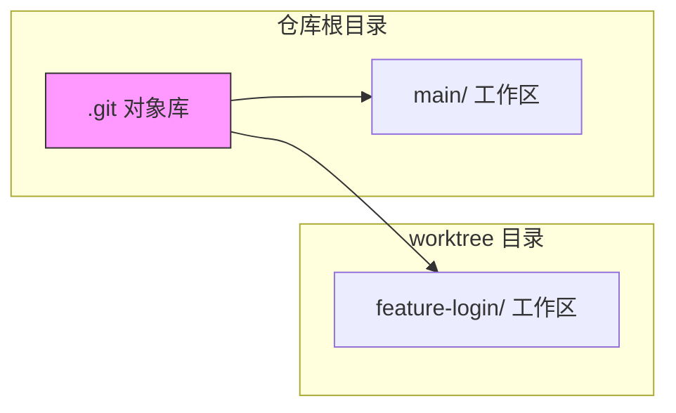

# stash 与 worktree

> 所属计划: [[git-deep-dive|Git 进阶——从日常使用到底层原理]]
> 预计耗时: 45min
> 前置知识: [[02-staging-area-mastery|暂存区精通]]、[[04-branch-merge-deep|分支与合并深入]]

---

## 1. 概念讲解

### 为什么需要这个？

你正在 `feature/login` 分支上写了一半的代码，突然线上报警，需要立刻切到 `main` 修一个 hotfix。问题是：

- 工作区还有未提交的改动，直接 `git switch main` 会报错或被带过去。
- 你又不想为了这“半成品”专门做一次提交（提交信息写什么？`WIP`？）。
- 同事还在等你，不能慢慢整理提交。

`git stash` 就是用来解决这种“半成品状态”的：它把当前工作区和暂存区的改动打包存起来，把工作区还原成干净状态，让你随时可以切换分支。

但 stash 只解决“同一份工作目录”的问题。如果你经常需要在两个分支上并行干活——比如一边修 bug、一边继续写新功能——反复 `stash`/`pop` 会很烦。这时 `git worktree` 登场：它让你**在同一个仓库里同时检出多个分支到不同目录**，互相独立，不用 `clone` 第二份代码。

### 核心思想

#### stash：临时的“草稿箱”

把 stash 想象成编辑器里的“临时保存”：

- `git stash push`：把当前改动（工作区 + 暂存区）塞进草稿箱，工作区变干净。
- `git stash pop`：取出最近一份草稿，恢复改动，并从草稿箱删除。
- `git stash apply`：取出草稿恢复，但**保留**草稿箱里的备份。
- `git stash list`：查看草稿箱里有多少份。
- `git stash drop`：删除某一份草稿。
- `git stash clear`：清空整个草稿箱。

> [!important]
> stash 是**本地临时工具**，不是长期存储。放进 stash 的改动默认不会随仓库推送，也容易被遗忘。

#### worktree：同一个仓库的多个“桌面”

Git 仓库的核心数据都在 `.git` 目录里。`git worktree` 允许你基于同一份 `.git` 对象库，在不同目录里检出不同的分支/提交。每个 worktree 有独立的工作区，但共享 object 数据库和 refs，因此：

- 不需要 `clone` 第二份，省磁盘（对大仓库尤其明显）。
- 不同 worktree 的分支互不干扰。
- 不能在同一份仓库的两个 worktree 里检出同一个分支（Git 会阻止）。



### stash vs commit vs worktree

| 场景 | 推荐做法 | 理由 |
| --- | --- | --- |
| 临时切换分支，改动很快继续 | `git stash` | 不用写提交信息，恢复快 |
| 改动有完整语义，需要保留历史 | `git commit` | 进入 DAG，可被追踪、回滚 |
| 长期并行在两个分支上开发 | `git worktree` | 不用反复 stash，目录独立 |
|  hotfix 需要立刻在干净分支上修 | `git worktree add ../hotfix main` | 不打扰当前工作区 |

---

## 2. 代码示例

**运行环境要求：**

- Git ≥ 2.40（建议 ≥ 2.40，Windows/macOS/Linux 均可）。
- 以下命令在 `bash`/`zsh`/`Git Bash` 中运行。
- 建议在独立的练习仓库 `git-playground` 中操作，不要碰真实项目。

### 2.1 准备一个练习仓库

```bash
# 创建一个临时练习目录
mkdir -p ~/git-playground && cd ~/git-playground

# 初始化仓库并做两次提交
git init -b main
git config user.name "Learner"
git config user.email "learner@example.com"

echo "main line 1" > app.txt
git add app.txt
git commit -m "Initial app"

echo "main line 2" >> app.txt
git add app.txt
git commit -m "Add line 2"

# 创建并切到 feature 分支
git switch -c feature/login

echo "unfinished login form" >> app.txt
echo "todo: validate input" >> app.txt
```

此时 `app.txt` 有两行未提交的改动，我们假设需要紧急切回 `main`。

### 2.2 stash 基本流程

```bash
# 查看当前状态：工作区有改动
git status

# 把改动打包进 stash，工作区变干净
git stash push -m "login form WIP"

# 确认工作区已干净
git status

# 查看 stash 列表
git stash list
# 输出类似：
# stash@{0}: On feature/login: login form WIP

# 切到 main 修 bug
git switch main

# ... 假装修完了 bug，现在切回 feature ...
git switch feature/login

# 恢复 stash，同时从列表中删除
git stash pop
```

**预期输出（节选）：**

```text
$ git stash push -m "login form WIP"
Saved working directory and index state On feature/login: login form WIP

$ git status
On branch feature/login
nothing to commit, working tree clean

$ git stash list
stash@{0}: On feature/login: login form WIP

$ git stash pop
On branch feature/login
Changes not staged for commit:
  (use "git add <file>" ...)
	modified:   app.txt

Dropped refs/stash@{0}
```

### 2.3 暂存区里的改动也会被 stash

```bash
# 修改文件并部分加入暂存区
echo "staged line" >> app.txt
git add app.txt

echo "unstaged line" >> app.txt

# stash 会同时保存 index 和 worktree 的改动
git stash push -m "mixed changes"

# 工作区和暂存区都变干净
git status

# 恢复时，原来在暂存区的改动会回到暂存区
git stash pop
```

> [!tip]
> 如果想只 stash 未暂存的改动而保留暂存区，可以用 `git stash push --keep-index`。

### 2.4 包含未跟踪文件与部分 stash

```bash
# 创建一个未跟踪文件
echo "secret config" > local.env

# 普通 stash 不会包含未跟踪文件
git stash push -m "without untracked"
git status   # local.env 仍然在外面

# 使用 -u/--include-untracked 把未跟踪文件也 stash
git stash push -u -m "with untracked"
git status   # 现在工作区干净了

# 恢复
git stash pop

# 部分 stash：只 stash 文件中某些改动块（hunk），类似 git add -p
git stash push -p -m "partial"
# Git 会逐个 hunk 询问是否 stash，选 y/n 即可
```

### 2.5 管理多个 stash

```bash
# 连续 push 多个 stash，最新的是 stash@{0}
git stash push -m "first"
git stash push -m "second"
git stash push -m "third"

git stash list
# stash@{0}: On feature/login: third
# stash@{1}: On feature/login: second
# stash@{2}: On feature/login: first

# 应用第 2 个 stash，但不删除它
git stash apply stash@{2}

# 删除第 1 个 stash
git stash drop stash@{1}

# 清空所有 stash（危险，确认不再需要）
git stash clear
```

> [!warning]
> `git stash drop` 和 `git stash clear` 删除的 stash 默认**不进入 reflog**。如果误删，恢复非常困难。所以 drop 前请三思。

### 2.6 当 stash pop 冲突时：用 `git stash branch`

有时候你 stash 了很久，pop 回来时发现当前分支已经演变，冲突了：

```bash
# 在 feature/login 上 stash
echo "old login code" >> app.txt
git stash push -m "old login"

# 在 feature/login 上继续前进，修改了同一行
echo "new login code" >> app.txt
git commit -am "Rework login"

# 现在 pop 会冲突
git stash pop
# Auto-merging app.txt
# CONFLICT (content): Merge conflict in app.txt
```

此时与其在冲突里硬解，不如从 stash 的基点新建一个分支：

```bash
# 放弃当前冲突状态（因为上面 pop 已经部分恢复，先 reset）
git merge --abort 2>/dev/null || true
git reset --hard HEAD

# 从 stash 创建新分支，在干净环境里处理
git stash branch resolve-login stash@{0}

# 现在你在 resolve-login 分支，stash 的内容已经恢复
git branch
```

`git stash branch <name>` 的原理是：找到 stash 创建时所在的分支/提交，从那里切出一个新分支，然后把 stash 应用上去。这样冲突只在单独分支里处理，不影响原分支。

### 2.7 git worktree：并行目录

```bash
# 回到仓库根目录
cd ~/git-playground

# 查看当前 worktree（默认只有一个）
git worktree list

# 在仓库同级的 hotfix 目录里检出 main 分支
git worktree add ../hotfix main

# 现在你在两个目录里各有一个工作区
git worktree list
# 输出类似：
# /home/user/git-playground    f3a1b2c [feature/login]
# /home/user/hotfix            f3a1b2c [main]
```

进入 `hotfix` 目录修 bug：

```bash
cd ../hotfix

# 你现在在 main 分支的干净工作区
git branch --show-current
# main

echo "bugfix line" >> app.txt
git add app.txt
git commit -m "Hotfix: critical bug"

# 切回 feature 目录继续写功能
cd ../git-playground
git branch --show-current
# feature/login
```

### 2.8 worktree 清理

```bash
# 用完 hotfix worktree 后，先切出该目录再删除
cd ~/git-playground

# 正确做法：用 remove 让 Git 清理记录
git worktree remove ../hotfix

# 查看列表确认已移除
git worktree list

# 如果某个 worktree 目录被手动 rm 了，Git 还留着记录，可用 prune
git worktree prune
```

> [!warning]
> 不要直接用 `rm -rf ../hotfix` 删除 worktree 目录。那样会留下“失踪的 worktree”记录，需要 `git worktree prune` 清理。始终优先使用 `git worktree remove`。

---

## 3. 练习

建议在 `git-playground` 仓库完成。

### 练习 1: stash→切分支→pop

在 `feature/login` 分支上有未提交的改动，模拟需要临时切到 `main` 查看代码的场景。使用 `git stash` 保存改动，切换到 `main`，再切回 `feature/login` 用 `git stash pop` 恢复。验证 `git stash list` 在 pop 后为空。

### 练习 2: 用 worktree 在新目录检出另一分支

基于同一个仓库，使用 `git worktree add` 在 `../review` 目录检出 `main` 分支。在 `review` 目录里做一次提交，然后回到原目录确认 `feature/login` 分支没有这次提交。最后用 `git worktree remove` 清理。

### 练习 3: stash branch 救援冲突的 stash（可选）

在 `feature/login` 上修改文件并 `git stash push`。然后继续在 `feature/login` 上提交一个会跟 stash 冲突的修改。尝试 `git stash pop`，观察冲突后，用 `git stash branch` 新建一个分支处理这次 stash，解决冲突后提交。

---

## 3.5 参考答案

> [!tip]- 练习 1 参考答案
> 参考答案不是唯一解——如果你的实现通过/达到要求就是正确的。
>
> ```bash
> # 在 feature/login 分支，假设已有未提交改动
> git status
> git stash push -m "WIP: login"
> git switch main
> # 查看 main 代码
> git switch feature/login
> git stash pop
> git stash list
> ```
>
> 验证点：`pop` 后工作区恢复到 stash 前状态，`git stash list` 不再显示该条目。

> [!tip]- 练习 2 参考答案
> 参考答案不是唯一解——如果你的实现通过/达到要求就是正确的。
>
> ```bash
> cd ~/git-playground
> git worktree add ../review main
> cd ../review
> git branch --show-current   # 应为 main
> echo "review fix" >> app.txt
> git add app.txt
> git commit -m "Review fix on main"
> cd ../git-playground
> git log --oneline feature/login   # 不应包含 "Review fix on main"
> git worktree remove ../review
> git worktree list
> ```
>
> 验证点：两个目录分支独立，`remove` 后列表中无 `../review`。

> [!tip]- 练习 3 参考答案（可选）
> 参考答案不是唯一解——如果你的实现通过/达到要求就是正确的。
>
> ```bash
> cd ~/git-playground
> git switch feature/login
> echo "old approach" >> app.txt
> git stash push -m "old approach"
> echo "new approach" >> app.txt
> git add app.txt
> git commit -m "Rework with new approach"
> git stash pop   # 这里会冲突
> # 如果已经进入冲突，先中止当前合并状态
> git merge --abort 2>/dev/null || true
> git reset --hard HEAD
> # 从 stash 创建分支处理
> git stash branch resolve-stash
> # 解决冲突、add、commit
> git add app.txt
> git commit -m "Resolve old approach with new approach"
> ```
>
> 验证点：冲突在 `resolve-stash` 分支内被解决，原 `feature/login` 分支历史保持干净。

> [!note] 答案使用方式
> 先独立完成练习，再展开查看参考答案。参考答案不是唯一解——如果你的实现通过了测试或达到了题目要求，就是正确的。

---

## 4. 扩展阅读

- [Git 官方文档 - git-stash](https://git-scm.com/docs/git-stash)
- [Git 官方文档 - git-worktree](https://git-scm.com/docs/git-worktree)
- [Atlassian: Git Stash](https://www.atlassian.com/git/tutorials/saving-changes/git-stash)
- [Git Worktrees: The Definitive Guide](https://morgan.cugerone.com/blog/how-to-use-git-worktree-and-why-you-should-try-this/)
- [[06-reflog-undo|Reflog 与撤销的艺术]] —— 误删 stash 前的最后防线

---

## 常见陷阱

- **把 stash 当永久存储**: stash 是临时草稿箱，长时间不 pop 会被遗忘。如果改动有价值，建议 `git commit`（哪怕是 WIP 提交），因为提交进入 DAG，可通过 `git reflog` 找回；而 `git stash drop`/`clear` 默认不进入 reflog。

- **混淆 `apply` 与 `pop`**: `git stash apply` 恢复改动但保留 stash 条目；`git stash pop` 恢复后删除条目。如果只想“试用”一下恢复效果，用 `apply`，确认没问题再用 `drop` 删除。

- **删除 worktree 目录不用 `git worktree remove`**: 直接 `rm -rf ../hotfix` 会让 Git 以为该 worktree 只是暂时不可用，`git worktree list` 仍显示它。应先用 `git worktree remove ../hotfix`，如果已经手动删了，再运行 `git worktree prune`。

- **尝试在两个 worktree 检出同一分支**: Git 会报错 `is already checked out`。每个分支只能在一个 worktree 中检出。需要并行开发同一分支时，应考虑新建分支或另想办法。

- **stash 了未跟踪文件但没用 `-u`**: 默认 `git stash push` 不保存未跟踪文件。如果新文件很重要，记得加 `--include-untracked` 或 `-u`。

- **pop 冲突时慌乱 `git reset --hard`**: `git stash pop` 冲突时，stash 条目不会被自动删除（因为 Git 无法确认你是否成功恢复）。此时用 `git stash branch` 新建分支处理，比在冲突里硬解更安全。
