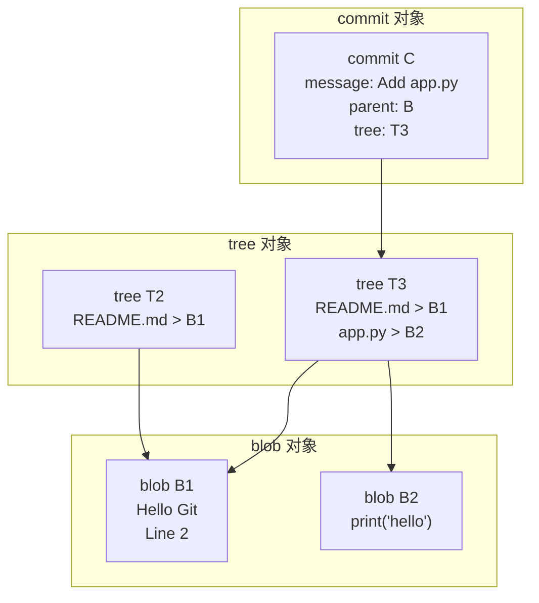

# Git 对象模型：blob、tree、commit

> 所属计划: [[git-deep-dive|Git 进阶——从日常使用到底层原理]]
> 预计耗时: 60min
> 前置知识: [[01-git-mental-model|Git 心智模型：快照而非差异]]

---

## 1. 概念讲解

### 为什么需要这个？

前一节建立了"快照而非差异"的心智模型，但 Git 到底把快照存在哪里？为什么 `git log` 能看到历史？为什么 `git diff` 能算出差异？为什么仓库不会因为每次提交都存完整快照而爆炸？

要回答这些问题，必须打开 `.git` 目录，看看 Git 的**对象模型（Object Model）**。理解对象模型后，你会明白：

- 为什么 `commit` 的 hash 一旦生成就不会改变；
- 为什么 "改提交信息" 其实是创建了新提交；
- 为什么 `git gc` 能大幅压缩仓库体积；
- 为什么 reflog 能找回 "丢失" 的提交。

### 核心思想：Git 是一个内容寻址文件系统

Git 的本质可以被概括为一句话：**一个内容寻址（content-addressable）的键值存储，上面叠加了一个版本控制用户界面**。

你可以把它想象成一个图书馆：

- **书名 = 对象 hash**：每本书（对象）的名字不是作者起的，而是根据书的内容算出来的唯一编号。
- **同内容只存一本**：两本内容完全相同的书，hash 相同，在图书馆里只占用一个位置。
- **目录卡片 = tree/commit**：tree 对象记录"这个书架上有哪些书"，commit 对象记录"谁在什么时候拍了这张照片，以及上一张照片是哪张"。

这个设计让 Git 的所有核心操作都变得简单：比较两个对象就是比较它们的 hash；去重就是维护一个 hash 集合；回滚就是把指针指回旧的 hash。

### 四种对象类型

Git 仓库里只存在四种对象类型。所有历史、分支、标签最终都归结为这四种对象的引用网络：

| 对象类型 | 存储内容 | 比喻 | 常见查看方式 |
|----------|----------|------|--------------|
| `blob` | 文件内容（仅内容，无文件名/权限） | 一本书的正文 | `git cat-file -p <blob-hash>` |
| `tree` | 目录结构：文件名、模式、子 tree/blob hash | 图书目录/书架清单 | `git cat-file -p <tree-hash>` |
| `commit` | 作者、提交者、时间、提交信息、父提交、根 tree | 一张带说明的目录快照照片 | `git cat-file -p <commit-hash>` |
| `tag` | annotated tag 的元数据（标签名、指向对象、签名等） | 照片上的标签贴纸 | `git cat-file -p <tag-hash>` |

> [!note]
> `tag` 对象只出现在 **annotated tag**（`git tag -a`）中。lightweight tag 只是一个 refs 文件，不创建对象。详见 [[12-tags-submodules-sparse|Tags、子模块与稀疏检出]]。

### Plumbing vs Porcelain：水管工命令与瓷器命令

Git 命令分为两层：

- **Porcelain（瓷器）**：日常使用的友好命令，如 `git add`、`git commit`、`git status`、`git log`、`git switch`。它们把多个底层步骤包装成一步。
- **Plumbing（水管工）**：直接操作对象的底层命令，如 `git hash-object`、`git update-index`、`git write-tree`、`git commit-tree`、`git cat-file`。这些命令更接近 Git 的真实工作原理。

> [!tip]
> 本节会大量使用 Plumbing 命令。你不需要日常记住它们，但看一遍能帮你建立"提交到底是怎么生成的"直觉。

### 对象存储：`.git/objects/`

每次运行 `git add` 或 `git commit`，Git 都会把对象写入 `.git/objects/`：

- 路径格式：`.git/objects/XX/YYYY...`，其中 `XX` 是 hash 的前两位，剩余 `YYYY...` 是文件名。
- 文件内容：对象头（`类型 大小\0`）+ 原始数据，整体经过 **zlib 压缩**。

因此，直接用 `cat` 或文本编辑器打开 `.git/objects/` 里的文件会看到乱码——必须先解压再解析。

### SHA-1 与 SHA-256：对象的身份证号

Git 用加密哈希给对象命名：

- **SHA-1**（默认）：40 位十六进制，如 `e69de29bb2d1d6434b8b29ae775ad8c2e48c5391`。
- **SHA-256**（可选）：64 位十六进制，新建仓库可用 `git init --object-format=sha256` 启用，自 Git 2.42 起已非实验性质。

hash 由对象**完整内容**决定，因此：

- 改动一个字节，hash 完全不同；
- 内容完全相同，hash 完全相同，仓库里只存一份；
- 几乎不可能发生碰撞（SHA-1 对故意攻击已有理论风险，但对随机内容仍足够安全；高安全场景可选 SHA-256）。

### Packfile：快照为何不爆磁盘

如果只存松散对象（loose objects），时间一久 `.git/objects/` 会有大量小文件。Git 通过 **packfile** 解决体积问题：

- `git gc`（Garbage Collection）会把松散对象打包进 `.git/objects/pack/`；
- packfile 对相似内容做 **delta 压缩**（增量压缩），只保留差异；
- 对象仍然可以通过 hash 访问，只是读取时 Git 会自动从 packfile 解压；
- Git 会在后台自动运行 `gc`，也可以手动调用。

packfile 让 Git 在保留"快照语义"的同时，获得接近差异模型的存储效率。

### 对象关系图

下面是一个简单仓库的对象网络：



> [!note]
> 上图只画了 commit C 引用的 tree T3。它之前的提交 B 会引用 tree T2。因为 `README.md` 内容没变，B1 被 T2 和 T3 同时引用——这就是对象级别的去重。

---

## 2. 代码示例

下面我们在 `git-playground` 仓库中，用 Plumbing 命令手动探索对象模型。所有命令都可在 Linux / macOS / Windows（Git Bash / PowerShell）运行。

**运行环境要求**：Git 2.40+；建议使用独立练习仓库 `git-playground`。

**运行方式：**

```bash
# 1. 创建练习仓库
mkdir git-playground && cd git-playground
git init

# 2. 用 Porcelain 做两次提交（模拟日常开发）
echo "Hello Git" > README.md
git add README.md
git commit -m "Initial commit"

echo "Line 2" >> README.md
git add README.md
git commit -m "Add line 2"

# 3. 查看 HEAD 提交对象的内容
git cat-file -p HEAD
```

**预期输出：**

```text
tree 4a20283f4d8d3f...d73c85c4e35
parent a1b2c3d4...           # 你的第一次提交 hash
author Your Name <you@example.com> 1719000000 +0800
committer Your Name <you@example.com> 1719000000 +0800

Add line 2
```

> [!note]
> 你看到的 hash 和时间戳与上面不同，这完全正常。关键是看清 commit 对象的结构：一个 tree、一个 parent、作者/提交者信息、提交信息。

### 从 commit 逐层展开到 blob

```bash
# 1. 取出 HEAD 指向的 tree hash
TREE_HASH=$(git rev-parse HEAD^{tree})

# 2. 查看 tree 对象：它列出目录下每个文件/子目录
#    格式：模式 类型 hash\t文件名
git cat-file -p "$TREE_HASH"
```

**预期输出：**

```text
100644 blob 8ab686eafeb1f44702738c8b0f24f2567c36da6d	README.md
```

```bash
# 3. 继续查看 blob 对象的内容（用上面输出的 hash）
#    示例 hash 仅为演示，请替换成你实际得到的 hash
git cat-file -p 8ab686eafeb1f44702738c8b0f24f2567c36da6d
```

**预期输出：**

```text
Hello Git
Line 2
```

```bash
# 4. 查看对象类型与大小
#    -t 显示类型（blob/tree/commit/tag）
#    -s 显示大小（字节）
git cat-file -t HEAD
git cat-file -s HEAD
git cat-file -t HEAD^{tree}
```

**预期输出：**

```text
commit
237
tree
```

###  Plumbing 手动创建提交

下面完全绕过 `git add` 和 `git commit`，用 Plumbing 命令手动构造一个提交。这个流程能让你看到 Porcelain 在背后做了什么。

```bash
# 0. 确保在 git-playground 中，且工作区干净
cd git-playground

# 1. 手动把一个文件内容写入对象数据库，生成 blob
echo "Hello from plumbing" | git hash-object -w --stdin
# 输出类似：a0b1c2d3...   这是新 blob 的 hash

# 2. 把 blob 加入暂存区（index），命名为 plumbing.txt
#    假设上一步输出的 hash 是 HASH，用你实际的 hash替换
HASH=$(echo "Hello from plumbing" | git hash-object -w --stdin)
git update-index --add --cacheinfo 100644 "$HASH" plumbing.txt

# 3. 把当前 index 写成 tree 对象
git write-tree
# 输出新的 tree hash

# 4. 用 tree 创建 commit 对象
#    -p 指定父提交；第一次没有父提交则省略 -p
TREE=$(git write-tree)
git commit-tree "$TREE" -p HEAD -m "Add plumbing.txt manually"
# 输出新的 commit hash
```

**预期输出（最后一步）：**

```text
7e8f9a0b...
```

```bash
# 5. 把当前分支指向这个新提交（危险操作，仅在练习仓库做）
#    $(git branch --show-current) 会自动拿到当前分支名（main 或 master）
NEW_COMMIT=$(git commit-tree "$TREE" -p HEAD -m "Add plumbing.txt manually")
git update-ref refs/heads/$(git branch --show-current) "$NEW_COMMIT"

# 6. 验证历史
git log --oneline --graph --all
```

**预期输出：**

```text
* 7e8f9a0b Add plumbing.txt manually
* ...      Add line 2
* ...      Initial commit
```

> [!warning]
> `git update-ref` 直接改写分支指针。在真实仓库中操作前，务必用 `git branch backup` 创建备份分支。误操作后可用 `reflog` 恢复，详见 [[06-reflog-undo|Reflog 与撤销的艺术]]。

### 观察 packfile

```bash
# 1. 先查看当前松散对象数量
git count-objects -vH
```

**预期输出：**

```text
count: 6
size: 24.00 KiB
in-pack: 0
packs: 0
size-pack: 0 bytes
prune-packable: 0
garbage: 0
size-garbage: 0 bytes
```

```bash
# 2. 手动触发垃圾回收，把松散对象打包
git gc

# 3. 再次查看
git count-objects -vH
```

**预期输出：**

```text
count: 0
size: 0 bytes
in-pack: 9
packs: 1
size-pack: 2.50 KiB
prune-packable: 0
garbage: 0
size-garbage: 0 bytes
```

```bash
# 4. 查看 packfile 里有哪些对象
#    先找到 pack 文件名
ls .git/objects/pack/

# 5. 用 verify-pack 查看对象列表与压缩信息
#    把 <pack-file> 替换成实际文件名，如 pack-xxx.idx
git verify-pack -v .git/objects/pack/pack-xxx.idx | head -n 20
```

**预期输出（片段）：**

```text
8ab686eafeb1f44702738c8b0f24f2567c36da6d blob   20 30 12
7e8f9a0b... commit 237 158 42
e69de29bb2d1d6434b8b29ae775ad8c2e48c5391 tree   36 46 200
non delta: 9 objects
chain length = 1: 1 object
```

> [!note]
> `git verify-pack -v` 输出各列含义：`hash` `类型` `原始大小` `pack 中大小` `偏移量`。可以看到某些对象在 pack 里比原始尺寸还小，这就是 delta 压缩的效果。对于极小的练习仓库，packfile 的索引开销可能让 `size-pack` 暂时大于松散对象总和；但在真实项目（对象数量成千上万且内容相似度高）中，packfile 会显著节省磁盘空间。

---

## 3. 练习

所有练习都在 `git-playground` 仓库中完成。若尚未创建，请先按"代码示例"初始化。

### 练习 1: 从 `HEAD` 一路展开到 blob

使用 `git cat-file -p HEAD` 找到 `tree` 的 hash，再查看该 tree 找到某个文件的 blob hash，最后用 `git cat-file -p` 打印文件内容。请把每一步的 hash 和对象类型记录下来，并用一段话说明 commit → tree → blob 的引用关系。

### 练习 2: 用 Plumbing 手动存一个 blob

不通过 `git add`，而是使用 `git hash-object -w --stdin` 把一个字符串写入对象数据库。然后用 `git cat-file -t` 和 `git cat-file -s` 确认它是一个 blob，并解释为什么它的 hash 完全由内容决定。

### 练习 3: `git gc` 前后体积对比（可选）

在练习仓库中创建多个文件并提交（建议至少 5 次），每次尽量让文件内容有重复部分。先运行 `git count-objects -vH` 记录松散对象数量与体积，再运行 `git gc`，再次记录。请解释为什么 `size-pack` 通常比松散对象总和小得多。

---

## 3.5 参考答案

> [!tip]- 练习 1 参考答案
> 参考答案不是唯一解——如果你的实现通过/达到要求就是正确的。
>
> ```bash
> cd git-playground
> # 1. 查看 HEAD commit 对象
> git cat-file -p HEAD
> ```
>
> 复制输出中 `tree` 后面的 hash，例如 `4a20283f...`。
>
> ```bash
> # 2. 查看 tree 对象
> git cat-file -p 4a20283f...
> ```
>
> 典型输出：
>
> ```text
> 100644 blob 8ab686eafeb1f44702738c8b0f24f2567c36da6d	README.md
> ```
>
> 复制 blob hash，例如 `8ab686ea...`。
>
> ```bash
> # 3. 查看 blob 内容
> git cat-file -p 8ab686ea...
> ```
>
> **关系说明**：commit 对象本身不存文件内容，只存一个指向根 tree 的引用；tree 对象存目录结构，每个条目再指向一个 blob 或子 tree；blob 才是真正文件内容。这种分层让未改动的文件可以被多个 tree 共享，实现去重。
>
> ```bash
> # 4. 用 -t 验证类型
> git cat-file -t HEAD
> git cat-file -t HEAD^{tree}
> git cat-file -t 8ab686ea...
> ```

> [!tip]- 练习 2 参考答案
> 参考答案不是唯一解——如果你的实现通过/达到要求就是正确的。
>
> ```bash
> cd git-playground
> # 把字符串直接写入对象数据库，-w 表示写入，--stdin 表示从标准输入读取
> echo "hello object model" | git hash-object -w --stdin
> ```
>
> 输出类似：
>
> ```text
> 3b18e512dba79e4c8300dd08aeb37f8e728b8dad
> ```
>
> ```bash
> # 验证类型与大小
> git cat-file -t 3b18e512dba79e4c8300dd08aeb37f8e728b8dad
> git cat-file -s 3b18e512dba79e4c8300dd08aeb37f8e728b8dad
> ```
>
> 预期输出：
>
> ```text
> blob
> 19
> ```
>
> **为什么 hash 完全由内容决定**：Git 计算 hash 时会把对象头 `"blob 19\0"` 和原始内容 `"hello object model\n"` 拼接起来再做 SHA-1。只要内容、类型、大小任意改变，hash 就会完全不同；内容不变，hash 不变。这也是 Git 能天然去重的原因。

> [!tip]- 练习 3 参考答案（可选）
> 参考答案不是唯一解——如果你的实现通过/达到要求就是正确的。
>
> ```bash
> cd git-playground
> # gc 前
> git count-objects -vH
> ```
>
> 记录 `count` 和 `size`。
>
> ```bash
> # 触发打包
> git gc
>
> # gc 后
> git count-objects -vH
> ```
>
> 典型变化：
>
> | 指标 | gc 前 | gc 后 |
> |------|-------|-------|
> | `count` | 20+ | 0 |
> | `size` | 若干 KiB | 0 bytes |
> | `in-pack` | 0 | 20+ |
> | `size-pack` | 0 bytes | 明显更小 |
>
> **为什么 pack 更小**：packfile 会对相似对象做 delta 压缩。例如，如果一个文件在多个提交里只改了一行，packfile 会只存一份完整内容和若干差异，而不是每次提交的完整副本。因此在真实项目（对象成千上万且相似度高）中，`size-pack` 通常远小于松散对象总和。极小的练习仓库可能因 pack 索引开销而暂时看不出"更小"，但 `in-pack` 计数上升、对象从 `.git/objects/` 根目录消失这两个现象仍然能证明打包已经发生。
>
> ```bash
> # 查看 pack 中的对象明细
> git verify-pack -v .git/objects/pack/pack-*.idx
> ```

> [!note] 答案使用方式
> 先独立完成练习，再展开查看参考答案。参考答案不是唯一解——如果你的实现通过了测试或达到了题目要求，就是正确的。

---

## 4. 扩展阅读

- [Git 官方文档：Git 对象](https://git-scm.com/book/en/v2/Git-Internals-Git-Objects)
- [Git 官方文档：Git 引用](https://git-scm.com/book/en/v2/Git-Internals-Git-References)
- [GitHub Blog: Commits are snapshots, not diffs](https://github.blog/2020-12-17-commits-are-snapshots-not-diffs/)
- [Git 官方文档：Packfile 格式](https://git-scm.com/docs/pack-format)
- [Git 哈希函数过渡文档（SHA-256）](https://www.kernel.org/pub/software/scm/git/docs/technical/hash-function-transition.html)
- [Pro Git 中文版：Git 内部原理](https://git-scm.com/book/zh/v2/Git-%E5%86%85%E9%83%A8%E5%8E%9F%E7%90%86-%E6%90%AC%E8%BF%90-Git-%E5%AF%B9%E8%B1%A1)

---

## 常见陷阱

- **直接 `cat` 压缩对象看到乱码**：`.git/objects/` 里的文件经过 zlib 压缩，且包含对象头，不能直接用文本工具阅读。请始终使用 `git cat-file -p <hash>` 查看内容，使用 `git cat-file -t/-s` 查看类型和大小。
- **不理解 commit hash 碰撞为何几乎不可能**：SHA-1 对随机输入仍有约 $2^{80}$ 量级的暴力破解难度。日常仓库中，两个人独立生成相同 hash 的概率比连续中十次彩票还低。如果确实担心，可使用 `git init --object-format=sha256` 创建 SHA-256 仓库。
- **以为 tag 就是分支**：annotated tag 会创建一个 `tag` 对象，而 lightweight tag 只是一个 refs 文件；分支则是 `refs/heads/` 下的可移动指针。三者语义不同，不要混用。详情见 [[12-tags-submodules-sparse|Tags、子模块与稀疏检出]]。
- **误在真实仓库中直接操作 `.git/objects` 或 `update-ref`**：Plumbing 命令威力强大但缺少保护。练习时请在独立仓库操作，并先用 `git branch backup` 打好备份。误改后用 `reflog` 恢复的方法见 [[06-reflog-undo|Reflog 与撤销的艺术]]。
- **以为 `git gc` 会删除历史**：`git gc` 只删除**不可达**对象。只要对象仍被分支、tag 或 reflog 引用，就不会被清理。它也不会改变任何 commit 的 hash，只是换了一种存储格式。

---

> 本节内容与 [[01-git-mental-model|Git 心智模型]] 前后呼应：第 1 节建立了"快照"直觉，本节展示了快照在磁盘上的真实形态。下一节 [[10-refs-dag-internals|引用与 DAG：分支的真相]] 将进一步拆解 `HEAD`、分支、`refs/` 和 `reflog` 的实现。
