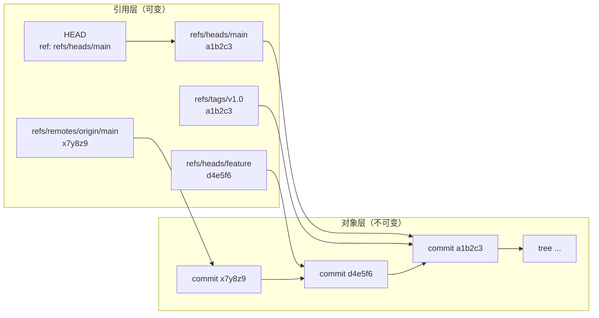
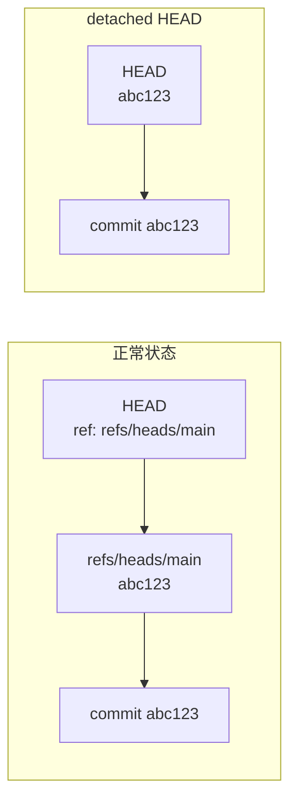

# 引用与 DAG：分支的真相

> 所属计划: [[git-deep-dive|Git 进阶——从日常使用到底层原理]]
> 预计耗时: 45min
> 前置知识: [[09-git-object-model]]

---

## 1. 概念讲解

### 为什么需要这个？

日常我们常说"切换到 `feature` 分支"、"删除 `main` 分支"、"`HEAD` 指向这里"，听起来分支是一个很重的结构。实际上，Git 的分支、标签、`HEAD`、远程跟踪分支，本质上都是**引用（ref）**——`.git` 目录里的小文件或文件条目，里面只存一个 40 位的 commit hash。理解这一点后，很多 Git 行为都会变得显然：为什么创建分支几乎不花时间、为什么 `git branch` 只是改个指针、为什么 detached HEAD 危险、为什么删除远程分支的语法那么奇怪。

本节在 [[09-git-object-model]] 的 blob/tree/commit 对象模型之上，补全"引用层"的真相，让你从"会操作分支"进化到"理解分支"。

### 核心思想

Git 的历史是一个**有向无环图（DAG, Directed Acyclic Graph）**。commit 对象通过 `parent` 字段指向父提交，形成图的边；而**引用（refs）**就是指向这些 commit 节点的"便利贴"。分支、标签、`HEAD` 都是便利贴，只是位置和语义不同：

- **分支** = `refs/heads/<name>` 里的一个文件，内容是某次 commit 的 hash。
- **`HEAD`** = `.git/HEAD` 文件，通常保存当前分支的名字（`ref: refs/heads/main`），叫做**符号引用（symbolic-ref）**。
- **标签** = `refs/tags/<name>`，轻量标签只存 hash；annotated tag 会多一个 tag 对象（见 [[12-tags-submodules-sparse]]）。
- **远程跟踪分支** = `refs/remotes/<remote>/<branch>`，`git fetch` 按 refspec 更新它们，而不是直接动你的本地分支。



### 分支只是一个文件

在 Git 仓库里执行：

```bash
cat .git/refs/heads/main
```

你看到的通常就是一行，比如 `a1b2c3d4...`。这就是分支的全部内容。`git branch feature` 做的事情等价于：

```bash
printf '%s\n' "$(git rev-parse HEAD)" > .git/refs/heads/feature
```

> [!note]
> 创建分支不复制任何文件、不复制任何提交对象，只是多了一个 41 字节（hash + 换行）的文件。所以分支几乎零成本。

### `HEAD` 与符号引用

`.git/HEAD` 通常不是直接存 hash，而是像这样：

```text
ref: refs/heads/main
```

这种"指向另一个引用"的引用叫做 **symbolic ref**。可以用 plumbing 命令查看和修改：

```bash
git symbolic-ref HEAD              # 输出 refs/heads/main
git symbolic-ref HEAD refs/heads/feature   # 把 HEAD 指向 feature，不切换工作区
```

> [!warning]
> `git symbolic-ref HEAD refs/heads/feature` 只改 `.git/HEAD` 的指向，**不会**像 `git switch` 那样更新工作区与 index。在真实操作中请用 `git switch`。

### detached HEAD：HEAD 直接指向 commit

当你 `git switch <commit-hash>` 或 `git switch --detach <branch>` 时，`.git/HEAD` 不再指向分支，而是直接写一个 commit hash。此时你处于 **detached HEAD** 状态：



在 detached HEAD 上做的新提交会被对象模型正常保存，但**没有任何分支引用指向它**。如果你切回别的分支而没有先给这个新提交创建一个分支名，它就会变得"不可达"，最终可能被 `git gc` 清理掉（虽然短期内 reflog 还能救，见 [[06-reflog-undo]]）。

### `refs/tags` 与 `refs/remotes`

- `refs/tags/v1.0`：轻量标签直接存 commit hash。annotated tag 会存一个 tag 对象的 hash，tag 对象再指向 commit。
- `refs/remotes/origin/main`：远程跟踪分支。`git fetch` 按 refspec 更新这些引用；它们是你对远程仓库状态的一个本地缓存，**不能直接 checkout 上去工作**（要用 `git switch main` 检出本地分支）。

### `packed-refs`

当仓库里标签、远程分支很多时，Git 会把大量 refs 压缩到单个文件 `.git/packed-refs` 中，不再每个 ref 一个文件。这是性能优化，不影响语义。`git for-each-ref` 会自动处理 loose refs 和 packed refs 的合并视图。

### refspec：远程抓取的映射规则

`git fetch origin` 时，Git 使用 refspec 决定把远程的哪些引用映射到本地的哪些引用。默认配置通常是：

```text
+refs/heads/*:refs/remotes/origin/*
```

含义：把远程所有 `refs/heads/` 下的分支，映射到本地的 `refs/remotes/origin/` 下。`+` 前缀表示**强制更新**，允许非快进（non-fast-forward）更新远程跟踪分支——这很安全，因为它只动本地缓存，不动你的本地分支。

删除远程分支的特殊语法也来自 refspec：

```bash
git push origin :refs/heads/old-feature
# 等价于
 git push origin --delete old-feature
```

意思是"把空引用推送到远程的 `refs/heads/old-feature`"，从而删除它。

### 为什么创建分支/标签几乎零成本

因为：

1. commit 对象已经存在，创建分支只是写一个新文件指向已有 commit。
2. 标签如果只是轻量标签，同样只写一个文件。
3. Git 的对象是内容寻址、不可变的，引用层只是"指针"，复制指针不复制对象。

这也是 Git 鼓励"频繁建分支"的底气所在。

### reflog 也藏在 `.git/logs/`

每次 `HEAD` 或引用移动，Git 都会在 `.git/logs/HEAD` 和 `.git/logs/refs/heads/<branch>` 里追加一条记录。这就是 [[06-reflog-undo]] 里救命的 reflog 的物理位置。reflog 是本地的，不会随 push/pull 传播。

---

## 2. 代码示例

以下示例在 Linux/macOS/Git Bash 下测试通过，Git 版本建议 `>= 2.40`。Windows PowerShell/CMD 中 `printf`、here-document 等语法可能需要调整，建议用 Git Bash。

**运行方式:**

```bash
# 1. 创建练习仓库
cd /tmp && rm -rf git-playground-refs
mkdir git-playground-refs && cd git-playground-refs
git init --initial-branch=main

# 2. 做两次提交，观察引用变化
echo "a" > file.txt
git add file.txt
git commit -m "first"

echo "b" >> file.txt
git add file.txt
git commit -m "second"

# 3. 查看 .git/HEAD 和分支文件
cat .git/HEAD
cat .git/refs/heads/main

# 4. 用 plumbing 命令查看 HEAD 解析结果
git rev-parse HEAD
git rev-parse --symbolic-full-name HEAD
git symbolic-ref HEAD

# 5. 列出所有引用
git for-each-ref

# 6. 用 update-ref 创建一个分支（效果同 git branch）
git update-ref refs/heads/feature $(git rev-parse HEAD)
git log --oneline --decorate --all --graph

# 7. 进入 detached HEAD，做一个提交
git switch --detach HEAD~1
echo "c" >> file.txt
git add file.txt
git commit -m "detached commit"

# 8. 观察此时 .git/HEAD 直接是 hash
cat .git/HEAD

# 9. 切回 main 前忘记建分支——新提交暂时没有名字
git switch main
# 此时 detached 提交在对象库里，但无分支指向它

# 10. 用 reflog 找回 detached 提交（演示，实际应先用 branch 救援）
git reflog
```

**预期输出:**

```text
# cat .git/HEAD
ref: refs/heads/main

# cat .git/refs/heads/main
a1b2c3d4e5f6789012345...

# git rev-parse HEAD
a1b2c3d4e5f6789012345...

# git rev-parse --symbolic-full-name HEAD
refs/heads/main

# git symbolic-ref HEAD
refs/heads/main

# git for-each-ref（节选）
a1b2c3d4e5f6789012345... commit       refs/heads/main
d4e5f6...                commit       refs/heads/feature

# 进入 detached HEAD 后 cat .git/HEAD
d4e5f6...
```

> [!important]
> 第 9 步切走之后，detached HEAD 上的新提交没有被任何分支引用。如果这是真实工作，你应该在切换前执行 `git branch rescue-name` 把它保存下来。

---

## 3. 练习

### 练习 1: 手动用 shell 创建一个分支

不执行 `git branch`，只使用 shell 命令（`printf`、`cat` 等）和 `git rev-parse`，在 `.git/refs/heads/` 下创建一个名为 `handmade` 的分支，让它指向当前 `HEAD`。然后用 `git log --oneline --decorate` 验证它真的出现了。

### 练习 2: detached HEAD 救援

1. 进入 detached HEAD 状态（`git switch --detach HEAD~1`）。
2. 修改文件并做一次新提交。
3. 先**不要**创建分支，直接 `git switch main`。
4. 使用 `git reflog` 找到刚才那个 detached 提交的 hash。
5. 用 `git branch rescued <hash>` 把它救回为一个正常分支。
6. 用 `git log --oneline --all --graph` 验证 rescued 分支存在。

### 练习 3: 解释 refspec 的 `+` 前缀（可选）

默认 refspec `+refs/heads/*:refs/remotes/origin/*` 里，`+` 前缀表示"强制更新"。请解释：

1. 如果没有 `+`，`git fetch` 在什么情况下会拒绝更新 `refs/remotes/origin/main`？
2. 为什么给远程跟踪分支加 `+` 是安全的，而给 push 的 refspec 加 `+` 就可能很危险？
3. `git push origin +main` 与 `git push origin main --force-with-lease` 在保护机制上有什么区别？（参考 [[13-remote-collaboration]]）

---

## 3.5 参考答案

> [!tip]- 练习 1 参考答案
> 参考答案不是唯一解——如果你的实现通过/达到要求就是正确的。
> 核心思路是：先用 `git rev-parse HEAD` 拿到当前 commit hash，再把它写进 `.git/refs/heads/handmade`。注意要在仓库根目录执行，并确保文件以换行结尾。
> ```bash
> # 在仓库根目录
> HASH=$(git rev-parse HEAD)
> printf '%s\n' "$HASH" > .git/refs/heads/handmade
> # 验证
> cat .git/refs/heads/handmade
> git log --oneline --decorate --all --graph
> ```
> 也可以直接用 plumbing 命令 `git update-ref refs/heads/handmade HEAD`，效果相同。

> [!tip]- 练习 2 参考答案
> 参考答案不是唯一解——如果你的实现通过/达到要求就是正确的。
> ```bash
> # 进入 detached HEAD
> git switch --detach HEAD~1
> # 做一点改动并提交
> echo "detached work" >> file.txt
> git add file.txt
> git commit -m "work in detached HEAD"
> # 记住当前 hash（可选）
> git rev-parse HEAD
> # 切回 main（此时 detached 提交暂时无引用）
> git switch main
> # 用 reflog 找回
> git reflog
> # 假设 reflog 显示 abc1234 HEAD@{1}: commit: work in detached HEAD
> git branch rescued abc1234
> # 验证
> git log --oneline --all --graph
> ```
> 更安全的做法是在切走之前先执行 `git branch rescued`，而不是先切走再靠 reflog 救。

> [!tip]- 练习 3 参考答案（可选）
> 参考答案不是唯一解——如果你的理解能够回答以下三点就是正确的。
> 1. 没有 `+` 时，fetch 只接受 fast-forward 更新。如果远程分支被 reset/rewound，导致远程跟踪分支需要"后退"，不带 `+` 的 refspec 会拒绝更新。
> 2. `refs/remotes/origin/*` 只是本地缓存的远程状态，不是你正在工作的分支，强制更新它不会丢失你的本地改动。而 push 的 `+` 会强制覆盖远程的公共分支，可能抹除他人的提交。
> 3. `git push origin +main` 是裸 `--force`，会无条件覆盖远程 main；`--force-with-lease` 会先检查远程 main 是否还是你上次 fetch 看到的那个状态，如果不是就拒绝，防止覆盖别人刚推送的新提交。详见 [[13-remote-collaboration]]。

> [!note] 答案使用方式
> 先独立完成练习，再展开查看参考答案。参考答案不是唯一解——如果你的实现通过了测试或达到了题目要求，就是正确的。

---

## 4. 扩展阅读

- [Git Internals - Git References](https://git-scm.com/book/en/v2/Git-Internals-Git-References)
- [Git Internals - The Refspec](https://git-scm.com/book/en/v2/Git-Internals-The-Refspec)
- [git update-ref 文档](https://git-scm.com/docs/git-update-ref)
- [git symbolic-ref 文档](https://git-scm.com/docs/git-symbolic-ref)
- [git for-each-ref 文档](https://git-scm.com/docs/git-for-each-ref)

---

## 常见陷阱

- **detached HEAD 上提交后切走导致"丢失"**: 在 detached HEAD 上做的新提交没有任何分支引用，切到其他分支后它不会出现在 `git log` 里。正确做法：切走前先 `git branch <name>` 给它起个名字；如果已经切走，用 `git reflog` 找到 hash 再建分支（见 [[06-reflog-undo]]）。

- **删除远程分支的 `:` 语法看不懂**: `git push origin :refs/heads/old-feature` 表示把空引用推给远程的 `old-feature`，从而删除它。更推荐记忆现代写法 `git push origin --delete old-feature`，两者底层一致。

- **手贱删除 `.git/refs/heads/` 下的文件**: 直接删 `refs/heads/feature` 确实会"删除分支"，但不会删除任何提交对象。如果分支指向的提交还有其他引用（如 tag 或另一个分支）可达，历史还在；否则可能变成 dangling commit。救援方法仍是 `git reflog` 或 `git fsck --lost-found`。

- **混淆 `git symbolic-ref` 与 `git switch`**: `git symbolic-ref HEAD refs/heads/feature` 只改 `.git/HEAD` 文件，不更新 index 和工作区。想要安全地切换分支，永远使用 `git switch`。

- **以为 `git branch -d` 会删除提交对象**: `git branch -d` 只删除引用文件，commit 对象仍在对象库中。只有等 reflog 过期并被 `git gc` 回收后，对象才会真正消失。

- **在 packed-refs 中手动改引用**: `.git/packed-refs` 是 Git 自动维护的压缩格式，手动修改容易与 loose refs 冲突。请始终通过 `git update-ref`、`git branch`、`git tag` 等命令操作引用。
