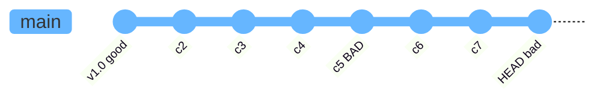

# bisect：二分查找回归

> 所属计划: [[git-deep-dive|Git 进阶——从日常使用到底层原理]]
> 预计耗时: 30min
> 前置知识: [[03-diff-log-history|diff、log 与历史导航]]

---

## 1. 概念讲解

### 为什么需要这个？

你正在维护一个项目，测试突然红了，而过去一周合并了几十个提交。逐个检查太慢，直接 `git blame` 又只能定位到"某行最后是谁改的"，未必是引入回归（regression）的那个提交。`git bisect` 就是用来解决这个问题的：你只需告诉 Git 一个"好"提交和一个"坏"提交，它会用**二分查找**自动帮你缩小范围，最终定位到引入问题的第一个提交。

> [!note]
> `git bisect` 不仅能找 bug，也能找任何"性质变化"的提交——比如性能从好变差、某个功能从有到无、甚至某个修复是从哪个提交开始生效的（此时可用 `old`/`new` 术语）。

### 核心思想

想象你在玩一个"猜数字"游戏：对方心里有一个 `1~100` 的数字，你每次猜中间值，对方只回答"大了"或"小了"。二分查找每次排除一半，`log₂(N)` 步就能找到答案。对于 1000 个提交，最多只需测试 10 次。

Git 把历史看成一条提交链（或 DAG，见 [[01-git-mental-model|Git 心智模型]]）。你指定：

- `bad`：已知有问题的提交（通常是当前 `HEAD`）
- `good`：已知没问题的提交（通常是一个发布标签或稳定版本）

然后 Git 自动检出中间提交，让你测试并标记 `good` 或 `bad`，直到收敛到第一个坏提交。



### 手动 bisect 流程

标准流程只有四步：

```bash
git bisect start          # 开始一次 bisect 会话
git bisect bad            # 标记当前 HEAD 为 bad
git bisect good <commit>  # 标记某个旧提交为 good
# Git 检出中间提交，你测试后重复 good/bad
git bisect reset          # 结束后回到原来的分支
```

也可以用一行启动并同时给出边界：

```bash
git bisect start <bad> <good>
```

例如 `git bisect start HEAD v1.2.0 --` 表示 `HEAD` 坏、`v1.2.0` 好。

### 自动化：`git bisect run <script>`

如果你能写出一个脚本自动判断当前提交是好是坏，就可以让 Git 全自动跑完。脚本退出码约定如下：

| 退出码 | 含义 | 说明 |
| :--- | :--- | :--- |
| `0` | good / old | 当前提交没有目标问题 |
| `1`–`124` | bad / new | 当前提交有问题（常用 `1`） |
| `125` | skip | 当前提交无法测试，跳过它 |
| `126`–`127` | abort | 脚本自身出错，中止 bisect |
| `≥128` | abort | 信号/异常退出，中止 bisect |

> [!warning]
> 不要把 "测试失败" 和 "无法编译" 都返回 `1`。无法编译的提交应返回 `125`（`skip`），否则 bisect 会把它当成 bad，可能错误地把它判定为第一个坏提交。

### `bisect log` / `replay` / `visualize`

- `git bisect log`：打印当前 bisect 会话的日志（包含你标记过的所有 good/bad）。
- `git bisect replay <logfile>`：根据日志文件恢复会话，适合纠正一次误标。
- `git bisect visualize`（或 `view`）：用 `gitk` 或 `git log` 查看当前仍可疑的提交范围。

### 缩小范围

二分查找的效率取决于范围大小。在启动前尽量缩小 `good..bad`：

- 从已知的最后一个稳定标签开始（如 `v2.1.0`）。
- 用 `git log --oneline --since="2 weeks ago"` 先粗略看最近的提交。
- 如果知道问题只在某个目录，可用 `git bisect start -- <path>` 限定路径。
- 对合并频繁的项目，可加上 `--first-parent`，只沿主分支的第一个父提交查找。

### 与 `git blame` / `git log -S` 互补

| 工具 | 最适合 | 局限 |
| :--- | :--- | :--- |
| `git blame` | 某一行最后是谁改的 | 不知道"第一次引入"，可能被后续格式化覆盖 |
| `git log -S` / `-G` | 某段代码/字符串何时出现或消失 | 只能搜内容变化，无法判断运行时行为 |
| `git bisect` | 行为在某个提交前后发生变化 | 需要一个可复现的 good/bad 判断标准 |

实际工作中常常先用 `git log -S` 或 `git blame` 缩小怀疑范围，再用 `git bisect` 精确定位。

---

## 2. 代码示例

本示例在 Linux/macOS/Git Bash 下测试通过，Git 版本建议 ≥ 2.40。Windows 用户若使用 PowerShell，请把脚本中的 `chmod +x test.sh` 替换为 PowerShell 执行策略设置，或改用 `bash test.sh`。

场景：我们有一个 `calc.py`，其中 `add(2, 3)` 应该返回 `5`。某个提交把 `return a + b` 改成了 `return a * b`，导致测试失败。我们用 `git bisect` 自动找到它。

**运行方式:**

```bash
# 1. 创建并进入练习仓库
mkdir -p ~/git-playground/bisect-demo
cd ~/git-playground/bisect-demo
git init
git config core.autocrlf false   # 避免 Windows 把脚本换行转成 CRLF

# 2. 创建初始版本并提交 8 次
cat > calc.py << 'EOF'
def add(a, b):
    return a + b
EOF
cat > test.sh << 'EOF'
#!/usr/bin/env bash
# 若 add(2,3) == 5 则 good(0)，否则 bad(1)
python3 - << 'PY'
import sys
from calc import add
sys.exit(0 if add(2, 3) == 5 else 1)
PY
EOF
chmod +x test.sh

git add calc.py test.sh
git commit -m "c1: init calc"

for i in 2 3 4; do
    echo "# change $i" >> calc.py
    git add calc.py
    git commit -m "c$i: doc update"
done

# 6. 这个提交引入 bug：把 + 改成 *
sed -i.bak 's/return a + b/return a * b/' calc.py
rm calc.py.bak
git add calc.py
git commit -m "c5: refactor add (BUG)"

for i in 6 7 8; do
    echo "# change $i" >> calc.py
    git add calc.py
    git commit -m "c$i: more doc"
done

# 7. 验证当前 HEAD 是坏的（若 ./test.sh 执行失败，可改用 bash test.sh）
bash test.sh && echo "good" || echo "bad"

# 8. 自动 bisect（Git 会在每次检出的提交上运行 ./test.sh）
git bisect start HEAD HEAD~7 --
git bisect run ./test.sh

# 9. 查看结果后重置
git bisect reset
```

**预期输出:**

```text
bad
Bisecting: 3 revisions left to test after this (roughly 2 steps)
[commit-hash-4] c4: doc update
running ./test.sh
Bisecting: 1 revision left to test after this (roughly 1 step)
[commit-hash-2] c2: doc update
running ./test.sh
[commit-hash-5] c5: refactor add (BUG)
is the first bad commit
commit commit-hash-5
Author: ...
Date:   ...

    c5: refactor add (BUG)

 calc.py | 2 +-
 1 file changed, 1 insertion(+), 1 deletion(-)
```

> [!tip]
> 如果你想手动体验，可以把第 8 步换成：
> ```bash
> git bisect start HEAD HEAD~7 --
> # Git 会停在一个中间提交，你运行 ./test.sh 后标记：
> git bisect good   # 或 git bisect bad
> # 重复直到 Git 报告 first bad commit
> git bisect reset
> ```

---

## 3. 练习

建议在专门的练习仓库 `~/git-playground/bisect-lab` 中完成，不要碰真实项目。

### 练习 1: 手动 bisect 找出坏提交

沿用示例仓库（或自己新建一个含 8 次提交的仓库），手动运行 `git bisect start` / `good` / `bad`，不要借助 `bisect run`，定位到引入 bug 的提交。记录下你一共标记了几次 good/bad。

### 练习 2: 用 `git bisect run` 自动化

写一个 `check.sh` 脚本，自动判断当前提交是否满足某个条件（例如某个文件中是否包含特定字符串、单元测试是否通过），然后用 `git bisect run ./check.sh` 自动找出第一个变化的提交。

### 练习 3: 结合 `git bisect skip` 跳过无法编译的提交（可选）

构造一个场景：坏提交前后有几个提交因为依赖变更而无法通过 `make` 或 `python3 -m py_compile` 编译。写一个脚本，在无法编译时返回 `125`，在测试失败时返回 `1`，在测试通过时返回 `0`，观察 `git bisect run` 如何跳过这些提交并继续定位。

---

## 3.5 参考答案

> [!tip]- 练习 1 参考答案
> 参考答案不是唯一解——如果你的实现通过/达到要求就是正确的。
>
> 手动流程示例：
> ```bash
> cd ~/git-playground/bisect-demo
> git bisect start
> git bisect bad HEAD
> git bisect good HEAD~7
> # 中间提交会被自动检出，运行测试后标记：
> ./test.sh && git bisect good || git bisect bad
> # 重复上述测试/标记 2-3 次，直到：
> # <hash> is the first bad commit
> git bisect reset
> ```
> 对于 8 个提交的范围，通常只需标记 3 次左右即可收敛。

> [!tip]- 练习 2 参考答案
> 参考答案不是唯一解——如果你的实现通过/达到要求就是正确的。
>
> 假设要定位"calc.py 中何时出现 `*` 号"：
> ```bash
> cat > check.sh << 'EOF'
> #!/usr/bin/env bash
> if grep -q 'return a \* b' calc.py; then
>     exit 1   # bad：引入了乘法
> else
>     exit 0   # good：仍是加法
> fi
> EOF
> chmod +x check.sh
>
> git bisect start HEAD HEAD~7 --
> git bisect run ./check.sh
> git bisect reset
> ```
> 提示：只要是"性质可编程判断"的场景，都可以写成脚本交给 `bisect run`。

> [!tip]- 练习 3 参考答案（可选）
> 参考答案不是唯一解——如果你的实现通过/达到要求就是正确的。
>
> 示例脚本 `robust_check.sh`：
> ```bash
> #!/usr/bin/env bash
> # 先检查能否编译/导入；不能则 skip
> python3 -m py_compile calc.py || exit 125
> # 再运行真实测试
> python3 - << 'PY'
> import sys
> from calc import add
> sys.exit(0 if add(2, 3) == 5 else 1)
> PY
> ```
> 运行：
> ```bash
> chmod +x robust_check.sh
> git bisect start HEAD HEAD~10 --
> git bisect run ./robust_check.sh
> git bisect reset
> ```
> 注意：如果无法编译的提交紧邻真正的坏提交，Git 可能只能给出范围而无法精确定位到单个提交。此时它会提示 "the first bad commit could be any of ..."。

> [!note] 答案使用方式
> 先独立完成练习，再展开查看参考答案。参考答案不是唯一解——如果你的实现通过了测试或达到了题目要求，就是正确的。

---

## 4. 扩展阅读

- [Git 官方文档：git-bisect](https://git-scm.com/docs/git-bisect)
- [Fighting regressions with git bisect（Linus Torvalds, 2009）](https://git-scm.com/docs/git-bisect-lk2009)
- 如何用 `git log -S` 快速缩小范围：[[03-diff-log-history|diff、log 与历史导航]]
- 对象模型与 commit hash 的底层解释：[[09-git-object-model|Git 对象模型：blob、tree、commit]]

---

## 常见陷阱

- **`good`/`bad` 方向标反导致结果发散**：`git bisect bad` 必须指向"有问题的提交"，`git bisect good` 必须指向"没有问题的旧提交"。如果不确定，先用 `git bisect log` 检查已标记的边界。
- **脚本退出码使用错误**：把"无法编译"返回 `1` 会让 Git 误以为该提交就是坏提交；正确做法是用 `125` 跳过。`≥128` 的退出码会被 Git 视为脚本异常并中止 bisect。
- **忘记 `git bisect reset` 而留在 detached HEAD**：bisect 过程中 Git 会反复检出中间提交，结束后若忘记 `reset`，你可能在游离 HEAD 上继续工作，后续提交容易"丢失"。
- **在脏工作区启动 bisect**：Git 在 bisect 时会切换提交，未提交的改动可能冲突或被覆盖。启动前先用 `git stash` 保存（见 [[08-stash-worktree|stash 与 worktree]]）。
- **跳过与坏提交相邻的提交**：频繁使用 `git bisect skip` 可能导致 Git 无法精确定位，只能给出一个可疑范围而不是单个提交。
