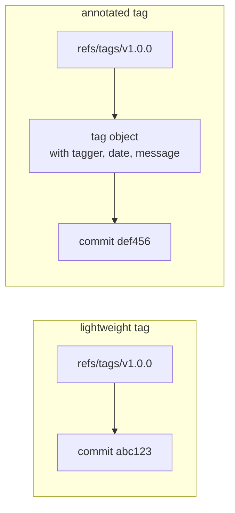
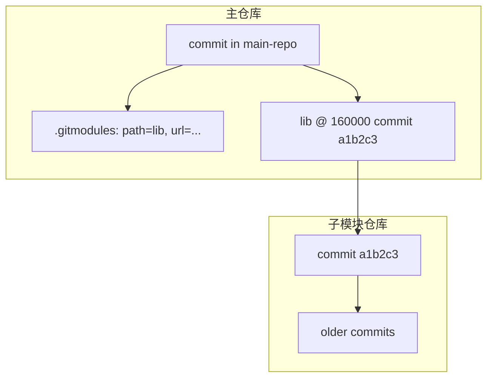
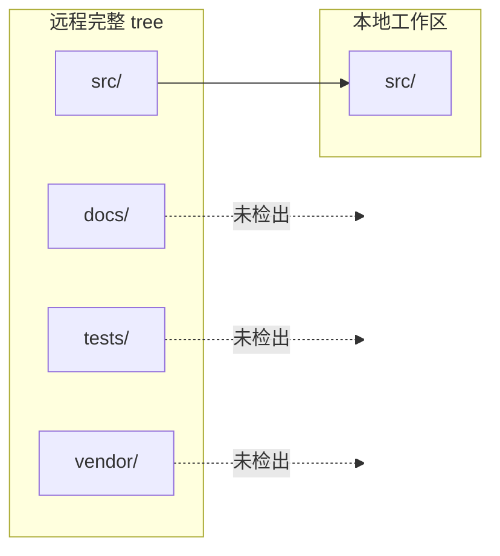

# Tags、子模块与稀疏检出

> 所属计划: [[git-deep-dive|Git 进阶——从日常使用到底层原理]]
> 预计耗时: 45min
> 前置知识: [[10-refs-dag-internals]]

---

## 1. 概念讲解

### 为什么需要这个？

当你从"会用 Git"走向"在真实项目里协作"，三件事会反复出现：

1. **标记发布**：代码到了可上线状态，需要给某个 commit 打上一个永久名字，比如 `v1.0.0`。
2. **复用代码**：项目里想引入另一个仓库（公共库、共享协议、第三方驱动），但它有自己的版本节奏。
3. **大仓库治理**：仓库里成百上千个目录，而你只负责其中一两个，没必要把全部文件都拉下来。

这一节解决的就是这三类问题：**tag**、**submodule** 与 **sparse-checkout**。它们都建立在前一节 [[10-refs-dag-internals]] 的"引用"概念上——tag 是 `refs/tags/` 下的引用，submodule 是在主仓库里固定一个外部 commit，sparse-checkout 则是只把部分 tree 投影到工作区。

### 核心思想

#### Tag：给 commit 起个永久名字

分支（`refs/heads/*`）会跟着新的提交移动；tag（`refs/tags/*`）一旦建立，通常永远指向同一个 commit，适合标记版本。

Tag 分两种：

| 类型 | 创建命令 | 是否产生对象 | 是否含 tagger/日期/留言 | 适用场景 |
|------|----------|--------------|--------------------------|----------|
| lightweight tag | `git tag v1.0.0` | 否，仅 `refs/tags/v1.0.0` 文件 | 否 | 本地临时标记 |
| annotated tag | `git tag -a v1.0.0 -m "release"` | 是，生成 tag 对象 | 是 | 正式发布、签名验证 |

annotated tag 会创建一个 tag 对象（详见 [[09-git-object-model]]），它再指向目标 commit；lightweight tag 只是一个直接指向 commit 的引用文件。发布时务必用 annotated tag，这样别人可以通过 `git tag -l -n1` 看到说明，也能用 `--follow-tags` 自动推送。



#### Submodule：在主仓库里"固定"一个外部仓库

子模块把另一个 Git 仓库嵌到当前目录。主仓库只记录两点：

- `.gitmodules` 文件：说明子模块的**路径**和**远程 URL**。
- 目录（如 `lib/`）在父仓库 tree 里以特殊 mode `160000` 记录成一个 **commit 引用**，指向外部仓库的某个具体 commit。



因此子模块天然是"钉死版本"的：无论外部仓库如何前进，主仓库里的子模块只会在你显式更新时才移动。这也带来最著名的坑：子模块默认处于 **detached `HEAD`** 状态，直接在里头改代码容易丢。

#### Sparse-checkout：只检出需要的目录

`sparse-checkout` 让工作区只包含仓库的一部分。远程 still 拥有完整历史，但本地磁盘上只有指定目录。



Git 2.40 推荐用 `--cone` 模式，只按目录匹配，性能好、语义直观。

#### Subtree：把外部历史合并进主仓库

`git subtree` 是另一种"引入外部代码"的方式。它把外部仓库的某个分支历史**合并**进主仓库的一个前缀目录，不生成 `.gitmodules`，子目录内容就是普通文件。适合把依赖"vendor"进项目，或者把子项目历史保留在主仓库里。

---

## 2. 代码示例

**环境要求**：Git `>= 2.40`（本示例在 Git 2.52 下运行），Windows 用户注意路径与 `core.autocrlf`。所有命令在专门练习仓库 `git-playground` 中执行，不要碰真实项目。

下面演示：

1. 给主仓库打一个 annotated tag 并用 `--follow-tags` 推送；
2. 添加一个子模块，并展示"带/不带 `--recurse-submodules`"克隆的区别；
3. 用 `sparse-checkout` 只检出 `src/`。

**运行方式：**

```bash
# 1. 创建两个裸仓库作为本地"远程"：主仓库和共享库
mkdir -p /tmp/git-playground && cd /tmp/git-playground

# 本地裸仓库演示需要启用 file 协议（Git 2.38+ 安全限制，仅学习用）
git config --global protocol.file.allow always
git init --bare -b main main-origin.git
git init --bare -b main lib-origin.git

# 2. 准备共享库（子模块源）
mkdir lib-work && cd lib-work
git init -b main
git config user.name "You" && git config user.email "you@example.com"
printf '%s\n' 'console.log("lib v1")' > index.js
git add . && git commit -m "lib initial"
git push ../lib-origin.git main
cd ..

# 3. 准备主仓库
mkdir main-repo && cd main-repo
git init -b main
git config user.name "You" && git config user.email "you@example.com"
git remote add origin ../main-origin.git

mkdir src docs
printf '%s\n' 'module.exports = 42' > src/app.js
printf '%s\n' '# README' > docs/readme.md
git add . && git commit -m "initial main"

# 4. 添加子模块；.gitmodules 会自动生成
git submodule add ../lib-origin.git lib
git commit -m "add lib submodule"

# 5. 打 annotated tag 并推送（--follow-tags 只推送可达的 annotated tag）
git tag -a v1.0.0 -m "release 1.0.0"
git push -u origin main
git push --follow-tags origin main

# 6. 查看 tag、.gitmodules 和子模块指针
git tag -l -n1
cat .gitmodules
git ls-tree HEAD lib

# 7. 不带 --recurse-submodules 克隆：子模块目录为空/未初始化
cd ..
git clone main-origin.git no-sub
cd no-sub
git submodule status

# 8. 带 --recurse-submodules 克隆：子模块被完整拉下
cd ..
git clone --recurse-submodules main-origin.git with-sub
cd with-sub
git submodule status
head lib/index.js

# 9. sparse-checkout：只检出 src/（子模块未初始化，所以只保留空挂载点）
cd ..
git clone --sparse main-origin.git sparse-repo
cd sparse-repo
git sparse-checkout init --cone
git sparse-checkout set src/
git sparse-checkout list
ls -R
```

**预期输出：**

```text
# git tag -l -n1
v1.0.0          release 1.0.0

# cat .gitmodules
[submodule "lib"]
	path = lib
	url = ../lib-origin.git

# git ls-tree HEAD lib
160000 commit b0cc78a3784c248458e0a1fc43c525f7d9c51518	lib

# git submodule status（不带 --recurse-submodules）
-b0cc78a3784c248458e0a1fc43c525f7d9c51518 lib

# git clone --recurse-submodules ... 后
b0cc78a3784c248458e0a1fc43c525f7d9c51518 lib (heads/main)
console.log("lib v1")

# git sparse-checkout list
src

# ls -R
.:
lib
src

./lib:

./src:
app.js
```

> [!important]
> 子模块目录前带 `-` 表示尚未初始化；带 `+` 表示当前检出与主仓库记录不一致；正常为空白或 commit hash。

### 签名 Tag（可选）

如果你对 GPG/SSH 签名有配置，annotated tag 还可以签名：

```bash
# GPG 签名（需本地有私钥并配置 user.signingkey）
git tag -s v1.0.0 -m "release 1.0.0"

# 或 SSH 签名（Git 2.34+）
git tag --sign --message="release 1.0.0" v1.0.0

# 验证
 git tag -v v1.0.0
```

没有签名环境时，先用 `git tag -a` 即可。

### Subtree 示例（可选）

如果你不想维护子模块的独立仓库，可以用 `subtree` 把外部代码直接合并进主仓库历史：

```bash
# 把 ../tools-origin.git 的 main 分支合并到 tools/ 目录，--squash 压成一次提交
git subtree add --prefix=tools ../tools-origin.git main --squash

# 后续拉取更新
git subtree pull --prefix=tools ../tools-origin.git main --squash
```

执行后 `git log --oneline` 会看到一次类似 `Merge commit '...' as 'tools'` 的提交，`tools/` 目录里就是普通文件， teammates 不需要学习子模块命令。

---

## 3. 练习

### 练习 1: 给发布打 annotated tag 并推送

在你为本节创建的 `main-repo` 中，再打一个新的 annotated tag `v1.1.0`，附带说明 `"fix login memory leak"`。先用 `git tag -l -n1` 本地检查，再用 `--follow-tags` 推送到 `main-origin.git`，最后到裸仓库里用 `git tag -l` 确认 tag 已经到达远程。

### 练习 2: 添加 submodule 并验证克隆行为

新建一个子项目 `shared-utils` 的裸仓库，把它作为 submodule 加到 `main-repo` 的 `utils/` 路径下并提交。然后：

1. 在 `main-repo` 本地执行 `git submodule status` 查看指针。
2. 不带 `--recurse-submodules` 克隆一次，检查 `utils/` 目录是否为空。
3. 带 `--recurse-submodules` 克隆一次，确认 `utils/` 里有文件。

### 练习 3: 用 sparse-checkout 只取一个子目录（可选）

新建一个包含 `frontend/`、`backend/`、`docs/` 三个目录的仓库，把它推送到本地裸仓库。然后克隆时使用 `--sparse`，并只检出 `frontend/`。用 `git sparse-checkout list` 与 `ls -R` 证明其余目录没有出现在工作区。

---

## 3.5 参考答案

> [!tip]- 练习 1 参考答案
> 参考答案不是唯一解——只要最终 tag 成功推送到远程并能在裸仓库看到即可。
> ```bash
> cd /tmp/git-playground/main-repo
> git tag -a v1.1.0 -m "fix login memory leak"
> git push --follow-tags origin main
> cd ../main-origin.git
> git tag -l
> ```

> [!tip]- 练习 2 参考答案
> 参考答案不是唯一解——只要 `.gitmodules` 正确、克隆带 `--recurse-submodules` 能拿到内容即可。
> ```bash
> # 1. 创建 shared-utils 源
> cd /tmp/git-playground
> # 为本地演示启用 file 协议
> git config --global protocol.file.allow always
> git init --bare -b main utils-origin.git
> mkdir utils-work && cd utils-work
> git init -b main
> git config user.name "You" && git config user.email "you@example.com"
> echo 'export const add = (a,b)=>a+b' > math.js
> git add . && git commit -m "utils init"
> git push ../utils-origin.git main
> cd ..
> 
> # 2. 加入主仓库
> cd main-repo
> git submodule add ../utils-origin.git utils
> git commit -m "add utils submodule"
> git push origin main
> 
> # 3. 验证两种克隆
> cd ..
> git clone main-origin.git no-utils
> cd no-utils && git submodule status && ls utils
> cd ..
> git clone --recurse-submodules main-origin.git with-utils
> cd with-utils && git submodule status && head utils/math.js
> ```

> [!tip]- 练习 3 参考答案（可选）
> 参考答案不是唯一解——只要 sparse-checkout 后工作区只有 frontend/ 即可。
> ```bash
> cd /tmp/git-playground
> mkdir monorepo && cd monorepo
> git init -b main
> git config user.name "You" && git config user.email "you@example.com"
> mkdir frontend backend docs
> touch frontend/app.js backend/server.js docs/readme.md
> git add . && git commit -m "initial monorepo"
> git push ../main-origin.git main
> cd ..
> git clone --sparse main-origin.git sparse-monorepo
> cd sparse-monorepo
> git sparse-checkout init --cone
> git sparse-checkout set frontend/
> git sparse-checkout list
> ls -R
> ```

> [!note] 答案使用方式
> 先独立完成练习，再展开查看参考答案。参考答案不是唯一解——如果你的实现通过了测试或达到了题目要求，就是正确的。

---

## 4. 扩展阅读

- [Git 官方文档：Git 子模块](https://git-scm.com/book/en/v2/Git-Tools-Submodules)
- [Git 官方文档：git-sparse-checkout](https://git-scm.com/docs/git-sparse-checkout)
- [Git 官方文档：git-subtree](https://git-scm.com/docs/git-subtree)
- [Git Tag 文档](https://git-scm.com/docs/git-tag)
- [Pro Git 中文版：标签](https://git-scm.com/book/zh/v2/Git-%E5%9F%BA%E7%A1%80-%E6%89%93%E6%A0%87%E7%AD%BE)

---

## 常见陷阱

- **lightweight tag 当发布 tag 用**：`git tag v1.0.0` 不会记录打标签的人和日期，也无法被 `--follow-tags` 自动推送。发布请用 `git tag -a`。
- **克隆含 submodule 的仓库忘记 `--recurse-submodules`**：子模块目录会只剩一个空壳，构建脚本找不到依赖。补救：`git submodule update --init --recursive`。
- **在 submodule 里改完代码直接提交到主仓库**：子模块默认 detached `HEAD`，在里面 commit 后如果切回主分支再更新，改动可能变成悬空对象。正确做法：进入子模块切到分支、commit/push、回到主仓库 `git add lib` 更新指针并提交。
- **混淆 `--tags` 与 `--follow-tags`**：`git push --tags` 会把本地所有 tag（包括别人不想见的草稿 tag）全部推上去；`--follow-tags` 只推送本次推送分支可达的 annotated tag，更干净。
- **`sparse-checkout` 未开 `--cone` 就写复杂模式**：非 cone 模式使用完整路径匹配语法，容易写错且性能差。普通目录过滤请用 `git sparse-checkout init --cone`。
- **subtree 当 submodule 用**：subtree 把外部历史合并进主仓库，适合"vendor"依赖；如果你想让外部仓库独立演进、主仓库只固定版本，应该选 submodule。

---

## 选型速查表：submodule vs subtree vs monorepo

| 维度 | submodule | subtree | monorepo |
|------|-----------|---------|----------|
| 外部仓库是否独立 | 是 | 形式上合并，但可独立拉取 | 否，全部在一个仓库 |
| 主仓库历史是否包含外部历史 | 否（只记录指针） | 是（合并进同一 DAG） | 是 |
| 协作者学习成本 | 高（要懂 submodule 命令） | 低（像普通目录） | 低 |
| 适合场景 | 库有独立发布节奏，需要钉死版本 | 把第三方代码 vendor 进项目 | 同一团队、频繁跨目录改动 |
| 大仓库磁盘优化 | 无 | 无 | 配合 sparse-checkout 可省磁盘 |
