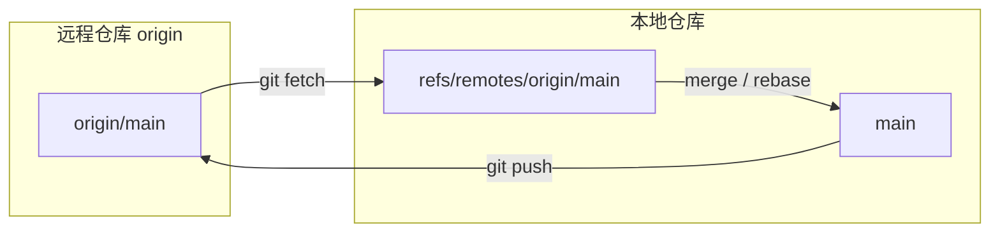
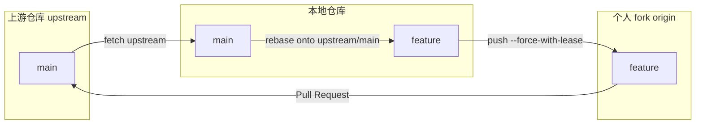

# 远程协作进阶

> 所属计划: [[git-deep-dive|Git 进阶——从日常使用到底层原理]]
> 预计耗时: 60min
> 前置知识: [[04-branch-merge-deep]] [[05-rebase-core]]

---

## 1. 概念讲解

### 为什么需要这个？

当多人共享同一个远程仓库时，`push`/`pull` 不再是"把本地改动上传到服务器"这么简单。你会遇到：

- 同事先你一步推送了提交，你的 `git push` 报 `non-fast-forward` 错误；
- `git pull` 后历史突然多出一个多余的 merge commit，把原本线性的提交图搅乱；
- 想用 `git push --force` 整理 PR 分支，又担心覆盖别人的提交；
- 维护 fork 仓库时，不知道怎样同步上游（upstream）的新改动；
- 本地残留着一堆已经在远端删除的 `origin/xxx` 分支。

这些问题都指向同一个核心：**Git 把"本地分支"、"远程仓库"和"远程跟踪分支"分得清清楚楚**。理解这三者的关系，才能安全、干净地协作。

### 核心思想：本地分支、远程仓库与远程跟踪分支

远程仓库（remote）只是本地仓库对另一个 Git 仓库的引用，通常叫 `origin` 或 `upstream`。它本身不保存代码，只保存一个 URL 和一组抓取规则（refspec）。

当你执行 `git fetch <remote>` 时，Git 会做两件事：

1. 把远端仓库的对象下载到本地 `.git/objects/`；
2. 把远端分支的当前 tip 位置记录到 `refs/remotes/<remote>/<branch>`，例如 `refs/remotes/origin/main`。

这些 `refs/remotes/...` 就是**远程跟踪分支**（remote-tracking branch）。你可以把它们理解为"我上次 fetch 时，看到远端分支长这样"。它们以只读快照的形式存在，除非你再次 fetch，否则不会自动移动。

本地分支（如 `main`、`feature`）与远程跟踪分支的关系，由 **tracking branch**（上游分支）维护。tracking 分支告诉你：

- `git pull` 默认从哪里拉取；
- `git push` 默认推送到哪里；
- `git status` 显示的 "ahead/behind N commits" 是和谁比较。



> [!note]
> `origin/main` 是 `refs/remotes/origin/main` 的简写。它在本地真实存在，只是不是你可以直接 `git checkout` 后做提交的那种"本地分支"。

### `git fetch` vs `git pull`

这是协作中最常被混淆的一组命令：

| 命令 | 实际行为 | 是否修改本地分支 |
|------|---------|----------------|
| `git fetch <remote>` | 下载远端对象，更新 `refs/remotes/<remote>/*` | 否 |
| `git pull` | `git fetch` + `git merge FETCH_HEAD` | 是，通常产生一个 merge commit |
| `git pull --rebase` | `git fetch` + `git rebase <tracking>` | 是，保持提交图线性 |

`git pull` 的"方便"是有代价的：如果你的本地分支已经有一两个提交，而远程也有新提交，默认的 merge 模式会在历史里留下一次三方合并（参见 [[04-branch-merge-deep]]）。对大多数团队来说，PR 分支和主分支都希望历史尽量线性，因此更推荐：

```bash
git fetch origin
git rebase origin/main
```

或者一次性：

```bash
git pull --rebase origin main
```

> [!tip]
> 可以配置 `git config --global pull.rebase true`，让 `git pull` 默认使用 rebase 模式。这样你仍然可以显式用 `git pull --no-rebase` 回到 merge 模式。

### Tracking branch：谁是我的上游？

新建分支并第一次推送时，用 `-u`（或 `--set-upstream`）同时建立 tracking：

```bash
git switch -c feature
git push -u origin feature
```

之后在该分支上：

```bash
git pull   # 等价于 git pull origin feature
git push   # 等价于 git push origin feature
```

如果你克隆了一个仓库，`main` 通常已经自动跟踪 `origin/main`。可以用 `git branch -vv` 查看 tracking 关系：

```bash
git branch -vv
```

如果想修改 tracking 分支，例如把 `main` 改为跟踪 `upstream/main`：

```bash
git branch -u upstream/main main
```

### `git push --force-with-lease` 与 `--force`

强制推送会改写远端分支历史。在整理 PR 分支（例如 rebase 后）时是必要的，但裸的 `--force` 极其危险：它会无条件把远端分支指针移到新的 tip，**覆盖任何你尚未看到的提交**。

`--force-with-lease` 的机制是：

> "只有当远端分支仍然停留在我上次 `fetch` 看到的那个 commit 时，才允许覆盖；如果有人在我 fetch 之后又推送了新内容，直接拒绝。"

| 选项 | 行为 | 安全性 |
|------|------|--------|
| `--force` / `-f` | 无条件覆盖远端分支 | 低，可能抹除他人提交 |
| `--force-with-lease` | 仅在远端分支 tip 与本地记录一致时覆盖 | 高，拒绝并发推送 |

> [!warning]
> `--force-with-lease` 不是绝对防弹。如果你在 fetch 之后、push 之前没有重新 fetch，而你本地缓存的 remote-tracking 已经过期，它仍可能覆盖他人的提交。黄金法则是：**push 前先 fetch**。

### Fork + PR 工作流

在 GitHub/GitLab 等平台上，外部贡献者通常不会直接向上游仓库 push，而是：

1. **Fork** 一份仓库到自己的账号下（`origin`）；
2. 克隆自己的 fork（`git clone <fork-url>`）；
3. 添加一个指向原仓库的 `upstream` remote；
4. 在本地创建 `feature` 分支，提交改动；
5. 把 `feature` 分支 push 到自己的 fork；
6. 从 fork 向上游发起 **Pull Request / Merge Request**。



### 用 rebase 保持 PR 分支线性

在 PR 被合并之前，上游 `main` 可能又有了新的提交。为了让 PR 分支的提交图保持干净、便于 review，通常会做：

```bash
git fetch upstream
git rebase upstream/main feature
```

这会把 `feature` 分支上独有的提交"摘下来"重新接到 `upstream/main` 的最新 tip 上（详见 [[05-rebase-core]]）。rebase 会生成新的 commit hash，因此远端 `origin/feature` 的历史已经和本地不一致，必须用 `--force-with-lease` 推送：

```bash
git push --force-with-lease origin feature
```

### 多 remote 同步：fork + upstream

一个典型的本地仓库会有两个 remote：

| remote | 含义 | 用途 |
|--------|------|------|
| `origin` | 自己的 fork | 推送 feature 分支 |
| `upstream` | 原始仓库 | 拉取最新主分支 |

常用同步节奏：

```bash
# 查看所有 remote
git remote -v

# 获取上游最新代码
git fetch upstream

# 更新本地 main（假设当前在 main）
git rebase upstream/main

# 可选：把同步后的 main 也推回自己的 fork
git push origin main
```

> [!important]
> 永远不要在 `upstream` 的 `main` 等公共分支上运行 `git push --force`。公共分支的历史一旦改写，所有协作者都会遭殃。

### `git push` 失败的非快进场景

当你 push 时，Git 会检查远端分支的当前 tip 是否是你本地历史的一个祖先。如果不是，就会报错：

```text
! [rejected]        main -> main (non-fast-forward)
error: failed to push some refs to '...'
hint: Updates were rejected because the tip of your current branch is behind
```

出现这个错误的原因通常是：

- 别人先 push 了；
- 你在本地做了 rebase/amend，导致本地分支的 base 和远端不一致；
- 你从另一个仓库 push 到了同一个分支。

正确做法从来不是 `--force` 了事，而是：

1. `git fetch <remote>`；
2. 解决分歧：`git rebase <remote>/<branch>` 或 `git merge <remote>/<branch>`；
3. 再次 `git push`。

### `git fetch --prune` 清理已删除的远程分支

当同事删除了远端的 `origin/feature-x`，你本地 `git branch -r` 可能仍然显示 `origin/feature-x`。这是因为 `fetch` 默认不会删除远程跟踪分支。

清理它们：

```bash
# 只清理 origin 的已删除分支
git fetch --prune origin

# 也可以全局配置 fetch 时自动 prune
git config --global fetch.prune true
```

之后再用 `git branch -r` 查看，死分支就会消失。注意 `--prune` 不会删除你的本地分支，只删除 `refs/remotes/...` 下的跟踪分支。

### `push.default`：裸 `git push` 到底推哪里？

当你只输入 `git push` 而不写 remote 和分支名时，Git 会看 `push.default` 配置。Git 2.0 之后的默认值是 `simple`。

| 值 | 行为 | 适用场景 |
|----|------|----------|
| `simple`（默认） | 推送当前分支到同名的 tracking 分支；如果 tracking 上游不是同名分支则拒绝 | 绝大多数开发者 |
| `current` | 推送当前分支到远端同名分支，不依赖 tracking 关系 | CI 脚本、临时分支 |
| `upstream` | 推送到当前分支的 tracking 分支（旧默认语义） | 旧项目兼容 |
| `matching` | 推送所有本地与远端同名的分支 | 不推荐 |

```bash
# 推荐设置
git config --global push.default simple
```

> [!note]
> `simple` 会阻止你向一个名称不同的上游分支 push，这能避免很多意外。CI 或自动化脚本若需要向同名分支 push，可以临时使用 `current`。

---

## 2. 代码示例

下面用**本地裸仓库**模拟一个完整的 fork + upstream + PR 协作流程。整个示例不需要 GitHub 账号，只要 Git 2.40+ 即可运行。

**运行环境要求**：Git 2.40+；Linux / macOS / Windows（建议使用 Git Bash 或 PowerShell，路径分隔符需按环境调整）。

### 场景设定

- `upstream.git`：模拟开源项目上游仓库；
- `fork.git`：模拟你 fork 到自己账号下的仓库；
- `owner/`：模拟上游维护者的工作目录；
- `alice/`：模拟你的本地工作目录。

### 运行方式

```bash
# 1. 创建实验目录
mkdir git-remote-lab && cd git-remote-lab

# 2. 创建两个裸仓库：上游 和 个人 fork，并指定默认分支为 main
git init --bare upstream.git
git -C upstream.git symbolic-ref HEAD refs/heads/main
git init --bare fork.git
git -C fork.git symbolic-ref HEAD refs/heads/main

# 3. 模拟上游维护者初始化项目并 push 到 upstream
git clone upstream.git owner
cd owner
git config user.name "Owner"
git config user.email "owner@example.com"
git switch -c main
echo "# Project" > README.md
git add README.md
git commit -m "Initial commit"
git push -u origin main
cd ..

# 4. 把上游代码"复制"到个人 fork（模拟 GitHub 上的 Fork 按钮）
cd owner
git push ../fork.git main:main
cd ..

# 5. 你克隆自己的 fork，并添加 upstream remote
git clone fork.git alice
cd alice
git config user.name "Alice"
git config user.email "alice@example.com"
git remote add upstream ../upstream.git
git remote -v

# 6. 创建 feature 分支并提交
git switch -c feature
echo "Feature A" > feature.txt
git add feature.txt
git commit -m "Add feature A"
git push -u origin feature

# 7. 同时，上游维护者又向 upstream 推送了一个提交
cd ../owner
echo "Upstream update" >> README.md
git commit -am "Upstream update"
git push

# 8. 你回到本地仓库，同步上游并 rebase PR 分支
cd ../alice
git fetch upstream
# 注意：先确保 main 是最新的（可选，养成习惯）
git switch main
git rebase upstream/main
# 把更新后的 main 也同步回自己的 fork
git push origin main
# 再把 feature rebase 到最新的 main 上
git rebase main feature
# 9. 因为 feature 历史被重写，使用 --force-with-lease 推回自己的 fork
git push --force-with-lease origin feature

# 10. 查看最终历史
git log --oneline --graph --all
```

### 预期输出

`git remote -v` 会显示两个 remote：

```text
origin	../fork.git (fetch)
origin	../fork.git (push)
upstream	../upstream.git (fetch)
upstream	../upstream.git (push)
```

`git log --oneline --graph --all` 在最后一步大致如下（hash 和时间戳会不同）：

```text
* 4f3e8d1 (HEAD -> feature, origin/feature) Add feature A
* 9c2b1a4 (upstream/main, origin/main, main) Upstream update
* 7a6c5e2 Initial commit
```

注意 `feature` 的提交直接挂在 `upstream/main` 的最新提交之后，中间没有 merge commit。

> [!tip]
> 真实环境中，第 9 步之后你会到 GitHub/GitLab 上从 `origin/feature` 向 `upstream/main` 发起 Pull Request。平台会负责合并；合并后你就可以用 `git fetch --prune origin` 清理已经合并的远程跟踪分支。

---

## 3. 练习

所有练习都在 `git-remote-lab` 环境中完成。如果还没有创建，请先按"代码示例"初始化。

### 练习 1: 配置 upstream 并同步

在 `alice/` 仓库中，确认 `upstream` remote 已正确指向 `../upstream.git`。然后：

1. 让上游维护者（`owner/`）再向 `upstream` push 一个提交；
2. 在 `alice/` 中把本地 `main` 同步到 `upstream/main`；
3. 用 `git branch -vv` 验证 `main` 的 tracking 关系，并解释输出。

### 练习 2: 用 `--force-with-lease` 推送 rebase 后的分支

在 `alice/` 中：

1. 在 `feature` 分支上再做一个提交；
2. 把 `feature` rebase 到最新的 `upstream/main`；
3. 用 `git push --force-with-lease origin feature` 推送；
4. 解释为什么不能直接用 `git push`，以及 `--force-with-lease` 在这里起了什么作用。

### 练习 3: 修复一次非快进 push（可选）

在 `alice/` 中：

1. 切换回 `main`；
2. 直接编辑 `README.md` 并提交；
3. 让上游维护者（`owner/`）先向 `upstream` push 一个提交；
4. 在 `alice/` 中执行 `git push upstream main`，观察 `non-fast-forward` 错误；
5. 用 fetch + rebase（或 merge）解决，然后再次 push。

---

## 3.5 参考答案

> [!tip]- 练习 1 参考答案
> 参考答案不是唯一解——如果你的实现通过/达到要求就是正确的。
>
> ```bash
> # 在 owner/ 中向 upstream 推送一个新提交
> cd git-remote-lab/owner
> echo "Another upstream change" >> README.md
> git commit -am "Another upstream update"
> git push
>
> # 回到 alice/ 同步
> cd ../alice
> git fetch upstream
> git switch main
> # 把 main 的 tracking 从 origin/main 改为 upstream/main
> git branch -u upstream/main main
> git rebase upstream/main
>
> # 查看 tracking 关系
> git branch -vv
> ```
>
> `git branch -vv` 的输出类似：
>
> ```text
> * main                9c2b1a4 [upstream/main] Upstream update
>   feature             4f3e8d1 [origin/feature] Add feature A
> ```
>
> 解释：`main` 前面的 `*` 表示当前分支；方括号里 `[upstream/main]` 说明 `main` 跟踪的是 `upstream` 仓库的 `main` 分支。这样你以后在 `main` 上直接 `git pull` 就会从 `upstream` 拉取。

> [!tip]- 练习 2 参考答案
> 参考答案不是唯一解——如果你的实现通过/达到要求就是正确的。
>
> ```bash
> cd git-remote-lab/alice
> git switch feature
>
> echo "Feature B" > feature2.txt
> git add feature2.txt
> git commit -m "Add feature B"
>
> # 确保上游最新
> git fetch upstream
>
> # 把 feature rebase 到最新 upstream/main
> git rebase upstream/main feature
>
> # 安全推送到自己的 fork
> git push --force-with-lease origin feature
> ```
>
> 直接 `git push` 会失败，因为 rebase 后 `feature` 的 commit hash 已经改变，远端 `origin/feature` 不再是你当前 `feature` 的祖先。裸 `--force` 会无条件覆盖远端分支，如果在你 fetch 之后有其他协作者也向 `origin/feature` push 了新提交，那些提交就会被静默删除。`--force-with-lease` 会先检查 `origin/feature` 是否还停留在你本地 remote-tracking 记录的位置，只有没变化时才覆盖，从而避免误删他人工作。

> [!tip]- 练习 3 参考答案（可选）
> 参考答案不是唯一解——如果你的实现通过/达到要求就是正确的。
>
> ```bash
> cd git-remote-lab/alice
> git switch main
>
> echo "My local change" > local.txt
> git add local.txt
> git commit -m "Local change on main"
>
> # 让上游先走一步
> cd ../owner
> echo "Owner change" >> README.md
> git commit -am "Owner change"
> git push
>
> # 回到 alice 尝试 push，会收到 non-fast-forward 错误
> cd ../alice
> git push upstream main
> ```
>
> 错误信息类似：
>
> ```text
> ! [rejected]        main -> main (fetch first)
> error: failed to push some refs to '../upstream.git'
> ```
>
> 正确处理方式：
>
> ```bash
> git fetch upstream
> git rebase upstream/main
> git push upstream main
> ```
>
> 如果你选择 merge 而不是 rebase，则：
>
> ```bash
> git fetch upstream
> git merge upstream/main
> git push upstream main
> ```
>
> 这会保留一次三方合并提交。对 `main` 这类长期分支，merge 是常见选择；对 PR 的 feature 分支，则更推荐 rebase 保持线性。

> [!note] 答案使用方式
> 先独立完成练习，再展开查看参考答案。参考答案不是唯一解——如果你的实现通过了测试或达到了题目要求，就是正确的。

---

## 4. 扩展阅读

- [Git 官方文档：git-push](https://git-scm.com/docs/git-push)
- [Git 官方文档：git-fetch](https://git-scm.com/docs/git-fetch)
- [Git 官方文档：git-pull](https://git-scm.com/docs/git-pull)
- [Git Book：远程分支与跟踪分支](https://git-scm.com/book/en/v2/Git-Branching-Remote-Branches)
- [Git Book：分布式工作流](https://git-scm.com/book/en/v2/Distributed-Git-Distributed-Workflows)
- [GitHub Docs：Working with forks](https://docs.github.com/en/pull-requests/collaborating-with-pull-requests/working-with-forks)
- [Atlassian：Forking workflow](https://www.atlassian.com/git/tutorials/comparing-workflows/forking-workflow)

---

## 常见陷阱

- **用 `--force` 重写公共分支历史**：公共分支（如 `main`、`develop`）上永远不要使用 `git push --force`。如果你必须整理已推送的 PR 分支，请用 `git push --force-with-lease`，并确保 push 前已经 `fetch` 过。
- **`git pull` 默认产生 merge commit 污染历史**：默认 `git pull` 等价于 `fetch + merge`，会让本地分支多出无意义的合并提交。建议对 feature/PR 分支使用 `git pull --rebase`，或养成 `fetch` 后手动 `rebase` 的习惯。
- **忘记 `--prune` 导致本地残留死远程分支**：远端已删除的分支仍会在 `git branch -r` 里显示，容易让人误以为分支还在。配置 `fetch.prune = true` 或定期运行 `git fetch --prune <remote>`。
- **把 `origin` 和 `upstream` 搞反**：在 fork 工作流里，`origin` 通常是你自己的 fork，`upstream` 才是原始仓库。向 `upstream` 推送 feature 分支或直接 force-push 到 `upstream/main` 是常见事故。
- **误用 `push.default = current` 导致推到错误的远端分支**：`current` 会忽略 tracking 关系，只按当前分支名找远端同名分支。在个人电脑上建议保持默认 `simple`，避免意外覆盖他人分支。
- **在 rebase 后忘记 push 需要 force**：rebase 会生成新的 commit hash，远端分支不再是新历史的祖先。此时直接 push 会被拒绝，但不要用裸 `--force` 硬来；`--force-with-lease` 是更安全的习惯。

---

> 本节与 [[04-branch-merge-deep]]（分支合并）、[[05-rebase-core]]（rebase 核心技能）紧密衔接，也是 [[15-workflows-config]]（工作流策略与配置）中 fork/PR 工作流的前置基础。想了解"出事后怎么找回"，可以参考 [[06-reflog-undo]]。
