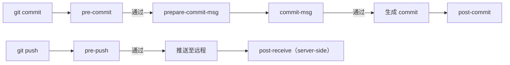

# Hooks 与自动化

> 所属计划: [[git-deep-dive|Git 进阶——从日常使用到底层原理]]
> 预计耗时: 60min
> 前置知识: 无

---

## 1. 概念讲解

### 为什么需要这个？

你已经在日常用 `git add` / `git commit` / `git push` 了，但团队里总会遇到这些场景：

- 某次提交把 `console.log` / `TODO` 带进了主分支；
- 代码风格五花八门，Code Review 时还在争论缩进；
- 提交信息写成 "fix"、"update"，半年后完全不知道改了什么；
- 有人推了一个明显会挂的测试上去。

Hooks（钩子）就是 Git 在特定事件点自动执行的可执行脚本。它们能在问题进入仓库历史之前把它拦住，也能在推送后触发通知、部署等自动化任务。把重复检查交给机器，Code Review 才能回到真正该讨论的事情上。

### 核心思想

Git hooks 的本质非常简单：`.git/hooks/` 目录下放置与事件同名的可执行脚本，Git 在对应事件发生时调用它们。脚本返回非零退出码，Git 就会阻止当前操作继续执行。

可以想象成飞机起飞前的检查清单：

- `pre-commit`：登机前检查安全带（提交前检查代码）；
- `commit-msg`：确认飞行计划签名（提交信息格式）；
- `pre-push`：起飞前最后绕机一周（推送前跑测试）。

下面是一次 `git commit` 与 `git push` 会触发的典型 client-side hooks 流程：



### Client-side 与 Server-side hooks

| 类型 | 运行位置 | 典型用途 | 常见钩子 |
|------|----------|----------|----------|
| Client-side | 开发者本地 | 代码检查、格式化、提交信息校验 | `pre-commit`、`prepare-commit-msg`、`commit-msg`、`pre-push`、`pre-rebase` |
| Server-side | 远程仓库（如 GitLab/GitHub 自托管、Gitea） | 权限控制、CI 触发、部署 | `pre-receive`、`update`、`post-receive` |

Client-side hooks 是你本地机器上的"自律工具"，可以被人为绕过；server-side hooks 是仓库门口的"门卫"，是最后一道防线。两者互补，不能只靠一端。

### 常用 client-side hooks 一览

- `pre-commit`：在 `git commit` 真正创建提交之前运行。最常用来跑 linter、阻止 `console.log`、检查测试是否通过。
- `prepare-commit-msg`：在提交信息编辑器打开前运行，可用来预填提交信息模板，例如自动带上 issue 编号。
- `commit-msg`：在提交信息编辑器关闭后、提交真正创建前运行，用来校验提交信息格式，如 Conventional Commits。
- `pre-push`：在 `git push` 前运行，适合跑单元测试、集成测试，避免把 broken build 推上去。
- `pre-rebase`：在 `git rebase` 开始前运行，可用来阻止对特定分支做 rebase（详见 [[05-rebase-core]]）。

### Server-side hooks：仓库门口的守卫

Server-side hooks 运行在接收推送的服务器上，常用于自托管 Git 服务。用户无法绕过它们（除非你有服务器权限）。

- `pre-receive`：在推送被接收前运行一次，可读取所有被推送的引用；返回非零则全部拒绝。
- `update`：对每个被更新的引用各运行一次，适合按分支做细粒度权限控制。
- `post-receive`：推送成功后运行，常用来触发 CI、发通知或部署。

> [!note]
> GitHub/GitLab 的 Web Hook 不属于 Git 原生 server-side hooks，而是平台级事件通知。它们功能类似，但实现与触发时机由平台定义。

### `.sample` 模板与启用方式

初始化仓库时，Git 会自动在 `.git/hooks/` 下生成一批以 `.sample` 结尾的示例脚本：

```bash
# 查看仓库自带的 hook 模板
ls .git/hooks/
```

**预期输出：**

```text
applypatch-msg.sample      pre-merge-commit.sample
commit-msg.sample          pre-push.sample
fsmonitor-watchman.sample  pre-rebase.sample
post-update.sample         pre-receive.sample
pre-applypatch.sample      prepare-commit-msg.sample
pre-commit.sample          update.sample
push-to-checkout.sample
```

启用一个 hook 只需要去掉 `.sample` 后缀并赋予可执行权限：

```bash
# 复制示例脚本并启用
mv .git/hooks/pre-commit.sample .git/hooks/pre-commit
chmod +x .git/hooks/pre-commit
```

> [!warning]
> Windows 用户注意：在 WSL/Git Bash 中 `chmod +x` 有效；在纯 CMD/PowerShell 中，Git for Windows 也会通过文件扩展名或 ACL 判断可执行性，但最稳妥的方式仍是在 Git Bash 中执行 `chmod +x`。

### 团队共享 hooks 的难题

`.git/hooks/` 目录**默认不会被版本控制**，所以你在本地写的 `pre-commit` 无法直接随仓库分发给队友。常见解决方案有三种：

| 方案 | 做法 | 优点 | 缺点 |
|------|------|------|------|
| 把脚本放进仓库，通过文档/安装脚本链接 | 如 `tools/hooks/pre-commit` + `ln -s` 或安装脚本 | 简单、无外部依赖 | 依赖同事手动执行安装 |
| pre-commit 框架 | `.pre-commit-config.yaml` + `pre-commit install` | 跨语言、版本锁定、团队一致 | 需要安装 Python 包 |
| Husky / lefthook | `package.json` 或 `lefthook.yml` 管理 | 与 Node/前端项目集成好 | Husky 依赖 Node；lefthook 是独立二进制 |

> [!important]
> 无论选哪种方案，都不要直接在 `.git/hooks/` 里手动维护然后指望团队一致——这个目录是 Git 的"私有空间"，不会被提交。

### pre-commit 框架：跨语言钩子管理

[pre-commit](https://pre-commit.com/) 是 Python 写的开源框架，用一份 `.pre-commit-config.yaml` 描述需要安装的钩子。它会自动：

1. 下载指定版本的工具；
2. 安装到隔离环境；
3. 在提交时按顺序执行；
4. 只检查本次提交改动的文件（默认）。

安装与启用：

```bash
# 安装框架（需要 Python 3.9+）
pip install pre-commit

# 在仓库里安装 hooks（会写入 .git/hooks/pre-commit）
pre-commit install
```

典型 `.pre-commit-config.yaml`：

```yaml
repos:
  - repo: https://github.com/pre-commit/pre-commit-hooks
    rev: v4.6.0
    hooks:
      - id: trailing-whitespace
      - id: end-of-file-fixer
      - id: check-yaml

  - repo: https://github.com/psf/black
    rev: 24.4.2
    hooks:
      - id: black
        language_version: python3

  - repo: https://github.com/eslint/eslint
    rev: v9.3.0
    hooks:
      - id: eslint
        additional_dependencies: [eslint@9.3.0]
```

常用命令：

```bash
# 对所有文件跑一次（常用于首次配置或 CI）
pre-commit run --all-files

# 只对当前暂存区文件跑
pre-commit run

# 更新钩子版本
pre-commit autoupdate
```

### Husky 与 lefthook 对比

| 特性 | Husky | lefthook |
|------|-------|----------|
| 语言 | Node.js | Go（单二进制） |
| 配置 | `.husky/` 目录 + `package.json` 脚本 | `lefthook.yml` |
| 并行执行 | 需配合 lint-staged | 原生支持 |
| 依赖 | 需要 Node 环境 | 独立二进制，跨项目可用 |
| 适用场景 | 前端/Node 项目 | 多语言、大仓库、追求速度 |

Husky 的经典用法：

```bash
# 初始化（npm 项目内）
npx husky init

# 添加 pre-commit 钩子
echo "npx lint-staged" > .husky/pre-commit
```

lefthook 的经典用法：

```bash
# 安装 lefthook（以 go install 为例）
go install github.com/evilmartians/lefthook@latest

# 安装钩子
lefthook install
```

```yaml
# lefthook.yml
pre-commit:
  commands:
    lint:
      run: eslint {staged_files}
    format:
      run: prettier --write {staged_files}
```

### CI 侧检查：hooks 的补充，不是替代

Hooks 是本地自律工具，但可以被 `--no-verify` 跳过（见下方"常见陷阱"）。因此仓库还需要 CI 这道最后防线：

- 在 Pull Request 时跑完整测试套件；
- 用 CI job 执行 `pre-commit run --all-files`；
- 对 `main` 分支做保护规则，禁止直接推送。

> [!tip]
> 推荐组合：本地 hooks 保证"每次提交都干净"，CI 保证"合并前没问题"。只依赖一端迟早会翻车。

---

## 2. 代码示例

**运行环境要求：**

- Git ≥ 2.40
- Bash / Git Bash / WSL / macOS Terminal
- 可选：Python 3.9+（用于 pre-commit 框架）

### 示例 1：手写 `pre-commit` 阻止 `TODO` 与 `console.log`

```bash
# 1. 创建练习仓库
git init git-playground-hooks
cd git-playground-hooks

# 2. 查看默认 hook 模板
ls .git/hooks/*.sample

# 3. 创建并启用一个自定义 pre-commit 钩子
cat > .git/hooks/pre-commit <<'EOF'
#!/bin/sh
# 检查暂存区中是否包含 TODO 或 console.log

# 获取暂存区文件列表
STAGED_FILES=$(git diff --cached --name-only --diff-filter=ACMR)

if [ -z "$STAGED_FILES" ]; then
    exit 0
fi

# 使用 git grep 在暂存区搜索关键词
if git diff --cached -G 'TODO|console\.log' --name-only | grep -q .; then
    echo "ERROR: 暂存区发现 TODO 或 console.log，请清理后再提交。"
    echo "受影响文件："
    git diff --cached -G 'TODO|console\.log' --name-only
    exit 1
fi

exit 0
EOF

chmod +x .git/hooks/pre-commit

# 4. 创建包含 TODO 的文件并尝试提交
echo '// TODO: remove this' > app.js
git add app.js
git commit -m "add app"
```

**预期输出：**

```text
ERROR: 暂存区发现 TODO 或 console.log，请清理后再提交。
受影响文件：
app.js
```

提交被阻止。清理后再试：

```bash
# 5. 清理 TODO 后重新提交
sed -i 's/\/\/ TODO: remove this/\/\/ clean code/' app.js
git add app.js
git commit -m "add clean app"
```

### 示例 2：`commit-msg` 校验提交信息格式

```bash
# 1. 创建 commit-msg 钩子
cat > .git/hooks/commit-msg <<'EOF'
#!/bin/sh
# 强制提交信息以 feat:/fix:/docs:/refactor:/test:/chore: 开头

COMMIT_MSG_FILE=$1
PATTERN='^(feat|fix|docs|refactor|test|chore)(\(.+\))?: .{10,}'

if ! grep -qE "$PATTERN" "$COMMIT_MSG_FILE"; then
    echo "ERROR: 提交信息不符合 Conventional Commits 规范。"
    echo "正确示例：feat(auth): add OAuth2 login"
    exit 1
fi
EOF

chmod +x .git/hooks/commit-msg

# 2. 错误提交会被拦截
git commit --allow-empty -m "bad message"
```

**预期输出：**

```text
ERROR: 提交信息不符合 Conventional Commits 规范。
正确示例：feat(auth): add OAuth2 login
```

```bash
# 3. 正确提交信息可通过
git commit --allow-empty -m "feat(auth): add OAuth2 login support"
```

### 示例 3：用 pre-commit 框架接入 black 与 eslint

```bash
# 1. 确保已安装 pre-commit
pip install pre-commit

# 2. 在仓库根目录创建配置文件
cat > .pre-commit-config.yaml <<'EOF'
repos:
  - repo: https://github.com/pre-commit/pre-commit-hooks
    rev: v4.6.0
    hooks:
      - id: trailing-whitespace
      - id: end-of-file-fixer

  - repo: https://github.com/psf/black
    rev: 24.4.2
    hooks:
      - id: black
        language_version: python3
EOF

# 3. 安装钩子（写入 .git/hooks/pre-commit）
pre-commit install

# 4. 创建一个有格式问题的 Python 文件
cat > hello.py <<'EOF'
def greet( name ):
    print("hello")
EOF

git add hello.py

# 5. 提交时 black 会自动修复格式并重新暂存
git commit -m "feat(py): add hello"
```

**预期输出：**

```text
trailing-whitespace......................................................Passed
end-of-file-fixer........................................................Passed
black....................................................................Failed
- hook id: black
- files were modified by this hook

[main abc1234] feat(py): add hello
```

> [!note]
> 如果 formatter 修改了文件但提交仍然成功，说明原文件在 staged 版本中已被修复；工作区的文件可能仍是旧格式，需要 `git diff` 查看并再次 `git add`。部分团队会配置 formatter 自动 `git add` 修改后的文件，但 pre-commit 框架默认不会替你做这件事。

---

## 3. 练习

### 练习 1：写 `pre-commit` 阻止含 `TODO` 的提交

在 `git-playground-hooks` 中手写一个 `pre-commit` 钩子，要求：

1. 检查本次暂存区（`git diff --cached`）中是否包含 `TODO` 字样；
2. 如果发现，打印错误信息并列出受影响文件；
3. 返回非零退出码，阻止提交。

验证方式：创建一个含 `TODO` 的文件，执行 `git add` 后 `git commit`，应看到提交被阻止；清理 `TODO` 后提交成功。

### 练习 2：用 pre-commit 框架加一个钩子

在你的练习仓库中：

1. 安装 pre-commit 框架；
2. 创建 `.pre-commit-config.yaml`，至少加入 `trailing-whitespace` 和 `end-of-file-fixer` 两个钩子；
3. 执行 `pre-commit install` 与 `pre-commit run --all-files`；
4. 观察输出，理解钩子如何自动修复文件问题。

### 练习 3：写 `commit-msg` 强制 Conventional Commits（可选）

编写一个 `commit-msg` 钩子，强制提交信息符合 [Conventional Commits](https://www.conventionalcommits.org/) 基本规范：

- 必须以 `feat:`、`fix:`、`docs:`、`refactor:`、`test:` 或 `chore:` 开头；
- 冒号后必须有一个空格；
- 描述长度不少于 10 个字符。

验证方式：

```bash
# 应失败
git commit --allow-empty -m "update"

# 应成功
git commit --allow-empty -m "feat(cli): add verbose flag"
```

---

## 3.5 参考答案

> [!tip]- 练习 1 参考答案
> 参考答案不是唯一解——如果你的实现能够阻止含 `TODO` 的提交并通过清理后的提交，就是正确的。
>
> ```bash
> # 写入 .git/hooks/pre-commit
> cat > .git/hooks/pre-commit <<'EOF'
> #!/bin/sh
> # 检查暂存区是否包含 TODO
>
> MATCHED=$(git diff --cached -G 'TODO' --name-only)
>
> if [ -n "$MATCHED" ]; then
>     echo "ERROR: 发现 TODO，提交被拒绝。"
>     echo "$MATCHED"
>     exit 1
> fi
> EOF
>
> chmod +x .git/hooks/pre-commit
>
> # 测试：应失败
> echo '// TODO: fix later' > app.js
> git add app.js
> git commit -m "add app"
>
> # 清理后：应成功
> echo '// clean' > app.js
> git add app.js
> git commit -m "add clean app"
> ```

> [!tip]- 练习 2 参考答案
> 参考答案不是唯一解——只要 `pre-commit run --all-files` 能执行并输出检查/修复结果，就是正确的。
>
> ```bash
> # 安装框架
> pip install pre-commit
>
> # 创建配置文件
> cat > .pre-commit-config.yaml <<'EOF'
> repos:
>   - repo: https://github.com/pre-commit/pre-commit-hooks
>     rev: v4.6.0
>     hooks:
>       - id: trailing-whitespace
>       - id: end-of-file-fixer
> EOF
>
> # 安装钩子
> pre-commit install
>
> # 对所有文件运行
> pre-commit run --all-files
> ```
>
> 预期会看到类似输出：
>
> ```text
> trailing-whitespace......................................................Passed
> end-of-file-fixer........................................................Passed
> ```

> [!tip]- 练习 3 参考答案（可选）
> 参考答案不是唯一解——只要提交信息不符合规范时被阻止、符合规范时通过即可。
>
> ```bash
> # 写入 .git/hooks/commit-msg
> cat > .git/hooks/commit-msg <<'EOF'
> #!/bin/sh
> # 强制 Conventional Commits 基本格式
>
> MSG_FILE=$1
> PATTERN='^(feat|fix|docs|refactor|test|chore)(\(.+\))?: .{10,}$'
>
> if ! grep -qE "$PATTERN" "$MSG_FILE"; then
>     echo "ERROR: 提交信息不符合 Conventional Commits。"
>     echo "示例：feat(auth): add OAuth2 login"
>     exit 1
> fi
> EOF
>
> chmod +x .git/hooks/commit-msg
>
> # 测试
> git commit --allow-empty -m "update"        # 应失败
> git commit --allow-empty -m "feat(cli): add verbose flag"  # 应成功
> ```

> [!note] 答案使用方式
> 先独立完成练习，再展开查看参考答案。参考答案不是唯一解——如果你的实现通过了测试或达到了题目要求，就是正确的。

---

## 4. 扩展阅读

- [Git 官方文档 - Customizing Git Hooks](https://git-scm.com/book/en/v2/Customizing-Git-Git-Hooks)
- [pre-commit 官方文档](https://pre-commit.com/)
- [Conventional Commits 规范](https://www.conventionalcommits.org/)
- [Husky 官方仓库](https://github.com/typicode/husky)
- [lefthook 官方仓库](https://github.com/evilmartians/lefthook)
- [GitHub Docs - About protected branches](https://docs.github.com/en/repositories/configuring-branches-and-merges-in-your-repository/managing-protected-branches/about-protected-branches)

---

## 常见陷阱

- **hooks 本地不入库导致团队不一致**：`.git/hooks/` 默认不进入版本控制。正确做法是使用 pre-commit 框架、Husky 或 lefthook，把配置提交到仓库，并通过文档/脚本引导成员执行 `pre-commit install` / `lefthook install`。

- **`--no-verify` 是逃生通道，但不能滥用**：当你明知 hooks 会失败但仍想提交时，可以用 `git commit --no-verify` 或 `git push --no-verify` 跳过。但这应该是极少数情况（如紧急热修复），否则 hooks 形同虚设。

- **忘了给脚本 `+x` 权限**：Git 只会执行有执行权限的 hook 脚本。如果脚本名为 `pre-commit` 但没有 `chmod +x`，Git 会静默跳过，你误以为检查了其实没有。Windows 用户在 Git Bash 中执行 `chmod +x .git/hooks/pre-commit` 最稳妥。

- **pre-commit 钩子太慢劝退团队**：在 `pre-commit` 里跑完整测试套件会让每次提交都等很久。正确做法是把重量级检查放到 `pre-push` 或 CI 中，`pre-commit` 只保留轻量、快速的检查（如 lint、格式化、关键词过滤）。

- **server-side hooks 与 CI 混淆**：Git 原生的 `pre-receive`/`update`/`post-receive` 运行在 Git 服务端；GitHub Actions/GitLab CI 是平台级 CI，虽然也能做检查，但触发时机和权限模型不同。不要在一个场景里硬套另一个概念。
