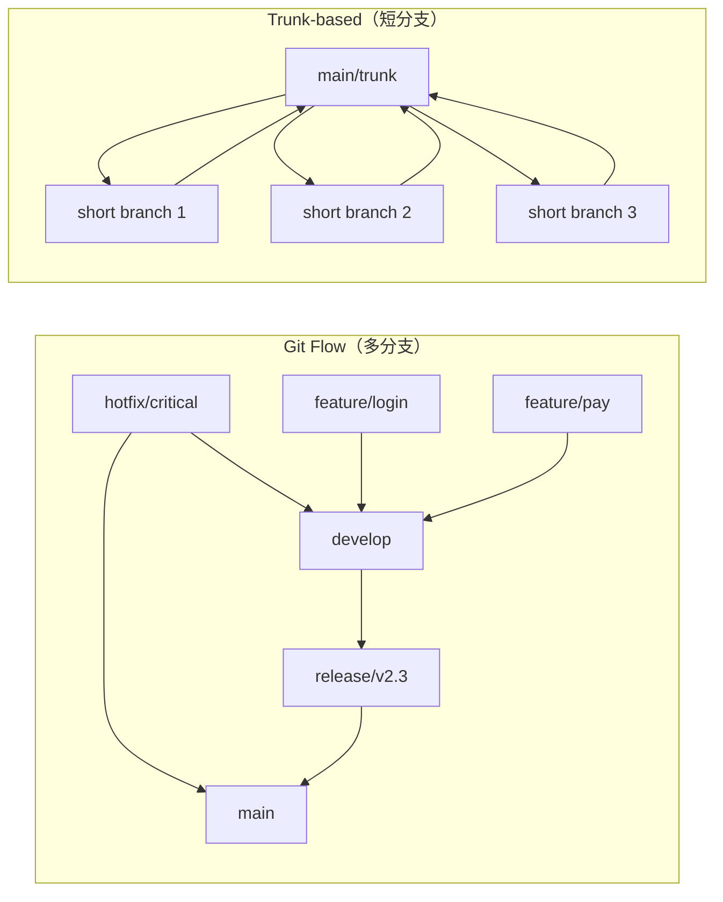

# 工作流策略与配置精通

> 所属计划: [[git-deep-dive|Git 进阶——从日常使用到底层原理]]
> 预计耗时: 60min
> 前置知识: [[05-rebase-core]] [[13-remote-collaboration]]

---

## 1. 概念讲解

### 为什么需要这个？

当你已经会用 `rebase`、`--force-with-lease`、cherry-pick 这些"利器"之后，下一个真实问题往往变成：

- 团队里每个人分支怎么建、怎么合？
- 发布版本怎么管理？要不要 `develop` 分支？
- 为什么同样的命令在不同仓库表现不一样？
- 怎样让 Git 在 Windows 上别改我的行尾？
- 如何给常用命令起短别名，又不让配置变成"黑魔法"？

本节把"人怎么协作"（工作流）和"机器怎么表现"（配置）放到一起讲，因为两者共同决定了你每天打开终端的体验。理解清楚后，你能为团队选出合适的分支策略，并用一套干净、可迁移的 `.gitconfig` 把个人效率提上来。

### 核心思想：工作流是约定，配置是杠杆

可以把 Git 工作流想象成"交通规则"：

- **Git Flow**：城市高架系统，有主路、辅路、匝道、应急车道，规则多但适合复杂路况。
- **GitHub Flow**：社区单车道，红绿灯少，适合车流不大、迭代快的场景。
- **Trunk-based**：高速公路，所有人尽量在主线上行驶，辅以短匝道（短命分支）和收费站（CI/CD gate）。

没有"最好"的工作流，只有"最匹配你的发布节奏和团队规模"的工作流。配置则是把高频操作抽象成更短、更稳定的命令，同时统一换行、合并、默认分支等环境行为，减少"在我机器上好好的"这类问题。

### 三大工作流对比

| 维度 | Git Flow | GitHub Flow | Trunk-based |
|------|----------|-------------|-------------|
| 核心分支 | `main`、`develop`、`feature/*`、`release/*`、`hotfix/*` | `main`、`feature/*` | `main`（trunk）、极短生命周期分支 |
| 分支寿命 | `feature` 可能数日，`release`/`hotfix` 按版本 | `feature` 通常数小时到数日 | 分支通常 < 1 天，常数小时内合并 |
| 发布节奏 | 按版本发布，需 `release` 分支冻结 | 持续交付，每次合并可发布 | 持续集成/持续交付，主干随时可发布 |
| 合并方式 | `feature` → `develop`，`release` → `main` + `develop` | PR 合并到 `main` | PR 到 trunk，或直接在 trunk 上提交（小团队） |
| 历史形状 | 允许合并提交，历史较复杂 | 通常 squash/merge 保持相对线性 | 极力保持线性，常用 rebase/squash |
| 适合团队 | 多版本并行、需严格发布控制的中大型团队 | 互联网产品、频繁发布的小到中型团队 | 有成熟 CI/CD、想极限缩短反馈周期的团队 |
| 学习成本 | 高 | 低 | 中（对 CI/CD 和提交纪律要求高） |

> [!note]
> 这三者不是互斥的进化关系。很多团队从 GitHub Flow 起步，随着版本控制需求变重而引入某些 Git Flow 元素（如 `release` 分支）；也有团队从 Git Flow 逐步瘦身成 Trunk-based。关键是让工作流服务于发布节奏，而不是为了流程而流程。

#### 工作流与历史重写的关系

- **Git Flow** 大量使用合并提交，较少 rewrite 历史，更关注版本清晰。
- **GitHub Flow** 常用 PR 的 "Squash and merge" 或 "Rebase and merge"，把 `feature` 分支整理成干净提交后再合入 `main`。
- **Trunk-based** 要求开发者把分支整理到极简、可快速审查的状态，频繁 rebase 到最新 trunk 上；[[05-rebase-core]] 的交互式 rebase 和 `--autosquash` 在这里几乎是日常操作。

下面用一张图展示 Git Flow 和 Trunk-based 在分支形态上的差异：



### Git 配置的三级体系

Git 配置文件有三层，后写入的覆盖先写入的：

| 层级 | 文件位置 | 命令 | 作用范围 |
|------|----------|------|----------|
| system | `/etc/gitconfig`（Linux）<br/>`C:\Program Files\Git\etc\gitconfig`（Windows） | `git config --system` | 整台机器所有用户 |
| global | `~/.gitconfig` 或 `~/.config/git/config` | `git config --global` | 当前用户所有仓库 |
| local | `.git/config` | `git config --local`（默认） | 当前仓库 |

优先级：**local > global > system**。这意味着你可以在全局设一套默认，再对特定仓库做微调。

> [!warning]
> 不要在 system 层写个人偏好（如 `user.name`/`user.email`），否则会影响机器上所有用户。system 层通常只放公司代理、`safe.directory` 等全局策略。

### 条件包含：`includeIf`

`includeIf` 是 Git 2.13+ 引入的利器，允许按路径或分支条件加载额外的配置文件。最常见的场景：

- 公司项目放在 `~/work/` 下，自动使用公司邮箱；
- 个人项目放在 `~/personal/` 下，自动使用个人邮箱；
- 某个技术栈目录自动启用特定别名或钩子路径。

语法示例：

```gitconfig
[includeIf "gitdir:~/work/"]
    path = ~/.gitconfig-work
[includeIf "gitdir:~/personal/"]
    path = ~/.gitconfig-personal
```

> [!important]
> `gitdir:` 路径末尾的 `/` 很关键。`~/work/` 会匹配 `~/work/` 下的所有仓库，而 `~/work` 可能只匹配 `~/work` 这个目录本身。路径也支持通配符 `*`。

### 别名：把长命令变短

Git 别名不是 shell alias，而是 Git 自己解析的。基本形式：

```gitconfig
[alias]
    s = status -s
    co = checkout
    sw = switch
    br = branch
    ci = commit
    lg = log --oneline --graph --all --decorate
```

别名里也可以跑外部命令，前面加 `!`：

```gitconfig
    amend = commit --amend --no-edit
    unstage = reset HEAD --
    visual = !gitk
```

> [!tip]
> 推荐优先给"看一眼"的命令起别名（如 `status`、`log`、`branch`），而破坏性命令（如 `reset --hard`、`push --force`）尽量保留完整拼写，给自己多一秒钟思考。

### 关键配置项速览

| 配置项 | 推荐值 | 作用 |
|--------|--------|------|
| `core.autocrlf` | `input`（macOS/Linux）<br/>`true`（Windows） | 自动处理 CRLF/LF 行尾 |
| `core.excludesfile` | `~/.gitignore_global` | 全局忽略文件（如 IDE 配置） |
| `init.defaultBranch` | `main` | 新仓库默认分支名 |
| `pull.rebase` | `true` | `git pull` 默认 rebase 而非 merge |
| `rebase.autoStash` | `true` | rebase 前自动 stash 未提交改动 |
| `fetch.prune` | `true` | `fetch` 时自动清理已删除的远程分支 |
| `push.default` | `simple` | 只推送当前分支到同名的 upstream |
| `merge.conflictStyle` | `zdiff3`（2.35+） | 更易读的冲突标记 |
| `safe.directory` | `*` 或具体路径 | 解决多用户/挂载盘上的权限警告 |

#### `core.autocrlf` 与行尾

Windows 默认换行是 `CRLF`（`\r\n`），macOS/Linux 是 `LF`（`\n`）。如果不统一，团队里会经常出现"整行都被改了"的伪 diff。

- `core.autocrlf=true`：提交时把 `CRLF` 转 `LF`，检出时把 `LF` 转 `CRLF`。适合纯 Windows 开发者。
- `core.autocrlf=input`：提交时把 `CRLF` 转 `LF`，检出时不转。适合 macOS/Linux，或跨平台团队。
- `core.autocrlf=false`：不做任何转换。需要配合 `.gitattributes` 使用（推荐成熟团队）。

> [!warning]
> 现代团队更推荐用仓库级 `.gitattributes` 显式声明行尾策略，例如 `* text=auto eol=lf`，而不是依赖每个人的 `core.autocrlf`。配置是个人偏好，`.gitattributes` 是团队契约。

#### `safe.directory`：权限警告的救急方案

当你用另一个用户身份（如 root、Docker 容器、共享挂载盘）访问仓库时，Git 2.35+ 会提示：

```text
fatal: unsafe repository ('/path/to/repo' is owned by someone else)
```

正确做法：

```bash
# 仅对该仓库放行
sudo git config --global --add safe.directory /path/to/repo

# 容器/CI 中对所有目录放行（仅限可信环境）
git config --global --add safe.directory '*'
```

> [!warning]
> `safe.directory = '*'` 会关闭所有权检查，只应在完全可信的环境（如本地个人机、一次性 CI）使用。生产服务器或共享机器上不要这样做。

---

## 2. 代码示例

下面给出一份"可直接复制使用"的推荐 `.gitconfig` 片段，以及一个 `includeIf` 的完整演示。

**运行环境要求**：Git 2.40+；Linux / macOS / Windows（PowerShell/Git Bash 均可）。部分命令（如 `merge.conflictStyle = zdiff3`）需要 2.35+。

### 示例 1：查看当前配置层级

```bash
# 查看 system 层
git config --system --list --show-origin

# 查看 global 层
git config --global --list --show-origin

# 查看 local 层
git config --local --list --show-origin

# 查看最终生效值（含来源）
git config --list --show-origin | grep user.email
```

### 示例 2：推荐 `.gitconfig` 片段

将以下内容写入 `~/.gitconfig`（或 `%USERPROFILE%\.gitconfig`）：

```gitconfig
[user]
    name = Your Name
    email = you@example.com

[init]
    defaultBranch = main

[core]
    # macOS/Linux 用户推荐 input；Windows 开发者可改为 true
    autocrlf = input
    excludesfile = ~/.gitignore_global
    # 中文路径不乱码
    quotepath = false

[pull]
    rebase = true

[rebase]
    autoStash = true

[fetch]
    prune = true

[push]
    default = simple

[merge]
    conflictStyle = zdiff3

[alias]
    s = status -s
    st = status
    co = checkout
    sw = switch
    br = branch
    ci = commit
    lg = log --oneline --graph --all --decorate
    last = log -1 HEAD --stat
    amend = commit --amend --no-edit
    unstage = restore --staged --
    discard = restore --
    staged = diff --staged
    unmerged = branch --no-merged
```

### 示例 3：用 `includeIf` 区分公司与个人项目

```bash
# 1. 创建两个目录
mkdir -p ~/work ~/personal

# 2. 创建公司专属配置
cat > ~/.gitconfig-work <<'EOF'
[user]
    email = dev@company.com
[core]
    autocrlf = true
[url "git@git.company.com:"]
    insteadOf = https://git.company.com/
EOF

# 3. 创建个人专属配置
cat > ~/.gitconfig-personal <<'EOF'
[user]
    email = you@example.com
[core]
    autocrlf = input
EOF

# 4. 在 ~/.gitconfig 中追加条件包含
cat >> ~/.gitconfig <<'EOF'

[includeIf "gitdir:~/work/"]
    path = ~/.gitconfig-work
[includeIf "gitdir:~/personal/"]
    path = ~/.gitconfig-personal
EOF

# 5. 验证
cd ~/work
git init test-work
cd test-work
git config --show-origin user.email
```

**预期输出：**

```text
file:/home/you/.gitconfig-work dev@company.com
```

> [!note]
> 在 Windows 上，`gitdir:` 路径写法与 Git Bash 或 PowerShell 的 home 目录解析一致即可；也可以用绝对路径如 `gitdir:C:/Users/you/work/`。

### 示例 4：工作流选型脚本（讨论用）

下面是一组用来判断当前团队适合哪种工作流的自问清单，不是 Git 命令，但可作为团队会议材料：

```text
1. 你们是否每天多次部署到生产环境？
   - 是 → 优先考虑 Trunk-based 或 GitHub Flow
   - 否 → Git Flow 可能更合适

2. 是否需要同时维护多个发布版本（如 LTS 版）？
   - 是 → Git Flow 的 release/hotfix 分支能帮到你
   - 否 → 简化成 GitHub Flow

3. 团队成员对 rebase / squash / CI 门控的熟悉度如何？
   - 高 → Trunk-based 效率更高
   - 低 → 从 GitHub Flow 开始逐步演进

4. 历史可读性 vs 版本可追溯性，哪个更重要？
   - 历史可读性 → GitHub Flow / Trunk-based（线性/接近线性）
   - 版本可追溯性 → Git Flow（合并提交记录完整版本节点）
```

---

## 3. 练习

所有配置类练习都建议在测试环境或备份后的真实配置上进行，避免影响工作仓库。可在 `git-playground` 仓库中执行需要 local 配置的练习。

### 练习 1: 配置 5 个实用别名

在 global 配置中添加 5 个你认为最实用的别名（可包含上方示例中的），并验证：

1. `git s` 能正确显示状态；
2. `git lg` 能显示带图形的日志；
3. 至少有一个别名使用了 `git restore` 或 `git switch` 现代命令。

### 练习 2: 用 `includeIf` 给某目录用不同 `user.email`

创建 `~/demo-company/` 和 `~/demo-personal/` 两个目录，分别对应两个不同的邮箱。配置完成后：

1. 在两个目录下分别 `git init` 新仓库；
2. 用 `git config --show-origin user.email` 验证来源和值是否正确；
3. 解释：如果 global 的 `user.email` 和 include 文件里的 `user.email` 冲突，最终哪个生效？为什么？

### 练习 3: 画一个适合自己团队的分支流程图（可选）

假设你所在（或假想）的团队有如下特征：

- 每周发布一次；
- 有 2 名后端、1 名前端、1 名测试；
- 生产 bug 需要热修复；
- 习惯用 PR 做代码审查。

请选择或定制一种工作流（可以是三种的混合），画出分支流程图，并说明：

1. 为什么选这种而不是另外两种；
2. `feature` 分支从哪条分支切出、合并到哪条分支；
3. 热修复怎么进入生产；
4. 是否使用 rebase 保持线性历史。

---

## 3.5 参考答案

> [!tip]- 练习 1 参考答案
> 参考答案不是唯一解——如果你的实现通过/达到要求就是正确的。
>
> ```bash
> # 添加别名
> git config --global alias.s "status -s"
> git config --global alias.lg "log --oneline --graph --all --decorate"
> git config --global alias.sw "switch"
> git config --global alias.rs "restore"
> git config --global alias.amend "commit --amend --no-edit"
>
> # 验证
> git s
> git lg
> git config --get-regexp alias
> ```
>
> 建议别名组合思路：
> - 高频查看：`s`、`lg`、`last`
> - 现代命令：`sw`（switch）、`rs`（restore）
> - 安全改写：`amend`（不修改提交信息）
> - 暂存相关：`staged`、`unstage`
>
> 注意：给 `reset --hard` 或 `push --force` 起短别名通常不是好做法，会降低操作门槛、增加误触风险。

> [!tip]- 练习 2 参考答案
> 参考答案不是唯一解——如果你的实现通过/达到要求就是正确的。
>
> ```bash
> mkdir -p ~/demo-company ~/demo-personal
>
> cat > ~/.gitconfig-company <<'EOF'
> [user]
>     email = dev@company.com
> EOF
>
> cat > ~/.gitconfig-personal <<'EOF'
> [user]
>     email = you@example.com
> EOF
>
> cat >> ~/.gitconfig <<'EOF'
>
> [includeIf "gitdir:~/demo-company/"]
>     path = ~/.gitconfig-company
> [includeIf "gitdir:~/demo-personal/"]
>     path = ~/.gitconfig-personal
> EOF
>
> cd ~/demo-company && git init company-repo && cd company-repo
> git config --show-origin user.email
>
> cd ~/demo-personal && git init personal-repo && cd personal-repo
> git config --show-origin user.email
> ```
>
> **冲突优先级**：`includeIf` 引入的配置与 global 中同名键冲突时，**后写入的覆盖先写入的**。由于 `includeIf` 是在 `~/.gitconfig` 末尾引入的，它通常会在 global 配置之后被解析，因此 `includeIf` 中的 `user.email` 会覆盖 global 中的值。
>
> 可以用 `git config --list --show-origin user.email` 查看最终生效值及其来源文件。

> [!tip]- 练习 3 参考答案（可选）
> 参考答案不是唯一解——如果你的实现通过/达到要求就是正确的。
>
> 选型示例：**GitHub Flow + 热修复分支的轻量混合**。
>
> 理由：
> - 每周发布一次，不需要 Git Flow 那样严格的 `release` 分支冻结；
> - 团队规模小，GitHub Flow 足够轻量；
> - 生产 bug 需要快速修补，保留一个从 `main` 切出的 `hotfix/*` 分支直接合并回 `main` 并打 tag。
>
> ```mermaid
> flowchart LR
>     subgraph "GitHub Flow + hotfix"
>         direction TB
>         main[main]
>         f1[feature/search]
>         f2[feature/payment]
>         h1[hotfix/auth]
>
>         main --> f1
>         main --> f2
>         main --> h1
>         f1 --> main
>         f2 --> main
>         h1 --> main
>     end
> ```
>
> 流程说明：
> 1. `feature/*` 从 `main` 切出，PR 合并回 `main`；
> 2. 每周从 `main` 打 tag 发布（如 `v2024.25`）；
> 3. 生产 bug 从对应 tag 或 `main` 切出 `hotfix/*`，修复后 PR 合并回 `main`，并视情况 cherry-pick 到需要维护的旧版本分支；
> 4. `feature` 分支在提交 PR 前用 `git rebase main` 保持线性（参考 [[05-rebase-core]]），合并方式可选 "Squash and merge" 或 "Rebase and merge"。
>
> 为什么不选 Git Flow：每周发布节奏下，`develop` 与 `release` 分支会增加不必要的同步成本。
> 为什么不选 Trunk-based：团队目前还不具备每日多次发布的 CI/CD 成熟度，Trunk-based 的短分支纪律可能难以维持。

> [!note] 答案使用方式
> 先独立完成练习，再展开查看参考答案。参考答案不是唯一解——如果你的实现通过了测试或达到了题目要求，就是正确的。

---

## 4. 扩展阅读

- [Git 官方文档：Git 配置](https://git-scm.com/book/en/v2/Customizing-Git-Git-Configuration)
- [Git 官方文档：includeIf 条件包含](https://git-scm.com/docs/git-config#_includes)
- [GitHub Flow 官方指南](https://docs.github.com/en/get-started/quickstart/github-flow)
- [Trunk-Based Development](https://trunkbaseddevelopment.com/)
- [A successful Git branching model (Git Flow 原文)](https://nvie.com/posts/a-successful-git-branching-model/)
- [Git 官方文档：gitattributes 行尾控制](https://git-scm.com/docs/gitattributes)

---

## 常见陷阱

- **全局配错影响所有项目**：`git config --global` 很方便，但不要把某个项目的 `user.email`、`remote`、或 `url.insteadOf` 设到 global。项目专属配置应该用 `--local` 或 `includeIf` 限定范围。
- **`core.autocrlf` 设错导致全文件 diff**：跨平台团队如果没有统一的行尾策略，Windows 开发者提交后 macOS 开发者 pull 下来可能看到整行都变了。推荐在仓库根目录添加 `.gitattributes`（如 `* text=auto eol=lf`），把行尾策略变成代码的一部分，而不是依赖每个人的 Git 配置。
- **`init.defaultBranch` 仍是 `master`**：Git 2.28+ 支持 `init.defaultBranch`，但旧机器或某些 CI 镜像可能默认还是 `master`。如果团队统一用 `main`，务必在 global 配置中显式设置 `init.defaultBranch = main`，并在团队文档中写明。
- **别名暗藏破坏性语义**：给 `push --force`、`reset --hard`、`clean -fd` 起短别名会显著增加误操作概率。好的别名应该降低"查看类命令"的摩擦，而不是让危险命令更容易触发。
- **`safe.directory = '*'` 滥用**：在共享服务器、可疑挂载盘或从互联网下载的压缩包里直接加 `*` 会绕过 Git 的安全检查。只在完全可信的本地环境或一次性 CI 容器中使用。

---

> 本节是阶段四的收尾综合：前面 [[05-rebase-core]] 和 [[13-remote-collaboration]] 讲的历史重写与远程协作，最终都要落到一个"团队愿意遵守、个人愿意执行"的工作流里。第 16 节 [[16-capstone-rescue-history]] 会把整套技能放进一个真实的"拯救历史"项目中综合运用。
