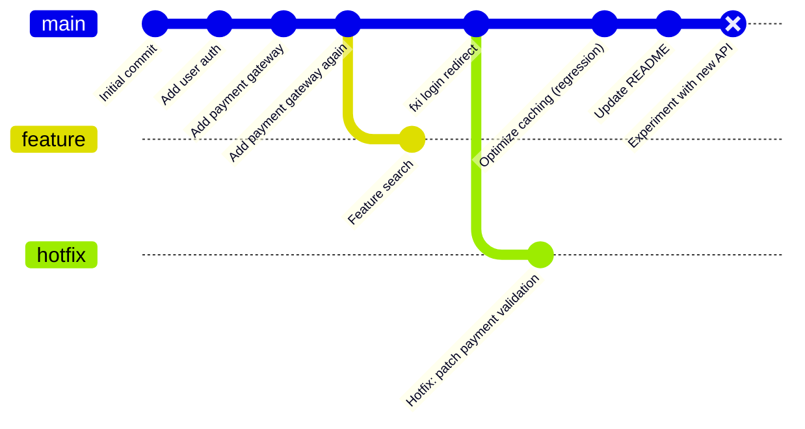
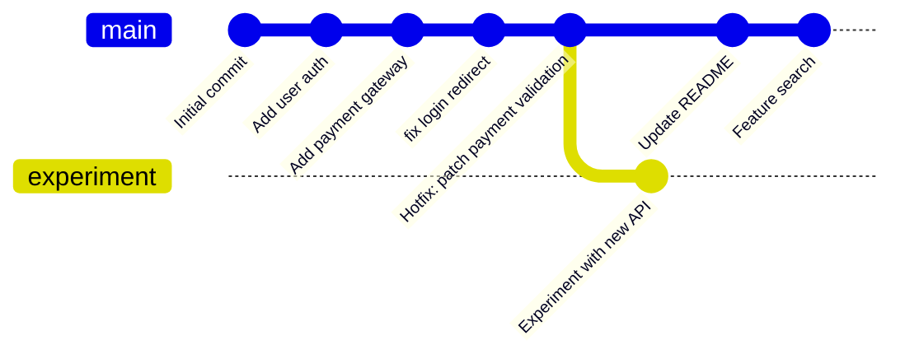

# 综合实战：拯救混乱的历史

> 所属计划: [[git-deep-dive|Git 进阶——从日常使用到底层原理]]
> 预计耗时: 90min
> 前置知识: [[01-git-mental-model]]、[[02-staging-area-mastery]]、[[03-diff-log-history]]、[[04-branch-merge-deep]]、[[05-rebase-core]]、[[06-reflog-undo]]、[[07-cherry-pick-patches]]、[[08-stash-worktree]]、[[09-git-object-model]]、[[10-refs-dag-internals]]、[[11-bisect-regression]]、[[12-tags-submodules-sparse]]

---

## 1. 概念讲解

### 为什么需要这个？

学到这一步，你已经掌握了 Git 的十几把"手术刀"。但真实事故不会按章节顺序发生：一个仓库往往同时存在重复提交、错误 `commit message`、误删分支和隐藏 bug。本节把前 12 节的命令串成一个**引导式救援项目**，让你体验"先定位、再备份、再动手、最后验证"的完整工作流。

### 核心思想

Git 的历史不是石板，而是可重排的 DAG。只要提交还在对象库里（`reflog` 通常能帮你找回来），就总有办法修复。但**编辑历史是带倒车的手术**——每步前先打备份分支，确认结果再删备份。

> [!important] 本节安全守则
> - 在专用练习仓库 `git-rescue-capstone` 中操作，不要碰真实项目。
> - 每步大动作前先 `git branch backup`。
> - 不确定时用 `git reflog` 和 `git reset --hard <旧HEAD>` 回退。

---

## 2. 代码示例

### 事故现场

下面是一个可运行的 Bash 脚本，它会在 `/tmp/git-rescue-capstone` 创建一个故意混乱的仓库。场景包含：

1. `main` 分支上有 3 个重复提交（同一段功能被提交了两次）。
2. 一条 commit message 写错了（把 "fix login" 写成了 "fxi login"）。
3. `feature` 分支从旧基点长出，需要 rebase。
4. `hotfix` 分支上有一个 bugfix 需要被 cherry-pick 到 `main`。
5. `experiment` 分支已被误删，但它最新的提交还在 reflog 里。
6. 某次提交引入了一个让 `./test.sh` 失败的回归 bug。

### 搭建脚本

**运行环境:** Git ≥ 2.40，Bash（Windows 用户建议 Git Bash 或 WSL）。

```bash
#!/usr/bin/env bash
set -euo pipefail

REPO=/tmp/git-rescue-capstone
rm -rf "$REPO"
mkdir -p "$REPO"
cd "$REPO"
git init
git branch -m main
git config user.name "Capstone User"
git config user.email "cap@stone.local"

# 初始提交：创建 app 与一个通过测试
echo 'v1' > app.txt
echo 'echo "PASS"' > test.sh
echo 'exit 0' >> test.sh
chmod +x test.sh
git add app.txt test.sh
git commit -m "Initial commit"

# 正常功能提交
echo 'v2' > app.txt
git add app.txt
git commit -m "Add user auth"

# 重复提交 1/2：先做一次
echo 'v3' > app.txt
git add app.txt
git commit -m "Add payment gateway"

# 重复提交 2/2：同一改动又提交一次（稍后需要 squash）
echo 'v3' > app.txt
echo '# duplicate payment commit' >> app.txt
git add app.txt
git commit -m "Add payment gateway again"

# 错误 message 的提交
echo 'v4' > app.txt
git add app.txt
git commit -m "fxi login redirect"

# 引入回归 bug 的提交：把原本通过的 test.sh 改成失败
echo 'v5' > app.txt
echo 'echo "FAIL: regression"' > test.sh
echo 'exit 1' >> test.sh
git add app.txt test.sh

git commit -m "Optimize caching"

# 正常提交：添加 README
echo '# Rescue Capstone' > README.md

git add README.md
git commit -m "Update README"
# 创建 feature 分支，从旧基点长出（需要 rebase --onto）

git checkout -b feature HEAD~3
# feature: old base -> payment gateway -> payment gateway again
echo 'feature-v1' > feature.txt
git add feature.txt
git commit -m "Feature search"

# 切回 main 并误删 experiment 分支的前置提交
git checkout main
EXPERIMENT_HASH=$(git rev-parse HEAD)
git checkout -b experiment
# experiment 上做一次重要改动
echo 'secret' > experiment.txt
git add experiment.txt
git commit -m "Experiment with new API"
EXPERIMENT_TIP=$(git rev-parse HEAD)
git checkout main

# 模拟误删 experiment 分支
git branch -D experiment

# 创建 hotfix 分支
git checkout -b hotfix HEAD~4

echo 'max_amount=1000' > validation.conf
git add validation.conf
git commit -m "Hotfix: patch payment validation"
# 回到 main 并标记 hotfix tip
HOTFIX_TIP=$(git rev-parse HEAD)
git checkout main

echo "===== Setup complete ====="
echo "REPO: $REPO"
echo "EXPERIMENT_TIP: $EXPERIMENT_TIP"
echo "HOTFIX_TIP: $HOTFIX_TIP"
```

**运行方式:**

```bash
chmod +x setup-accident.sh
./setup-accident.sh
```

**预期输出:**

```text
Initialized empty Git repository in /tmp/git-rescue-capstone/.git/
[main (root-commit) abc1234] Initial commit
[main def5678] Add user auth
...
===== Setup complete =====
REPO: /tmp/git-rescue-capstone
EXPERIMENT_TIP: 1a2b3c4d...
HOTFIX_TIP: 5e6f7a8b...
```

> [!warning]
> 记录脚本打印的 `EXPERIMENT_TIP` 和 `HOTFIX_TIP`，后面任务会用到。如果忘了，也可以用 `git reflog` 找回。

### 初始 DAG 图



### 任务清单与参考命令

下面按**推荐顺序**完成救援。每步先给目标，再展开参考命令。

#### 任务 1：备份当前状态

目标：给 `main` 打一个快照分支 `backup-main`，任何时候都能回退。

> [!tip]- 任务 1 参考答案
> ```bash
> cd /tmp/git-rescue-capstone
> git branch backup-main
> ```

#### 任务 2：合并 `main` 上的重复提交

目标：把 "Add payment gateway again" 和 "Add payment gateway" 合并成一个语义提交。

> 找到两个重复提交中较近的一个（从 `HEAD` 往前数）。
> ```bash
> git log --oneline
> # 确认 "Add payment gateway"、"Add payment gateway again"、"fxi login redirect" 连续出现
> git rebase -i HEAD~5
> ```
> 在编辑器里把 "Add payment gateway again" 前面的 `pick` 改成 `fixup` 或 `squash`，保存退出。

#### 任务 3：修正错误的 commit message

目标：把 "fxi login redirect" 改成 "fix login redirect"。

> [!tip]- 任务 3 参考答案
> 如果它已经被 rebase 后仍然在最上面，用 `reword`：
> ```bash
> git rebase -i HEAD~3
> ```
> 把 "fxi login redirect" 那一行的 `pick` 改成 `reword`，保存；在弹出的编辑器里把标题改成 `fix login redirect`。

#### 任务 4：用 cherry-pick 把 hotfix 接到 main

目标：把 `hotfix` 分支的修复提交复制到 `main`，然后删除 `hotfix`。

> [!tip]- 任务 4 参考答案
> ```bash
> git checkout main
> git cherry-pick hotfix
> git branch -D hotfix
> ```
> 本场景中 `hotfix` 添加了独立的 `validation.conf` 文件，通常能干净 cherry-pick。如果涉及同文件改动，可能需要手动解决冲突。

#### 任务 5：用 bisect 定位回归 bug

目标：找出让 `./test.sh` 输出 `FAIL` 的提交。

> [!tip]- 任务 5 参考答案
> ```bash
> git bisect start
> git bisect bad HEAD          # 当前 main 是坏版本
> git bisect good HEAD~5       # 最初的 "Initial commit" 是好的
> git bisect run ./test.sh
> ```
> Git 会自动二分并停在第一个 bad 提交（通常是 "Optimize caching"）。
> 定位后记得：
> ```bash
> git bisect reset
> ```

#### 任务 6：撤销回归提交

目标：移除 "Optimize caching" 引入的 bug。因为它还未推送，使用 `reset` 或 `rebase --onto` 改写本地历史。

> [!tip]- 任务 6 参考答案
> 方案 A：用交互式 rebase drop：
> ```bash
> git rebase -i HEAD~3
> # 删除 "Optimize caching" 那一行
> ```
> 方案 B：如果该提交在本地历史顶部且只有一个父提交：
> ```bash
> git reset --hard HEAD~1
> # 或更安全的
> git reset --keep HEAD~1
> ```

#### 任务 7：用 rebase --onto 把 feature 分支迁到新基点

目标：`feature` 原本从旧 `main` 长出，现在把它接到清理后的 `main` 顶端。

> [!tip]- 任务 7 参考答案
> ```bash
> git checkout feature
> git rebase --onto main feature~1
> ```
> 这里 `feature~1` 是 `feature` 原来的父提交（旧 `main` 上的 "Add payment gateway again"），`main` 是新基点。

#### 任务 8：用 reflog 找回误删的 experiment 分支

目标：恢复 `experiment` 分支及其最新提交。

> [!tip]- 任务 8 参考答案
> ```bash
> git reflog
> # 找到形如 "commit: Experiment with new API" 的那一行，复制其 hash
> git branch experiment <hash>
> ```
> 也可以用脚本打印的 `EXPERIMENT_TIP`：
> ```bash
> git branch experiment <EXPERIMENT_TIP>
> ```

#### 任务 9：整理 feature 分支并合回 main

目标：把 feature 分支变基到干净的 `main` 后，用 fast-forward 合并。

> [!tip]- 任务 9 参考答案
> ```bash
> git checkout main
> git merge --ff-only feature
> git branch -d feature
> ```

### 完成后的干净历史



**验证清单:**

```bash
# 1. 历史是线性的（没有多余 merge commit）
git log --oneline --graph --all

# 2. test.sh 应输出 PASS（坏提交被移除后，测试回到旧版本）
./test.sh
git branch --all
```

---

## 3. 练习

本节本身就是一整套练习。下面是三个递进变体，供你自选深度。

### 练习 1: 基础救回

在全新的 `git-rescue-capstone` 仓库中，只完成以下子集：

1. 用 `git reflog` 找回误删的 `experiment` 分支。
2. 用 `git cherry-pick` 把 `hotfix` 接到 `main`。
3. 用 `git rebase -i` 把 "Add payment gateway" 和 "Add payment gateway again" 合并。

### 练习 2: 进阶重构

在完成练习 1 的基础上继续：

1. 用 `rebase -i` 的 `reword` 修正 "fxi login redirect"。
2. 用 `git rebase --onto main <old-base> feature` 把 `feature` 迁到清理后的 `main`。
3. 用 `git merge --ff-only feature` 把 `feature` 合并到 `main`，保持线性历史。

### 练习 3: 挑战无提示（可选）

不看参考命令，独立完成整个救援项目，并额外完成：

1. 在整理历史前，用 `git branch rescue-backup` 打一次全局备份；如果任何一步搞砸，用 `git reset --hard rescue-backup` 回到起点。
2. 用 `git bisect run ./test.sh` 自动定位引入 bug 的提交，并解释为什么 `./test.sh` 退出码 `0` 表示 good、`1-124` 表示 bad、`125` 表示 skip。
3. 最终历史必须满足：
   - `main` 是线性历史；
   - 没有 "Add payment gateway again"；
   - "fxi login redirect" 已改正；
   - `hotfix` 已合入 `main` 且原分支已删除；
   - `experiment` 已恢复；
   - `./test.sh` 不再输出 `FAIL`。

---

## 3.5 参考答案

> [!tip]- 练习 1 参考答案
> 参考答案不是唯一解——如果你的实现通过/达到要求就是正确的。
> ```bash
> cd /tmp/git-rescue-capstone
> git branch backup-main
> # 1. 找回 experiment
> git reflog
> git branch experiment <experiment-hash>
> # 2. cherry-pick hotfix
> git checkout main
> git cherry-pick hotfix
> # 3. squash 重复提交
> git rebase -i HEAD~4
> # 把 "Add payment gateway again" 改为 squash/fixup
> ```

> [!tip]- 练习 2 参考答案
> 参考答案不是唯一解——如果你的实现通过/达到要求就是正确的。
> ```bash
> # reword 错误 message
> git rebase -i HEAD~3
> # 把 "fxi login redirect" 行改为 reword
> 
> # 把 feature 迁到新的 main
> git rebase --onto main HEAD~1 feature
> # 这里 HEAD~1 是 feature 原来的父提交
> 
> # ff-only 合并
> git checkout main
> git merge --ff-only feature
> git branch -d feature
> ```

> [!tip]- 练习 3 参考答案（可选）
> 参考答案不是唯一解——如果你的实现通过/达到要求就是正确的。
> ```bash
> # 全局备份
> git checkout main
> git branch rescue-backup
> 
> # 自动 bisect
> git bisect start
> git bisect bad HEAD
> git bisect good <initial-commit-hash>
> git bisect run ./test.sh
> git bisect reset
> 
> # 删除坏提交
> git rebase -i HEAD~3
> # 删除 "Optimize caching" 行
> 
> # 验证
> git log --oneline --graph --all
> ./test.sh
> git branch --all
> ```
> `bisect run` 的退出码约定：脚本返回 `0` 时 Git 认为当前提交是 good；返回 `1-124` 时认为是 bad；返回 `125` 表示当前提交无法测试，跳过。

> [!note] 答案使用方式
> 先独立完成练习，再展开查看参考答案。参考答案不是唯一解——如果你的实现通过了测试或达到了题目要求，就是正确的。

---

## 4. 扩展阅读

- [Pro Git: Rewriting History](https://git-scm.com/book/en/v2/Git-Tools-Rewriting-History)
- [Pro Git: Searching](https://git-scm.com/book/en/v2/Git-Tools-Searching)（`git log -S`、`-G` 等）
- [Git Docs: git-bisect](https://git-scm.com/docs/git-bisect)
- [Git Docs: git-reflog](https://git-scm.com/docs/git-reflog)
- [[05-rebase-core|Rebase 核心技能]]
- [[06-reflog-undo|Reflog 与撤销的艺术]]
- [[07-cherry-pick-patches|Cherry-pick 与补丁]]
- [[11-bisect-regression|Bisect 二分查找回归]]

---

## 常见陷阱

- **在真实仓库里练手**: 这是本节最危险的错误。所有改写历史的命令（`rebase`、`reset --hard`、`filter-branch`）都会影响共享历史。务必在 `/tmp/git-rescue-capstone` 这类一次性仓库中练习。

- **忘记打备份分支**: 交互式 rebase 一旦保存就很难"撤销"到中间某一步。每步大动作前执行 `git branch backup-$(date +%s)` 或 `git branch backup-main`，搞砸了就用 `git reset --hard backup-main`。

- **以为 `reflog` 永远存在**: `reflog` 默认保留不可达对象 30 天、可达对象 90 天。如果仓库被 `git gc --prune=now` 清理过，或对象已过期，误删的提交可能真的消失。救援要趁早。

- **用 `git push --force` 推送整理后的公共分支**: 本节的 rebase/reset 只适合本地历史或自己的 PR 分支。对 `main`、`develop` 等公共分支使用 `--force` 会覆盖他人提交，应使用 `git push --force-with-lease`（详见 [[13-remote-collaboration]]）。

- **bisect 中把 good/bad 方向标反**: 如果 `git bisect good HEAD` 而 `HEAD` 其实是坏的，二分就会往错误方向跑。建议先用 `./test.sh` 手动验证首尾两个提交再进入 bisect。

- **rebase 冲突时慌乱 `--skip`**: `--skip` 会丢弃当前提交的全部改动。冲突时应先 `git status` 查看冲突文件，解决后 `git add .` 再 `git rebase --continue`。
