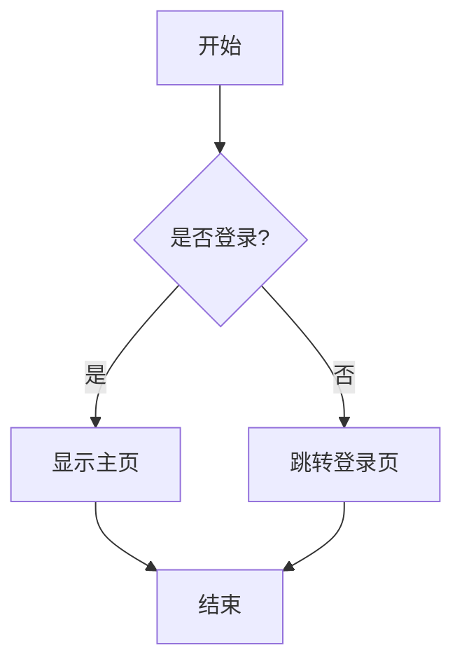
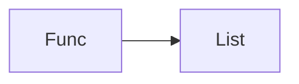

# Mermaid 基础与快速上手

> 所属计划: Mermaid 语法
> 预计耗时: 30min
> 前置知识: 无（熟悉 Markdown 代码块语法即可）

---

## 1. 概念讲解

### 什么是 Mermaid？

Mermaid 是一个**基于文本的图表绘制工具**。你用类似 Markdown 的简洁语法描述图表结构，Mermaid 引擎将其渲染为 SVG 矢量图。

与拖拽式绘图工具（draw.io、Visio、Excalidraw）相比，Mermaid 的核心优势是：

- **文本即图表** — 图表以纯文本存储，可纳入版本控制（Git diff 友好）
- **与 Markdown 深度集成** — 直接嵌入 `.md` 文件，Obsidian / GitHub / GitLab / Notion 原生渲染
- **可维护** — 修改文字比拖拽节点快一个数量级；改一行文本 = 图表自动更新
- **可编程生成** — 可以从代码、数据库、API 动态生成图表

### 为什么需要这个？

技术文档中经常需要画流程图、架构图、时序图。传统方式：

1. 打开 draw.io → 拖拽 → 导出 PNG → 贴入文档
2. 需求变更 → 重新拖拽 → 重新导出 → 重新贴入

Mermaid 方式：在 Markdown 中写几行文本 → 图表自动渲染。改需求只需改文本。

### 你的第一个 Mermaid 图表

在 Obsidian 或任何支持 Mermaid 的编辑器中，输入以下内容：

````markdown

````

这就是一个完整的流程图。`flowchart TD` 表示从上到下（Top-Down）的流程图。

---

## 2. 代码示例

### 支持的环境

Mermaid 已被广泛集成。以下平台**原生支持**，无需安装插件：

| 平台 | 支持方式 |
|------|---------|
| Obsidian | 原生渲染 ` ```mermaid ` 代码块 |
| GitHub | Issues / PR / Markdown 文件中原生渲染 |
| GitLab | 同 GitHub |
| Notion | 输入 `/mermaid` 插入 |
| VS Code | 安装 "Markdown Preview Mermaid Support" 插件 |
| Mermaid Live Editor | 官方在线编辑器 https://mermaid.live |

### Live Editor 上手

官方在线编辑器是最快的实验环境：

1. 打开 https://mermaid.live
2. 左侧输入 Mermaid 语法
3. 右侧实时预览渲染结果
4. 可导出为 SVG / PNG / URL

### 基础语法骨架

所有 Mermaid 图表遵循同一个结构：

```text
```mermaid
<图表类型> [方向]
    <语句1>
    <语句2>
    ...
```
```

- **图表类型**：`flowchart`、`sequenceDiagram`、`classDiagram` 等
- **方向**（流程图专用）：`TD`（上→下）、`LR`（左→右）、`RL`、`BT`
- **语句**：每行一个元素，缩进可选（但推荐保持一致）

### Mermaid 代码块内的字符规则

> [!important] Mermaid DSL 不处理 HTML 实体
> Mermaid 代码块内使用**实际字符**，不要用 `&lt;` `&gt;` 等 HTML 实体。例如写 `Register<T>` 而非 `Register&lt;T&gt;`。

标签含特殊字符（`()` `[]` `{}` `<>` `|` `"`）时用双引号包裹：



---

## 3. 练习

### 练习 1: 第一个流程图

用 Mermaid 画一个"泡面流程"：烧水 → 放面 → 等 3 分钟 → 加调料 → 吃。要求使用 `flowchart TD`，至少 5 个节点。

### 练习 2: 登录流程

用 Mermaid 画一个带判断分支的登录流程：输入账号密码 → 验证 → 成功则进入首页，失败则提示错误并重试（最多 3 次）。用 `flowchart LR`。

### 练习 3: 环境确认（可选）

在 Obsidian 中创建一个笔记，嵌入你练习 1 的 Mermaid 图表，确认能正常渲染。如果无法渲染，检查是否使用了阅读模式。

---

## 3.5 参考答案

> [!tip]- 练习 1 参考答案
> 如果你的实现能正确渲染一个包含 5 个节点的流程图，就是正确的。以下是一种参考写法：
>
> ````markdown
> ```mermaid
> flowchart TD
>     A[烧水] --> B[放入面饼]
>     B --> C[等待 3 分钟]
>     C --> D[加入调料包]
>     D --> E[开吃]
> ```
> ````

> [!tip]- 练习 2 参考答案
> 如果你正确处理了"成功/失败"的分支和"重试计数"的逻辑，就是正确的。以下是一种参考写法：
>
> ````markdown
> ```mermaid
> flowchart LR
>     A[输入账号密码] --> B{验证}
>     B -->|成功| C[进入首页]
>     B -->|失败| D{重试次数 < 3?}
>     D -->|是| A
>     D -->|否| E[锁定账号]
> ```
> ````

> [!tip]- 练习 3 参考答案（可选）
> 在 Obsidian 中切换到**阅读模式**（Ctrl+E / Cmd+E）即可看到 Mermaid 渲染效果。编辑模式下可通过 Live Preview 实时预览。

> [!note] 答案使用方式
> 先独立完成练习，再展开查看参考答案。参考答案不是唯一解——如果你的实现通过了测试或达到了题目要求，就是正确的。

---

## 4. 扩展阅读

- [Mermaid 官方文档](https://mermaid.js.org/intro/)
- [Mermaid Live Editor](https://mermaid.live)
- [Mermaid GitHub 仓库](https://github.com/mermaid-js/mermaid)
- [Obsidian 图表指南](https://help.obsidian.md/Editing+and+formatting/Advanced+formatting+syntax#Diagram)

---

## 常见陷阱

- **忘记写图表类型**：` ```mermaid ` 后面必须紧跟图表类型（如 `flowchart TD`），空行会导致解析失败
- **Mermaid 代码块内用 HTML 实体**：`&lt;T&gt;` 在 Mermaid 中会原样显示，应用 `<T>` 或双引号包裹
- **在编辑模式下看不到渲染**：Obsidian 需切换到阅读模式或开启 Live Preview；GitHub 在 PR 的 Preview 标签页查看
- **缩进不一致导致解析错误**：Mermaid 对缩进不严格要求，但建议保持统一（2 空格或 4 空格），尤其在 subgraph 等嵌套结构中
