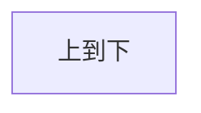
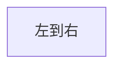
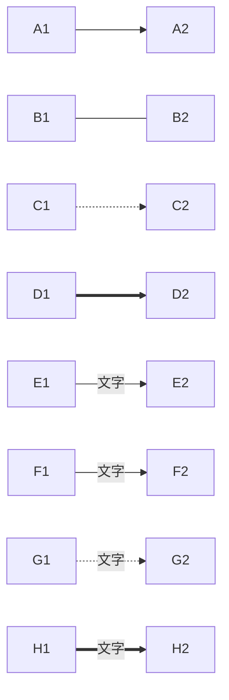
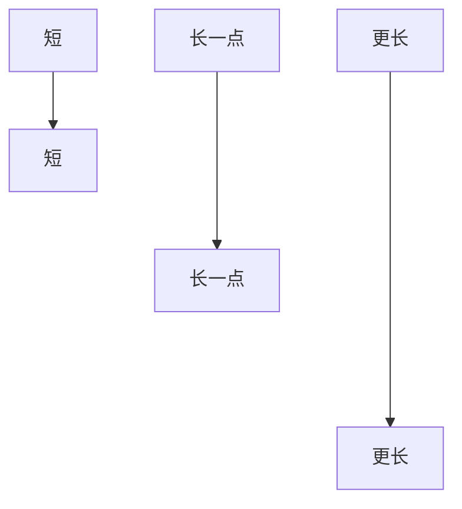
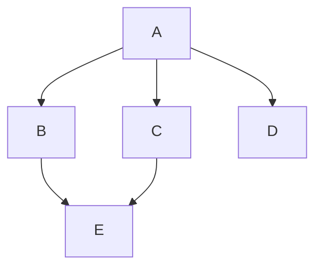
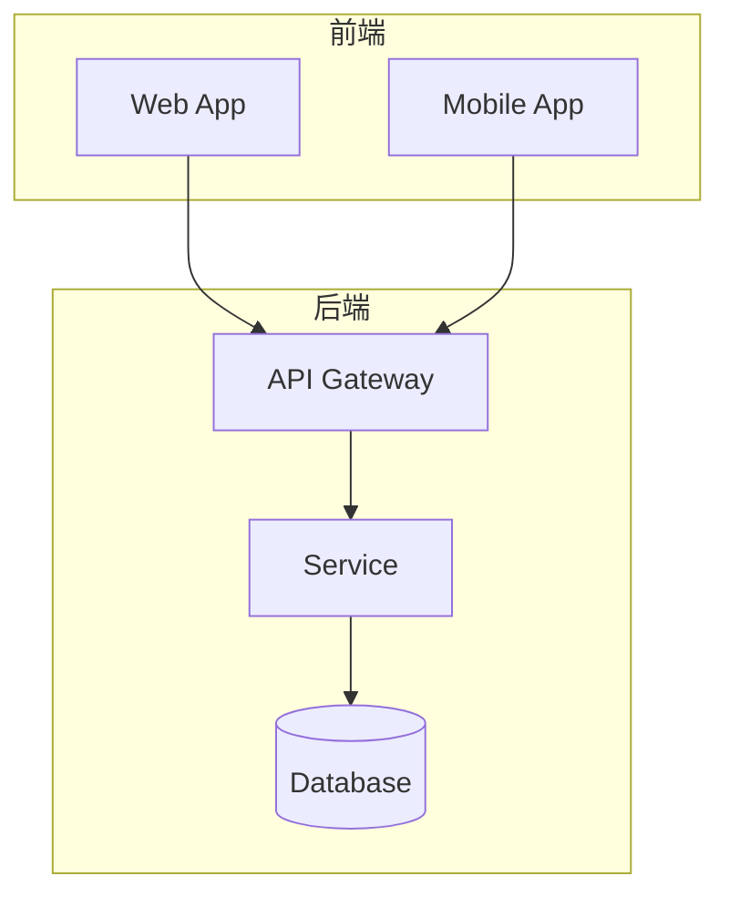
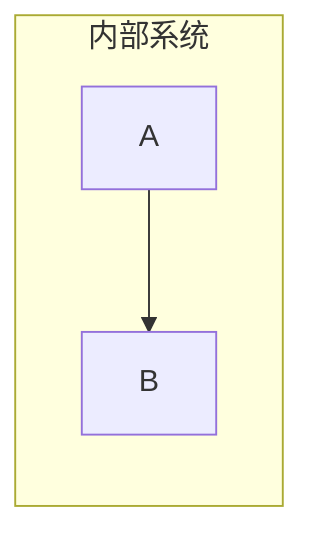
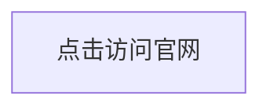

# 流程图 (Flowchart)

> 所属计划: Mermaid 语法
> 预计耗时: 45min
> 前置知识: [[mermaid-syntax 01 - 基础与快速上手]]

---

## 1. 概念讲解

### 为什么流程图是最常用的 Mermaid 图表？

流程图是 Mermaid 中最强大、最灵活、节点形状最多的图表类型。几乎所有"步骤 + 判断"的场景都用流程图表达：

- 业务审批流程
- 算法逻辑
- 系统架构（服务间数据流）
- 用户操作路径
- CI/CD 流水线

### 核心思想

流程图 = **节点（Node）** + **边（Edge）**。节点表示"什么"，边表示"怎么连接"。

Mermaid 通过节点形状的语法糖区分不同类型的节点：方括号 `[]` 是矩形，花括号 `{}` 是菱形（判断），圆括号 `()` 是圆角矩形，等等。

---

## 2. 代码示例

### 方向控制





四种方向：`TD`/`TB`（上→下）、`BT`（下→上）、`LR`（左→右）、`RL`（右→左）。

### 节点形状速查

| 语法 | 形状 | 用途 |
|------|------|------|
| `A[矩形]` | 矩形 | 普通步骤 |
| `A(圆角矩形)` | 圆角矩形 | 开始/结束 |
| `A([体育场形])` | 体育场形 | 子流程 |
| `A[[子程序]]` | 子程序形 | 预定义子程序 |
| `A[(数据库)]` | 圆柱形 | 数据库 |
| `A((圆形))` | 圆形 | 连接点 |
| `A{菱形}` | 菱形 | 判断/分支 |
| `A{{六边形}}` | 六边形 | 准备/初始化 |
| `A[/平行四边形/]` | 平行四边形 | 输入/输出 |
| `A[\平行四边形\]` | 反平行四边形 | 输入/输出(反向) |
| `A[/梯形\]` | 梯形 | 手动操作 |
| `A[\梯形/]` | 倒梯形 | 手动操作(反向) |

### 连接线（边）类型



| 语法 | 含义 |
|------|------|
| `-->` | 实线箭头 |
| `---` | 实线无箭头 |
| `-.->` | 虚线箭头 |
| `==>` | 粗实线箭头 |
| `-- 文字 -->` | 带标签的箭头 |
| `-->|文字|` | 带标签的箭头（另一种写法） |

### 连线长度控制



每多加一个 `-`，连线就变长一点。最少 2 个（`-->`），可以是 `--->`、`---->` 等。

### 多分支与并行



`&` 操作符将多个节点连接到同一个源或目标。

### 子图 (Subgraph)



使用 `subgraph <名称>` 和 `end` 包裹一组节点，自动加上边框和标签。子图内可指定独立方向：



### 节点交互链接



`click <节点ID> "<URL>" "<target>"` 可为节点添加可点击链接。也支持回调函数（需在 HTML 环境中使用）。

---

## 3. 练习

### 练习 1: 审批流程

画一个请假审批流程：

- 员工提交请假申请
- 直属上级审批：通过 → 部门经理审批，不通过 → 驳回
- 部门经理审批：≤3 天自动通过，>3 天 → 总监审批
- 总监审批通过则归档，不通过则驳回

要求至少使用 4 种不同节点形状。

### 练习 2: 微服务架构图

用 `flowchart LR` + `subgraph` 画一个简单的微服务架构：

- 客户端层：Web、Mobile
- 网关层：API Gateway
- 服务层：User Service、Order Service、Payment Service
- 数据层：User DB、Order DB

要求调用关系用箭头表示。

### 练习 3: CI/CD 流水线（可选）

画一个 CI/CD 流水线：代码推送 → 构建 → 单元测试 → 集成测试 → 部署到 Staging → 手动审批 → 部署到 Production。使用子图区分"自动阶段"和"人工阶段"。

---

## 3.5 参考答案

> [!tip]- 练习 1 参考答案
> 如果你的实现包含了所有决策分支和至少 4 种节点形状，就是正确的。以下是一种参考写法：
>
> ````markdown
> ```mermaid
> flowchart TD
>     A([员工提交请假申请]) --> B{直属上级审批}
>     B -->|通过| C{部门经理审批}
>     B -->|不通过| F[驳回]
>     C -->|≤3 天| D[自动通过]
>     C -->|>3 天| E{总监审批}
>     E -->|通过| G[(归档)]
>     E -->|不通过| F
>     D --> G
> ```
> ````

> [!tip]- 练习 2 参考答案
> 如果你的实现用 subgraph 正确分出了各层且箭头表示了调用方向，就是正确的。以下是一种参考写法：
>
> ````markdown
> ```mermaid
> flowchart LR
>     subgraph 客户端
>         W[Web]
>         M[Mobile]
>     end
>     subgraph 网关
>         G[API Gateway]
>     end
>     subgraph 服务层
>         U[User Service]
>         O[Order Service]
>         P[Payment Service]
>     end
>     subgraph 数据层
>         UD[(User DB)]
>         OD[(Order DB)]
>     end
>     W --> G
>     M --> G
>     G --> U
>     G --> O
>     G --> P
>     U --> UD
>     O --> OD
>     P --> OD
> ```
> ````

> [!tip]- 练习 3 参考答案（可选）
> ````markdown
> ```mermaid
> flowchart TD
>     subgraph 自动阶段
>         A[代码推送] --> B[构建]
>         B --> C[单元测试]
>         C --> D[集成测试]
>         D --> E[部署 Staging]
>     end
>     subgraph 人工阶段
>         E --> F{手动审批}
>         F -->|通过| G[部署 Production]
>         F -->|驳回| H[通知开发者]
>     end
> ```
> ````

> [!note] 答案使用方式
> 先独立完成练习，再展开查看参考答案。参考答案不是唯一解——如果你的实现通过了测试或达到了题目要求，就是正确的。

---

## 4. 扩展阅读

- [Mermaid Flowchart 官方文档](https://mermaid.js.org/syntax/flowchart.html)
- [Mermaid Live Editor — 实验节点形状](https://mermaid.live)

---

## 常见陷阱

- **箭头长度太短导致渲染重叠**：当节点文字较长时，适当增加箭头长度（`---->` 代替 `-->`）
- **子图内的 `direction` 写在第一行**：`direction` 语句必须是子图内的第一条语句，否则被忽略或被解析为节点 ID
- **节点 ID 含空格或特殊字符**：节点 ID 只能是字母、数字、下划线，不含空格。ID 后的方括号内是显示标签，可以含任意字符
- **混淆 `{}` 和 `{{}}`**：单花括号 `{}` = 菱形（判断），双花括号 `{{}}` = 六边形（准备/初始化）
- **`&` 多分支语法需要 Mermaid 10.x+**：老版本不支持 `A --> B & C`，需写为 `A --> B` 和 `A --> C` 两行
