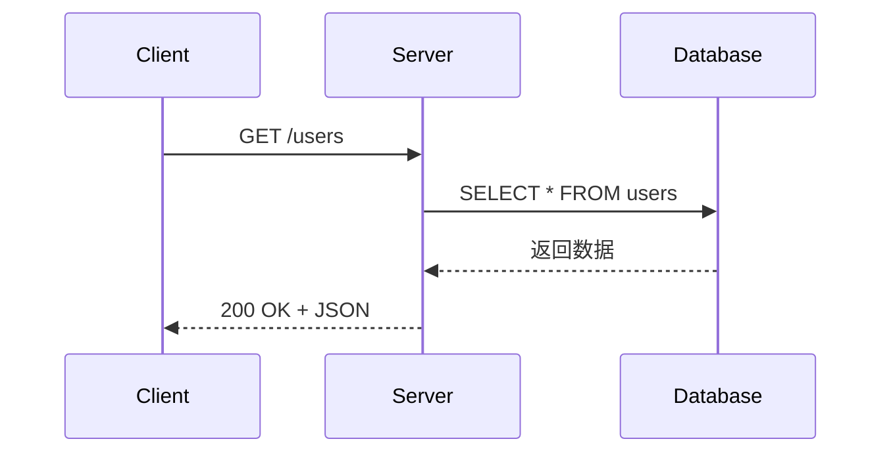
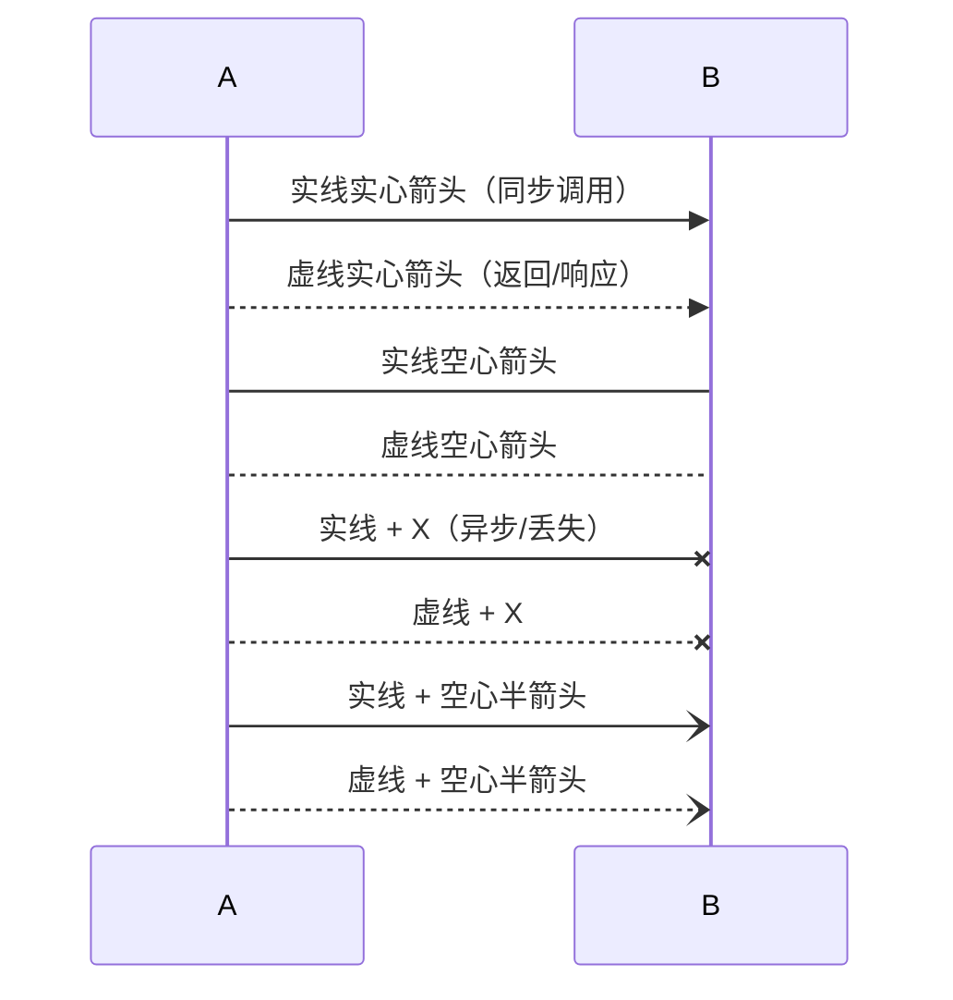
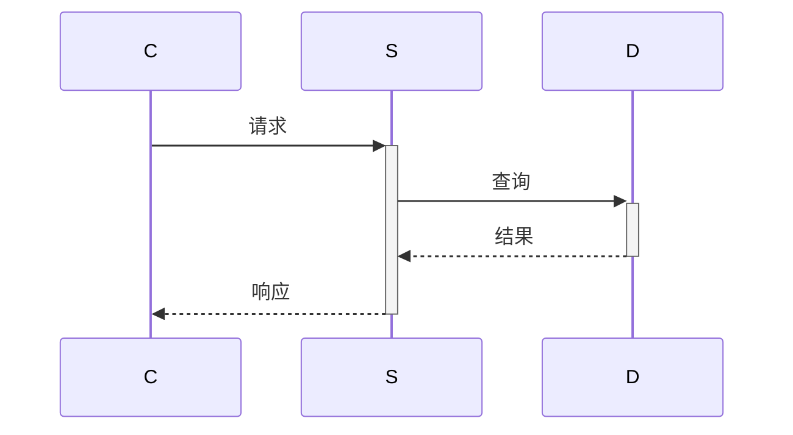
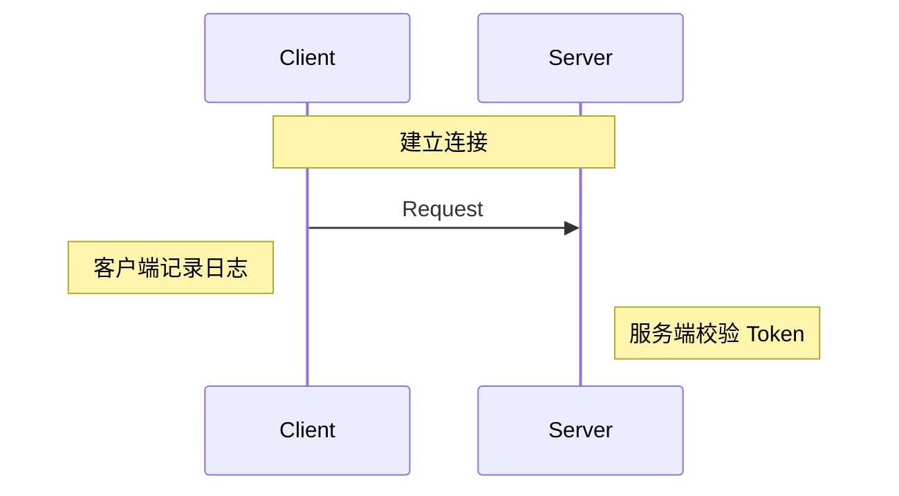
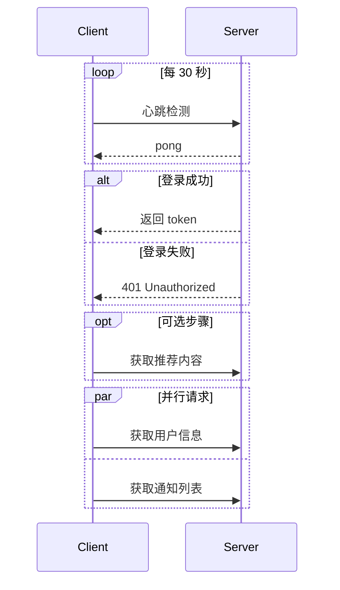
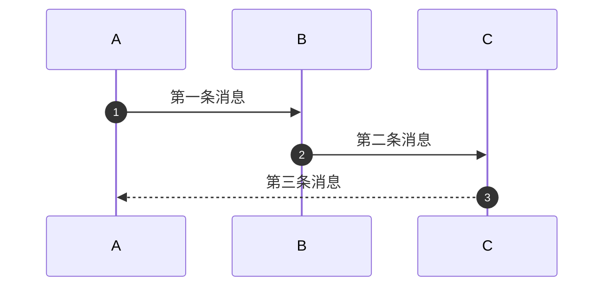

# 时序图 (Sequence Diagram)

> 所属计划: Mermaid 语法
> 预计耗时: 45min
> 前置知识: [[mermaid-syntax 01 - 基础与快速上手]]

---

## 1. 概念讲解

### 什么是时序图？

时序图描述**参与者（Participant）之间按时间顺序发生的消息交互**。它回答"谁在什么时候给谁发了什么消息，对方怎么回应"。

适用场景：

- API 调用链：客户端 → 网关 → 服务 → 数据库
- 认证流程：OAuth2.0 各方的 token 交换
- 网络协议：TCP 三次握手、TLS 握手
- 事件驱动架构：消息队列的发布与消费

### 核心思想

时序图 = **参与者（竖线/生命线）** + **消息（横箭头）**。时间从上到下流动。箭头方向表示消息发送方→接收方，箭头样式表示消息类型。

---

## 2. 代码示例

### 基本结构



- `participant <别名> as <显示名>` 声明参与者
- 不声明也可直接用，Mermaid 自动按首次出现顺序排列

### 消息箭头类型



> [!tip] 常用箭头
> 日常最常用的是 `->>`（请求）和 `-->>`（响应），足以覆盖大部分场景。

### 激活与停用

`+` 和 `-` 表示生命线的激活/停用（方法调用栈）：



`+` 激活目标，`-` 停用当前激活。可以嵌套多层（框架调用→库调用→系统调用）。

### 备注 (Note)



- `Note over <参与者>` — 横跨指定参与者的备注
- `Note left of / right of <参与者>` — 在参与者左侧/右侧的备注
- `Note over A,B` — 横跨 A 和 B

### 循环与条件分支



| 关键字 | 含义 |
|--------|------|
| `loop [描述]` | 循环 |
| `alt ... else ... end` | 条件分支 |
| `opt [描述]` | 可选步骤 |
| `par ... and ... end` | 并行执行 |
| `critical ... end` | 临界区 |
| `break ... end` | 提前退出 |

### 自动编号



`autonumber` 为每条消息自动分配序号，便于在正文中引用（"如第 3 步所示……"）。

### 创建与销毁参与者

```mermaid
sequenceDiagram
    participant M as Main
    M ->> +S: new Service()
    create participant S as Service
    M ->> S: doWork()
    S -->> -M: done
    destroy S
    M ->> M: S 已销毁
```

`create participant` 和 `destroy` 用于表达参与者生命周期的开始与结束。

---

## 3. 练习

### 练习 1: OAuth 2.0 授权码流程

用时序图画出 OAuth 2.0 授权码模式（Authorization Code）的完整交互：

1. 用户 → 客户端：发起登录
2. 客户端 → 授权服务器：重定向授权请求
3. 用户 → 授权服务器：输入凭据并授权
4. 授权服务器 → 客户端：返回授权码
5. 客户端 → 授权服务器：用授权码换 token
6. 授权服务器 → 客户端：返回 access_token + refresh_token
7. 客户端 → 资源服务器：携带 token 请求资源
8. 资源服务器 → 客户端：返回资源

至少使用 4 种不同箭头类型和 2 个 Note。

### 练习 2: TCP 三次握手 + 四次挥手

用时序图画出 TCP 连接的建立和关闭过程。使用 `loop` 和 `alt` 表达重传逻辑。用 `autonumber` 为步骤编号。

### 练习 3: 支付回调（可选）

画一个第三方支付回调的时序图，需包含：用户在商户下单 → 跳转支付平台 → 支付成功 → 支付平台异步通知商户 → 商户返回确认 → 商户更新订单状态。使用 `par` 表达用户同时收到支付平台和商户的双重通知。

---

## 3.5 参考答案

> [!tip]- 练习 1 参考答案
> 如果你的实现覆盖了 8 个步骤、使用了多种箭头和 Note，就是正确的。以下是一种参考写法：
>
> ````markdown
> ```mermaid
> sequenceDiagram
>     actor U as 用户
>     participant C as 客户端
>     participant A as 授权服务器
>     participant R as 资源服务器
>
>     U ->> C: 点击登录
>     C ->> A: 重定向 /authorize
>     Note over U,A: 用户在授权页面输入凭据
>     U ->> A: 输入凭据并授权
>     A -->> C: redirect_uri?code=xxx
>     C ->> +A: POST /token (code)
>     A -->> -C: {access_token, refresh_token}
>     C ->> R: GET /user (Authorization: Bearer xxx)
>     R -->> C: 用户数据 JSON
>     Note left of C: 登录成功，显示主页
> ```
> ````

> [!tip]- 练习 2 参考答案
> ````markdown
> ```mermaid
> sequenceDiagram
>     autonumber
>     participant C as Client
>     participant S as Server
>
>     Note over C,S: TCP 三次握手
>     C ->> S: SYN (seq=x)
>     S -->> C: SYN-ACK (seq=y, ack=x+1)
>     C ->> S: ACK (ack=y+1)
>     Note over C,S: 连接建立，开始传输数据
>
>     Note over C,S: TCP 四次挥手
>     C ->> S: FIN (seq=u)
>     S -->> C: ACK (ack=u+1)
>     S ->> C: FIN (seq=v)
>     C -->> S: ACK (ack=v+1)
>     Note over C,S: 连接关闭
> ```
> ````

> [!tip]- 练习 3 参考答案（可选）
> ````markdown
> ```mermaid
> sequenceDiagram
>     actor U as 用户
>     participant M as 商户
>     participant P as 支付平台
>
>     U ->> M: 下单
>     M -->> U: 订单号 + 跳转链接
>     U ->> P: 跳转支付页
>     U ->> P: 输入密码确认支付
>     P -->> U: 支付成功页
>     P --x M: 异步通知(支付结果)
>     M -->> P: 确认收到通知
>     par 双通知
>         M ->> U: 推送/短信 通知发货
>     and
>         P -->> U: 支付成功消息
>     end
> ```
> ````

> [!note] 答案使用方式
> 先独立完成练习，再展开查看参考答案。参考答案不是唯一解——如果你的实现通过了测试或达到了题目要求，就是正确的。

---

## 4. 扩展阅读

- [Mermaid Sequence Diagram 官方文档](https://mermaid.js.org/syntax/sequenceDiagram.html)
- [OAuth 2.0 时序图示例](https://mermaid.js.org/syntax/sequenceDiagram.html#examples)
- [WebSequenceDiagrams — 另一种文本时序图工具](https://www.websequencediagrams.com/)

---

## 常见陷阱

- **忘记声明参与者**：直接使用 `A ->> B` 时 Mermaid 会自动创建参与者，但显示名等同于 ID。建议用 `participant A as 中文名` 显式声明
- **`activate`/`deactivate` 语法已弃用**：应使用 `+`/`-` 简写。`activate B`、`deactivate B` 是旧语法，Mermaid 10+ 推荐直接在箭头上标注
- **`autonumber` 在 `par` 块内编号可能不按预期**：并行块内的消息编号行为依赖 Mermaid 版本，新版处理更好
- **箭头 `-->>` 与 `-->` 混淆**：`-->>` 是两个短线 + 尖头，`-->` 是两个短线 + 三角头，视觉差异明显——前者是实心箭头（常用），后者是空心箭头
- **Note 位置不生效**：确保 `left of` / `right of` / `over` 后的参与者 ID 已声明且拼写正确
