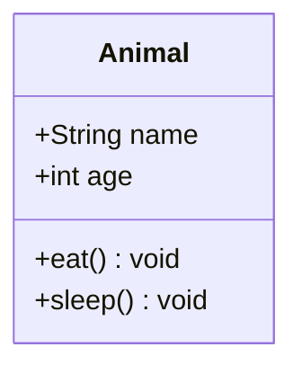
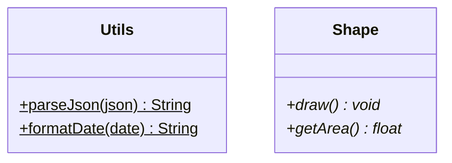
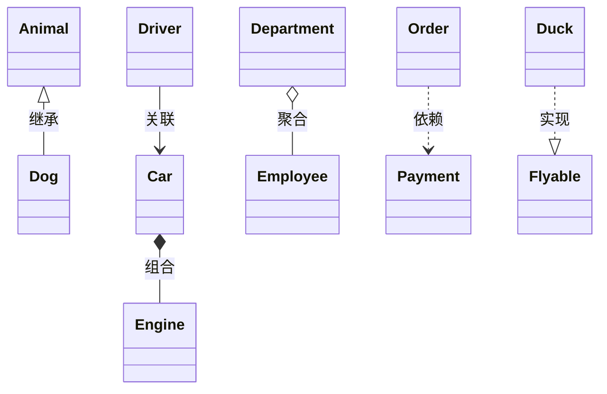
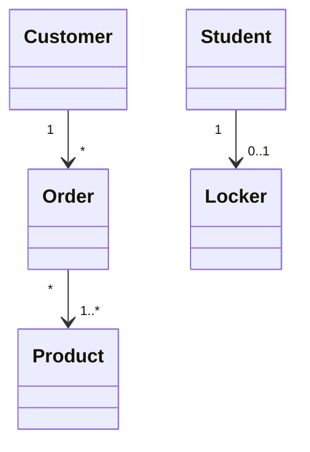
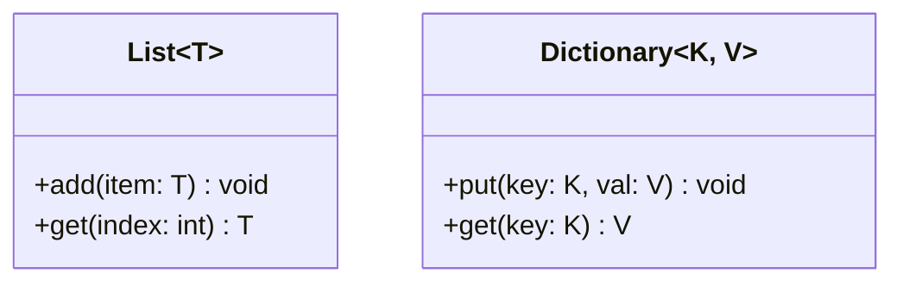
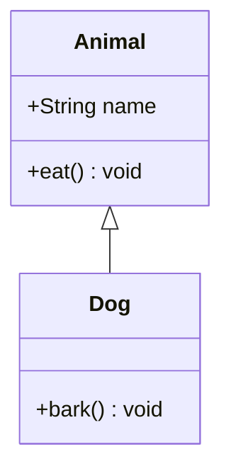

# 类图 (Class Diagram)

> 所属计划: Mermaid 语法
> 预计耗时: 45min
> 前置知识: [[mermaid-syntax 01 - 基础与快速上手]]

---

## 1. 概念讲解

### 什么是类图？

类图是 UML（统一建模语言）中最核心的图，描述系统中的**类、接口、以及它们之间的静态关系**。

适用场景：

- 面向对象设计文档：类结构、继承链、接口实现
- 数据库设计：实体关系（也常用 ER 图，见第 6 节）
- 设计模式说明：画类之间的关系比文字更直观
- 代码评审：用类图快速传达架构意图

### 核心思想

类图 = **类的定义（属性 + 方法）** + **类之间的关系线**。Mermaid 的 `classDiagram` 语法极简，专注于表达"谁有什么成员"和"谁和谁是什么关系"。

---

## 2. 代码示例

### 基本类定义



#### 可见性标记

| 标记 | 含义 |
|------|------|
| `+` | Public |
| `-` | Private |
| `#` | Protected |
| `~` | Package / Internal |

#### 附加标记

| 标记 | 含义 |
|------|------|
| `$` | Static（加在方法名后） |
| `*` | Abstract（加在方法名后） |



### 类之间的关系



| 箭头 | 中文名 | 英文名 | 含义 |
|------|--------|--------|------|
| `<\|--` | 继承 | Inheritance | "是"关系 |
| `*--` | 组合 | Composition | 强整体-部分，同生命周期 |
| `o--` | 聚合 | Aggregation | 弱整体-部分，独立生命周期 |
| `-->` | 关联 | Association | 使用/知道关系 |
| `..>` | 依赖 | Dependency | 临时使用关系 |
| `<\|..` | 实现 | Realization | 接口实现 |
| `--` | 实线 | Solid | 无箭头实线 |

关系线上的 `: 标签` 是可选的说明文字。

### 关系的基数（多重性）



基数写在关系两端的引号内：

| 标记 | 含义 |
|------|------|
| `"1"` | 恰好 1 个 |
| `"0..1"` | 0 或 1 个 |
| `"1..*"` | 至少 1 个 |
| `"*"` | 0 个或多个 |
| `"n"` | 恰好 n 个 |

### 泛型 — 特殊语法

> [!warning] `classDiagram` 中泛型必须用 `~`
> 与其他图表不同，`classDiagram` 使用 `~` 而非 `< >` 表示泛型参数。



嵌套泛型：`Stack~TreeNode~T~~` → 渲染为 `Stack<TreeNode<T>>`。

### 注解与备注

```mermaid
classDiagram
    class Order {
        +String id
        +Date createdAt
    }
    <<Entity>> Order
    <<Service>> PaymentService

    note for Order "核心领域对象，\n对应 orders 表"
    note "所有价格以美分为单位" as PriceNote
```

- `<<Annotation>>` 为类添加 `<< >>` 装饰标注
- `note for <类名> "内容"` 为指定类添加备注
- `note "内容" as <别名>` 创建独立备注

### 简写语法

不需要为每个类写完整的 `class ... { }` 块。可以直接定义关系和成员：



---

## 3. 练习

### 练习 1: 在线书店

为一个在线书店系统画类图，至少包含以下类：

- `User`（用户）：id, name, email
- `Order`（订单）：id, items, total, createdAt
- `Product`（商品）：id, name, price, stock
- `Category`（分类）：id, name

关系：User 1 → * Order，Order * → * Product，Product * → 1 Category。

### 练习 2: 设计模式 — 观察者模式

用类图画一个观察者模式（Observer Pattern）：

- `Subject` 接口：`attach(o: Observer)`, `detach(o: Observer)`, `notify()`
- `Observer` 接口：`update()`
- `ConcreteSubject` 实现 `Subject`
- `ConcreteObserver` 实现 `Observer`

使用正确的实现箭头 `<|..` 表示接口实现。

### 练习 3: 泛型容器（可选）

画一个泛型数据结构的类层次：

- `Collection<T>` 接口含 `add(item: T)`, `remove(item: T)`（用 `<<interface>>`）
- `List<T>` 实现 `Collection<T>`
- `Set<T>` 实现 `Collection<T>`
- `SortedSet<T>` 继承 `Set<T>`（用泛型嵌套 `SortedSet~TreeNode~T~~`）

---

## 3.5 参考答案

> [!tip]- 练习 1 参考答案
> 如果你的实现覆盖了所有 4 个类、正确的属性和关系及基数，就是正确的。以下是一种参考写法：
>
> ````markdown
> ```mermaid
> classDiagram
>     class User {
>         +String id
>         +String name
>         +String email
>     }
>     class Order {
>         +String id
>         +String[] items
>         +float total
>         +Date createdAt
>     }
>     class Product {
>         +String id
>         +String name
>         +float price
>         +int stock
>     }
>     class Category {
>         +String id
>         +String name
>     }
>     User "1" --> "*" Order
>     Order "*" --> "*" Product
>     Product "*" --> "1" Category
> ```
> ````

> [!tip]- 练习 2 参考答案
> 如果你正确区分了继承（`<|--`）和实现（`<|..`），并在接口类上使用了 `<<interface>>`，就是正确的。以下是一种参考写法：
>
> ````markdown
> ```mermaid
> classDiagram
>     class Subject {
>         <<interface>>
>         +attach(o: Observer)
>         +detach(o: Observer)
>         +notify()
>     }
>     class Observer {
>         <<interface>>
>         +update()
>     }
>     class ConcreteSubject {
>         -state: String
>         +getState() String
>         +setState(s: String)
>     }
>     class ConcreteObserver {
>         -subject: Subject
>         +update()
>     }
>     Subject <|.. ConcreteSubject
>     Observer <|.. ConcreteObserver
>     ConcreteSubject --> Observer : notifies
> ```
> ````

> [!tip]- 练习 3 参考答案（可选）
> ````markdown
> ```mermaid
> classDiagram
>     class Collection~T~ {
>         <<interface>>
>         +add(item: T) void
>         +remove(item: T) void
>     }
>     class List~T~ {
>         +get(index: int) T
>     }
>     class Set~T~ {
>         +contains(item: T) bool
>     }
>     class SortedSet~TreeNode~T~~ {
>         +first() T
>         +last() T
>     }
>     Collection~T~ <|.. List~T~
>     Collection~T~ <|.. Set~T~
>     Set~T~ <|-- SortedSet~TreeNode~T~~
> ```
> ````

> [!note] 答案使用方式
> 先独立完成练习，再展开查看参考答案。参考答案不是唯一解——如果你的实现通过了测试或达到了题目要求，就是正确的。

---

## 4. 扩展阅读

- [Mermaid Class Diagram 官方文档](https://mermaid.js.org/syntax/classDiagram.html)
- [UML 类图关系速查](https://www.uml-diagrams.org/class-reference.html)

---

## 常见陷阱

- **`classDiagram` 泛型不用 `<T>`**：必须用 `~T~`，否则 Mermaid 将 `<T>` 误解析为 HTML
- **继承 vs 实现箭头相反**：`A <|-- B` 表示 B 继承 A（箭头指向父类）。`A <|.. B` 表示 B 实现 A。终结点始终指向更抽象的那一方
- **组合 vs 聚合选错**：组合（`*--`）是同生命周期（引擎属于汽车，汽车毁了引擎也没了）；聚合（`o--`）是独立生命周期（员工属于部门，部门撤销员工还在）
- **可见性标记位置**：`+foo()$` 中 `$` 必须在括号后面，`+foo()*` 中 `*` 也在后面。`$` 和 `*` 同时使用时 `$` 在前：`+foo()$*`
- **关系线上写中文**：`A --> B : 使用` 是合法的，但复杂中文关系描述建议用 `note` 代替
