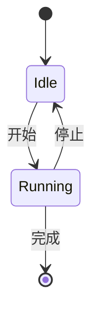
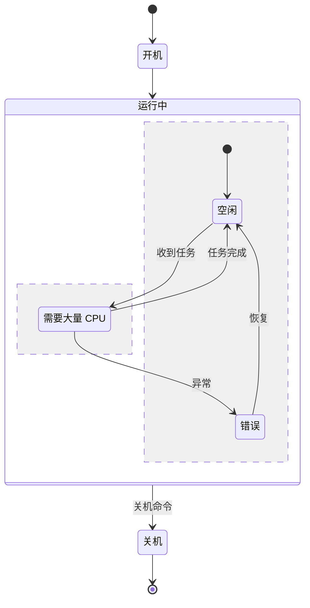
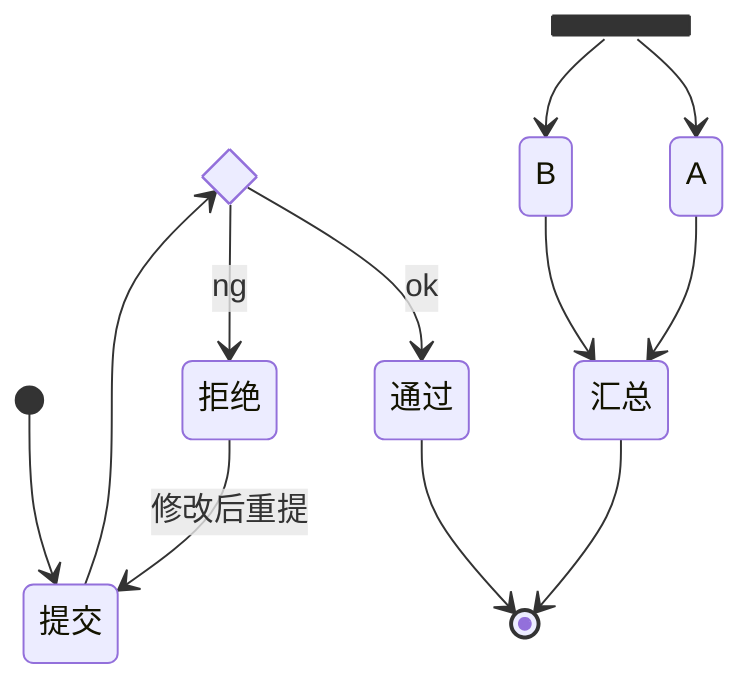
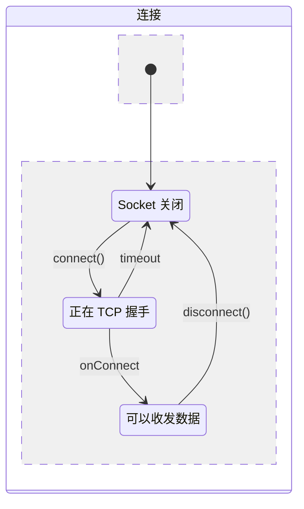
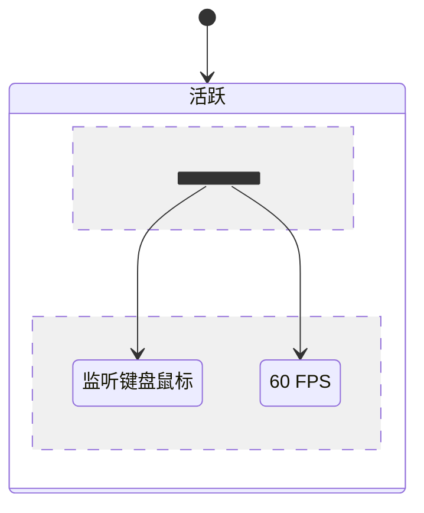
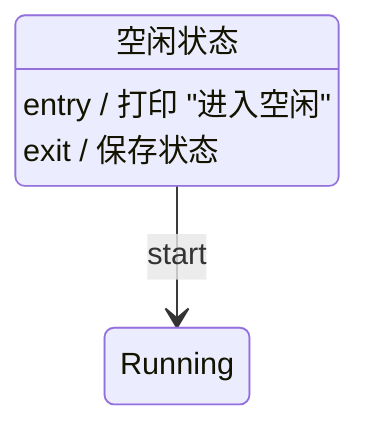

# 状态图 (State Diagram)

> 所属计划: Mermaid 语法
> 预计耗时: 40min
> 前置知识: [[mermaid-syntax 01 - 基础与快速上手]]

---

## 1. 概念讲解

### 什么是状态图？

状态图（State Diagram / State Machine）描述一个系统或对象**有哪些状态、在什么条件下发生状态转移、转移时触发什么动作**。

适用场景：

- 订单生命周期：待支付 → 已支付 → 已发货 → 已完成
- 用户认证状态：未登录 → 登录中 → 已登录 → 令牌过期
- 游戏角色状态：Idle → Running → Jumping → Attacking
- 网络连接：CLOSED → LISTEN → ESTABLISHED → CLOSE_WAIT
- 工单流转：新建 → 处理中 → 待审核 → 已关闭

### 核心思想

状态图 = **状态（节点）** + **转移（箭头）**。状态回答"现在是什么"，转移回答"什么时候变成什么"。

Mermaid 使用 `stateDiagram-v2`（版本 2）作为图表类型标识。

---

## 2. 代码示例

### 最简单的状态机



- `[*]` 是特殊状态：起始点（实心圆）和终止点（实心圆 + 外圈）
- `状态A --> 状态B : 描述`：转移线，描述文字可选

### 复合状态（Composite State）



- `state <状态名> { ... }` 定义复合状态，内含子状态
- `[*]` 在复合状态内表示该复合状态的初始子状态
- `--` 是分隔线，`状态名 : 描述` 是状态的备注
- **复合状态语法是简写**：`state 运行中 { [*] --> 空闲 }` 实际定义了一个名为 `运行中` 的状态，其内部有一个从 `[*]` 到 `空闲` 的转移。Mermaid 自动处理嵌套布局

### 选择节点（Choice）与分叉/汇合（Fork/Join）



- `<<choice>>`：选择节点，表示条件分支
- `<<fork>>`：分叉节点，一个状态同时转移到多个状态
- `<<join>>`：汇合节点，多个状态完成后汇聚
- `<<end>>`：终止节点

### 状态内描述



`state <状态名> { ... }` 内部用 `--` 分隔转移线与状态描述。`状态名 : 描述文字` 写在 `--` 之下。

### 并发状态



使用 `<<fork>>` 进入并发区域，多个子状态同时活跃。

### 进入/退出动作



`entry / <动作>` 和 `exit / <动作>` 定义进入和退出状态的钩子——在状态被激活/离开时触发。

---

## 3. 练习

### 练习 1: 订单生命周期

画一个电商订单的生命周期状态图：

- 初始 → 待支付
- 待支付 → 已支付（用户付款）
- 待支付 → 已取消（超时或用户取消）
- 已支付 → 已发货（商家发货）
- 已发货 → 已完成（用户确认收货）
- 已发货 → 退货中（用户申请退货）
- 退货中 → 已退款（商家确认退款）
- 已退款 → [*]
- 已完成 → [*]
- 已取消 → [*]

### 练习 2: TCP 连接状态（简化）

画 TCP 连接状态的简化版状态图：

- CLOSED → LISTEN（被动打开）
- CLOSED → SYN_SENT（主动打开）
- LISTEN → SYN_RCVD（收到 SYN）
- SYN_RCVD → ESTABLISHED（收到 ACK）
- SYN_SENT → ESTABLISHED（收到 SYN+ACK）
- ESTABLISHED → FIN_WAIT_1（主动关闭）
- ESTABLISHED → CLOSE_WAIT（收到 FIN）
- CLOSE_WAIT → LAST_ACK（发送 FIN）
- FIN_WAIT_1 → FIN_WAIT_2（收到 ACK）
- FIN_WAIT_2 → TIME_WAIT（收到 FIN）
- LAST_ACK → CLOSED（收到 ACK）
- TIME_WAIT → CLOSED（超时）

使用复合状态把"连接中"（从 LISTEN/SYN_SENT 到 ESTABLISHED）和"关闭中"（从 FIN_WAIT_1/CLOSE_WAIT 到 CLOSED）分组。

### 练习 3: 电梯控制（可选）

画一个简化电梯状态图：

- 空闲 → 上行（有上行请求）
- 空闲 → 下行（有下行请求）
- 上行 → 空闲（到达目标楼层且无同向请求）
- 下行 → 空闲（同）

使用复合状态 `state 运行中 { ... }` 包裹上行和下行，表示这两个状态是"运行中"的子状态。

---

## 3.5 参考答案

> [!tip]- 练习 1 参考答案
> 如果你的实现覆盖了所有状态和转移关系，就是正确的。以下是一种参考写法：
>
> ````markdown
> ```mermaid
> stateDiagram-v2
>     [*] --> 待支付
>     待支付 --> 已支付 : 用户付款
>     待支付 --> 已取消 : 超时 / 用户取消
>     已支付 --> 已发货 : 商家发货
>     已发货 --> 已完成 : 用户确认收货
>     已发货 --> 退货中 : 用户申请退货
>     退货中 --> 已退款 : 商家确认退款
>     已退款 --> [*]
>     已完成 --> [*]
>     已取消 --> [*]
> ```
> ````

> [!tip]- 练习 2 参考答案
> 如果你的实现覆盖了所有 TCP 状态转移并用复合状态分组，就是正确的。以下是一种参考写法：
>
> ````markdown
> ```mermaid
> stateDiagram-v2
>     [*] --> CLOSED
>
>     state 建立连接 {
>         [*] --> LISTEN
>         [*] --> SYN_SENT
>         LISTEN --> SYN_RCVD : 收到 SYN
>         SYN_RCVD --> ESTABLISHED : 收到 ACK
>         SYN_SENT --> ESTABLISHED : 收到 SYN+ACK
>     }
>
>     CLOSED --> 建立连接 : 被动打开
>     CLOSED --> 建立连接 : 主动打开 (SYN_SENT)
>     建立连接 --> ESTABLISHED
>
>     state 关闭连接 {
>         ESTABLISHED --> FIN_WAIT_1 : 主动关闭
>         FIN_WAIT_1 --> FIN_WAIT_2 : 收到 ACK
>         FIN_WAIT_2 --> TIME_WAIT : 收到 FIN
>         TIME_WAIT --> CLOSED : 超时
>         --
>         ESTABLISHED --> CLOSE_WAIT : 收到 FIN
>         CLOSE_WAIT --> LAST_ACK : 发送 FIN
>         LAST_ACK --> CLOSED : 收到 ACK
>     }
>
>     ESTABLISHED --> 关闭连接
>     CLOSED --> [*]
> ```
> ````

> [!tip]- 练习 3 参考答案（可选）
> ````markdown
> ```mermaid
> stateDiagram-v2
>     [*] --> 空闲
>     state 运行中 {
>         [*] --> 上行
>         [*] --> 下行
>         上行 --> [*] : 无同向请求
>         下行 --> [*] : 无同向请求
>     }
>     空闲 --> 运行中 : 有上行请求
>     空闲 --> 运行中 : 有下行请求
>     运行中 --> 空闲
> ```
> ````

> [!note] 答案使用方式
> 先独立完成练习，再展开查看参考答案。参考答案不是唯一解——如果你的实现通过了测试或达到了题目要求，就是正确的。

---

## 4. 扩展阅读

- [Mermaid State Diagram 官方文档](https://mermaid.js.org/syntax/stateDiagram.html)
- [UML 状态机图](https://www.uml-diagrams.org/state-machine-diagrams.html)

---

## 常见陷阱

- **忘记 `[*]` 表示起点**：没有 `[*] --> 某状态` 的状态图会渲染但没有视觉起点
- **复合状态内的 `[*]` 易混淆**：复合状态内部的 `[*]` 表示进入该复合状态后的初始子状态，不是全局起始
- **`<<fork>>` 和 `<<choice>>` 的区别**：`fork` 用于并发（多个状态同时激活），`choice` 用于分支（根据条件选择一个）
- **中文状态名 + 特殊字符**：状态名含空格或中文时不需要引号，但含 `()` `[]` `{}` 时需引号包裹
- **`stateDiagram` vs `stateDiagram-v2`**：始终用 `stateDiagram-v2`，v1 已弃用且功能更少
