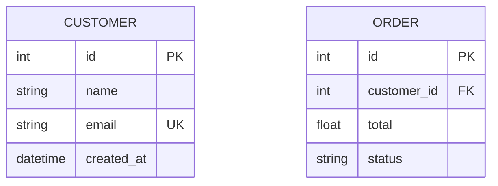
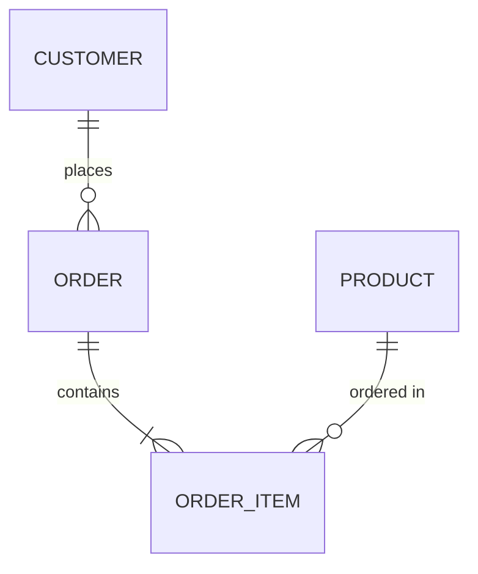
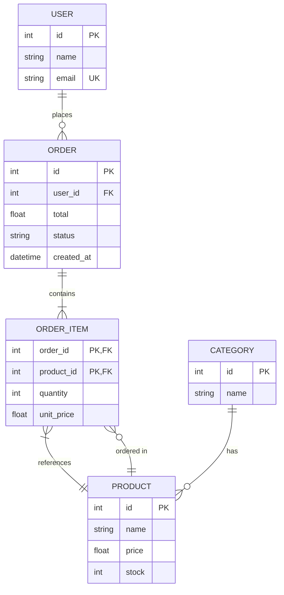
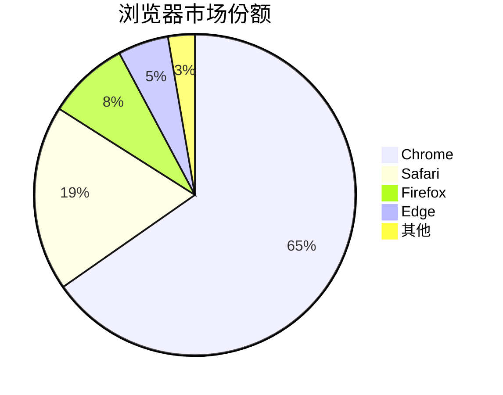
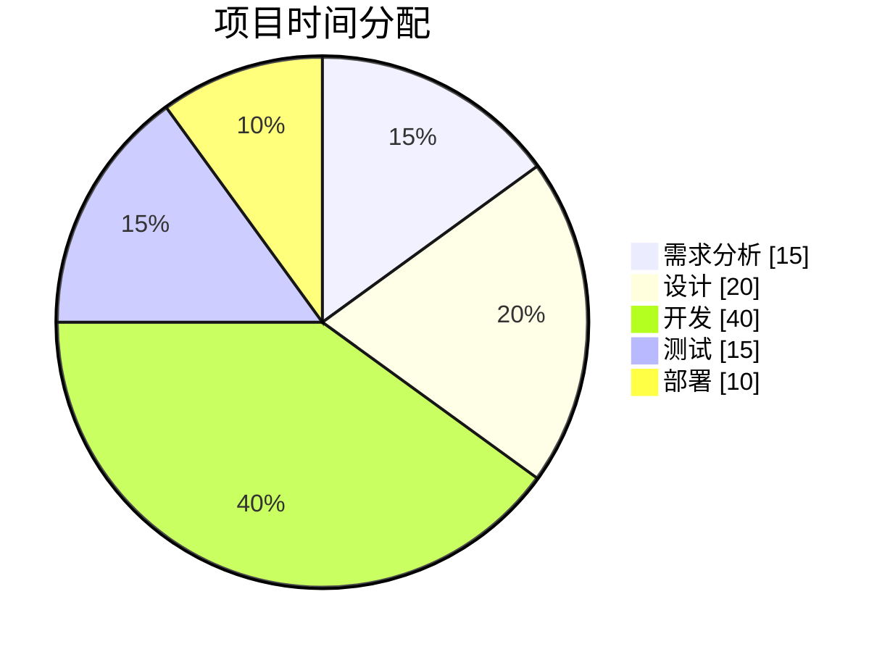

# ER 图与饼图

> 所属计划: Mermaid 语法
> 预计耗时: 35min
> 前置知识: [[mermaid-syntax 01 - 基础与快速上手]]

---

## 1. 概念讲解

### ER 图 — Entity Relationship Diagram

ER 图（实体关系图）用于数据库建模，描述**实体（表）**和**关系（外键/关联表）**。

适用场景：

- 数据库 schema 设计
- 数据模型评审
- ORM 实体关系说明
- 微服务间数据边界沟通

### 饼图 — Pie Chart

饼图用于展示**各部分在整体中的占比**。Mermaid 的饼图语法极其简洁，适合嵌入 Markdown 做数据报告。

---

## 2. ER 图代码示例

### 基本实体定义



- 实体名（表名）首字母大写是一种常见约定，但不是语法要求
- 属性格式：`类型 字段名 [约束]`
- 类型可以是任意字符串（`int`、`string`、`varchar(255)`、`datetime` 等）

#### 约束标记

| 标记 | 含义 |
|------|------|
| `PK` | Primary Key（主键） |
| `FK` | Foreign Key（外键） |
| `UK` | Unique Key（唯一键） |
| 无标记 | 普通字段 |

组合键：`int order_id PK,FK` — 既是主键也是外键。

### 关系定义



#### 关系基数语法

| 语法（左） | 含义 | 语法（右） | 含义 |
|-----------|------|-----------|------|
| `\|o` | 0 或 1 | `o\|` | 0 或 1 |
| `\|\|` | 恰好 1 | `\|\|` | 恰好 1 |
| `}o` | 0 或多个 | `o{` | 0 或多个 |
| `}\|` | 1 或多个 | `\|{` | 1 或多个 |

关系字符串从左到右依次对应左侧实体到右侧实体的基数。

#### 关系类型

| 语法 | 含义 |
|------|------|
| `\|\|--o\|` | 一对一（也可选） |
| `\|\|--o{` | 一对多 |
| `}\|--\|{` | 多对多 |
| `\|\|--\|\|` | 恰好一对一 |

`:` 后可加关系标签（描述关系的动词短语），引号包裹以支持空格和标点。

### 完整示例：电商数据库



---

## 3. 饼图代码示例

### 基本语法



- `pie` 开头，无需方向参数
- `title` 定义图表标题（可选但推荐）
- 每行：`"标签" : 数值`
- 数值可以是整数或小数，Mermaid 自动计算百分比
- 标签含空格或特殊字符时用双引号包裹

### 多级数据



`showData` 在图表上显示原始数值，而非仅显示百分比。

---

## 4. 练习

### 练习 1: 博客系统 ER 图

为一个博客系统画 ER 图：

- `User`：id (PK), username (UK), email (UK), password_hash, created_at
- `Post`：id (PK), author_id (FK), title, content, status, published_at
- `Comment`：id (PK), post_id (FK), author_id (FK), content, created_at
- `Tag`：id (PK), name (UK)
- `Post_Tag`：post_id (PK,FK), tag_id (PK,FK)

关系：User 1 → * Post，User 1 → * Comment，Post 1 → * Comment，Post * → * Tag（通过 Post_Tag）。

### 练习 2: 饼图 — 技术栈分布

画一个饼图展示你当前项目中各语言/技术的代码量占比（可以是估算值）。至少 5 个分类。

### 练习 3: ER 图 — 用户权限系统（可选）

画一个 RBAC（基于角色的访问控制）ER 图：

- `User`：id (PK), name
- `Role`：id (PK), name (UK)
- `Permission`：id (PK), resource, action
- `User_Role`：user_id (PK,FK), role_id (PK,FK)
- `Role_Permission`：role_id (PK,FK), permission_id (PK,FK)

User 与 Role 多对多，Role 与 Permission 多对多。

---

## 3.5 参考答案

> [!tip]- 练习 1 参考答案
> 如果你的实现覆盖了所有表、字段、约束和关系，就是正确的。以下是一种参考写法：
>
> ````markdown
> ```mermaid
> erDiagram
>     User ||--o{ Post : writes
>     User ||--o{ Comment : writes
>     Post ||--o{ Comment : has
>     Post ||--o{ Post_Tag : has
>     Tag ||--o{ Post_Tag : belongs_to
>
>     User {
>         int id PK
>         string username UK
>         string email UK
>         string password_hash
>         datetime created_at
>     }
>     Post {
>         int id PK
>         int author_id FK
>         string title
>         text content
>         string status
>         datetime published_at
>     }
>     Comment {
>         int id PK
>         int post_id FK
>         int author_id FK
>         text content
>         datetime created_at
>     }
>     Tag {
>         int id PK
>         string name UK
>     }
>     Post_Tag {
>         int post_id PK,FK
>         int tag_id PK,FK
>     }
> ```
> ````

> [!tip]- 练习 2 参考答案
> 如果你的饼图正确展示了至少 5 个分类的占比，就是正确的。以下是一种参考写法：
>
> ````markdown
> ```mermaid
> pie showData
>     title 项目技术栈分布
>     "TypeScript" : 45
>     "Python" : 25
>     "Rust" : 12
>     "SQL" : 10
>     "Shell" : 8
> ```
> ````

> [!tip]- 练习 3 参考答案（可选）
> 如果你的 RBAC ER 图正确处理了两个多对多关系和中间表，就是正确的。以下是一种参考写法：
>
> ````markdown
> ```mermaid
> erDiagram
>     User ||--o{ User_Role : assigned
>     Role ||--o{ User_Role : "has users"
>     Role ||--o{ Role_Permission : grants
>     Permission ||--o{ Role_Permission : assigned_to
>
>     User {
>         int id PK
>         string name
>     }
>     Role {
>         int id PK
>         string name UK
>     }
>     Permission {
>         int id PK
>         string resource
>         string action
>     }
>     User_Role {
>         int user_id PK,FK
>         int role_id PK,FK
>     }
>     Role_Permission {
>         int role_id PK,FK
>         int permission_id PK,FK
>     }
> ```
> ````

> [!note] 答案使用方式
> 先独立完成练习，再展开查看参考答案。参考答案不是唯一解——如果你的实现通过了测试或达到了题目要求，就是正确的。

---

## 5. 扩展阅读

- [Mermaid ER Diagram 官方文档](https://mermaid.js.org/syntax/entityRelationshipDiagram.html)
- [Mermaid Pie Chart 官方文档](https://mermaid.js.org/syntax/pie.html)

---

## 常见陷阱

- **关系写在实体定义之前**：Mermaid 允许关系放在前面（先声明关系再定义实体），但建议实体定义放在关系下面——阅读更符合"先了解表结构，再看表间关系"的自然顺序
- **混淆 `}o` 和 `}--o{`**：`}o` 是关系中"一侧"的基数表示，`}--` 是关系中间的分隔线，两边共同构成完整的关系
- **饼图数值后无单位**：Mermaid 饼图的数值是纯数字，不要加 `%` 或单位。Mermaid 自动计算百分比
- **饼图标签用了中文引号**：必须用英文双引号 `"标签"`，中文引号 `"标签"` 导致解析失败
- **ER 图关系方向不重要**：`A ||--o{ B` 和 `B }o--|| A` 是等效的，Mermaid 不关心书写方向，只关心基数标记的相对位置
