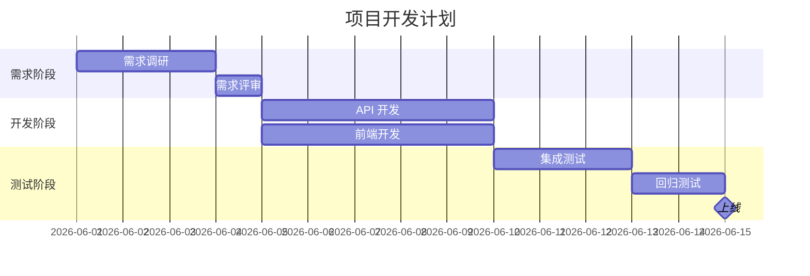
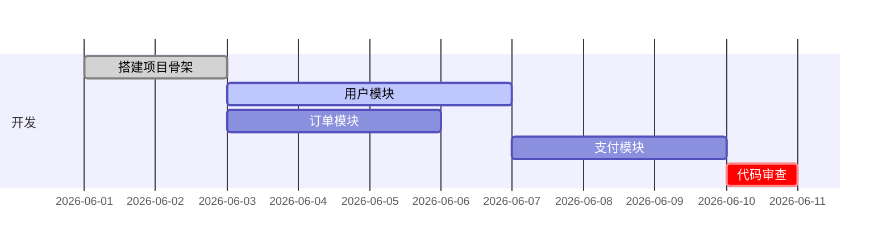
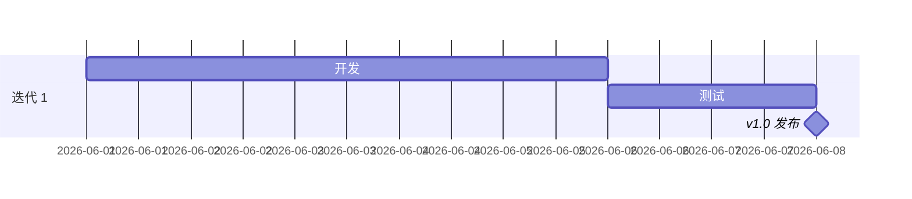
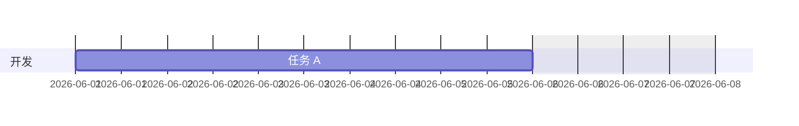
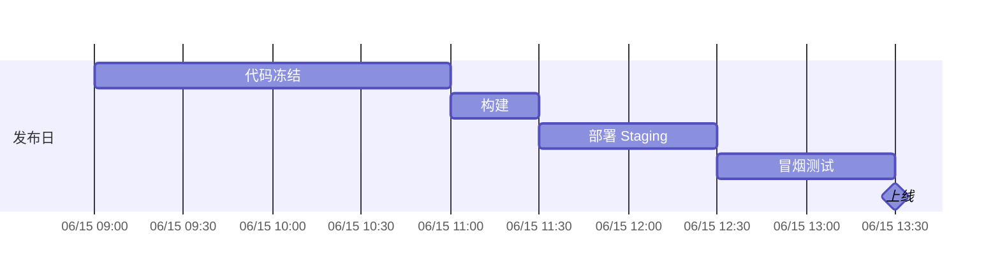

# 甘特图 (Gantt Chart)

> 所属计划: Mermaid 语法
> 预计耗时: 35min
> 前置知识: [[mermaid-syntax 01 - 基础与快速上手]]

---

## 1. 概念讲解

### 什么是甘特图？

甘特图是项目管理中展示**任务时间线**的经典工具。横轴是时间，纵轴是任务列表。每个任务条的长度表示耗时，位置表示起止日期。

适用场景：

- 项目排期：开发、测试、部署的时间规划
- 迭代计划：每个 Sprint 的任务分布
- 里程碑追踪：关键节点的时间预期 vs 实际
- 个人学习计划：每周/每天的进度安排

### 核心思想

甘特图 = **任务（Task）** + **时间区段**。Mermaid 将日期字符串解析为时间线，自动计算条状图的起止位置。

---

## 2. 代码示例

### 基本结构



核心语法元素：

| 元素 | 说明 |
|------|------|
| `title` | 图表标题 |
| `dateFormat` | 日期格式，如 `YYYY-MM-DD` |
| `section` | 任务分组标题 |
| `任务名 :ID, 开始日期, 持续时间` | 任务定义 |

### 日期格式

`dateFormat` 支持以下格式标记：

| 标记 | 含义 | 示例 |
|------|------|------|
| `YYYY` | 四位年份 | 2026 |
| `YY` | 两位年份 | 26 |
| `MM` | 月份（数字） | 06 |
| `DD` | 日 | 11 |
| `HH` | 小时（24h） | 14 |
| `mm` | 分钟 | 30 |
| `d` / `w` / `M` | 天/周/月（持续时间） | `3d` |

### 任务依赖



依赖方式：

| 语法 | 含义 |
|------|------|
| `after <ID>` | 在指定任务之后开始 |
| `after <ID1> <ID2>` | 在所有指定任务之后开始 |
| `until <ID>` | 直到指定任务开始时结束 |
| 直接写日期 | `2026-06-15, 3d` |

### 任务状态

| 标记 | 视觉效果 | 含义 |
|------|---------|------|
| `done` | 灰色填充 | 已完成 |
| `active` | 高亮填充 | 进行中 |
| `crit` | 红色填充 | 关键任务 / 在关键路径上 |
| 无标记 | 默认蓝色填充 | 待开始 |

### 里程碑



`milestone` 标记 + 持续时间为 `0d` → 渲染为菱形标记点。

### 排除非工作日



`excludes weekends` 让 Mermaid 跳过周六日计算持续时间。可选值：`weekends`、`sundays`、`2026-06-05`（特定日期）。

### 精确到小时



`axisFormat` 控制横轴时间显示格式，使用 `strftime` 风格的格式化字符串。

---

## 3. 练习

### 练习 1: 个人学习周计划

用甘特图画你接下来一周（任意起始日期）的学习计划，至少包含 3 个 `section`（如"读书"、"编程练习"、"复习"），每个 section 至少 2 个任务。使用 `done`、`active`、`crit` 标记不同状态。

### 练习 2: 软件发布排期

画一个软件的发布排期（精确到小时）：

- 发布日前一天：代码冻结（2h）、集成测试（2h）
- 发布日：构建（30min）→ 部署 Staging（1h）→ 回归测试（2h）→ 部署 Production（1h）→ 监控观察（4h）
- 使用 `milestone` 标记"代码冻结"和"发布完成"
- 使用 `excludes`（如不需要则跳过）

### 练习 3: 论文/毕业设计排期（可选）

画一个 2 个月的论文排期，使用 `excludes weekends`，包含：文献调研、实验设计、数据收集、数据分析、初稿撰写、修改、定稿、答辩准备。

---

## 3.5 参考答案

> [!tip]- 练习 1 参考答案
> 如果你的甘特图正确分 section、标注了状态且日期合理，就是正确的。以下是一种参考写法：
>
> ````markdown
> ```mermaid
> gantt
>     title 本周学习计划
>     dateFormat YYYY-MM-DD
>     section 读书
>     读完《DDIA》第 3 章   :done, r1, 2026-06-09, 2d
>     读完《DDIA》第 4 章   :active, r2, after r1, 2d
>     section 编程练习
>     LeetCode 每日一题     :done, c1, 2026-06-09, 5d
>     Rust 项目重构         :crit, c2, 2026-06-11, 3d
>     section 复习
>     整理笔记             :r3, 2026-06-14, 1d
> ```
> ````

> [!tip]- 练习 2 参考答案
> ````markdown
> ```mermaid
> gantt
>     title 发布排期
>     dateFormat YYYY-MM-DD HH:mm
>     axisFormat %m/%d %H:%M
>     section 发布前
>     代码冻结       :milestone, f1, 2026-06-10 09:00, 0h
>     集成测试       :crit, f2, 2026-06-10 09:00, 2h
>     发布准备       :f3, after f2, 1h
>     section 发布日
>     构建           :d1, 2026-06-11 07:00, 30m
>     部署 Staging   :d2, after d1, 1h
>     回归测试       :crit, d3, after d2, 2h
>     部署 Production :d4, after d3, 1h
>     监控观察       :d5, after d4, 4h
>     发布完成       :milestone, d6, after d5, 0h
> ```
> ````

> [!tip]- 练习 3 参考答案（可选）
> ````markdown
> ```mermaid
> gantt
>     title 毕业论文排期
>     dateFormat YYYY-MM-DD
>     excludes weekends
>     section 准备
>     文献调研       :done, p1, 2026-06-01, 10d
>     实验设计       :done, p2, after p1, 5d
>     section 执行
>     数据收集       :active, e1, after p2, 10d
>     数据分析       :e2, after e1, 7d
>     section 写作
>     初稿撰写       :w1, after e2, 10d
>     导师修改       :w2, after w1, 5d
>     定稿           :w3, after w2, 3d
>     section 答辩
>     答辩准备       :crit, d1, after w3, 5d
>     正式答辩       :milestone, d2, after d1, 0d
> ```
> ````

> [!note] 答案使用方式
> 先独立完成练习，再展开查看参考答案。参考答案不是唯一解——如果你的实现通过了测试或达到了题目要求，就是正确的。

---

## 4. 扩展阅读

- [Mermaid Gantt Chart 官方文档](https://mermaid.js.org/syntax/gantt.html)

---

## 常见陷阱

- **`dateFormat` 和实际日期格式不匹配**：如果 `dateFormat YYYY-MM-DD` 但写的是 `2026/06/01`，Mermaid 无法解析，图表不渲染
- **`axisFormat` 用错格式化标记**：`axisFormat` 使用与 `dateFormat` 不同的格式化语法（类似 C `strftime`）。常见错误是用 `YYYY-MM-DD` 在 `axisFormat` 中（应该用 `%Y-%m-%d`）
- **持续时间不能用月**：`2M` 是 2 分钟，不是 2 个月。Mermaid 不支持月级持续时间。跨月任务直接用具体日期：`2026-06-01, 2026-07-15`
- **`section` 名称不能为纯数字**：`section 2026` 会导致解析错误，应使用 `section 2026年` 或 `section Y2026`
- **里程碑持续时间为正数**：`milestone` 标记但持续时间写成 `1d` → 渲染为普通任务条而非菱形。里程碑持续时间应为 `0d`（或 `0h`）
