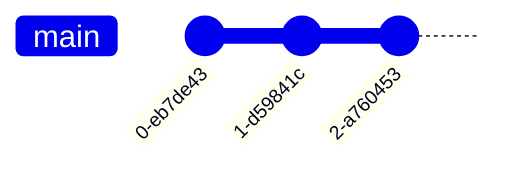
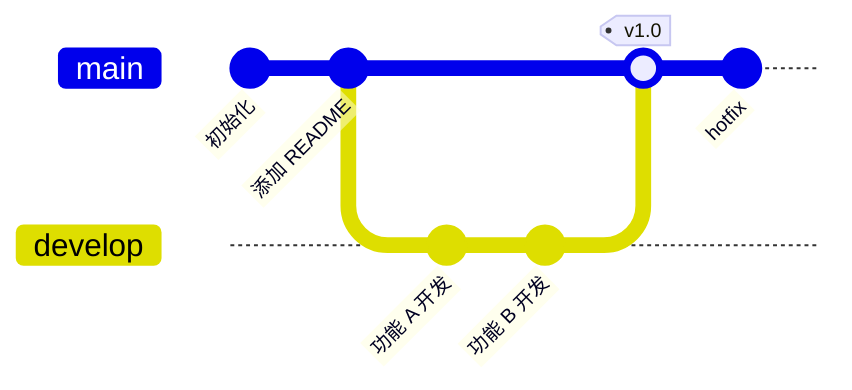
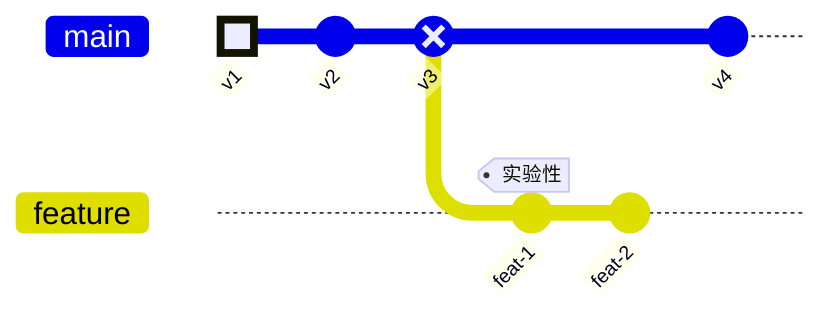
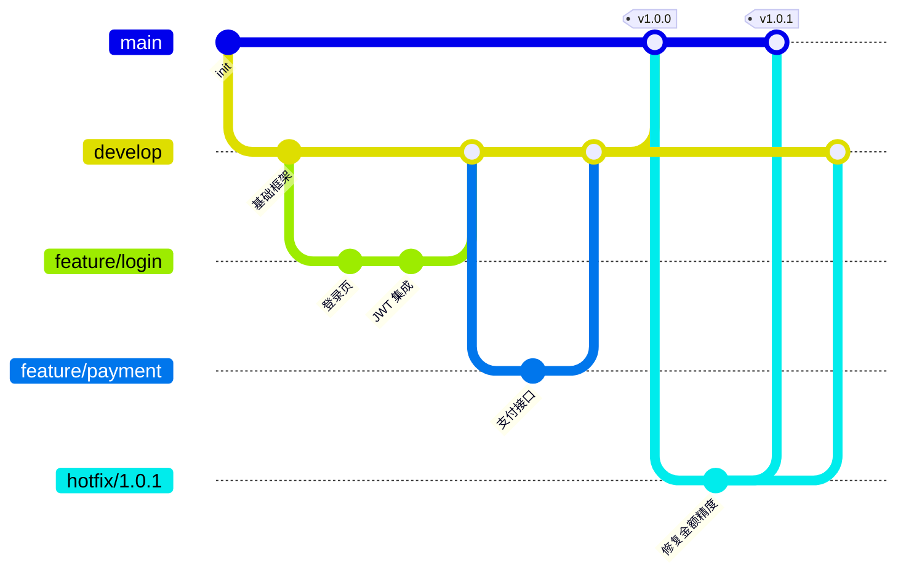
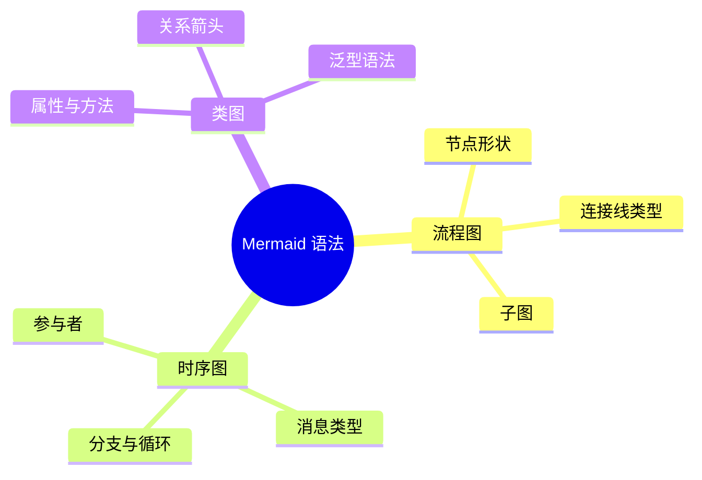
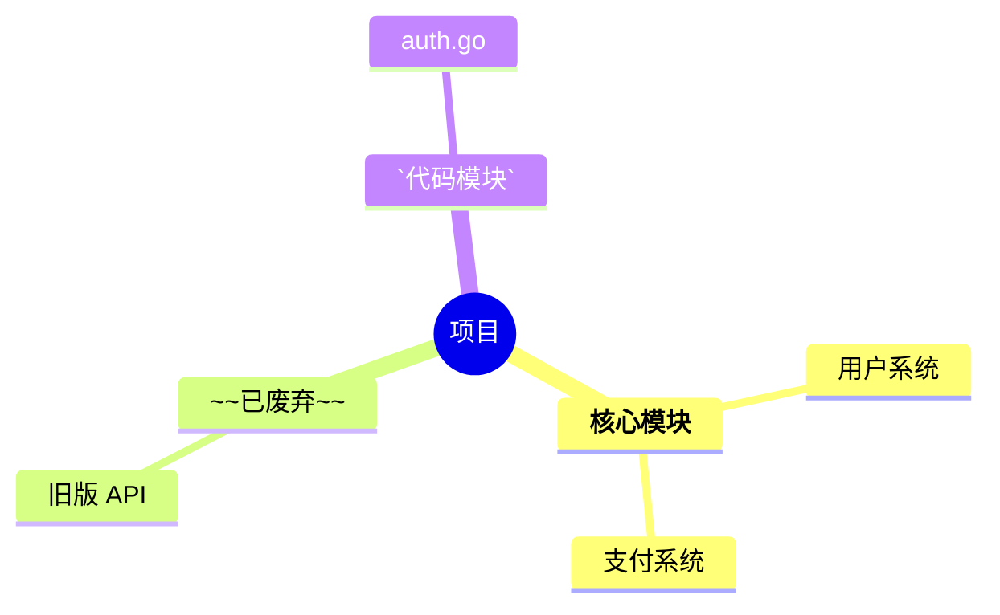

# Git 图与思维导图

> 所属计划: Mermaid 语法
> 预计耗时: 30min
> 前置知识: [[mermaid-syntax 01 - 基础与快速上手]]

---

## 1. 概念讲解

### Git 图

Git 图（Gitgraph）用图形方式展示 Git 仓库的分支、提交、合并历史。它**不读取实际 Git 仓库**，而是让你手写提交历史——适合在文档中说明分支策略。

适用场景：

- 文档化 Git 工作流（Git Flow、GitHub Flow、Trunk-Based）
- 教学：解释 rebase vs merge 的区别
- 代码评审：展示预期的分支走向

### 思维导图

思维导图（Mindmap）以树状结构展示层级化的概念关系。从中心主题向外扩散。

适用场景：

- 知识点梳理（正如你正在读的学习计划）
- 头脑风暴记录
- 项目结构概览
- 会议纪要

---

## 2. Git 图代码示例

### 基本提交



每个 `commit` 在默认分支 `main` 上创建一个提交点。

### 分支与合并



关键命令：

| 命令 | 含义 |
|------|------|
| `commit` | 在当前分支创建提交 |
| `branch <名称>` | 创建新分支（但不自动切换） |
| `checkout <名称>` | 切换到指定分支 |
| `merge <名称>` | 将指定分支合并到当前分支 |
| `cherry-pick <ID>` | 将指定提交拣选到当前分支 |

### 提交属性



| 属性 | 说明 |
|------|------|
| `id: "..."` | 提交 ID（显示在圆圈中） |
| `tag: "..."` | 标签文字（显示在提交点旁边） |
| `type: NORMAL` | 默认（实心圆） |
| `type: REVERSE` | 反色（空心圆） |
| `type: HIGHLIGHT` | 高亮（填充圆，与 NORMAL 视觉接近但可配置） |

### Git Flow 示例



---

## 3. 思维导图代码示例

### 基本树形结构



- `root((...))` 定义中心节点（双圆括号 = 圆形）
- 每个缩进层级 = 树的一层
- 缩进用 2 或 4 个空格（保持一致）

### 节点形状

```mermaid
mindmap
  root((圆形))
    矩形
      默认形状
    圆角矩形)
      右括号
    (左括号圆角
      左括号
    爆炸形))
      双右括号
    ((双圆
      双括号
    ))
    六边形}}
      双花括号
    {{
```

| 语法 | 形状 |
|------|------|
| `默认` | 矩形 |
| `文字)` | 右圆角 |
| `(文字` | 左圆角 |
| `((文字))` | 圆形 |
| `文字))` | 爆炸形（右云朵） |
| `))文字((` | 云朵形 |
| `{{文字}}` | 六边形 |

### 图标（需 Font Awesome）

```mermaid
mindmap
  root((项目架构))
    ::icon(fa fa-database) 数据层
      PostgreSQL
      Redis
    ::icon(fa fa-code) 业务层
      User Service
      Order Service
    ::icon(fa fa-globe) 展示层
      Web App
      Mobile App
```

`::icon(fa fa-<图标名>)` 在节点前添加 Font Awesome 图标。需要渲染环境支持 Font Awesome。

### 多根节点

```mermaid
mindmap
  root((后端))
    Go 服务
    Python 脚本
  root((前端))
    React
    CSS
```

Mermaid 思维导图支持多个 `root` 节点，各自独立。

### Markdown 格式化



思维导图节点内支持 Markdown 内联格式：`**粗体**`、`~~删除线~~`、`` `代码` ``。

---

## 4. 练习

### 练习 1: Git Flow 工作流

画一个包含以下分支策略的 Git 图：

- main 分支：初始提交 → v1.0 → v1.1
- develop 分支：从 main 分出 → 两次常规提交 → 合并回 main（v1.0）
- 一个 feature 分支：从 develop 分出 → 两次提交 → 合并回 develop
- 一个 hotfix 分支：从 main 分出 → 一次提交 → 合并回 main 和 develop

### 练习 2: 思维导图 — 前端知识体系

用思维导图整理"前端开发"的知识体系，至少 3 层深度，包含 HTML、CSS、JavaScript、框架等分支。使用至少 2 种不同节点形状。

### 练习 3: 思维导图 — 学习路线（可选）

用思维导图画出本 Mermaid 学习计划的 9 个教程，按图表类型分类（流程类、UML 类、数据类、项目类），使用图标或节点形状区分分类。

---

## 3.5 参考答案

> [!tip]- 练习 1 参考答案
> ````markdown
> ```mermaid
> gitGraph
>     commit id: "init"
>     branch develop
>     checkout develop
>     commit id: "架构搭建"
>     commit id: "基础功能"
>     branch feature/auth
>     checkout feature/auth
>     commit id: "登录"
>     commit id: "注册"
>     checkout develop
>     merge feature/auth
>     checkout main
>     merge develop tag: "v1.0"
>     branch hotfix/crash
>     checkout hotfix/crash
>     commit id: "修复崩溃"
>     checkout main
>     merge hotfix/crash tag: "v1.1"
>     checkout develop
>     merge hotfix/crash
> ```
> ````

> [!tip]- 练习 2 参考答案
> 如果你的思维导图覆盖了前端的主要技术领域且层次分明，就是正确的。以下是一种参考写法：
>
> ````markdown
> ```mermaid
> mindmap
>   root((前端开发))
>     HTML
>       语义化标签
>       表单
>       可访问性
>     CSS
>       Flexbox
>       Grid
>       Tailwind
>     JavaScript
>       ES6+
>       DOM 操作
>       异步编程
>     )框架
>       React
>         状态管理
>         路由
>       Vue
>     ))工程化
>       Webpack
>       Vite
>       测试
> ```
> ````

> [!tip]- 练习 3 参考答案（可选）
> ````markdown
> ```mermaid
> mindmap
>   root((Mermaid 学习路线))
>     流程类
>       ::icon(fa fa-project-diagram) 流程图
>       ::icon(fa fa-exchange-alt) 时序图
>     UML 类
>       ::icon(fa fa-cubes) 类图
>       ::icon(fa fa-cog) 状态图
>     数据类
>       ::icon(fa fa-database) ER 图
>       ::icon(fa fa-chart-pie) 饼图
>     项目类
>       ::icon(fa fa-tasks) 甘特图
>       ::icon(fa fa-code-branch) Git 图
>     知识类
>       ::icon(fa fa-brain) 思维导图
>     进阶
>       ::icon(fa fa-paint-brush) 样式定制
> ```
> ````

> [!note] 答案使用方式
> 先独立完成练习，再展开查看参考答案。参考答案不是唯一解——如果你的实现通过了测试或达到了题目要求，就是正确的。

---

## 5. 扩展阅读

- [Mermaid Gitgraph 官方文档](https://mermaid.js.org/syntax/gitgraph.html)
- [Mermaid Mindmap 官方文档](https://mermaid.js.org/syntax/mindmap.html)

---

## 常见陷阱

- **Git 图 `branch` 后不自动切换**：`branch develop` 只是创建分支，当前仍在原分支。必须显式 `checkout develop`
- **Git 图 `merge` 方向**：`merge develop` 是将 develop 合并到**当前分支**（checkout 所在分支），不是将当前分支合并到 develop
- **思维导图缩进不一致**：Mermaid 对缩进敏感。混用 tab 和空格、或缩进层级不一致 → 解析错误。建议统一用 2 或 4 个空格
- **思维导图最深 5 层**：Mermaid 思维导图有最大深度限制（通常 5 层），超出会被截断
- **Git 图 commit id 不能重复**：`commit id: "A"` 两次 → 第二个被忽略。每个 commit 的 `id` 必须唯一
- **`cherry-pick` 需要精确 commit id**：必须与被拣选 commit 的 `id` 精确匹配（区分大小写）
