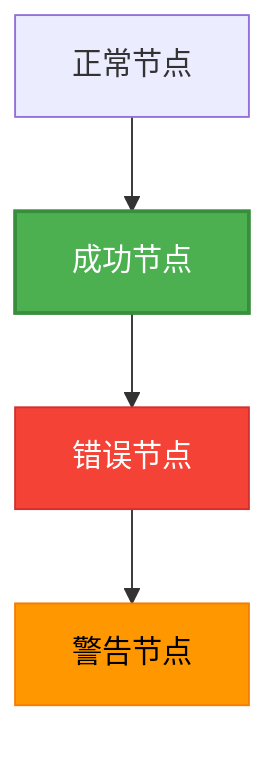
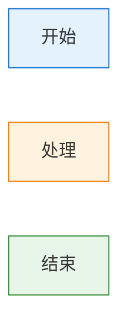
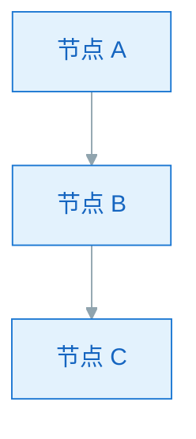
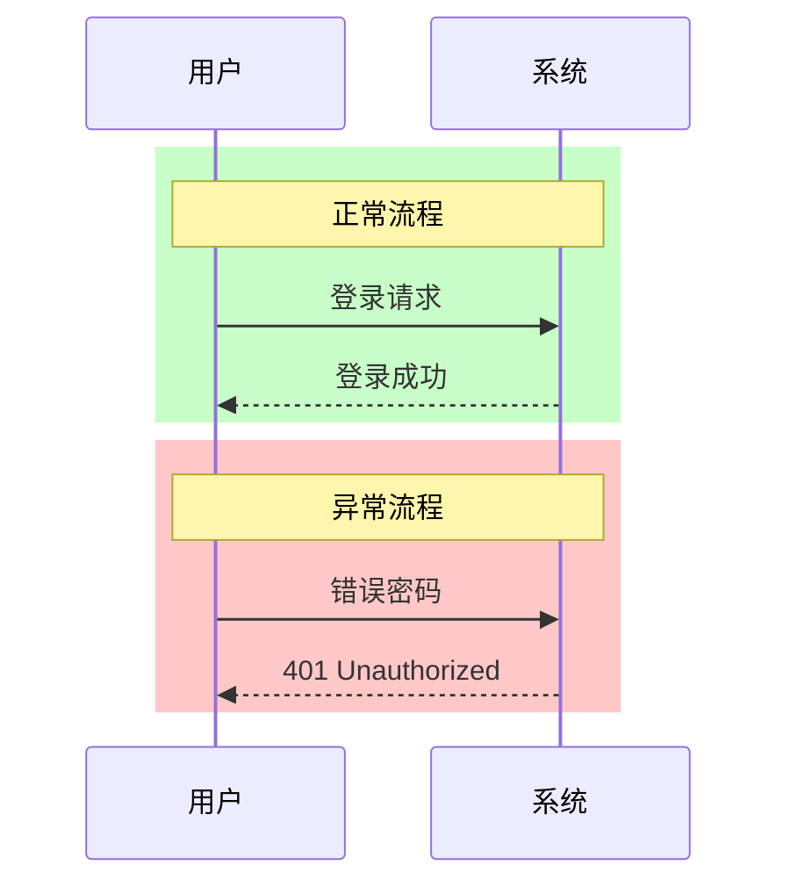

# 进阶技巧与样式定制

> 所属计划: Mermaid 语法
> 预计耗时: 40min
> 类型: 进阶
> 前置知识: [[mermaid-syntax 02 - 流程图]]

---

## 1. 概念讲解

### 为什么要自定义样式？

默认的 Mermaid 主题（`default`、`neutral`、`dark`、`forest`、`base`）覆盖了大部分场景。但当你需要：

- 匹配公司品牌色
- 在特定节点上突出显示（错误节点红色，成功节点绿色）
- 统一团队文档的视觉风格
- 让图表在深色/浅色主题下都可读

自定义样式就派上用场了。

### 核心工具

Mermaid 提供三层样式控制：

1. **主题切换**：全局配色方案
2. **`classDef` + `class`**：给特定节点加 CSS 类
3. **`style` 指令**：直接给节点写内联样式
4. **`%%{init}%%` 配置块**：修改渲染器配置

---

## 2. 代码示例

### 主题切换


五个内置主题：

| 主题 | 特点 |
|------|------|
| `default` | 白底，蓝/灰色调 |
| `neutral` | 灰白配色，适合打印 |
| `dark` | 深色背景 |
| `forest` | 绿/黄暖色调 |
| `base` | 极简，几乎无样式（适合完全自定义） |

> [!tip] Obsidian 中的主题
> Obsidian 默认使用与当前 Obsidian 主题匹配的 Mermaid 主题。你可以在 `%%{init}%%` 中覆盖。

### `classDef` 与 `class` — 定义可复用的样式类



CSS 属性：

| 属性 | 说明 |
|------|------|
| `fill` | 背景色 |
| `stroke` | 边框色 |
| `color` | 文字色 |
| `stroke-width` | 边框粗细 |
| `stroke-dasharray` | 虚线边框（如 `5,5`） |
| `font-family` | 字体 |
| `font-size` | 字号 |

### `style` 指令 — 单节点内联样式



`style <节点ID> <CSS属性列表>` 直接为单个节点设置样式。适合一次性使用，不适合批量复用（此时用 `classDef`）。

### `%%{init}%%` — 全局配置

这是一个 JSON 格式的配置块，放在图表的第一行（`flowchart` / `graph` 之类的声明前或紧随其后）：



`themeVariables` 允许覆盖主题中预定义的颜色变量。配合 `theme: 'base'` 使用可实现完全自定义的配色方案。

#### 常用 themeVariables

| 变量 | 作用 |
|------|------|
| `primaryColor` | 主节点填充色 |
| `primaryTextColor` | 主节点文字色 |
| `primaryBorderColor` | 主节点边框色 |
| `lineColor` | 连接线颜色 |
| `secondaryColor` | 次要节点填充色 |
| `tertiaryColor` | 第三节点填充色 |

### 流程图 vs 时序图的样式差异

不同图表类型支持不同的样式方式。下表汇总：

| 图表类型 | `classDef`/`class` | `style` | `%%{init}%%` |
|---------|-------------------|---------|-------------|
| Flowchart | ✅ | ✅ | ✅ |
| Sequence | ❌（需用 `rect` 或 `%%{init}%%`） | ❌ | ✅ |
| Class | ✅ | ✅ | ✅ |
| State | ✅ | ✅ | ✅ |
| ER | ❌ | ❌ | ✅（仅 `theme` 切换） |
| Gantt | ❌ | ❌ | ✅ |
| Pie | ❌ | ❌ | ✅（仅 `theme` 切换） |
| Git | ❌ | ❌ | ✅（仅 `theme` 切换） |
| Mindmap | ❌ | ❌ | ✅（仅 `theme` 切换） |

> [!warning] 时序图的特殊限制
> 时序图不支持 `style` 和 `classDef`。如需高亮特定消息，使用背景色块 `rect`：
>
> ```mermaid
> sequenceDiagram
>     A ->> B: 消息 1
>     rect rgb(255, 230, 230)
>         A ->> B: 这条重要
>         B -->> A: 响应
>     end
>     A ->> B: 消息 3
> ```

### 时态图的样式 — 用 `rect` 高亮



`rect rgb(R, G, B)` 在时序图中创建一个彩色背景色块，跨多条消息。

### 响应式字体大小


通过 `nodeSpacing` 和 `rankSpacing` 控制布局密度。

---

## 3. 练习

### 练习 1: 交通灯流程图

画一个交通灯状态的流程图，用 `classDef` 自定义三种颜色类：

- 红灯节点：红色背景
- 绿灯节点：绿色背景
- 黄灯节点：黄色背景 + 黑色文字

流程图逻辑：红灯 → 绿灯 → 黄灯 → 红灯（循环）。

### 练习 2: 深色主题 ER 图

为一个简单的博客系统（User、Post、Comment 三表）画 ER 图，并用 `%%{init}%%` 将主题切换到 `dark`。

### 练习 3: 自定义配色体系（可选）

用 `%%{init}%%` + `theme: 'base'` + 自定义 `themeVariables` 创建一套你自己的配色方案，绘制一个包含至少 5 个节点的流程图。颜色选择上确保有足够对比度。

---

## 3.5 参考答案

> [!tip]- 练习 1 参考答案
> 如果你的交通灯使用了 `classDef` 定义了三种颜色并正确应用，就是正确的。以下是一种参考写法：
>
> ````markdown
> ```mermaid
> flowchart LR
>     R[红灯 60s] --> G[绿灯 45s]
>     G --> Y[黄灯 3s]
>     Y --> R
>
>     classDef red fill:#F44336,stroke:#C62828,color:#fff
>     classDef green fill:#4CAF50,stroke:#2E7D32,color:#fff
>     classDef yellow fill:#FFEB3B,stroke:#F9A825,color:#000
>
>     class R red
>     class G green
>     class Y yellow
> ```
> ````

> [!tip]- 练习 2 参考答案
> ````markdown
> ```mermaid
> %%{init: {'theme': 'dark'}}%%
> erDiagram
>     User ||--o{ Post : writes
>     Post ||--o{ Comment : has
>     User ||--o{ Comment : writes
>
>     User {
>         int id PK
>         string name
>     }
>     Post {
>         int id PK
>         int user_id FK
>         string title
>     }
>     Comment {
>         int id PK
>         int post_id FK
>         int user_id FK
>         text body
>     }
> ```
> ````

> [!tip]- 练习 3 参考答案（可选）
> ````markdown
> ```mermaid
> %%{init: {'theme': 'base', 'themeVariables': {
>     'primaryColor': '#1A1A2E',
>     'primaryTextColor': '#E94560',
>     'primaryBorderColor': '#0F3460',
>     'lineColor': '#533483',
>     'secondaryColor': '#16213E',
>     'tertiaryColor': '#0F3460'
> }}}%%
> flowchart TD
>     A[需求分析] --> B[系统设计]
>     B --> C[编码实现]
>     C --> D[测试]
>     D --> E[部署上线]
>     D -.->|发现 Bug| C
>     E --> F[监控运维]
> ```
> ````

> [!note] 答案使用方式
> 先独立完成练习，再展开查看参考答案。参考答案不是唯一解——如果你的实现通过了测试或达到了题目要求，就是正确的。

---

## 4. 扩展阅读

- [Mermaid 主题配置文档](https://mermaid.js.org/config/theming.html)
- [Mermaid 配置大全](https://mermaid.js.org/config/configuration.html)
- [Mermaid Theming Guide](https://mermaid.js.org/config/theming.html)

---

## 常见陷阱

- **`%%{init}%%` 位置错误**：`%%{init}%%` 必须在图表类型声明（如 `flowchart TD`）之前或紧随其后（同一行），放在别处被忽略
- **`classDef` 名称不能含空格**：`classDef success green` 中 `success green` 是一个整体名称，不能写成 `classDef "success green"`
- **`classDef` 和 `class` 配对使用**：只定义 `classDef` 不写 `class` → 样式不生效。`class` 必须引用已定义的 `classDef` 名称
- **`style` 中 CSS 属性用逗号分隔**：`style A fill:#FFF,stroke:#000` — 注意用**逗号**分隔，不是分号
- **ER 图和饼图不支持 `style`**：这些图表类型只接受全局主题配置。需要自定义样式时，在 `%%{init}%%` 中切换主题或修改 `themeVariables`
- **时序图 `rect` 的颜色值不带 `#`**：`rect rgb(255, 0, 0)` 使用 RGB 三元组，不是十六进制。如果用十六进制会解析失败
- **`%%{init}%%` 的 JSON 格式必须严格**：最后一个属性后面不能有逗号，字符串必须用双引号。JSON 格式错误会导致整个图表不渲染
