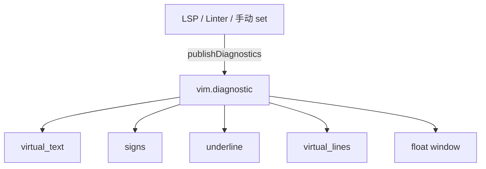

# 18 — Diagnostic 系统深度：virtual_lines/jump/severity

> 所属计划: Neovim + Lua 配置实战 (现代深化版)
> 预计耗时: 45 分钟
> 前置知识: [[09-modern-lsp]]

---

## 1. 概念讲解

### 1.1 vim.diagnostic 架构

`vim.diagnostic` 是 Neovim 核心的诊断显示层。它不直接产生诊断，而是接收来自 LSP server、`vim.diagnostic.set()` 或其他 linter 的数据，并负责把它们渲染成你能看到的形式：

- 行尾虚拟文本（virtual_text）
- signcolumn 标记（signs）
- 文本下划线（underline）
- 行下虚拟线（virtual_lines，0.11+）
- 浮动窗口（float）



### 1.2 vim.diagnostic 与 LSP 的关系

LSP server 通过 `textDocument/publishDiagnostics` 把诊断发给 Neovim；Neovim 内部把这个响应交给 `vim.diagnostic`。这意味着：

- 同一个 buffer 可以有**多个 LSP client** 同时上报诊断（例如 TypeScript + ESLint）。
- `vim.diagnostic.config()` 是**全局配置**，对所有来源生效。
- 你可以用 `vim.diagnostic.set()` 在不启动 LSP 的情况下显示自定义诊断。

> [!note]
> `vim.diagnostic` 不依赖 LSP。一些 linter 插件（如 nvim-lint）也会把结果通过 `vim.diagnostic.set()` 注入。

### 1.3 `vim.diagnostic.config()` 完整选项

下面是逐项详解，每项都附带可运行的代码片段。

#### `virtual_text`

行尾虚拟文本，最常见也最节省空间的显示方式：

```lua
vim.diagnostic.config {
  virtual_text = {
    prefix = '●',     -- 行尾前缀符号
    spacing = 4,      -- 与代码之间的空格数
    source = 'if_many', -- 多 server 时显示来源
  },
}
```

`prefix` 也可以是函数，返回字符串：

```lua
vim.diagnostic.config {
  virtual_text = {
    prefix = function(diagnostic)
      local icons = { 'E', 'W', 'I', 'H' }
      return icons[diagnostic.severity]
    end,
    spacing = 4,
  },
}
```

#### `virtual_lines`

0.11+ 新增，把每条诊断显示在代码行的下方，**独占一行虚拟文本**，更易读但占空间：

```lua
vim.diagnostic.config {
  virtual_lines = true,
}
```

也可以只显示当前光标所在行：

```lua
vim.diagnostic.config {
  virtual_lines = { current_line = true },
}
```

> [!warning]
> `virtual_lines` 与 `virtual_text` 同时开启时，单条诊断可能出现"上下两层"文本。通常二选一，或根据文件类型切换。

#### `signs`

signcolumn 左侧标记，快速定位错误位置：

```lua
vim.diagnostic.config {
  signs = {
    text = {
      [vim.diagnostic.severity.ERROR] = 'E',
      [vim.diagnostic.severity.WARN] = 'W',
      [vim.diagnostic.severity.INFO] = 'I',
      [vim.diagnostic.severity.HINT] = 'H',
    },
    numhl = {
      [vim.diagnostic.severity.ERROR] = 'DiagnosticSignError',
      [vim.diagnostic.severity.WARN] = 'DiagnosticSignWarn',
    },
  },
}
```

如果你使用 Nerd Font，可以直接用图标：

```lua
vim.diagnostic.config {
  signs = {
    text = {
      [vim.diagnostic.severity.ERROR] = '',
      [vim.diagnostic.severity.WARN] = '',
      [vim.diagnostic.severity.INFO] = '',
      [vim.diagnostic.severity.HINT] = '',
    },
  },
}
```

#### `underline`

给有问题的代码加下划线。可以用 `severity` 限制只有较严重的诊断才显示：

```lua
vim.diagnostic.config {
  underline = {
    severity = { min = vim.diagnostic.severity.WARN },
  },
}
```

`min = WARN` 表示只给 `WARN` 和 `ERROR` 加下划线，`INFO`/`HINT` 不加。

#### `update_in_insert`

插入模式下是否实时更新诊断。默认行为可能分心，kickstart 选择关闭：

```lua
vim.diagnostic.config {
  update_in_insert = false,
}
```

> [!tip]
> 关闭 `update_in_insert` 后，诊断会在你离开插入模式时统一刷新，减少输入过程中的视觉干扰。

#### `severity_sort`

按严重度排序同一位置的诊断：

```lua
vim.diagnostic.config {
  severity_sort = true,
}
```

`true` 表示 ERROR > WARN > INFO > HINT。也可以反向：

```lua
vim.diagnostic.config {
  severity_sort = { reverse = true },
}
```

#### `float`

配置诊断浮动窗口样式：

```lua
vim.diagnostic.config {
  float = {
    border = 'rounded',
    source = 'if_many',
    header = '',
    prefix = '',
  },
}
```

常用 `border` 值：`none`、`single`、`double`、`rounded`、`solid`、`shadow`。`source = 'if_many'` 只在存在多个诊断来源时显示来源名。

#### `jump`

0.11+ 新增，控制 `[d` / `]d` 跳转行为：

```lua
vim.diagnostic.config {
  jump = {
    on_jump = function(_, bufnr)
      vim.diagnostic.open_float {
        bufnr = bufnr,
        scope = 'cursor',
        focus = false,
      }
    end,
    wrap = true,
  },
}
```

`on_jump` 会在每次跳转后自动打开浮动窗口；`wrap = true` 表示到达文件末尾后跳回开头。

### 1.4 severity 级别

`vim.diagnostic.severity` 是枚举表：

| 级别 | 值 | 含义 |
|------|---|------|
| `ERROR` | 1 | 错误，必须处理 |
| `WARN` | 2 | 警告，建议处理 |
| `INFO` | 3 | 信息 |
| `HINT` | 4 | 提示，最轻 |

在配置中可以用 `vim.diagnostic.severity.WARN` 或直接用数字 `2`（但不推荐，可读性差）。

### 1.5 virtual_text vs virtual_lines 取舍

| 场景 | 推荐 |
|------|------|
| 屏幕空间有限，需要快速扫一眼错误 | `virtual_text` |
| 错误信息很长，行尾放不下 | `virtual_lines` |
| 需要同时看清多行错误细节 | `virtual_lines` |
| 不想屏幕跳动太大 | `virtual_text` |
| 当前行高亮，其他行隐藏 | `virtual_lines = { current_line = true }` |

> [!tip]
> 你可以用快捷键在两种模式间切换，适应不同任务：写代码时用 `virtual_text`，review 复杂错误时切到 `virtual_lines`。

### 1.6 导航 API

Neovim 提供以下函数在诊断间移动：

```lua
-- 下一个 / 上一个诊断
vim.diagnostic.goto_next { float = false }
vim.diagnostic.goto_prev { float = true }

-- 在光标处打开浮动窗口
vim.diagnostic.open_float { scope = 'cursor' }

-- 把诊断写入 location list 并打开
vim.diagnostic.setloclist { open = true }

-- 写入 quickfix list
vim.diagnostic.setqflist { open = true }
```

默认映射（0.10+）：

- `[d` → `vim.diagnostic.goto_prev()`
- `]d` → `vim.diagnostic.goto_next()`
- `[D` → 当前 buffer 第一个诊断
- `]D` → 当前 buffer 最后一个诊断

### 1.7 自定义 severity 过滤

如果你只想看到 `ERROR` 和 `WARN`，可以在所有显示方式上加 severity 过滤：

```lua
vim.diagnostic.config {
  virtual_text = { severity = { min = vim.diagnostic.severity.WARN } },
  signs = { severity = { min = vim.diagnostic.severity.WARN } },
  underline = { severity = { min = vim.diagnostic.severity.WARN } },
  virtual_lines = { severity = { min = vim.diagnostic.severity.WARN } },
}
```

### 1.8 多 LSP 诊断合并

多个 client 的诊断会自动按行号和列号合并。`source = 'if_many'` 的用途就在这里：只有存在多个来源时才显示来源名，避免单一来源时屏幕杂乱。

```lua
vim.diagnostic.config {
  float = { source = 'if_many' },
  virtual_text = { source = 'if_many' },
}
```

### 1.9 `<leader>q` setloclist 范式

把所有诊断放进 location list，方便批量查看：

```lua
vim.keymap.set('n', '<leader>q', function()
  vim.diagnostic.setloclist { open = true }
end, { desc = 'Open diagnostic [Q]uickfix/location list' })
```

> [!note]
> `setloclist` 是 per-window 的，适合只关注当前 buffer；`setqflist` 是全局的，适合跨文件项目级检查。

---

## 2. 代码示例

### 2.1 kickstart 风格完整 diagnostic 配置

下面这份配置来自 research-brief 第 3.3 节，是 kickstart.nvim master 的现代范式：

```lua
-- init.lua Section: Diagnostic config
-- 要求: Neovim 0.12.3+

vim.diagnostic.config {
  update_in_insert = false,
  severity_sort = true,
  float = { border = 'rounded', source = 'if_many' },
  underline = { severity = { min = vim.diagnostic.severity.WARN } },
  virtual_text = true,       -- 行尾虚拟文本
  virtual_lines = false,     -- 行下虚拟线（替代/补充 virtual_text）
  jump = {
    on_jump = function(_, bufnr)
      vim.diagnostic.open_float { bufnr = bufnr, scope = 'cursor', focus = false }
    end,
  },
}

-- 手动打开/关闭 location list
vim.keymap.set('n', '<leader>q', function()
  vim.diagnostic.setloclist { open = true }
end, { desc = 'Open diagnostic [Q]uickfix/location list' })
```

**运行方式：**

1. 把代码加入 `init.lua`。
2. 打开一个有 LSP 诊断的文件（例如故意写错一个 Lua 变量名）。
3. 移动光标到诊断所在行，观察行尾虚拟文本。
4. 按 `[d` / `]d` 跳转，应自动弹出浮动窗口。
5. 按 `<leader>q` 打开 location list。

### 2.2 自定义 signs + severity 过滤

```lua
vim.diagnostic.config {
  virtual_text = { severity = { min = vim.diagnostic.severity.WARN } },
  signs = {
    severity = { min = vim.diagnostic.severity.WARN },
    text = {
      [vim.diagnostic.severity.ERROR] = '',
      [vim.diagnostic.severity.WARN] = '',
      [vim.diagnostic.severity.INFO] = '',
      [vim.diagnostic.severity.HINT] = '',
    },
  },
  underline = { severity = { min = vim.diagnostic.severity.WARN } },
}
```

### 2.3 virtual_lines 切换函数

方便在两种显示模式间切换：

```lua
vim.keymap.set('n', '<leader>tv', function()
  local cfg = vim.diagnostic.config()
  vim.diagnostic.config {
    virtual_text = not cfg.virtual_text,
    virtual_lines = not cfg.virtual_lines,
  }
end, { desc = '[T]oggle [V]irtual diagnostic display' })
```

### 2.4 手动注入诊断（测试用）

如果你只是想练习 diagnostic UI，可以手动创建一条诊断：

```lua
vim.diagnostic.set(
  vim.api.nvim_create_namespace('demo'),
  0,
  {
    {
      lnum = 0,            -- 第 1 行（0-based）
      col = 0,
      message = 'This is a demo ERROR diagnostic',
      severity = vim.diagnostic.severity.ERROR,
    },
    {
      lnum = 1,
      col = 4,
      message = 'This is a demo WARN diagnostic',
      severity = vim.diagnostic.severity.WARN,
    },
  }
)
```

> [!warning]
> 手动注入的诊断不会影响 LSP，重启或调用 `vim.diagnostic.reset(ns, bufnr)` 即可清除。

---

## 3. 练习

### 练习 1: 配置 virtual_lines + 自定义 signs

把 2.1 节的配置复制到 `init.lua`，然后把 `virtual_lines` 改为 `true`、signs 改成你熟悉的图标或字母。打开一个有诊断的文件，观察布局变化。

### 练习 2: 实现 severity 过滤

写一份配置，使得只有 `ERROR` 和 `WARN` 显示 virtual_text、signs 和 underline；`INFO` 和 `HINT` 完全隐藏。

### 练习 3: 绑定跳转与弹窗

在 `vim.diagnostic.config` 中启用 `jump.on_jump`，并用 `:verbose map ]d` 验证默认 `[d` / `]d` 映射。然后跳转到几处诊断，确认每次跳转后浮动窗口自动出现。

### 练习 4: `<leader>q` location list

绑定 `<leader>q` 到 `vim.diagnostic.setloclist { open = true }`，打开一个包含多处诊断的文件，测试能否在 location list 中跳转。

## 3.5 参考答案

> [!tip]- 练习 1 参考答案
> 完整配置片段：
>
> ```lua
> vim.diagnostic.config {
>   update_in_insert = false,
>   severity_sort = true,
>   float = { border = 'rounded', source = 'if_many' },
>   underline = { severity = { min = vim.diagnostic.severity.WARN } },
>   virtual_text = false,      -- 关闭行尾文本
>   virtual_lines = true,      -- 开启行下虚拟线
>   signs = {
>     text = {
>       [vim.diagnostic.severity.ERROR] = 'E',
>       [vim.diagnostic.severity.WARN] = 'W',
>       [vim.diagnostic.severity.INFO] = 'I',
>       [vim.diagnostic.severity.HINT] = 'H',
>     },
>   },
>   jump = {
>     on_jump = function(_, bufnr)
>       vim.diagnostic.open_float { bufnr = bufnr, scope = 'cursor', focus = false }
>     end,
>   },
> }
> ```
>
> 预期效果：
>
> - 诊断信息不再挤在行尾，而是显示在对应代码行的下方。
> - signcolumn 显示 E/W/I/H 字母。
> - 按 `[d` / `]d` 跳转时自动弹出浮动窗口。

> [!tip]- 练习 2 参考答案
> 只显示 ERROR 和 WARN 的配置：
>
> ```lua
> vim.diagnostic.config {
>   virtual_text = { severity = { min = vim.diagnostic.severity.WARN } },
>   signs = { severity = { min = vim.diagnostic.severity.WARN } },
>   underline = { severity = { min = vim.diagnostic.severity.WARN } },
>   virtual_lines = { severity = { min = vim.diagnostic.severity.WARN } },
>   float = { source = 'if_many' },
>   severity_sort = true,
> }
> ```
>
> **关键点**：`severity = { min = WARN }` 表示严重程度 >= WARN 的诊断才会显示。因为 severity 数值越小越严重，所以 WARN(2)、ERROR(1) 会显示，INFO(3)、HINT(4) 被过滤掉。

> [!tip]- 练习 3 参考答案
> 验证默认映射：
>
> ```vim
> :verbose map ]d
> " 预期看到类似:
> " n  ]d          @<Lua function>
> "         由 Lua 脚本定义
> ```
>
> 启用跳转弹窗的配置：
>
> ```lua
> vim.diagnostic.config {
>   jump = {
>     on_jump = function(_, bufnr)
>       vim.diagnostic.open_float {
>         bufnr = bufnr,
>         scope = 'cursor',
>         focus = false,
>         border = 'rounded',
>       }
>     end,
>     wrap = true,
>   },
> }
> ```
>
> **关键点**：`focus = false` 让浮动窗口不抢走光标，你可以继续用 `[d` / `]d` 快速浏览。

> [!tip]- 练习 4 参考答案
> location list 绑定：
>
> ```lua
> vim.keymap.set('n', '<leader>q', function()
>   vim.diagnostic.setloclist { open = true }
> end, { desc = 'Open diagnostic [Q]uickfix/location list' })
> ```
>
> 使用步骤：
>
> 1. 打开有诊断的文件。
> 2. 按 `<leader>q`。
> 3. location list 窗口出现在下方。
> 4. 在 location list 中按 `<CR>` 跳转到对应位置。
> 5. 按 `:lclose` 关闭 location list。
>
> **关键点**：`setloclist` 是窗口级别的；如果你希望收集整个项目的诊断，改用 `vim.diagnostic.setqflist { open = true }`。

> [!note] 答案使用方式
> 先独立完成练习，再展开查看参考答案。参考答案不是唯一解——如果你的实现通过了测试或达到了题目要求，就是正确的。

---

## 4. 扩展阅读

- [`:help vim.diagnostic.config()`](https://neovim.io/doc/user/diagnostic.html#vim.diagnostic.config()) — 完整选项列表
- [`:help vim.diagnostic.severity`](https://neovim.io/doc/user/diagnostic.html#vim.diagnostic.severity) — severity 枚举
- [`:help diagnostic-signs`](https://neovim.io/doc/user/diagnostic.html#diagnostic-signs) — signs 配置细节
- [kickstart.nvim diagnostic 配置](https://github.com/nvim-lua/kickstart.nvim) — master 分支参考

---

## 常见陷阱

- **`virtual_text` 与 `virtual_lines` 同时开启导致重叠**：通常二选一，或用 `<leader>tv` 切换。
- **`jump.on_jump` 中忘记 `focus = false`**：浮动窗口抢走焦点后，`[d` / `]d` 会失效。
- **severity 过滤写反**：`min = WARN` 表示显示 WARN 及以上（即更严重的 ERROR），不是只显示 WARN。
- **`update_in_insert = true` 导致输入时屏幕闪烁**：对多数用户建议保持 `false`。
- **signs 图标在普通字体下显示为方块**：确保终端字体支持 Nerd Font，或改用字母前缀。
- **多个 LSP client 重复诊断**：检查是否同时启动了全局和局部 linter，可通过 `source = 'if_many'` 或 severity 过滤缓解。
- **把 `severity` 当 `max` 用**：`min` 限制的是严重程度下限（数值更小更严重），`max` 限制上限。
