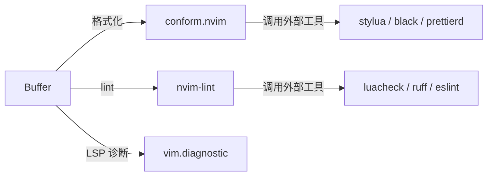

# 19 — 格式化与 Linter：conform.nvim + nvim-lint

> 所属计划: Neovim + Lua 配置实战 (现代深化版)
> 预计耗时: 55 分钟
> 前置知识: [[09-modern-lsp]]、[[18-diagnostics-deep]]

---

## 1. 概念讲解

### 1.1 为什么需要独立 formatter / linter

LSP server 本身可以提供格式化（`textDocument/formatting`）和诊断，但很多语言生态已经把这两个职责拆给了更专业的外部工具：

- **Formatter**：`stylua`、`black`、`prettierd`、`gofmt` 等，只负责把代码排版成统一风格。
- **Linter**：`luacheck`、`ruff`、`eslint_d`、`shellcheck` 等，负责静态检查、发现潜在错误。

使用独立工具的好处：

- 不依赖 LSP server 是否支持格式化。
- 可以组合多个 formatter（先 `isort` 再 `black`）。
- 可以在 LSP 之外运行 linter，得到更细粒度的检查。



### 1.2 LSP 格式化 vs 外部工具格式化

| 维度 | LSP 格式化 | 外部 formatter |
|------|-----------|----------------|
| 配置入口 | `vim.lsp.buf.format()` | `conform.nvim` |
| 可组合性 | 单一 server | 多个工具顺序执行 |
| 速度 | 依赖 LSP | 通常更快（专用进程） |
| 社区标准 | 部分语言较弱 | 通常更贴近社区规范 |
| 典型工具 | lua_ls、rust_analyzer | stylua、black、prettierd |

> [!note]
> conform.nvim 的 `default_format_opts.lsp_format = 'fallback'` 表示"优先用外部 formatter，没有外部 formatter 时再回退到 LSP"。这是现代配置的推荐做法。

### 1.3 conform.nvim 格式化

conform.nvim 是 Neovim 上最流行的格式化插件之一。它支持：

- `format_on_save`：保存时自动格式化。
- `formatters_by_ft`：按文件类型指定 formatter。
- 多 formatter 顺序执行。
- `stop_after_first`：多个候选中只要一个成功就停止。
- 注入 formatter（`injected`）：格式化代码块中的嵌入式语言。

### 1.4 nvim-lint linter

nvim-lint 是轻量级 linter 运行器：

- 通过 `linters_by_ft` 按文件类型指定 linter。
- 在 `BufWritePost` 或 `InsertLeave` 时调用 `require('lint').try_lint()`。
- 把 linter 输出转换成 `vim.diagnostic` 可显示的诊断。

### 1.5 mason-tool-installer 的角色

Mason 负责安装 LSP server、formatter、linter。`mason-tool-installer.nvim` 可以批量确保工具存在：

```lua
require('mason-tool-installer').setup {
  ensure_installed = { 'stylua', 'ruff', 'prettierd', 'luacheck' },
}
```

---

## 2. 代码示例

### 2.1 conform.nvim 完整配置

下面这份配置来自 research-brief 第 3.8 节，是 kickstart.nvim master 的现代范式：

```lua
-- init.lua Section: Formatting
-- 要求: Neovim 0.12.3+

local gh = function(repo) return 'https://github.com/' .. repo end

vim.pack.add { gh 'stevearc/conform.nvim' }

require('conform').setup {
  notify_on_error = false,
  format_on_save = function(bufnr)
    local enabled = { lua = true, python = true }  -- 按需启用
    return enabled[vim.bo[bufnr].filetype] and { timeout_ms = 500 } or nil
  end,
  default_format_opts = { lsp_format = 'fallback' },  -- 优先外部 formatter，回退 LSP
  formatters_by_ft = {
    lua = { 'stylua' },
    python = { 'isort', 'black' },
    javascript = { 'prettierd', 'prettier', stop_after_first = true },
    typescript = { 'prettierd', 'prettier', stop_after_first = true },
    json = { 'prettierd' },
    markdown = { 'prettierd', 'injected' },
    sh = { 'shellharden' },
    go = { 'gofmt' },
    c = { 'clang-format' },
    cpp = { 'clang-format' },
  },
}

-- 手动格式化映射
vim.keymap.set({ 'n', 'v' }, '<leader>f', function()
  require('conform').format { async = true }
end, { desc = '[F]ormat' })
```

**运行方式：**

1. 安装 Mason 并通过 `mason-tool-installer` 安装 `stylua`、`black`、`prettierd` 等。
2. 把上述代码加入 `init.lua`。
3. 打开一个 Lua 文件，故意把缩进写乱。
4. 按 `<leader>f` 或在 `enabled` 列表中保存文件，代码应被 stylua 格式化。

### 2.2 多 formatter 顺序执行

`formatters_by_ft` 的数组会**按顺序**执行。例如 Python 常见组合：

```lua
formatters_by_ft = {
  python = { 'isort', 'black' },
}
```

执行顺序：

1. `isort` 整理 import 顺序。
2. `black` 格式化整体代码。

> [!important]
> 顺序很重要。如果你先 `black` 后 `isort`，`isort` 会把 `black` 排好的 import 重新分组，可能再次触发格式变化。

### 2.3 `stop_after_first`

当某个 formatter 可能有多个实现（如 prettierd / prettier），可以设置 `stop_after_first = true`：

```lua
formatters_by_ft = {
  javascript = { 'prettierd', 'prettier', stop_after_first = true },
  typescript = { 'prettierd', 'prettier', stop_after_first = true },
  css = { 'prettierd', 'prettier', stop_after_first = true },
}
```

含义：先尝试 `prettierd`（守护进程，更快），失败或未安装则回退到 `prettier`，成功后不再继续。

### 2.4 按 filetype 启用 format_on_save 的函数模式

`format_on_save` 可以是一个函数，返回格式化选项或 `nil`（表示不格式化）：

```lua
format_on_save = function(bufnr)
  -- 禁用包含这些目录的文件
  local ignore_filetypes = { 'sql', 'markdown' }
  if vim.tbl_contains(ignore_filetypes, vim.bo[bufnr].filetype) then
    return nil
  end

  -- 大型文件跳过格式化
  local max_lines = 5000
  if vim.api.nvim_buf_line_count(bufnr) > max_lines then
    return nil
  end

  return { timeout_ms = 500, lsp_format = 'fallback' }
end
```

### 2.5 注入 formatter（injected）

`injected` formatter 可以格式化 Markdown、HTML 或字符串中嵌入的其他语言代码块：

```lua
formatters_by_ft = {
  markdown = { 'prettierd', 'injected' },
}
```

例如下面的 Markdown 文件中的 Lua 代码块会被 `stylua` 自动格式化。

````markdown
```lua
local  x=1
```
````

保存后会变成：

````markdown
```lua
local x = 1
```
````

> [!tip]
> `injected` 依赖 treesitter 识别嵌入语言。确保你已经安装了对应语言的 parser。

### 2.6 自定义 formatter

如果 conform 没有你需要的内置 formatter，可以自定义：

```lua
require('conform').formatters.my_custom = {
  command = 'sed',
  args = { '-i', '', 's/[[:space:]]*$//' },
  stdin = false,
}

require('conform').setup {
  formatters_by_ft = {
    text = { 'my_custom' },
  },
}
```

> [!warning]
> 自定义 formatter 时务必确认 `command` 在 PATH 中，且 `stdin`/`args` 与工具行为一致。

### 2.7 nvim-lint 完整配置

```lua
-- init.lua Section: Linting
-- 要求: Neovim 0.12.3+

local gh = function(repo) return 'https://github.com/' .. repo end

vim.pack.add { gh 'mfussenegger/nvim-lint' }

local lint = require 'lint'

lint.linters_by_ft = {
  lua = { 'luacheck' },
  python = { 'ruff' },
  javascript = { 'eslint_d' },
  typescript = { 'eslint_d' },
  sh = { 'shellcheck' },
  markdown = { 'markdownlint' },
}

-- 保存后运行 lint
vim.api.nvim_create_autocmd({ 'BufWritePost' }, {
  callback = function()
    lint.try_lint()
  end,
})

-- 离开插入模式也运行 lint（可选，较频繁）
vim.api.nvim_create_autocmd({ 'InsertLeave' }, {
  callback = function()
    lint.try_lint()
  end,
})
```

### 2.8 自定义 linter

如果 nvim-lint 没有内置某个 linter，可以手动注册：

```lua
local lint = require 'lint'

lint.linters.my_linter = {
  cmd = 'my_linter',
  stdin = true,
  args = { '--stdin' },
  ignore_exitcode = true,
  parser = function(output, bufnr, linter_cwd)
    local diagnostics = {}
    -- 把 linter 输出解析成 vim.diagnostic 格式
    for line in output:gmatch('[^\r\n]+') do
      local lnum, col, message = line:match('(%d+):(%d+):%s*(.*)')
      if lnum then
        table.insert(diagnostics, {
          lnum = tonumber(lnum) - 1,
          col = tonumber(col) - 1,
          message = message,
          severity = vim.diagnostic.severity.WARN,
        })
      end
    end
    return diagnostics
  end,
}

lint.linters_by_ft.custom = { 'my_linter' }
```

> [!note]
> 自定义 linter 的核心是 `parser` 函数：它把外部命令的文本输出转换成 `{ lnum, col, message, severity }` 数组。

### 2.9 mason-tool-installer 集成

把 formatter 和 linter 加入 Mason 自动安装列表：

```lua
vim.pack.add {
  gh 'mason-org/mason.nvim',
  gh 'mason-org/mason-lspconfig.nvim',
  gh 'WhoIsSethDaniel/mason-tool-installer.nvim',
}

require('mason').setup {}

require('mason-tool-installer').setup {
  ensure_installed = {
    -- LSP
    'lua-language-server',
    'pyright',
    -- Formatter
    'stylua',
    'black',
    'isort',
    'prettierd',
    -- Linter
    'luacheck',
    'ruff',
    'eslint_d',
  },
}
```

### 2.10 禁用 LSP 格式化（让 conform 接管）

某些 LSP server 也提供格式化（如 lua_ls）。如果你希望完全由 conform 控制，可以在 `on_init` 中关闭 server 的格式化能力：

```lua
vim.lsp.config('lua_ls', {
  cmd = { 'lua-language-server' },
  filetypes = { 'lua' },
  root_markers = { '.luarc.json', '.git' },
  on_init = function(client)
    client.server_capabilities.documentFormattingProvider = false
    client.server_capabilities.documentRangeFormattingProvider = false
  end,
})
vim.lsp.enable('lua_ls')
```

> [!important]
> 关闭 LSP 格式化后，`:lua vim.lsp.buf.format()` 对该 server 将不再生效。请确保 conform 已正确配置对应 filetype。

### 2.11 conform + nvim-lint 协作完整示例

下面把格式化、lint、诊断配置组合在一起：

```lua
-- init.lua Section: Formatting + Linting + Diagnostics
-- 要求: Neovim 0.12.3+

local gh = function(repo) return 'https://github.com/' .. repo end

vim.pack.add {
  gh 'stevearc/conform.nvim',
  gh 'mfussenegger/nvim-lint',
  gh 'mason-org/mason.nvim',
  gh 'WhoIsSethDaniel/mason-tool-installer.nvim',
}

require('mason').setup {}
require('mason-tool-installer').setup {
  ensure_installed = { 'stylua', 'luacheck', 'ruff', 'black', 'isort' },
}

-- 格式化
require('conform').setup {
  notify_on_error = false,
  format_on_save = function(bufnr)
    local enabled = { lua = true, python = true }
    return enabled[vim.bo[bufnr].filetype] and { timeout_ms = 500 } or nil
  end,
  default_format_opts = { lsp_format = 'fallback' },
  formatters_by_ft = {
    lua = { 'stylua' },
    python = { 'isort', 'black' },
  },
}

vim.keymap.set({ 'n', 'v' }, '<leader>f', function()
  require('conform').format { async = true }
end, { desc = '[F]ormat' })

-- Lint
local lint = require 'lint'
lint.linters_by_ft = {
  lua = { 'luacheck' },
  python = { 'ruff' },
}

vim.api.nvim_create_autocmd({ 'BufWritePost', 'InsertLeave' }, {
  callback = function()
    lint.try_lint()
  end,
})

-- Diagnostic UI
vim.diagnostic.config {
  update_in_insert = false,
  severity_sort = true,
  float = { border = 'rounded', source = 'if_many' },
  virtual_text = true,
  signs = {
    text = {
      [vim.diagnostic.severity.ERROR] = 'E',
      [vim.diagnostic.severity.WARN] = 'W',
    },
  },
}
```

### 2.12 常见 formatter / linter 清单

下面是常见语言对应的工具推荐：

| 语言 | Formatter | Linter |
|------|-----------|--------|
| Lua | stylua | luacheck |
| Python | isort + black | ruff |
| JavaScript / TypeScript | prettierd / prettier | eslint_d / eslint |
| Go | gofmt | staticcheck |
| C / C++ | clang-format | clang-tidy |
| Rust | rustfmt | clippy |
| Shell | shfmt / shellharden | shellcheck |
| JSON / YAML / Markdown | prettierd | — |

---

## 3. 练习

### 练习 1: 为 Lua 配置 stylua + luacheck

写一份配置：保存 Lua 文件时自动用 stylua 格式化；保存和离开插入模式时用 luacheck 检查。

### 练习 2: 为 Python 配置 ruff

配置 conform 使用 `black` 格式化 Python，nvim-lint 使用 `ruff` 检查 Python。保存时同时触发格式化和 lint。

### 练习 3: 禁用 lua_ls 的格式化能力

修改 `lua_ls` 的 `on_init`，关闭 `documentFormattingProvider` 和 `documentRangeFormattingProvider`，确保 conform 的 stylua 完全接管 Lua 格式化。

### 练习 4: 多 formatter 顺序与 `stop_after_first`

为 Python 配置 `{ 'isort', 'black' }` 顺序执行，为 JavaScript 配置 `{ 'prettierd', 'prettier', stop_after_first = true }`。分别测试安装和未安装 `prettierd` 时的行为。

## 3.5 参考答案

> [!tip]- 练习 1 参考答案
> Lua 格式化 + lint 完整配置：
>
> ```lua
> local gh = function(repo) return 'https://github.com/' .. repo end
>
> vim.pack.add {
>   gh 'stevearc/conform.nvim',
>   gh 'mfussenegger/nvim-lint',
> }
>
> require('conform').setup {
>   format_on_save = function(bufnr)
>     return vim.bo[bufnr].filetype == 'lua' and { timeout_ms = 500 } or nil
>   end,
>   default_format_opts = { lsp_format = 'fallback' },
>   formatters_by_ft = { lua = { 'stylua' } },
> }
>
> local lint = require 'lint'
> lint.linters_by_ft = { lua = { 'luacheck' } }
>
> vim.api.nvim_create_autocmd({ 'BufWritePost', 'InsertLeave' }, {
>   callback = function()
>     lint.try_lint()
>   end,
> })
> ```
>
> 测试步骤：
>
> 1. 确保 Mason 已安装 `stylua` 和 `luacheck`。
> 2. 写一个缩进混乱的 Lua 文件，保存，观察 stylua 是否整理格式。
> 3. 写一个使用了未定义全局变量（如 `foo()`）的 Lua 文件，保存，观察 luacheck 是否报错。

> [!tip]- 练习 2 参考答案
> Python 格式化 + lint 配置：
>
> ```lua
> require('conform').setup {
>   format_on_save = function(bufnr)
>     return vim.bo[bufnr].filetype == 'python' and { timeout_ms = 500 } or nil
>   end,
>   default_format_opts = { lsp_format = 'fallback' },
>   formatters_by_ft = { python = { 'black' } },
> }
>
> local lint = require 'lint'
> lint.linters_by_ft = { python = { 'ruff' } }
>
> vim.api.nvim_create_autocmd('BufWritePost', {
>   callback = function()
>     require('conform').format { bufnr = 0 }
>     lint.try_lint()
>   end,
> })
> ```
>
> **关键点**：`format_on_save` 和 `BufWritePost`  autocmd 都会保存时触发。如果你想让两者一起工作，通常只保留 `format_on_save`，让 autocmd 专门负责 lint，避免重复格式化。

> [!tip]- 练习 3 参考答案
> 禁用 lua_ls 格式化的 `on_init`：
>
> ```lua
> vim.lsp.config('lua_ls', {
>   cmd = { 'lua-language-server' },
>   filetypes = { 'lua' },
>   root_markers = { '.luarc.json', '.git' },
>   settings = {
>     Lua = {
>       runtime = { version = 'LuaJIT' },
>       diagnostics = { globals = { 'vim' } },
>     },
>   },
>   on_init = function(client)
>     client.server_capabilities.documentFormattingProvider = false
>     client.server_capabilities.documentRangeFormattingProvider = false
>   end,
> })
> vim.lsp.enable('lua_ls')
> ```
>
> 验证方式：
>
> 1. 保存一个 Lua 文件，确认格式化行为来自 stylua（观察是否按 stylua 规则排版）。
> 2. 运行 `:lua vim.lsp.buf.format()`，应无效果或提示没有可用 formatter。

> [!tip]- 练习 4 参考答案
> 多 formatter 与 `stop_after_first`：
>
> ```lua
> require('conform').setup {
>   formatters_by_ft = {
>     python = { 'isort', 'black' },
>     javascript = { 'prettierd', 'prettier', stop_after_first = true },
>   },
>   format_on_save = function(bufnr)
>     local enabled = { python = true, javascript = true }
>     return enabled[vim.bo[bufnr].filetype] and { timeout_ms = 500 } or nil
>   end,
> }
> ```
>
> 行为说明：
>
> - Python：`isort` 先执行整理 import，然后 `black` 执行整体格式化，两者都会运行。
> - JavaScript：先尝试 `prettierd`；如果 `prettierd` 返回成功，不再运行 `prettier`；如果失败或未安装，则回退到 `prettier`。
>
> **关键点**：`stop_after_first` 只影响"同一数组内"的候选；不同 filetype 之间互不影响。

> [!note] 答案使用方式
> 先独立完成练习，再展开查看参考答案。参考答案不是唯一解——如果你的实现通过了测试或达到了题目要求，就是正确的。

---

## 4. 扩展阅读

- [conform.nvim 官方文档](https://github.com/stevearc/conform.nvim)
- [nvim-lint 官方文档](https://github.com/mfussenegger/nvim-lint)
- [mason-tool-installer.nvim](https://github.com/WhoIsSethDaniel/mason-tool-installer.nvim)
- [stylua 配置说明](https://github.com/JohnnyMorganz/StyLua)
- [ruff 官方文档](https://docs.astral.sh/ruff/)
- [[18-diagnostics-deep]] — 诊断 UI 配置教程

---

## 常见陷阱

- **忘记安装外部 formatter / linter**：conform 和 nvim-lint 只是调用者，工具本身需要 Mason 或系统包管理器安装。
- **LSP 和 conform 同时格式化**：如果 LSP server 也提供格式化，可能和 conform 冲突。通过 `on_init` 关闭 LSP 格式化能力。
- **`format_on_save` 返回 `{}` 表示启用默认格式化**：返回 `nil` 才跳过。不要误把 `{}` 当成"不格式化"。
- **多 formatter 顺序错误**：例如 Python 中先 `black` 后 `isort` 会导致 import 重新排序后又需要再次格式化。
- **nvim-lint 不自动触发**：必须自己创建 `BufWritePost` 或 `InsertLeave` autocmd 调用 `try_lint()`。
- **`stop_after_first` 和顺序执行混淆**：`stop_after_first = true` 表示"任一成功即停"，不是"全部顺序执行"。
- **`injected` formatter 失败**：通常是 treesitter parser 未安装，或嵌入语言没有对应 formatter。
- **Windows 上 shell 工具路径问题**：确保 Mason 安装的 `.cmd` 包装器在 PATH 中，否则 conform 可能找不到 `stylua` 等命令。
