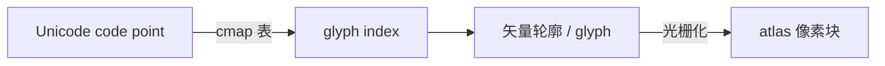
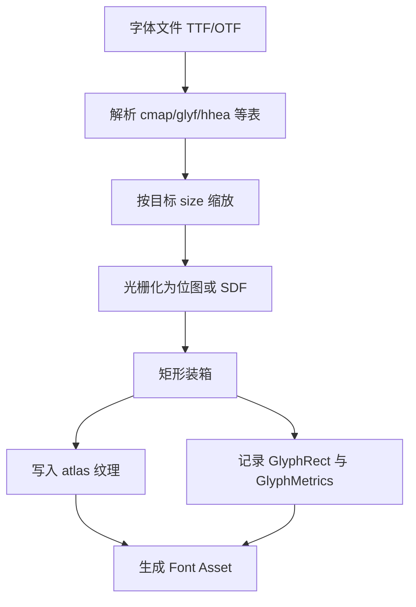

# 文字渲染基础：glyph、metrics、atlas、光栅化

> 所属计划: [[plan|Unity 字体系统学习计划]]
> 预计耗时: 60 min
> 前置知识: 无

---

## 1. 概念讲解

游戏/UI 中的文字渲染并不是"把字符串画到屏幕上"这么简单。从操作系统里的 `.ttf` 文件，到 Unity 中看到的清晰文字，中间经历了 **字符 → 字形 → 度量 → 光栅化 → 图集 → 网格** 多个阶段。本章把这些基础概念串起来，为后续 TextMeshPro / TextCore / UI Toolkit 的学习打好地基。

### 为什么需要这个？

在 Unity 里拖一个字体到 TextMeshPro 的 Font Asset Creator，点击 Generate，就能得到一张带字的图。但为什么有时候字会模糊？为什么中文字体文件那么大？为什么动态图集会卡顿？这些问题的答案都藏在本章的基础概念里：

- 字体文件不是图片，它保存的是**矢量轮廓**和**字符映射表**。
- 一个 Unicode 字符可能对应多个 glyph，也可能不对应任何 glyph（例如控制字符）。
- 文字排版依赖 **metrics** 计算行高、基线、字间距。
- 为了在 GPU 上高效渲染，需要预先把 glyph 光栅化并打包成 **atlas 纹理**。

不理解这些，后面调 SDF、fallback、动态图集就只能"凭感觉"。

### 核心思想

#### 1.1 字体文件里有什么（TTF/OTF 表结构）

TrueType（`.ttf`）和 OpenType（`.otf`）本质上是一组**表（table）**的集合。渲染一段文字时，引擎会按需查询这些表：

| 表名 | 作用 | Unity 中的对应概念 |
|------|------|-------------------|
| `cmap` | Unicode code point → glyph index 映射 | Font Asset 的 Character Table |
| `glyf` / `CFF` | 每个 glyph 的矢量轮廓（二次贝塞尔 / 三次贝塞尔） | 光栅化后的 atlas 像素 / SDF 场 |
| `head` | 全局信息：em-square 大小、字体范围、单位制 | Face Info 中的 scale、unitsPerEM |
| `hhea` | 水平排版全局度量：ascender、descender、lineGap | Face Info 的 ascender / descender / line height |
| `hmtx` | 每个 glyph 的 advance width 和 left side bearing | `GlyphMetrics.horizontalAdvance`、`horizontalBearingX` |
| `kern` / `GPOS` | 字距调整（kerning） | TMP 的 Kerning Table / TextCore 的字距对 |
| `name` | 字体名称、版权、多语言名称 | Font Asset 的 font name |

> [!note] em-square
> 字体设计时使用的虚拟方框，常见大小为 1024 或 2048 FUnits。所有 glyph 坐标和 metrics 都先在这个单位系下描述，再按目标字号缩放到像素。

Unity 不会直接在运行时解析这些原始表。Editor 导入字体或创建 Font Asset 时，会把它们转换成更高效的内部结构：Character Table、Glyph Table、Face Info 和 atlas texture。

#### 1.2 字符 vs 字形（Character vs Glyph）

这是最容易混淆的一对概念：

- **Character（字符）**：语义单位，由 Unicode code point 表示，例如 `U+4E2D` 表示"中"。
- **Glyph（字形）**：字体中实际被渲染出来的图形。一个字符在不同字体里对应不同的 glyph；同一个 glyph 也可能被多个字符共享。

典型例子：

- 大写字母 "A" 和全角 "Ａ" 是不同的 code point，但在某些字体里可能**复用同一个 glyph** 并通过排版宽度区分。
- 连字 "fi" 在高端字体中是一个单独 glyph，对应两个字符 `f` + `i`。
- 阿拉伯语中，同一个字母在不同位置（词首/词中/词尾）会呈现为不同 glyph。


Unity 的 Font Asset 里同时维护两张表：

- **Character Table**：`Unicode → glyph index`。
- **Glyph Table**：`glyph index → GlyphMetrics + GlyphRect`。

这种拆分让多个字符可以指向同一个 glyph，也便于复用图集中的像素块。

#### 1.3 字体度量（Font Metrics）

排版引擎要把 glyph 摆到正确位置，靠的就是 metrics。下图展示了一条文本行中各个度量的几何关系：

```text
              ↑ ascender
    ──────────┬──────────  行框顶（line top）
              │
         ┌────┴────┐
         │   A     │
    ─────┤         ├────── baseline
         │         │
         └────┬────┘
              │
    ──────────┴──────────  行框底（line bottom）
              ↓ descender
```
关键术语：

| 术语 | 含义 | 在 Unity / TextCore 中的位置 |
|------|------|------------------------------|
| **Baseline** | 字符排版的基准线，大部分 glyph 坐落其上 | TMP 网格生成时作为 y=0 参考 |
| **Ascender** | baseline 到字形最高点的距离 | `FaceInfo.ascender` |
| **Descender** | baseline 到字形最低点的距离（通常取负值） | `FaceInfo.descender` |
| **Line Height** | 相邻两行 baseline 的间距，≈ ascender − descender + lineGap | `FaceInfo.lineHeight` |
| **Advance** | 当前 glyph 排版后，光标向右移动的距离 | `GlyphMetrics.horizontalAdvance` |
| **BearingX / BearingY** | glyph 原点相对于 baseline 的偏移 | `GlyphMetrics.horizontalBearingX` / `horizontalBearingY` |
| **Width / Height** | glyph 包围盒的宽度和高度 | `GlyphMetrics.width` / `height` |

> [!tip]
> `horizontalBearingY` 通常是从 baseline 到 glyph 顶部的距离。如果 bearingY 小于 height，说明 glyph 有一部分会沉到 baseline 下方（例如 `g`、`j`、`p`）。

这些值在字体文件里是 **FUnits**，Unity 会按目标字号缩放为像素值。缩放公式大致为：

$$
\text{pixel} = \frac{\text{FUnit} \times \text{fontSize}}{\text{unitsPerEM}}
$$

#### 1.4 位图光栅化 vs 矢量轮廓渲染

字体文件存的是矢量轮廓。要显示到屏幕，必须变成像素，这个过程叫 **光栅化（Rasterization）**。主要有两条路线：

| 方案 | 原理 | 优点 | 缺点 | 典型场景 |
|------|------|------|------|----------|
| **位图光栅化** | 按目标字号直接生成灰度/RGBA 像素 | 小字号清晰、适合像素风、GPU 采样简单 | 放大变糊、每个字号都要重生成 | UI 小字、复古像素游戏 |
| **矢量实时渲染** | CPU/GPU 在片元着色器里计算轮廓覆盖 | 无限缩放清晰 | 计算成本高、复杂字形 fill rule 难处理 | 高端矢量图形库、PDF 渲染 |
| **SDF 光栅化** | 预生成"到最近轮廓的有符号距离场" | 缩放清晰、便于描边/发光/阴影 | 预处理开销、小字可能发虚、占用图集空间 | TextMeshPro 默认方案 |

Unity 的 TextMeshPro 默认使用 **SDF（Signed Distance Field）**：在导入字体时把每个 glyph 光栅化成一张"距离图"，运行时只采样这张 distance field，就能用同一个 atlas 渲染任意大小的文字。下一章会专门展开 SDF。

#### 1.5 纹理图集（Texture Atlas）与打包

如果每显示一个字都去字体文件里解析一次 glyph、光栅化一次，性能根本吃不消。所以 Unity 会预先把常用 glyph 光栅化后放到一张大图里，这就是 **atlas（纹理图集）**。

atlas 的核心问题变成：**如何把大小不一的 glyph 矩形高效地塞进一张大纹理？**

常见策略：

- **矩形装箱（Rectangle Bin Packing）**：按面积或高度排序，逐个放入剩余空间。Unity Font Asset Creator 内部使用的就是这类算法。
- **Padding**：每个 glyph 四周留空，避免采样时闯入相邻 glyph 的像素；对 SDF 还要给距离场渐变留足够空间。
- **Mipmaps**：为 atlas 生成 mipmap，远距离或小字减少走样。但会占用 1/3 额外内存，UI 文字通常可关闭。
- **多图集**：CJK/emoji 字符集巨大，单张 2048×2048 不够时，拆成多个 atlas 或 fallback asset。

> [!warning] Padding 比例
> 经验上 sampling point size : padding ≈ 10:1。例如 64 px 采样 + 6 px padding。padding 太小会导致 SDF 描边、发光特效穿帮；太大会浪费图集空间。


---

## 2. 代码示例

### 示例 1：Unity 中读取 `Font` 并打印 glyph metrics

下面这个脚本使用 Unity 自带的 `UnityEngine.Font` API。它会把字符串里每个字符请求到动态字体纹理，然后输出对应 glyph 的像素尺寸、bearing 和 advance。注意这是**概念演示**，实际项目里推荐用 TextMeshPro 的 Font Asset 获取更完整的 metrics。

```csharp
using UnityEngine;

public class GlyphMetricsPrinter : MonoBehaviour
{
    [SerializeField] private Font font;
    [SerializeField] private int fontSize = 64;
    [SerializeField] private string sampleText = "Unity字体A";

    void Start()
    {
        if (font == null)
        {
            Debug.LogError("请在 Inspector 中赋值一个 Font（如 Arial.ttf / 思源黑体）");
            return;
        }

        // 请求把 sampleText 中的字符渲染到内部动态图集
        font.RequestCharactersInTexture(sampleText, fontSize);

        foreach (char c in sampleText)
        {
            if (!font.GetCharacterInfo(c, out CharacterInfo info, fontSize))
            {
                Debug.LogWarning($"无法获取字符 '{c}' 的 glyph 信息");
                continue;
            }

            // 注意：以下字段名称在不同 Unity 版本中可能略有差异，以当前版本为准。
            Debug.Log($"字符: '{c}'\n" +
                      $"  glyph size: {info.glyphWidth} x {info.glyphHeight} px\n" +
                      $"  minX/maxX/minY/maxY: {info.minX}/{info.maxX}/{info.minY}/{info.maxY}\n" +
                      $"  advance: {info.advance}\n" +
                      $"  uvBottomLeft: {info.uvBottomLeft}, uvTopRight: {info.uvTopRight}");
        }
    }
}
```
**运行方式：**

1. 在 Unity 2021.3 LTS 或更高版本中创建 3D 项目。
2. 把任意 `.ttf` 或 `.otf` 字体拖进 `Assets/Fonts/`。
3. 在场景中创建一个空 GameObject，挂载 `GlyphMetricsPrinter.cs`。
4. 把字体资源拖到脚本面板上的 `Font` 字段。
5. 运行场景，查看 Console 输出。

**预期输出（以 Arial 64 px、字符 'A' 为例，数值会因字体而异）：**

```text
字符: 'A'
  glyph size: 42 x 45 px
  minX/maxX/minY/maxY: 0/42/0/45
  advance: 43
  uvBottomLeft: (0.0078, 0.5078), uvTopRight: (0.1719, 0.9922)

字符: '中'
  glyph size: 64 x 63 px
  ...
```
> [!note]
> `CharacterInfo.minX / maxX / minY / maxY` 共同定义了 glyph 在原点周围的包围盒，本质上就是 bearing + width/height 的另一种表达。TextMeshPro / TextCore 使用更结构化的 `GlyphMetrics`（`horizontalBearingX`、`horizontalBearingY`、`width`、`height`、`horizontalAdvance`），但概念完全一致。

### 示例 2：Python 概念级 glyph 光栅化

下面的脚本不依赖任何第三方库，只使用标准库。它把一个字形表示为一组**闭合多边形轮廓**，用扫描线 + 奇偶规则（even-odd rule）填充到 2D byte 数组，最后以 ASCII 形式打印出来。重点是理解"矢量轮廓如何变成像素"，而不是处理真实 TTF 的复杂曲线。

```python
# rasterize_glyph.py
# 运行环境: Python 3.9+
# 无外部依赖，仅演示光栅化概念

from __future__ import annotations


def edge_intersections(poly: list[tuple[float, float]], y: float) -> list[float]:
    """返回多边形边与水平线 y 的所有交点的 x 坐标。"""
    xs = []
    n = len(poly)
    for i in range(n):
        x0, y0 = poly[i]
        x1, y1 = poly[(i + 1) % n]
        # 只考虑跨越当前扫描线的边
        if (y0 > y) != (y1 > y):
            t = (y - y0) / (y1 - y0)
            xs.append(x0 + t * (x1 - x0))
    return sorted(xs)


def rasterize_polygon(
    poly: list[tuple[float, float]],
    width: int,
    height: int,
    scale: float = 1.0,
    offset_x: float = 0.0,
    offset_y: float = 0.0,
) -> list[list[int]]:
    """
    将多边形光栅化到 width x height 的 byte 数组。
    使用 even-odd rule 判断像素是否在内部。
    """
    grid = [[0 for _ in range(width)] for _ in range(height)]

    for py in range(height):
        # 像素中心对应的字形坐标 y
        y = (py + 0.5 - offset_y) / scale
        xs = edge_intersections(poly, y)
        # 成对取交点，填充区间
        for i in range(0, len(xs) - 1, 2):
            x0 = xs[i]
            x1 = xs[i + 1]
            px_start = max(0, int(x0 * scale + offset_x))
            px_end = min(width, int(x1 * scale + offset_x) + 1)
            for px in range(px_start, px_end):
                grid[height - 1 - py][px] = 255

    return grid


def print_ascii(grid: list[list[int]], threshold: int = 128) -> None:
    for row in grid:
        line = "".join("##" if v >= threshold else "  " for v in row)
        print(line)


if __name__ == "__main__":
    # 用一个简单的"A"字形多边形做演示
    # 坐标系：x 向右，y 向上；原点在左下角
    glyph_a = [
        (2.0, 0.0),
        (4.0, 0.0),
        (5.0, 3.0),
        (9.0, 3.0),
        (10.0, 0.0),
        (12.0, 0.0),
        (8.0, 12.0),
        (6.0, 12.0),
    ]

    # 内轮廓（三角形镂空）
    glyph_a_hole = [
        (6.0, 5.0),
        (8.0, 5.0),
        (7.0, 8.0),
    ]

    width, height = 40, 32
    scale = 2.0
    offset_x, offset_y = 2.0, 2.0

    canvas = [[0 for _ in range(width)] for _ in range(height)]

    # 先渲染外轮廓
    outer = rasterize_polygon(glyph_a, width, height, scale, offset_x, offset_y)
    # 再渲染内轮廓并减去
    hole = rasterize_polygon(glyph_a_hole, width, height, scale, offset_x, offset_y)

    for y in range(height):
        for x in range(width):
            canvas[y][x] = max(0, outer[y][x] - hole[y][x])

    print("概念级 glyph 光栅化结果（'A'）：")
    print_ascii(canvas)
```
**运行方式：**

```bash
python rasterize_glyph.py
```
**预期输出：**

```text
概念级 glyph 光栅化结果（'A'）：


                  ##
                ######
              ##########
            ##############
          ##################
        ######################
      ##########################
      ##########################
    ##########        ##########
    ##########        ##########
  ##########            ##########
  ##########            ##########
##############        ##############
################    ################
####################################
```
> [!tip]
> 真实 TTF 的 glyph 由二次贝塞尔曲线组成，FreeType / Unity 会先用 flatten 算法把曲线近似为多边形，再执行类似的扫描线填充。上面的脚本省略了曲线细分，只保留"多边形 → 像素"的核心思想。

---

## 3. 练习

### 练习 1: 基础 —— 统计一段文本中每个 glyph 的面积

修改示例 1 的 Unity 脚本，对 `sampleText` 中的每个字符输出：

- 字符本身
- glyph 的宽 × 高（面积）
- advance
- 面积 / advance 的比值（反映该字符在水平方向上"多宽"）

观察："i" 和 "W" 的面积与 advance 比值有何不同？

### 练习 2: 进阶 —— 在 Scene 视图中绘制 glyph 包围盒

基于示例 1，在 `OnDrawGizmos` 中把 `sampleText` 逐字符排版，并用 `Gizmos.DrawWireCube` 画出每个 glyph 的包围盒。要求：

1. 使用 `CharacterInfo.advance` 累加得到每个字符的原点 x 坐标。
2. 使用 `minX / maxX / minY / maxY` 计算包围盒在世界空间中的位置。
3. 用不同颜色区分 baseline 上方和下方的部分。

### 练习 3: 挑战 —— 给 Python 光栅化器加入反走样

示例 2 是硬边填充，放大后会有锯齿。在不引入外部库的前提下，把 `rasterize_polygon` 改写为 **4x supersampling**：每个像素内部采样 4×4 个子点，统计落在多边形内部的子点比例，作为该像素的灰度值（0–255）。输出时把灰度映射到不同密度的 ASCII 字符（例如 `"@", "%", "+", ".", " "`）。

---

## 3.5 参考答案

> [!tip]- 练习 1 参考答案
> 在 `Start()` 的循环内直接计算面积与比值：
>
> ```csharp
> int area = info.glyphWidth * info.glyphHeight;
> float ratio = info.advance > 0 ? (float)area / info.advance : 0f;
> Debug.Log($"字符 '{c}': 面积={area}, advance={info.advance}, 面积/advance={ratio:F2}");
> ```
>
> 典型观察："i" 的 advance 小、面积更小，比值可能接近 0；"W" 的 advance 大、面积也大，比值通常比 "i" 高。这说明 advance 并不完全由包围盒宽度决定，还受字体设计师的排版意图影响。

> [!tip]- 练习 2 参考答案
> 核心思路：在世界空间中以 `(cursorX + minX, baseline + minY)` 为左下角，`maxX - minX` 为宽、`maxY - minY` 为高画包围盒。
>
> ```csharp
> void OnDrawGizmos()
> {
>     if (font == null) return;
>
>     font.RequestCharactersInTexture(sampleText, fontSize);
>
>     float cursorX = 0f;
>     float baseline = 0f;
>
>     foreach (char c in sampleText)
>     {
>         if (!font.GetCharacterInfo(c, out CharacterInfo info, fontSize))
>             continue;
>
>         float w = info.maxX - info.minX;
>         float h = info.maxY - info.minY;
>         Vector3 center = new Vector3(
>             cursorX + info.minX + w * 0.5f,
>             baseline + info.minY + h * 0.5f,
>             0f
>         );
>
>         // baseline 上方用青色，下方用橙色
>         bool belowBaseline = info.minY < 0;
>         Gizmos.color = belowBaseline ? Color.yellow : Color.cyan;
>         Gizmos.DrawWireCube(center, new Vector3(w, h, 0.1f));
>
>         cursorX += info.advance;
>     }
>
>     // 画 baseline
>     Gizmos.color = Color.red;
>     Gizmos.DrawLine(new Vector3(0, baseline, 0), new Vector3(cursorX, baseline, 0));
> }
> ```
>
> 注意 `OnDrawGizmos` 会在 Editor 模式下每帧调用，适合可视化调试；运行时也生效。

> [!tip]- 练习 3 参考答案（可选）
> 反走样的关键是"子采样 + 比例"。把扫描线函数改成在每个像素内采样 4×4 子点：
>
> ```python
> def rasterize_polygon_aa(poly, width, height, scale=1.0, offset_x=0.0, offset_y=0.0, samples=4):
>     grid = [[0.0 for _ in range(width)] for _ in range(height)]
>     step = 1.0 / samples
>     for py in range(height):
>         for px in range(width):
>             inside = 0
>             for sy in range(samples):
>                 for sx in range(samples):
>                     y = (py + (sy + 0.5) * step - offset_y) / scale
>                     x = (px + (sx + 0.5) * step - offset_x) / scale
>                     if is_point_in_polygon(poly, x, y):  # 需实现 even-odd 点包含测试
>                         inside += 1
>             grid[height - 1 - py][px] = (inside / (samples * samples)) * 255
>     return grid
> ```
>
> `is_point_in_polygon` 可用水平射线穿越法：从点向右发射射线，统计与多边形边相交次数，奇数在内。
>
> 灰度到 ASCII 映射示例：`["@", "%", "#", "*", "+", "=", "-", ":", ".", " "]`。灰度越高，使用越"密"的字符。

> [!note] 答案使用方式
> 先独立完成练习，再展开查看参考答案。参考答案不是唯一解——如果你的实现通过了测试或达到了题目要求，就是正确的。

---

## 4. 扩展阅读

- [TextMeshPro Font Asset Creator](https://docs.unity3d.com/Packages/com.unity.textmeshpro@3.2/manual/FontAssetsCreator.html)
- [TextMeshPro About SDF fonts](https://docs.unity3d.com/Packages/com.unity.textmeshpro@3.2/manual/FontAssetsSDF.html)
- [Unity Scripting API: TextCore.GlyphMetrics](https://docs.unity3d.com/ScriptReference/TextCore.GlyphMetrics.html)
- [Unity Scripting API: TextCore.GlyphRect](https://docs.unity3d.com/ScriptReference/TextCore.GlyphRect.html)
- [Microsoft OpenType Specification](https://learn.microsoft.com/en-us/typography/opentype/spec/)
- [Apple TrueType Reference Manual](https://developer.apple.com/fonts/TrueType-Reference-Manual/)
- [FreeType Glyph Conventions](https://freetype.org/freetype2/docs/glyphs/glyphs-1.html)

---

## 常见陷阱

- **混淆 character 和 glyph**：认为 "一个字符一定对应一个字形"。正确做法是：理解 Unicode → glyph index 的映射可能是一对多、多对一，甚至为空（例如换行符、零宽连接符）。
- **把 em-square 直接当像素**：字体原始坐标是 FUnits，需要按 `fontSize / unitsPerEM` 缩放。正确做法是：所有 metrics 都要经过缩放后再用于屏幕像素计算。
- **忽略 bearing**：只根据 glyph 宽度拼接文字会导致重叠或间距不均。正确做法是：排版以 advance 为主，bearing 负责微调 glyph 相对原点的位置。
- **atlas padding 设得太小**：SDF 特效需要足够的外部渐变区。正确做法是：保持 sampling point size : padding ≈ 10:1，出现穿帮时优先增大 padding。
- **动态字体每帧改字**：`UnityEngine.Font.RequestCharactersInTexture` 会在内部图集满了之后重建。正确做法是：把频繁变化的文字尽量限定在已知字符集内，或用 TextMeshPro 的 static atlas 预烘焙。
- **漏看 kerning**：字体里的 `kern` / `GPOS` 表会让某些字符对（如 "AV"、"To"）的间距明显不同。正确做法是：在 TMP / TextCore 中启用 kerning，排版标题时尤为重要。
