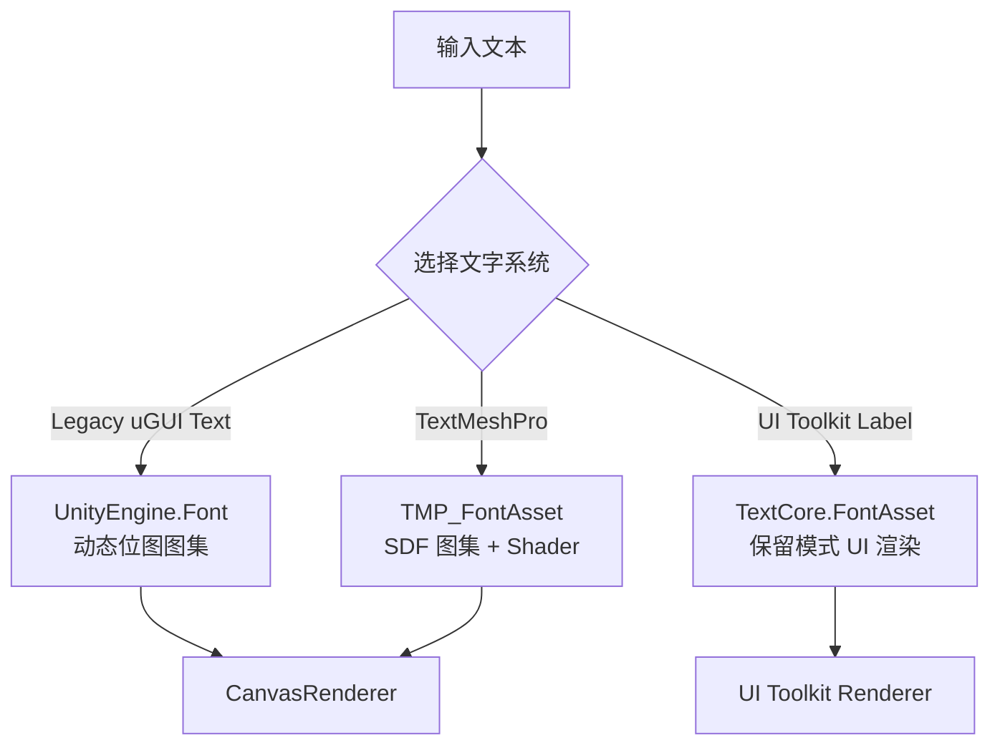

# Unity 三大文字系统全景

> 所属计划: [[plan|Unity 字体系统学习计划]]
> 预计耗时: 45 min
> 前置知识: [[01-text-rendering-fundamentals|文字渲染基础]]

---

## 1. 概念讲解

### 为什么需要这个？

Unity 并不是一次性造出现在的文字方案，而是随着项目需求、移动平台性能压力和 Editor 工具化演进，逐步引入了三套文字系统：

1. **Legacy uGUI `Text`**：早期 uGUI 时代的位图动态字体方案。
2. **TextMeshPro**：被 Unity 收购后集成的 SDF 文字方案，长期作为实际标准。
3. **UI Toolkit `Label` / TextCore**：Unity 2021+ 主推的新一代 UI 与文字引擎。

它们共享同一个终极目标——把字符变成屏幕上的四边形网格——但实现方式差异巨大：有的靠运行时动态光栅化，有的靠预烘焙 SDF 图集，有的则服务于保留式 UI 布局。选错系统，轻则文字发虚、draw call 爆炸，重则编辑器扩展无法维护、世界空间文字难以渲染。

理解三者的能力边界，是在 Unity 项目中做字体决策的前提。

### 核心思想

可以把三套系统类比成三种印刷技术：

- **Legacy uGUI `Text`** 像老式点阵打印机：字号固定时清晰，一旦放大就会 saw-tooth/发虚；每遇到新字或新字号，都要重新“打印”一张字模纸（动态图集更新）。
- **TextMeshPro** 像矢量激光印刷：预先在字模纸上记录“到字形轮廓的距离”（SDF），印刷时按距离阈值重绘边缘，因此无论字号多大都锐利，还能轻松做描边、发光、阴影。
- **UI Toolkit / TextCore** 像网页排版引擎：文字只是保留式 UI 树中的一个节点，通过 USS 样式和布局系统自动排布，天生适合复杂 Editor 工具和数据驱动界面。


---

### Legacy uGUI `Text`：`UnityEngine.UI.Text`

`UnityEngine.UI.Text` 是 uGUI 诞生之初的文字组件，直接挂在 Canvas 下使用。

它的字体资源是 `UnityEngine.Font`，本质上是对 TrueType/OpenType 文件的运行时引用。渲染时，Unity 会在后台维护一张**动态位图图集**（`Font.texture`）：当某个字符以某个字号第一次出现时，把它光栅化到这张图集上，再生成 quad 渲染。

核心限制：

- **分辨率绑定字号**：位图被光栅化后就是像素，放大必然模糊。
- **图集重建开销**：遇到缺字、换字号、换字体时，图集会重新填充，造成帧率尖峰。
- **视觉特效匮乏**：只有简单的 Shadow、Outline 组件，无法做 SDF 描边、发光、渐变等高级效果。
- **Rich Text 有限**：只支持 `<b>`、`<i>`、`<size>`、`<color>` 等少数标签。
- **回退能力弱**：依赖 `Font.fontNames` 回退到操作系统字体，对 CJK/emoji 支持差。
- **无法跨系统合批**： Legacy Text 的材质与 TMP、UI Toolkit 不同，无法合并 draw call。

**结论**：2026 年开始的新功能不应再使用它，仅在维护老项目时保留。

---

### TextMeshPro：`TMP_Text`、`TextMeshProUGUI`、`TextMeshPro`

TextMeshPro 在 2018 年被 Unity 收购并转为官方包，随后成为 Unity 项目的事实标准文字方案。

它的核心资源是 `TMP_FontAsset`：从 `.ttf/.otf` 生成，内部包含 atlas 纹理、glyph 表、character 表、face info、材质球与 shader。Atlas 默认使用 **SDF（Signed Distance Field）**，把“到最近字形轮廓的有符号距离”存进纹理，由 shader 在运行时根据距离阈值重建边缘。

三个主要组件：

| 组件 | 基类 | 使用场景 |
|------|------|----------|
| `TextMeshProUGUI` | `TMP_Text` | Canvas 下的 UI 文字 |
| `TextMeshPro` | `TMP_Text` | 世界空间 3D 文字（带 `MeshRenderer`） |
| `TMP_Text`（抽象） | — | 公共 API 与自定义派生 |

为什么它成为标准：

- **任意缩放清晰**：SDF 边缘由 shader 计算，放大不模糊。
- **高级视觉特效**：Outline、Glow、Underlay/Shadow、Dilate、渐变等全部基于距离场实现。
- **富文本标签完整**：`<b>`、`<i>`、`<color>`、`<size>`、`<sprite>`、`<style>`、`<font>`、`<align>`、`<margin>`、`<mark>` 等。
- **Static / Dynamic / Dynamic OS Population Mode**：可预烘焙常用字符，也可运行时动态扩展。
- **材质预设（Material Presets）**：同一份 atlas 可配多套材质变体。
- **Fallback 链**：缺字时按主 asset → fallback asset → global fallback → default 的顺序查找，适合多语言与 emoji。

---

### UI Toolkit `Label` 与 TextCore：`UnityEngine.TextCore.Text`

UI Toolkit 是 Unity 新一代 UI 框架，采用保留模式（retained-mode）：开发者构建 `VisualElement` 树，系统负责布局和渲染。`Label` 是显示文字的节点。

UI Toolkit 的文字渲染由 **TextCore** 引擎承担。TextCore 与 TextMeshPro 共享很多核心概念（atlas、glyph、SDF、font asset），但代码路径是独立的，并且更贴近 UI Toolkit 的渲染管线。

主要特点：

- **UXML / USS 驱动**：文字样式通过 USS 声明，结构与逻辑分离。
- **保留模式**：不需要每帧手动重建网格，属性变化时由系统增量更新。
- **Editor 原生**：`EditorWindow` 可以直接用 UI Toolkit 构建界面，是 Editor 扩展的首选。
- **TextCore Font Asset**：资源格式与 TMP 的 `TMP_FontAsset` 不同，生成方式类似但文件类型不同，不能混用。
- **Rich Text 与 SDF**：支持常见富文本标签与 SDF/Bitmap 渲染模式。
- **批处理以 Panel 为单位**：同一 `PanelSettings` 下的多个元素可以合批，不同 PanelSettings 不能合批。

世界空间文字不是 UI Toolkit 的强项。若要在 3D 场景中显示 Label，通常需要借助 RenderTexture 或 World Space Panel，复杂度和控制力不如 `TextMeshPro`。

---

### 三系统横向对比

| 维度 | Legacy uGUI `Text` | TextMeshPro (`TMP_Text`) | UI Toolkit `Label` / TextCore |
|------|--------------------|--------------------------|-------------------------------|
| 底层渲染 | 动态位图图集 (`UnityEngine.Font`) | SDF / 位图图集 (`TMP_FontAsset`) | TextCore (`TextCore.Text.FontAsset`) |
| 字体资源格式 | `.ttf/.otf` 直接引用或 OS 字体 | `.asset` Font Asset（从 TTF/OTF 生成） | `.asset` Font Asset（从 TTF/OTF 生成） |
| 缩放清晰度 | 放大后模糊、锯齿 | 任意缩放边缘锐利 | SDF 模式下任意缩放清晰 |
| Rich Text | 基础标签 | 完整标签集 + Sprite + Stylesheet | 支持常见标签（子集与 TMP 类似） |
| SDF 支持 | 否 | 是（默认） | 是 |
| 视觉特效 | 简单 Shadow/Outline | Outline、Glow、Shadow、Dilate、渐变等 | 依赖 USS/material，特效较 TMP 少 |
| 批处理 | 同 Canvas 同材质可 batch | 同 Canvas 同材质可 batch；3D 不参与 UI batch | 同 Panel / 同 PanelSettings 可 batch |
| 世界空间 3D | 不支持（需 Canvas 变通） | 原生支持 `TextMeshPro` | 需 RenderTexture / World Space Panel 变通 |
| Editor 扩展 | 不支持 | 有限（IMGUI 窗口中可嵌入） | 原生支持 |
| 推荐定位 | 老项目维护 | 游戏 UI、3D 文字、特效文字 | 新 UI、编辑器工具、复杂保留式界面 |

---

### 2026 年选型建议

- **新 UI 项目（Unity 2022.3 LTS / Unity 6+）**：
  - 若界面以数据驱动、复杂布局、Editor 工具为主，优先 **UI Toolkit**。
  - 若游戏 HUD、对话气泡、伤害数字、3D 文字、文字特效占主导，优先 **TextMeshPro**。
  - 实际项目常常两者共存：UI Toolkit 做菜单与设置，TMP 做 HUD 与特效文字。
- **世界空间文字**：直接选 `TextMeshPro`（`TextMeshPro` 组件），不要绕 UI Toolkit。
- **老项目维护**：Legacy uGUI `Text` 可以继续存在，但新功能应迁移到 TMP 或 UI Toolkit。
- **绝对不要**：在 2026 年的新功能里继续使用 Legacy uGUI `Text` 做主要文字系统。

---

## 2. 代码示例

下面给出四套完整的独立脚本，分别在运行时创建 `Legacy Text`、`TextMeshProUGUI`、`TextMeshPro`（世界空间）和 UI Toolkit `Label`，显示同样的 `Hello World`。

### 2.1 Legacy uGUI `Text`

```csharp
using UnityEngine;
using UnityEngine.UI;

public class HelloWorldLegacyText : MonoBehaviour
{
    [SerializeField] private Font font;

    void Start()
    {
        if (font == null)
        {
            Debug.LogError("请在 Inspector 中指定 Font");
            return;
        }

        // 创建 Screen Space Overlay Canvas
        var canvasGO = new GameObject("LegacyCanvas");
        var canvas = canvasGO.AddComponent<Canvas>();
        canvas.renderMode = RenderMode.ScreenSpaceOverlay;
        canvasGO.AddComponent<CanvasScaler>();
        canvasGO.AddComponent<GraphicRaycaster>();

        // 创建 Legacy Text
        var textGO = new GameObject("LegacyText");
        textGO.transform.SetParent(canvasGO.transform, false);
        var text = textGO.AddComponent<Text>();
        text.text = "Hello World";
        text.font = font;
        text.fontSize = 48;
        text.color = Color.white;
        text.alignment = TextAnchor.MiddleCenter;

        var rect = text.GetComponent<RectTransform>();
        rect.sizeDelta = new Vector2(400f, 100f);
    }
}
```
### 2.2 `TextMeshProUGUI`

```csharp
using UnityEngine;
using TMPro;

public class HelloWorldTMPUGUI : MonoBehaviour
{
    [SerializeField] private TMP_FontAsset fontAsset;

    void Start()
    {
        if (fontAsset == null)
        {
            Debug.LogError("请在 Inspector 中指定 TMP_FontAsset");
            return;
        }

        // 创建 Screen Space Overlay Canvas
        var canvasGO = new GameObject("TMP Canvas");
        var canvas = canvasGO.AddComponent<Canvas>();
        canvas.renderMode = RenderMode.ScreenSpaceOverlay;
        canvasGO.AddComponent<CanvasScaler>();
        canvasGO.AddComponent<GraphicRaycaster>();

        // 创建 TextMeshProUGUI
        var textGO = new GameObject("TMP Text");
        textGO.transform.SetParent(canvasGO.transform, false);
        var tmp = textGO.AddComponent<TextMeshProUGUI>();
        tmp.text = "Hello World";
        tmp.font = fontAsset;
        tmp.fontSize = 48;
        tmp.color = Color.white;
        tmp.alignment = TextAlignmentOptions.Center;

        var rect = tmp.GetComponent<RectTransform>();
        rect.sizeDelta = new Vector2(400f, 100f);
    }
}
```
### 2.3 世界空间 `TextMeshPro`

```csharp
using UnityEngine;
using TMPro;

public class HelloWorldTMPWorld : MonoBehaviour
{
    [SerializeField] private TMP_FontAsset fontAsset;

    void Start()
    {
        if (fontAsset == null)
        {
            Debug.LogError("请在 Inspector 中指定 TMP_FontAsset");
            return;
        }

        // 在世界空间创建 3D 文字
        var textGO = new GameObject("TMP World Text");
        var tm = textGO.AddComponent<TextMeshPro>();
        tm.text = "Hello World";
        tm.font = fontAsset;
        tm.fontSize = 10;
        tm.color = Color.white;
        tm.alignment = TextAlignmentOptions.Center;

        // TextMeshPro 自带 MeshRenderer，可直接用 Transform 定位
        textGO.transform.position = new Vector3(0f, 1.5f, 0f);
    }
}
```
### 2.4 UI Toolkit `Label`

```csharp
using UnityEngine;
using UnityEngine.UIElements;

[RequireComponent(typeof(UIDocument))]
public class HelloWorldUIToolkit : MonoBehaviour
{
    [SerializeField] private PanelSettings panelSettings;

    void Start()
    {
        if (panelSettings == null)
        {
            Debug.LogError("请在 Inspector 中指定 PanelSettings");
            return;
        }

        var uiDocument = GetComponent<UIDocument>();
        uiDocument.panelSettings = panelSettings;

        var root = uiDocument.rootVisualElement;
        root.Clear();

        var label = new Label("Hello World");
        label.style.fontSize = 48;
        label.style.color = Color.white;
        label.style.unityTextAlign = TextAnchor.MiddleCenter;
        label.style.width = Length.Percent(100);
        label.style.height = Length.Percent(100);

        root.Add(label);
    }
}
```
**运行方式:**

```text
1. 使用 Unity 2022.3 LTS 或更新版本。
2. 确认 Package Manager 中已安装 TextMeshPro（verified package）。
3. 导入任意 .ttf/.otf 字体文件。
4. 生成 Font Asset：
   - TMP：Window > TextMeshPro > Font Asset Creator，选择字体后生成 TMP_FontAsset。
   - UI Toolkit：Project 窗口中右键 Create > UI Toolkit > Font Asset，选择字体后生成。
5. 创建 Panel Settings Asset：右键 Create > UI Toolkit > Panel Settings Asset（仅 UI Toolkit 示例需要）。
6. 创建空 GameObject，分别挂载上述四个脚本之一。
7. 在 Inspector 中填入对应的 Font / TMP_FontAsset / PanelSettings。
8. 进入 Play Mode，场景中会出现对应的 Hello World。
```
**预期输出:**

```text
Scene 视图 / Game 视图中分别出现：
- Legacy Text：位于 Screen Space Overlay Canvas 中央的白色 Hello World
- TextMeshProUGUI：位于另一个 Overlay Canvas 中央的白色 Hello World（边缘更锐利）
- TextMeshPro：位于世界空间 (0, 1.5, 0) 处的白色 Hello World
- UI Toolkit Label：铺满 UIDocument Panel 中央的白色 Hello World
Console 无报错。
```
---

## 3. 练习

### 练习 1: 同一段文本在不同系统下的清晰度对比

分别用 Legacy uGUI `Text`、`TextMeshProUGUI` 和 UI Toolkit `Label` 显示同一段中英文混合文本（例如 `Hello 世界`）。

- 在 Game 视图中把窗口分辨率拉宽，或把父对象的 Scale 从 `1` 改到 `3`。
- 截图对比三套系统在放大后的边缘清晰度。
- 用文字说明：为什么 TMP 和 UI Toolkit（SDF 模式）放大后仍然清晰？

### 练习 2: 批量文字的 Batches / SetPass calls 对比

创建一个新场景，在 Canvas 下分别创建 10 个 Legacy uGUI `Text` 和 10 个 `TextMeshProUGUI`，文字内容不同但使用同一份字体资源。

- 打开 Window > Analysis > Frame Debugger，或在 Game 视图右上角开启 Stats。
- 记录两种方案的 Batches 与 SetPass calls 数量。
- 解释：
  - 同 Canvas 下哪些条件能让它们合批？
  - 如果 10 个 Legacy Text 使用 5 种不同字号， batch 数会发生什么变化？为什么 TMP 在这种情况下更有优势？

### 练习 3: 用 UI Toolkit 制作编辑器字体资源统计窗口（可选）

编写一个继承 `EditorWindow` 的 UI Toolkit 窗口，列出项目中所有的 `Font` 与 `TMP_FontAsset` 资源，并显示每个资源的 atlas 宽度、高度。

---

## 3.5 参考答案

> [!tip]- 练习 1 参考答案
> 1. Legacy Text 放大后发虚/锯齿，因为它是动态位图光栅化，放大时像素被线性插值。
> 2. TextMeshProUGUI 与 UI Toolkit（SDF 模式）放大后边缘锐利，因为 atlas 存的是到字形轮廓的距离场，shader 按阈值重绘边缘，与输出分辨率无关。
> 3. 关键代码对比：`Text.fontSize` 决定光栅化分辨率；`TextMeshProUGUI.fontSize` 只影响 shader 中的阈值采样，不改变 atlas 分辨率。

> [!tip]- 练习 2 参考答案
> 1. 若 10 个 Legacy Text 使用同一 `Font`、同一字号、同一材质，通常可合批为 1 个 SetPass call；TMP 同理。
> 2. Legacy Text 在不同字号下会触发 `Font.texture` 的额外条目或重建，可能导致 batch 增加；TMP 的 SDF atlas 与字号无关，只要 material 相同就能继续合批。
> 3. 因此 TMP 的优势不总是“batch 更少”，而是“对字号、缩放、特效变化更稳定，不会因为动态图集重建而打断 batch”。

> [!tip]- 练习 3 参考答案（可选）
> ```csharp
> using UnityEditor;
> using UnityEngine;
> using UnityEngine.UIElements;
> using TMPro;
>
> public class FontStatsWindow : EditorWindow
> {
>     [MenuItem("Tools/Font Stats")]
>     public static void ShowWindow()
>     {
>         GetWindow<FontStatsWindow>("Font Stats");
>     }
>
>     void CreateGUI()
>     {
>         var listView = new ListView();
>         listView.makeItem = () => new Label();
>         listView.bindItem = (element, index) =>
>         {
>             var label = (Label)element;
>             // 这里仅示意：实际应分别收集 Font 与 TMP_FontAsset 并统一显示
>             var guids = AssetDatabase.FindAssets("t:TMP_FontAsset");
>             if (index < guids.Length)
>             {
>                 var path = AssetDatabase.GUIDToAssetPath(guids[index]);
>                 var asset = AssetDatabase.LoadAssetAtPath<TMP_FontAsset>(path);
>                 label.text = $"{asset.name}: atlas = {asset.atlasWidth}x{asset.atlasHeight}";
>             }
>         };
>         listView.itemsSource = AssetDatabase.FindAssets("t:TMP_FontAsset");
>         rootVisualElement.Add(listView);
>     }
> }
> ```
> 进阶思路：把 `Font` 与 `TMP_FontAsset` 统一包装成一个数据类，分别读取 `Font.material.mainTexture.width/height` 与 `TMP_FontAsset.atlasWidth/atlasHeight`，再绑定到 ListView。

> [!note] 答案使用方式
> 先独立完成练习，再展开查看参考答案。参考答案不是唯一解——如果你的实现通过了测试或达到了题目要求，就是正确的。

---

## 4. 扩展阅读

- [TextMeshPro Font Asset Creator](https://docs.unity3d.com/Packages/com.unity.textmeshpro@3.2/manual/FontAssetsCreator.html)
- [TextMeshPro About SDF fonts](https://docs.unity3d.com/Packages/com.unity.textmeshpro@3.2/manual/FontAssetsSDF.html)
- [TextMeshPro Fallback font assets](https://docs.unity3d.com/Packages/com.unity.textmeshpro@3.2/manual/FontAssetsFallback.html)
- [TextMeshPro Shaders](https://docs.unity3d.com/Packages/com.unity.textmeshpro@3.2/manual/Shaders.html)
- [UI Toolkit Introduction to font assets](https://docs.unity3d.com/Manual/UIE-font-asset.html)
- [UI Toolkit Text best practices](https://docs.unity3d.com/Manual/best-practice-guides/ui-toolkit-for-advanced-unity-developers/text.html)
- [UnityCsReference TextGenerator.cs](https://github.com/Unity-Technologies/UnityCsReference/blob/master/Modules/TextCoreTextEngine/Managed/TextGenerator.cs)
- [Unity Scripting API: TextCore.Glyph](https://docs.unity3d.com/ScriptReference/TextCore.Glyph.html)

---

## 常见陷阱

- **老项目遗留 `Text` 直接用在新需求上**：Legacy uGUI `Text` 已不推荐，新功能应迁移到 TextMeshPro 或 UI Toolkit。
- **混淆 `TextMeshPro` 与 `TextMeshProUGUI`**：前者用于世界空间 3D 文字，后者用于 Canvas UI；挂错组件会导致渲染层级或批次异常。
- **没给 TMP/UI Toolkit 指定 Font Asset**：会导致文字不可见或报红色警告，必须在 Inspector 中绑定资源。
- **在 `Update` 里持续修改 `text`**：每次修改都会触发解析、布局、网格重建，是常见性能瓶颈。
- **误以为不同 PanelSettings 的 UI Toolkit 元素能合批**：只有同一 `PanelSettings` 下的元素才有机会 batch，切换 PanelSettings 会增加 draw call。
- **把 UI Toolkit `Label` 直接放世界空间**：UI Toolkit 本质是屏幕/Panel 渲染，3D 场景文字应使用 `TextMeshPro` 组件。
- **Legacy Text 的 `Best Fit`**：开启后会反复尝试字号并重排，可能触发多次动态图集重建，移动平台慎用。
