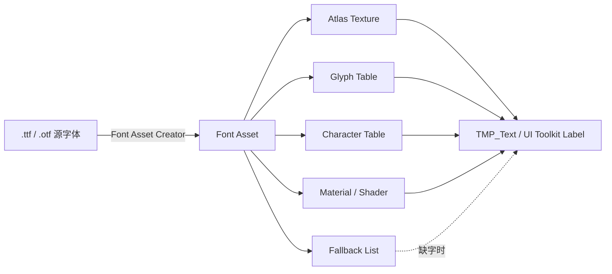

# Font Asset 创建与内部结构

> 所属计划: [[plan|Unity 字体系统学习计划]]
> 预计耗时: 75 min
> 前置知识: [[01-text-rendering-fundamentals|文字渲染基础]], [[02-unity-text-systems-overview|Unity 三大文字系统全景]]

---

## 1. 概念讲解

### 为什么需要这个？

TrueType / OpenType（`.ttf` / `.otf`）字体文件保存的是**矢量轮廓**和高级排版指令。游戏运行时如果直接解析这些轮廓并实时光栅化，CPU 开销巨大，且不同平台对字体的支持不一致。因此 Unity 文字系统会预先将源字体转换成 **Font Asset**：把需要的字形烤成一张或多张纹理图集（atlas），并附带 metrics、材质、fallback 链等元数据。这样运行时只需要查表、采样、拼 quad，渲染路径简单且跨平台一致。

Font Asset 是连接“设计端字体文件”与“运行时文字渲染”的关键中间产物。理解它的创建参数和内部结构，是后续调优 SDF 质量、排查缺字、设计 fallback 链、优化动态图集的前提。

### 核心思想

Font Asset 的核心可以概括为：**“把字从文件搬到图集，把查询从轮廓变成查表”**。

一个 Font Asset 至少包含：

- **Atlas Texture**：字形位图或 SDF 距离场。
- **Glyph Table**：每个字形在 atlas 中的位置、尺寸、步进等几何信息。
- **Character Table**：Unicode 码点到 glyph index 的映射。
- **Face Info**：整字体的全局 metrics，如 line height、ascender、descender、scale、baseline。
- **Material & Shader**：用于渲染 atlas 的 shader（如 `TextMeshPro/SDF`）。
- **Fallback Font Assets**：当前 asset 缺字时继续查找的备用字体链。
- **Font Weights / Style**：用于在缺少真实字重时模拟粗体/斜体。

下图展示了从源字体到 Font Asset 再到运行时渲染的数据流：


---

## 2. 代码示例

下面的 Editor 脚本可以挂载到任意 `TMP_FontAsset` 上（或放到 `Editor` 文件夹下作为窗口工具使用），打印选中字符集中每个字符的 glyph metrics 和在 atlas 中的矩形区域，并计算其 UV 坐标。

```csharp
// File: Assets/Editor/FontAssetInspector.cs
// 要求：Unity 2021.3+，已安装 TextMeshPro 包（com.unity.textmeshpro 3.x 或 TextMeshPro 内置包）

using System.Text;
using UnityEditor;
using UnityEngine;
using TMPro;

public class FontAssetInspector : EditorWindow
{
    [SerializeField] private TMP_FontAsset fontAsset;
    [SerializeField] private string sampleText = "ABC 中文字 123 🎮";

    private Vector2 scrollPosition;
    private string output;

    [MenuItem("Window/TextMeshPro/Font Asset Inspector")]
    public static void ShowWindow()
    {
        GetWindow<FontAssetInspector>("FontAsset Inspector");
    }

    private void OnGUI()
    {
        fontAsset = EditorGUILayout.ObjectField("Font Asset", fontAsset, typeof(TMP_FontAsset), false) as TMP_FontAsset;
        sampleText = EditorGUILayout.TextField("Sample Text", sampleText);

        if (GUILayout.Button("Inspect Glyphs"))
        {
            output = InspectGlyphs(fontAsset, sampleText);
        }

        if (!string.IsNullOrEmpty(output))
        {
            scrollPosition = EditorGUILayout.BeginScrollView(scrollPosition, GUILayout.Height(300));
            EditorGUILayout.TextArea(output, GUILayout.ExpandHeight(true));
            EditorGUILayout.EndScrollView();
        }
    }

    private static string InspectGlyphs(TMP_FontAsset asset, string text)
    {
        if (asset == null)
            return "Error: Font Asset is null.";

        var sb = new StringBuilder();
        sb.AppendLine($"Font Asset: {asset.name}");
        sb.AppendLine($"Atlas Texture: {asset.atlas?.name} ({asset.atlas?.width}x{asset.atlas?.height})");
        sb.AppendLine($"Face Info - Scale: {asset.faceInfo.scale}, Line Height: {asset.faceInfo.lineHeight}");
        sb.AppendLine($"Glyph Count: {asset.glyphTable.Count}, Character Count: {asset.characterTable.Count}");
        sb.AppendLine(new string('-', 80));
        sb.AppendLine($"{'Char',-6}{'Unicode',-10}{'Glyph',-8}{'W',-6}{'H',-6}{'Advance',-9}{'BearingX',-10}{'BearingY',-10}{'AtlasRect',-22}{'UV (min/max)'}");

        foreach (char c in text)
        {
            // 1. 通过 characterTable 查找字符
            TMP_Character character;
            if (!asset.characterLookupTable.TryGetValue(c, out character))
            {
                sb.AppendLine($"{c,-6}U+{(int)c:X4}    MISSING (will use fallback or replacement)");
                continue;
            }

            // 2. 获取对应的 glyph
            TMP_Glyph glyph = character.glyph;
            if (glyph == null)
            {
                sb.AppendLine($"{c,-6}U+{(int)c:X4}    NO GLYPH DATA");
                continue;
            }

            // 3. 读取 metrics
            float scale = glyph.scale; // 字体设计单位到像素/图集空间的缩放因子
            GlyphMetrics metrics = glyph.metrics;
            GlyphRect rect = glyph.glyphRect;

            // 4. 计算 UV（注意 atlas 可能有多个，这里假设 atlasIndex == 0）
            Texture2D atlas = asset.atlas;
            Vector2 uvMin = new Vector2(
                (float)rect.x / atlas.width,
                (float)rect.y / atlas.height
            );
            Vector2 uvMax = new Vector2(
                (float)(rect.x + rect.width) / atlas.width,
                (float)(rect.y + rect.height) / atlas.height
            );

            sb.AppendLine(
                $"{c,-6}" +
                $"U+{(int)c:X4}   " +
                $"{glyph.index,-7}" +
                $"{metrics.width, -6:F2}" +
                $"{metrics.height, -6:F2}" +
                $"{metrics.horizontalAdvance, -9:F2}" +
                $"{metrics.horizontalBearingX, -10:F2}" +
                $"{metrics.horizontalBearingY, -10:F2}" +
                $"[{rect.x},{rect.y},{rect.width},{rect.height}]" +
                $"  ({uvMin.x:F3},{uvMin.y:F3})-({uvMax.x:F3},{uvMax.y:F3})"
            );
        }

        return sb.ToString();
    }
}
```
**运行方式:**

1. 在 Unity 中通过 `Window > Package Manager` 确保 TextMeshPro 包已安装。
2. 将上方脚本保存到 `Assets/Editor/FontAssetInspector.cs`。
3. 准备一张 Font Asset：选中项目中的 `.ttf` 或 `.otf` 文件，打开 `Window > TextMeshPro > Font Asset Creator`，生成一个 `TMP_FontAsset` 并保存到项目。
4. 打开 `Window > TextMeshPro > Font Asset Inspector`，将 Font Asset 拖到窗口中，输入想查看的字符，点击 **Inspect Glyphs**。

**预期输出:**

```text
Font Asset: NotoSansCJK-Regular SDF
Atlas Texture: NotoSansCJK-Regular SDF Atlas (2048x2048)
Face Info - Scale: 0.75, Line Height: 86.25
Glyph Count: 6743, Character Count: 6743
--------------------------------------------------------------------------------
Char  Unicode   Glyph   W     H     Advance  BearingX  BearingY  AtlasRect             UV (min/max)
A     U+0041    36      44.00 50.00 50.00    3.00      50.00     [1024,512,44,50]      (0.500,0.250)-(0.522,0.274)
B     U+0042    37      41.00 51.00 47.00    6.00      51.00     [1068,512,41,51]      (0.522,0.250)-(0.542,0.275)
中    U+4E2D    1245    63.00 65.00 65.00    1.00      63.00     [512,1024,63,65]      (0.250,0.500)-(0.281,0.532)
```
输出中的 UV 范围就是该 glyph 在 atlas texture 上的归一化坐标。片元着色器正是用这组 UV 去采样 SDF 距离场或位图颜色。

---

## 3. 练习

### 练习 1: 生成一个中英文 Font Asset（基础）

任选一款支持中文的免费字体（如 Noto Sans CJK SC 或思源黑体），使用 **TextMeshPro Font Asset Creator** 生成一个静态 Font Asset。要求：

1. 采样点大小 `Sampling Point Size` 设为 72，padding 设为 8。
2. 字符集选择 `Custom Characters`，填入 `"ABCDEFGHIJKLMNOPQRSTUVWXYZabcdefghijklmnopqrstuvwxyz0123456789你好世界"`。
3. 观察生成的 atlas，找到字母 `A` 和中文字 `你` 的 glyph rect，并用上节脚本验证其 UV 范围。
4. 截图保存 atlas 中这两个字的位置，与你的 UV 计算结果对照。

### 练习 2: 比较 Bitmap 与 SDF 的 atlas 差异（进阶）

使用同一款字体、同一组字符、同样的采样点大小（如 64）和 atlas 分辨率（如 512×512），分别生成 **Bitmap** 和 **SDFAA** 两个 Font Asset。然后：

1. 对比两个 atlas 的视觉效果：SDF 版是否看起来更像“灰度距离场”，而 Bitmap 版是实心字形？
2. 用脚本打印同一个字符（如 `中`）在两个 asset 中的 `GlyphMetrics` 和 `GlyphRect`，观察 metrics 是否一致、atlas rect 是否不同。
3. 在场景中创建两个 `TextMeshPro - Text` 对象，分别使用这两个 asset，将字号拉到 200%，截图比较边缘清晰度。
4. 解释：为什么 SDF 图集可以在放大时保持锐利？

### 练习 3: 设计一个最小化的 fallback 链（挑战，可选）

假设你的游戏只需要显示：

- 英文、数字、基础符号（ASCII）
- 简体中文常用 3500 字
- emoji：仅 `🎮`（U+1F3AE）和 `🔥`（U+1F525）

请设计一个由 2–3 个 Font Asset 组成的 TextMeshPro fallback 链，要求：

1. 主字体使用一款拉丁字体，体积最小化。
2. 中文和 emoji 分别放到独立的 fallback asset 中。
3. 在场景中用 `TMP_Text` 显示 `"Hello 世界 🎮"`，验证每个字符都能正确找到对应 glyph。
4. 用脚本打印每个字符最终来自哪个 Font Asset（提示：可调用 `TMP_FontAssetUtilities.GetCharacterFromFontAsset` 或遍历 fallback 链）。

---

## 3.5 参考答案

> [!tip]- 练习 1 参考答案
> 1. 打开 `Window > TextMeshPro > Font Asset Creator`。
> 2. `Source Font File` 选择你的 `.otf` / `.ttf`。
> 3. `Sampling Point Size = 72`，`Padding = 8`。
> 4. `Atlas Resolution` 先选 `1024x1024`，如果提示溢出则提高到 `2048x2048`。
> 5. `Character Set > Custom Characters`，填入 `"ABCDEFGHIJKLMNOPQRSTUVWXYZabcdefghijklmnopqrstuvwxyz0123456789你好世界"`。
> 6. `Render Mode` 选 `SDFAA`。
> 7. 点击 `Generate Font Atlas`，成功后 `Save`。
> 8. 选中生成的 asset，在 Inspector 中点击 `View Atlas` 查看图集。
> 9. 用本课脚本查看 `A` 和 `你` 的 `GlyphRect`，例如 `[1024,512,44,50]`。
> 10. UV 计算公式：
>     - `uvMin.x = rect.x / atlas.width`
>     - `uvMin.y = rect.y / atlas.height`
>     - `uvMax.x = (rect.x + rect.width) / atlas.width`
>     - `uvMax.y = (rect.y + rect.height) / atlas.height`
> 11. 将 UV 乘以 atlas 宽高，应回到原始 rect。

> [!tip]- 练习 2 参考答案
> 1. 创建两个 asset，唯一区别是 `Render Mode`：一个 `Bitmap`（建议 `SMOOTH_HINTED`），一个 `SDFAA`。
> 2. Bitmap atlas 上字符看起来是正常灰度字形；SDF atlas 上字符边缘有一圈“渐变”，中心是 0.5 灰度。
> 3. `GlyphMetrics` 在两种模式下通常一致，因为它们描述的是同一字体的同一字形几何；`GlyphRect` 可能不同，因为 SDF 需要 padding 来存放距离场渐变。
> 4. 放大到 200% 后，Bitmap 边缘会出现锯齿或模糊；SDF 边缘依然锐利，因为着色器通过距离场与阈值比较来恢复边缘。
> 5. 原因简述：SDF 图集每个像素存的是“到字形轮廓的有符号距离”，不是颜色；着色器可在任意缩放比例下重新决策边缘位置。

> [!tip]- 练习 3 参考答案（可选）
> 1. 主 asset（Latin）：用 `LiberationSans` 或任意小体积英文字体，字符集 ASCII。
> 2. Fallback 1（CJK）：用 `NotoSansCJKsc` 的精简子集（仅 3500 常用字），`Dynamic` 或 `Static` 均可，建议 `Dynamic` 以节省包体。
> 3. Fallback 2（Emoji）：用支持彩色 emoji 的字体（如 `NotoColorEmoji`），或在 Project Settings 中把系统 emoji 字体设为 global fallback。
> 4. 在主 asset 的 Inspector 中，展开 `Fallback Font Assets List`，按顺序加入 CJK asset 和 Emoji asset。
> 5. 创建 `TextMeshPro - Text`，拖入主 asset，输入 `"Hello 世界 🎮"`。
> 6. 检查脚本思路：
> ```csharp
> TMP_Character GetCharFromChain(TMP_FontAsset asset, char c)
> {
>     TMP_Character result;
>     if (asset.characterLookupTable.TryGetValue(c, out result))
>         return result;
>     foreach (var fallback in asset.fallbackFontAssets)
>     {
>         result = GetCharFromChain(fallback, c);
>         if (result != null) return result;
>     }
>     return null;
> }
> ```
> 7. 对无法直接找到的 emoji，TMP 还会继续走 global fallback 和 default font asset。

> [!note] 答案使用方式
> 先独立完成练习，再展开查看参考答案。参考答案不是唯一解——如果你的实现通过了测试或达到了题目要求，就是正确的。

---

## 4. 扩展阅读

- [TextMeshPro Font Asset Creator](https://docs.unity3d.com/Packages/com.unity.textmeshpro@3.2/manual/FontAssetsCreator.html)
- [TextMeshPro About SDF fonts](https://docs.unity3d.com/Packages/com.unity.textmeshpro@3.2/manual/FontAssetsSDF.html)
- [TextMeshPro Fallback font assets](https://docs.unity3d.com/Packages/com.unity.textmeshpro@3.2/manual/FontAssetsFallback.html)
- [UI Toolkit Introduction to font assets](https://docs.unity3d.com/Manual/UIE-font-asset.html)
- [Unity Scripting API: TextCore.Glyph](https://docs.unity3d.com/ScriptReference/TextCore.Glyph.html)
- [Unity Scripting API: TextCore.GlyphMetrics](https://docs.unity3d.com/ScriptReference/TextCore.GlyphMetrics.html)
- [Unity Scripting API: TextCore.GlyphRect](https://docs.unity3d.com/ScriptReference/TextCore.GlyphRect.html)
- [UnityCsReference TextGenerator.cs](https://github.com/Unity-Technologies/UnityCsReference/blob/master/Modules/TextCoreTextEngine/Managed/TextGenerator.cs)

---

## 常见陷阱

- **错误**: 把 `.ttf` 直接拖到 `TMP_Text` 的 `Font Asset` 槽里。
  **正确做法**: 必须先用 Font Asset Creator 或 `Window > TextMeshPro > Create Font Asset` 生成 `TMP_FontAsset`。

- **错误**: SDF 图集 padding 设得很小（如 2）却给文字加了很粗的 outline。
  **正确做法**: Padding 应约为 sampling point size 的 10%（如 72 pt 配 8 padding），否则 outline/glow 会切边或渗入相邻 glyph。

- **错误**: 中文项目只用一个静态 atlas 却想覆盖全部 Unicode 汉字。
  **正确做法**: 静态时只放确定会用到的字符；不确定的字符使用 `Dynamic` 模式或 fallback 链，避免图集爆炸。

- **错误**: 混淆 `Character Table` 和 `Glyph Table`。
  **正确做法**: `Character Table` 是 Unicode → glyph 的映射；`Glyph Table` 是 glyph 的几何数据。同一个 glyph 可能被多个 character（如大写 A 和全角 A）引用。

- **错误**: 计算 UV 时直接用 `GlyphRect` 的像素值当 UV。
  **正确做法**: 必须除以对应 atlas texture 的 `width` 和 `height`；多 atlas 时还要用 `glyph.atlasIndex` 选择正确的贴图。

- **错误**: 动态图集在 `Update` 里逐字符追加文本。
  **正确做法**: 动态图集也有填充上限和重排开销；应尽量批量设置文本，并监控 `fontAsset.atlasWidth / atlasHeight` 是否触发了扩容或重建。

- **错误**: UI Toolkit 的 Font Asset 和 TextMeshPro 的 Font Asset 混用。
  **正确做法**: UI Toolkit 使用 `FontAsset`（`UnityEngine.UIElements` / TextCore），与 `TMP_FontAsset` 是不同的类型，不能互相拖拽赋值。
