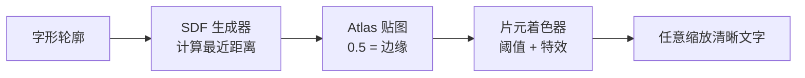

# SDF 渲染与 Shader 特效

> 所属计划: [[plan|Unity 字体系统学习计划]]
> 预计耗时: 90 min
> 前置知识: [[03-font-asset-creation-and-internals|Font Asset 创建与内部结构]]

---

## 1. 概念讲解

### 为什么需要 SDF？

传统的位图字体把每个字形预先光栅成像素颜色。放大时，边缘会出现锯齿；缩小时，细节又容易粘连。要在 UI 里同时显示大标题和小注释，通常需要准备多套字号图集，包体和内存都不划算。

**Signed Distance Field（SDF）** 把“颜色”换成“距离”：图集中的每个像素存储的是该点到最近字形轮廓的**有符号距离**。这样着色器可以在运行时按任意缩放重新决定边缘位置，从而得到始终锐利的文字。


### 核心思想

#### 1.1 距离场里存的是什么？

- 字形**内部**的点：到轮廓的距离为正。
- 字形**外部**的点：距离为负。
- 距离等于 `0` 的点正好落在字形边缘。

由于贴图只能存 `0..1` 的灰度，TextMeshPro 把距离线性映射到贴图像素：

- `0.5` 对应距离 `0`，也就是字形边缘。
- `> 0.5` 在字形内部。
- `< 0.5` 在字形外部。

贴图中的“灰度”并不是字形的半透明颜色，而是距离值。直接用眼睛看 atlas 会觉得是一片模糊的 blob——这正是正确结果。

#### 1.2 片元着色器如何恢复边缘？

采样得到距离 `d` 后，用平滑阈值把它转成 alpha：

$$
\alpha = \text{smoothstep}(0.5 - \sigma,\ 0.5 + \sigma,\ d)
$$

其中 `σ` 是像素在距离场中跨越的宽度，通常用 `fwidth(d)` 或屏幕空间导数估算。放大时 UV 变化慢，`σ` 变小，边缘更锐利；缩小时 `σ` 变大，边缘自然抗锯齿。

> [!note] 用 `0.5` 而不是 `0` 做阈值
> 这是 TextMeshPro 的具体编码约定。通用 SDF 教材里常说“距离为 0 是边缘”，在 TMP 的贴图里它被偏移到了 `0.5`。写 shader 时要按实际编码处理。

#### 1.3 Atlas 生成模式

在 Font Asset Creator 的 **Render Mode** 中，SDF 相关选项如下：

| 模式 | 说明 | 质量 | 生成速度 | 适用场景 |
|------|------|------|---------|---------|
| `SDF` | 基础有符号距离场 | 中 | 快 | 简单字形、快速预览 |
| `SDFAA` | 带抗锯齿的 SDF，默认选项 | 中高 | 较快 | 动态图集、通用 UI |
| `SDFAA_HINTED` | `SDFAA` + hinting | 中高 | 较快 | 小字号屏幕对齐 |
| `SDF8` | 8× 超采样生成距离场 | 高 | 较慢 | 标题、复杂西文 |
| `SDF16` | 16× 超采样 | 很高 | 慢 | 细节丰富的 CJK、艺术字 |
| `SDF32` | 32× 超采样 | 最高 | 很慢 | 超大字号、静态精品 |

超采样倍数越高，生成阶段对笔画端点、衬线、尖锐拐角的刻画越精确，但生成时间显著增加。**动态图集默认使用 `SDFAA`**，以控制运行时光栅化开销；静态标题或 CJK 资源可以选 `SDF16` / `SDF32`。

#### 1.4 Padding 与采样尺寸的比例

Padding 是 glyph 在 atlas 中四周预留的空白像素，有两个作用：

1. 给距离场留下足够的过渡区，避免贴到相邻字形。
2. 为 Outline、Glow、Shadow 等特效提供“可扩展”的距离范围。

经验比例是：

$$
\frac{\text{Sampling Point Size}}{\text{Padding}} \approx 10:1
$$

例如采样尺寸 `72`，padding 取 `6~8`；采样尺寸 `36`，padding 取 `3~4`。如果 padding 过小：

- 距离梯度会在几像素内从 `0` 跳到 `1`，放大或加粗描边时边缘变硬、出现锯齿。
- 相邻 glyph 的距离场可能互相渗透，产生“隔壁字形的光晕”或轮廓缺口。
- Outline / Glow 范围受限于 atlas 空白，超过 padding 对应的距离后会被裁切。

> [!warning] Padding 不是越大越好
> 过大的 padding 会浪费图集空间、降低 texel 利用率；过小的 padding 会直接破坏特效。保持 `10:1` 左右，并根据实际特效宽度微调。

### 内置 TMP Shader 概览

TextMeshPro 提供了一套按功能分类的 shader。了解它们能避免“用错 shader 导致特效不生效”。

| Shader | 主要用途 | 关键特性 |
|--------|---------|---------|
| `TextMeshPro/SDF` | 3D / 世界空间文字 | 完整支持面、描边、阴影、发光、倾斜、面纹理 |
| `TextMeshPro/SDF (Surface)` | 需要受光照的文字 | 基于物理的表面，支持法线贴图、环境光、镜面高光 |
| `TextMeshPro/SDF Overlay` | 屏幕空间覆盖 | 关闭深度测试，渲染在最上层，适合做提示文字 |
| `TextMeshPro/Mobile/Distance Field` | 移动平台 | 裁剪部分高级特性，减少指令数和寄存器压力 |
| `TextMeshPro/Bitmap` | 位图字体 | 直接采样颜色贴图，不支持 SDF 缩放，适合像素风 |

### Outline / Underlay / Glow / Bevel 是怎么实现的？

这些特效全部建立在“我们已经知道每个片元到字形边缘的距离”这一基础上。

#### 描边（Outline）

在边缘两侧的一定距离区间内叠加描边色：

```hlsl
float outlineEdge = 0.5 - _OutlineWidth * 0.5;
float outline = smoothstep(outlineEdge - soft, outlineEdge + soft, d) * (1 - face);
```
`face` 是字形内部 alpha，`outline` 是轮廓环。两者混合后得到带描边的字形。

#### 阴影 / Underlay

把 UV 按阴影偏移向量平移后再次采样距离场，得到“偏移后的字形”。把它作为阴影层混合在原字形下方即可：

```hlsl
float dShadow = tex2D(_MainTex, i.uv - _UnderlayOffset).a;
float shadowAlpha = smoothstep(0.5 - soft, 0.5 + soft, dShadow);
```
TMP 的 `Underlay` 和 `Drop Shadow` 本质相同，只是 UI 和世界空间 shader 的命名不同。

#### 发光（Glow）

Glow 是只向外扩展的软描边。它用更大的距离区间和渐变衰减：

```hlsl
float glow = smoothstep(0.5 - _GlowOffset - _GlowOuter, 0.5 - _GlowOffset, d);
```
通常还会加上 `pow` 或颜色乘法让光晕更柔和。

#### 斜面（Bevel）

Bevel 模拟光照浮雕。距离场的屏幕空间梯度 `float2(ddx(d), ddy(d))` 可以近似表面法线。用它和光源方向做点积，得到高光和暗部：

```hlsl
float2 grad = float2(ddx(d), ddy(d));
float3 normal = normalize(float3(-grad, 1));
float lit = dot(normal, _LightDir);
```
`lit > 0` 的一侧加亮，`lit < 0` 的一侧压暗，配合 face color 就能出现立体效果。

---

## 2. 代码示例

下面的 shader 基于 `TextMeshPro/SDF` 的距离场采样方式，但去掉了不常用的光照与 UI 裁剪支持，只保留最核心的 SDF 阈值、描边和动态渐变。这样代码短、容易看懂，也足够在 3D `TextMeshPro` 上运行。

```shaderlab
Shader "Custom/TMP SDF Gradient Outline"
{
    Properties
    {
        _MainTex("Font Atlas", 2D) = "white" {}
        _FaceColor("Face Color", Color) = (1, 1, 1, 1)
        _OutlineWidth("Outline Width", Range(0, 1)) = 0.15
        _OutlineColor1("Outline Start", Color) = (1, 0, 0, 1)
        _OutlineColor2("Outline End", Color) = (0, 0, 1, 1)
        _GradientSpeed("Gradient Speed", Float) = 1.0
        _GradientScale("Gradient UV Scale", Float) = 4.0
        _Sharpness("Anti-Alias Scale", Float) = 2.0
    }

    SubShader
    {
        Tags
        {
            "Queue" = "Transparent"
            "IgnoreProjector" = "True"
            "RenderType" = "Transparent"
        }

        LOD 100
        Cull Off
        Lighting Off
        ZWrite Off
        Blend SrcAlpha OneMinusSrcAlpha

        Pass
        {
            CGPROGRAM
            #pragma vertex vert
            #pragma fragment frag
            #include "UnityCG.cginc"

            sampler2D _MainTex;
            float4 _MainTex_ST;
            fixed4 _FaceColor;
            fixed4 _OutlineColor1;
            fixed4 _OutlineColor2;
            float _OutlineWidth;
            float _GradientSpeed;
            float _GradientScale;
            float _Sharpness;

            struct appdata
            {
                float4 vertex : POSITION;
                fixed4 color : COLOR;
                float2 uv : TEXCOORD0;
            };

            struct v2f
            {
                float4 vertex : SV_POSITION;
                fixed4 color : COLOR;
                float2 uv : TEXCOORD0;
            };

            v2f vert(appdata v)
            {
                v2f o;
                o.vertex = UnityObjectToClipPos(v.vertex);
                o.uv = TRANSFORM_TEX(v.uv, _MainTex);
                o.color = v.color;
                return o;
            }

            fixed4 frag(v2f i) : SV_Target
            {
                // TMP 的 SDF atlas 把距离编码在 alpha 通道。
                // 如果未来使用红色通道存储距离的 atlas，把 .a 改成 .r。
                float d = tex2D(_MainTex, i.uv).a;

                // 用屏幕空间导数估算当前像素跨越的距离宽度，实现动态抗锯齿。
                float smoothing = fwidth(d) * _Sharpness;

                // 字形内部 alpha：距离 > 0.5 的部分逐渐变为不透明。
                float face = smoothstep(0.5 - smoothing, 0.5 + smoothing, d);

                // 描边只出现在边缘外侧一定距离内。
                float outlineEdge = 0.5 - _OutlineWidth * 0.5;
                float outline = smoothstep(outlineEdge - smoothing, outlineEdge + smoothing, d);
                outline *= 1.0 - face;

                float alpha = saturate(face + outline);
                if (alpha <= 0.001)
                    discard;

                // 随时间沿 UV.x 方向流动的渐变。
                float t = frac(i.uv.x * _GradientScale + _Time.y * _GradientSpeed);
                float3 outlineCol = lerp(_OutlineColor1.rgb, _OutlineColor2.rgb, t);

                // 在描边与字面之间做颜色混合。
                float3 finalRGB = lerp(outlineCol, _FaceColor.rgb, face / (alpha + 1e-6));

                return fixed4(finalRGB * i.color.rgb,
                              alpha * _FaceColor.a * i.color.a);
            }
            ENDCG
        }
    }
}
```
C# 组件负责运行时创建材质实例，并把属性同步到 shader：

```csharp
using TMPro;
using UnityEngine;

[RequireComponent(typeof(TMP_Text))]
public class TMPGradientOutlineController : MonoBehaviour
{
    [Tooltip("使用 Custom/TMP SDF Gradient Outline shader 的材质")]
    public Material baseMaterial;

    [Range(0f, 1f)]
    public float outlineWidth = 0.15f;

    public float gradientSpeed = 0.5f;
    public Color faceColor = Color.white;
    public Color outlineStart = Color.red;
    public Color outlineEnd = Color.blue;

    private TMP_Text _text;
    private Material _runtimeMaterial;

    void Start()
    {
        _text = GetComponent<TMP_Text>();

        if (baseMaterial == null ||
            baseMaterial.shader.name != "Custom/TMP SDF Gradient Outline")
        {
            Debug.LogError("请挂载使用 Custom/TMP SDF Gradient Outline 的材质。");
            enabled = false;
            return;
        }

        // 实例化材质，避免修改 Project 中的原始 asset。
        _runtimeMaterial = new Material(baseMaterial);
        _runtimeMaterial.name = baseMaterial.name + " (Runtime)";

        // TMP_Text 的 fontSharedMaterial 对 3D 和 UI 版本都有效。
        _text.fontSharedMaterial = _runtimeMaterial;
    }

    void Update()
    {
        if (_runtimeMaterial == null) return;

        _runtimeMaterial.SetFloat("_OutlineWidth", outlineWidth);
        _runtimeMaterial.SetFloat("_GradientSpeed", gradientSpeed);
        _runtimeMaterial.SetColor("_FaceColor", faceColor);
        _runtimeMaterial.SetColor("_OutlineColor1", outlineStart);
        _runtimeMaterial.SetColor("_OutlineColor2", outlineEnd);
    }

    void OnDestroy()
    {
        if (_runtimeMaterial != null)
            Destroy(_runtimeMaterial);
    }
}
```
**运行方式：**

1. 在 Unity 2021.3+ 中新建 3D 场景，确保已安装 TextMeshPro（Package Manager → TextMeshPro）。
2. 创建 TMP Font Asset：`Window → TextMeshPro → Font Asset Creator`，选择中文字体或任意 `.ttf` / `.otf`，Render Mode 选 `SDFAA`，Sampling Point Size 取 `48`，Padding 取 `5`。
3. 右键 Project 面板 → Create → Shader → Unlit Shader，命名为 `TMP_SDF_GradientOutline`，把上面 shader 代码完整粘贴进去。
4. 创建 Material，Shader 选 `Custom/TMP SDF Gradient Outline`；把 Font Asset 的 Atlas Texture 拖到材质的 `Font Atlas` 槽。
5. 在场景中创建 `TextMeshPro - 3D` 对象，`Font Asset` 选刚才生成的 asset；附加 `TMPGradientOutlineController` 脚本，把第 4 步的材质拖到 `Base Material`。
6. 点击 Play，文字会显示随时间流动的红蓝渐变描边。

**预期输出：**

```text
文字主体为白色，边缘有一圈沿水平方向流动的红蓝渐变描边。
Outline Width 越大，描边越宽；Gradient Speed 控制颜色流动快慢。
```
> [!tip] 给 UI 版本使用
> 对 `TextMeshProUGUI` 同样适用：把脚本挂到带有 `TextMeshProUGUI` 的对象上即可，`TMP_Text` 是两者的公共基类。

---

## 3. 练习

### 练习 1: 观察 Padding 不足导致的 artifact（基础）

用同一个字体生成两个 Font Asset：

- Asset A：Sampling Point Size `48`，Padding `3`，Render Mode `SDFAA`。
- Asset B：Sampling Point Size `48`，Padding `10`，Render Mode `SDFAA`。

两个 asset 都用于上面的渐变描边 shader，并把 `Outline Width` 调到 `0.35`。把摄像机推近或把文字 Scale 放大到 `5x` 观察边缘。

要求：

1. 截图对比两个 asset 的描边边缘。
2. 解释 Asset A 可能出现的“硬边”或“相邻字形光晕”原因。
3. 给出让 Asset A 恢复正常的最小修改方案。

### 练习 2: 给 Shader 添加垂直内发光（进阶）

修改 `Custom/TMP SDF Gradient Outline` 的 fragment 函数，让字形**内部**靠近边缘的区域发出一层垂直方向的光晕：

- 光晕只在字形内部（`d > 0.5`）生效。
- 光晕范围由 `_GlowRange`（`Range(0, 1)`）控制。
- 光晕颜色是 `_GlowColor`。
- 越靠近边缘，光晕越强；字形中心保持 `_FaceColor` 不变。

要求：

1. 写出修改后的 Properties 和 fragment 代码。
2. 在 Inspector 里调整 `_GlowRange` 和 `_GlowColor`，验证中心不发光、边缘发光。

### 练习 3: 用距离场梯度实现 Bevel 高光（挑战，可选）

不依赖外部法线贴图，只用 `ddx(d)` 和 `ddy(d)` 计算距离场梯度，模拟一个从左上方向照射的点光源：

- 光源方向 `_LightDir` 用 `Properties` 暴露。
- 当片元面向光源时，face color 变亮；背向光源时，face color 变暗。
- 只在字形内部（`d > 0.5`）生效，避免背景被照亮。

要求：

1. 写出计算法线和光照的 shader 代码。
2. 在场景中旋转光源方向，观察浮雕效果变化。

---

## 3.5 参考答案

> [!tip]- 练习 1 参考答案
> 1. Asset A（Padding `3`）在放大或加大 Outline 后，描边会在达到 atlas 空白边界处被突然裁切，出现锯齿或“直角缺口”。
> 2. 相邻 glyph 的距离场只有 3 像素的过渡区，当 `Outline Width * padding` 超过可用距离时，shader 会采样到隔壁 glyph 的距离值，产生杂色光晕；同时 3 像素不足以表达平滑的 SDF 过渡，放大后边缘变硬。
> 3. 最小修改：把 Padding 提高到 `5`（采样尺寸 48，比例约 10:1），或者降低 `Outline Width` 到 `0.15` 以下；若需要更宽的特效，应同时提高 Padding 或换用更大 atlas。

> [!tip]- 练习 2 参考答案
> 在 Properties 末尾追加：
> ```shaderlab
> _GlowRange("Glow Range", Range(0, 1)) = 0.15
> _GlowColor("Glow Color", Color) = (1, 0.5, 0, 1)
> ```
> 在 `frag` 中，face 计算完成后加入：
> ```hlsl
> float glow = smoothstep(0.5, 0.5 + _GlowRange, d) * (1.0 - face);
> // 越靠近边缘越强：glow 在 d=0.5 时为 1，到 d=0.5+_GlowRange 时降为 0
> glow = 1.0 - glow;
> float3 glowCol = lerp(_FaceColor.rgb, _GlowColor.rgb, glow);
> float3 finalRGB = lerp(outlineCol, glowCol, face / (alpha + 1e-6));
> ```
> 注意 `glow` 只在 `face > 0` 的区域影响颜色，因此字形中心仍保持 face color。

> [!tip]- 练习 3 参考答案（可选）
> Properties 增加：
> ```shaderlab
> _LightDir("Light Direction", Vector) = (1, 1, 1, 0)
> _BevelStrength("Bevel Strength", Range(0, 1)) = 0.5
> ```
> 在 `frag` 中 face 计算后加入：
> ```hlsl
> float2 grad = float2(ddx(d), ddy(d));
> float3 normal = normalize(float3(-grad * 2.0, 1.0));
> float3 light = normalize(_LightDir.xyz);
> float lit = dot(normal, light); // -1 ~ 1
> float bevel = lit * _BevelStrength;
> float3 bevelCol = _FaceColor.rgb * (1.0 + bevel);
> float3 finalRGB = lerp(outlineCol, bevelCol, face / (alpha + 1e-6));
> ```
> 为了让高光和暗部更夸张，可以把 `bevel` 做 `smoothstep(-0.2, 0.2, lit)` 分段，再分别乘高光色和阴影色。

> [!note] 答案使用方式
> 先独立完成练习，再展开查看参考答案。参考答案不是唯一解——如果你的实现通过了测试或达到了题目要求，就是正确的。

---

## 4. 扩展阅读

- [TextMeshPro Font Asset Creator](https://docs.unity3d.com/Packages/com.unity.textmeshpro@3.2/manual/FontAssetsCreator.html)
- [TextMeshPro About SDF Fonts](https://docs.unity3d.com/Packages/com.unity.textmeshpro@3.2/manual/FontAssetsSDF.html)
- [TextMeshPro Shaders](https://docs.unity3d.com/Packages/com.unity.textmeshpro@3.2/manual/Shaders.html)
- [UI Toolkit Text Best Practices](https://docs.unity3d.com/Manual/best-practice-guides/ui-toolkit-for-advanced-unity-developers/text.html)
- [MSDF: Multi-channel Signed Distance Fields](https://github.com/Chlumsky/msdfgen)（社区方案，可进一步消除 SDF 在尖角的模糊）

---

## 常见陷阱

- **把 SDF atlas 当普通灰度图调色**：atlas 里的灰度是距离，不是颜色。用 Photoshop 调对比度会破坏距离场的连续性，导致渲染边缘错位。
- **Padding 设置和采样尺寸脱钩**：采样 `72` 却配 `2` 的 padding，特效稍大就会穿帮。遵循 `10:1` 比例并观察实际放大效果。
- **Outline Width 超过 padding 能表达的范围**：`Outline Width` 是归一化值，它乘以 padding 才是实际像素宽度。超过 padding 后shader 会采样到图集外或相邻 glyph。
- **直接修改 `fontMaterial` 导致全局文字变化**：应该像示例那样 `new Material(baseMaterial)` 做实例化，再赋给 `fontSharedMaterial`。
- **采样错通道**：TMP SDF atlas 默认把距离存在 **alpha** 通道。如果写 `.r` 而 atlas 不是 R8 格式，会得到错误边缘。
- **在 UI 上忘记处理 clip rect**：示例 shader 为了简洁没有实现 `UNITY_UI_CLIP_RECT`。若要在 ScrollView / Mask 下使用，需要额外裁剪逻辑，或直接使用内置 `TextMeshPro/SDF` 并只改 material property。
- **混淆 Render Mode 的用途**：小字号、像素风用 Bitmap；需要任意缩放的标题用 SDF。把 `SDF32` 用于动态聊天文字会让运行时光栅化变慢。
